# description

This code reads in the raw data and writes out cleaned data files. The raw data is not in the github repo, but all of the cleaned data files are saved to the data subfolder.

# Set basic info for all code

This chunk sets things that will be constant for the whole document.

Load packages: \


``` r
#setup code here

# read in packages
library(dplyr)
library(ggplot2)
library(tidyr)
library(rcompanion)
```

Make functions: \


``` r
# prep for doing statistical analyses
options(contrasts = c("contr.sum", "contr.poly"))

# for exploring transformations
explore_trans <- function(trait){
  plotNormalHistogram(trait)
  plotNormalHistogram(log10(trait))
  plotNormalHistogram(exp(trait))
  plotNormalHistogram(sqrt(trait))
  # want the one with the largest value
  print(shapiro.test(trait))
  print(shapiro.test(log10(trait)))
  print(shapiro.test(exp(trait)))
  print(shapiro.test(sqrt(trait))) 
}

# standard error of the mean
std_mean <- function(x){
  sd(x, na.rm = TRUE)/sqrt(length(x))
}

# Confidence interval multiplier for standard error
    # Calculate t-statistic for confidence interval: 
    # e.g., if conf.interval is .95, use .975 (above/below), and use df=N-1

conf_int <- function(x, conf.interval = 0.95){
  ciMult <- qt((1+conf.interval)/2, length(x)-1)
  ci <- std_mean(x) * ciMult
  return(ci)
}
```


# 2021
## Load in Data
Raw Data files not on github.


``` r
SingleLeaf <- read.csv("C:/Users/Sophie/OneDrive - Michigan State University/Arabidopsis/Swe_Italy/Pilot/RawData/SingleLeaf_green.csv")
Harv_blue <- read.csv("C:/Users/Sophie/OneDrive - Michigan State University/Arabidopsis/Swe_Italy/Pilot/RawData/Harvest_blue.csv")
Harv_pink <- read.csv("C:/Users/Sophie/OneDrive - Michigan State University/Arabidopsis/Swe_Italy/Pilot/RawData/Harvest_pink_ImageJ.csv")
LeafNum <- read.csv("C:/Users/Sophie/OneDrive - Michigan State University/Arabidopsis/Swe_Italy/Pilot/RawData/Leaf Number_yellow.csv")
Phenology <-read.csv("C:/Users/Sophie/OneDrive - Michigan State University/Arabidopsis/Swe_Italy/Pilot/RawData/Phenology.csv")
PlantingDay <- read.csv("C:/Users/Sophie/OneDrive - Michigan State University/Arabidopsis/Swe_Italy/Pilot/RawData/PlantingDay.csv")
```

## Clean up data

The goal of this code is to identify any entering errors and fix them, go through the notes and remove any traits that may not be accurate (i.e., if a plant was dropped or otherwise damaged before harvest), and create one data frame that includes all trait information for all individuals.

Note: There was a labelling error that is fixed later on. IT RIL Parent seeds ordered from the stock center were labelled as B1 instead of the correct B12. This is fixed below. Fixed labels were given unique IDs so they did not overlap with already existing labels and could be identified later.


``` r
# there were steps to put things in notes columns and make sure NAs were missing values and zeros were zeros prior to this step that were done in excel.

Harv_blue <- Harv_blue[!(is.na(Harv_blue$Line)), c(1:14)]
colnames(Harv_blue) <- c("Population", "Line", "Replicate", "Treatment", "Pot.ID", "Harvest.Date", "RosetteLeafNum", "FreshRosetteG", "DryRosetteG", "FreshReproG", "DryReproG", "FreshRootG", "DryRootG", "Notes")

# calculate some other traits
# root to shoot ratio is the root mass devided by all above ground biomass (dry)
Harv_blue$Root_to_Shoot <- Harv_blue$DryRootG/(Harv_blue$DryRosetteG + Harv_blue$DryReproG)
# reproducive to rosette is the reproductive weight divided by the rosette weight. Decided to go this way so that a higher value indicates more investment in 
# reproductive tissue relative to the rosette weight it has
Harv_blue$Repro_to_Ros <- Harv_blue$DryReproG / Harv_blue$DryRosetteG

# fix envelope labelling mistake and fill in with accurate values; while there was a mistake here, my lab notebook says " I put some of the R47-1-C reproductive in the R21-1-C reproductive envelope. I could kind of fix it, but R47-1 might be low and R21-1 might be high so I should discard both of these reproductive weights. Thus, commenting out these lines.
#Harv_blue[Harv_blue$Pot.ID == "R21-1-C", "DryReproG"] <- 2.0414
#Harv_blue[Harv_blue$Pot.ID == "R47-1-C", "DryReproG"] <- 1.2501

#R35-2-C was dropped before flowering (on 10/14) so I am dropping the value on anything collected post the drop.
Harv_blue <- Harv_blue[!(Harv_blue$Pot.ID == "R35-2-C"), ]

colnames(Harv_pink) <- c("Population", "Line", "Replicate", "Treatment", "Pot.ID", "IJ_FruitCount", "FruitCounter", "BranchStructure", "LatBranches", "PrimaryStalks", "Height_cm", "TotFruit", "FruitCollected", "FruitColLocation", "DoneFlwr", "NumFlwrLeft", "Notes", "FruitColWt_mg", "SeedColWt_mg", "ScanPosition", "ScanPhotoName", "IJ_SeedCount", "SeedCounter", "FruitCount_BL", "Notes2")

# remove extra rows in .csv + R35-2-C
Harv_pink <- Harv_pink[!(is.na(Harv_pink$Line)), ]
Harv_pink <- Harv_pink[!(Harv_pink$Pot.ID == "R35-2-C"), ]

LeafNum <- LeafNum[!(is.na(LeafNum$Weigh.Order)), c(1:18)]

Phenology <- Phenology[!(is.na(Phenology$Weigh.Order)), c(1:12)]
Phenology[Phenology$Pot.ID == "R35-2-C", "Flowering"] <- NA
# fix data entry error
Phenology[Phenology$Pot.ID == "R35-1-C", "Bolting"] <- "10/12/2021"

PlantingDay <- PlantingDay[c(1:150), c(1:18)]

rm_these <- c("B13-2-CF", "B3-2-CF", "R35-2-C") # remove doubles (B13-2-CF from 9/22, B3-2-CF from 9/22, R35-2-C b/c dropped before flowering so I am dropping the value on anything collected post the drop
SingleLeaf <- SingleLeaf[!(SingleLeaf$Pot.ID %in% rm_these), ]
# then rename the doubles so they will merge correctly
SingleLeaf[SingleLeaf$Pot.ID == "B13-2-CF2", "Pot.ID"] <- "B13-2-CF"
SingleLeaf[SingleLeaf$Pot.ID == "B3-2-CF2", "Pot.ID"] <- "B3-2-CF"
# and get rid of extra rows at the end
SingleLeaf <- SingleLeaf[!(is.na(SingleLeaf$Line)), ]

# Calculate other traits
# SLA = leaf area / leaf dry mass
SingleLeaf$SLA <- SingleLeaf$LeafArea/SingleLeaf$DriedWt_g
# LDMC = dry mass / saturated mass
SingleLeaf$LDMC = SingleLeaf$DriedWt_g / SingleLeaf$SatWt_g
# RWC = (fresh mass - dry mass) / (saturated mass - dry mass)
### Note: this is the one that would be impacted by not always collecting the leaves at the same time of day
SingleLeaf$RWC = (SingleLeaf$FreshWt_g - SingleLeaf$DriedWt_g) / (SingleLeaf$SatWt_g - SingleLeaf$DriedWt_g)
```

At this point, sorted each dataframe by values to identify any high or low outliers. Did not find anything that was attributed to data entry errors. Also went through the notes columns to see if anything should be removed. 

Fruit counts seem inconsistent. Near end of harvesting realized that clicker used to count fruits was skipping 10 or even 100 sometimes. Went back to images and recounted fruits in ImageJ, but some of these seem very different (196 initially and then 973 from ImageJ) so concerned about accuracy of that value as well.

Leaf number is also variable with some counted at bolting and some at flowering so may need to toss that trait.

B4-1-CF has a new emergent on 8/31/2024 but it was dead by bolting so don't need to remove anything.

## Merge together

Now, merge data frames together


``` r
AllData_2021 <- merge(PlantingDay, Phenology, by = c("Pot.ID", "Population", "Line", "Replicate", "Treatment"), all = TRUE)
AllData_2021 <- merge(AllData_2021, SingleLeaf, by = c("Pot.ID", "Population", "Line", "Replicate", "Treatment"), all = TRUE)
AllData_2021 <- merge(AllData_2021, LeafNum, by = c("Pot.ID", "Population", "Line", "Replicate", "Treatment"), all = TRUE)
AllData_2021 <- merge(AllData_2021, Harv_blue, by = c("Pot.ID", "Population", "Line", "Replicate", "Treatment"), all = TRUE)
```

```
## Warning in merge.data.frame(AllData_2021, Harv_blue, by = c("Pot.ID",
## "Population", : column names 'Notes.x', 'Notes.y' are duplicated in the result
```

``` r
AllData_2021 <- merge(AllData_2021, Harv_pink, by = c("Pot.ID", "Population", "Line", "Replicate", "Treatment"), all = TRUE)
```

```
## Warning in merge.data.frame(AllData_2021, Harv_pink, by = c("Pot.ID",
## "Population", : column names 'Notes.x', 'Notes.y' are duplicated in the result
```

``` r
# there's lots of notes columns at this point but that is okay.
# notes column names are repeated

# remove weigh.order columns b/c not relevant here
AllData_2021$Weigh.Order.x <- NULL
AllData_2021$Weigh.Order.y <- NULL

# fix Pot.ID labelling error
# Pop = BELM
# Line = 1 - change to 12
# Rep = 1:5 - change to 11:15
# need to change Pot.IDs
change.these <- c("B1-1-C", "B1-1-CF", "B1-1-F", "B1-2-C", "B1-2-CF", "B1-2-F", "B1-3-C", "B1-3-CF", "B1-3-F", "B1-4-C", "B1-4-CF", "B1-4-F", "B1-5-C", "B1-5-CF", "B1-5-F")
AllData_2021[AllData_2021$Pot.ID %in% change.these, "Line"] <- 12
AllData_2021[AllData_2021$Pot.ID %in% change.these & AllData_2021$Replicate == 1, "Replicate"] <- 11
AllData_2021[AllData_2021$Pot.ID %in% change.these & AllData_2021$Replicate == 2, "Replicate"] <- 12
AllData_2021[AllData_2021$Pot.ID %in% change.these & AllData_2021$Replicate == 3, "Replicate"] <- 13
AllData_2021[AllData_2021$Pot.ID %in% change.these & AllData_2021$Replicate == 4, "Replicate"] <- 14
AllData_2021[AllData_2021$Pot.ID %in% change.these & AllData_2021$Replicate == 5, "Replicate"] <- 15
AllData_2021[AllData_2021$Pot.ID %in% change.these, "Pot.ID"] <- c("B12-11-C", "B12-11-CF", "B12-11-F", "B12-12-C", "B12-12-CF", "B12-12-F", "B12-13-C", "B12-13-CF", "B12-13-F", "B12-14-C", "B12-14-CF", "B12-14-F", "B12-15-C", "B12-15-CF", "B12-15-F")

str(AllData_2021)
```

```
## 'data.frame':	150 obs. of  79 variables:
##  $ Pot.ID                          : chr  "B12-11-C" "B12-11-CF" "B12-11-F" "B12-12-C" ...
##  $ Population                      : chr  "BELM" "BELM" "BELM" "BELM" ...
##  $ Line                            : chr  "12" "12" "12" "12" ...
##  $ Replicate                       : chr  "11" "11" "11" "12" ...
##  $ Treatment                       : chr  "Current" "Current/Future" "Future" "Current" ...
##  $ pot.labelled.                   : chr  "yes" "yes" "yes" "yes" ...
##  $ Labelled.Pot.Weight..g.         : chr  "6.817" "6.443" "6.859" "6.64" ...
##  $ Pot...dry.Soil.Weight..g.       : chr  "56.8417" "56.493" "56.413" "56.914" ...
##  $ Soil.Added.Weight..g.           : chr  "50.0247" "50.05" "49.554" "50.274" ...
##  $ Soil.Mix.Batch.Number.x         : chr  "1" "1" "1" "4" ...
##  $ Pot...wet.soil.weight..g.       : chr  "180.05" "176.53" "185.43" "157.72" ...
##  $ Water.weight..g.                : chr  "123.21" "120.04" "129.02" "100.81" ...
##  $ H20.g....soil..g.               : chr  "2.46" "2.40" "2.60" "2.01" ...
##  $ First.Calc.of.FC.weight         : chr  "120.77" "120.83" "119.63" "121.37" ...
##  $ oven.dried.soil..g.             : chr  "22.86" "22.87" "22.64" "22.97" ...
##  $ oven.dried.soil...empty.pot..W0.: chr  "29.68" "29.31" "29.50" "29.61" ...
##  $ g.H20.at.FC..wf.W0.equivalent.  : num  144 144 142 144 144 ...
##  $ Notes.x                         : chr  "" "" "" "" ...
##  $ Soil.Mix.Batch.Number.y         : chr  "1" "1" "1" "4" ...
##  $ Emergence                       : chr  "6/29/2021" "6/28/2021" "6/27/2021" "7/7/2021" ...
##  $ notes.x                         : chr  "" "" "" "this one just seems strange\x85 maybe just super late? Starting to water triggered germ?" ...
##  $ Bolting                         : chr  "9/16/2021" "9/13/2021" "9/14/2021" "9/17/2021" ...
##  $ Flowering                       : chr  "10/1/2021" "9/21/2021" "9/28/2021" "10/3/2021" ...
##  $ Wilted_Died                     : chr  "" "" "" "" ...
##  $ Leaf_Collected                  : chr  "10/1/2021" "9/22/2021" "9/28/2021" "10/3/2021" ...
##  $ FreshWt_g                       : num  0.1012 0.0173 0.0249 0.0543 0.0076 ...
##  $ SatWt_g                         : num  0.1171 0.0214 0.0297 0.0619 0.0107 ...
##  $ DriedWt_g                       : num  0.0079 0.0025 0.0036 0.0047 0.00107 0.0041 0.0094 0.0045 0.0038 0.0068 ...
##  $ Notes.y                         : chr  "" "open 9/23; no scale in photo" "" "" ...
##  $ LeafArea                        : num  5.25 0.999 1.376 3.121 0.57 ...
##  $ LeafPerimeter                   : num  16.01 5.85 7.19 12.27 4.31 ...
##  $ Scale..pixels.cm.               : chr  "" "" "" "" ...
##  $ Notes.1                         : chr  "" "converted" "" "" ...
##  $ SLA                             : num  665 400 382 664 533 ...
##  $ LDMC                            : num  0.0675 0.1168 0.1212 0.0759 0.1 ...
##  $ RWC                             : num  0.854 0.783 0.816 0.867 0.678 ...
##  $ LeafNum_.07222021               : int  6 5 9 4 2 10 6 8 10 6 ...
##  $ Notes.x                         : chr  "" "" "" "" ...
##  $ LeafNum_08262021                : int  17 15 18 10 7 22 15 20 22 18 ...
##  $ NumRemoved_08262021             : chr  "n" "n" "n" "n" ...
##  $ RosetteLeafNum_10042021         : num  22 23 27 15 16 28 22 23 30 22 ...
##  $ StalkLeafNum_10042021           : num  29 24 29 6 17 10 22 35 29 25 ...
##  $ notes.y                         : chr  "7 on lateral shoots" "" "" "flower 10/3" ...
##  $ RosetteLeafNum_bolt             : num  NA NA NA NA NA NA NA NA NA NA ...
##  $ notes.1                         : chr  "" "" "" "" ...
##  $ RosetteLeafNum_Flower           : num  NA NA NA NA NA NA NA NA NA NA ...
##  $ StalkLeafNum_Flower             : num  NA NA NA NA NA NA NA NA NA NA ...
##  $ notes.2                         : chr  "flowered 10/1" "flowered 9/21" "flowered 9/29" "" ...
##  $ Harvest.Date                    : chr  "11/16/2021" "11/5/2021" "11/3/2021" "11/16/2021" ...
##  $ RosetteLeafNum                  : int  22 25 27 14 15 30 21 23 30 20 ...
##  $ FreshRosetteG                   : chr  "1.35" "0.2267" "0.5896" "-" ...
##  $ DryRosetteG                     : num  0.1915 0.0514 0.0873 0.0816 0.016 ...
##  $ FreshReproG                     : chr  "-" "0.5091" "0.939" "-" ...
##  $ DryReproG                       : num  1.5509 0.1424 0.2453 0.9884 0.0889 ...
##  $ FreshRootG                      : chr  "0.86" "-" "-" "-" ...
##  $ DryRootG                        : num  0.114 NA NA NA NA ...
##  $ Notes.y                         : chr  "" "" "" "" ...
##  $ Root_to_Shoot                   : num  0.0653 NA NA NA NA ...
##  $ Repro_to_Ros                    : num  8.1 2.77 2.81 12.12 5.56 ...
##  $ IJ_FruitCount                   : int  797 110 144 550 58 209 807 127 141 853 ...
##  $ FruitCounter                    : chr  "TM" "TM" "TM" "TM" ...
##  $ BranchStructure                 : chr  "broken" "leaning" "bent" "leaning" ...
##  $ LatBranches                     : int  6 7 8 6 5 8 6 5 8 6 ...
##  $ PrimaryStalks                   : int  9 7 5 8 3 9 14 1 9 11 ...
##  $ Height_cm                       : num  54.5 21.5 30 57.5 NA 20.5 54 23 23 59 ...
##  $ TotFruit                        : chr  "878" "124" "151" "584" ...
##  $ FruitCollected                  : int  10 10 10 10 10 10 10 10 10 10 ...
##  $ FruitColLocation                : chr  "15,17,21,23,25,27,29,32,2 on sides" "2 on sides,6,21,22,30,32,35,37,39" "11,14,16,18,19,15,22,24,26,29" "11,13,15,17,19,21,23,25,27,29" ...
##  $ DoneFlwr                        : chr  "n" "y" "y" "y" ...
##  $ NumFlwrLeft                     : chr  "13" "0" "0" "0" ...
##  $ Notes                           : chr  "broken branch is not drying; 3 additional primary stalks had no flowers and were not counted" "all small fruits; 4 branches are just started; 6 primary stalks noted as tiny" "4 pirmary stalks noted as tiny; 3 noted as no flower and not counted" "" ...
##  $ FruitColWt_mg                   : num  19.6 11 19.4 21.3 13.6 ...
##  $ SeedColWt_mg                    : num  12.83 4.42 13.49 13.2 7.86 ...
##  $ ScanPosition                    : chr  "9" "1" "12" "10" ...
##  $ ScanPhotoName                   : chr  "4" "6" "10" "4" ...
##  $ IJ_SeedCount                    : int  504 266 538 523 364 420 378 510 432 531 ...
##  $ SeedCounter                     : chr  "" "CH" "SB" "" ...
##  $ FruitCount_BL                   : int  833 NA 150 567 NA 210 887 NA 144 969 ...
##  $ Notes2                          : chr  "KB assumed" "" "552 was old count (no initials) - weird that this and 10-11 are identical but I double checked it" "KB assumed" ...
```

``` r
# and write this out
write.csv(AllData_2021,"data/AllData_2021.csv", row.names = FALSE)

#note NumRemoved_08262021 -> I can use this column to only include things that were still alive after 8/26. if y in this column, pot was dead/removed on this date. If "n", then plant alive and kept
```


Now clean up environment

``` r
rm("Harv_blue", "Harv_pink", "LeafNum", "Phenology", "PlantingDay", "SingleLeaf", "change.these", "rm_these")
```

Now clean up AllData dataframe

``` r
# first make some factors
AllData_2021$Population <- as.factor(AllData_2021$Population)
AllData_2021$Treatment <- as.factor(AllData_2021$Treatment)
AllData_2021$Soil.Mix.Batch.Number.x <- as.factor(AllData_2021$Soil.Mix.Batch.Number.x)
AllData_2021$BranchStructure <- as.factor(AllData_2021$BranchStructure)
AllData_2021$DoneFlwr <- as.factor(AllData_2021$DoneFlwr)
AllData_2021$FruitCounter <- as.factor(AllData_2021$FruitCounter)
AllData_2021$SeedCounter <- as.factor(AllData_2021$SeedCounter)

# and some num
AllData_2021$TotFruit <- as.numeric(AllData_2021$TotFruit) # forces columns with "some fruit" or similar to NA which is OK because these were harvested early (root washed)
```

```
## Warning: NAs introduced by coercion
```

``` r
sum(is.na(AllData_2021$NumFlwrLeft))
```

```
## [1] 22
```

``` r
# expect 10 more
AllData_2021$NumFlwrLeft <- as.numeric(AllData_2021$NumFlwrLeft)
```

```
## Warning: NAs introduced by coercion
```

``` r
sum(is.na(AllData_2021$NumFlwrLeft))
```

```
## [1] 32
```

``` r
# format as dates, calculated from planting day
AllData_2021$Emergence <- julian(as.Date(AllData_2021$Emergence, "%m/%d/%Y"), origin = as.Date("2021-06-24"))
AllData_2021$Bolting <- julian(as.Date(AllData_2021$Bolting, "%m/%d/%Y"), origin = as.Date("2021-06-24"))
AllData_2021$Flowering <- julian(as.Date(AllData_2021$Flowering, "%m/%d/%Y"), origin = as.Date("2021-06-24"))
AllData_2021$Wilted_Died <- julian(as.Date(AllData_2021$Wilted_Died, "%m/%d/%Y"), origin = as.Date("2021-06-24"))
AllData_2021$Leaf_Collected <- julian(as.Date(AllData_2021$Leaf_Collected, "%m/%d/%Y"), origin = as.Date("2021-06-24"))
AllData_2021$Harvest.Date <- julian(as.Date(AllData_2021$Harvest.Date, "%m/%d/%Y"), origin = as.Date("2021-06-24"))

# Calculate the days between each phenological timepoint
# days to bolt - days to emergence
AllData_2021$DayToBolt = AllData_2021$Bolting - AllData_2021$Emergence

# days to flower - days to bolt
AllData_2021$DayToFlwr = AllData_2021$Flowering - AllData_2021$Bolting

# days to flower - day to emergence
AllData_2021$EmergeToFlwr <- AllData_2021$Flowering - AllData_2021$Emergence

# make a separate notes dataframe
Notes <- AllData_2021[, c("Pot.ID", "Population", "Line", "Replicate", "Treatment", "Notes.x", "notes.x", "Notes.y", "Notes.1", "Notes.x", "notes.y","notes.1", "notes.2", "Notes.y", "Notes", "Notes2")]

# then remove the notes columns for this part
CleanData_2021 <- AllData_2021
CleanData_2021$Notes.x <- NULL
CleanData_2021$notes.x <- NULL
CleanData_2021$Notes.y <- NULL
CleanData_2021$Notes.1 <- NULL
CleanData_2021$Notes.x <- NULL
CleanData_2021$notes.y <- NULL
CleanData_2021$notes.1 <- NULL
CleanData_2021$notes.2 <- NULL
CleanData_2021$Notes.y <- NULL
CleanData_2021$Notes <- NULL
CleanData_2021$Notes2 <- NULL

# add zeros to TotFruit so it is a better measure of fitness and includes the plants that died.Keep NA if is a missing value only (plants root harvested or missed). Way of doing this is that if it is an NA in harvest date, make a 0 for fruit columns
CleanData_2021$TotFruit[is.na(CleanData_2021$Harvest.Date)] <- 0
CleanData_2021$IJ_FruitCount[is.na(CleanData_2021$Harvest.Date)] <- 0
CleanData_2021$FruitCount_BL[is.na(CleanData_2021$Harvest.Date)] <- 0

# Also remove columns that won't be used in analysis. Here is a list of columns names to keep. Some of these leaf number counts might not be used later on, but keep at this point in time.
myCols <- c("Pot.ID", "Population", "Line", "Replicate", "Treatment", "Soil.Mix.Batch.Number.x", "Emergence","DayToBolt", "DayToFlwr", "EmergeToFlwr", "FreshWt_g", "SatWt_g", "DriedWt_g", "LeafArea", "LeafPerimeter", "SLA", "LDMC", "RWC", "LeafNum_.07222021", "LeafNum_08262021","NumRemoved_08262021", "RosetteLeafNum_10042021", "RosetteLeafNum_bolt", "RosetteLeafNum_Flower", "RosetteLeafNum", "DryRosetteG", "DryReproG", "DryRootG", "Root_to_Shoot", "Repro_to_Ros", "BranchStructure", "LatBranches", "PrimaryStalks", "Height_cm", "TotFruit", "IJ_FruitCount", "FruitCounter", "FruitCollected", "DoneFlwr","NumFlwrLeft","FruitColWt_mg","SeedColWt_mg", "IJ_SeedCount", "SeedCounter", "FruitCount_BL")

CleanData_2021 <- CleanData_2021[ ,myCols]

# add another trait: Above ground biomass
CleanData_2021$AG_biomass <- CleanData_2021$DryRosetteG + CleanData_2021$DryReproG
```

## Transformations

This code is determining which traits may need to be transformed when I run model analysis in the next script. It checks general distributions, tries different transformations, and adds a column to CleanData with the transformed phenotype if transformation increases normality. Note: for the models, the residuals need to be normal for the linear regression assumption, not necessarily the variables themselves.

Start with big overview of everything


``` r
# get a giant view of all the traits, not a super helpful figure honestly
CleanData_2021 %>% select_if(is.numeric) %>% gather(cols, value) %>% 
  ggplot(aes(x = value)) + 
  geom_histogram() + 
  facet_wrap(.~cols, scales = "free")
```

```
## Warning: attributes are not identical across measure variables; they will be
## dropped
```

```
## `stat_bin()` using `bins = 30`. Pick better value with `binwidth`.
```

```
## Warning: Removed 1171 rows containing non-finite outside the scale range
## (`stat_bin()`).
```

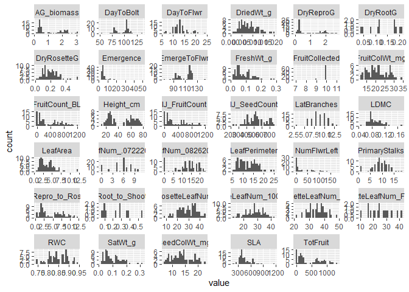<!-- -->

Start to go through traits one at a time. Make each one its own code chunk for ease of viewing figures. 

Fresh weight of Single Leaf

``` r
explore_trans(CleanData_2021$FreshWt_g)
```

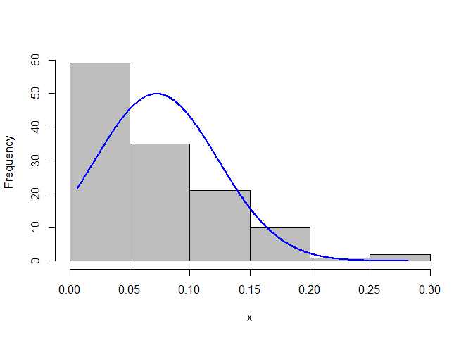<!-- -->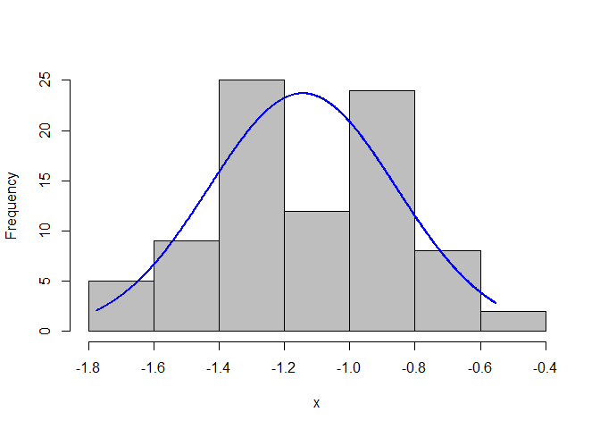<!-- -->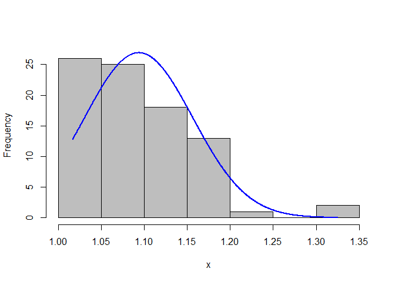<!-- -->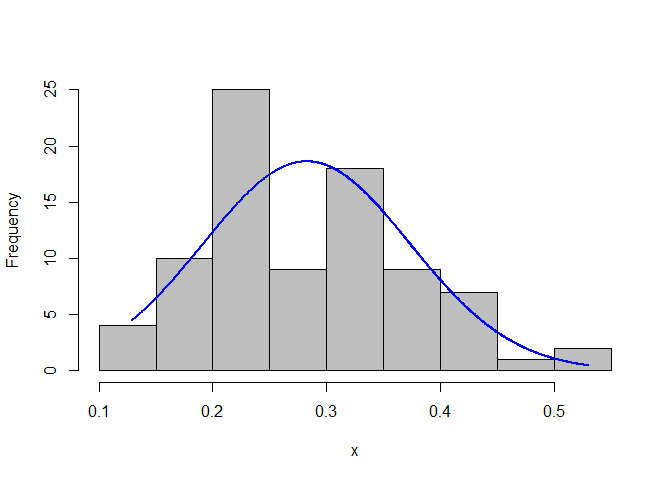<!-- -->

```
## 
## 	Shapiro-Wilk normality test
## 
## data:  trait
## W = 0.84589, p-value = 3.1e-10
## 
## 
## 	Shapiro-Wilk normality test
## 
## data:  log10(trait)
## W = 0.978, p-value = 0.03519
## 
## 
## 	Shapiro-Wilk normality test
## 
## data:  exp(trait)
## W = 0.82508, p-value = 4.898e-11
## 
## 
## 	Shapiro-Wilk normality test
## 
## data:  sqrt(trait)
## W = 0.94348, p-value = 4.245e-05
```

``` r
# add column of log transformed information to dataframe
CleanData_2021$l10_FreshWt <- log10(CleanData_2021$FreshWt_g)
```

Saturated Weight of Single Leaf


``` r
explore_trans(CleanData_2021$SatWt_g)
```

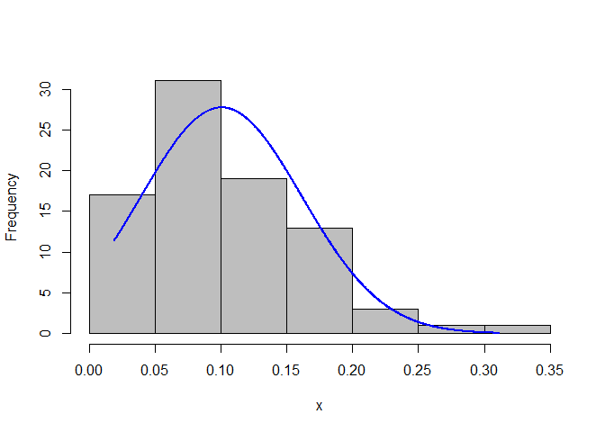<!-- -->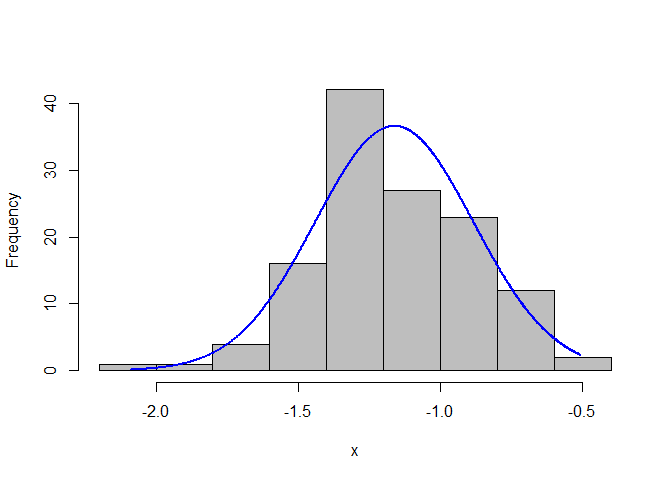<!-- -->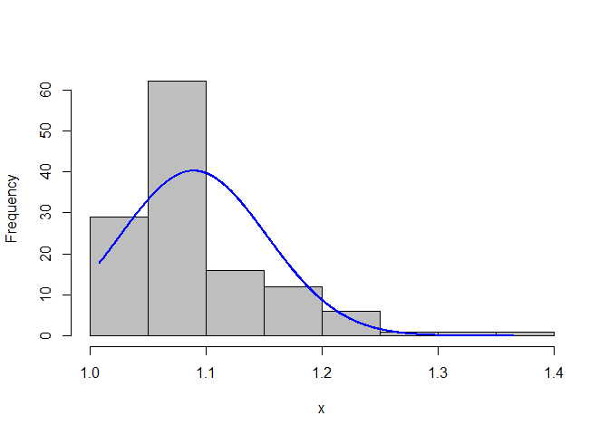<!-- -->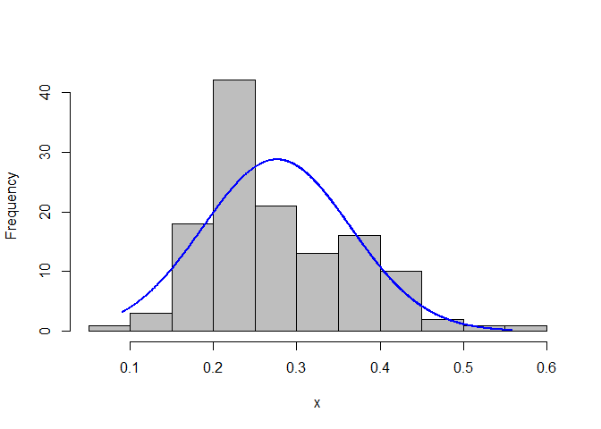<!-- -->

```
## 
## 	Shapiro-Wilk normality test
## 
## data:  trait
## W = 0.85674, p-value = 8.659e-10
## 
## 
## 	Shapiro-Wilk normality test
## 
## data:  log10(trait)
## W = 0.97819, p-value = 0.03679
## 
## 
## 	Shapiro-Wilk normality test
## 
## data:  exp(trait)
## W = 0.83463, p-value = 1.12e-10
## 
## 
## 	Shapiro-Wilk normality test
## 
## data:  sqrt(trait)
## W = 0.94732, p-value = 8.099e-05
```

``` r
CleanData_2021$l10_SatWt <- log10(CleanData_2021$SatWt_g)
```

Dried Weight of Single Leaf

``` r
explore_trans(CleanData_2021$DriedWt_g)
```

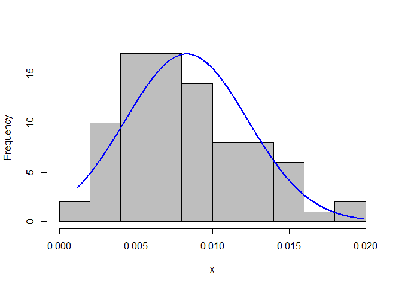<!-- -->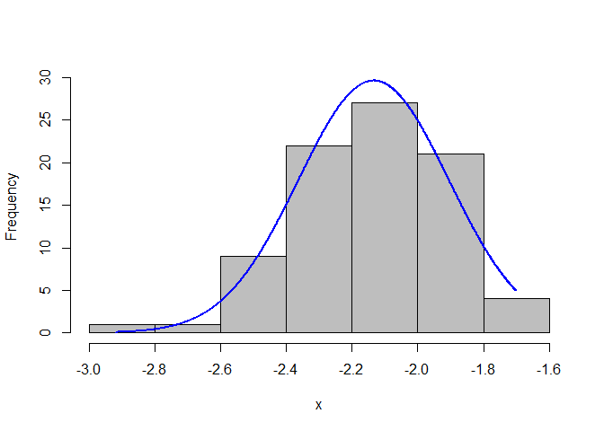<!-- -->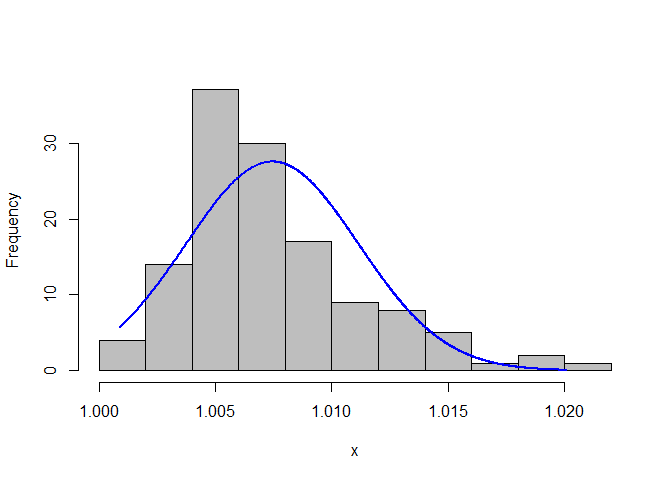<!-- -->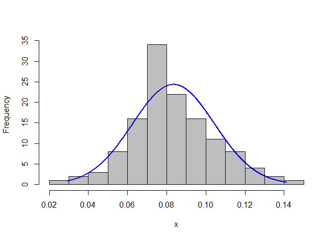<!-- -->

```
## 
## 	Shapiro-Wilk normality test
## 
## data:  trait
## W = 0.93379, p-value = 9.101e-06
## 
## 
## 	Shapiro-Wilk normality test
## 
## data:  log10(trait)
## W = 0.95336, p-value = 0.0002341
## 
## 
## 	Shapiro-Wilk normality test
## 
## data:  exp(trait)
## W = 0.93267, p-value = 7.669e-06
## 
## 
## 	Shapiro-Wilk normality test
## 
## data:  sqrt(trait)
## W = 0.98365, p-value = 0.1267
```

``` r
# sqrt is the best here, also do log for consistency
CleanData_2021$l10_DriedWt <- log10(CleanData_2021$DriedWt_g)
CleanData_2021$SQR_DriedWt <- sqrt(CleanData_2021$DriedWt_g)
```

Leaf Area of Single Leaf

``` r
explore_trans(CleanData_2021$LeafArea)
```

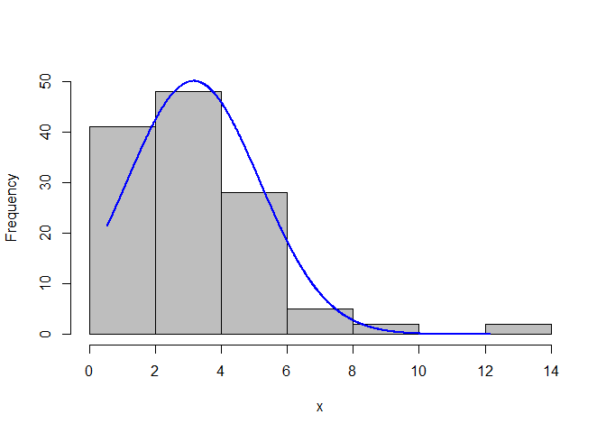<!-- -->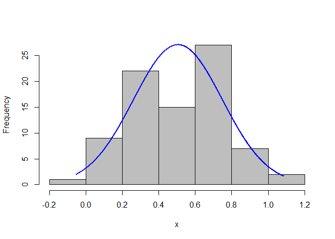<!-- --><!-- -->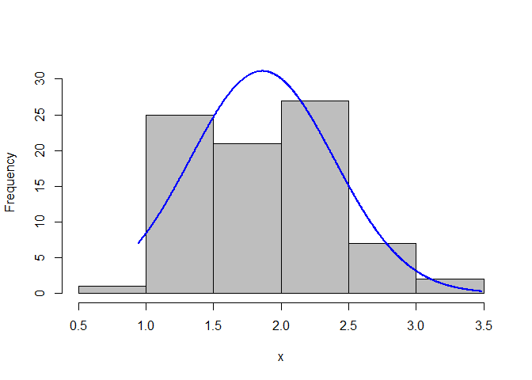<!-- -->

```
## 
## 	Shapiro-Wilk normality test
## 
## data:  trait
## W = 0.82413, p-value = 5.71e-11
## 
## 
## 	Shapiro-Wilk normality test
## 
## data:  log10(trait)
## W = 0.98079, p-value = 0.07044
## 
## 
## 	Shapiro-Wilk normality test
## 
## data:  exp(trait)
## W = 0.11083, p-value < 2.2e-16
## 
## 
## 	Shapiro-Wilk normality test
## 
## data:  sqrt(trait)
## W = 0.93074, p-value = 6.701e-06
```

``` r
# log ten is the best
CleanData_2021$l10_LeafArea <- log10(CleanData_2021$LeafArea)
```

Leaf Perimeter of Single Leaf

``` r
explore_trans(CleanData_2021$LeafPerimeter)
```

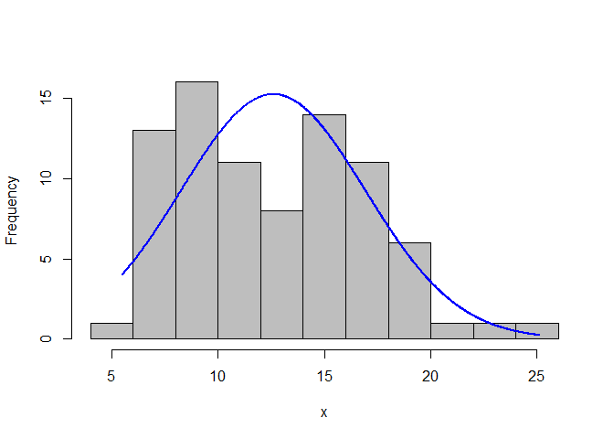<!-- -->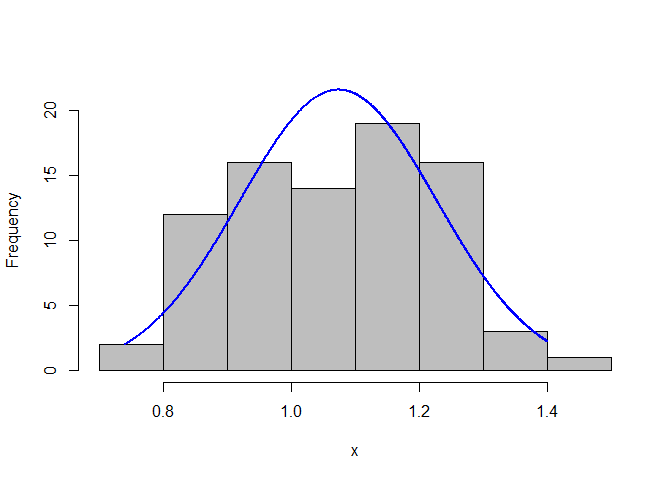<!-- -->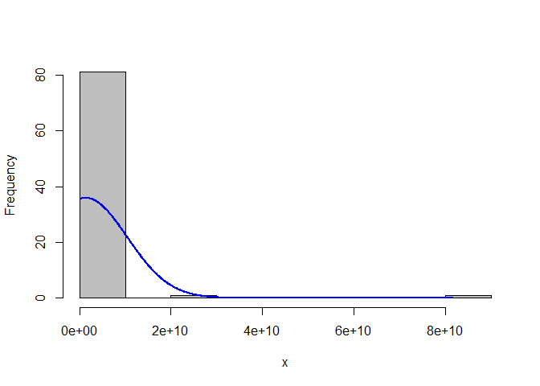<!-- -->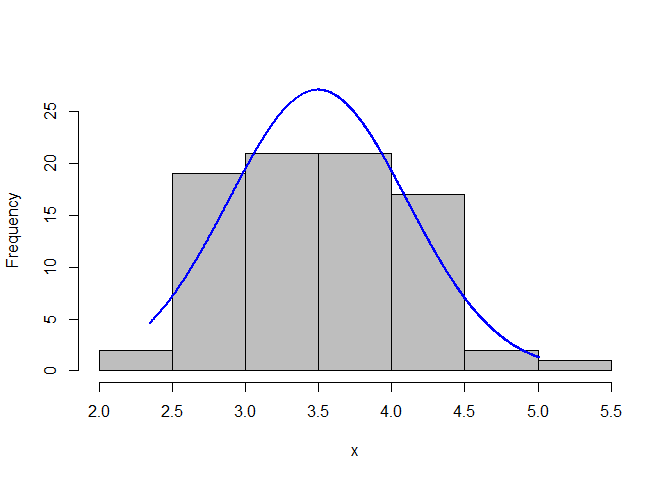<!-- -->

```
## 
## 	Shapiro-Wilk normality test
## 
## data:  trait
## W = 0.91897, p-value = 1.262e-06
## 
## 
## 	Shapiro-Wilk normality test
## 
## data:  log10(trait)
## W = 0.97393, p-value = 0.01544
## 
## 
## 	Shapiro-Wilk normality test
## 
## data:  exp(trait)
## W = 0.089588, p-value < 2.2e-16
## 
## 
## 	Shapiro-Wilk normality test
## 
## data:  sqrt(trait)
## W = 0.95414, p-value = 0.0003048
```

``` r
CleanData_2021$l10_LeafPer <- log10(CleanData_2021$LeafPerimeter)
```

Specific Leaf Area

``` r
#explore_trans(CleanData_2021$SLA)
#function throws an error so did it by hand (probably because of NAs, issue with exponential transformation)
plotNormalHistogram(CleanData_2021$SLA)
```

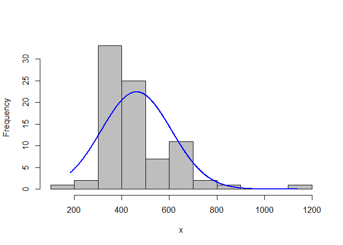<!-- -->

``` r
  plotNormalHistogram(log10(CleanData_2021$SLA))
```

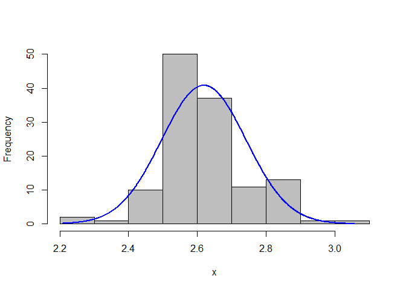<!-- -->

``` r
  hist(exp(CleanData_2021$SLA))
```

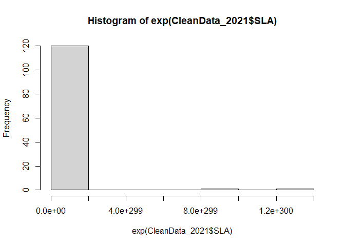<!-- -->

``` r
  plotNormalHistogram(sqrt(CleanData_2021$SLA))
```

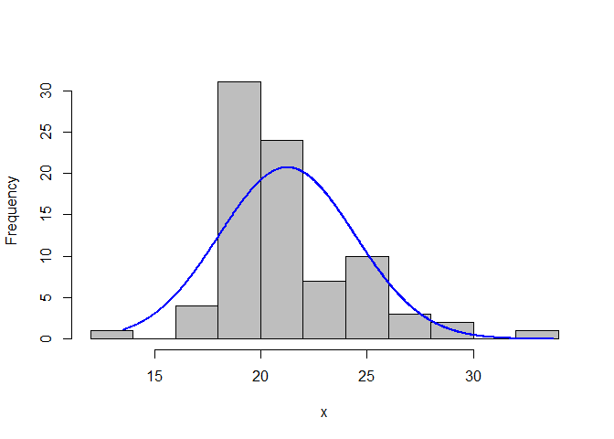<!-- -->

``` r
  # want the one with the largest value
  print(shapiro.test(CleanData_2021$SLA))
```

```
## 
## 	Shapiro-Wilk normality test
## 
## data:  CleanData_2021$SLA
## W = 0.85913, p-value = 1.354e-09
```

``` r
  print(shapiro.test(log10(CleanData_2021$SLA)))
```

```
## 
## 	Shapiro-Wilk normality test
## 
## data:  log10(CleanData_2021$SLA)
## W = 0.95206, p-value = 0.0002101
```

``` r
  print(shapiro.test(exp(CleanData_2021$SLA)))
```

```
## 
## 	Shapiro-Wilk normality test
## 
## data:  exp(CleanData_2021$SLA)
## W = NaN, p-value = NA
```

``` r
  print(shapiro.test(sqrt(CleanData_2021$SLA))) 
```

```
## 
## 	Shapiro-Wilk normality test
## 
## data:  sqrt(CleanData_2021$SLA)
## W = 0.92148, p-value = 1.781e-06
```

``` r
# log10 is the best
CleanData_2021$l10_SLA <- log10(CleanData_2021$SLA)
```

Leaf Dry Matter Content

``` r
explore_trans(CleanData_2021$LDMC)
```

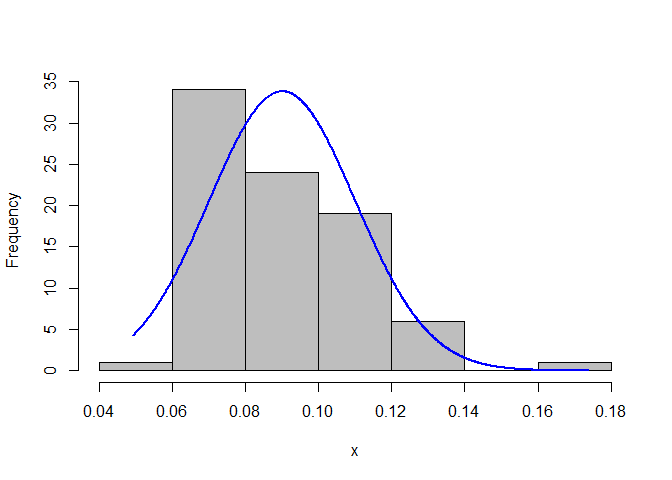<!-- -->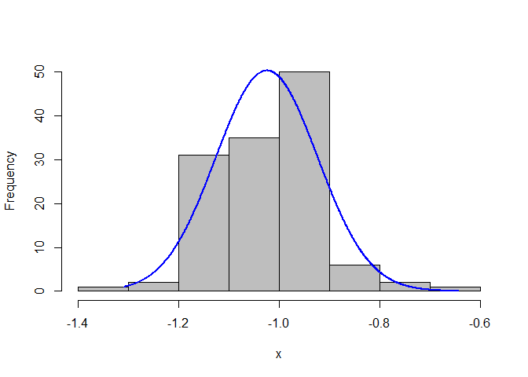<!-- -->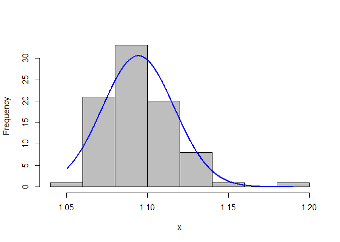<!-- -->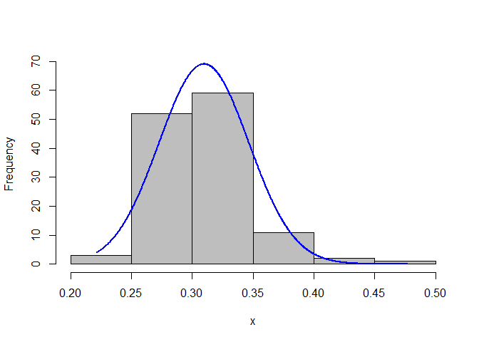<!-- -->

```
## 
## 	Shapiro-Wilk normality test
## 
## data:  trait
## W = 0.90569, p-value = 1.874e-07
## 
## 
## 	Shapiro-Wilk normality test
## 
## data:  log10(trait)
## W = 0.97973, p-value = 0.05209
## 
## 
## 	Shapiro-Wilk normality test
## 
## data:  exp(trait)
## W = 0.88927, p-value = 2.632e-08
## 
## 
## 	Shapiro-Wilk normality test
## 
## data:  sqrt(trait)
## W = 0.95537, p-value = 0.000338
```

``` r
CleanData_2021$l10_LDMC <- log10(CleanData_2021$LDMC)
```

Relative Water Content

``` r
explore_trans(CleanData_2021$RWC)
```

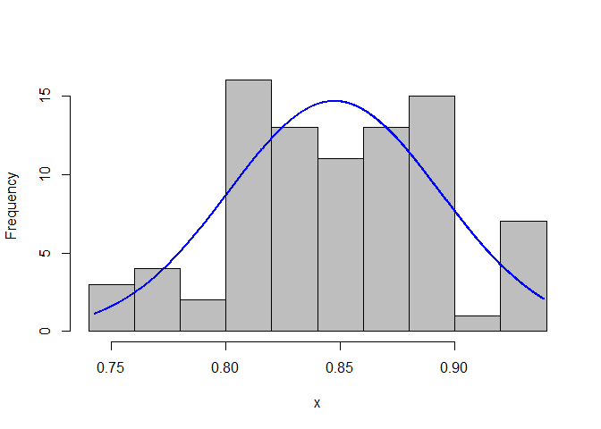<!-- -->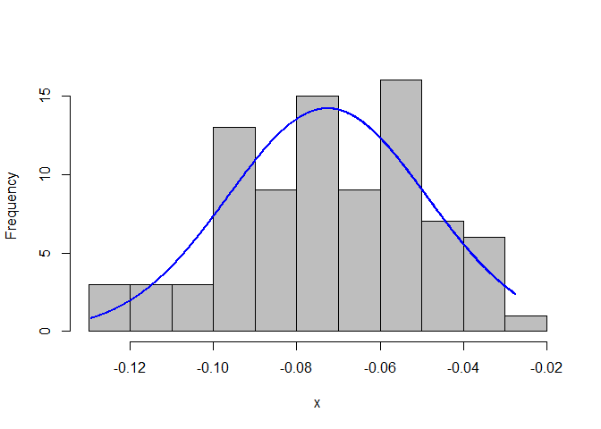<!-- -->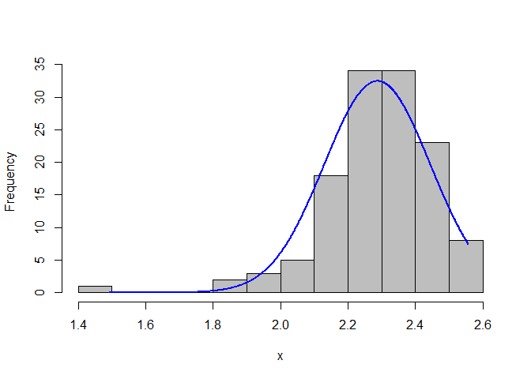<!-- -->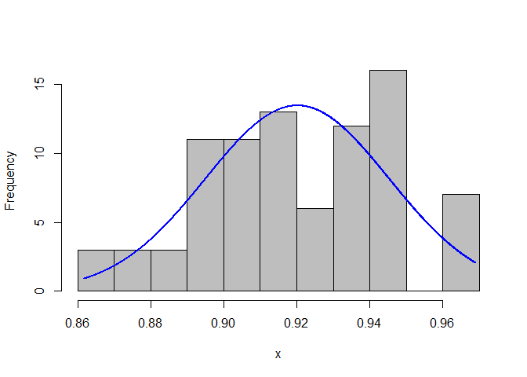<!-- -->

```
## 
## 	Shapiro-Wilk normality test
## 
## data:  trait
## W = 0.86963, p-value = 3.139e-09
## 
## 
## 	Shapiro-Wilk normality test
## 
## data:  log10(trait)
## W = 0.76309, p-value = 4.275e-13
## 
## 
## 	Shapiro-Wilk normality test
## 
## data:  exp(trait)
## W = 0.91935, p-value = 1.125e-06
## 
## 
## 	Shapiro-Wilk normality test
## 
## data:  sqrt(trait)
## W = 0.82197, p-value = 3.765e-11
```

``` r
# none of these are really good. leave alone.
```

Leaf Number, early stages

``` r
print(shapiro.test(CleanData_2021$LeafNum_.07222021))
```

```
## 
## 	Shapiro-Wilk normality test
## 
## data:  CleanData_2021$LeafNum_.07222021
## W = 0.91613, p-value = 1.204e-07
```

``` r
print(shapiro.test(log10(CleanData_2021$LeafNum_.07222021)))
```

```
## 
## 	Shapiro-Wilk normality test
## 
## data:  log10(CleanData_2021$LeafNum_.07222021)
## W = NaN, p-value = NA
```

``` r
print(shapiro.test(exp(CleanData_2021$LeafNum_.07222021)))
```

```
## 
## 	Shapiro-Wilk normality test
## 
## data:  exp(CleanData_2021$LeafNum_.07222021)
## W = 0.31683, p-value < 2.2e-16
```

``` r
print(shapiro.test(sqrt(CleanData_2021$LeafNum_.07222021))) 
```

```
## 
## 	Shapiro-Wilk normality test
## 
## data:  sqrt(CleanData_2021$LeafNum_.07222021)
## W = 0.76426, p-value = 3.01e-14
```

Leaf number, during winter

``` r
print(shapiro.test(CleanData_2021$LeafNum_08262021))
```

```
## 
## 	Shapiro-Wilk normality test
## 
## data:  CleanData_2021$LeafNum_08262021
## W = 0.90527, p-value = 2.652e-08
```

``` r
print(shapiro.test(log10(CleanData_2021$LeafNum_08262021)))
```

```
## 
## 	Shapiro-Wilk normality test
## 
## data:  log10(CleanData_2021$LeafNum_08262021)
## W = NaN, p-value = NA
```

``` r
print(shapiro.test(exp(CleanData_2021$LeafNum_08262021)))
```

```
## 
## 	Shapiro-Wilk normality test
## 
## data:  exp(CleanData_2021$LeafNum_08262021)
## W = 0.2265, p-value < 2.2e-16
```

``` r
print(shapiro.test(sqrt(CleanData_2021$LeafNum_08262021))) 
```

```
## 
## 	Shapiro-Wilk normality test
## 
## data:  sqrt(CleanData_2021$LeafNum_08262021)
## W = 0.74508, p-value = 7.654e-15
```

leaf number about bolting time

``` r
explore_trans(CleanData_2021$RosetteLeafNum_10042021)
```

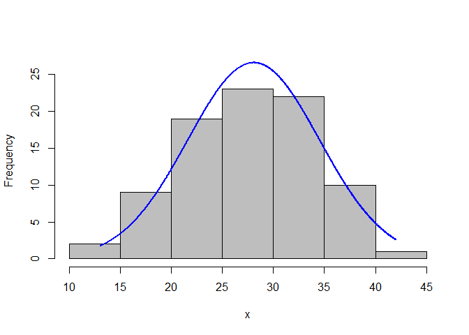<!-- -->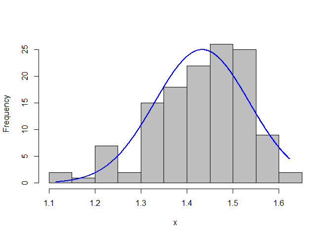<!-- --><!-- -->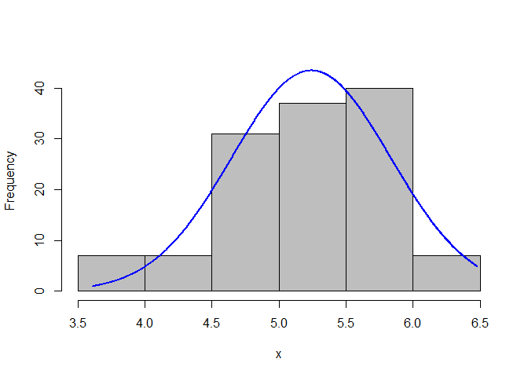<!-- -->

```
## 
## 	Shapiro-Wilk normality test
## 
## data:  trait
## W = 0.98412, p-value = 0.1376
## 
## 
## 	Shapiro-Wilk normality test
## 
## data:  log10(trait)
## W = 0.94467, p-value = 4.828e-05
## 
## 
## 	Shapiro-Wilk normality test
## 
## data:  exp(trait)
## W = 0.085649, p-value < 2.2e-16
## 
## 
## 	Shapiro-Wilk normality test
## 
## data:  sqrt(trait)
## W = 0.96935, p-value = 0.00508
```

leaf number at bolting

``` r
explore_trans(CleanData_2021$RosetteLeafNum_bolt)
```

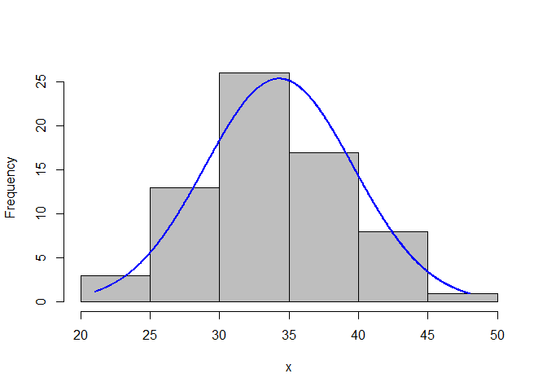<!-- -->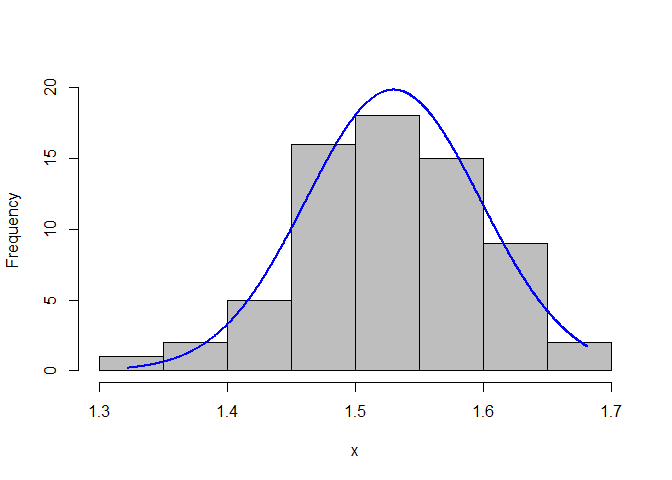<!-- --><!-- -->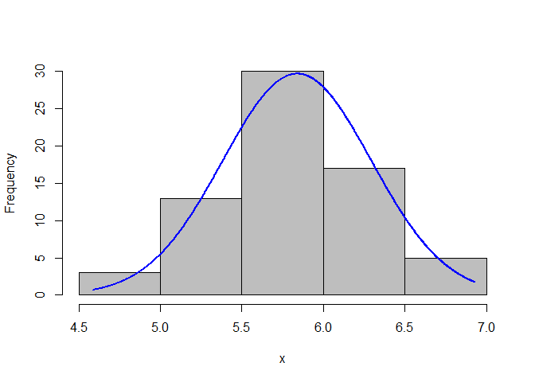<!-- -->

```
## 
## 	Shapiro-Wilk normality test
## 
## data:  trait
## W = 0.98596, p-value = 0.6437
## 
## 
## 	Shapiro-Wilk normality test
## 
## data:  log10(trait)
## W = 0.98686, p-value = 0.6956
## 
## 
## 	Shapiro-Wilk normality test
## 
## data:  exp(trait)
## W = 0.11637, p-value < 2.2e-16
## 
## 
## 	Shapiro-Wilk normality test
## 
## data:  sqrt(trait)
## W = 0.98938, p-value = 0.8351
```

Leaf number at flowering

``` r
explore_trans(CleanData_2021$RosetteLeafNum_Flower)
```

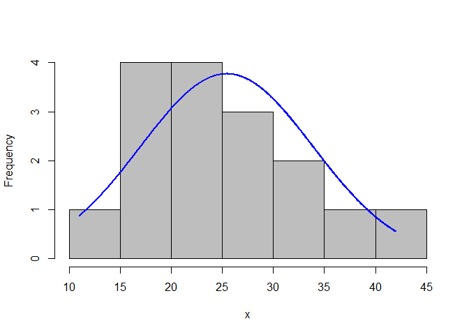<!-- -->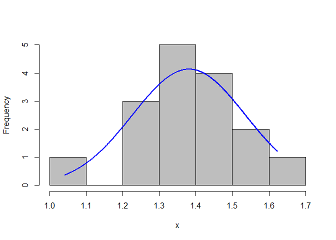<!-- -->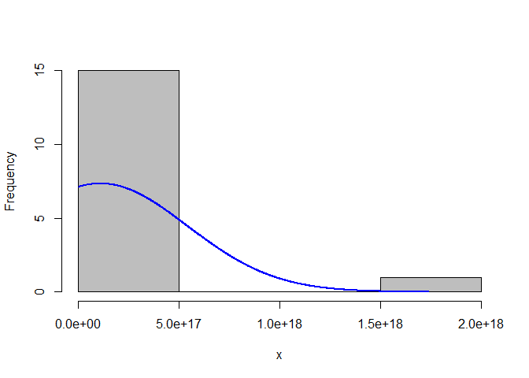<!-- -->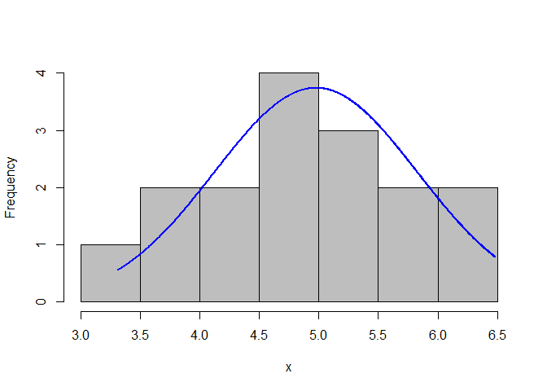<!-- -->

```
## 
## 	Shapiro-Wilk normality test
## 
## data:  trait
## W = 0.96101, p-value = 0.3287
## 
## 
## 	Shapiro-Wilk normality test
## 
## data:  log10(trait)
## W = 0.88984, p-value = 0.004781
## 
## 
## 	Shapiro-Wilk normality test
## 
## data:  exp(trait)
## W = 0.18475, p-value = 8.492e-12
## 
## 
## 	Shapiro-Wilk normality test
## 
## data:  sqrt(trait)
## W = 0.9341, p-value = 0.06317
```

Rosette Leaf Num at Harvest

``` r
explore_trans(CleanData_2021$RosetteLeafNum)
```

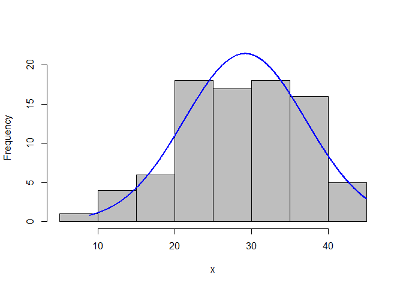<!-- -->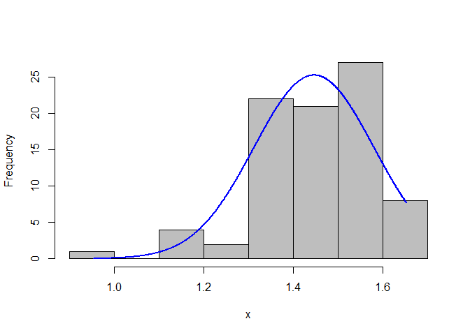<!-- -->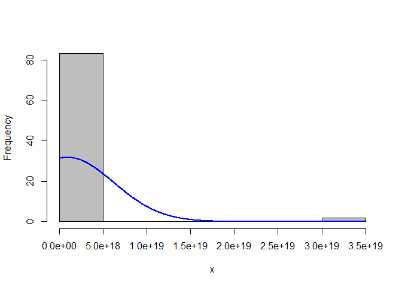<!-- -->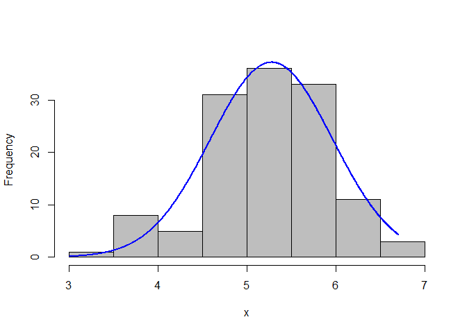<!-- -->

```
## 
## 	Shapiro-Wilk normality test
## 
## data:  trait
## W = 0.99224, p-value = 0.7036
## 
## 
## 	Shapiro-Wilk normality test
## 
## data:  log10(trait)
## W = 0.94182, p-value = 3.23e-05
## 
## 
## 	Shapiro-Wilk normality test
## 
## data:  exp(trait)
## W = 0.12061, p-value < 2.2e-16
## 
## 
## 	Shapiro-Wilk normality test
## 
## data:  sqrt(trait)
## W = 0.97814, p-value = 0.03634
```

Dry Rosette Biomass


``` r
explore_trans(CleanData_2021$DryRosetteG)
```

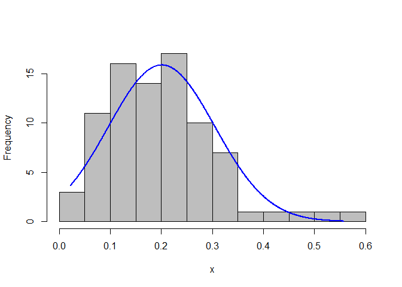<!-- -->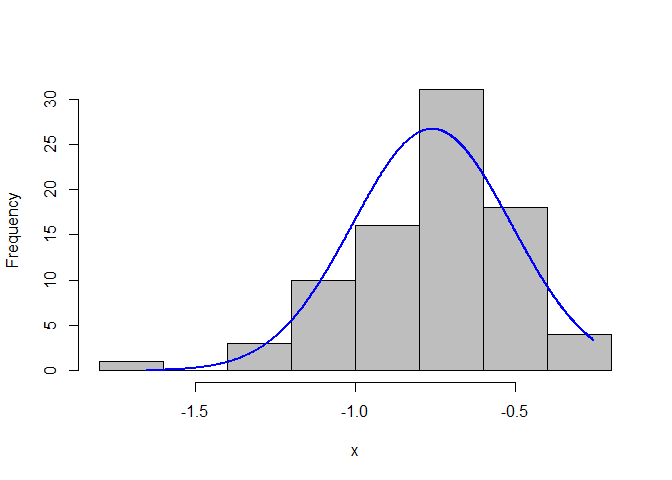<!-- -->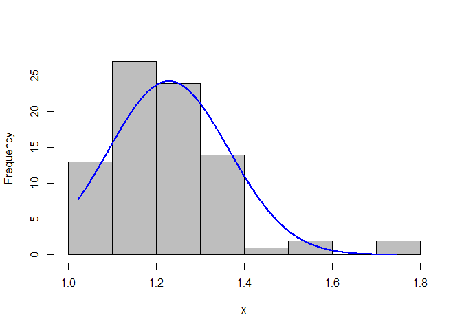<!-- -->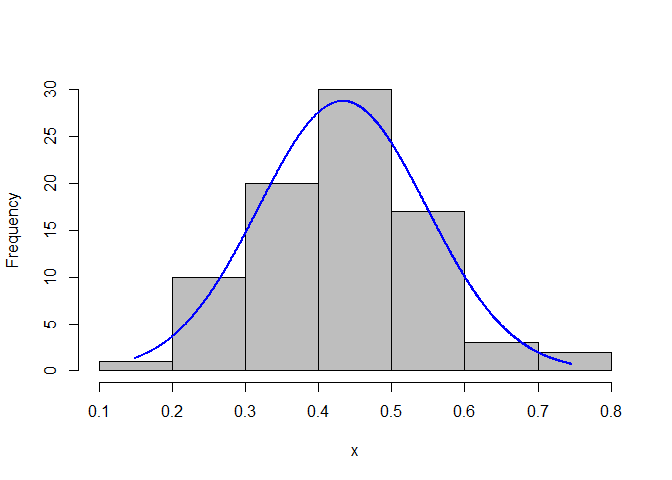<!-- -->

```
## 
## 	Shapiro-Wilk normality test
## 
## data:  trait
## W = 0.89989, p-value = 1.103e-07
## 
## 
## 	Shapiro-Wilk normality test
## 
## data:  log10(trait)
## W = 0.94833, p-value = 0.0001097
## 
## 
## 	Shapiro-Wilk normality test
## 
## data:  exp(trait)
## W = 0.8495, p-value = 5.407e-10
## 
## 
## 	Shapiro-Wilk normality test
## 
## data:  sqrt(trait)
## W = 0.97926, p-value = 0.04997
```

``` r
#sqrt is the best but not quite normal but l10 okay so do both
CleanData_2021$SQR_DryRosG <- sqrt(CleanData_2021$DryRosetteG)
CleanData_2021$l10_DryRosG <- log10(CleanData_2021$DryRosetteG)
```

Dry Reproductive Biomass

``` r
explore_trans(CleanData_2021$DryReproG)
```

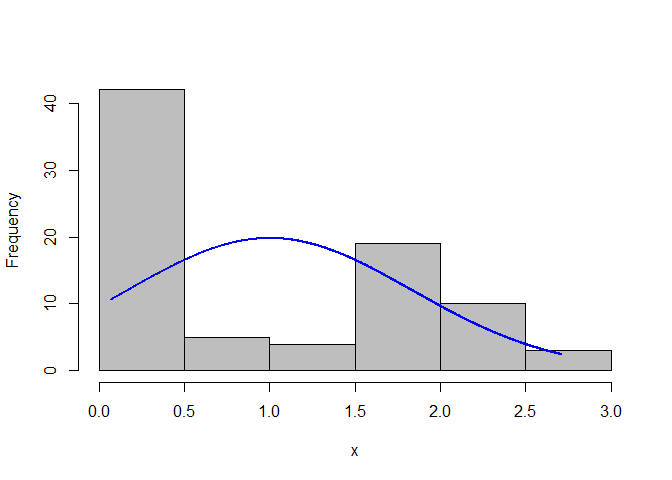<!-- -->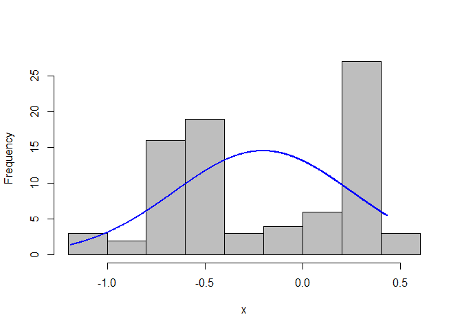<!-- -->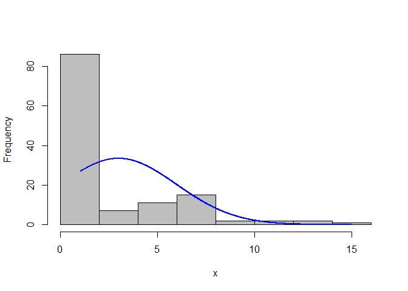<!-- -->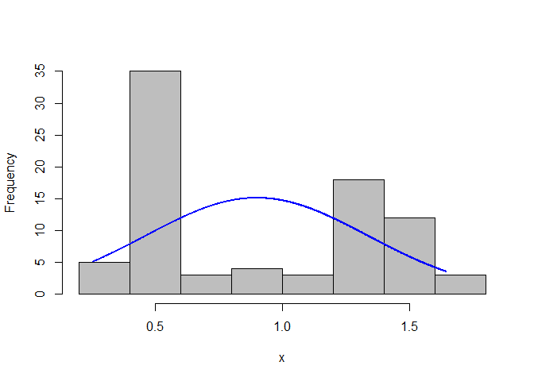<!-- -->

```
## 
## 	Shapiro-Wilk normality test
## 
## data:  trait
## W = 0.74166, p-value = 1.33e-13
## 
## 
## 	Shapiro-Wilk normality test
## 
## data:  log10(trait)
## W = 0.88948, p-value = 3.272e-08
## 
## 
## 	Shapiro-Wilk normality test
## 
## data:  exp(trait)
## W = 0.66011, p-value = 1.124e-15
## 
## 
## 	Shapiro-Wilk normality test
## 
## data:  sqrt(trait)
## W = 0.81035, p-value = 1.842e-11
```

``` r
# log10 does the best job but not fantastic. 

CleanData_2021$l10_DryReproG <- log10(CleanData_2021$DryReproG)

#full above ground
explore_trans(CleanData_2021$AG_biomass)
```

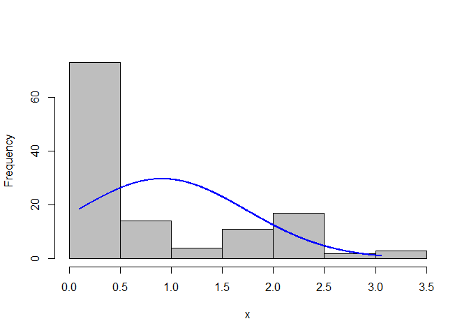<!-- -->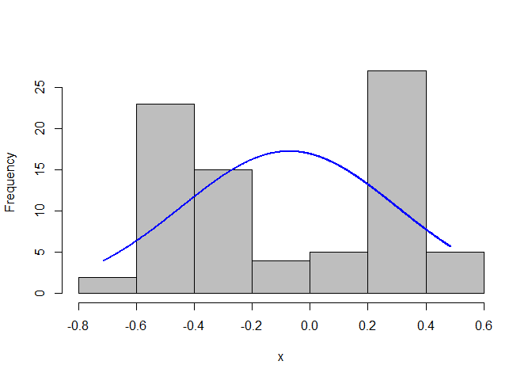<!-- -->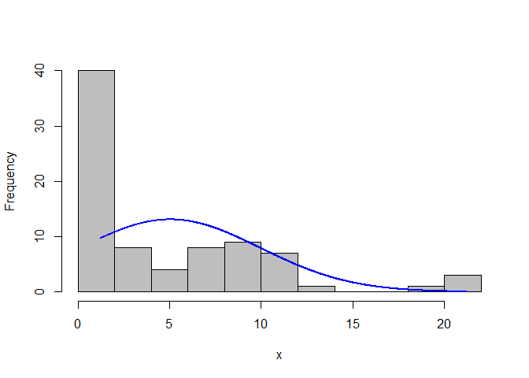<!-- -->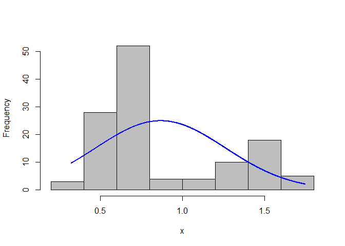<!-- -->

```
## 
## 	Shapiro-Wilk normality test
## 
## data:  trait
## W = 0.74836, p-value = 2.699e-13
## 
## 
## 	Shapiro-Wilk normality test
## 
## data:  log10(trait)
## W = 0.87811, p-value = 1.148e-08
## 
## 
## 	Shapiro-Wilk normality test
## 
## data:  exp(trait)
## W = 0.63013, p-value = 3.256e-16
## 
## 
## 	Shapiro-Wilk normality test
## 
## data:  sqrt(trait)
## W = 0.80973, p-value = 2.236e-11
```

``` r
CleanData_2021$l10_AG_biomass <- log10(CleanData_2021$AG_biomass)
```

Dry Root Biomass - few samples

``` r
explore_trans(CleanData_2021$DryRootG)
```

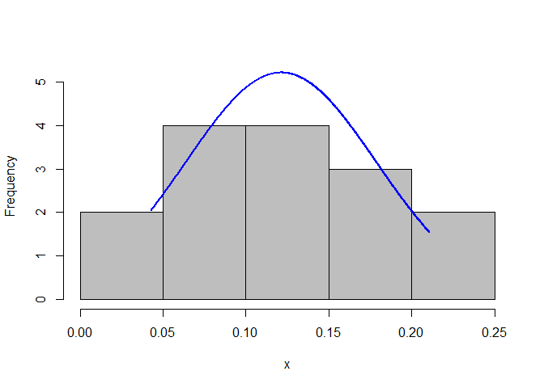<!-- -->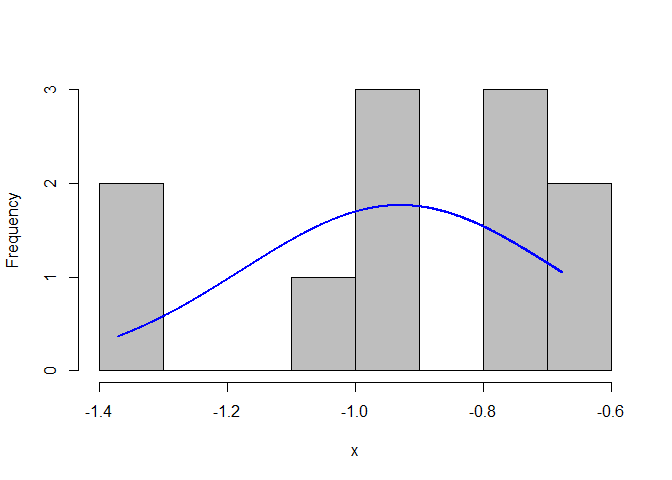<!-- -->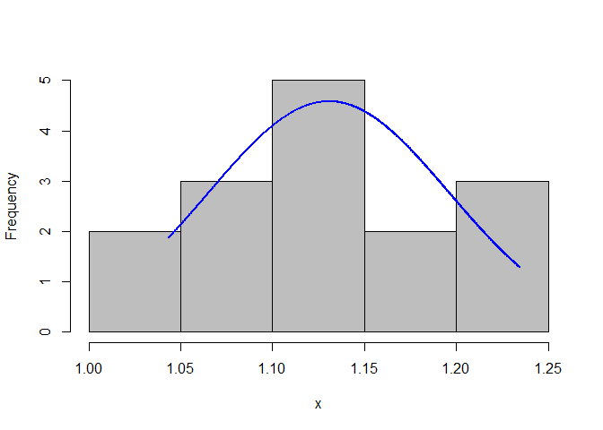<!-- -->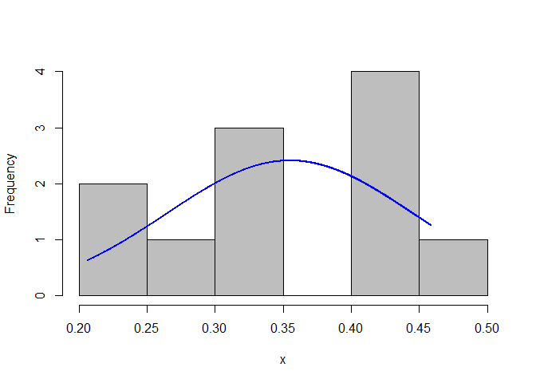<!-- -->

```
## 
## 	Shapiro-Wilk normality test
## 
## data:  trait
## W = 0.92287, p-value = 0.213
## 
## 
## 	Shapiro-Wilk normality test
## 
## data:  log10(trait)
## W = 0.92521, p-value = 0.2311
## 
## 
## 	Shapiro-Wilk normality test
## 
## data:  exp(trait)
## W = 0.91936, p-value = 0.1884
## 
## 
## 	Shapiro-Wilk normality test
## 
## data:  sqrt(trait)
## W = 0.93365, p-value = 0.3091
```

``` r
# leave as it
```

Dry Root_to_Shoot ratio - few samples

``` r
explore_trans(CleanData_2021$Root_to_Shoot)
```

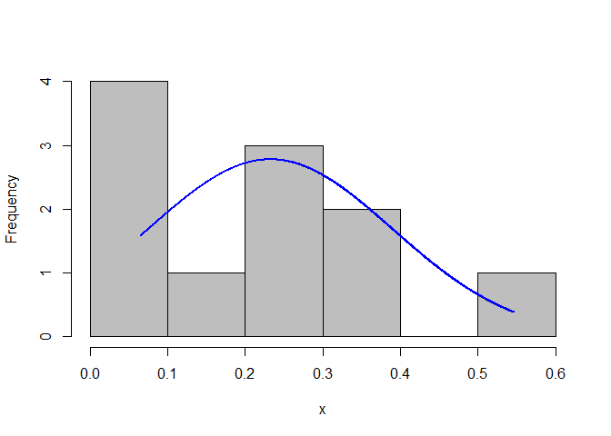<!-- -->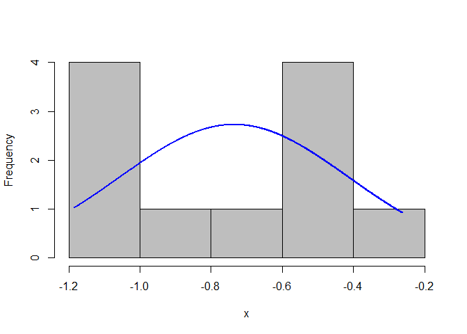<!-- -->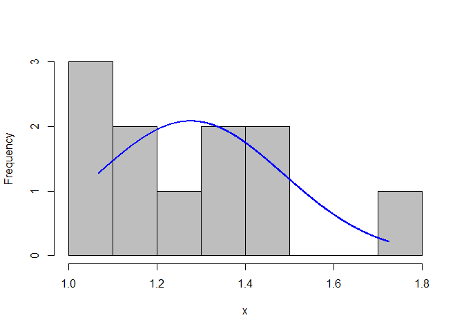<!-- -->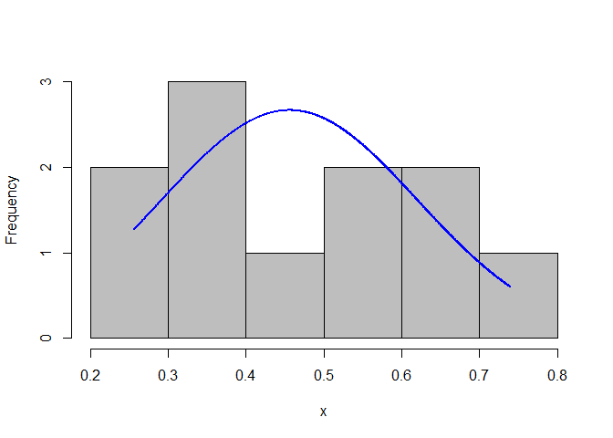<!-- -->

```
## 
## 	Shapiro-Wilk normality test
## 
## data:  trait
## W = 0.9323, p-value = 0.2953
## 
## 
## 	Shapiro-Wilk normality test
## 
## data:  log10(trait)
## W = 0.90168, p-value = 0.101
## 
## 
## 	Shapiro-Wilk normality test
## 
## data:  exp(trait)
## W = 0.9274, p-value = 0.2495
## 
## 
## 	Shapiro-Wilk normality test
## 
## data:  sqrt(trait)
## W = 0.92796, p-value = 0.2543
```

``` r
# leave as is
```

Reproductive to Rosette biomass ratio

``` r
explore_trans(CleanData_2021$Repro_to_Ros)
```

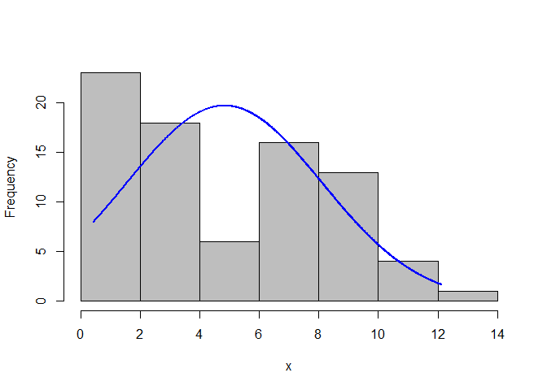<!-- -->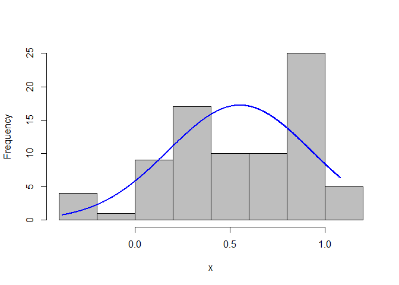<!-- -->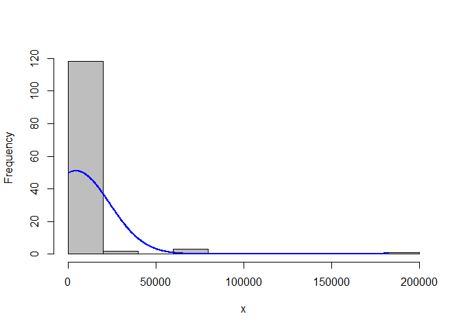<!-- -->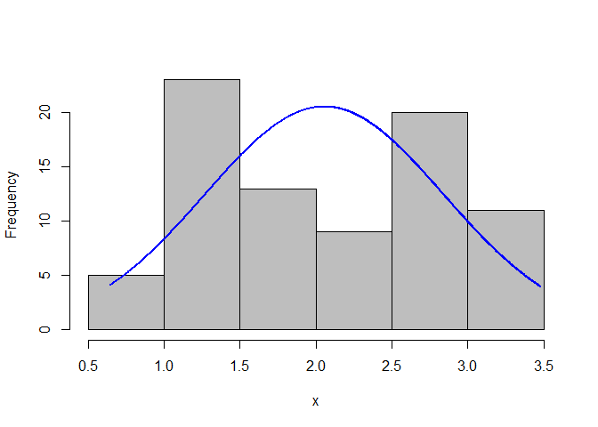<!-- -->

```
## 
## 	Shapiro-Wilk normality test
## 
## data:  trait
## W = 0.88574, p-value = 2.621e-08
## 
## 
## 	Shapiro-Wilk normality test
## 
## data:  log10(trait)
## W = 0.95306, p-value = 0.000284
## 
## 
## 	Shapiro-Wilk normality test
## 
## data:  exp(trait)
## W = 0.23704, p-value < 2.2e-16
## 
## 
## 	Shapiro-Wilk normality test
## 
## data:  sqrt(trait)
## W = 0.94898, p-value = 0.0001399
```

``` r
# log is the best
CleanData_2021$l10_R_to_R <- log10(CleanData_2021$Repro_to_Ros)
```

Number of Lateral Branches

``` r
explore_trans(CleanData_2021$LatBranches)
```

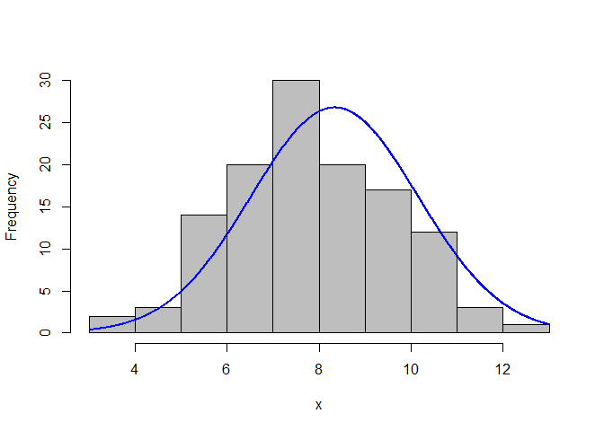<!-- -->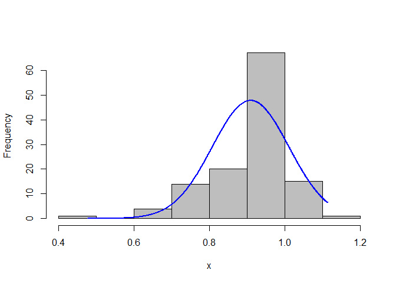<!-- -->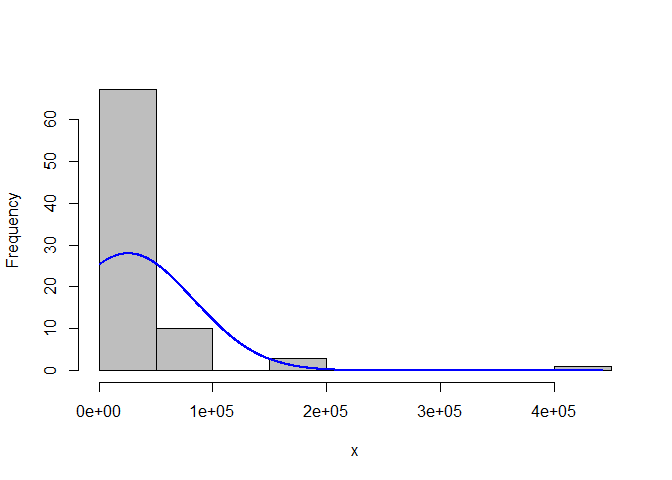<!-- -->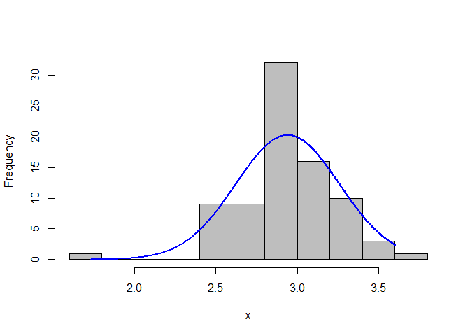<!-- -->

```
## 
## 	Shapiro-Wilk normality test
## 
## data:  trait
## W = 0.97083, p-value = 0.009486
## 
## 
## 	Shapiro-Wilk normality test
## 
## data:  log10(trait)
## W = 0.93694, p-value = 2.304e-05
## 
## 
## 	Shapiro-Wilk normality test
## 
## data:  exp(trait)
## W = 0.37349, p-value < 2.2e-16
## 
## 
## 	Shapiro-Wilk normality test
## 
## data:  sqrt(trait)
## W = 0.96293, p-value = 0.00197
```

``` r
# leave it alone
```

Number of Primary Stalks

``` r
explore_trans(CleanData_2021$PrimaryStalks)
```

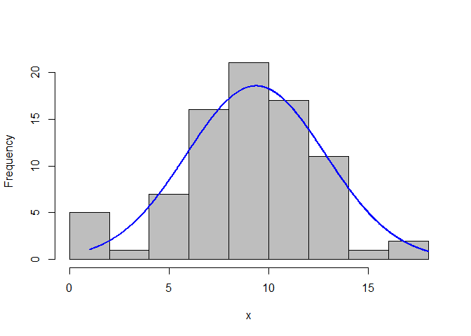<!-- -->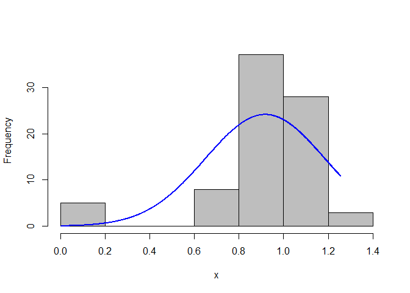<!-- --><!-- -->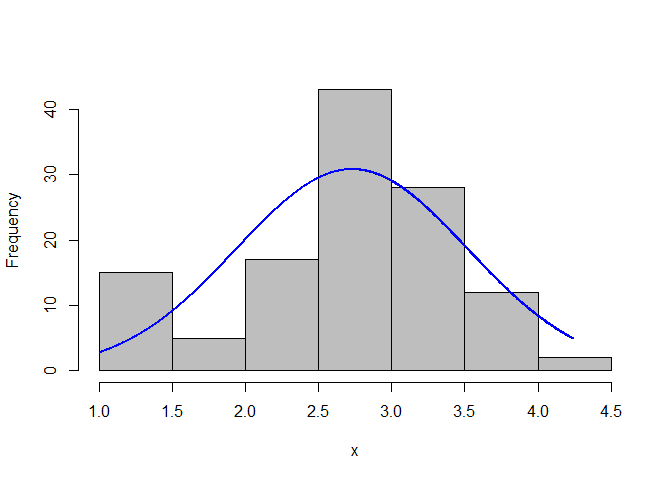<!-- -->

```
## 
## 	Shapiro-Wilk normality test
## 
## data:  trait
## W = 0.96572, p-value = 0.003387
## 
## 
## 	Shapiro-Wilk normality test
## 
## data:  log10(trait)
## W = 0.77741, p-value = 2.552e-12
## 
## 
## 	Shapiro-Wilk normality test
## 
## data:  exp(trait)
## W = 0.12298, p-value < 2.2e-16
## 
## 
## 	Shapiro-Wilk normality test
## 
## data:  sqrt(trait)
## W = 0.90351, p-value = 2.473e-07
```

``` r
# leave it alone
```


``` r
explore_trans(CleanData_2021$Height_cm)
```

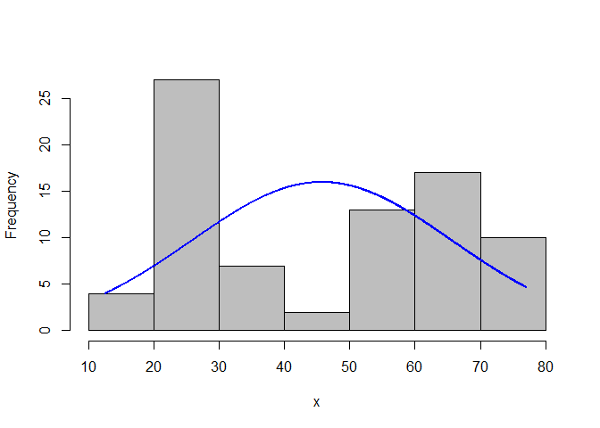<!-- -->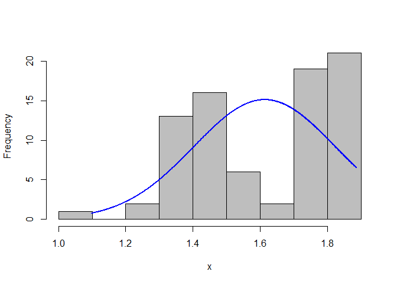<!-- --><!-- -->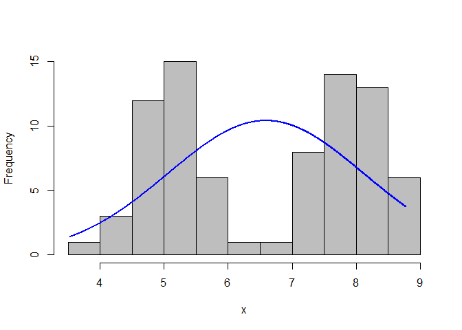<!-- -->

```
## 
## 	Shapiro-Wilk normality test
## 
## data:  trait
## W = 0.86383, p-value = 4.102e-09
## 
## 
## 	Shapiro-Wilk normality test
## 
## data:  log10(trait)
## W = 0.86389, p-value = 4.125e-09
## 
## 
## 	Shapiro-Wilk normality test
## 
## data:  exp(trait)
## W = 0.11772, p-value < 2.2e-16
## 
## 
## 	Shapiro-Wilk normality test
## 
## data:  sqrt(trait)
## W = 0.89653, p-value = 1.31e-07
```

``` r
# none are great, so I'm going to leave it alone for now.
```
Fruit Number

I have 3 fruit numbers - the one when harvested, the imageJ 1 from many people, and the imageJ 2 where Basia counted them all. How correlated are each of these? (Note Basia doesn't have CF in the dataset, so looking only at Currents and Futures)

``` r
fruit_comp<- CleanData_2021[CleanData_2021$Treatment %in% c("Current", "Future"), c("TotFruit", "IJ_FruitCount", "FruitCount_BL")]

# want to remove rows that are fully NAs - these only happen when Basia's count is NA
fruit_comp <- fruit_comp[!(is.na(fruit_comp$FruitCount_BL)), ]

pairs(fruit_comp)
```

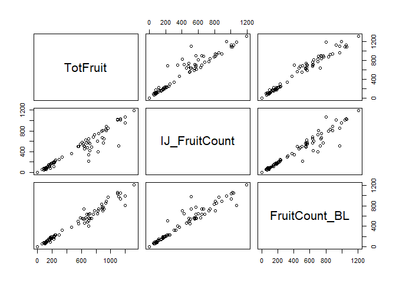<!-- -->

``` r
# Basia's counts almost seem better correlated with total fruit than from the initial imageJ counts
cor(fruit_comp$TotFruit, fruit_comp$IJ_FruitCount, use = "pairwise.complete.obs")
```

```
## [1] 0.9653283
```

``` r
#0.948158
cor(fruit_comp$TotFruit, fruit_comp$FruitCount_BL, use = "pairwise.complete.obs")
```

```
## [1] 0.9872239
```

``` r
#0.9771513
cor(fruit_comp$IJ_FruitCount, fruit_comp$FruitCount_BL, use = "pairwise.complete.obs")
```

```
## [1] 0.9693973
```

``` r
#0.9605816
```

This tells me that everything is still rather highly correlated. Basia's counts are more highly correlated with the total fruit count than with the other imageJ count or than the other count is with the total count. I do want to use Basia's info going forward because they had the most consistent counting technique since they were all counted by the same person.


``` r
# Counts at Harvest
  print(shapiro.test(CleanData_2021$TotFruit))
```

```
## 
## 	Shapiro-Wilk normality test
## 
## data:  CleanData_2021$TotFruit
## W = 0.81145, p-value = 2.766e-12
```

``` r
  print(shapiro.test(log10(CleanData_2021$TotFruit)))
```

```
## 
## 	Shapiro-Wilk normality test
## 
## data:  log10(CleanData_2021$TotFruit)
## W = NaN, p-value = NA
```

``` r
  print(shapiro.test(exp(CleanData_2021$TotFruit)))
```

```
## 
## 	Shapiro-Wilk normality test
## 
## data:  exp(CleanData_2021$TotFruit)
## W = NaN, p-value = NA
```

``` r
  print(shapiro.test(sqrt(CleanData_2021$TotFruit))) 
```

```
## 
## 	Shapiro-Wilk normality test
## 
## data:  sqrt(CleanData_2021$TotFruit)
## W = 0.92504, p-value = 7.724e-07
```

``` r
# counts from ImageJ
print(shapiro.test(CleanData_2021$IJ_FruitCount))
```

```
## 
## 	Shapiro-Wilk normality test
## 
## data:  CleanData_2021$IJ_FruitCount
## W = 0.81124, p-value = 3.409e-12
```

``` r
print(shapiro.test(log10(CleanData_2021$IJ_FruitCount)))
```

```
## 
## 	Shapiro-Wilk normality test
## 
## data:  log10(CleanData_2021$IJ_FruitCount)
## W = NaN, p-value = NA
```

``` r
print(shapiro.test(exp(CleanData_2021$IJ_FruitCount)))
```

```
## 
## 	Shapiro-Wilk normality test
## 
## data:  exp(CleanData_2021$IJ_FruitCount)
## W = NaN, p-value = NA
```

``` r
print(shapiro.test(sqrt(CleanData_2021$IJ_FruitCount)))
```

```
## 
## 	Shapiro-Wilk normality test
## 
## data:  sqrt(CleanData_2021$IJ_FruitCount)
## W = 0.94273, p-value = 1.547e-05
```

``` r
CleanData_2021$l10_IJ_Fruits <- log10(CleanData_2021$IJ_FruitCount)

# Basia recounts
print(shapiro.test(CleanData_2021$FruitCount_BL))
```

```
## 
## 	Shapiro-Wilk normality test
## 
## data:  CleanData_2021$FruitCount_BL
## W = 0.87073, p-value = 5.308e-08
```

``` r
print(shapiro.test(log10(CleanData_2021$FruitCount_BL)))
```

```
## 
## 	Shapiro-Wilk normality test
## 
## data:  log10(CleanData_2021$FruitCount_BL)
## W = NaN, p-value = NA
```

``` r
print(shapiro.test(exp(CleanData_2021$FruitCount_BL)))
```

```
## 
## 	Shapiro-Wilk normality test
## 
## data:  exp(CleanData_2021$FruitCount_BL)
## W = NaN, p-value = NA
```

``` r
print(shapiro.test(sqrt(CleanData_2021$FruitCount_BL)))
```

```
## 
## 	Shapiro-Wilk normality test
## 
## data:  sqrt(CleanData_2021$FruitCount_BL)
## W = 0.92064, p-value = 1.159e-05
```

``` r
# none of the transformations do better than the raw counts.But honestly it is not normally distributed.
```


``` r
  print(shapiro.test(CleanData_2021$NumFlwrLeft))
```

```
## 
## 	Shapiro-Wilk normality test
## 
## data:  CleanData_2021$NumFlwrLeft
## W = 0.71143, p-value = 6.393e-14
```

``` r
  print(shapiro.test(log10(CleanData_2021$NumFlwrLeft)))
```

```
## 
## 	Shapiro-Wilk normality test
## 
## data:  log10(CleanData_2021$NumFlwrLeft)
## W = NaN, p-value = NA
```

``` r
  print(shapiro.test(exp(CleanData_2021$NumFlwrLeft)))
```

```
## 
## 	Shapiro-Wilk normality test
## 
## data:  exp(CleanData_2021$NumFlwrLeft)
## W = 0.066304, p-value < 2.2e-16
```

``` r
  print(shapiro.test(sqrt(CleanData_2021$NumFlwrLeft))) 
```

```
## 
## 	Shapiro-Wilk normality test
## 
## data:  sqrt(CleanData_2021$NumFlwrLeft)
## W = 0.82353, p-value = 1.417e-10
```


``` r
explore_trans(CleanData_2021$FruitColWt_mg)
```

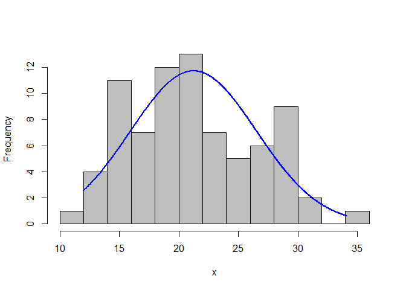<!-- -->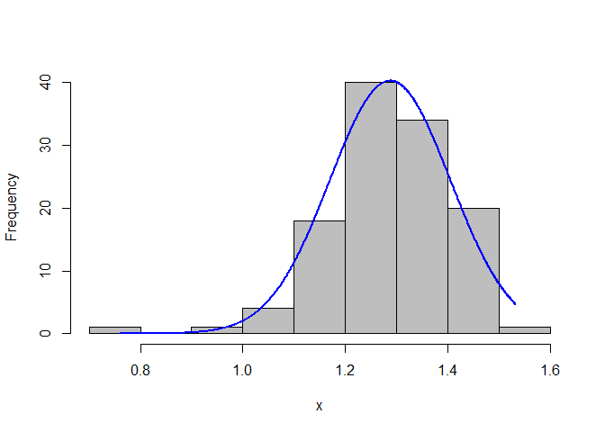<!-- --><!-- -->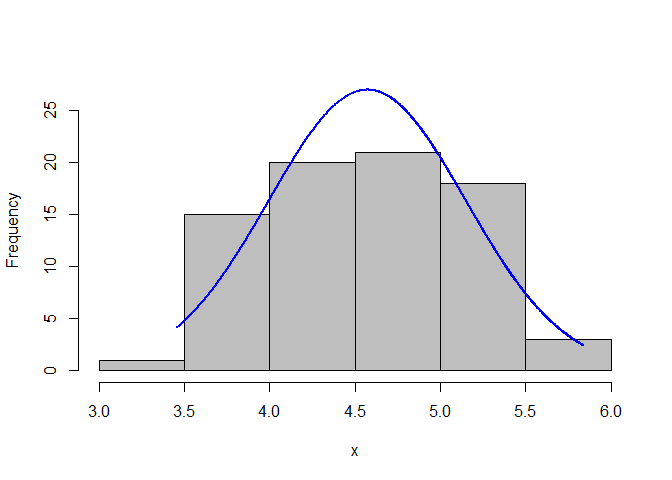<!-- -->

```
## 
## 	Shapiro-Wilk normality test
## 
## data:  trait
## W = 0.97915, p-value = 0.06134
## 
## 
## 	Shapiro-Wilk normality test
## 
## data:  log10(trait)
## W = 0.94779, p-value = 0.0001598
## 
## 
## 	Shapiro-Wilk normality test
## 
## data:  exp(trait)
## W = 0.07917, p-value < 2.2e-16
## 
## 
## 	Shapiro-Wilk normality test
## 
## data:  sqrt(trait)
## W = 0.97869, p-value = 0.05566
```


``` r
explore_trans(CleanData_2021$SeedColWt_mg)
```

<!-- -->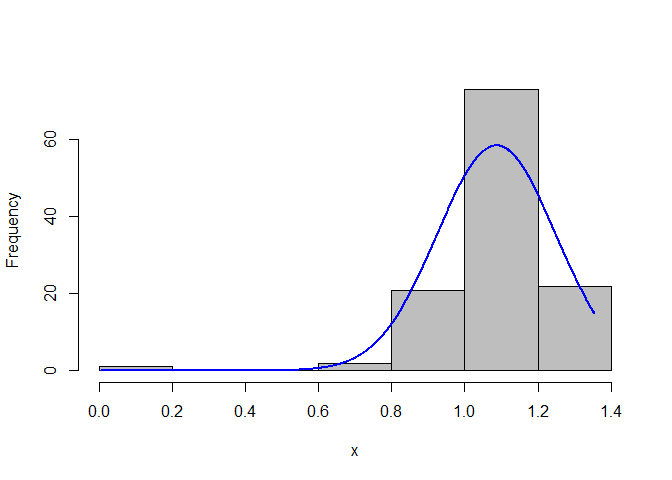<!-- --><!-- -->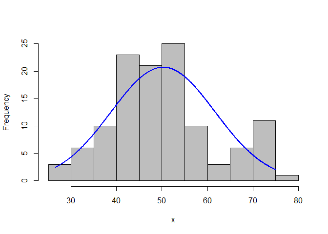<!-- -->

```
## 
## 	Shapiro-Wilk normality test
## 
## data:  trait
## W = 0.97459, p-value = 0.02348
## 
## 
## 	Shapiro-Wilk normality test
## 
## data:  log10(trait)
## W = 0.80803, p-value = 3.635e-11
## 
## 
## 	Shapiro-Wilk normality test
## 
## data:  exp(trait)
## W = 0.14825, p-value < 2.2e-16
## 
## 
## 	Shapiro-Wilk normality test
## 
## data:  sqrt(trait)
## W = 0.94847, p-value = 0.0001787
```

``` r
# what actually matters is the average seed weight, not the total
CleanData_2021$AvgSeedWt <- CleanData_2021$SeedColWt_mg / CleanData_2021$IJ_SeedCount
explore_trans(CleanData_2021$AvgSeedWt)
```

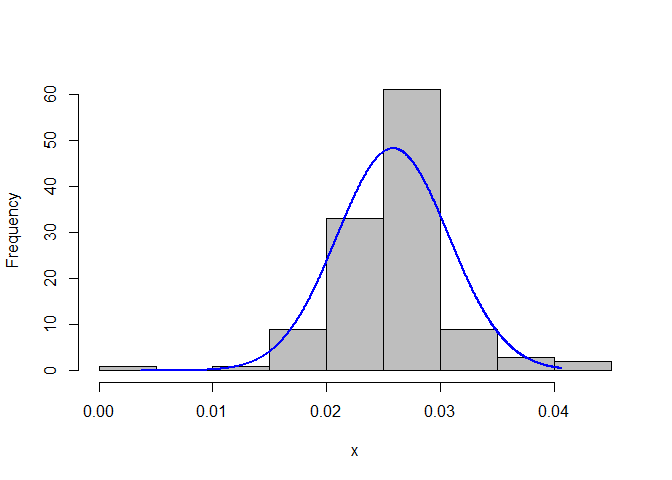<!-- -->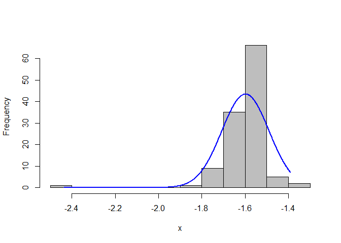<!-- --><!-- -->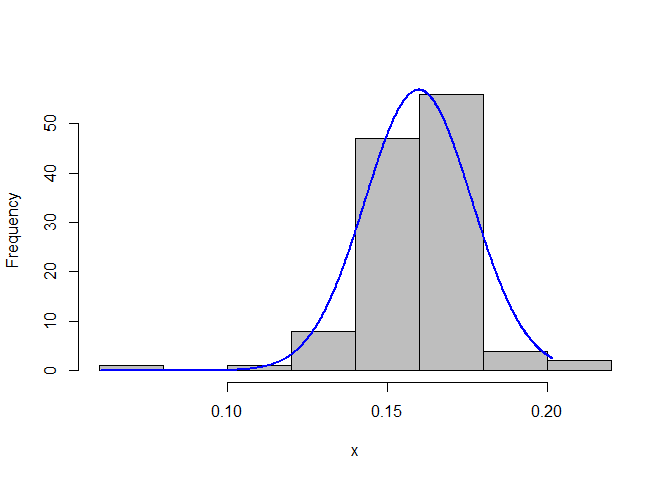<!-- -->

```
## 
## 	Shapiro-Wilk normality test
## 
## data:  trait
## W = 0.94152, p-value = 5.832e-05
## 
## 
## 	Shapiro-Wilk normality test
## 
## data:  log10(trait)
## W = 0.71162, p-value = 5.585e-14
## 
## 
## 	Shapiro-Wilk normality test
## 
## data:  exp(trait)
## W = 0.94255, p-value = 6.854e-05
## 
## 
## 	Shapiro-Wilk normality test
## 
## data:  sqrt(trait)
## W = 0.87037, p-value = 8.722e-09
```


``` r
#explore_trans(CleanData_2021$IJ_SeedCount)
# did by hand becuase exp transformation is too big to show in r -> values become infinity

plotNormalHistogram(CleanData_2021$IJ_SeedCount)
```

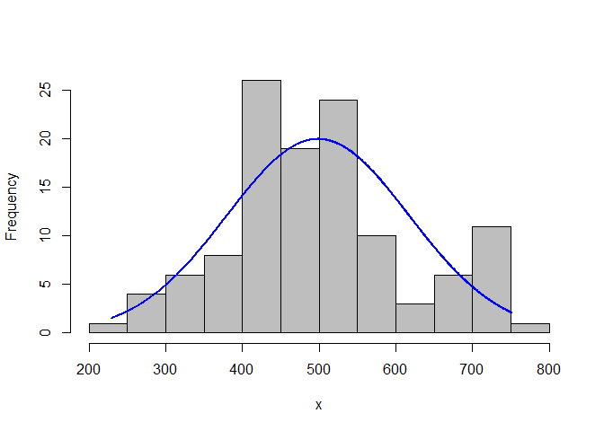<!-- -->

``` r
plotNormalHistogram(log10(CleanData_2021$IJ_SeedCount))
```

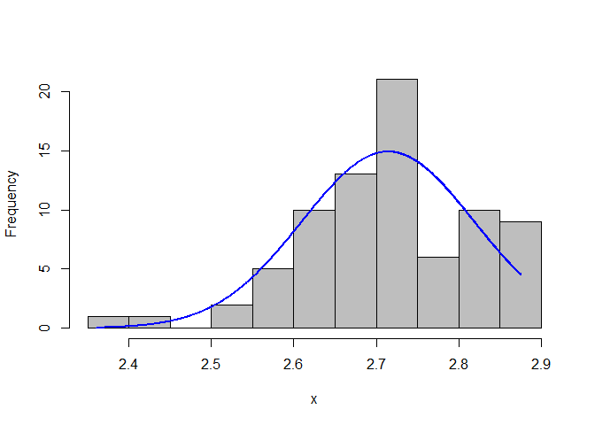<!-- -->

``` r
#plotNormalHistogram(exp(CleanData_2021$IJ_SeedCount))
plotNormalHistogram(sqrt(CleanData_2021$IJ_SeedCount))
```

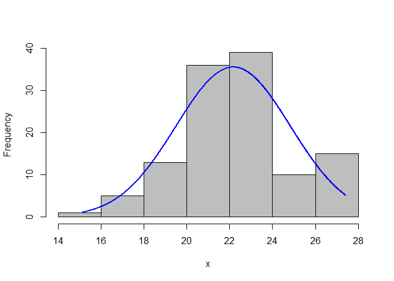<!-- -->

``` r
  # want the one with the largest value
print(shapiro.test(CleanData_2021$IJ_SeedCount))
```

```
## 
## 	Shapiro-Wilk normality test
## 
## data:  CleanData_2021$IJ_SeedCount
## W = 0.96627, p-value = 0.004388
```

``` r
print(shapiro.test(log10(CleanData_2021$IJ_SeedCount)))
```

```
## 
## 	Shapiro-Wilk normality test
## 
## data:  log10(CleanData_2021$IJ_SeedCount)
## W = 0.97123, p-value = 0.01177
```

``` r
#print(shapiro.test(exp(CleanData_2021$IJ_SeedCount)))
print(shapiro.test(sqrt(CleanData_2021$IJ_SeedCount))) 
```

```
## 
## 	Shapiro-Wilk normality test
## 
## data:  sqrt(CleanData_2021$IJ_SeedCount)
## W = 0.97556, p-value = 0.02876
```

``` r
# sqr is best but log10 still better than raw, all OK though
CleanData_2021$l10_IJ_Seeds <- log10(CleanData_2021$IJ_SeedCount)
CleanData_2021$SQR_IJ_Seeds <- sqrt(CleanData_2021$IJ_SeedCount)

#  want to analyze it as the average collected in each fruit so take the total seed number divided by the number of fruits collected.
CleanData_2021$AvgSeedNum <- CleanData_2021$IJ_SeedCount / CleanData_2021$FruitCollected
explore_trans(CleanData_2021$AvgSeedNum)
```

<!-- -->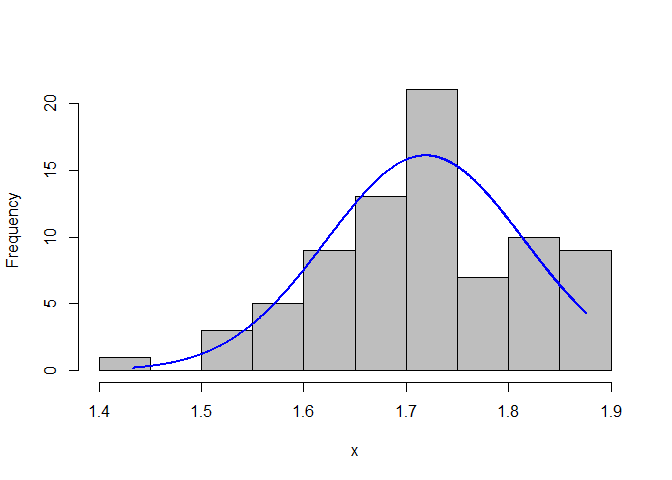<!-- --><!-- -->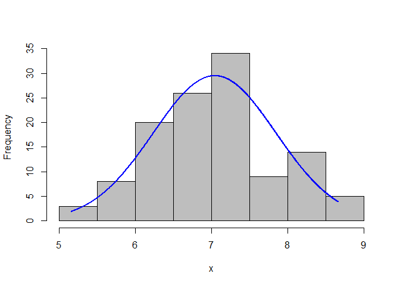<!-- -->

```
## 
## 	Shapiro-Wilk normality test
## 
## data:  trait
## W = 0.96186, p-value = 0.00189
## 
## 
## 	Shapiro-Wilk normality test
## 
## data:  log10(trait)
## W = 0.97758, p-value = 0.04398
## 
## 
## 	Shapiro-Wilk normality test
## 
## data:  exp(trait)
## W = 0.1534, p-value < 2.2e-16
## 
## 
## 	Shapiro-Wilk normality test
## 
## data:  sqrt(trait)
## W = 0.9749, p-value = 0.02505
```

``` r
CleanData_2021$l10_AvgSeedNum <- log10(CleanData_2021$AvgSeedNum)
```

Fitness - calculated with Basia's fruit counts

``` r
CleanData_2021$fitness <- (CleanData_2021$AvgSeedNum) * CleanData_2021$FruitCount_BL

plotNormalHistogram(CleanData_2021$fitness)
```

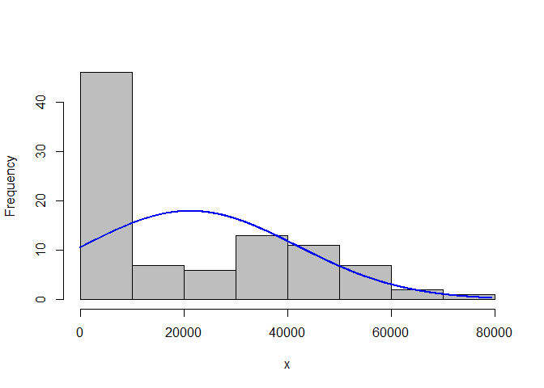<!-- -->

``` r
plotNormalHistogram(log10(CleanData_2021$fitness))
```

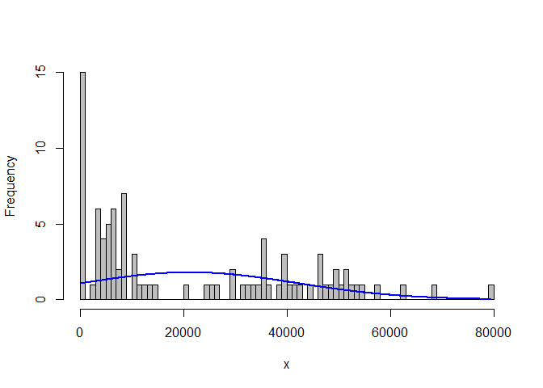<!-- -->

``` r
#plotNormalHistogram(exp(CleanData_2021$fitness))
plotNormalHistogram(sqrt(CleanData_2021$fitness))
```

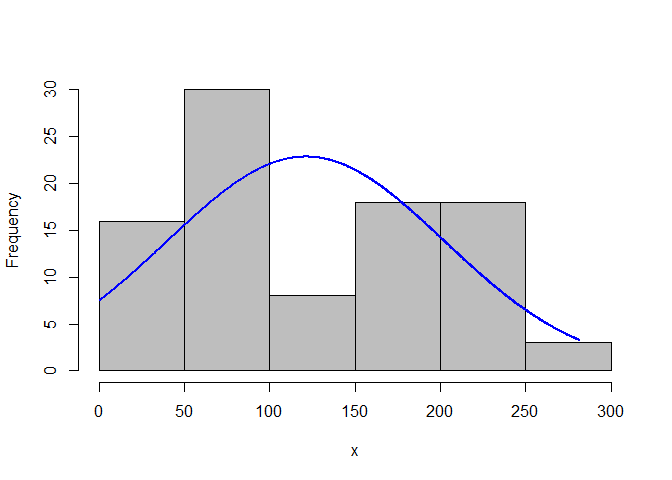<!-- -->

``` r
  # want the one with the largest value
print(shapiro.test(CleanData_2021$fitness))
```

```
## 
## 	Shapiro-Wilk normality test
## 
## data:  CleanData_2021$fitness
## W = 0.88275, p-value = 3.13e-06
```

``` r
print(shapiro.test(log10(CleanData_2021$fitness)))
```

```
## 
## 	Shapiro-Wilk normality test
## 
## data:  log10(CleanData_2021$fitness)
## W = 0.90295, p-value = 2.033e-05
```

``` r
#print(shapiro.test(exp(CleanData_2021$fitness)))
print(shapiro.test(sqrt(CleanData_2021$fitness))) 
```

```
## 
## 	Shapiro-Wilk normality test
## 
## data:  sqrt(CleanData_2021$fitness)
## W = 0.90074, p-value = 1.64e-05
```

``` r
CleanData_2021$l10_fitness <- log10(CleanData_2021$fitness)
CleanData_2021$SQR_fitness <- sqrt(CleanData_2021$fitness)
```

Phenology

``` r
explore_trans(CleanData_2021$Emergence)
```

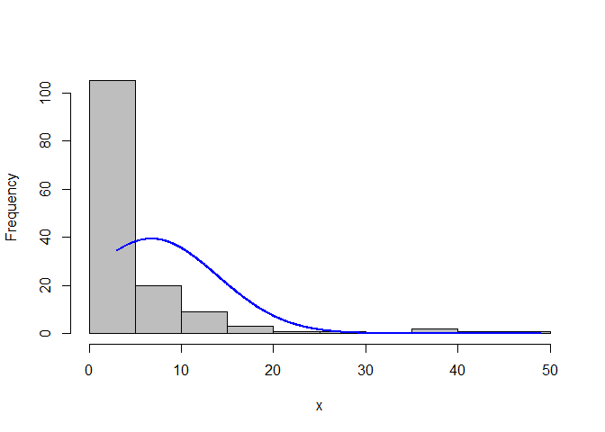<!-- -->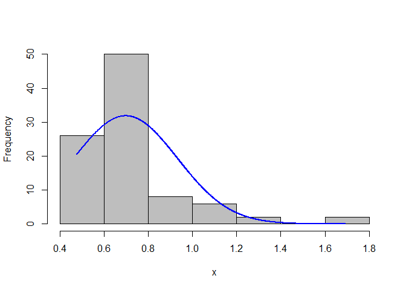<!-- -->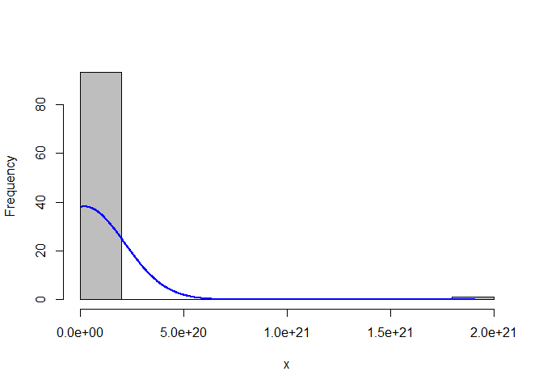<!-- -->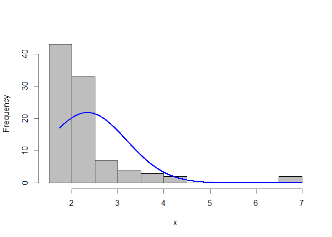<!-- -->

```
## 
## 	Shapiro-Wilk normality test
## 
## data:  trait
## W = 0.47151, p-value < 2.2e-16
## 
## 
## 	Shapiro-Wilk normality test
## 
## data:  log10(trait)
## W = 0.77882, p-value = 2.051e-13
## 
## 
## 	Shapiro-Wilk normality test
## 
## data:  exp(trait)
## W = 0.057458, p-value < 2.2e-16
## 
## 
## 	Shapiro-Wilk normality test
## 
## data:  sqrt(trait)
## W = 0.62719, p-value < 2.2e-16
```

``` r
# happened pretty quickly. not normal but transformation doesn't help

explore_trans(CleanData_2021$DayToBolt)
```

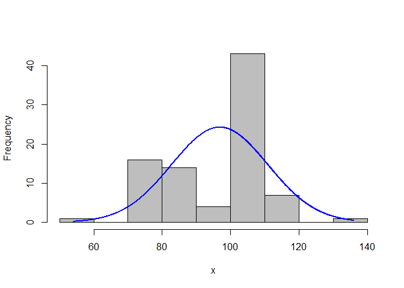<!-- -->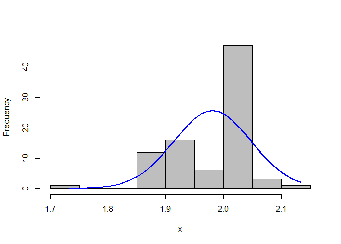<!-- -->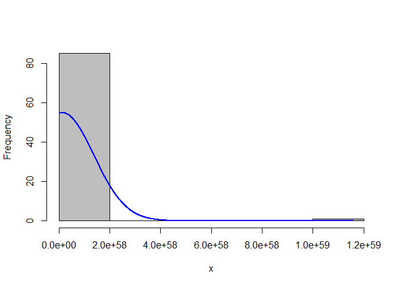<!-- -->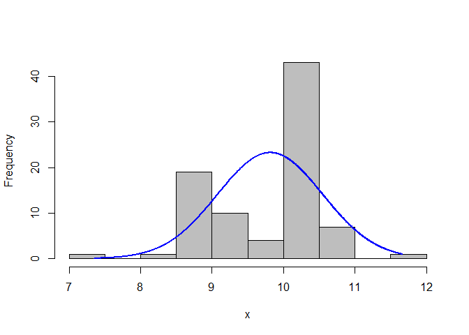<!-- -->

```
## 
## 	Shapiro-Wilk normality test
## 
## data:  trait
## W = 0.90279, p-value = 1.193e-07
## 
## 
## 	Shapiro-Wilk normality test
## 
## data:  log10(trait)
## W = 0.87986, p-value = 8.367e-09
## 
## 
## 	Shapiro-Wilk normality test
## 
## data:  exp(trait)
## W = 0.061929, p-value < 2.2e-16
## 
## 
## 	Shapiro-Wilk normality test
## 
## data:  sqrt(trait)
## W = 0.89316, p-value = 3.749e-08
```

``` r
explore_trans(CleanData_2021$DayToFlwr)
```

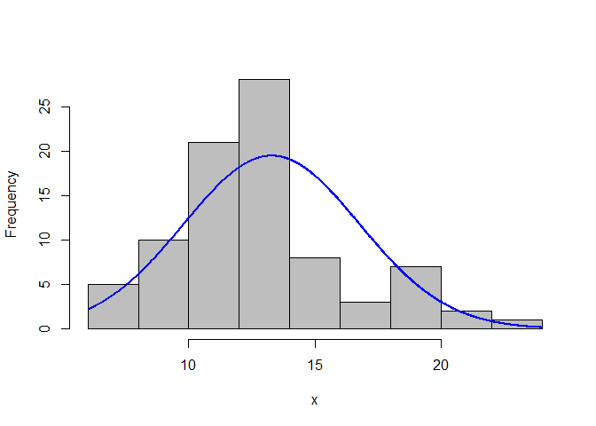<!-- -->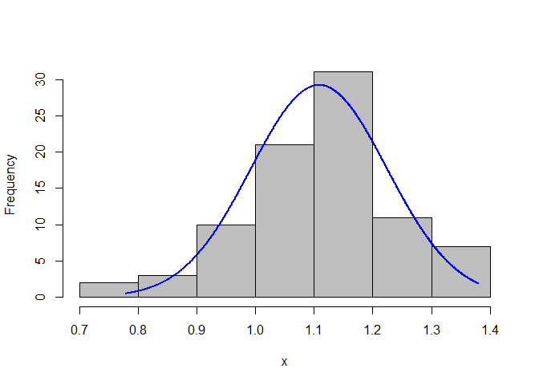<!-- --><!-- -->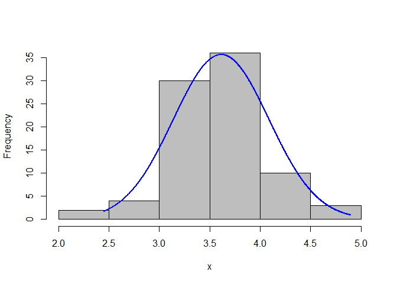<!-- -->

```
## 
## 	Shapiro-Wilk normality test
## 
## data:  trait
## W = 0.96854, p-value = 0.004487
## 
## 
## 	Shapiro-Wilk normality test
## 
## data:  log10(trait)
## W = 0.94491, p-value = 5.383e-05
## 
## 
## 	Shapiro-Wilk normality test
## 
## data:  exp(trait)
## W = 0.080457, p-value < 2.2e-16
## 
## 
## 	Shapiro-Wilk normality test
## 
## data:  sqrt(trait)
## W = 0.97271, p-value = 0.01092
```

``` r
# SQRT is better but leaving for consistency in treating phenology

explore_trans(CleanData_2021$EmergeToFlwr)
```

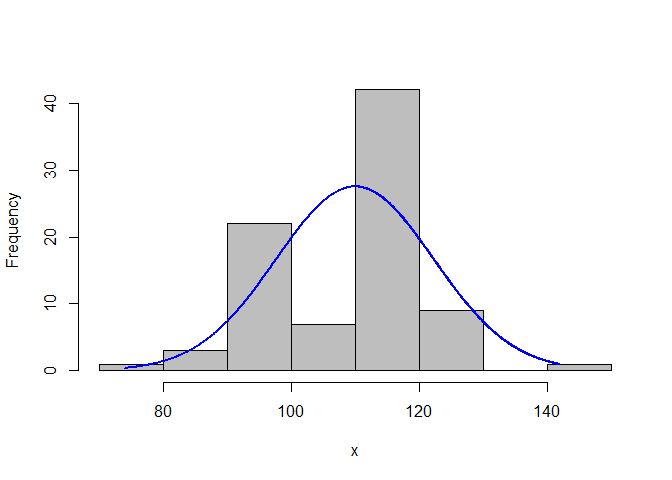<!-- -->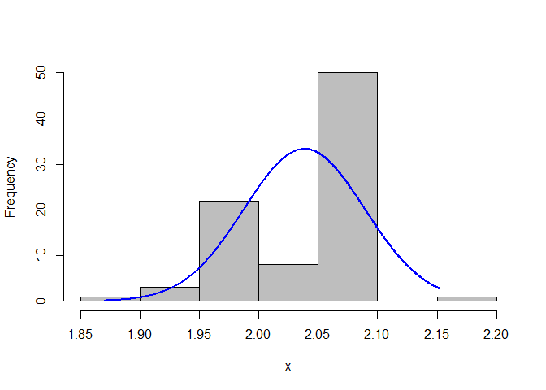<!-- -->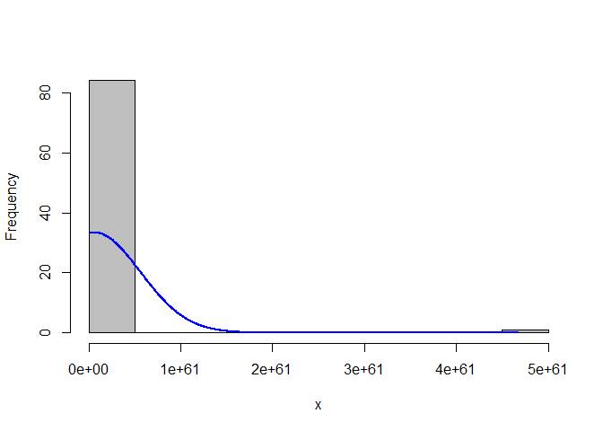<!-- -->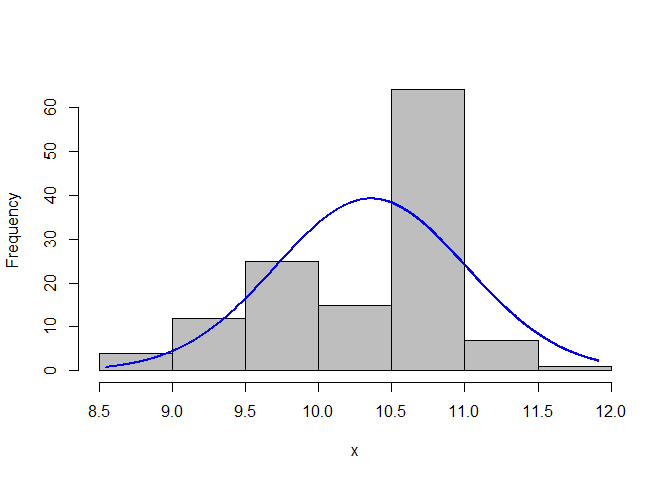<!-- -->

```
## 
## 	Shapiro-Wilk normality test
## 
## data:  trait
## W = 0.90531, p-value = 1.786e-07
## 
## 
## 	Shapiro-Wilk normality test
## 
## data:  log10(trait)
## W = 0.88634, p-value = 1.891e-08
## 
## 
## 	Shapiro-Wilk normality test
## 
## data:  exp(trait)
## W = 0.0623, p-value < 2.2e-16
## 
## 
## 	Shapiro-Wilk normality test
## 
## data:  sqrt(trait)
## W = 0.8968, p-value = 6.326e-08
```
## Save file
Save this file to read in to analysis script

``` r
write.csv(CleanData_2021, file = "data/CleanData_2021.csv", row.names = FALSE)
```


# 2022

## Load in Data

Raw data files not saved in github. All intermediate files are.


``` r
Dat1 <- read.csv("C:/Users/Sophie/OneDrive - Michigan State University/Arabidopsis/Swe_Italy/Summer2022/DataSheets/DataEntry.csv", header = TRUE) 
Dat2 <- read.csv("C:/Users/Sophie/OneDrive - Michigan State University/Arabidopsis/Swe_Italy/Summer2022/DataSheets/LeafCountPlantWeights.csv", header = TRUE)
Dat3 <- read.csv("C:/Users/Sophie/OneDrive - Michigan State University/Arabidopsis/Swe_Italy/Summer2022/DataSheets/Resultsleafarea.csv", header = TRUE)
Dat4 <- read.csv("C:/Users/Sophie/OneDrive - Michigan State University/Arabidopsis/Swe_Italy/Summer2022/DataSheets/Phenology_Sum2022.csv", header = TRUE)

# this file already has averages calcuated. Tori did it in excel. To get a file without averages, read in KBS_Stomata_Count.csv
Stomata <- read.csv("C:/Users/Sophie/OneDrive - Michigan State University/Arabidopsis/Swe_Italy/Summer2022/DataSheets/KBS_Stomata_Count_AVG.csv", header = TRUE)
```

## Clean up data

Now, organize data to rows with data.

``` r
# remove test rows. note: total leaf number wasn't split into rosette and under until partway through harvesting
Dat1 <- Dat1[1:129, ]

# remove test rows and columns we don't need
Dat2 <- Dat2[1:129, 1:8]

# only keep columns with data
Dat3 <- Dat3[ , 2:4]
# create PotID column
Dat3$PotID <- substr(Dat3$Label, 1, regexpr("_", Dat3$Label)-1)

# remove test rows
# note: dat 4 has everything including the pots that had no emergence or emergence but died before vernalization when I did transplanting. That is why there are more rows than the other dataframes.
Dat4 <- Dat4[1:141, ]
# fix incorrect emergence date for B13-3-F b/c it is the date for the rogue capsella that emerged.
Dat4[Dat4$PotID == "B13-3-F", "Emergence.Date"] <- NA


# split all data from average calculation that was done in excel
Stomata_avg <- Stomata[1:129, 6:8]
Stomata <- Stomata[1:258, 1:5]
colnames(Stomata_avg) <- c("Treatment", "PotID", "Stom_avg")
Stomata_avg[14, "Treatment"] <- "Current"
```

## Merge together 
Merge all the data, then clean up the big dataframe to get ready for analysis.
Change the type of data (character, numeric, factor) as needed for each column


``` r
Alldata_2022 <- merge(Dat1, Dat2, by = c("PotID", "Treatment"), all = TRUE)
Alldata_2022 <- merge(Alldata_2022, Dat3, by =c("PotID"), all = TRUE)
Alldata_2022 <- merge(Alldata_2022, Dat4, by = c("PotID", "Treatment"), all = TRUE)

# has one more row than Dat4 because of "B15-1-C (E)" - removed below

# add in stomata averages. the just stomata data frame won't merge nicely because of the format.
Alldata_2022 <- merge(Alldata_2022, Stomata_avg, by = c("PotID", "Treatment"), all = TRUE)

# format dates as dates since stratification (ignores planting day + first week in cold room) - so day 1 is first day in chambers
Alldata_2022$Emergence <- julian(as.Date(Alldata_2022$Emergence.Date, "%m/%d/%Y"), origin = as.Date("2022-04-11"))
Alldata_2022$Bolting <- julian(as.Date(Alldata_2022$BoltingDate, "%m/%d/%Y"), origin = as.Date("2022-04-11"))
Alldata_2022$Harvest <- julian(as.Date(Alldata_2022$HarvestDate, "%m/%d/%Y"), origin = as.Date("2022-04-11"))
Alldata_2022$RootHarvest <- julian(as.Date(Alldata_2022$RootHarvestDate, "%m/%d/%Y"), origin = as.Date("2022-04-11"))

# calculate days between dates
Alldata_2022$EmergenceToBolting <- Alldata_2022$Bolting - Alldata_2022$Emergence
# ideally, bolting to harvest is zero and harvest to root harvest is zero but hasn't always feasible. May want the difference in a model
Alldata_2022$BoltingToRootWashing <- Alldata_2022$RootHarvest - Alldata_2022$Bolting
Alldata_2022$BoltingToHarvest <- Alldata_2022$Harvest - Alldata_2022$Bolting 

#Remove the extra plant that was growing in same pot as another plant
Alldata_2022 <- Alldata_2022[!(Alldata_2022$PotID == "B15-1-C (E)"), ]

# save this output file as a raw data file 
write.csv(Alldata_2022, "data/AllData_2022.csv", row.names = FALSE)
```

Clean up environment


``` r
rm("Dat1", "Dat2", "Dat3", "Dat4", "Stomata_avg")
```

Now clean up with AllData file to only keep things we will analyze.


``` r
CleanData_2022 <- Alldata_2022

keepCols <- c("PotID", "Treatment", "Population", "Line.x", "Replicate", "Chamber", "Flat", "transplanted", "Emergence", "EmergenceToBolting", "BoltingToRootWashing", "BoltingToHarvest", "Number.Emerged", "Leaf.Number.PreVern..post.transplant", "LeafNumber_6.6.2022", "LeafNumber_6.13.2022", "SingleLeaf_FreshWt.g.", "SingleLeafHydratedWt.g.", "SingleLeafDryWt.g.", "Area", "Perim.", "TotalLeafNumber", "RosetteLeafNumber", "UnderLeavesNumber", "AG_DryBiomass.g.", "BG_DryBiomass.g.", "Stom_avg")

# Note: plants that died are still included at this point. by keeping Line.x, all the plants that were transplanted into with a genotype (so their line no longer exists in the dataframe) have an NA in the line column. I want to remove these because they are not helfpul, and I know from later on in the analysis that days to emergence and leaf number at 4 weeks are not important traits in the analysis (maybe not even being included in the supplemental) so I should exclude these plants that only have those 2 traits measured and died before bolting when the important traits were measured.


# for the columns, I am reordering so all the general info is in the first few columns, then dates of things only keeping the "days to" calculations, leaf numbers through growth period, single leaf traits, then whole plant harvest traits

CleanData_2022 <- CleanData_2022[!(is.na(CleanData_2022$Line.x)) , keepCols ]

# now Clean up those column names!
# NoTe: The flat column is for after vernalization. Before vernalization the chamber column is equivalent to the different flats and all plants were in the same chamber.
colnames(CleanData_2022) <- c("PotID", "Treatment", "Population", "Line", "Replicate", "Chamber", "Flat", "Transplanted", "DaysToEmergence", "EmergenceToBolting", "BoltingToRootWashing", "BoltingToHarvest",  "NumEmerged", "LeafNumber_PreVern", "LeafNumber_Jun6", "LeafNumber_Jun13", "SL_FreshWt", "SL_HydWt", "SL_DryWt", "SL_Area", "SL_Perim", "LeafNumber_Total", "LeafNumber_Rosette", "LeafNumber_UnderLeaves", "AG_DryBiomass", "BG_DryBiomass", "Stomata_avg")

# Change some things to factors
CleanData_2022$Treatment <- as.factor(CleanData_2022$Treatment)
CleanData_2022$Population <- as.factor(CleanData_2022$Population)
CleanData_2022$Chamber <- as.factor(CleanData_2022$Chamber)
CleanData_2022$Flat <- as.factor(CleanData_2022$Flat)
CleanData_2022$Transplanted <- as.factor(CleanData_2022$Transplanted)
```

Calculate other traits

``` r
# Calculate other traits
# SLA = leaf area / leaf dry mass
CleanData_2022$SLA <- CleanData_2022$SL_Area/CleanData_2022$SL_DryWt
# LDMC = dry mass / saturated mass
CleanData_2022$LDMC = CleanData_2022$SL_DryWt / CleanData_2022$SL_HydWt
# RWC = (fresh mass - dry mass) / (saturated mass - dry mass)
CleanData_2022$RWC = (CleanData_2022$SL_FreshWt - CleanData_2022$SL_DryWt) / (CleanData_2022$SL_HydWt - CleanData_2022$SL_DryWt)
# Root_to_Shoot
CleanData_2022$Root_to_Shoot <- CleanData_2022$BG_DryBiomass/(CleanData_2022$AG_DryBiomass)
# 2022 info: stomatal density - FOV under 40x magnification is 29.87μm in width, 22.87 μm in height. Area is 683.17 μm2 if square (or .000683 mm2). 536.2546 if oval
# new info from Tori on 5/28/2025 is: The lens on the microscope was a 40x magnification but the eyepiece was also a 10x magnification so the total magnification for our images is 400x. 
# Our images are 3584 pixels wide by 2748 pixels tall. Using the pixel dimensions and the scale that 0.1mm = 1200 pixels, our images should be 298.67µm x 229.00µm (or .29867mm x .229 mm). That should make the area of the FOV approximately 0.068395 mm^2 or 68,395.43 µm^2
# SB notes: these values are still like 3x higher than I was expecting, but are the best we have so far

# Tori went back an remeasured (did more research, found out pixel method is unreliable, used a better way with micrometer images) and got 0.290mm length x 0.228mm width
CleanData_2022$Stomata_density <- CleanData_2022$Stomata_avg / (0.290 * 0.228 )

# to match low end of published 80- 200 stomata/mm2, would expect the area to be 0.5mm2 or 500um2
```

## Transformations
This code is determining which traits may need to be transformed when I run model analysis in the next script. It checks general distributions, tries different transformations, and adds a column to CleanData with the transformed phenotype if transformation increases normality. Note: for the models, the residuals need to be normal for the linear regression assumption, not necessarily the variables themselves.

Start with big overview of everything

``` r
# get a giant view of all the traits, not a super helpful figure honestly
CleanData_2022 %>% select_if(is.numeric) %>% gather(cols, value) %>% 
  ggplot(aes(x = value)) + 
  geom_histogram() + 
  facet_wrap(.~cols, scales = "free")
```

```
## `stat_bin()` using `bins = 30`. Pick better value with `binwidth`.
```

```
## Warning: Removed 206 rows containing non-finite outside the scale range
## (`stat_bin()`).
```

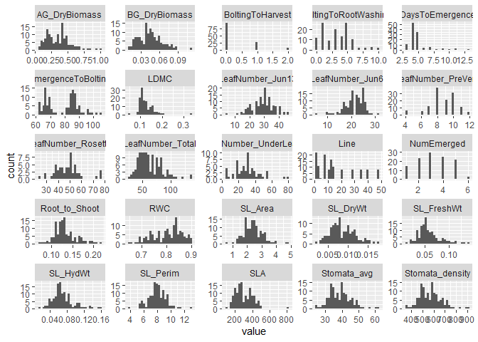<!-- -->

Dates

``` r
explore_trans(CleanData_2022$DaysToEmergence)
```

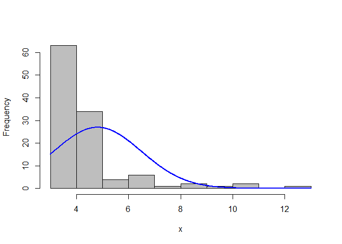<!-- -->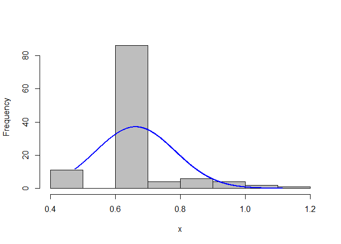<!-- --><!-- -->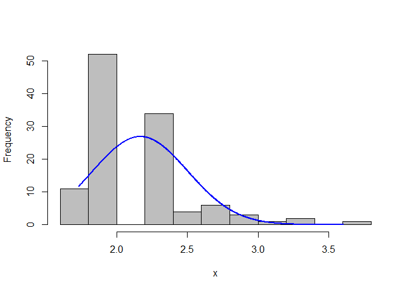<!-- -->

```
## 
## 	Shapiro-Wilk normality test
## 
## data:  trait
## W = 0.70278, p-value = 7.035e-14
## 
## 
## 	Shapiro-Wilk normality test
## 
## data:  log10(trait)
## W = 0.83228, p-value = 4.758e-10
## 
## 
## 	Shapiro-Wilk normality test
## 
## data:  exp(trait)
## W = 0.10735, p-value < 2.2e-16
## 
## 
## 	Shapiro-Wilk normality test
## 
## data:  sqrt(trait)
## W = 0.77513, p-value = 6.333e-12
```

``` r
# add column of log transformed information to dataframe
CleanData_2022$l10_DaysToEmergence <- log10(CleanData_2022$DaysToEmergence)

explore_trans(CleanData_2022$EmergenceToBolting)
```

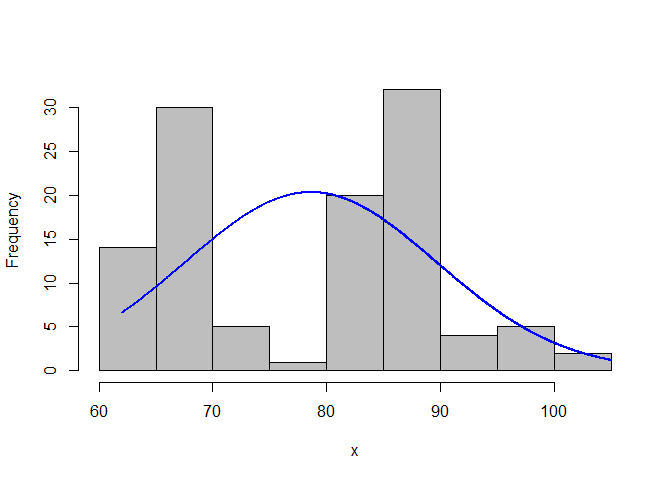<!-- --><!-- -->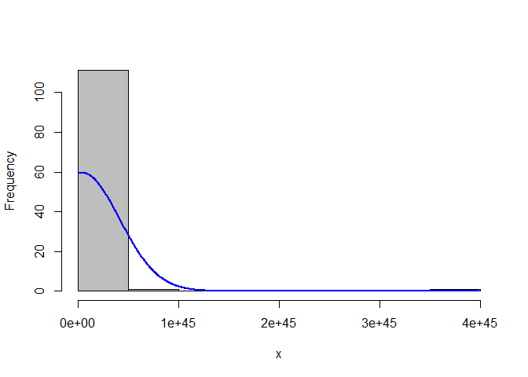<!-- -->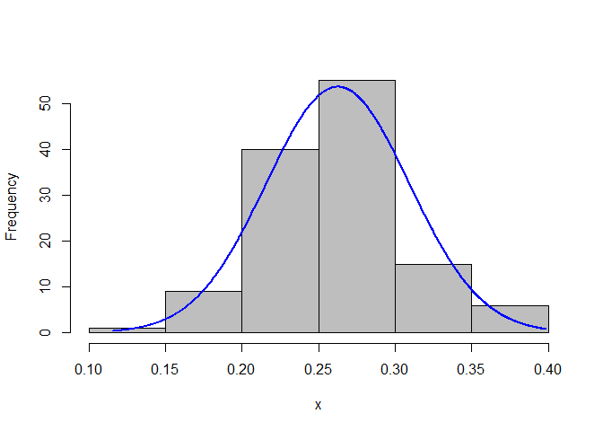<!-- -->

```
## 
## 	Shapiro-Wilk normality test
## 
## data:  trait
## W = 0.90181, p-value = 4.737e-07
## 
## 
## 	Shapiro-Wilk normality test
## 
## data:  log10(trait)
## W = 0.8964, p-value = 2.557e-07
## 
## 
## 	Shapiro-Wilk normality test
## 
## data:  exp(trait)
## W = 0.083792, p-value < 2.2e-16
## 
## 
## 	Shapiro-Wilk normality test
## 
## data:  sqrt(trait)
## W = 0.89953, p-value = 3.646e-07
```

``` r
# just check distributions
plotNormalHistogram(CleanData_2022$BoltingToRootWashing)
```

<!-- -->

``` r
plotNormalHistogram(CleanData_2022$BoltingToHarvest)
```

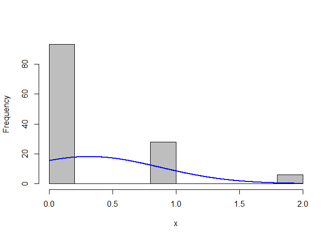<!-- -->

Single Leaf Traits


``` r
explore_trans(CleanData_2022$SL_FreshWt)
```

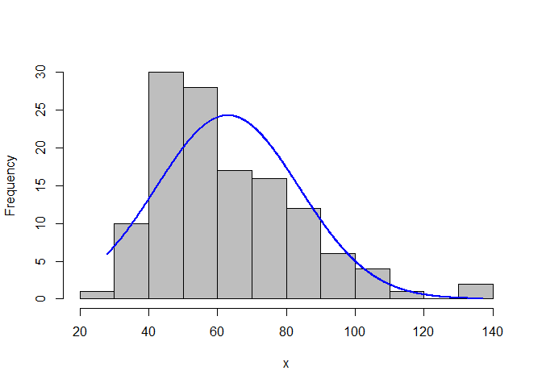<!-- -->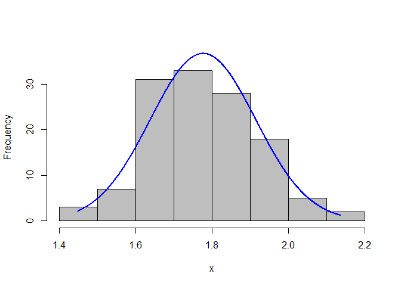<!-- -->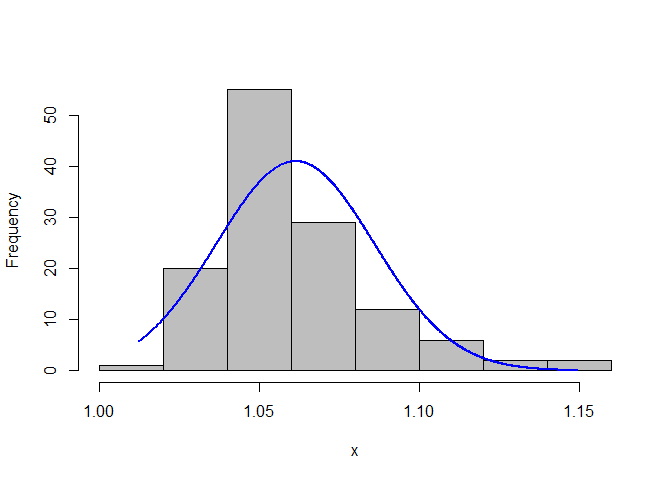<!-- -->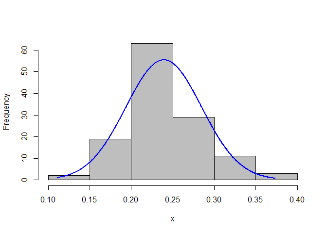<!-- -->

```
## 
## 	Shapiro-Wilk normality test
## 
## data:  trait
## W = 0.92874, p-value = 4.614e-06
## 
## 
## 	Shapiro-Wilk normality test
## 
## data:  log10(trait)
## W = 0.97674, p-value = 0.02754
## 
## 
## 	Shapiro-Wilk normality test
## 
## data:  exp(trait)
## W = 0.92051, p-value = 1.434e-06
## 
## 
## 	Shapiro-Wilk normality test
## 
## data:  sqrt(trait)
## W = 0.97546, p-value = 0.02076
```

``` r
CleanData_2022$l10_SL_FreshWt <- log10(CleanData_2022$SL_FreshWt)

explore_trans(CleanData_2022$SL_HydWt)
```

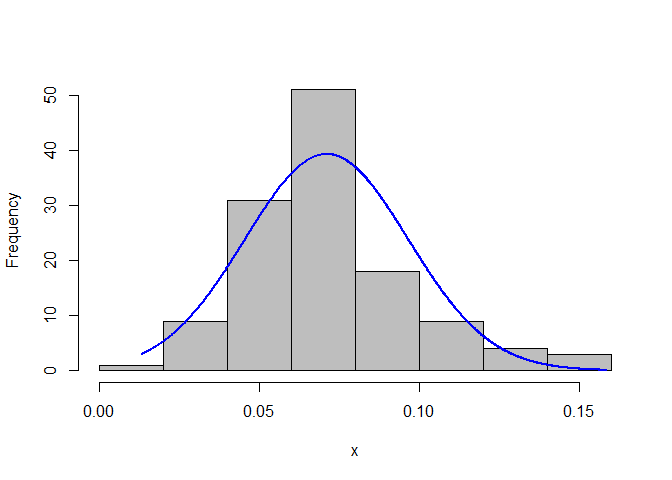<!-- -->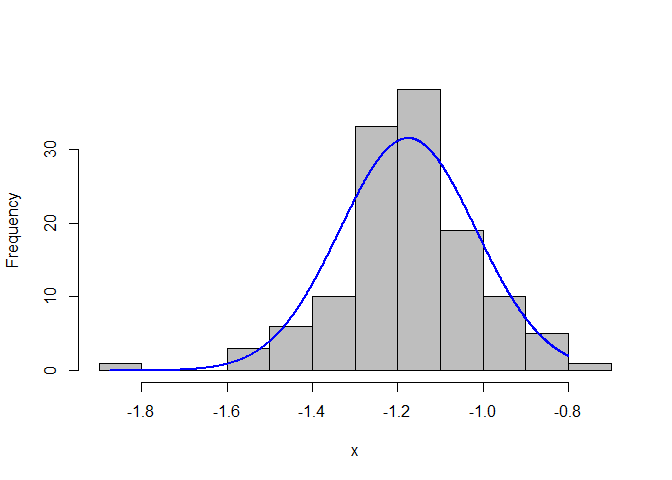<!-- --><!-- -->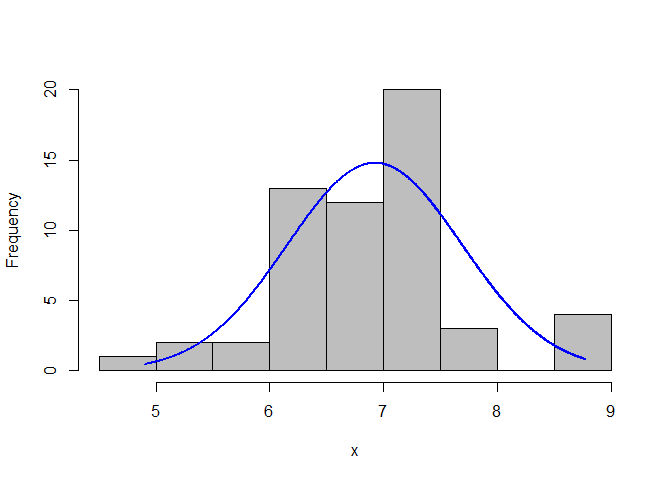<!-- -->

```
## 
## 	Shapiro-Wilk normality test
## 
## data:  trait
## W = 0.93328, p-value = 9.783e-06
## 
## 
## 	Shapiro-Wilk normality test
## 
## data:  log10(trait)
## W = 0.95947, p-value = 0.0008164
## 
## 
## 	Shapiro-Wilk normality test
## 
## data:  exp(trait)
## W = 0.92404, p-value = 2.546e-06
## 
## 
## 	Shapiro-Wilk normality test
## 
## data:  sqrt(trait)
## W = 0.97284, p-value = 0.01221
```

``` r
CleanData_2022$l10_SL_HydWt <- log10(CleanData_2022$SL_HydWt)
CleanData_2022$SQR_SL_HydWt <- sqrt(CleanData_2022$SL_HydWt)

explore_trans(CleanData_2022$SL_DryWt)
```

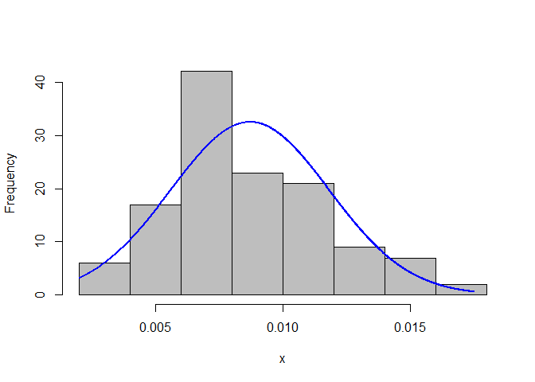<!-- -->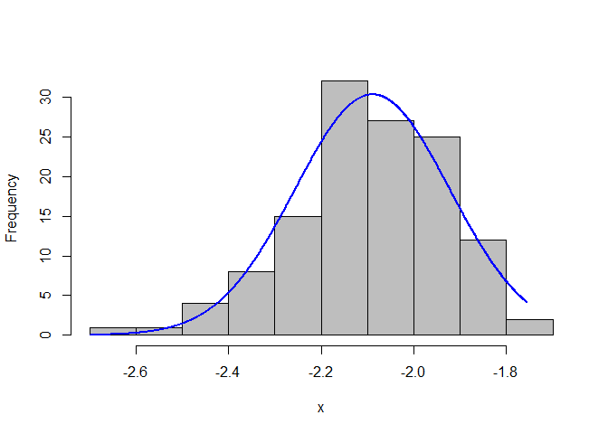<!-- -->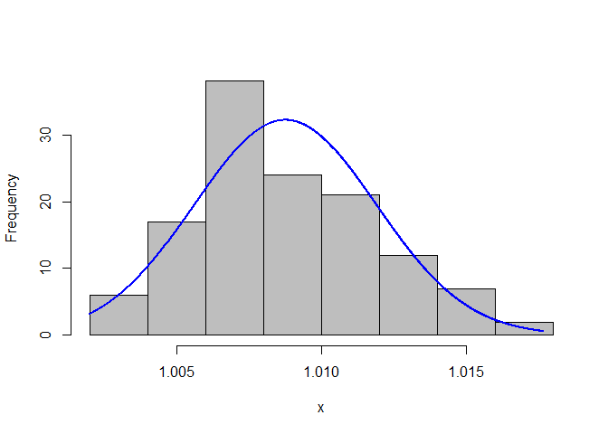<!-- -->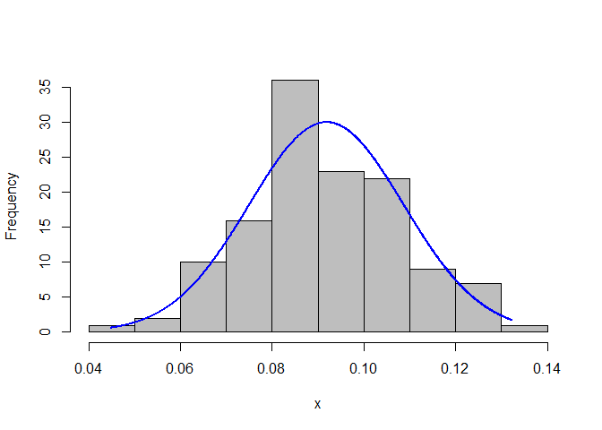<!-- -->

```
## 
## 	Shapiro-Wilk normality test
## 
## data:  trait
## W = 0.98058, p-value = 0.06519
## 
## 
## 	Shapiro-Wilk normality test
## 
## data:  log10(trait)
## W = 0.97679, p-value = 0.02785
## 
## 
## 	Shapiro-Wilk normality test
## 
## data:  exp(trait)
## W = 0.98016, p-value = 0.05924
## 
## 
## 	Shapiro-Wilk normality test
## 
## data:  sqrt(trait)
## W = 0.99477, p-value = 0.9246
```

``` r
CleanData_2022$SQR_SL_DryWt <- sqrt(CleanData_2022$SL_DryWt)

explore_trans(CleanData_2022$SL_Area)
```

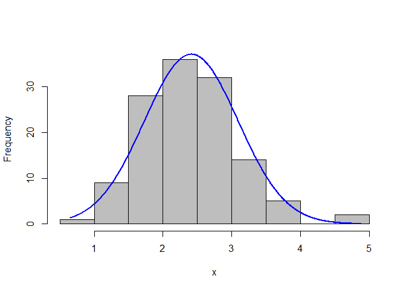<!-- -->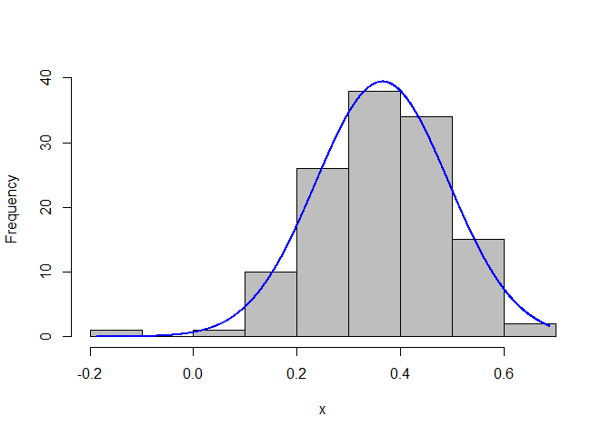<!-- --><!-- -->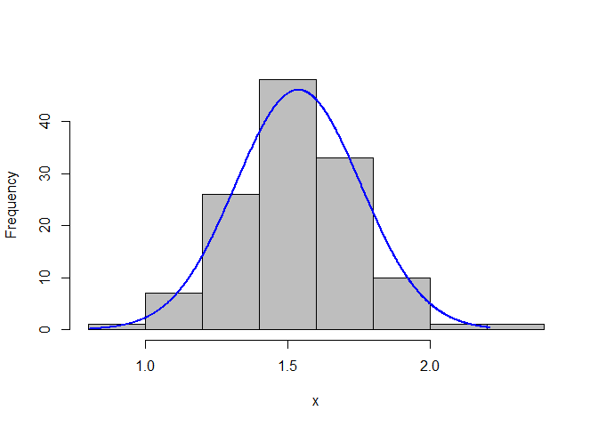<!-- -->

```
## 
## 	Shapiro-Wilk normality test
## 
## data:  trait
## W = 0.97274, p-value = 0.01144
## 
## 
## 	Shapiro-Wilk normality test
## 
## data:  log10(trait)
## W = 0.96967, p-value = 0.005959
## 
## 
## 	Shapiro-Wilk normality test
## 
## data:  exp(trait)
## W = 0.5367, p-value < 2.2e-16
## 
## 
## 	Shapiro-Wilk normality test
## 
## data:  sqrt(trait)
## W = 0.98923, p-value = 0.4255
```

``` r
CleanData_2022$SQR_SL_Area <- sqrt(CleanData_2022$SL_Area)

explore_trans(CleanData_2022$SL_Perim)
```

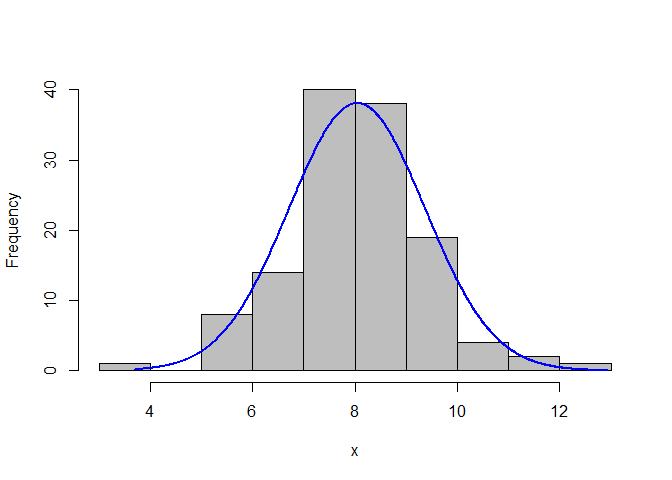<!-- -->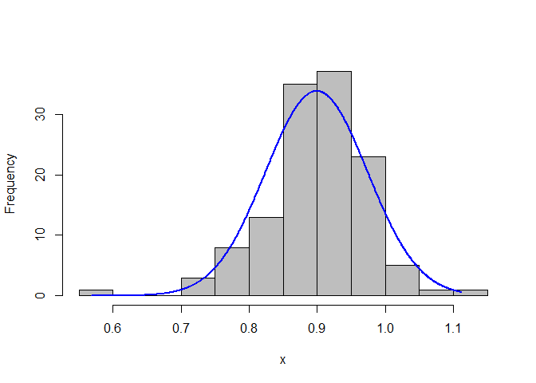<!-- -->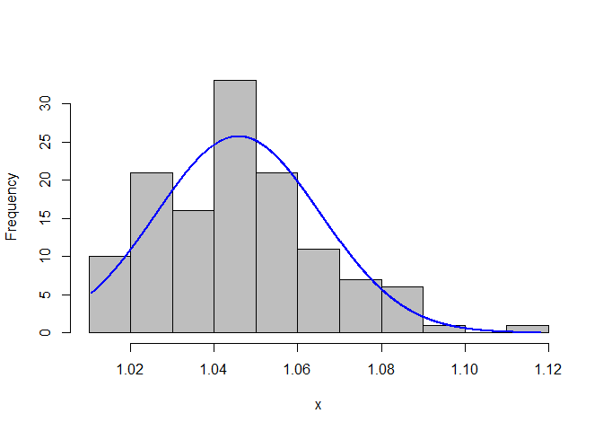<!-- -->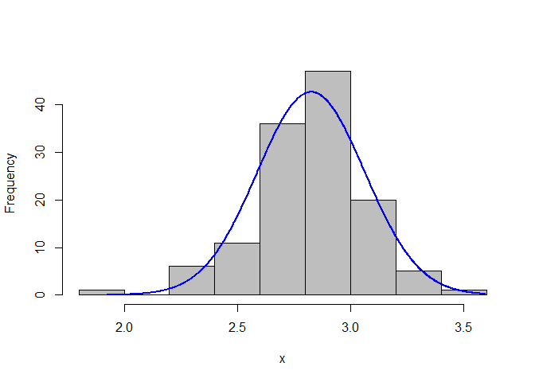<!-- -->

```
## 
## 	Shapiro-Wilk normality test
## 
## data:  trait
## W = 0.98331, p-value = 0.1205
## 
## 
## 	Shapiro-Wilk normality test
## 
## data:  log10(trait)
## W = 0.96051, p-value = 0.0009417
## 
## 
## 	Shapiro-Wilk normality test
## 
## data:  exp(trait)
## W = 0.18518, p-value < 2.2e-16
## 
## 
## 	Shapiro-Wilk normality test
## 
## data:  sqrt(trait)
## W = 0.97947, p-value = 0.05076
```

``` r
print(shapiro.test(CleanData_2022$SLA))
```

```
## 
## 	Shapiro-Wilk normality test
## 
## data:  CleanData_2022$SLA
## W = 0.92166, p-value = 1.681e-06
```

``` r
print(shapiro.test(log10(CleanData_2022$SLA)))
```

```
## 
## 	Shapiro-Wilk normality test
## 
## data:  log10(CleanData_2022$SLA)
## W = 0.98251, p-value = 0.1007
```

``` r
print(shapiro.test(exp(CleanData_2022$SLA)))
```

```
## 
## 	Shapiro-Wilk normality test
## 
## data:  exp(CleanData_2022$SLA)
## W = NaN, p-value = NA
```

``` r
print(shapiro.test(sqrt(CleanData_2022$SLA))) 
```

```
## 
## 	Shapiro-Wilk normality test
## 
## data:  sqrt(CleanData_2022$SLA)
## W = 0.96724, p-value = 0.003596
```

``` r
CleanData_2022$l10_SLA <- log10(CleanData_2022$SLA)


explore_trans(CleanData_2022$RWC)
```

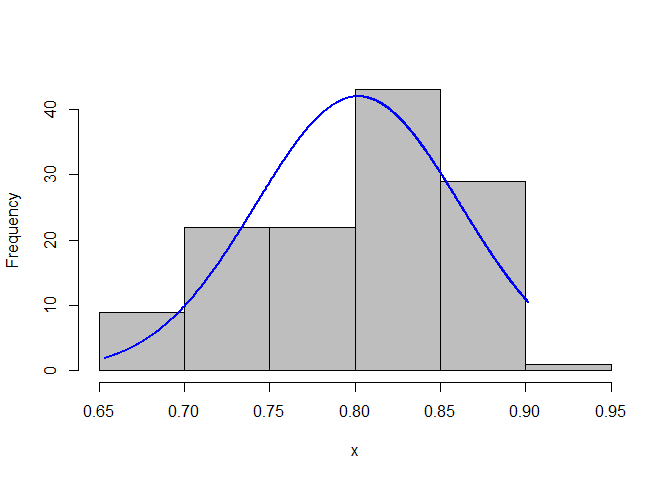<!-- --><!-- -->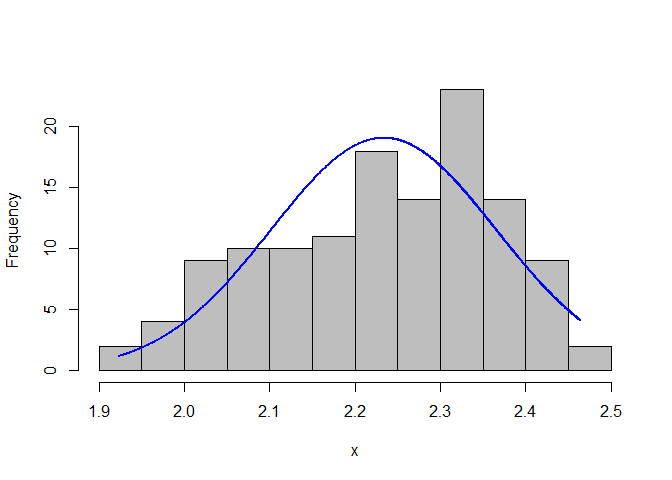<!-- -->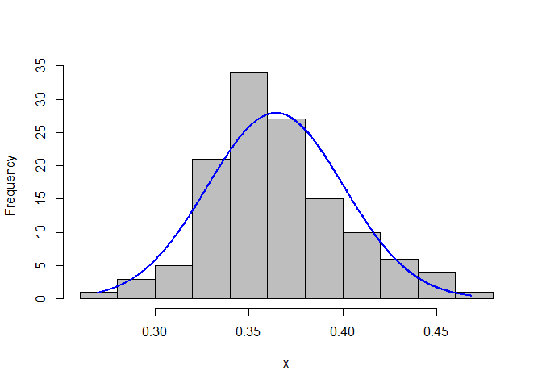<!-- -->

```
## 
## 	Shapiro-Wilk normality test
## 
## data:  trait
## W = 0.96038, p-value = 0.0009707
## 
## 
## 	Shapiro-Wilk normality test
## 
## data:  log10(trait)
## W = 0.9507, p-value = 0.0001654
## 
## 
## 	Shapiro-Wilk normality test
## 
## data:  exp(trait)
## W = 0.96651, p-value = 0.003251
## 
## 
## 	Shapiro-Wilk normality test
## 
## data:  sqrt(trait)
## W = 0.95585, p-value = 0.0004155
```

``` r
#exp best but rest really similar so not doing anything for consistency

explore_trans(CleanData_2022$LDMC)
```

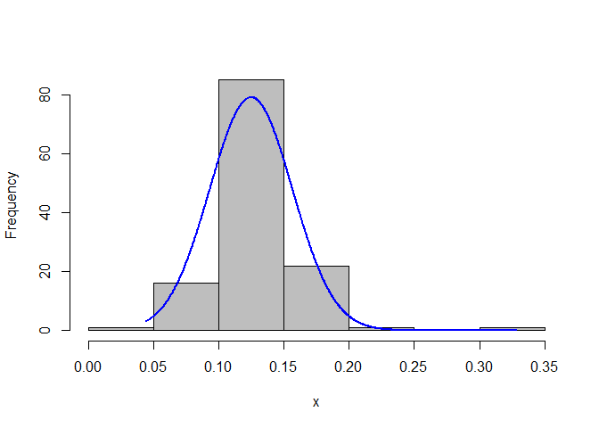<!-- -->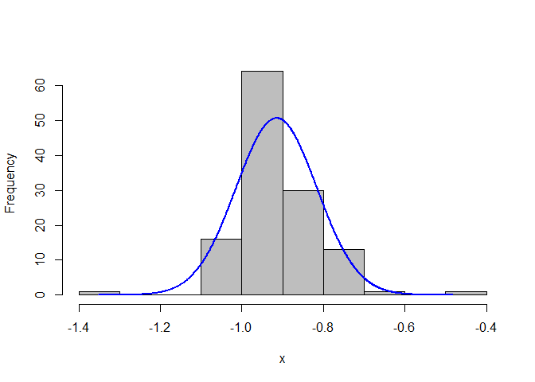<!-- -->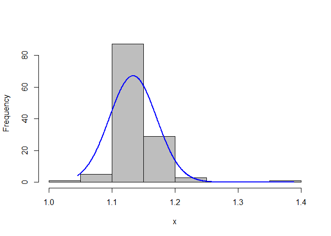<!-- -->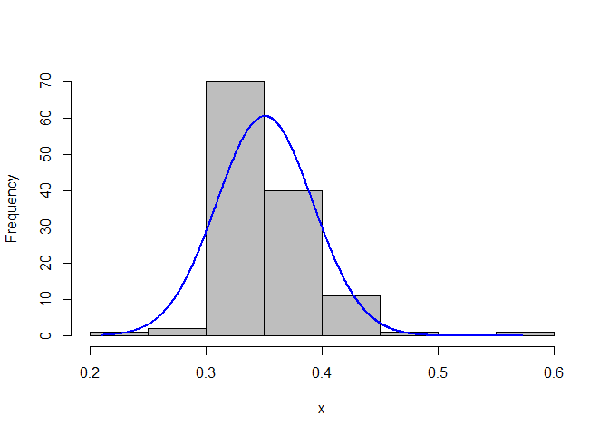<!-- -->

```
## 
## 	Shapiro-Wilk normality test
## 
## data:  trait
## W = 0.81822, p-value = 3.491e-11
## 
## 
## 	Shapiro-Wilk normality test
## 
## data:  log10(trait)
## W = 0.91592, p-value = 8.377e-07
## 
## 
## 	Shapiro-Wilk normality test
## 
## data:  exp(trait)
## W = 0.78614, p-value = 2.867e-12
## 
## 
## 	Shapiro-Wilk normality test
## 
## data:  sqrt(trait)
## W = 0.88769, p-value = 2.672e-08
```

``` r
CleanData_2022$l10_LDMC <- log10(CleanData_2022$LDMC)
```

Leaf Number + biomass


``` r
explore_trans(CleanData_2022$LeafNumber_Total)
```

<!-- --><!-- --><!-- -->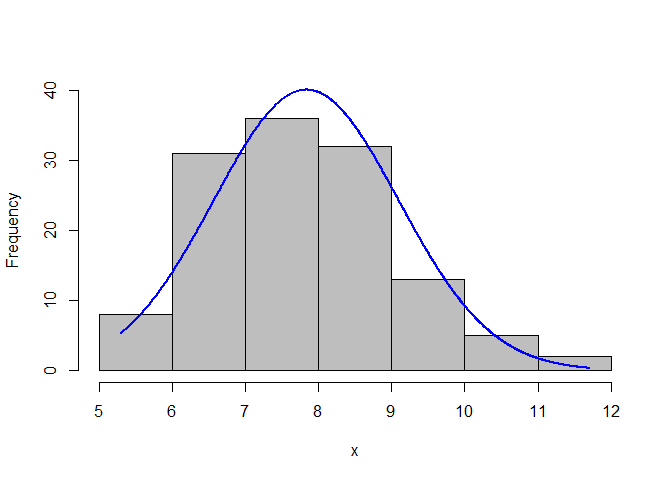<!-- -->

```
## 
## 	Shapiro-Wilk normality test
## 
## data:  trait
## W = 0.93745, p-value = 1.726e-05
## 
## 
## 	Shapiro-Wilk normality test
## 
## data:  log10(trait)
## W = 0.99196, p-value = 0.6799
## 
## 
## 	Shapiro-Wilk normality test
## 
## data:  exp(trait)
## W = 0.067702, p-value < 2.2e-16
## 
## 
## 	Shapiro-Wilk normality test
## 
## data:  sqrt(trait)
## W = 0.97422, p-value = 0.01581
```

``` r
CleanData_2022$l10_LeafNumber_Total <- log10(CleanData_2022$LeafNumber_Total)

explore_trans(CleanData_2022$LeafNumber_Rosette)
```

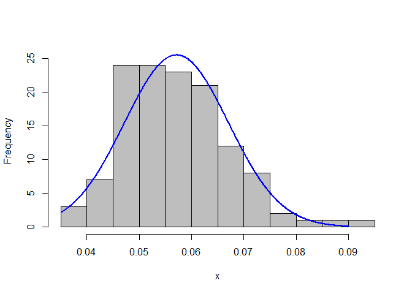<!-- -->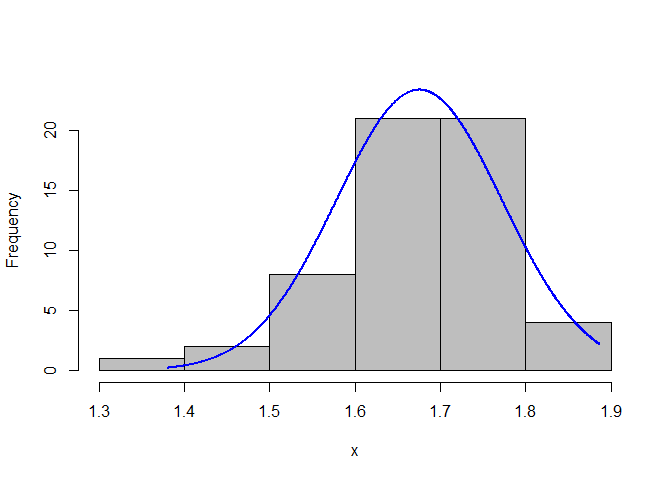<!-- -->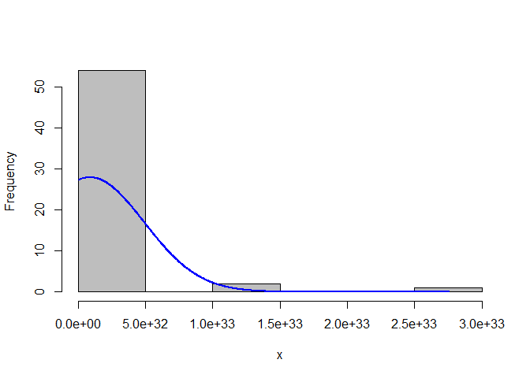<!-- --><!-- -->

```
## 
## 	Shapiro-Wilk normality test
## 
## data:  trait
## W = 0.94163, p-value = 0.008352
## 
## 
## 	Shapiro-Wilk normality test
## 
## data:  log10(trait)
## W = 0.96187, p-value = 0.06967
## 
## 
## 	Shapiro-Wilk normality test
## 
## data:  exp(trait)
## W = 0.22386, p-value = 9.027e-16
## 
## 
## 	Shapiro-Wilk normality test
## 
## data:  sqrt(trait)
## W = 0.9608, p-value = 0.06208
```

``` r
CleanData_2022$l10_LeafNumber_Rosette <- log10(CleanData_2022$LeafNumber_Rosette)

explore_trans(CleanData_2022$LeafNumber_UnderLeaves)
```

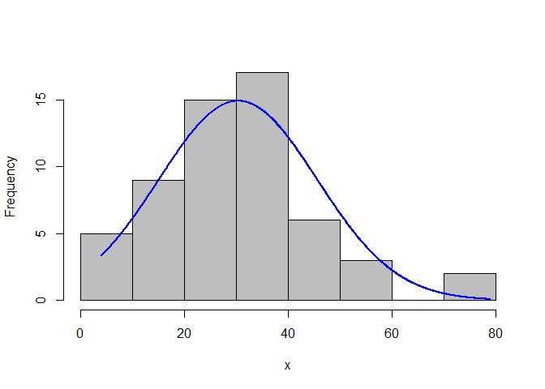<!-- -->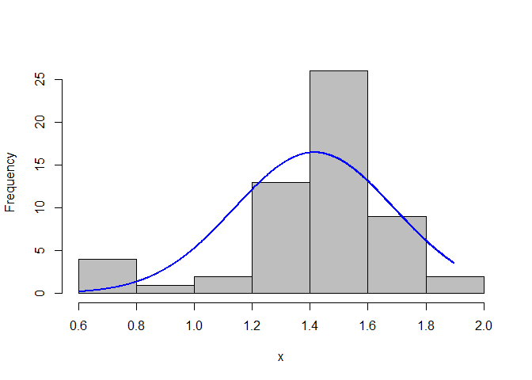<!-- -->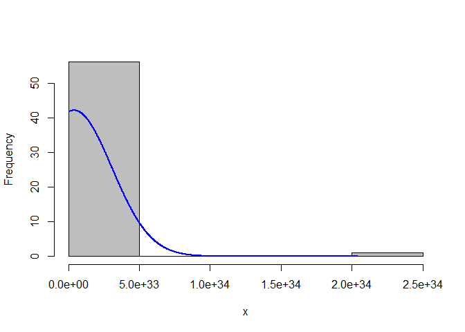<!-- -->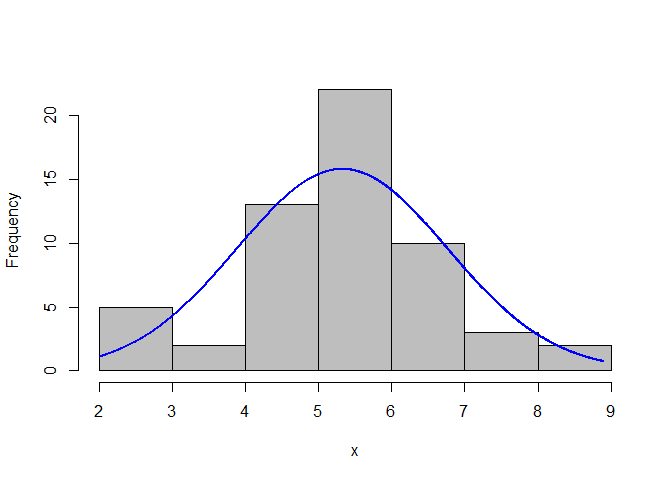<!-- -->

```
## 
## 	Shapiro-Wilk normality test
## 
## data:  trait
## W = 0.94315, p-value = 0.009734
## 
## 
## 	Shapiro-Wilk normality test
## 
## data:  log10(trait)
## W = 0.88261, p-value = 4.913e-05
## 
## 
## 	Shapiro-Wilk normality test
## 
## data:  exp(trait)
## W = 0.1229, p-value < 2.2e-16
## 
## 
## 	Shapiro-Wilk normality test
## 
## data:  sqrt(trait)
## W = 0.9659, p-value = 0.1079
```

``` r
CleanData_2022$SQR_LeafNumber_UnderLeaves <- sqrt(CleanData_2022$LeafNumber_UnderLeaves)

explore_trans(CleanData_2022$AG_DryBiomass)
```

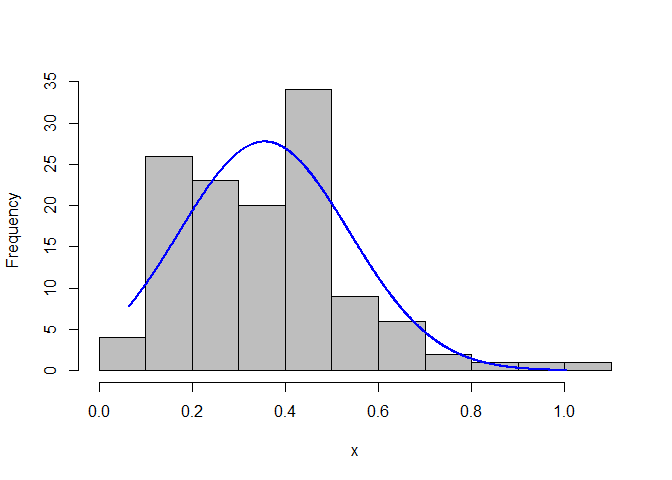<!-- -->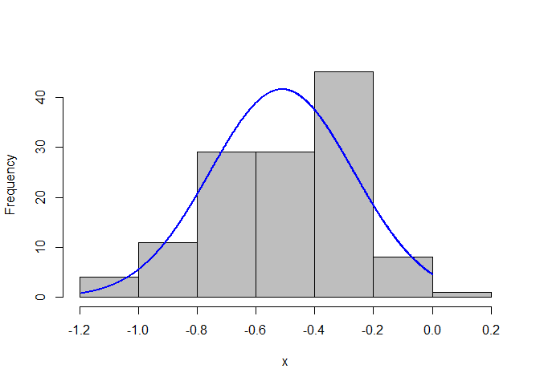<!-- -->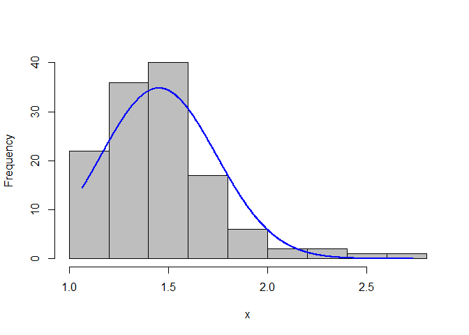<!-- -->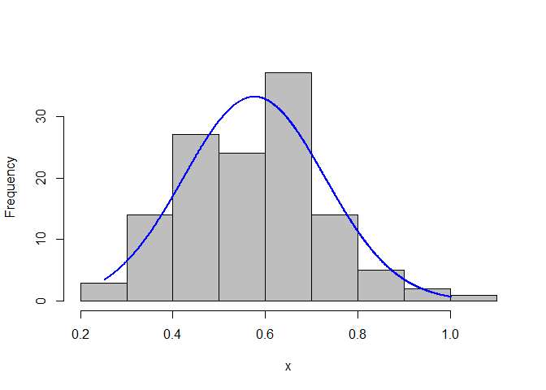<!-- -->

```
## 
## 	Shapiro-Wilk normality test
## 
## data:  trait
## W = 0.94642, p-value = 7.422e-05
## 
## 
## 	Shapiro-Wilk normality test
## 
## data:  log10(trait)
## W = 0.97329, p-value = 0.01289
## 
## 
## 	Shapiro-Wilk normality test
## 
## data:  exp(trait)
## W = 0.87793, p-value = 8.311e-09
## 
## 
## 	Shapiro-Wilk normality test
## 
## data:  sqrt(trait)
## W = 0.98608, p-value = 0.2222
```

``` r
CleanData_2022$SQR_AG_DryBiomass <- sqrt(CleanData_2022$AG_DryBiomass)
CleanData_2022$l10_AG_DryBiomass <- log10(CleanData_2022$AG_DryBiomass)

explore_trans(CleanData_2022$BG_DryBiomass)
```

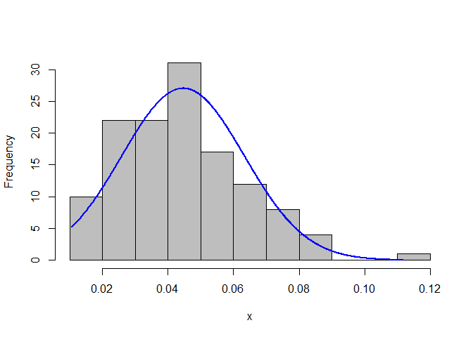<!-- -->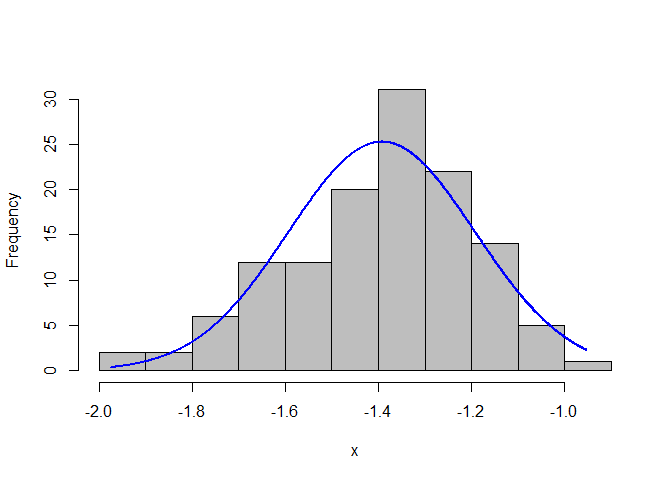<!-- --><!-- -->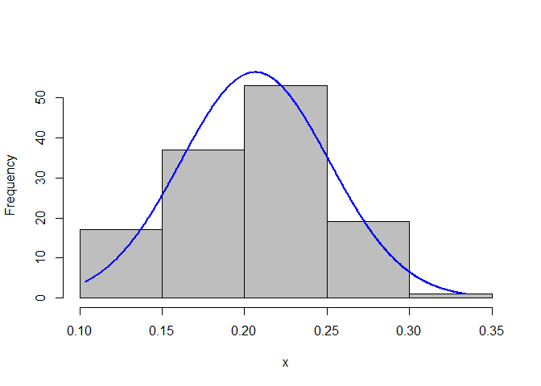<!-- -->

```
## 
## 	Shapiro-Wilk normality test
## 
## data:  trait
## W = 0.97441, p-value = 0.01645
## 
## 
## 	Shapiro-Wilk normality test
## 
## data:  log10(trait)
## W = 0.97032, p-value = 0.006825
## 
## 
## 	Shapiro-Wilk normality test
## 
## data:  exp(trait)
## W = 0.97108, p-value = 0.008026
## 
## 
## 	Shapiro-Wilk normality test
## 
## data:  sqrt(trait)
## W = 0.99152, p-value = 0.6363
```

``` r
CleanData_2022$SQR_BG_DryBiomass <- sqrt(CleanData_2022$BG_DryBiomass)

explore_trans(CleanData_2022$Root_to_Shoot)
```

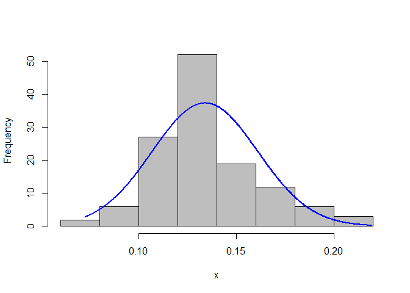<!-- -->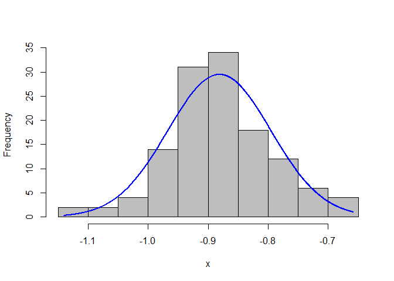<!-- -->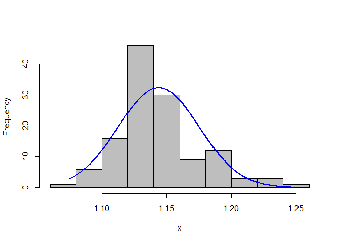<!-- --><!-- -->

```
## 
## 	Shapiro-Wilk normality test
## 
## data:  trait
## W = 0.95123, p-value = 0.0001703
## 
## 
## 	Shapiro-Wilk normality test
## 
## data:  log10(trait)
## W = 0.97909, p-value = 0.0466
## 
## 
## 	Shapiro-Wilk normality test
## 
## data:  exp(trait)
## W = 0.94414, p-value = 5.073e-05
## 
## 
## 	Shapiro-Wilk normality test
## 
## data:  sqrt(trait)
## W = 0.97068, p-value = 0.007369
```

``` r
CleanData_2022$l10_Root_to_Shoot <- log10(CleanData_2022$Root_to_Shoot)
```

Stomata


``` r
explore_trans(CleanData_2022$Stomata_avg)
```

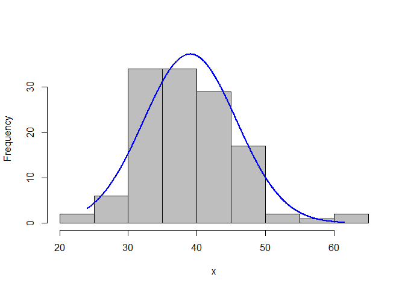<!-- -->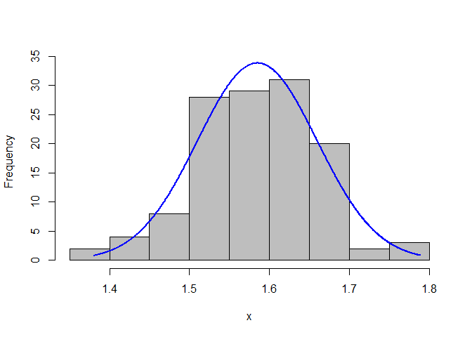<!-- -->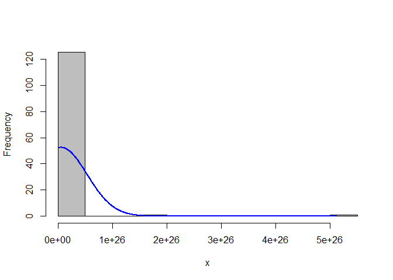<!-- -->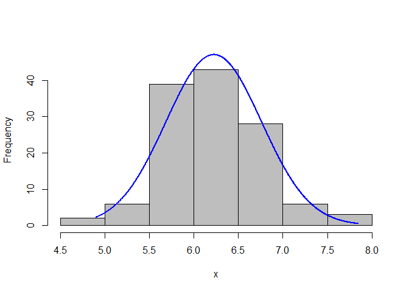<!-- -->

```
## 
## 	Shapiro-Wilk normality test
## 
## data:  trait
## W = 0.9763, p-value = 0.02495
## 
## 
## 	Shapiro-Wilk normality test
## 
## data:  log10(trait)
## W = 0.99305, p-value = 0.7869
## 
## 
## 	Shapiro-Wilk normality test
## 
## data:  exp(trait)
## W = 0.094561, p-value < 2.2e-16
## 
## 
## 	Shapiro-Wilk normality test
## 
## data:  sqrt(trait)
## W = 0.9889, p-value = 0.399
```

``` r
CleanData_2022$l10_Stomata_avg <- log10(CleanData_2022$Stomata_avg)

#explore_trans(CleanData_2022$Stomata_density)
hist(CleanData_2022$Stomata_density)
```

<!-- -->

``` r
shapiro.test(CleanData_2022$Stomata_density)
```

```
## 
## 	Shapiro-Wilk normality test
## 
## data:  CleanData_2022$Stomata_density
## W = 0.9763, p-value = 0.02495
```

``` r
hist(log10(CleanData_2022$Stomata_density))
```

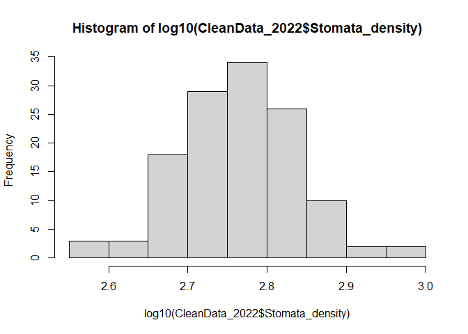<!-- -->

``` r
shapiro.test(log10(CleanData_2022$Stomata_density))
```

```
## 
## 	Shapiro-Wilk normality test
## 
## data:  log10(CleanData_2022$Stomata_density)
## W = 0.99305, p-value = 0.7869
```

``` r
CleanData_2022$l10_Stomata_density <- log10(CleanData_2022$Stomata_density)
```
## Save file
Save this file to read in to analysis script

``` r
write.csv(CleanData_2022, file = "data/CleanData_2022.csv", row.names = FALSE)
```
