# Description

This code runs all linear models for the 2021 and 2022 experiments. To get this to knit with the update for revisions on 3/18/2026, a bunch of traits that aren't in the manuscript and the problem solving code needed to be set to eval = FALSE for a successful knit to happen. Should come back and fix all that later on.

# Set basic info for all code

This chunk sets things that will be constant for the whole document.


``` r
# read in packages
library(dplyr)
library(ggplot2)
library(lme4)
library(lmerTest)
library(tidyr)
library(rcompanion)
library(plotly)
library(emmeans)
library(sjPlot)
# prep for doing statistical analyses
options(contrasts = c("contr.sum", "contr.poly"))

# let's make some functions
std_mean <- function(x){
  sd(x, na.rm = TRUE)/sqrt(length(x))
}

# Confidence interval multiplier for standard error
    # Calculate t-statistic for confidence interval: 
    # e.g., if conf.interval is .95, use .975 (above/below), and use df=N-1

conf_int <- function(x, conf.interval = 0.95){
  ciMult <- qt((1+conf.interval)/2, length(x)-1)
  ci <- std_mean(x) * ciMult
  return(ci)
}
```
# 2021

## Read in data


``` r
Dat_2021 <- read.csv("data/CleanData_2021.csv")
# set factors
Dat_2021 <- Dat_2021 %>% dplyr::mutate(
  Population = as.factor(Population),
  Line = as.factor(Line),
  Treatment = as.factor(Treatment),
  Soil.Mix.Batch.Number.x = as.factor(Soil.Mix.Batch.Number.x),
  BranchStructure = as.factor(BranchStructure),
  DoneFlwr = as.factor(DoneFlwr),
  FruitCounter = as.factor(FruitCounter),
  SeedCounter = as.factor(SeedCounter)
  
)

Dat_2021$Geno_ID <- as.factor(paste0(Dat_2021$Population, Dat_2021$Line))
```


## Summarize

``` r
# NOTE: These are raw means and confidence intervals, used to get a quick look at the data.
ByPop_21 <- Dat_2021 %>%
  dplyr::group_by(Population) %>%
  summarize(across(.col = c(Emergence:LeafNum_08262021, RosetteLeafNum_10042021:Repro_to_Ros, LatBranches:IJ_FruitCount, FruitCollected, NumFlwrLeft:IJ_SeedCount, FruitCount_BL, AG_biomass, AvgSeedWt, AvgSeedNum, fitness), .fns = list(mean = ~mean(.x, na.rm = TRUE, .group = "keep"), ci_95 = ~conf_int(.x), n = ~sum(!is.na(.x)))))

# transpose for easier viewing
ByPop_21 <- data.frame(t(ByPop_21))

# by treatment
ByTrt_21 <- Dat_2021 %>%
  dplyr::group_by(Treatment) %>%
  summarize(across(.col = c(Emergence:LeafNum_08262021, RosetteLeafNum_10042021:Repro_to_Ros, LatBranches:IJ_FruitCount, FruitCollected, NumFlwrLeft:IJ_SeedCount, FruitCount_BL, AG_biomass, AvgSeedWt, AvgSeedNum, fitness), .fns = list(mean = ~mean(.x, na.rm = TRUE, .group = "keep"), ci_95 = ~conf_int(.x), n = ~sum(!is.na(.x)))))
ByTrt_21 <- data.frame(t(ByTrt_21))

#population means within each treatment
ByTrt_Pop_21 <- Dat_2021 %>%
  dplyr::group_by(Population) %>%
  dplyr::group_by(Treatment, .add = TRUE) %>%
  summarize(across(.col = c(Emergence:LeafNum_08262021, RosetteLeafNum_10042021:Repro_to_Ros, LatBranches:IJ_FruitCount, FruitCollected, NumFlwrLeft:IJ_SeedCount, FruitCount_BL, AG_biomass, AvgSeedWt, AvgSeedNum, fitness), .fns = list(mean = ~mean(.x, na.rm = TRUE, .group = "keep"), ci_95 = ~conf_int(.x), n = ~sum(!is.na(.x)))))
```

```
## `summarise()` has grouped output by 'Population'. You can override using the
## `.groups` argument.
```

``` r
# get sample sizes
SampleSizes_2021 <- dplyr::select(ByTrt_Pop_21, "Treatment", "Population", ends_with("_n"))
save(SampleSizes_2021, file = "data/SampleSizes_2021.robj")

# for some ease of viewing
ByTrt_Pop_21 <- data.frame(t(ByTrt_Pop_21))
colnames(ByTrt_Pop_21) <- c("Belm_C", "Belm_F", "Roda_C", "Roda_F")

# save this to keep raw means
write.csv(ByTrt_Pop_21,"data/PopMeansByTreatment_2021.csv", row.names = TRUE )
```
subset to traits in the manuscript

``` r
Dat_2021_TwoTrt <- Dat_2021[ , c("Pot.ID", "Population", "Line", "Geno_ID", "Replicate", "Treatment", "Soil.Mix.Batch.Number.x", "EmergeToFlwr", "l10_FreshWt", "l10_SatWt", "l10_DriedWt", "l10_LeafArea", "l10_SLA", "l10_LDMC", "RWC", "RosetteLeafNum", "l10_DryRosG", "l10_DryReproG", "l10_R_to_R", "FruitCount_BL", "AvgSeedWt", "AvgSeedNum", "l10_AvgSeedNum", "fitness")]

# need to make subsets so only genotypes represented in both treatments are present. this is difficult because it differs between traits.

# need four dataframes. one with everything for fitness measurements of FruitCount_BL and fitness
Dat_2021_fitness <- Dat_2021_TwoTrt[ , c("Pot.ID", "Population", "Line", "Geno_ID", "Replicate", "Treatment", "Soil.Mix.Batch.Number.x","FruitCount_BL", "fitness")]

#one that removes B4, R5, and B13 from all traits left. this will be the starting point for the final two dataframes.
Dat_2021_most <- Dat_2021_TwoTrt[!((Dat_2021_TwoTrt$Population == "BELM" & Dat_2021_TwoTrt$Line %in% c(4, 13)) | (Dat_2021_TwoTrt$Population == "RODA" & Dat_2021_TwoTrt$Line == 5)), c("Pot.ID", "Population", "Line", "Geno_ID", "Replicate", "Treatment", "Soil.Mix.Batch.Number.x", "EmergeToFlwr", "l10_FreshWt", "l10_SatWt", "l10_DriedWt", "l10_LeafArea", "l10_SLA", "l10_LDMC", "RWC", "RosetteLeafNum", "l10_DryRosG", "l10_DryReproG", "l10_R_to_R",  "AvgSeedWt", "AvgSeedNum", "l10_AvgSeedNum")]

# need to remove Belm 1 from leaf area and SLA because no leaf area
Dat_2021_la <- Dat_2021_most[!((Dat_2021_most$Population == "BELM" & Dat_2021_most$Line == 1)), c("Pot.ID", "Population", "Line", "Geno_ID", "Replicate", "Treatment", "Soil.Mix.Batch.Number.x", "l10_LeafArea", "l10_SLA")]

# need to remove Roda 26 from rosette biomass, repro ros, seed weight and seed number because of labeling error
Dat_2021_RosSeed <- Dat_2021_most[!((Dat_2021_most$Population == "RODA" & Dat_2021_most$Line == 26)), c("Pot.ID", "Population", "Line", "Geno_ID", "Replicate", "Treatment", "Soil.Mix.Batch.Number.x", "l10_DryRosG", "l10_R_to_R",  "AvgSeedWt", "l10_AvgSeedNum", "AvgSeedNum")]
```


## Two Treatment Anovas

This experiment included a Current/Future treatment where plants were in the current treatment before vernalization and the future treatment after vernalization to see if early heat and drought was important. We are not analyzing this third treatment here and it was removed during the data cleaning step.

The initial model is was follows:
trait ~ Treatment * Population + (1|Population:Line) + (1|Soil.Mix.Batch.Number.x)

When removing the soil mix random effect, most p values and effect sizes were not meaningfully changed with the following 4 exceptions written as to what happened when soil  mix was removed from the model:\
- dry weight of single leaf: population effect increased, p value decreased \
- relative water content: interaction effect increased, p value decreased (makes sense because dry weight changed a little)\
- rosette dry weight: p value cut in half and effect size doubles (did not write down which predictor this was for) \
- fruit number: population p value increases, interaction p value decreases \

In general these model changes were slight and soil mix explained very little variance - the exceptions are relative water content (soil mix explained half as much variance as genotype), number of fruits, and number of primary stalks (soil mix explained more variance than genotype but over half the variance is still residual). Thus, soil mix was removed as a random variable from the analysis.

To make plotting easier, I have one function that runs the model and the model accuracy tests, then outputs the model object. I then create a data_table with predict means and run an anova with the model output object. The data table and the anova are saved to go into a summary table later or to be used for plotting.


``` r
# things I want to use as random variables: Line, soil mix batch number
# for single leaf traits also include leaf_Collected
# for traits at harvest I can use DoneFlwr

# function to run models on 2021 data:
do_lmer <- function(trait, data = Dat_2021_most){
  lm <- lmer(trait ~ Treatment * Population + (1|Population:Line) , data = data, contrasts = list(Treatment=contr.sum, Population = contr.sum))
  print(plot(lm))
  hist(residuals(lm), breaks = 15)
  ## need to comment this plot out with dataframe changing now. doesn't work with my nomenclature.
  #plot(fitted(lm), residuals(lm, type = "pearson", scaled = TRUE),
  #     col = c("red", "blue")[as.numeric(Dat_2021_TwoTrt$Population)[complete.cases(trait)]],
  #     pch = c(16, 15, 17)[as.numeric(Dat_2021_TwoTrt$Treatment)[complete.cases(trait)]])
  #legend("topleft", legend = c("Italy", "Sweden"), col = c("red", "blue"), pch = 16)
  #legend("topright", legend = c("Current", "Future"), col = "black", pch = c(16,17))
  # plotting sanity check
  print(paste0("the number of complete cases is ", sum(complete.cases(trait))))
  qqnorm(resid(lm))
  qqline(resid(lm))
  print(summary(lm))
  print(confint(lm))
  #sample.size <- data %>% group_by(Treatment) %>% group_by(Treatment, .add = TRUE) %>% summarize(across(.cols = trait, .fns= ~sum(!is.na(.x))))
  return(lm)
}
# do the anova
do_anov <- function(model){
  anov <- anova(model)
  print(anov)
  df <- as.data.frame(anov)
  df$exp <- "2021"
  return(df)
}

# get the means table, no backtransforming - can add pairwise to do comparisons within treatment or within population, but not both at the same time.
get_table <- function(model){
  tab <- emmeans(model, c("Treatment", "Population"), type = "response")
  return(tab)
}
#for backtransformed
get_table_bt <- function(model){
  tab <- get_table(update(ref_grid(model), tran = "log10"))
  return(tab)
}

# genotype level emmeans for looking at within population variation
get_geno_table <- function (trait, data = Dat_2021_most){
  tab2 <- emmeans(lm(trait ~ Treatment * Geno_ID, data = data, contrasts = list(Treatment=contr.sum, Geno_ID = contr.sum)), c("Treatment", "Geno_ID"), type = "reponse")
  return(tab2)
}

get_geno_table_bt <- function(trait, data = Dat_2021_most){
  mod <- lm(trait ~ Treatment * Geno_ID, data = data, contrasts = list(Treatment=contr.sum, Geno_ID = contr.sum))
  tab2 <- emmeans(update(ref_grid(mod), tran = "log10"), c("Treatment", "Geno_ID"), type = "response") #
  return(tab2)
}
```

The modelling function runs a mixed model where each trait is predicted by population, treatment, and their interaction while accounting for random effects of line nested within population and soil mix batch number -> and just line in the final model.

### Phenology

Days to Emergence


``` r
# Emergence
emergence_lm_21 <- do_lmer(Dat_2021_TwoTrt$Emergence)
emergence_anov_21 <- do_anov(emergence_lm_21)
emergence_anov_21$trait <- "Emergence"
emergence_emmeans_21 <- get_table(emergence_lm_21)
emergence_means_21 <- as.data.frame(emergence_emmeans_21)
emergence_pairs_21 <- as.data.frame(pairs(emergence_emmeans_21))
emergence_pairs_21$trait <- "Emergence"


#get_geno_table(Dat_2021_TwoTrt$Emergence)
```

Days between emergence and bolting (note: not included in final manuscript)


``` r
# days emergence to bolting
bolting_lm_21 <- do_lmer(Dat_2021_TwoTrt$DayToBolt)
bolting_anov_21 <- do_anov(bolting_lm_21)
bolting_anov_21$trait <- "Bolting"
bolting_means_21 <- as.data.frame(get_table(bolting_lm_21))
```

Days between bolting and flowering (note: not included in manuscript)


``` r
# days bolting to flowering
flowering_lm_21 <- do_lmer(Dat_2021_TwoTrt$DayToFlwr)
flowering_anov_21 <- do_anov(flowering_lm_21)
flowering_anov_21$trait <- "Bolting To Flowering"
flowering_means_21 <- as.data.frame(get_table(flowering_lm_21))
```

Days between Emergence and flowering


``` r
# Emergence to flowering
eTof_lm_21 <- do_lmer(Dat_2021_most$EmergeToFlwr)
```

<!-- --><!-- -->

```
## [1] "the number of complete cases is 81"
```

```
## Linear mixed model fit by REML. t-tests use Satterthwaite's method [
## lmerModLmerTest]
## Formula: trait ~ Treatment * Population + (1 | Population:Line)
##    Data: data
## 
## REML criterion at convergence: 452.1
## 
## Scaled residuals: 
##     Min      1Q  Median      3Q     Max 
## -1.9630 -0.3998 -0.0758  0.4253  5.0545 
## 
## Random effects:
##  Groups          Name        Variance Std.Dev.
##  Population:Line (Intercept)  9.626   3.103   
##  Residual                    12.340   3.513   
## Number of obs: 81, groups:  Population:Line, 18
## 
## Fixed effects:
##                         Estimate Std. Error        df t value Pr(>|t|)    
## (Intercept)            108.97102    0.89626  15.07011 121.584  < 2e-16 ***
## Treatment1              -0.61197    0.40697  61.04497  -1.504    0.138    
## Population1            -10.13711    0.89626  15.07011 -11.310  9.2e-09 ***
## Treatment1:Population1   0.06241    0.40697  61.04497   0.153    0.879    
## ---
## Signif. codes:  0 '***' 0.001 '**' 0.01 '*' 0.05 '.' 0.1 ' ' 1
## 
## Correlation of Fixed Effects:
##             (Intr) Trtmn1 Ppltn1
## Treatment1  0.009               
## Population1 0.334  0.012        
## Trtmnt1:Pp1 0.012  0.255  0.009
```

```
## Computing profile confidence intervals ...
```

<!-- -->

```
##                              2.5 %      97.5 %
## .sig01                   1.7150412   4.5702900
## .sigma                   2.9302387   4.1678784
## (Intercept)            107.2439959 110.7521954
## Treatment1              -1.4113999   0.1835481
## Population1            -11.8639349  -8.3553158
## Treatment1:Population1  -0.7372144   0.8577559
```

``` r
eTof_anov_21 <- do_anov(eTof_lm_21)
```

```
## Type III Analysis of Variance Table with Satterthwaite's method
##                       Sum Sq Mean Sq NumDF  DenDF  F value    Pr(>F)    
## Treatment              27.90   27.90     1 61.045   2.2612    0.1378    
## Population           1578.55 1578.55     1 15.070 127.9253 9.196e-09 ***
## Treatment:Population    0.29    0.29     1 61.045   0.0235    0.8786    
## ---
## Signif. codes:  0 '***' 0.001 '**' 0.01 '*' 0.05 '.' 0.1 ' ' 1
```

``` r
eTof_anov_21$trait <- "Emergence To Flowering"
eTof_emmeans_21 <- get_table(eTof_lm_21)
eTof_means_21 <- as.data.frame(eTof_emmeans_21)
eTof_pairs_21 <- as.data.frame(pairs(eTof_emmeans_21))
eTof_pairs_21$trait <- "Emergence To Flowering"

geno_eTof <- as.data.frame(get_geno_table(Dat_2021_most$EmergeToFlwr))
geno_eTof$trait <- "Emergence To Flowering"
```

### Single Leaf Collected At Flowering

fresh weight

``` r
# Fresh weight
fresh_lm_21 <- do_lmer(Dat_2021_most$l10_FreshWt)
```

<!-- --><!-- -->

```
## [1] "the number of complete cases is 81"
```

```
## Linear mixed model fit by REML. t-tests use Satterthwaite's method [
## lmerModLmerTest]
## Formula: trait ~ Treatment * Population + (1 | Population:Line)
##    Data: data
## 
## REML criterion at convergence: -75
## 
## Scaled residuals: 
##     Min      1Q  Median      3Q     Max 
## -2.8867 -0.4189  0.2063  0.5587  1.5480 
## 
## Random effects:
##  Groups          Name        Variance Std.Dev.
##  Population:Line (Intercept) 0.01174  0.1084  
##  Residual                    0.01281  0.1132  
## Number of obs: 81, groups:  Population:Line, 18
## 
## Fixed effects:
##                        Estimate Std. Error       df t value Pr(>|t|)    
## (Intercept)            -1.12587    0.03073 16.43842 -36.639  < 2e-16 ***
## Treatment1              0.24079    0.01312 62.22968  18.356  < 2e-16 ***
## Population1            -0.02635    0.03073 16.43842  -0.858  0.40347    
## Treatment1:Population1  0.03966    0.01312 62.22968   3.023  0.00363 ** 
## ---
## Signif. codes:  0 '***' 0.001 '**' 0.01 '*' 0.05 '.' 0.1 ' ' 1
## 
## Correlation of Fixed Effects:
##             (Intr) Trtmn1 Ppltn1
## Treatment1  0.009               
## Population1 0.335  0.011        
## Trtmnt1:Pp1 0.011  0.254  0.009
```

```
## Computing profile confidence intervals ...
```

<!-- -->

```
##                              2.5 %      97.5 %
## .sig01                  0.06555770  0.15644531
## .sigma                  0.09449334  0.13381093
## (Intercept)            -1.18532077 -1.06535887
## Treatment1              0.21519302  0.26653496
## Population1            -0.08584694  0.03409032
## Treatment1:Population1  0.01407477  0.06541906
```

``` r
fresh_anov_21 <- do_anov(fresh_lm_21)
```

```
## Type III Analysis of Variance Table with Satterthwaite's method
##                      Sum Sq Mean Sq NumDF  DenDF  F value  Pr(>F)    
## Treatment            4.3171  4.3171     1 62.230 336.9250 < 2e-16 ***
## Population           0.0094  0.0094     1 16.438   0.7354 0.40347    
## Treatment:Population 0.1171  0.1171     1 62.230   9.1394 0.00363 ** 
## ---
## Signif. codes:  0 '***' 0.001 '**' 0.01 '*' 0.05 '.' 0.1 ' ' 1
```

``` r
fresh_anov_21$trait <- "l10_FreshWt"
fresh_emmeans_21 <- get_table_bt(fresh_lm_21)
fresh_means_21 <- as.data.frame(fresh_emmeans_21)
fresh_pairs_21 <- as.data.frame(pairs(fresh_emmeans_21))
fresh_pairs_21$trait <- "l10_FreshWt"
```

saturated/hydrated weight


``` r
# Saturated weight
sat_lm_21 <- do_lmer(Dat_2021_most$l10_SatWt)
```

<!-- --><!-- -->

```
## [1] "the number of complete cases is 81"
```

```
## Linear mixed model fit by REML. t-tests use Satterthwaite's method [
## lmerModLmerTest]
## Formula: trait ~ Treatment * Population + (1 | Population:Line)
##    Data: data
## 
## REML criterion at convergence: -76.3
## 
## Scaled residuals: 
##     Min      1Q  Median      3Q     Max 
## -3.1055 -0.4174  0.2048  0.5797  1.4690 
## 
## Random effects:
##  Groups          Name        Variance Std.Dev.
##  Population:Line (Intercept) 0.01043  0.1021  
##  Residual                    0.01284  0.1133  
## Number of obs: 81, groups:  Population:Line, 18
## 
## Fixed effects:
##                        Estimate Std. Error       df t value Pr(>|t|)    
## (Intercept)            -1.06183    0.02936 16.51523 -36.163  < 2e-16 ***
## Treatment1              0.22848    0.01313 62.41187  17.403  < 2e-16 ***
## Population1            -0.02693    0.02936 16.51523  -0.917  0.37219    
## Treatment1:Population1  0.03627    0.01313 62.41187   2.763  0.00752 ** 
## ---
## Signif. codes:  0 '***' 0.001 '**' 0.01 '*' 0.05 '.' 0.1 ' ' 1
## 
## Correlation of Fixed Effects:
##             (Intr) Trtmn1 Ppltn1
## Treatment1  0.009               
## Population1 0.334  0.012        
## Trtmnt1:Pp1 0.012  0.255  0.009
```

```
## Computing profile confidence intervals ...
```

<!-- -->

```
##                              2.5 %      97.5 %
## .sig01                  0.06057770  0.14844021
## .sigma                  0.09460066  0.13389828
## (Intercept)            -1.11859885 -1.00394945
## Treatment1              0.20286991  0.25424647
## Population1            -0.08374155  0.03087997
## Treatment1:Population1  0.01067229  0.06205116
```

``` r
sat_anov_21 <- do_anov(sat_lm_21)
```

```
## Type III Analysis of Variance Table with Satterthwaite's method
##                      Sum Sq Mean Sq NumDF  DenDF  F value    Pr(>F)    
## Treatment            3.8888  3.8888     1 62.412 302.8775 < 2.2e-16 ***
## Population           0.0108  0.0108     1 16.515   0.8414  0.372190    
## Treatment:Population 0.0980  0.0980     1 62.412   7.6342  0.007516 ** 
## ---
## Signif. codes:  0 '***' 0.001 '**' 0.01 '*' 0.05 '.' 0.1 ' ' 1
```

``` r
sat_anov_21$trait <- "l10_SatWt"
sat_emmeans_21 <- get_table_bt(sat_lm_21)
sat_means_21 <- as.data.frame(sat_emmeans_21)
sat_pairs_21 <- as.data.frame(pairs(sat_emmeans_21))
sat_pairs_21$trait <- "l10_SatWt"
```


dried weight

``` r
# Dried weight
dry_lm_21 <- do_lmer(Dat_2021_most$l10_DriedWt)
```

<!-- --><!-- -->

```
## [1] "the number of complete cases is 81"
```

```
## Linear mixed model fit by REML. t-tests use Satterthwaite's method [
## lmerModLmerTest]
## Formula: trait ~ Treatment * Population + (1 | Population:Line)
##    Data: data
## 
## REML criterion at convergence: -76.1
## 
## Scaled residuals: 
##     Min      1Q  Median      3Q     Max 
## -3.5595 -0.3468  0.1872  0.5463  1.4987 
## 
## Random effects:
##  Groups          Name        Variance Std.Dev.
##  Population:Line (Intercept) 0.009056 0.09516 
##  Residual                    0.013202 0.11490 
## Number of obs: 81, groups:  Population:Line, 18
## 
## Fixed effects:
##                        Estimate Std. Error       df t value Pr(>|t|)    
## (Intercept)            -2.11903    0.02794 16.30379 -75.837   <2e-16 ***
## Treatment1              0.15148    0.01331 62.40072  11.382   <2e-16 ***
## Population1            -0.04221    0.02794 16.30379  -1.510    0.150    
## Treatment1:Population1  0.01671    0.01331 62.40072   1.256    0.214    
## ---
## Signif. codes:  0 '***' 0.001 '**' 0.01 '*' 0.05 '.' 0.1 ' ' 1
## 
## Correlation of Fixed Effects:
##             (Intr) Trtmn1 Ppltn1
## Treatment1  0.009               
## Population1 0.334  0.012        
## Trtmnt1:Pp1 0.012  0.255  0.009
```

```
## Computing profile confidence intervals ...
```

<!-- -->

```
##                               2.5 %      97.5 %
## .sig01                  0.053593103  0.14001243
## .sigma                  0.095927150  0.13582770
## (Intercept)            -2.173109604 -2.06404956
## Treatment1              0.125527631  0.17761659
## Population1            -0.096304448  0.01274503
## Treatment1:Population1 -0.009230463  0.04286144
```

``` r
dry_anov_21 <- do_anov(dry_lm_21)
```

```
## Type III Analysis of Variance Table with Satterthwaite's method
##                       Sum Sq Mean Sq NumDF  DenDF  F value Pr(>F)    
## Treatment            1.71044 1.71044     1 62.401 129.5576 <2e-16 ***
## Population           0.03012 0.03012     1 16.304   2.2816 0.1501    
## Treatment:Population 0.02082 0.02082     1 62.401   1.5769 0.2139    
## ---
## Signif. codes:  0 '***' 0.001 '**' 0.01 '*' 0.05 '.' 0.1 ' ' 1
```

``` r
dry_anov_21$trait <- "l10_DriedWt"
dry_emmeans_21 <- get_table_bt(dry_lm_21)
dry_means_21 <- as.data.frame(dry_emmeans_21)
dry_pairs_21 <- as.data.frame(pairs(dry_emmeans_21))
dry_pairs_21$trait <- "l10_DriedWt"

# testing, no meaningfully changes - done before updating lmer and anov to differnt functions
#anov_lmer(Dat_2021_TwoTrt$DriedWt_g)
#anov_lmer(Dat_2021_TwoTrt$SQR_DriedWt)
```

leaf area


``` r
# Leaf Area
area_lm_21 <- do_lmer(Dat_2021_la$l10_LeafArea, data = Dat_2021_la)
```

<!-- --><!-- -->

```
## [1] "the number of complete cases is 78"
```

```
## Linear mixed model fit by REML. t-tests use Satterthwaite's method [
## lmerModLmerTest]
## Formula: trait ~ Treatment * Population + (1 | Population:Line)
##    Data: data
## 
## REML criterion at convergence: -93
## 
## Scaled residuals: 
##     Min      1Q  Median      3Q     Max 
## -2.8046 -0.5349  0.1522  0.6644  1.8918 
## 
## Random effects:
##  Groups          Name        Variance Std.Dev.
##  Population:Line (Intercept) 0.007651 0.08747 
##  Residual                    0.009895 0.09947 
## Number of obs: 78, groups:  Population:Line, 17
## 
## Fixed effects:
##                        Estimate Std. Error       df t value Pr(>|t|)    
## (Intercept)             0.52860    0.02661 15.17368  19.864 2.83e-12 ***
## Treatment1              0.21896    0.01184 60.59893  18.500  < 2e-16 ***
## Population1             0.01713    0.02661 15.17368   0.644 0.529371    
## Treatment1:Population1  0.04861    0.01184 60.59893   4.107 0.000122 ***
## ---
## Signif. codes:  0 '***' 0.001 '**' 0.01 '*' 0.05 '.' 0.1 ' ' 1
## 
## Correlation of Fixed Effects:
##             (Intr) Trtmn1 Ppltn1
## Treatment1  0.015               
## Population1 0.394  0.009        
## Trtmnt1:Pp1 0.009  0.276  0.015
```

```
## Computing profile confidence intervals ...
```

<!-- -->

```
##                              2.5 %     97.5 %
## .sig01                  0.05065781 0.12828283
## .sigma                  0.08280792 0.11783507
## (Intercept)             0.47709927 0.58093430
## Treatment1              0.19576194 0.24206926
## Population1            -0.03451131 0.06926863
## Treatment1:Population1  0.02557386 0.07189655
```

``` r
area_anov_21 <- do_anov(area_lm_21)
```

```
## Type III Analysis of Variance Table with Satterthwaite's method
##                      Sum Sq Mean Sq NumDF  DenDF  F value    Pr(>F)    
## Treatment            3.3866  3.3866     1 60.599 342.2532 < 2.2e-16 ***
## Population           0.0041  0.0041     1 15.174   0.4144 0.5293712    
## Treatment:Population 0.1669  0.1669     1 60.599  16.8666 0.0001221 ***
## ---
## Signif. codes:  0 '***' 0.001 '**' 0.01 '*' 0.05 '.' 0.1 ' ' 1
```

``` r
area_anov_21$trait <- "l10_area"
area_emmeans_21 <- get_table_bt(area_lm_21)
area_means_21 <- as.data.frame(area_emmeans_21)
area_pairs_21 <- as.data.frame(pairs(area_emmeans_21))
area_pairs_21$trait <- "l10_area"
```


leaf perimeter


``` r
per_lm_21 <- do_lmer(Dat_2021_TwoTrt$l10_LeafPer)
per_anov_21 <- do_anov(per_lm_21)
per_anov_21$trait <- "l10_Perimeter"
per_emmeans_21 <- get_table_bt(per_lm_21)
per_means_21 <- as.data.frame(per_emmeans_21)
per_pairs_21 <- as.data.frame(pairs(per_emmeans_21))
per_pairs_21$trait <- "l10_Perimeter"
```


specific leaf area


``` r
# SLA
SLA_lm_21 <- do_lmer(Dat_2021_la$l10_SLA, data = Dat_2021_la)
```

<!-- --><!-- -->

```
## [1] "the number of complete cases is 78"
```

```
## Linear mixed model fit by REML. t-tests use Satterthwaite's method [
## lmerModLmerTest]
## Formula: trait ~ Treatment * Population + (1 | Population:Line)
##    Data: data
## 
## REML criterion at convergence: -168.9
## 
## Scaled residuals: 
##     Min      1Q  Median      3Q     Max 
## -3.7958 -0.4795  0.0004  0.5220  2.9620 
## 
## Random effects:
##  Groups          Name        Variance  Std.Dev.
##  Population:Line (Intercept) 0.0007595 0.02756 
##  Residual                    0.0042274 0.06502 
## Number of obs: 78, groups:  Population:Line, 17
## 
## Fixed effects:
##                         Estimate Std. Error        df t value Pr(>|t|)    
## (Intercept)             2.654356   0.010999 10.698049 241.334  < 2e-16 ***
## Treatment1              0.066541   0.007707 59.099837   8.633 4.62e-12 ***
## Population1             0.066734   0.010999 10.698049   6.067 9.11e-05 ***
## Treatment1:Population1  0.031335   0.007707 59.099837   4.066 0.000144 ***
## ---
## Signif. codes:  0 '***' 0.001 '**' 0.01 '*' 0.05 '.' 0.1 ' ' 1
## 
## Correlation of Fixed Effects:
##             (Intr) Trtmn1 Ppltn1
## Treatment1  0.015               
## Population1 0.362  0.009        
## Trtmnt1:Pp1 0.009  0.279  0.015
```

```
## Computing profile confidence intervals ...
```

<!-- -->

```
##                             2.5 %     97.5 %
## .sig01                 0.00000000 0.04937850
## .sigma                 0.05412100 0.07823924
## (Intercept)            2.63324163 2.67628215
## Treatment1             0.05108049 0.08147584
## Population1            0.04549173 0.08843306
## Treatment1:Population1 0.01606360 0.04638375
```

``` r
SLA_anov_21 <- do_anov(SLA_lm_21)
```

```
## Type III Analysis of Variance Table with Satterthwaite's method
##                        Sum Sq  Mean Sq NumDF  DenDF F value    Pr(>F)    
## Treatment            0.315095 0.315095     1 59.100  74.537 4.623e-12 ***
## Population           0.155626 0.155626     1 10.698  36.814 9.111e-05 ***
## Treatment:Population 0.069874 0.069874     1 59.100  16.529 0.0001436 ***
## ---
## Signif. codes:  0 '***' 0.001 '**' 0.01 '*' 0.05 '.' 0.1 ' ' 1
```

``` r
SLA_anov_21$trait <- "l10_SLA"
SLA_emmeans_21 <- get_table_bt(SLA_lm_21)
SLA_means_21 <- as.data.frame(SLA_emmeans_21)
SLA_pairs_21 <- as.data.frame(pairs(SLA_emmeans_21))
SLA_pairs_21$trait <- "l10_SLA"

geno_sla_21 <- as.data.frame(get_geno_table_bt(Dat_2021_la$l10_SLA, data = Dat_2021_la))
geno_sla_21$trait <- "l10_SLA"
```


leaf dry matter content

``` r
# LDMC
LDMC_lm_21 <- do_lmer(Dat_2021_most$l10_LDMC)
```

<!-- --><!-- -->

```
## [1] "the number of complete cases is 81"
```

```
## Linear mixed model fit by REML. t-tests use Satterthwaite's method [
## lmerModLmerTest]
## Formula: trait ~ Treatment * Population + (1 | Population:Line)
##    Data: data
## 
## REML criterion at convergence: -243.2
## 
## Scaled residuals: 
##     Min      1Q  Median      3Q     Max 
## -2.5369 -0.4338 -0.0523  0.4174  4.5285 
## 
## Random effects:
##  Groups          Name        Variance  Std.Dev.
##  Population:Line (Intercept) 0.0004247 0.02061 
##  Residual                    0.0017169 0.04144 
## Number of obs: 81, groups:  Population:Line, 18
## 
## Fixed effects:
##                         Estimate Std. Error        df  t value Pr(>|t|)    
## (Intercept)            -1.054887   0.007294 15.805027 -144.617  < 2e-16 ***
## Treatment1             -0.076973   0.004789 63.844243  -16.074  < 2e-16 ***
## Population1            -0.013349   0.007294 15.805027   -1.830 0.086161 .  
## Treatment1:Population1 -0.019556   0.004789 63.844243   -4.084 0.000126 ***
## ---
## Signif. codes:  0 '***' 0.001 '**' 0.01 '*' 0.05 '.' 0.1 ' ' 1
## 
## Correlation of Fixed Effects:
##             (Intr) Trtmn1 Ppltn1
## Treatment1  0.009               
## Population1 0.325  0.014        
## Trtmnt1:Pp1 0.014  0.257  0.009
```

```
## Computing profile confidence intervals ...
```

<!-- -->

```
##                               2.5 %        97.5 %
## .sig01                  0.002529385  0.0337786626
## .sigma                  0.034630086  0.0488857993
## (Intercept)            -1.069651532 -1.0408824965
## Treatment1             -0.086299143 -0.0675635637
## Population1            -0.027987153  0.0006588065
## Treatment1:Population1 -0.028886694 -0.0101524936
```

``` r
LDMC_anov_21 <- do_anov(LDMC_lm_21)
```

```
## Type III Analysis of Variance Table with Satterthwaite's method
##                       Sum Sq Mean Sq NumDF  DenDF  F value    Pr(>F)    
## Treatment            0.44360 0.44360     1 63.844 258.3769 < 2.2e-16 ***
## Population           0.00575 0.00575     1 15.805   3.3492 0.0861611 .  
## Treatment:Population 0.02863 0.02863     1 63.844  16.6781 0.0001258 ***
## ---
## Signif. codes:  0 '***' 0.001 '**' 0.01 '*' 0.05 '.' 0.1 ' ' 1
```

``` r
LDMC_anov_21$trait <- "l10_LDMC"
LDMC_emmeans_21 <- get_table_bt(LDMC_lm_21)
LDMC_means_21 <- as.data.frame(LDMC_emmeans_21)
LDMC_pairs_21 <- as.data.frame(pairs(LDMC_emmeans_21))
LDMC_pairs_21$trait <- "l10_LDMC"
```


relative water content

``` r
# RWC
RWC_lm_21 <- do_lmer(Dat_2021_most$RWC)
```

<!-- --><!-- -->

```
## [1] "the number of complete cases is 81"
```

```
## Linear mixed model fit by REML. t-tests use Satterthwaite's method [
## lmerModLmerTest]
## Formula: trait ~ Treatment * Population + (1 | Population:Line)
##    Data: data
## 
## REML criterion at convergence: -275.2
## 
## Scaled residuals: 
##     Min      1Q  Median      3Q     Max 
## -2.4951 -0.6363  0.1018  0.5288  1.9937 
## 
## Random effects:
##  Groups          Name        Variance  Std.Dev.
##  Population:Line (Intercept) 0.0001995 0.01412 
##  Residual                    0.0011739 0.03426 
## Number of obs: 81, groups:  Population:Line, 18
## 
## Fixed effects:
##                          Estimate Std. Error         df t value Pr(>|t|)    
## (Intercept)             8.477e-01  5.506e-03  1.425e+01 153.951  < 2e-16 ***
## Treatment1              2.995e-02  3.956e-03  6.353e+01   7.569 1.93e-10 ***
## Population1            -2.344e-06  5.506e-03  1.425e+01   0.000   0.9997    
## Treatment1:Population1  8.101e-03  3.956e-03  6.353e+01   2.047   0.0448 *  
## ---
## Signif. codes:  0 '***' 0.001 '**' 0.01 '*' 0.05 '.' 0.1 ' ' 1
## 
## Correlation of Fixed Effects:
##             (Intr) Trtmn1 Ppltn1
## Treatment1  0.008               
## Population1 0.320  0.014        
## Trtmnt1:Pp1 0.014  0.257  0.008
```

```
## Computing profile confidence intervals ...
```

<!-- -->

```
##                                2.5 %     97.5 %
## .sig01                  0.0000000000 0.02485499
## .sigma                  0.0286384682 0.04054065
## (Intercept)             0.8371251409 0.85870731
## Treatment1              0.0221950251 0.03768718
## Population1            -0.0106182190 0.01089029
## Treatment1:Population1  0.0003666604 0.01585874
```

``` r
RWC_anov_21 <- do_anov(RWC_lm_21)
```

```
## Type III Analysis of Variance Table with Satterthwaite's method
##                        Sum Sq  Mean Sq NumDF  DenDF F value    Pr(>F)    
## Treatment            0.067258 0.067258     1 63.528 57.2926 1.932e-10 ***
## Population           0.000000 0.000000     1 14.249  0.0000   0.99967    
## Treatment:Population 0.004921 0.004921     1 63.528  4.1921   0.04475 *  
## ---
## Signif. codes:  0 '***' 0.001 '**' 0.01 '*' 0.05 '.' 0.1 ' ' 1
```

``` r
RWC_anov_21$trait <- "RWC"
RWC_emmeans_21 <- get_table(RWC_lm_21)
RWC_means_21 <- as.data.frame(RWC_emmeans_21)
RWC_pairs_21 <- as.data.frame(pairs(RWC_emmeans_21))
RWC_pairs_21$trait <- "RWC"

geno_rwc_21 <- as.data.frame(get_geno_table(Dat_2021_most$RWC))
geno_rwc_21$trait <- "RWC"
```

### Leaf Number
leaf num at 4 weeks (note: not included in manuscript)

``` r
# Leaf Num 7/22/21 - a little under 5 weeks post planting on 6/19/2022 - 4 weeks post moving to the chambers on 6/24
LN_PreVern_lm_21 <- do_lmer(Dat_2021_TwoTrt$LeafNum_.07222021)
LN_PreVern_anov_21 <- do_anov(LN_PreVern_lm_21)
LN_PreVern_anov_21$trait <- "LeafNum_4wks"
LN_PreVern_means_21 <- as.data.frame(get_table(LN_PreVern_lm_21))
# diagonal lines in residual plot are artifact of discrete trait. none in left corner is indicative of zeros.
# double check that residual lines all have same value
lm <- lmer(LeafNum_.07222021 ~ Treatment * Population + (1|Population:Line) , data = Dat_2021_TwoTrt, contrasts = list(Treatment=contr.sum, Population = contr.sum))

plot(fitted(lm), residuals(lm, type = "pearson", scaled = TRUE),
       col = c("red", "blue")[as.numeric(Dat_2021_TwoTrt$Population)],
       pch = c(16, 15, 17)[as.numeric(Dat_2021_TwoTrt$Treatment)])
legend("topleft", legend = c("Italy", "Sweden"), col = c("red", "blue"), pch = 16)
legend("topright", legend = c("Current", "Future"), col = "black", pch = c(16,17))
text(fitted(lm), residuals(lm, type = "pearson", scaled = TRUE)-0.15, labels = Dat_2021_TwoTrt$LeafNum_.07222021, cex = 0.7)
```

Leaf num 5 weeks into vernalization (note: not included in manuscript)

``` r
# LeafNumber from 08262021 - 5 weeks into vernalization
LN_Vern_lm_21 <- do_lmer(Dat_2021_TwoTrt$LeafNum_08262021)
LN_Vern_anov_21 <- do_anov(LN_Vern_lm_21)
LN_Vern_anov_21$trait <- "LeafNum_9wks"
LN_Vern_means_21 <- as.data.frame(get_table(LN_Vern_lm_21))
```

Leaf num about when bolting started (note: not included in manuscript because not a constant developmental stage)

``` r
# Leaf Num October 4 - picked this day because was about when bolting started but some had already bolted by this day
LN_PostVern_lm_21 <- do_lmer(Dat_2021_TwoTrt$RosetteLeafNum_10042021)
LN_PostVern_anov_21 <- do_anov(LN_PostVern_lm_21)
LN_PostVern_anov_21$trait <- "LeafNum_14wks"
LN_PostVern_means_21 <- as.data.frame(get_table(LN_PostVern_lm_21))
```


Leaf number at bolting and flower were only done on some plants, not all (bolting only for SW plants and flowering only for 16 plants), so there are no models or figures for these traits.


Leaf number at harvest

``` r
# LN at harvest - from all plants - hard to count at this point in life cycle
LN_harv_lm_21 <- do_lmer(Dat_2021_most$RosetteLeafNum)
```

<!-- --><!-- -->

```
## [1] "the number of complete cases is 81"
```

```
## Linear mixed model fit by REML. t-tests use Satterthwaite's method [
## lmerModLmerTest]
## Formula: trait ~ Treatment * Population + (1 | Population:Line)
##    Data: data
## 
## REML criterion at convergence: 453.5
## 
## Scaled residuals: 
##     Min      1Q  Median      3Q     Max 
## -1.8034 -0.5231 -0.0793  0.6287  3.2303 
## 
## Random effects:
##  Groups          Name        Variance Std.Dev.
##  Population:Line (Intercept) 12.57    3.546   
##  Residual                    11.99    3.463   
## Number of obs: 81, groups:  Population:Line, 18
## 
## Fixed effects:
##                        Estimate Std. Error      df t value Pr(>|t|)    
## (Intercept)             29.2815     0.9917 15.3590  29.526 5.98e-15 ***
## Treatment1              -4.4968     0.4014 61.0649 -11.204  < 2e-16 ***
## Population1             -3.8802     0.9917 15.3590  -3.913  0.00133 ** 
## Treatment1:Population1   0.5119     0.4014 61.0649   1.275  0.20701    
## ---
## Signif. codes:  0 '***' 0.001 '**' 0.01 '*' 0.05 '.' 0.1 ' ' 1
## 
## Correlation of Fixed Effects:
##             (Intr) Trtmn1 Ppltn1
## Treatment1  0.008               
## Population1 0.335  0.011        
## Trtmnt1:Pp1 0.011  0.254  0.008
```

```
## Computing profile confidence intervals ...
```

<!-- -->

```
##                            2.5 %    97.5 %
## .sig01                  2.102181  5.120225
## .sigma                  2.888521  4.107598
## (Intercept)            27.349793 31.219271
## Treatment1             -5.277264 -3.703181
## Population1            -5.818866 -1.949297
## Treatment1:Population1 -0.268887  1.305021
```

``` r
LN_harv_anov_21 <- do_anov(LN_harv_lm_21)
```

```
## Type III Analysis of Variance Table with Satterthwaite's method
##                       Sum Sq Mean Sq NumDF  DenDF  F value  Pr(>F)    
## Treatment            1505.03 1505.03     1 61.065 125.5295 < 2e-16 ***
## Population            183.54  183.54     1 15.359  15.3081 0.00133 ** 
## Treatment:Population   19.50   19.50     1 61.065   1.6266 0.20701    
## ---
## Signif. codes:  0 '***' 0.001 '**' 0.01 '*' 0.05 '.' 0.1 ' ' 1
```

``` r
LN_harv_anov_21$trait <- "LeafNum_harvest"
LN_harv_emmeans_21 <- get_table(LN_harv_lm_21)
LN_harv_means_21 <- as.data.frame(LN_harv_emmeans_21)
LN_harv_pairs_21 <- as.data.frame(pairs(LN_harv_emmeans_21))
LN_harv_pairs_21$trait <- "LeafNum_harvest"
```

### Biomass

Rosette biomass

``` r
# dry rosette biomass
Ros_lm_21 <- do_lmer(Dat_2021_RosSeed$l10_DryRosG, data = Dat_2021_RosSeed)
```

<!-- --><!-- -->

```
## [1] "the number of complete cases is 78"
```

```
## Linear mixed model fit by REML. t-tests use Satterthwaite's method [
## lmerModLmerTest]
## Formula: trait ~ Treatment * Population + (1 | Population:Line)
##    Data: data
## 
## REML criterion at convergence: -47.3
## 
## Scaled residuals: 
##     Min      1Q  Median      3Q     Max 
## -2.5359 -0.5265  0.1214  0.5232  2.1438 
## 
## Random effects:
##  Groups          Name        Variance Std.Dev.
##  Population:Line (Intercept) 0.01680  0.1296  
##  Residual                    0.01776  0.1333  
## Number of obs: 78, groups:  Population:Line, 17
## 
## Fixed effects:
##                        Estimate Std. Error       df t value Pr(>|t|)    
## (Intercept)            -0.74501    0.03715 14.37456 -20.055 6.51e-12 ***
## Treatment1              0.13100    0.01561 59.02427   8.391 1.19e-11 ***
## Population1            -0.06748    0.03715 14.37456  -1.817   0.0902 .  
## Treatment1:Population1  0.01812    0.01561 59.02427   1.161   0.2504    
## ---
## Signif. codes:  0 '***' 0.001 '**' 0.01 '*' 0.05 '.' 0.1 ' ' 1
## 
## Correlation of Fixed Effects:
##             (Intr) Trtmn1 Ppltn1
## Treatment1  0.013               
## Population1 0.298  0.007        
## Trtmnt1:Pp1 0.007  0.228  0.013
```

```
## Computing profile confidence intervals ...
```

<!-- -->

```
##                              2.5 %       97.5 %
## .sig01                  0.07386968  0.189917764
## .sigma                  0.11083111  0.158522631
## (Intercept)            -0.81715844 -0.672259722
## Treatment1              0.10061728  0.161829206
## Population1            -0.13970327  0.005181918
## Treatment1:Population1 -0.01225074  0.048967576
```

``` r
Ros_anov_21 <- do_anov(Ros_lm_21)
```

```
## Type III Analysis of Variance Table with Satterthwaite's method
##                       Sum Sq Mean Sq NumDF  DenDF F value    Pr(>F)    
## Treatment            1.25047 1.25047     1 59.024 70.4102 1.193e-11 ***
## Population           0.05861 0.05861     1 14.375  3.3001   0.09018 .  
## Treatment:Population 0.02393 0.02393     1 59.024  1.3472   0.25045    
## ---
## Signif. codes:  0 '***' 0.001 '**' 0.01 '*' 0.05 '.' 0.1 ' ' 1
```

``` r
Ros_anov_21$trait <- "l10_DryRosG"
Ros_emmeans_21 <- get_table_bt(Ros_lm_21)
Ros_means_21 <- as.data.frame(Ros_emmeans_21)
Ros_pairs_21 <- as.data.frame(pairs(Ros_emmeans_21))
Ros_pairs_21$trait <- "l10_DryRosG"
#no interaction

## check how it compares to the sqr transformed
#Ros_lm_21SR <- do_lmer(Dat_2021_TwoTrt$SQR_DryRosG)
#Ros_anov_21SR <- do_anov(Ros_lm_21SR)
#Ros_anov_21SR$trait <- "SQR_DryRosG"
#Ros_means_21SR <- get_table_bt(Ros_lm_21SR)
## commented out b/c no difference in signficance levels.
```

Reproductive biomass

``` r
# dry reproductive biomass
Repro_lm_21 <- do_lmer(Dat_2021_most$l10_DryReproG)
```

<!-- --><!-- -->

```
## [1] "the number of complete cases is 79"
```

```
## Linear mixed model fit by REML. t-tests use Satterthwaite's method [
## lmerModLmerTest]
## Formula: trait ~ Treatment * Population + (1 | Population:Line)
##    Data: data
## 
## REML criterion at convergence: 8.2
## 
## Scaled residuals: 
##     Min      1Q  Median      3Q     Max 
## -4.6767 -0.1819  0.1435  0.3939  1.5645 
## 
## Random effects:
##  Groups          Name        Variance Std.Dev.
##  Population:Line (Intercept) 0.01103  0.1050  
##  Residual                    0.04480  0.2117  
## Number of obs: 79, groups:  Population:Line, 18
## 
## Fixed effects:
##                        Estimate Std. Error       df t value Pr(>|t|)    
## (Intercept)            -0.17223    0.03731 21.70484  -4.616 0.000138 ***
## Treatment1              0.38919    0.02466 66.01976  15.783  < 2e-16 ***
## Population1             0.01689    0.03731 21.70484   0.453 0.655360    
## Treatment1:Population1 -0.01002    0.02466 66.01976  -0.406 0.685883    
## ---
## Signif. codes:  0 '***' 0.001 '**' 0.01 '*' 0.05 '.' 0.1 ' ' 1
## 
## Correlation of Fixed Effects:
##             (Intr) Trtmn1 Ppltn1
## Treatment1  0.017               
## Population1 0.318  0.005        
## Trtmnt1:Pp1 0.005  0.237  0.017
```

```
## Computing profile confidence intervals ...
```

<!-- -->

```
##                              2.5 %      97.5 %
## .sig01                  0.04731759  0.16429751
## .sigma                  0.17685599  0.24770523
## (Intercept)            -0.24402778 -0.09776066
## Treatment1              0.34116689  0.43719945
## Population1            -0.05617211  0.08905537
## Treatment1:Population1 -0.05800443  0.03802872
```

``` r
Repro_anov_21 <- do_anov(Repro_lm_21)
```

```
## Type III Analysis of Variance Table with Satterthwaite's method
##                       Sum Sq Mean Sq NumDF  DenDF  F value Pr(>F)    
## Treatment            11.1616 11.1616     1 66.020 249.1152 <2e-16 ***
## Population            0.0092  0.0092     1 21.705   0.2048 0.6554    
## Treatment:Population  0.0074  0.0074     1 66.020   0.1650 0.6859    
## ---
## Signif. codes:  0 '***' 0.001 '**' 0.01 '*' 0.05 '.' 0.1 ' ' 1
```

``` r
Repro_anov_21$trait <- "l10_DryReproG"
Repro_emmeans_21 <- get_table_bt(Repro_lm_21)
Repro_means_21 <- as.data.frame(Repro_emmeans_21)
Repro_pairs_21 <- as.data.frame(pairs(Repro_emmeans_21))
Repro_pairs_21$trait <- "l10_DryReproG"
```


Above ground biomass (rosette + reproductive) (note: not included in final paper because so similar to reproductive)


``` r
# dry above ground biomass (ros + repro)
AG_lm_21 <- do_lmer(Dat_2021_TwoTrt$l10_AG_biomass)
AG_anov_21 <- do_anov(AG_lm_21)
AG_anov_21$trait <- "l10_AG_biomass"
AG_means_21 <- as.data.frame(get_table_bt(AG_lm_21))
```

Skipping dry root biomass because only have for a few plants. Also skipping root to shoot for the same reason.

Above ground biomass allocation (repro/ros)

``` r
# reproductive biomass divided by rosette biomass (i.e., above ground biomass allocation)
RR_lm_21 <- do_lmer(Dat_2021_RosSeed$l10_R_to_R, data = Dat_2021_RosSeed)
```

<!-- --><!-- -->

```
## [1] "the number of complete cases is 76"
```

```
## Linear mixed model fit by REML. t-tests use Satterthwaite's method [
## lmerModLmerTest]
## Formula: trait ~ Treatment * Population + (1 | Population:Line)
##    Data: data
## 
## REML criterion at convergence: 7.3
## 
## Scaled residuals: 
##     Min      1Q  Median      3Q     Max 
## -4.1385 -0.1348  0.0410  0.3435  2.2887 
## 
## Random effects:
##  Groups          Name        Variance Std.Dev.
##  Population:Line (Intercept) 0.01375  0.1172  
##  Residual                    0.04294  0.2072  
## Number of obs: 76, groups:  Population:Line, 17
## 
## Fixed effects:
##                        Estimate Std. Error       df t value Pr(>|t|)    
## (Intercept)             0.57054    0.03981 18.17345  14.332 2.39e-11 ***
## Treatment1              0.25426    0.02445 61.66757  10.400 3.42e-15 ***
## Population1             0.09357    0.03981 18.17345   2.350   0.0302 *  
## Treatment1:Population1 -0.02680    0.02445 61.66757  -1.096   0.2772    
## ---
## Signif. codes:  0 '***' 0.001 '**' 0.01 '*' 0.05 '.' 0.1 ' ' 1
## 
## Correlation of Fixed Effects:
##             (Intr) Trtmn1 Ppltn1
## Treatment1   0.024              
## Population1  0.287 -0.002       
## Trtmnt1:Pp1 -0.002  0.207  0.024
```

```
## Computing profile confidence intervals ...
```

<!-- -->

```
##                              2.5 %     97.5 %
## .sig01                  0.05421645 0.18284179
## .sigma                  0.17230848 0.24415288
## (Intercept)             0.49368377 0.64881049
## Treatment1              0.20630377 0.30169924
## Population1             0.01497859 0.17026665
## Treatment1:Population1 -0.07464127 0.02072354
```

``` r
RR_anov_21 <- do_anov(RR_lm_21)
```

```
## Type III Analysis of Variance Table with Satterthwaite's method
##                      Sum Sq Mean Sq NumDF  DenDF  F value    Pr(>F)    
## Treatment            4.6445  4.6445     1 61.668 108.1645 3.417e-15 ***
## Population           0.2372  0.2372     1 18.173   5.5241   0.03024 *  
## Treatment:Population 0.0516  0.0516     1 61.668   1.2021   0.27716    
## ---
## Signif. codes:  0 '***' 0.001 '**' 0.01 '*' 0.05 '.' 0.1 ' ' 1
```

``` r
RR_anov_21$trait <- "l10_Repro_to_Ros"
RR_emmeans_21 <- get_table_bt(RR_lm_21)
RR_means_21 <- as.data.frame(RR_emmeans_21)
RR_pairs_21 <- as.data.frame(pairs(RR_emmeans_21))
RR_pairs_21$trait <- "l10_Repro_to_Ros"
```


### Plant Structure
branches and height. Branch structure is about damage and was skipped.

Num lateral branches

``` r
# number of lateral branches
LatBranch_lm_21 <- do_lmer(Dat_2021_TwoTrt$LatBranches)
LatBranch_anov_21 <- do_anov(LatBranch_lm_21)
LatBranch_anov_21$trait <- "Lateral Branches"
LatBranch_emmeans_21 <- get_table(LatBranch_lm_21)
LatBranch_means_21 <- as.data.frame(LatBranch_emmeans_21)
LatBranch_pairs_21 <- as.data.frame(pairs(LatBranch_emmeans_21))
LatBranch_pairs_21$trait <- "Lateral Branches"
```

Num primary stalks

``` r
# number of primary stalks
PrimStalks_lm_21 <- do_lmer(Dat_2021_TwoTrt$PrimaryStalks)
PrimStalks_anov_21 <- do_anov(PrimStalks_lm_21)
PrimStalks_anov_21$trait <- "Primary Stalks"
PrimStalks_emmeans_21 <- get_table(PrimStalks_lm_21)
PrimStalks_means_21 <- as.data.frame(PrimStalks_emmeans_21)
PrimStalks_pairs_21 <- as.data.frame(pairs(PrimStalks_emmeans_21))
PrimStalks_pairs_21$trait <- "Primary Stalks"
```

Height main stalk

``` r
# height of main stalk (cm)
height_lm_21 <- do_lmer(Dat_2021_TwoTrt$Height_cm)
height_anov_21 <- do_anov(height_lm_21)
height_anov_21$trait <- "Height (cm)"
height_emmeans_21 <- get_table(height_lm_21)
height_means_21 <- as.data.frame(height_emmeans_21)
height_pairs_21 <- as.data.frame(pairs(height_emmeans_21))
height_pairs_21$trait <- "Height (cm)"
```


### Fitness

Fruit Count: (9/20/2024) using BL's fruit counts


``` r
# number fruits on plant
fruit_lm_21 <- do_lmer(Dat_2021_fitness$FruitCount_BL, data = Dat_2021_fitness)
```

<!-- --><!-- -->

```
## [1] "the number of complete cases is 96"
```

```
## Linear mixed model fit by REML. t-tests use Satterthwaite's method [
## lmerModLmerTest]
## Formula: trait ~ Treatment * Population + (1 | Population:Line)
##    Data: data
## 
## REML criterion at convergence: 1263.3
## 
## Scaled residuals: 
##      Min       1Q   Median       3Q      Max 
## -2.95586 -0.32149  0.04401  0.46782  2.63198 
## 
## Random effects:
##  Groups          Name        Variance Std.Dev.
##  Population:Line (Intercept) 11931    109.2   
##  Residual                    36911    192.1   
## Number of obs: 96, groups:  Population:Line, 21
## 
## Fixed effects:
##                        Estimate Std. Error      df t value Pr(>|t|)    
## (Intercept)             376.023     32.365  17.041  11.618  1.6e-09 ***
## Treatment1              257.257     19.887  71.888  12.936  < 2e-16 ***
## Population1              37.728     32.365  17.041   1.166    0.260    
## Treatment1:Population1    7.543     19.887  71.888   0.379    0.706    
## ---
## Signif. codes:  0 '***' 0.001 '**' 0.01 '*' 0.05 '.' 0.1 ' ' 1
## 
## Correlation of Fixed Effects:
##             (Intr) Trtmn1 Ppltn1
## Treatment1  0.000               
## Population1 0.239  0.000        
## Trtmnt1:Pp1 0.000  0.167  0.000
```

```
## Computing profile confidence intervals ...
```

<!-- -->

```
##                            2.5 %    97.5 %
## .sig01                  29.98821 169.56497
## .sigma                 162.77760 225.24820
## (Intercept)            312.86468 439.33735
## Treatment1             218.25449 296.25980
## Population1            -25.49054 100.97883
## Treatment1:Population1 -31.45980  46.54551
```

``` r
fruit_anov_21 <- do_anov(fruit_lm_21)
```

```
## Type III Analysis of Variance Table with Satterthwaite's method
##                       Sum Sq Mean Sq NumDF  DenDF  F value Pr(>F)    
## Treatment            6176916 6176916     1 71.888 167.3450 <2e-16 ***
## Population             50158   50158     1 17.041   1.3589 0.2598    
## Treatment:Population    5310    5310     1 71.888   0.1439 0.7056    
## ---
## Signif. codes:  0 '***' 0.001 '**' 0.01 '*' 0.05 '.' 0.1 ' ' 1
```

``` r
fruit_anov_21$trait <- "FruitNum"
fruit_emmeans_21 <- get_table(fruit_lm_21)
fruit_means_21 <- as.data.frame(fruit_emmeans_21)
fruit_pairs_21 <- as.data.frame(pairs(fruit_emmeans_21))
fruit_pairs_21$trait <- "FruitNum"

geno_fruits <- as.data.frame(get_geno_table(Dat_2021_fitness$FruitCount_BL, data = Dat_2021_fitness))
geno_fruits$trait <- "FruitNum"
```

Code to see if a hurdle model changes results since there is a pattern of zero inflation. Not evaluated because not used in the final manuscript.

``` r
# try a hurdle model
library(pscl)
mod.hurdle <- hurdle(FruitCount_BL ~ Treatment * Population  , data = Dat_2021_TwoTrt, dist = "poisson", zero.dist = "binomial") 
summary(mod.hurdle)
hist(residuals(mod.hurdle), breaks = 15) # decent
plot(fitted(mod.hurdle), residuals(mod.hurdle, type = "pearson", scaled = TRUE)) # this looks very similar


mod.zeroinf <- zeroinfl(FruitCount_BL ~ Treatment * Population  , data = Dat_2021_TwoTrt, dist = "poisson")
summary(mod.zeroinf)

#remove zeros from my initial model
mod.nozero <- lmer(FruitCount_BL ~ Treatment * Population + (1|Population:Line) , data = Dat_2021_TwoTrt[Dat_2021_TwoTrt$FruitCount_BL >0, ],contrasts = list(Treatment=contr.sum, Population = contr.sum))
summary(mod.nozero)
hist(residuals(mod.nozero), breaks = 15) # this is more normal
plot(fitted(mod.nozero), residuals(mod.nozero, type = "pearson", scaled = TRUE)) # this looks very similar

# try to get random component back in there
library(glmmTMB)
mod.zeroinf2 <- glmmTMB(FruitCount_BL ~ Treatment * Population + (1|Population:Line), data = Dat_2021_TwoTrt, ziformula = ~Treatment * Population, family = poisson)
summary(mod.zeroinf2)
mod.poisson <- glmmTMB(FruitCount_BL ~ Treatment * Population + (1|Population:Line), data = Dat_2021_TwoTrt, ziformula = ~0, family = poisson)
summary(mod.poisson)
hist(residuals(mod.poisson), breaks = 15) # okay
plot(fitted(mod.poisson), residuals(mod.poisson, type = "pearson"))
plot(fitted(fruit_lm_21), residuals(fruit_lm_21, type = "pearson"))
# okay, so if I fit a poisson model is really where the changes happen, not for adding in the zero inflated component


# get emmeans from the poisson
mod.poisson_emmeans <- get_table(mod.poisson)
mod.poisson_means <- as.data.frame(mod.poisson_emmeans)
mod.poisson_pairs <- as.data.frame(pairs(mod.poisson_emmeans))
mod.poisson_pairs$trait <- "FruitNumP_Pois"

# tester fig
ggplot(data = mod.poisson_means, aes(x = Treatment, y = rate)) +
  geom_point(aes(col=Population, shape = Population), size = 2, position = position_dodge(width = 0.3), show.legend = TRUE) +
  geom_errorbar(aes(ymin=asymp.LCL, ymax = asymp.UCL, col = Population), width = 0.1, size = 0.8, position = position_dodge(width = 0.3), show.legend = TRUE)+
  geom_line(aes(group = Population, col = Population), size = 1, position = position_dodge(width = 0.3))+ 
  labs(y="Fruit Count Poisson Model (rate)", 
      x="Treatment")+
  scale_color_manual(name = "Population",
                     labels = c("IT", "SW"),
                     values = c("#CC79A7", "#009E73"))+
  scale_x_discrete(expand = c(0.6,0))


# zero inflated poisson
mod.zeroinf2_emmeans <- get_table(mod.zeroinf2)
mod.zeroinf2_means <- as.data.frame(mod.zeroinf2_emmeans)
mod.zeroinf2_pairs <- as.data.frame(pairs(mod.zeroinf2_emmeans))
mod.zeroinf2_pairs$trait <- "FruitNumP_PoisZI"

# tester fig
ggplot(data = mod.zeroinf2_means, aes(x = Treatment, y = rate)) +
  geom_point(aes(col=Population, shape = Population), size = 2, position = position_dodge(width = 0.3), show.legend = TRUE) +
  geom_errorbar(aes(ymin=asymp.LCL, ymax = asymp.UCL, col = Population), width = 0.1, size = 0.8, position = position_dodge(width = 0.3), show.legend = TRUE)+
  geom_line(aes(group = Population, col = Population), size = 1, position = position_dodge(width = 0.3))+ 
  labs(y="Fruit Count Poisson ZI Model (rate)", 
      x="Treatment")+
  scale_color_manual(name = "Population",
                     labels = c("IT", "SW"),
                     values = c("#CC79A7", "#009E73"))+
  scale_x_discrete(expand = c(0.6,0))
```

Average weight of a seed (collected seed weight / count of collected seeds)

``` r
# weight of collected seeds - take weight divided by number of seeds counted
AvSeedWt_lm_21 <- do_lmer(Dat_2021_RosSeed$AvgSeedWt, data = Dat_2021_RosSeed)
```

<!-- --><!-- -->

```
## [1] "the number of complete cases is 73"
```

```
## Linear mixed model fit by REML. t-tests use Satterthwaite's method [
## lmerModLmerTest]
## Formula: trait ~ Treatment * Population + (1 | Population:Line)
##    Data: data
## 
## REML criterion at convergence: -551.9
## 
## Scaled residuals: 
##     Min      1Q  Median      3Q     Max 
## -2.4048 -0.4961  0.0173  0.4292  3.3214 
## 
## Random effects:
##  Groups          Name        Variance  Std.Dev.
##  Population:Line (Intercept) 1.263e-06 0.001124
##  Residual                    1.438e-05 0.003792
## Number of obs: 73, groups:  Population:Line, 17
## 
## Fixed effects:
##                          Estimate Std. Error         df t value Pr(>|t|)    
## (Intercept)             0.0253818  0.0005503 12.1506018  46.120 5.11e-15 ***
## Treatment1              0.0004183  0.0004523 57.3785741   0.925   0.3590    
## Population1            -0.0015478  0.0005503 12.1506018  -2.813   0.0155 *  
## Treatment1:Population1 -0.0002055  0.0004523 57.3785741  -0.454   0.6513    
## ---
## Signif. codes:  0 '***' 0.001 '**' 0.01 '*' 0.05 '.' 0.1 ' ' 1
## 
## Correlation of Fixed Effects:
##             (Intr) Trtmn1 Ppltn1
## Treatment1  0.002               
## Population1 0.248  0.015        
## Trtmnt1:Pp1 0.015  0.176  0.002
```

```
## Computing profile confidence intervals ...
```

<!-- -->

```
##                                2.5 %        97.5 %
## .sig01                  0.0000000000  0.0023730180
## .sigma                  0.0031371184  0.0045067432
## (Intercept)             0.0242385892  0.0264418195
## Treatment1             -0.0004524536  0.0013279371
## Population1            -0.0027036835 -0.0004780427
## Treatment1:Population1 -0.0010829591  0.0006900802
```

``` r
AvSeedWt_anov_21 <- do_anov(AvSeedWt_lm_21)
```

```
## Type III Analysis of Variance Table with Satterthwaite's method
##                          Sum Sq    Mean Sq NumDF  DenDF F value  Pr(>F)  
## Treatment            1.2297e-05 1.2297e-05     1 57.379  0.8551 0.35900  
## Population           1.1376e-04 1.1376e-04     1 12.151  7.9103 0.01551 *
## Treatment:Population 2.9690e-06 2.9690e-06     1 57.379  0.2065 0.65126  
## ---
## Signif. codes:  0 '***' 0.001 '**' 0.01 '*' 0.05 '.' 0.1 ' ' 1
```

``` r
AvSeedWt_anov_21$trait <- "Average Seed Wt"
AvSeedWt_emmeans_21 <- get_table(AvSeedWt_lm_21)
AvSeedWt_means_21 <- as.data.frame(AvSeedWt_emmeans_21)
AvSeedWt_pairs_21 <- as.data.frame(pairs(AvSeedWt_emmeans_21))
AvSeedWt_pairs_21$trait <- "Average Seed Wt"
```

average Seed number per fruit -

``` r
# number seeds from collected fruits
seeds_lm_21 <- do_lmer(Dat_2021_RosSeed$l10_AvgSeedNum, data = Dat_2021_RosSeed)
```

```
## boundary (singular) fit: see help('isSingular')
```

<!-- --><!-- -->

```
## [1] "the number of complete cases is 73"
```

```
## Linear mixed model fit by REML. t-tests use Satterthwaite's method [
## lmerModLmerTest]
## Formula: trait ~ Treatment * Population + (1 | Population:Line)
##    Data: data
## 
## REML criterion at convergence: -162.7
## 
## Scaled residuals: 
##     Min      1Q  Median      3Q     Max 
## -3.8849 -0.4721  0.2738  0.5661  1.5998 
## 
## Random effects:
##  Groups          Name        Variance Std.Dev.
##  Population:Line (Intercept) 0.000000 0.00000 
##  Residual                    0.004324 0.06576 
## Number of obs: 73, groups:  Population:Line, 17
## 
## Fixed effects:
##                         Estimate Std. Error        df t value Pr(>|t|)    
## (Intercept)             1.712066   0.007823 69.000000 218.861  < 2e-16 ***
## Treatment1              0.047864   0.007823 69.000000   6.119 5.04e-08 ***
## Population1            -0.039149   0.007823 69.000000  -5.005 4.10e-06 ***
## Treatment1:Population1 -0.032337   0.007823 69.000000  -4.134 9.88e-05 ***
## ---
## Signif. codes:  0 '***' 0.001 '**' 0.01 '*' 0.05 '.' 0.1 ' ' 1
## 
## Correlation of Fixed Effects:
##             (Intr) Trtmn1 Ppltn1
## Treatment1  -0.010              
## Population1  0.178  0.010       
## Trtmnt1:Pp1  0.010  0.178 -0.010
## optimizer (nloptwrap) convergence code: 0 (OK)
## boundary (singular) fit: see help('isSingular')
```

```
## Computing profile confidence intervals ...
```

<!-- -->

```
##                              2.5 %      97.5 %
## .sig01                  0.00000000  0.02255498
## .sigma                  0.05481452  0.07589265
## (Intercept)             1.69696239  1.72720033
## Treatment1              0.03276006  0.06296870
## Population1            -0.05425284 -0.02405215
## Treatment1:Population1 -0.04744082 -0.01723219
```

``` r
seeds_anov_21 <- do_anov(seeds_lm_21)
```

```
## Type III Analysis of Variance Table with Satterthwaite's method
##                        Sum Sq  Mean Sq NumDF DenDF F value    Pr(>F)    
## Treatment            0.161903 0.161903     1    69  37.439 5.041e-08 ***
## Population           0.108314 0.108314     1    69  25.047 4.099e-06 ***
## Treatment:Population 0.073895 0.073895     1    69  17.088 9.884e-05 ***
## ---
## Signif. codes:  0 '***' 0.001 '**' 0.01 '*' 0.05 '.' 0.1 ' ' 1
```

``` r
seeds_anov_21$trait <- "l10_Average Seeds per Fruit"
seeds_emmeans_21 <- get_table_bt(seeds_lm_21)
seeds_means_21 <- as.data.frame(seeds_emmeans_21)
seeds_pairs_21 <- as.data.frame(pairs(seeds_emmeans_21))
seeds_pairs_21$trait <- "l10_Average Seeds per Fruit"
# why are residuals so odd? because population explains 0 variance.

geno_seeds <- as.data.frame(get_geno_table_bt(Dat_2021_RosSeed$l10_AvgSeedNum, data = Dat_2021_RosSeed))
geno_seeds$trait <- "l10_seeds per fruit"

## test if SeedCounter matters
#seeds_lm <- lmer(l10_AvgSeedNum ~ Treatment * Population + (1|Population:Line) + (1|SeedCounter), data = Dat_2021_TwoTrt, #contrasts = list(Treatment=contr.sum, Population = contr.sum))
#plot(fitted(seeds_lm), residuals(seeds_lm, type = "pearson", scaled = TRUE),
#       col = c("red", "blue")[as.numeric(Dat_2021_TwoTrt$Population)[complete.cases(Dat_2021_TwoTrt$l10_AvgSeedNum)]],
#       pch = c(16, 15, 17)[as.numeric(Dat_2021_TwoTrt$Treatment)[complete.cases(Dat_2021_TwoTrt$l10_AvgSeedNum)]])
#summary(seeds_lm)
#anova(seeds_lm)
#
## when including seed counter, it does explain some variance (0.0001) but there is more residual (0.0004) and population still explains nothing. The significance levels don't change, and the effect sizes don't really change either though not the standard error and df are different for each predictor
## not going to include in the model.
#
## see if the nesting is doing something unintended. if LineID was the random variable, does anything change?
#Dat_2021_TwoTrt$Line.ID <- as.factor(paste0(Dat_2021_TwoTrt$Population, Dat_2021_TwoTrt$Line))
#seeds_lm2 <- lmer(l10_AvgSeedNum ~ Treatment * Population + (1|Line.ID), data = Dat_2021_TwoTrt, contrasts = #list(Treatment=contr.sum, Population = contr.sum))
#plot(fitted(seeds_lm2), residuals(seeds_lm2, type = "pearson", scaled = TRUE),
#       col = c("red", "blue")[as.numeric(Dat_2021_TwoTrt$Population)[complete.cases(Dat_2021_TwoTrt$l10_AvgSeedNum)]],
#       pch = c(16, 15, 17)[as.numeric(Dat_2021_TwoTrt$Treatment)[complete.cases(Dat_2021_TwoTrt$l10_AvgSeedNum)]])
#summary(seeds_lm2)
#anova(seeds_lm2)
#
## no difference, as expected if the model was functioning as expected. All testing code is commented out and no changes were made to the model.
```

Bonus question about a trade off - are seed weight and seeds per fruit negatively correlated?

``` r
# this includes unqual genotype representation because 
# overall
cor.test(Dat_2021_RosSeed$AvgSeedNum, Dat_2021_RosSeed$AvgSeedWt)
```

```
## 
## 	Pearson's product-moment correlation
## 
## data:  Dat_2021_RosSeed$AvgSeedNum and Dat_2021_RosSeed$AvgSeedWt
## t = 0.35031, df = 71, p-value = 0.7271
## alternative hypothesis: true correlation is not equal to 0
## 95 percent confidence interval:
##  -0.1903483  0.2690343
## sample estimates:
##        cor 
## 0.04153806
```

``` r
plot(Dat_2021_RosSeed$AvgSeedNum, Dat_2021_RosSeed$AvgSeedWt)
```

<!-- -->

``` r
# just in SW
cor.test(Dat_2021_RosSeed[Dat_2021_RosSeed$Population == "RODA", ]$AvgSeedNum, Dat_2021_RosSeed[Dat_2021_RosSeed$Population == "RODA", ]$AvgSeedWt)
```

```
## 
## 	Pearson's product-moment correlation
## 
## data:  Dat_2021_RosSeed[Dat_2021_RosSeed$Population == "RODA", ]$AvgSeedNum and Dat_2021_RosSeed[Dat_2021_RosSeed$Population == "RODA", ]$AvgSeedWt
## t = -0.69184, df = 41, p-value = 0.4929
## alternative hypothesis: true correlation is not equal to 0
## 95 percent confidence interval:
##  -0.3950217  0.1993530
## sample estimates:
##        cor 
## -0.1074228
```

``` r
plot(Dat_2021_RosSeed[Dat_2021_RosSeed$Population == "RODA", ]$AvgSeedNum, Dat_2021_RosSeed[Dat_2021_RosSeed$Population == "RODA", ]$AvgSeedWt)
```

<!-- -->

``` r
# just in IT
cor.test(Dat_2021_RosSeed[Dat_2021_RosSeed$Population == "BELM", ]$AvgSeedNum, Dat_2021_RosSeed[Dat_2021_RosSeed$Population == "BELM", ]$AvgSeedWt)
```

```
## 
## 	Pearson's product-moment correlation
## 
## data:  Dat_2021_RosSeed[Dat_2021_RosSeed$Population == "BELM", ]$AvgSeedNum and Dat_2021_RosSeed[Dat_2021_RosSeed$Population == "BELM", ]$AvgSeedWt
## t = -0.74383, df = 28, p-value = 0.4632
## alternative hypothesis: true correlation is not equal to 0
## 95 percent confidence interval:
##  -0.4756188  0.2327391
## sample estimates:
##       cor 
## -0.139202
```

``` r
plot(Dat_2021_RosSeed[Dat_2021_RosSeed$Population == "BELM", ]$AvgSeedNum, Dat_2021_RosSeed[Dat_2021_RosSeed$Population == "BELM", ]$AvgSeedWt)
```

<!-- -->

``` r
# just cur?
cor.test(Dat_2021_RosSeed[Dat_2021_RosSeed$Treatment == "Current", ]$AvgSeedNum, Dat_2021_RosSeed[Dat_2021_RosSeed$Treatment == "Current", ]$AvgSeedWt)
```

```
## 
## 	Pearson's product-moment correlation
## 
## data:  Dat_2021_RosSeed[Dat_2021_RosSeed$Treatment == "Current", ]$AvgSeedNum and Dat_2021_RosSeed[Dat_2021_RosSeed$Treatment == "Current", ]$AvgSeedWt
## t = 0.18098, df = 35, p-value = 0.8574
## alternative hypothesis: true correlation is not equal to 0
## 95 percent confidence interval:
##  -0.2963785  0.3511172
## sample estimates:
##        cor 
## 0.03057688
```

``` r
plot(Dat_2021_RosSeed[Dat_2021_RosSeed$Treatment == "Current", ]$AvgSeedNum, Dat_2021_RosSeed[Dat_2021_RosSeed$Treatment == "Current", ]$AvgSeedWt)
```

<!-- -->

``` r
# just fut?
cor.test(Dat_2021_RosSeed[Dat_2021_RosSeed$Treatment == "Future", ]$AvgSeedNum, Dat_2021_RosSeed[Dat_2021_RosSeed$Treatment == "Future", ]$AvgSeedWt)
```

```
## 
## 	Pearson's product-moment correlation
## 
## data:  Dat_2021_RosSeed[Dat_2021_RosSeed$Treatment == "Future", ]$AvgSeedNum and Dat_2021_RosSeed[Dat_2021_RosSeed$Treatment == "Future", ]$AvgSeedWt
## t = -0.90399, df = 34, p-value = 0.3724
## alternative hypothesis: true correlation is not equal to 0
## 95 percent confidence interval:
##  -0.4586536  0.1846253
## sample estimates:
##        cor 
## -0.1532031
```

``` r
plot(Dat_2021_RosSeed[Dat_2021_RosSeed$Treatment == "Future", ]$AvgSeedNum, Dat_2021_RosSeed[Dat_2021_RosSeed$Treatment == "Future", ]$AvgSeedWt)
```

<!-- -->

Total Fitness


``` r
# total fitness 
fitness_lm_21 <- do_lmer(Dat_2021_fitness$fitness, data = Dat_2021_fitness)
```

<!-- --><!-- -->

```
## [1] "the number of complete cases is 93"
```

```
## Linear mixed model fit by REML. t-tests use Satterthwaite's method [
## lmerModLmerTest]
## Formula: trait ~ Treatment * Population + (1 | Population:Line)
##    Data: data
## 
## REML criterion at convergence: 1956.9
## 
## Scaled residuals: 
##      Min       1Q   Median       3Q      Max 
## -2.97677 -0.34420  0.07632  0.36589  2.79464 
## 
## Random effects:
##  Groups          Name        Variance  Std.Dev.
##  Population:Line (Intercept)  37372493  6113   
##  Residual                    144910416 12038   
## Number of obs: 93, groups:  Population:Line, 21
## 
## Fixed effects:
##                        Estimate Std. Error       df t value Pr(>|t|)    
## (Intercept)            20873.25    1916.28    16.51  10.893 5.95e-09 ***
## Treatment1             15482.40    1261.46    69.36  12.273  < 2e-16 ***
## Population1             -540.91    1916.28    16.51  -0.282    0.781    
## Treatment1:Population1 -2006.15    1261.46    69.36  -1.590    0.116    
## ---
## Signif. codes:  0 '***' 0.001 '**' 0.01 '*' 0.05 '.' 0.1 ' ' 1
## 
## Correlation of Fixed Effects:
##             (Intr) Trtmn1 Ppltn1
## Treatment1  -0.006              
## Population1  0.220  0.006       
## Trtmnt1:Pp1  0.006  0.138 -0.006
```

```
## Computing profile confidence intervals ...
```

<!-- -->

```
##                            2.5 %     97.5 %
## .sig01                     0.000  9834.9355
## .sigma                 10166.933 14167.4614
## (Intercept)            17125.744 24613.8151
## Treatment1             13010.983 17959.8083
## Population1            -4280.441  3207.7593
## Treatment1:Population1 -4483.566   465.2587
```

``` r
fitness_anov_21 <- do_anov(fitness_lm_21)
```

```
## Type III Analysis of Variance Table with Satterthwaite's method
##                          Sum Sq    Mean Sq NumDF  DenDF  F value Pr(>F)    
## Treatment            2.1829e+10 2.1829e+10     1 69.360 150.6370 <2e-16 ***
## Population           1.1546e+07 1.1546e+07     1 16.507   0.0797 0.7812    
## Treatment:Population 3.6651e+08 3.6651e+08     1 69.360   2.5292 0.1163    
## ---
## Signif. codes:  0 '***' 0.001 '**' 0.01 '*' 0.05 '.' 0.1 ' ' 1
```

``` r
fitness_anov_21$trait <- "Total Fitness"
fitness_emmeans_21 <- get_table(fitness_lm_21)
fitness_means_21 <- as.data.frame(fitness_emmeans_21)
fitness_pairs_21 <- as.data.frame(pairs(fitness_emmeans_21))
fitness_pairs_21$trait <- "Total Fitness"

geno_fitness <- as.data.frame(get_geno_table(Dat_2021_fitness$fitness, data = Dat_2021_fitness))
geno_fitness$trait <- "TotalFitness"
```

###Outputs
Updated 3/18/2026 so only traits included in the manuscript

1) Results table


``` r
AnovaResults_2021 <- rbind(eTof_anov_21, fresh_anov_21, sat_anov_21, dry_anov_21, area_anov_21, SLA_anov_21, LDMC_anov_21, RWC_anov_21, LN_harv_anov_21, Ros_anov_21, Repro_anov_21, RR_anov_21, fruit_anov_21, AvSeedWt_anov_21, seeds_anov_21, fitness_anov_21)

write.csv(AnovaResults_2021, file = "data/AnovaResults_2021.csv", row.names = TRUE)
```

2) All the tables to read in to the figures code


``` r
# change column names - order is odd as artifact from updating code
dfs <- c("eTof_means_21", "RWC_means_21", "LN_harv_means_21", "AvSeedWt_means_21", "fruit_means_21", "fitness_means_21", "fresh_means_21", 'sat_means_21', "dry_means_21", "area_means_21", "SLA_means_21", "LDMC_means_21", "Ros_means_21", "Repro_means_21", 'RR_means_21', "seeds_means_21")

for (i in dfs) {
  x=get(i)
  colnames(x) <- c("Treatment", "Population", "Mean", "SE", "Df", "LL_95", "UL_95")
  assign(i,x)
}

# create list of data frames
Means_2021 <- list(eTof_means_21, fresh_means_21, sat_means_21, dry_means_21, area_means_21, SLA_means_21, LDMC_means_21, RWC_means_21, LN_harv_means_21, Ros_means_21, Repro_means_21, RR_means_21, fruit_means_21, AvSeedWt_means_21, seeds_means_21, fitness_means_21)

# name that list
names(Means_2021) <- c("eTof_means_21", "fresh_means_21", 'sat_means_21', "dry_means_21", "area_means_21", "SLA_means_21", "LDMC_means_21", "RWC_means_21", "LN_harv_means_21", "Ros_means_21", "Repro_means_21", 'RR_means_21', "fruit_means_21", "AvSeedWt_means_21", "seeds_means_21", "fitness_means_21")

# save named list
save(Means_2021, file = "data/ModelMeans_2021.robj")
```

Save a .csv with the posthoc results

``` r
PostHocResults_2021 <- rbind(eTof_pairs_21, fresh_pairs_21, sat_pairs_21, dry_pairs_21, area_pairs_21, SLA_pairs_21, LDMC_pairs_21, RWC_pairs_21, LN_harv_pairs_21, Ros_pairs_21, Repro_pairs_21, RR_pairs_21, fruit_pairs_21, AvSeedWt_pairs_21, seeds_pairs_21, fitness_pairs_21)

write.csv(PostHocResults_2021, file = "data/PostHocResults_2021.csv", row.names = TRUE)
```

genotype level information

``` r
GenotypeMeans_2021 <- rbind(geno_rwc_21, geno_sla_21, geno_eTof, geno_fruits, geno_seeds, geno_fitness)
GenotypeMeans_2021$year <- "2021"
```


## Sample size information

Identify know how many lines and how many replicates per line for this experiment. The number of observations that were not NA comes from earlier in the "summarize" section.


``` r
# sample size of 2021 total
Dat_2021_TwoTrt %>% count(Treatment)
```

```
##   Treatment  n
## 1   Current 50
## 2    Future 50
```

``` r
# 50 plants per treatments
Dat_2021_TwoTrt %>% count(Treatment, Population)
```

```
##   Treatment Population  n
## 1   Current       BELM 20
## 2   Current       RODA 30
## 3    Future       BELM 20
## 4    Future       RODA 30
```

``` r
# in each treatment, 20 are IT, 30 are SW

# there are 21 unique lines. 8 IT, 13 SW.
n_2021 <- Dat_2021_TwoTrt %>%
  group_by(Treatment) %>%
  group_by(Population, .add = TRUE) %>%
  group_by(Line, .add = TRUE) %>%
  count

# only line with 1 rep is Belm 1. Then everything has 2 but RIL parents. B12 has 7, R47 has 6.
n_2021 %>% 
  group_by(Treatment) %>%
  group_by(Population, .add = TRUE) %>%
  summarize(min = min(n), mean = mean(n), median = median(n), max = max(n))
```

```
## `summarise()` has grouped output by 'Treatment'. You can override using the
## `.groups` argument.
```

```
## # A tibble: 4 × 6
## # Groups:   Treatment [2]
##   Treatment Population   min  mean median   max
##   <fct>     <fct>      <int> <dbl>  <dbl> <int>
## 1 Current   BELM           1  2.5       2     7
## 2 Current   RODA           2  2.31      2     6
## 3 Future    BELM           1  2.5       2     7
## 4 Future    RODA           2  2.31      2     6
```


# 2022

## Read in data

``` r
Dat_2022 <- read.csv("data/CleanData_2022.csv", header= TRUE)

# make factors
Dat_2022$Treatment <- as.factor(Dat_2022$Treatment)
Dat_2022$Population <- as.factor(Dat_2022$Population)
Dat_2022$PotID <- as.factor(Dat_2022$PotID)
Dat_2022$Flat <- as.factor(Dat_2022$Flat)
Dat_2022$Chamber <- as.factor(Dat_2022$Chamber)
Dat_2022$Transplanted <- as.factor(Dat_2022$Transplanted)
Dat_2022$Geno_ID <- as.factor(paste0(Dat_2022$Population, Dat_2022$Line))
```

## Summarize!


``` r
# by population only
ByPop_22 <- Dat_2022 %>%
  dplyr::group_by(Population) %>%
  summarize(across(.col = c(DaysToEmergence:l10_Stomata_density), .fns = list(mean = ~mean(.x, na.rm = TRUE, .group = "keep"), ci_95 = ~conf_int(.x), n = ~sum(!is.na(.x)))))

# transpose for easier viewing
ByPop_22 <- data.frame(t(ByPop_22))

# by treatment
ByTrt_22 <- Dat_2022 %>%
  dplyr::group_by(Treatment) %>%
  summarize(across(.col = c(DaysToEmergence:l10_Stomata_density), .fns = list(mean = ~mean(.x, na.rm = TRUE, .group = "keep"), ci_95 = ~conf_int(.x), n = ~sum(!is.na(.x)))))
ByTrt_22 <- data.frame(t(ByTrt_22))

# population means within each treatment
ByTrt_Pop_22 <- Dat_2022 %>%
  dplyr::group_by(Population) %>%
  dplyr::group_by(Treatment, .add = TRUE) %>%
  summarize(across(.col = c(DaysToEmergence:l10_Stomata_density), .fns = list(mean = ~mean(.x, na.rm = TRUE, .group = "keep"), ci_95 = ~conf_int(.x), n = ~sum(!is.na(.x)))))
```

```
## `summarise()` has grouped output by 'Population'. You can override using the
## `.groups` argument.
```

``` r
# get the sample sizes
SampleSizes_2022 <- dplyr::select(ByTrt_Pop_22, "Treatment", "Population", ends_with("_n"))
save(SampleSizes_2022, file = "data/SampleSizes_2022.robj")

# for some ease of viewing
ByTrt_Pop_22 <- data.frame(t(ByTrt_Pop_22))
colnames(ByTrt_Pop_22) <- c("Belm_C", "Belm_F", "Roda_C", "Roda_F")

# save this to keep means
write.csv(ByTrt_Pop_22,"data/PopMeansByTreatment_2022.csv", row.names = TRUE )
```

subset to the trait that are in the manuscript

``` r
Dat_2022c <- Dat_2022[,c("PotID", "Treatment", "Population", "Line", "Geno_ID", "Replicate", "Chamber", "Flat", "Transplanted", "l10_SL_FreshWt", "l10_SL_HydWt", "SL_DryWt", "SL_Area", "l10_SLA", "l10_LDMC", "RWC", "l10_LeafNumber_Total", "l10_AG_DryBiomass", "BG_DryBiomass", "l10_Root_to_Shoot", "TotalBiomass", "l10_Stomata_density") ]

# remove B4 Fut because there is no matching B4 current
Dat_2022c <- Dat_2022c[!(Dat_2022c$PotID %in% c("B4-2-F")), ]
```


## Anovas
Now, we can make some models. Initially there were three models for this analysis.

For traits collected before bolting: trait ~ Treatment * Population + (1|Population:Line) + (1|Treatment:Chamber) + (1|Transplanted)

For traits collected when a single leaf was harvesting: trait ~ Treatment * Population + (1|BoltingToHarvest) + (1|Population:Line) + (1|Treatment:Chamber) + (1|Transplanted)

For root harvesting traits: trait ~ Treatment * Population + (1|BoltingToRootWashing) + (1|Population:Line) + (1|Treatment:Chamber) + (1|Transplanted)

Chamber nested within treatment was changed to a fixed effect because models struggle to fit a variance with few groups. The Bolting to harvest and bolting to root washing variables were also removed because they are continuous but being treated like categorical as a random effect. These two variables did explain some variation and removing sometimes increased and sometimes decreased both effect sizes and p values. 

There is a population bias where only Italian lines were transplanted. 17 plants from 6 genotypes were transplanted. They became 10 current plants and 7 future plants. **However, when included, the transplanting effect sometimes explains 0 variance** Because this is such a small number (17 plants of 127 plants), the transplanting effect was removed from the model. All models were run with and without transplanting as a fixed effect, but only small changes were seen in 3 traits (see data/ModelResults_InitalModels.xlsx for notes.)

Final model: trait ~ Treatment * Population + Treatment:Chamber + (1|Population:Line)


``` r
# set contrasts for models to ensure we are doing the correct type of ANOVA (type-III)
contrasts(Dat_2022c$Population) <- contr.sum
contrasts(Dat_2022c$Treatment) <- contr.sum

# make a modelling function to streamline analyses. This function follows the same pattern as from 2021 analysis

do_lmer2 <- function(trait, data = Dat_2022c){
  lm<- lmer(trait ~ Treatment * Population + Treatment/Chamber + (1|Population:Line), data = data, contrasts = list(Treatment=contr.sum, Population = contr.sum))
  print(plot(lm))
  hist(residuals(lm), breaks = 15)
  # in the residual plots, red is italy, blue is sweden; filled circle is current, filled triangle is future
  plot(fitted(lm), residuals(lm, type = "pearson", scaled = TRUE),
       col = c("red", "blue")[as.numeric(Dat_2022c$Population)[complete.cases(trait)]],
       pch = c(16, 17)[as.numeric(Dat_2022c$Treatment)[complete.cases(trait)]])
  #legend("topleft", legend = c("Italy", "Sweden"), col = c("red", "blue"), pch = 16)
  #legend("bottomleft", legend = c("Current", "Future"), col = "black", pch = c(16,17))
  #plotting sanity check
  print(paste0("the number of complete cases is ", sum(complete.cases(trait))))
  # make qq plot
  qqnorm(resid(lm))
  qqline(resid(lm))
  print(summary(lm))
  print(confint(lm))
  return(lm)
}
# do the anova
do_anov2 <- function(model){
  anov <- anova(model)
  print(anov)
  df <- as.data.frame(anov)
  df$exp <- "2022"
  return(df)
}

# get table functions are the same as from 2021

# geno get table functions need to be updated
# genotype level emmeans for looking at within population variation

get_geno_table22 <- function (trait, data = Dat_2022c){
  tab2 <- emmeans(lm(trait ~ Treatment * Geno_ID, data = data, contrasts = list(Treatment=contr.sum, Geno_ID = contr.sum)), c("Treatment", "Geno_ID"), type = "reponse")
  return(tab2)
}

get_geno_table_bt22 <- function(trait, data = Dat_2022c){
  mod <- lm(trait ~ Treatment * Geno_ID, data = data, contrasts = list(Treatment=contr.sum, Geno_ID = contr.sum))
  tab2 <- emmeans(update(ref_grid(mod), tran = "log10"), c("Treatment", "Geno_ID"), type = "response") #
  return(tab2)
}
```

Run the models
### Phenology

Days to emergence - log10 transformed this time!

``` r
# days to emergence
emergence_lm_22 <- do_lmer2(Dat_2022c$l10_DaysToEmergence)
emergence_anov_22 <- do_anov2(emergence_lm_22)
emergence_anov_22$trait <- "Emergence"
emergence_means_22 <- as.data.frame(get_table_bt(emergence_lm_22))
```

Days between emergence and bolting

``` r
# days emergence to bolting
bolting_lm_22 <- do_lmer2(Dat_2022c$EmergenceToBolting)
bolting_anov_22 <- do_anov2(bolting_lm_22)
bolting_anov_22$trait <- "Bolting"
bolting_emmeans_22 <- get_table(bolting_lm_22)
bolting_means_22 <- as.data.frame(bolting_emmeans_22)
bolting_pairs_22 <- as.data.frame(pairs(bolting_emmeans_22))
bolting_pairs_22$trait <- "Bolting"
```

Not analyzing bolting to root washing or bolting to harvest. Those could be included as random effects, but most were close together.
 
Not looking an number emerged because it doesn't have a 2021 comparison for emergence success.

### Single Leaf Traits: bolting

Fresh weight

``` r
# single leaf fresh weight
fresh_lm_22 <- do_lmer2(Dat_2022c$l10_SL_FreshWt)
```

<!-- --><!-- --><!-- -->

```
## [1] "the number of complete cases is 126"
```

```
## Linear mixed model fit by REML. t-tests use Satterthwaite's method [
## lmerModLmerTest]
## Formula: 
## trait ~ Treatment * Population + Treatment/Chamber + (1 | Population:Line)
##    Data: data
## 
## REML criterion at convergence: -130.3
## 
## Scaled residuals: 
##     Min      1Q  Median      3Q     Max 
## -3.5428 -0.5694  0.0609  0.6186  2.3219 
## 
## Random effects:
##  Groups          Name        Variance Std.Dev.
##  Population:Line (Intercept) 0.00818  0.09045 
##  Residual                    0.01290  0.11358 
## Number of obs: 126, groups:  Population:Line, 15
## 
## Fixed effects:
##                             Estimate Std. Error         df t value Pr(>|t|)    
## (Intercept)               -1.267e+00  2.566e-02  1.235e+01 -49.383 1.44e-15 ***
## Treatment1                 5.584e-02  1.015e-02  1.068e+02   5.503 2.59e-07 ***
## Population1               -8.016e-02  2.566e-02  1.235e+01  -3.124  0.00852 ** 
## Treatment1:Population1    -2.020e-02  1.015e-02  1.068e+02  -1.990  0.04918 *  
## TreatmentCurrent:Chamber1  2.829e-04  1.426e-02  1.070e+02   0.020  0.98420    
## TreatmentFuture:Chamber1  -6.928e-03  1.447e-02  1.067e+02  -0.479  0.63312    
## ---
## Signif. codes:  0 '***' 0.001 '**' 0.01 '*' 0.05 '.' 0.1 ' ' 1
## 
## Correlation of Fixed Effects:
##             (Intr) Trtmn1 Ppltn1 Tr1:P1 TrC:C1
## Treatment1  -0.001                            
## Population1  0.068  0.006                     
## Trtmnt1:Pp1  0.006  0.004 -0.001              
## TrtmntCr:C1 -0.005  0.000 -0.005  0.000       
## TrtmntFt:C1 -0.001  0.001  0.009 -0.024  0.001
```

```
## Computing profile confidence intervals ...
```

<!-- -->

```
##                                 2.5 %        97.5 %
## .sig01                     0.05240058  0.1333018134
## .sigma                     0.09831362  0.1280782583
## (Intercept)               -1.31758630 -1.2175464298
## Treatment1                 0.03626581  0.0757056094
## Population1               -0.13064846 -0.0305980089
## Treatment1:Population1    -0.03979323 -0.0003516074
## TreatmentCurrent:Chamber1 -0.02736820  0.0279901987
## TreatmentFuture:Chamber1  -0.03505219  0.0211517149
```

``` r
fresh_anov_22 <- do_anov2(fresh_lm_22)
```

```
## Type III Analysis of Variance Table with Satterthwaite's method
##                        Sum Sq  Mean Sq NumDF   DenDF F value    Pr(>F)    
## Treatment            0.221526 0.221526     1 106.655 17.1717 6.863e-05 ***
## Population           0.125903 0.125903     1  12.353  9.7594  0.008517 ** 
## Treatment:Population 0.051070 0.051070     1 106.787  3.9588  0.049185 *  
## Treatment:Chamber    0.002962 0.001481     2 106.825  0.1148  0.891657    
## ---
## Signif. codes:  0 '***' 0.001 '**' 0.01 '*' 0.05 '.' 0.1 ' ' 1
```

``` r
fresh_anov_22$trait <- "l10_FreshWt"
fresh_emmeans_22 <- get_table_bt(fresh_lm_22)
```

```
## NOTE: A nesting structure was detected in the fitted model:
##     Chamber %in% Treatment
```

``` r
fresh_means_22 <- as.data.frame(fresh_emmeans_22)
fresh_pairs_22 <- as.data.frame(pairs(fresh_emmeans_22))
fresh_pairs_22$trait <- "l10_FreshWt"
```

Saturated/Hydrated weight

``` r
# single leaf hydrated (also called saturated) weight
hyd_lm_22 <- do_lmer2(Dat_2022c$l10_SL_HydWt)
```

<!-- --><!-- --><!-- -->

```
## [1] "the number of complete cases is 125"
```

```
## Linear mixed model fit by REML. t-tests use Satterthwaite's method [
## lmerModLmerTest]
## Formula: 
## trait ~ Treatment * Population + Treatment/Chamber + (1 | Population:Line)
##    Data: data
## 
## REML criterion at convergence: -128.5
## 
## Scaled residuals: 
##     Min      1Q  Median      3Q     Max 
## -3.6821 -0.4980  0.0054  0.5718  2.2974 
## 
## Random effects:
##  Groups          Name        Variance Std.Dev.
##  Population:Line (Intercept) 0.008383 0.09156 
##  Residual                    0.012931 0.11371 
## Number of obs: 125, groups:  Population:Line, 15
## 
## Fixed effects:
##                             Estimate Std. Error         df t value Pr(>|t|)    
## (Intercept)                -1.184215   0.025947  12.398846 -45.639 3.44e-15 ***
## Treatment1                  0.036964   0.010206 105.857841   3.622 0.000451 ***
## Population1                -0.070927   0.025949  12.403152  -2.733 0.017696 *  
## Treatment1:Population1     -0.025367   0.010213 105.863195  -2.484 0.014563 *  
## TreatmentCurrent:Chamber1   0.003270   0.014273 106.013154   0.229 0.819249    
## TreatmentFuture:Chamber1   -0.008237   0.014631 105.792889  -0.563 0.574617    
## ---
## Signif. codes:  0 '***' 0.001 '**' 0.01 '*' 0.05 '.' 0.1 ' ' 1
## 
## Correlation of Fixed Effects:
##             (Intr) Trtmn1 Ppltn1 Tr1:P1 TrC:C1
## Treatment1  -0.004                            
## Population1  0.066  0.010                     
## Trtmnt1:Pp1  0.010 -0.006 -0.005              
## TrtmntCr:C1 -0.005  0.000 -0.005  0.000       
## TrtmntFt:C1 -0.006  0.015  0.014 -0.038  0.001
```

```
## Computing profile confidence intervals ...
```

<!-- -->

```
##                                 2.5 %      97.5 %
## .sig01                     0.05326732  0.13480768
## .sigma                     0.09835816  0.12828129
## (Intercept)               -1.23521437 -1.13406237
## Treatment1                 0.01729170  0.05696481
## Population1               -0.12199122 -0.02081372
## Treatment1:Population1    -0.04509826 -0.00542650
## TreatmentCurrent:Chamber1 -0.02440600  0.03101210
## TreatmentFuture:Chamber1  -0.03663003  0.02018222
```

``` r
hyd_anov_22 <- do_anov2(hyd_lm_22)
```

```
## Type III Analysis of Variance Table with Satterthwaite's method
##                        Sum Sq  Mean Sq NumDF   DenDF F value   Pr(>F)   
## Treatment            0.114391 0.114391     1 105.702  8.8464 0.003639 **
## Population           0.096603 0.096603     1  12.403  7.4708 0.017696 * 
## Treatment:Population 0.079781 0.079781     1 105.863  6.1698 0.014563 * 
## Treatment:Chamber    0.004782 0.002391     2 105.903  0.1849 0.831450   
## ---
## Signif. codes:  0 '***' 0.001 '**' 0.01 '*' 0.05 '.' 0.1 ' ' 1
```

``` r
hyd_anov_22$trait <- "l10_SatWt"
hyd_emmeans_22 <- get_table_bt(hyd_lm_22)
```

```
## NOTE: A nesting structure was detected in the fitted model:
##     Chamber %in% Treatment
```

``` r
hyd_means_22 <- as.data.frame(hyd_emmeans_22)
hyd_pairs_22 <- as.data.frame(pairs(hyd_emmeans_22))
hyd_pairs_22$trait <- "l10_SatWt"

## also has SQR transformation. Pop becomes more significant but no other significance changes
#hyd_lm_22SQR <- do_lmer2(Dat_2022c$SQR_SL_HydWt)
#hyd_anov_22SQR <- do_anov2(hyd_lm_22SQR)
#hyd_anov_22SQR$trait <- "l10_SatWt"
```

Dried weight

``` r
# single leaf dry weight
dry_lm_22 <- do_lmer2(Dat_2022c$SL_DryWt)
```

<!-- --><!-- --><!-- -->

```
## [1] "the number of complete cases is 126"
```

```
## Linear mixed model fit by REML. t-tests use Satterthwaite's method [
## lmerModLmerTest]
## Formula: 
## trait ~ Treatment * Population + Treatment/Chamber + (1 | Population:Line)
##    Data: data
## 
## REML criterion at convergence: -1101.8
## 
## Scaled residuals: 
##     Min      1Q  Median      3Q     Max 
## -2.7439 -0.5720 -0.1213  0.5140  2.9204 
## 
## Random effects:
##  Groups          Name        Variance  Std.Dev.
##  Population:Line (Intercept) 2.084e-06 0.001443
##  Residual                    4.003e-06 0.002001
## Number of obs: 126, groups:  Population:Line, 15
## 
## Fixed effects:
##                             Estimate Std. Error         df t value Pr(>|t|)    
## (Intercept)                8.620e-03  4.168e-04  1.273e+01  20.684 3.54e-11 ***
## Treatment1                -1.037e-05  1.787e-04  1.073e+02  -0.058 0.953844    
## Population1               -2.108e-03  4.168e-04  1.273e+01  -5.057 0.000234 ***
## Treatment1:Population1    -2.574e-04  1.788e-04  1.073e+02  -1.440 0.152788    
## TreatmentCurrent:Chamber1 -1.726e-04  2.511e-04  1.075e+02  -0.688 0.493231    
## TreatmentFuture:Chamber1   3.256e-04  2.549e-04  1.072e+02   1.277 0.204295    
## ---
## Signif. codes:  0 '***' 0.001 '**' 0.01 '*' 0.05 '.' 0.1 ' ' 1
## 
## Correlation of Fixed Effects:
##             (Intr) Trtmn1 Ppltn1 Tr1:P1 TrC:C1
## Treatment1  -0.001                            
## Population1  0.067  0.006                     
## Trtmnt1:Pp1  0.006  0.004 -0.001              
## TrtmntCr:C1 -0.005  0.000 -0.005  0.000       
## TrtmntFt:C1 -0.001  0.001  0.010 -0.024  0.001
```

```
## Computing profile confidence intervals ...
```

<!-- -->

```
##                                   2.5 %        97.5 %
## .sig01                     0.0008218550  2.140457e-03
## .sigma                     0.0017319610  2.254773e-03
## (Intercept)                0.0078022876  9.426432e-03
## Treatment1                -0.0003555995  3.386140e-04
## Population1               -0.0029261717 -1.301827e-03
## Treatment1:Population1    -0.0006031773  9.109266e-05
## TreatmentCurrent:Chamber1 -0.0006594980  3.152035e-04
## TreatmentFuture:Chamber1  -0.0001695606  8.201417e-04
```

``` r
dry_anov_22 <- do_anov2(dry_lm_22)
```

```
## Type III Analysis of Variance Table with Satterthwaite's method
##                          Sum Sq    Mean Sq NumDF   DenDF F value    Pr(>F)    
## Treatment            4.2210e-06 4.2210e-06     1 107.128  1.0544 0.3068113    
## Population           1.0237e-04 1.0237e-04     1  12.734 25.5708 0.0002343 ***
## Treatment:Population 8.3010e-06 8.3010e-06     1 107.266  2.0735 0.1527883    
## Treatment:Chamber    8.4320e-06 4.2160e-06     2 107.311  1.0531 0.3524321    
## ---
## Signif. codes:  0 '***' 0.001 '**' 0.01 '*' 0.05 '.' 0.1 ' ' 1
```

``` r
dry_anov_22$trait <- "DriedWt"
dry_emmeans_22 <- get_table(dry_lm_22)
```

```
## NOTE: A nesting structure was detected in the fitted model:
##     Chamber %in% Treatment
```

``` r
dry_means_22 <- as.data.frame(dry_emmeans_22)
dry_pairs_22 <- as.data.frame(pairs(dry_emmeans_22))
dry_pairs_22$trait <- "DriedWt"

# what about SQR transformation - no meaningful change
#anov_lmer2(Dat_2022c$SQR_SL_DryWt)

# and what about l10 transformation - no meaningful change
#anov_lmer2(log10(Dat_2022c$SL_DryWt))
```

leaf area

``` r
# single leaf area
area_lm_22 <- do_lmer2(Dat_2022c$SL_Area)
```

<!-- --><!-- --><!-- -->

```
## [1] "the number of complete cases is 126"
```

```
## Linear mixed model fit by REML. t-tests use Satterthwaite's method [
## lmerModLmerTest]
## Formula: 
## trait ~ Treatment * Population + Treatment/Chamber + (1 | Population:Line)
##    Data: data
## 
## REML criterion at convergence: 246.7
## 
## Scaled residuals: 
##     Min      1Q  Median      3Q     Max 
## -2.3425 -0.6530 -0.0618  0.4761  3.5142 
## 
## Random effects:
##  Groups          Name        Variance Std.Dev.
##  Population:Line (Intercept) 0.1169   0.3419  
##  Residual                    0.3124   0.5589  
## Number of obs: 126, groups:  Population:Line, 15
## 
## Fixed effects:
##                             Estimate Std. Error         df t value Pr(>|t|)    
## (Intercept)                 2.377930   0.102324  11.617488  23.239 4.22e-11 ***
## Treatment1                  0.222206   0.049916 106.236915   4.452 2.11e-05 ***
## Population1                -0.001582   0.102331  11.620540  -0.015   0.9879    
## Treatment1:Population1     -0.116407   0.049930 106.241279  -2.331   0.0216 *  
## TreatmentCurrent:Chamber1   0.053933   0.070110 106.494639   0.769   0.4434    
## TreatmentFuture:Chamber1   -0.040675   0.071197 106.120011  -0.571   0.5690    
## ---
## Signif. codes:  0 '***' 0.001 '**' 0.01 '*' 0.05 '.' 0.1 ' ' 1
## 
## Correlation of Fixed Effects:
##             (Intr) Trtmn1 Ppltn1 Tr1:P1 TrC:C1
## Treatment1  -0.002                            
## Population1  0.065  0.006                     
## Trtmnt1:Pp1  0.006  0.003 -0.002              
## TrtmntCr:C1 -0.005  0.000 -0.005  0.000       
## TrtmntFt:C1 -0.001  0.001  0.011 -0.024  0.001
```

```
## Computing profile confidence intervals ...
```

<!-- -->

```
##                                2.5 %      97.5 %
## .sig01                     0.1669399  0.52303941
## .sigma                     0.4837860  0.63093165
## (Intercept)                2.1752615  2.57479488
## Treatment1                 0.1260205  0.32019615
## Population1               -0.2044754  0.19517500
## Treatment1:Population1    -0.2127714 -0.01863419
## TreatmentCurrent:Chamber1 -0.0823265  0.19004893
## TreatmentFuture:Chamber1  -0.1790099  0.09762231
```

``` r
area_anov_22 <- do_anov2(area_lm_22)
```

```
## Type III Analysis of Variance Table with Satterthwaite's method
##                      Sum Sq Mean Sq NumDF   DenDF F value    Pr(>F)    
## Treatment            4.5555  4.5555     1 106.079 14.5826 0.0002262 ***
## Population           0.0001  0.0001     1  11.621  0.0002 0.9879259    
## Treatment:Population 1.6980  1.6980     1 106.241  5.4354 0.0216191 *  
## Treatment:Chamber    0.2872  0.1436     2 106.307  0.4596 0.6327833    
## ---
## Signif. codes:  0 '***' 0.001 '**' 0.01 '*' 0.05 '.' 0.1 ' ' 1
```

``` r
area_anov_22$trait <- "Area"
area_emmeans_22 <- get_table(area_lm_22)
```

```
## NOTE: A nesting structure was detected in the fitted model:
##     Chamber %in% Treatment
```

``` r
area_means_22 <- as.data.frame(area_emmeans_22)
area_pairs_22 <- as.data.frame(pairs(area_emmeans_22))
area_pairs_22$trait <- "Area"
## also has SQR - no significance changes
#area_lm_22SQR <- do_lmer2(Dat_2022c$SQR_SL_Area)
#area_anov_22SQR <- do_anov2(area_lm_22SQR)
#area_anov_22SQR$trait <- "SQR_Area"
```


leaf perimeter

``` r
# single leaf perimeter
per_lm_22 <- do_lmer2(Dat_2022c$SL_Perim)
per_anov_22 <- do_anov2(per_lm_22)
per_anov_22$trait <- "Perimeter"
per_emmeans_22 <- get_table(per_lm_22)
per_means_22 <- as.data.frame(per_emmeans_22)
per_pairs_22 <- as.data.frame(pairs(per_emmeans_22))
per_pairs_22$trait <- "Perimeter"
```


specific leaf area

``` r
# SLA
sla_lm_22 <- do_lmer2(Dat_2022c$l10_SLA)
```

<!-- --><!-- --><!-- -->

```
## [1] "the number of complete cases is 126"
```

```
## Linear mixed model fit by REML. t-tests use Satterthwaite's method [
## lmerModLmerTest]
## Formula: 
## trait ~ Treatment * Population + Treatment/Chamber + (1 | Population:Line)
##    Data: data
## 
## REML criterion at convergence: -235.6
## 
## Scaled residuals: 
##     Min      1Q  Median      3Q     Max 
## -4.5530 -0.4379  0.1025  0.4758  4.2996 
## 
## Random effects:
##  Groups          Name        Variance  Std.Dev.
##  Population:Line (Intercept) 0.0008014 0.02831 
##  Residual                    0.0060312 0.07766 
## Number of obs: 126, groups:  Population:Line, 15
## 
## Fixed effects:
##                             Estimate Std. Error         df t value Pr(>|t|)    
## (Intercept)                 2.453188   0.010168  13.276368 241.264  < 2e-16 ***
## Treatment1                  0.043488   0.006930 108.599128   6.275 7.30e-09 ***
## Population1                 0.110813   0.010169  13.283008  10.897 5.35e-08 ***
## Treatment1:Population1     -0.011027   0.006932 108.605124  -1.591   0.1146    
## TreatmentCurrent:Chamber1   0.016844   0.009729 108.911026   1.731   0.0862 .  
## TreatmentFuture:Chamber1   -0.022590   0.009886 108.571973  -2.285   0.0242 *  
## ---
## Signif. codes:  0 '***' 0.001 '**' 0.01 '*' 0.05 '.' 0.1 ' ' 1
## 
## Correlation of Fixed Effects:
##             (Intr) Trtmn1 Ppltn1 Tr1:P1 TrC:C1
## Treatment1  -0.006                            
## Population1  0.052  0.005                     
## Trtmnt1:Pp1  0.005  0.002 -0.007              
## TrtmntCr:C1 -0.004  0.000 -0.004  0.000       
## TrtmntFt:C1 -0.001  0.001  0.016 -0.024  0.001
```

```
## Computing profile confidence intervals ...
```

<!-- -->

```
##                                  2.5 %       97.5 %
## .sig01                     0.000000000  0.047630621
## .sigma                     0.067242501  0.087398181
## (Intercept)                2.433383705  2.472959296
## Treatment1                 0.030036971  0.056925527
## Population1                0.091005932  0.130585816
## Treatment1:Population1    -0.024482447  0.002413538
## TreatmentCurrent:Chamber1 -0.002157921  0.035610995
## TreatmentFuture:Chamber1  -0.041701713 -0.003335622
```

``` r
sla_anov_22 <- do_anov2(sla_lm_22)
```

```
## Type III Analysis of Variance Table with Satterthwaite's method
##                       Sum Sq Mean Sq NumDF   DenDF  F value    Pr(>F)    
## Treatment            0.25086 0.25086     1 108.472  41.5926 3.214e-09 ***
## Population           0.71614 0.71614     1  13.283 118.7392 5.347e-08 ***
## Treatment:Population 0.01526 0.01526     1 108.605   2.5308   0.11455    
## Treatment:Chamber    0.04961 0.02481     2 108.741   4.1129   0.01897 *  
## ---
## Signif. codes:  0 '***' 0.001 '**' 0.01 '*' 0.05 '.' 0.1 ' ' 1
```

``` r
sla_anov_22$trait <- "l10_SLA"
sla_emmeans_22 <- get_table_bt(sla_lm_22)
```

```
## NOTE: A nesting structure was detected in the fitted model:
##     Chamber %in% Treatment
```

``` r
sla_means_22 <- as.data.frame(sla_emmeans_22)
sla_pairs_22 <- as.data.frame(pairs(sla_emmeans_22))
sla_pairs_22$trait <- "l10_SLA"

geno_sla_22 <- as.data.frame(get_geno_table_bt22(Dat_2022c$l10_SLA))
geno_sla_22$trait <- "l10_SLA"
```

leaf dry matter content

``` r
# leaf dry matter content
ldmc_lm_22 <- do_lmer2(Dat_2022c$l10_LDMC)
```

```
## boundary (singular) fit: see help('isSingular')
```

<!-- --><!-- --><!-- -->

```
## [1] "the number of complete cases is 125"
```

```
## Linear mixed model fit by REML. t-tests use Satterthwaite's method [
## lmerModLmerTest]
## Formula: 
## trait ~ Treatment * Population + Treatment/Chamber + (1 | Population:Line)
##    Data: data
## 
## REML criterion at convergence: -253.2
## 
## Scaled residuals: 
##     Min      1Q  Median      3Q     Max 
## -4.7101 -0.5335 -0.0449  0.3689  6.1103 
## 
## Random effects:
##  Groups          Name        Variance Std.Dev.
##  Population:Line (Intercept) 0.000000 0.00000 
##  Residual                    0.005529 0.07436 
## Number of obs: 125, groups:  Population:Line, 15
## 
## Fixed effects:
##                             Estimate Std. Error         df  t value Pr(>|t|)
## (Intercept)                -0.913736   0.006654 119.000000 -137.328  < 2e-16
## Treatment1                 -0.046505   0.006654 119.000000   -6.989 1.72e-10
## Population1                -0.044450   0.006657 119.000000   -6.677 8.21e-10
## Treatment1:Population1      0.012118   0.006657 119.000000    1.820   0.0712
## TreatmentCurrent:Chamber1  -0.010191   0.009295 119.000000   -1.096   0.2751
## TreatmentFuture:Chamber1    0.021907   0.009534 119.000000    2.298   0.0233
##                              
## (Intercept)               ***
## Treatment1                ***
## Population1               ***
## Treatment1:Population1    .  
## TreatmentCurrent:Chamber1    
## TreatmentFuture:Chamber1  *  
## ---
## Signif. codes:  0 '***' 0.001 '**' 0.01 '*' 0.05 '.' 0.1 ' ' 1
## 
## Correlation of Fixed Effects:
##             (Intr) Trtmn1 Ppltn1 Tr1:P1 TrC:C1
## Treatment1  -0.024                            
## Population1 -0.009  0.009                     
## Trtmnt1:Pp1  0.009 -0.009 -0.025              
## TrtmntCr:C1  0.000  0.000  0.000  0.000       
## TrtmntFt:C1 -0.012  0.012  0.035 -0.035  0.000
## optimizer (nloptwrap) convergence code: 0 (OK)
## boundary (singular) fit: see help('isSingular')
```

```
## Computing profile confidence intervals ...
```

```
## Warning in optwrap(optimizer, devfun, x@theta, lower = x@lower, calc.derivs =
## TRUE, : convergence code 3 from bobyqa: bobyqa -- a trust region step failed to
## reduce q
```

```
## Warning in nextpar(mat, cc, i, delta, lowcut, upcut): Last two rows have
## identical or NA .zeta values: using minstep
```

```
## Warning in FUN(X[[i]], ...): non-monotonic profile for .sig01
```

```
## Warning in confint.thpr(pp, level = level, zeta = zeta): bad spline fit for
## .sig01: falling back to linear interpolation
```

```
## Warning in regularize.values(x, y, ties, missing(ties), na.rm = na.rm):
## collapsing to unique 'x' values
```

<!-- -->

```
##                                   2.5 %       97.5 %
## .sig01                     0.0000000000  0.023499145
## .sigma                     0.0644091753  0.082565927
## (Intercept)               -0.9265587959 -0.900913792
## Treatment1                -0.0593278615 -0.033682858
## Population1               -0.0572799095 -0.031620757
## Treatment1:Population1    -0.0007112704  0.024947883
## TreatmentCurrent:Chamber1 -0.0281032046  0.007721268
## TreatmentFuture:Chamber1   0.0035343345  0.040279072
```

``` r
ldmc_anov_22 <- do_anov2(ldmc_lm_22)
```

```
## Type III Analysis of Variance Table with Satterthwaite's method
##                        Sum Sq  Mean Sq NumDF DenDF F value    Pr(>F)    
## Treatment            0.246392 0.246392     1   119 44.5626 8.267e-10 ***
## Population           0.246493 0.246493     1   119 44.5809 8.211e-10 ***
## Treatment:Population 0.018321 0.018321     1   119  3.3135   0.07123 .  
## Treatment:Chamber    0.035841 0.017921     2   119  3.2411   0.04260 *  
## ---
## Signif. codes:  0 '***' 0.001 '**' 0.01 '*' 0.05 '.' 0.1 ' ' 1
```

``` r
ldmc_anov_22$trait <- "l10_LDMC"
ldmc_emmeans_22 <- get_table_bt(ldmc_lm_22)
```

```
## NOTE: A nesting structure was detected in the fitted model:
##     Chamber %in% Treatment
```

``` r
ldmc_means_22 <- as.data.frame(ldmc_emmeans_22)
ldmc_pairs_22 <- as.data.frame(pairs(ldmc_emmeans_22))
ldmc_pairs_22$trait <- "l10_LDMC"
```


relative water content

``` r
# relative water content
rwc_lm_22 <- do_lmer2(Dat_2022c$RWC)
```

<!-- --><!-- --><!-- -->

```
## [1] "the number of complete cases is 125"
```

```
## Linear mixed model fit by REML. t-tests use Satterthwaite's method [
## lmerModLmerTest]
## Formula: 
## trait ~ Treatment * Population + Treatment/Chamber + (1 | Population:Line)
##    Data: data
## 
## REML criterion at convergence: -426.5
## 
## Scaled residuals: 
##      Min       1Q   Median       3Q      Max 
## -2.40090 -0.58133 -0.02806  0.69442  2.56652 
## 
## Random effects:
##  Groups          Name        Variance  Std.Dev.
##  Population:Line (Intercept) 0.0001462 0.01209 
##  Residual                    0.0011956 0.03458 
## Number of obs: 125, groups:  Population:Line, 15
## 
## Fixed effects:
##                             Estimate Std. Error         df t value Pr(>|t|)    
## (Intercept)                 0.801776   0.004440  12.589426 180.594  < 2e-16 ***
## Treatment1                  0.043655   0.003099 107.122130  14.086  < 2e-16 ***
## Population1                -0.016416   0.004441  12.603259  -3.697  0.00282 ** 
## Treatment1:Population1      0.008720   0.003101 107.133783   2.812  0.00586 ** 
## TreatmentCurrent:Chamber1  -0.007034   0.004331 107.369225  -1.624  0.10731    
## TreatmentFuture:Chamber1    0.002129   0.004443 107.212545   0.479  0.63273    
## ---
## Signif. codes:  0 '***' 0.001 '**' 0.01 '*' 0.05 '.' 0.1 ' ' 1
## 
## Correlation of Fixed Effects:
##             (Intr) Trtmn1 Ppltn1 Tr1:P1 TrC:C1
## Treatment1  -0.013                            
## Population1  0.046  0.012                     
## Trtmnt1:Pp1  0.012 -0.007 -0.014              
## TrtmntCr:C1 -0.004  0.000 -0.004  0.000       
## TrtmntFt:C1 -0.010  0.014  0.025 -0.037  0.001
```

```
## Computing profile confidence intervals ...
```

<!-- -->

```
##                                  2.5 %       97.5 %
## .sig01                     0.000000000  0.020750073
## .sigma                     0.029917226  0.038972815
## (Intercept)                0.793181340  0.810467645
## Treatment1                 0.037634903  0.049663723
## Population1               -0.025030082 -0.007743050
## Treatment1:Population1     0.002673804  0.014712938
## TreatmentCurrent:Chamber1 -0.015480601  0.001334921
## TreatmentFuture:Chamber1  -0.006454109  0.010795416
```

``` r
rwc_anov_22 <- do_anov2(rwc_lm_22)
```

```
## Type III Analysis of Variance Table with Satterthwaite's method
##                        Sum Sq  Mean Sq NumDF   DenDF F value    Pr(>F)    
## Treatment            0.095877 0.095877     1 106.910 80.1915 1.182e-14 ***
## Population           0.016337 0.016337     1  12.603 13.6646  0.002823 ** 
## Treatment:Population 0.009454 0.009454     1 107.134  7.9072  0.005857 ** 
## Treatment:Chamber    0.003429 0.001715     2 107.291  1.4342  0.242841    
## ---
## Signif. codes:  0 '***' 0.001 '**' 0.01 '*' 0.05 '.' 0.1 ' ' 1
```

``` r
rwc_anov_22$trait <- "RWC"
rwc_emmeans_22 <- get_table(rwc_lm_22)
```

```
## NOTE: A nesting structure was detected in the fitted model:
##     Chamber %in% Treatment
```

``` r
rwc_means_22 <- as.data.frame(rwc_emmeans_22)
rwc_pairs_22 <- as.data.frame(pairs(rwc_emmeans_22))
rwc_pairs_22$trait <- "RWC"


geno_rwc_22 <- as.data.frame(get_geno_table22(Dat_2022c$RWC))
geno_rwc_22$trait <- "RWC"
```

### Leaf Number

leaf num at 4 weeks (note: not included in manuscript)

``` r
# pre vern leaf number
LN_PreVern_lm_22 <- do_lmer2(Dat_2022c$LeafNumber_PreVern)
LN_PreVern_anov_22 <- do_anov2(LN_PreVern_lm_22)
LN_PreVern_anov_22$trait <- "LeafNum_5wks"
LN_PreVern_means_22 <- as.data.frame(get_table(LN_PreVern_lm_22))
```

leaf num first week post vern (note: not in final manuscript)

``` r
# june 6 leaf number
LN_Jun6_lm_22 <- do_lmer2(Dat_2022c$LeafNumber_Jun6)
LN_Jun6_anov_22 <- do_anov2(LN_Jun6_lm_22)
LN_Jun6_anov_22$trait <- "LeafNum_9wks"
LN_Jun6_means_22 <- as.data.frame(get_table(LN_Jun6_lm_22))
```

leaf num second week post vern (not in final manuscript)

``` r
# june 14 leaf number
LN_Jun13_lm_22 <- do_lmer2(Dat_2022c$LeafNumber_Jun13)
LN_Jun13_anov_22 <- do_anov2(LN_Jun13_lm_22)
LN_Jun13_anov_22$trait <- "LeafNum_10wks"
LN_Jun13_means_22 <- as.data.frame(get_table(LN_Jun13_lm_22))
```

leaf num at bolting

``` r
# total leaf number counted at bolting when plants were harvested
LN_bolt_lm_22 <- do_lmer2(Dat_2022c$l10_LeafNumber_Total)
```

<!-- --><!-- --><!-- -->

```
## [1] "the number of complete cases is 126"
```

```
## Linear mixed model fit by REML. t-tests use Satterthwaite's method [
## lmerModLmerTest]
## Formula: 
## trait ~ Treatment * Population + Treatment/Chamber + (1 | Population:Line)
##    Data: data
## 
## REML criterion at convergence: -227.2
## 
## Scaled residuals: 
##      Min       1Q   Median       3Q      Max 
## -2.26352 -0.58998  0.05239  0.62939  2.95373 
## 
## Random effects:
##  Groups          Name        Variance Std.Dev.
##  Population:Line (Intercept) 0.003144 0.05607 
##  Residual                    0.005837 0.07640 
## Number of obs: 126, groups:  Population:Line, 15
## 
## Fixed effects:
##                             Estimate Std. Error         df t value Pr(>|t|)    
## (Intercept)                 1.775477   0.016136  13.125495 110.029  < 2e-16 ***
## Treatment1                 -0.001328   0.006825 107.631481  -0.195    0.846    
## Population1                -0.104374   0.016137  13.128037  -6.468 2.01e-05 ***
## Treatment1:Population1     -0.007436   0.006827 107.634625  -1.089    0.279    
## TreatmentCurrent:Chamber1  -0.001567   0.009588 107.827356  -0.163    0.870    
## TreatmentFuture:Chamber1   -0.010277   0.009734 107.526768  -1.056    0.293    
## ---
## Signif. codes:  0 '***' 0.001 '**' 0.01 '*' 0.05 '.' 0.1 ' ' 1
## 
## Correlation of Fixed Effects:
##             (Intr) Trtmn1 Ppltn1 Tr1:P1 TrC:C1
## Treatment1  -0.001                            
## Population1  0.067  0.006                     
## Trtmnt1:Pp1  0.006  0.004 -0.001              
## TrtmntCr:C1 -0.005  0.000 -0.005  0.000       
## TrtmntFt:C1 -0.001  0.001  0.010 -0.024  0.001
```

```
## Computing profile confidence intervals ...
```

<!-- -->

```
##                                 2.5 %       97.5 %
## .sig01                     0.03264682  0.082698447
## .sigma                     0.06613768  0.086052435
## (Intercept)                1.74397653  1.806817834
## Treatment1                -0.01457573  0.011914978
## Population1               -0.13585151 -0.073009731
## Treatment1:Population1    -0.02066216  0.005837490
## TreatmentCurrent:Chamber1 -0.02016184  0.017049337
## TreatmentFuture:Chamber1  -0.02920492  0.008580371
```

``` r
LN_bolt_anov_22 <- do_anov2(LN_bolt_lm_22)
```

```
## Type III Analysis of Variance Table with Satterthwaite's method
##                        Sum Sq  Mean Sq NumDF   DenDF F value   Pr(>F)    
## Treatment            0.000575 0.000575     1 107.502  0.0985   0.7543    
## Population           0.244197 0.244197     1  13.128 41.8342 2.01e-05 ***
## Treatment:Population 0.006924 0.006924     1 107.635  1.1863   0.2785    
## Treatment:Chamber    0.006660 0.003330     2 107.677  0.5705   0.5669    
## ---
## Signif. codes:  0 '***' 0.001 '**' 0.01 '*' 0.05 '.' 0.1 ' ' 1
```

``` r
LN_bolt_anov_22$trait <- "l10_LeafNumb_bolting"
LN_bolt_emmeans_22 <- get_table_bt(LN_bolt_lm_22)
```

```
## NOTE: A nesting structure was detected in the fitted model:
##     Chamber %in% Treatment
```

``` r
LN_bolt_means_22<- as.data.frame(LN_bolt_emmeans_22)
LN_bolt_pairs_22 <- as.data.frame(pairs(LN_bolt_emmeans_22))
LN_bolt_pairs_22$trait <- "l10_LeafNumb_bolting"
```

Not analyzing rosette leaf number or under leaves because this split was started partway through the experiment.

### Biomass

above ground biomass

``` r
# above ground biomass (same as rosette biomass)
AG_lm_22 <- do_lmer2(Dat_2022c$l10_AG_DryBiomass)
```

<!-- --><!-- --><!-- -->

```
## [1] "the number of complete cases is 126"
```

```
## Linear mixed model fit by REML. t-tests use Satterthwaite's method [
## lmerModLmerTest]
## Formula: 
## trait ~ Treatment * Population + Treatment/Chamber + (1 | Population:Line)
##    Data: data
## 
## REML criterion at convergence: -122.2
## 
## Scaled residuals: 
##      Min       1Q   Median       3Q      Max 
## -2.60569 -0.50644  0.06613  0.64012  3.14732 
## 
## Random effects:
##  Groups          Name        Variance Std.Dev.
##  Population:Line (Intercept) 0.01505  0.1227  
##  Residual                    0.01305  0.1142  
## Number of obs: 126, groups:  Population:Line, 15
## 
## Fixed effects:
##                             Estimate Std. Error         df t value Pr(>|t|)    
## (Intercept)                -0.517617   0.033486  13.145304 -15.458 8.19e-10 ***
## Treatment1                  0.028729   0.010209 107.394867   2.814 0.005821 ** 
## Population1                -0.182934   0.033487  13.146602  -5.463 0.000105 ***
## Treatment1:Population1      0.023961   0.010212 107.396664   2.346 0.020796 *  
## TreatmentCurrent:Chamber1  -0.005627   0.014345 107.517931  -0.392 0.695629    
## TreatmentFuture:Chamber1    0.005342   0.014558 107.316324   0.367 0.714371    
## ---
## Signif. codes:  0 '***' 0.001 '**' 0.01 '*' 0.05 '.' 0.1 ' ' 1
## 
## Correlation of Fixed Effects:
##             (Intr) Trtmn1 Ppltn1 Tr1:P1 TrC:C1
## Treatment1   0.000                            
## Population1  0.068  0.006                     
## Trtmnt1:Pp1  0.006  0.004  0.000              
## TrtmntCr:C1 -0.005  0.000 -0.005  0.000       
## TrtmntFt:C1 -0.001  0.001  0.007 -0.024  0.001
```

```
## Computing profile confidence intervals ...
```

<!-- -->

```
##                                  2.5 %      97.5 %
## .sig01                     0.077946115  0.17595216
## .sigma                     0.098885374  0.12867395
## (Intercept)               -0.582979374 -0.45255296
## Treatment1                 0.008955844  0.04858656
## Population1               -0.248299238 -0.11786997
## Treatment1:Population1     0.004180640  0.04382271
## TreatmentCurrent:Chamber1 -0.033416320  0.02226638
## TreatmentFuture:Chamber1  -0.022959470  0.03355445
```

``` r
AG_anov_22 <- do_anov2(AG_lm_22)
```

```
## Type III Analysis of Variance Table with Satterthwaite's method
##                       Sum Sq Mean Sq NumDF   DenDF F value    Pr(>F)    
## Treatment            0.03386 0.03386     1 107.305  2.5944 0.1101830    
## Population           0.38947 0.38947     1  13.147 29.8436 0.0001045 ***
## Treatment:Population 0.07184 0.07184     1 107.397  5.5051 0.0207963 *  
## Treatment:Chamber    0.00377 0.00189     2 107.417  0.1445 0.8656398    
## ---
## Signif. codes:  0 '***' 0.001 '**' 0.01 '*' 0.05 '.' 0.1 ' ' 1
```

``` r
AG_anov_22$trait <- "l10_Above Ground Biomass"
AG_emmeans_22 <- get_table_bt(AG_lm_22)
```

```
## NOTE: A nesting structure was detected in the fitted model:
##     Chamber %in% Treatment
```

``` r
AG_means_22 <- as.data.frame(AG_emmeans_22)
AG_pairs_22 <- as.data.frame(pairs(AG_emmeans_22))
AG_pairs_22$trait <- "l10_Above Ground Biomass"
## also has SQR transformation -interaction gets a little weaker
#AG_lm_22SQR <- do_lmer2(Dat_2022c$SQR_AG_DryBiomass)
#AG_anov_22SQR <- do_anov2(AG_lm_22SQR)
#AG_anov_22SQR$trait <- "SQR_Above Ground Biomass"

geno_ag_22 <- as.data.frame(get_geno_table_bt22(Dat_2022c$l10_AG_DryBiomass))
geno_ag_22$trait <- "l10_AG"
```

below ground biomass

``` r
# below ground biomass
BG_lm_22 <- do_lmer2(Dat_2022c$BG_DryBiomass)
```

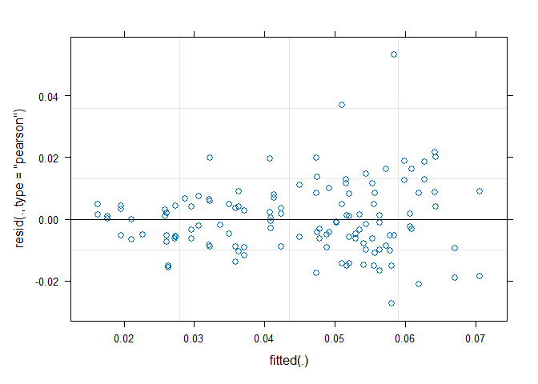<!-- --><!-- --><!-- -->

```
## [1] "the number of complete cases is 126"
```

```
## Linear mixed model fit by REML. t-tests use Satterthwaite's method [
## lmerModLmerTest]
## Formula: 
## trait ~ Treatment * Population + Treatment/Chamber + (1 | Population:Line)
##    Data: data
## 
## REML criterion at convergence: -669.7
## 
## Scaled residuals: 
##     Min      1Q  Median      3Q     Max 
## -2.2283 -0.5329 -0.0752  0.5097  4.3533 
## 
## Random effects:
##  Groups          Name        Variance  Std.Dev.
##  Population:Line (Intercept) 6.147e-05 0.00784 
##  Residual                    1.497e-04 0.01223 
## Number of obs: 126, groups:  Population:Line, 15
## 
## Fixed effects:
##                             Estimate Std. Error         df t value Pr(>|t|)    
## (Intercept)                4.438e-02  2.321e-03  1.351e+01  19.121 3.56e-11 ***
## Treatment1                 3.222e-03  1.093e-03  1.081e+02   2.949 0.003911 ** 
## Population1               -1.197e-02  2.321e-03  1.352e+01  -5.157 0.000163 ***
## Treatment1:Population1     5.344e-04  1.093e-03  1.081e+02   0.489 0.625830    
## TreatmentCurrent:Chamber1 -1.803e-03  1.535e-03  1.083e+02  -1.175 0.242664    
## TreatmentFuture:Chamber1  -7.264e-04  1.558e-03  1.080e+02  -0.466 0.642057    
## ---
## Signif. codes:  0 '***' 0.001 '**' 0.01 '*' 0.05 '.' 0.1 ' ' 1
## 
## Correlation of Fixed Effects:
##             (Intr) Trtmn1 Ppltn1 Tr1:P1 TrC:C1
## Treatment1  -0.002                            
## Population1  0.066  0.006                     
## Trtmnt1:Pp1  0.006  0.003 -0.002              
## TrtmntCr:C1 -0.005  0.000 -0.005  0.000       
## TrtmntFt:C1 -0.001  0.001  0.011 -0.024  0.001
```

```
## Computing profile confidence intervals ...
```

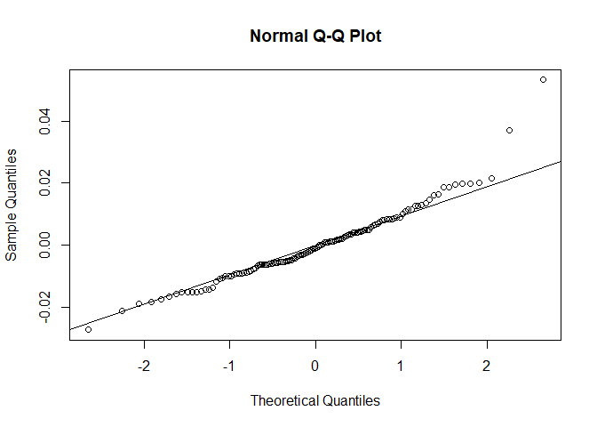<!-- -->

```
##                                  2.5 %       97.5 %
## .sig01                     0.004396843  0.011704462
## .sigma                     0.010590480  0.013770282
## (Intercept)                0.039840519  0.048877007
## Treatment1                 0.001104886  0.005344716
## Population1               -0.016503462 -0.007466530
## Treatment1:Population1    -0.001582994  0.002658058
## TreatmentCurrent:Chamber1 -0.004774944  0.001180142
## TreatmentFuture:Chamber1  -0.003757972  0.002289996
```

``` r
BG_anov_22 <- do_anov2(BG_lm_22)
```

```
## Type III Analysis of Variance Table with Satterthwaite's method
##                         Sum Sq   Mean Sq NumDF   DenDF F value    Pr(>F)    
## Treatment            0.0004516 0.0004516     1 107.981  3.0178 0.0852081 .  
## Population           0.0039793 0.0039793     1  13.518 26.5900 0.0001629 ***
## Treatment:Population 0.0000358 0.0000358     1 108.121  0.2391 0.6258295    
## Treatment:Chamber    0.0002388 0.0001194     2 108.173  0.7980 0.4528588    
## ---
## Signif. codes:  0 '***' 0.001 '**' 0.01 '*' 0.05 '.' 0.1 ' ' 1
```

``` r
BG_anov_22$trait <- "Below Ground Biomass"
BG_emmeans_22 <- get_table(BG_lm_22)
```

```
## NOTE: A nesting structure was detected in the fitted model:
##     Chamber %in% Treatment
```

``` r
BG_means_22 <- as.data.frame(BG_emmeans_22)
BG_pairs_22 <- as.data.frame(pairs(BG_emmeans_22))
BG_pairs_22$trait <- "Below Ground Biomass"
### also has SQR transformation; non significance changes
#BG_lm_22SQR <- do_lmer2(Dat_2022c$SQR_BG_DryBiomass)
#BG_anov_22SQR <- do_anov2(BG_lm_22SQR)
#BG_anov_22SQR$trait <- "SQR_Below Ground Biomass"

geno_bg_22 <- as.data.frame(get_geno_table22(Dat_2022c$BG_DryBiomass))
geno_bg_22$trait <- "BG_DryBiomass"
```

Root to shoot ratio (below ground / above ground)

``` r
# Root to Shoot ratio
RS_lm_22 <- do_lmer2(Dat_2022c$l10_Root_to_Shoot)
```

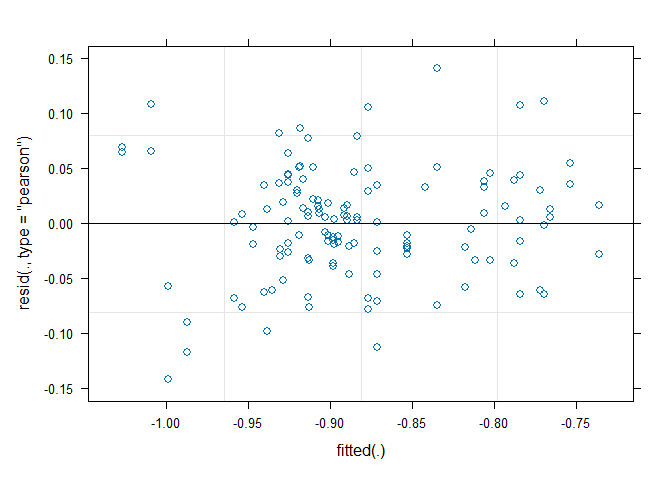<!-- -->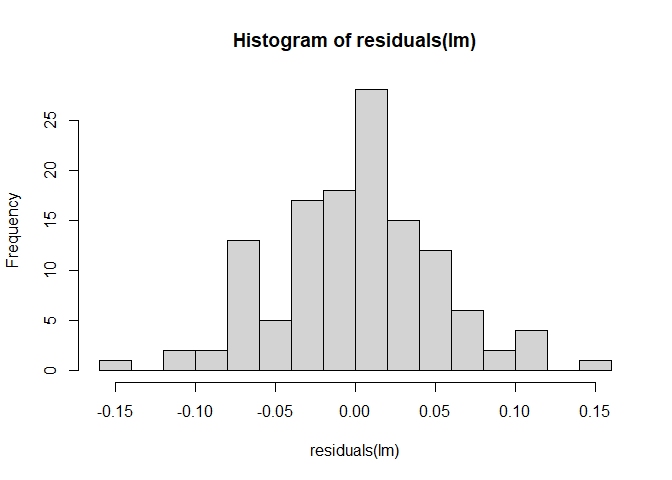<!-- --><!-- -->

```
## [1] "the number of complete cases is 126"
```

```
## Linear mixed model fit by REML. t-tests use Satterthwaite's method [
## lmerModLmerTest]
## Formula: 
## trait ~ Treatment * Population + Treatment/Chamber + (1 | Population:Line)
##    Data: data
## 
## REML criterion at convergence: -307.8
## 
## Scaled residuals: 
##      Min       1Q   Median       3Q      Max 
## -2.64203 -0.52935  0.04765  0.62520  2.61792 
## 
## Random effects:
##  Groups          Name        Variance Std.Dev.
##  Population:Line (Intercept) 0.002187 0.04677 
##  Residual                    0.002893 0.05379 
## Number of obs: 126, groups:  Population:Line, 15
## 
## Fixed effects:
##                             Estimate Std. Error         df t value Pr(>|t|)    
## (Intercept)                -0.879112   0.013091  13.408272 -67.156  < 2e-16 ***
## Treatment1                 -0.002114   0.004806 107.764820  -0.440  0.66092    
## Population1                 0.049067   0.013091  13.410208   3.748  0.00232 ** 
## Treatment1:Population1     -0.014538   0.004807 107.767261  -3.024  0.00312 ** 
## TreatmentCurrent:Chamber1  -0.005984   0.006752 107.924074  -0.886  0.37747    
## TreatmentFuture:Chamber1   -0.009095   0.006854 107.670866  -1.327  0.18732    
## ---
## Signif. codes:  0 '***' 0.001 '**' 0.01 '*' 0.05 '.' 0.1 ' ' 1
## 
## Correlation of Fixed Effects:
##             (Intr) Trtmn1 Ppltn1 Tr1:P1 TrC:C1
## Treatment1   0.000                            
## Population1  0.068  0.006                     
## Trtmnt1:Pp1  0.006  0.004 -0.001              
## TrtmntCr:C1 -0.005  0.000 -0.005  0.000       
## TrtmntFt:C1 -0.001  0.001  0.008 -0.024  0.001
```

```
## Computing profile confidence intervals ...
```

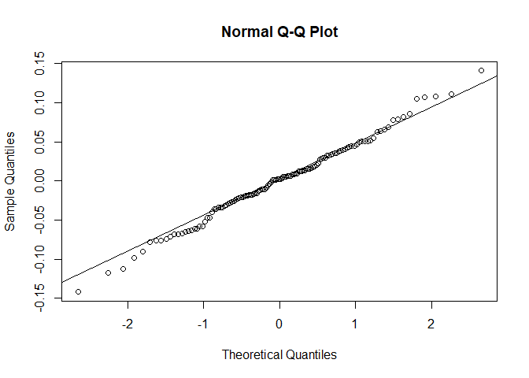<!-- -->

```
##                                 2.5 %       97.5 %
## .sig01                     0.02886576  0.067810680
## .sigma                     0.04656255  0.060562410
## (Intercept)               -0.90452148 -0.853542229
## Treatment1                -0.01145986  0.007192879
## Population1                0.02365794  0.074638973
## Treatment1:Population1    -0.02388461 -0.005226707
## TreatmentCurrent:Chamber1 -0.01908003  0.007122784
## TreatmentFuture:Chamber1  -0.02240098  0.004199282
```

``` r
RS_anov_22 <- do_anov2(RS_lm_22)
```

```
## Type III Analysis of Variance Table with Satterthwaite's method
##                        Sum Sq  Mean Sq NumDF  DenDF F value   Pr(>F)   
## Treatment            0.000020 0.000020     1 107.65  0.0068 0.934656   
## Population           0.040645 0.040645     1  13.41 14.0482 0.002316 **
## Treatment:Population 0.026459 0.026459     1 107.77  9.1450 0.003118 **
## Treatment:Chamber    0.007358 0.003679     2 107.80  1.2715 0.284572   
## ---
## Signif. codes:  0 '***' 0.001 '**' 0.01 '*' 0.05 '.' 0.1 ' ' 1
```

``` r
RS_anov_22$trait <- "l10_Root to Shoot Ratio"
RS_emmeans_22 <- get_table_bt(RS_lm_22)
```

```
## NOTE: A nesting structure was detected in the fitted model:
##     Chamber %in% Treatment
```

``` r
RS_means_22 <- as.data.frame(RS_emmeans_22)
RS_pairs_22 <- as.data.frame(pairs(RS_emmeans_22))
RS_pairs_22$trait <- "l10_Root to Shoot Ratio"

geno_rs_22 <- as.data.frame(get_geno_table_bt22(Dat_2022c$l10_Root_to_Shoot))
geno_rs_22$trait <- "l10_Root_to_Shoot"
```

Total biomass

``` r
# total biomass
TotBio_lm_22 <- do_lmer2(Dat_2022c$TotalBiomass) # residuals pretty normal, don't worry about sqrt transformation
```

<!-- -->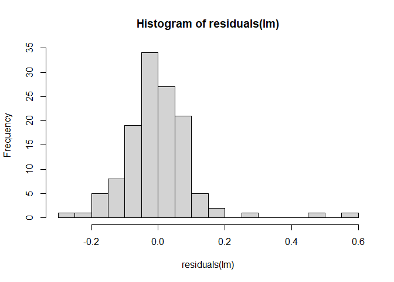<!-- -->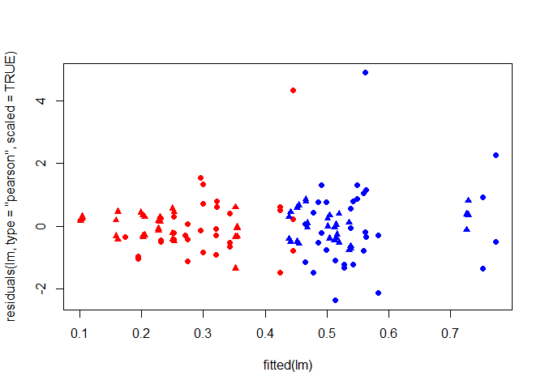<!-- -->

```
## [1] "the number of complete cases is 126"
```

```
## Linear mixed model fit by REML. t-tests use Satterthwaite's method [
## lmerModLmerTest]
## Formula: 
## trait ~ Treatment * Population + Treatment/Chamber + (1 | Population:Line)
##    Data: data
## 
## REML criterion at convergence: -129.8
## 
## Scaled residuals: 
##     Min      1Q  Median      3Q     Max 
## -2.3712 -0.4748 -0.0689  0.4242  4.8820 
## 
## Random effects:
##  Groups          Name        Variance Std.Dev.
##  Population:Line (Intercept) 0.008613 0.09281 
##  Residual                    0.012895 0.11356 
## Number of obs: 126, groups:  Population:Line, 15
## 
## Fixed effects:
##                             Estimate Std. Error         df t value Pr(>|t|)    
## (Intercept)                 0.396332   0.026219  13.209346  15.116 1.01e-09 ***
## Treatment1                  0.029158   0.010145 107.623309   2.874 0.004884 ** 
## Population1                -0.141175   0.026220  13.211475  -5.384 0.000118 ***
## Treatment1:Population1      0.011518   0.010148 107.626011   1.135 0.258909    
## TreatmentCurrent:Chamber1  -0.010559   0.014253 107.796790  -0.741 0.460394    
## TreatmentFuture:Chamber1    0.001376   0.014469 107.524132   0.095 0.924432    
## ---
## Signif. codes:  0 '***' 0.001 '**' 0.01 '*' 0.05 '.' 0.1 ' ' 1
## 
## Correlation of Fixed Effects:
##             (Intr) Trtmn1 Ppltn1 Tr1:P1 TrC:C1
## Treatment1  -0.001                            
## Population1  0.068  0.006                     
## Trtmnt1:Pp1  0.006  0.004 -0.001              
## TrtmntCr:C1 -0.005  0.000 -0.005  0.000       
## TrtmntFt:C1 -0.001  0.001  0.009 -0.024  0.001
```

```
## Computing profile confidence intervals ...
```

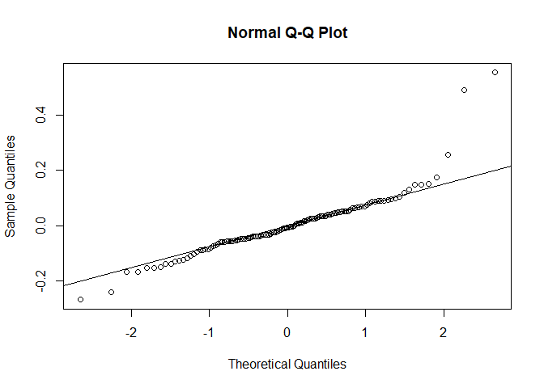<!-- -->

```
##                                  2.5 %      97.5 %
## .sig01                     0.056037342  0.13544003
## .sigma                     0.098298278  0.12788734
## (Intercept)                0.345133548  0.44724229
## Treatment1                 0.009494244  0.04887206
## Population1               -0.192373229 -0.09026118
## Treatment1:Population1    -0.008150157  0.03123918
## TreatmentCurrent:Chamber1 -0.038194666  0.01712266
## TreatmentFuture:Chamber1  -0.026743900  0.02941773
```

``` r
TotBio_anov_22 <- do_anov2(TotBio_lm_22) # these output stats are more different than I would expect...
```

```
## Type III Analysis of Variance Table with Satterthwaite's method
##                       Sum Sq Mean Sq NumDF   DenDF F value    Pr(>F)    
## Treatment            0.03371 0.03371     1 107.504  2.6145 0.1088213    
## Population           0.37383 0.37383     1  13.211 28.9907 0.0001177 ***
## Treatment:Population 0.01661 0.01661     1 107.626  1.2882 0.2589087    
## Treatment:Chamber    0.00720 0.00360     2 107.660  0.2790 0.7570501    
## ---
## Signif. codes:  0 '***' 0.001 '**' 0.01 '*' 0.05 '.' 0.1 ' ' 1
```

``` r
TotBio_anov_22$trait <- "Total Biomass"
TotBio_emmeans_22 <- get_table(TotBio_lm_22)
```

```
## NOTE: A nesting structure was detected in the fitted model:
##     Chamber %in% Treatment
```

``` r
TotBio_means_22 <- as.data.frame(TotBio_emmeans_22)
TotBio_pairs_22 <- as.data.frame(pairs(TotBio_emmeans_22))
TotBio_pairs_22$trait <- "Total Biomass"

geno_TotBio_22 <- as.data.frame(get_geno_table22(Dat_2022c$TotalBiomass))
geno_TotBio_22$trait <- "TotalBiomass"
```


### Stomatal Density

``` r
# stomatal density - imaged on harvest day
sto_den_lm_22 <- do_lmer2(Dat_2022c$l10_Stomata_density)
```

<!-- --><!-- -->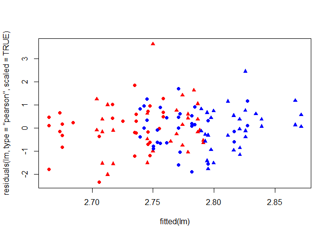<!-- -->

```
## [1] "the number of complete cases is 126"
```

```
## Linear mixed model fit by REML. t-tests use Satterthwaite's method [
## lmerModLmerTest]
## Formula: 
## trait ~ Treatment * Population + Treatment/Chamber + (1 | Population:Line)
##    Data: data
## 
## REML criterion at convergence: -296.7
## 
## Scaled residuals: 
##     Min      1Q  Median      3Q     Max 
## -2.3560 -0.5965  0.0242  0.5940  3.6327 
## 
## Random effects:
##  Groups          Name        Variance Std.Dev.
##  Population:Line (Intercept) 0.001193 0.03455 
##  Residual                    0.003390 0.05822 
## Number of obs: 126, groups:  Population:Line, 15
## 
## Fixed effects:
##                             Estimate Std. Error         df t value Pr(>|t|)    
## (Intercept)                 2.766239   0.010420  12.627729 265.474  < 2e-16 ***
## Treatment1                 -0.020792   0.005200 107.361636  -3.999 0.000117 ***
## Population1                -0.029090   0.010421  12.631169  -2.792 0.015631 *  
## Treatment1:Population1      0.002732   0.005201 107.365834   0.525 0.600431    
## TreatmentCurrent:Chamber1   0.005445   0.007303 107.607284   0.746 0.457549    
## TreatmentFuture:Chamber1    0.002338   0.007417 107.254083   0.315 0.753225    
## ---
## Signif. codes:  0 '***' 0.001 '**' 0.01 '*' 0.05 '.' 0.1 ' ' 1
## 
## Correlation of Fixed Effects:
##             (Intr) Trtmn1 Ppltn1 Tr1:P1 TrC:C1
## Treatment1  -0.002                            
## Population1  0.065  0.006                     
## Trtmnt1:Pp1  0.006  0.003 -0.002              
## TrtmntCr:C1 -0.005  0.000 -0.005  0.000       
## TrtmntFt:C1 -0.001  0.001  0.012 -0.024  0.001
```

```
## Computing profile confidence intervals ...
```

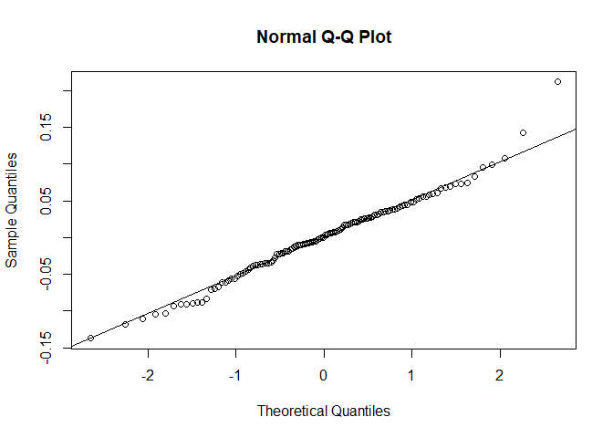<!-- -->

```
##                                  2.5 %       97.5 %
## .sig01                     0.017812213  0.052584659
## .sigma                     0.050402371  0.065611059
## (Intercept)                2.746052087  2.786648918
## Treatment1                -0.030881954 -0.010695078
## Population1               -0.049291443 -0.008695508
## Treatment1:Population1    -0.007377555  0.012815492
## TreatmentCurrent:Chamber1 -0.008640539  0.019732008
## TreatmentFuture:Chamber1  -0.012096758  0.016700696
```

``` r
sto_den_anov_22 <- do_anov2(sto_den_lm_22)
```

```
## Type III Analysis of Variance Table with Satterthwaite's method
##                         Sum Sq   Mean Sq NumDF   DenDF F value  Pr(>F)  
## Treatment            0.0232130 0.0232130     1 107.213  6.8473 0.01016 *
## Population           0.0264177 0.0264177     1  12.631  7.7927 0.01563 *
## Treatment:Population 0.0009356 0.0009356     1 107.366  0.2760 0.60043  
## Treatment:Chamber    0.0022194 0.0011097     2 107.430  0.3273 0.72156  
## ---
## Signif. codes:  0 '***' 0.001 '**' 0.01 '*' 0.05 '.' 0.1 ' ' 1
```

``` r
sto_den_anov_22$trait <- "l10_Stomatal Density"
sto_den_emmeans_22 <- get_table_bt(sto_den_lm_22)
```

```
## NOTE: A nesting structure was detected in the fitted model:
##     Chamber %in% Treatment
```

``` r
sto_den_means_22 <- as.data.frame(sto_den_emmeans_22)
sto_den_pairs_22 <- as.data.frame(pairs(sto_den_emmeans_22))
sto_den_pairs_22$trait <- "l10_Stomatal Density"

# check results don't change if using stomatal average - they didn't change, commented out with update
#do_anov2(do_lmer2(Dat_2022c$l10_Stomata_avg))


geno_stoden_22 <- as.data.frame(get_geno_table_bt22(Dat_2022c$l10_Stomata_density))
geno_stoden_22$trait <- "l10_Stomata_density"
```

### Outputs

1) results table


``` r
AnovaResults_2022 <- rbind(fresh_anov_22, hyd_anov_22, dry_anov_22, area_anov_22, sla_anov_22, ldmc_anov_22, rwc_anov_22, LN_bolt_anov_22, AG_anov_22, BG_anov_22, RS_anov_22, TotBio_anov_22, sto_den_anov_22 )

write.csv(AnovaResults_2022, file = "data/AnovaResults_2022.csv", row.names = TRUE)
```

2) All the tables to read in to the figures code


``` r
# change column names
dfs3 <- c("dry_means_22", "area_means_22","rwc_means_22", "BG_means_22", "fresh_means_22", "hyd_means_22", "sla_means_22", "ldmc_means_22", "LN_bolt_means_22", "AG_means_22", "RS_means_22", "TotBio_means_22", "sto_den_means_22")

for (i in dfs3) {
  x=get(i)
  colnames(x) <- c("Treatment", "Population", "Mean", "SE", "Df", "LL_95", "UL_95")
  assign(i,x)
}


# create list of data frames
Means_2022 <- list(fresh_means_22, hyd_means_22, dry_means_22, area_means_22, sla_means_22, ldmc_means_22, rwc_means_22, LN_bolt_means_22, AG_means_22, BG_means_22, RS_means_22, TotBio_means_22, sto_den_means_22)

# name that list
names(Means_2022) <- c("fresh_means_22", "hyd_means_22", "dry_means_22", "area_means_22", "sla_means_22", "ldmc_means_22", "rwc_means_22", "LN_bolt_means_22", "AG_means_22", "BG_means_22", "RS_means_22", "TotBio_means_22", "sto_den_means_22")

# save named list
save(Means_2022, file = "data/ModelMeans_2022.robj")
```

3) Post hoc test results

``` r
PostHoc_2022 <- rbind(fresh_pairs_22, hyd_pairs_22, dry_pairs_22, area_pairs_22, sla_pairs_22, ldmc_pairs_22, rwc_pairs_22, LN_bolt_pairs_22, AG_pairs_22, BG_pairs_22, RS_pairs_22, TotBio_pairs_22, sto_den_pairs_22 )

write.csv(PostHoc_2022, file = "data/PostHoc_2022.csv", row.names = TRUE)
```

genotype level information

``` r
GenotypeMeans_2022 <- rbind(geno_rwc_22, geno_sla_22, geno_stoden_22, geno_rs_22, geno_ag_22, geno_bg_22, geno_TotBio_22)
GenotypeMeans_2022$year <- "2022"

GenotypeMeans <- rbind(GenotypeMeans_2021, GenotypeMeans_2022)
write.csv(GenotypeMeans, file = "data/GenotypeMeans.csv", row.names = FALSE)
```

## Sample size information

Identify how many lines and how many replicates per line for this experiment.


``` r
# sample size of 2022 total
Dat_2022c %>% count(Treatment)
```

```
##   Treatment  n
## 1   Current 64
## 2    Future 63
```

``` r
# 64 plants in both
Dat_2022c %>% count(Treatment, Population)
```

```
##   Treatment Population  n
## 1   Current          B 32
## 2   Current          R 32
## 3    Future          B 31
## 4    Future          R 32
```

``` r
# 32 in each group, with removing the only B4 fut that survived, down to 31 in italy future

# from models know that there are 16 unique lines. 8 IT, 8 SW. ( but 1 line fully died in IT cur)

n_2022 <- Dat_2022c %>%
  group_by(Treatment) %>%
  group_by(Population, .add = TRUE) %>%
  group_by(Line, .add = TRUE) %>%
  count

n_2022 %>% 
  group_by(Treatment) %>%
  summarize(min = min(n), mean = mean(n), median = median(n), max = max(n))
```

```
## # A tibble: 2 × 5
##   Treatment   min  mean median   max
##   <fct>     <int> <dbl>  <int> <int>
## 1 Current       1  4.27      4     6
## 2 Future        2  4.2       4     6
```

``` r
n_2022 %>% 
  group_by(Treatment) %>%
  group_by(Population, .add = TRUE) %>%
  summarize(min = min(n), mean = mean(n), median = median(n), max = max(n))
```

```
## `summarise()` has grouped output by 'Treatment'. You can override using the
## `.groups` argument.
```

```
## # A tibble: 4 × 6
## # Groups:   Treatment [2]
##   Treatment Population   min  mean median   max
##   <fct>     <fct>      <int> <dbl>  <dbl> <int>
## 1 Current   B              1  4.57      5     6
## 2 Current   R              4  4         4     4
## 3 Future    B              2  4.43      5     6
## 4 Future    R              4  4         4     4
```

# Notes
The AnovaResults_YEAR files that were output have been copied over to the data/ModelResults.xlsx on 8/2/2024 to make formatting changes and color code for easier comparison and analysis. This was repeated on 7/22/2025 to update with the emmeans package outputs. It was also updated 3/10/2026 with adding total biomass as a trait.

The spreadsheet is color coded so p values below 0.05 are green, between 0.1 and 0.05 are orange, and others are left white. The model terms are red if there is disagreement in significance between experiments for traits that were measured in both experiments. There is a post hoc results spreadsheet as well which is included in the tables for the manuscript.


# Results Tables
These tables were not ultimately used

## Main Text Tables - auto formatted options

``` r
sjPlot::tab_model(eTof_lm_21, RWC_lm_21, rwc_lm_22, sto_den_lm_22, SLA_lm_21, sla_lm_22, RS_lm_22 ,  fitness_lm_21, 
                   collapse.ci = TRUE, 
                  dv.labels = c("Emergence To Flower 21", "RWC 21", "RWC 22", "Stomatal Density 22","SLA 21", "SLA 22",  "Root-to-Shoot 22", "Fitness 21"), 
                 pred.labels = c("(Intercept)", "Treatment", "Population", "Trt x Pop Interaction", "Current Trt x Chamber", "Future Trt x Chamber")
                 
        )

#show.reflvl = TRUE 
#p.style = "stars" or "scientific"
#digits.p=
# I think I can use css code from this tutorial to remove the intercept row if I want?? https://strengejacke.github.io/sjPlot/articles/table_css.html
```

## Supplemental Tables

``` r
drought_extra <- sjPlot::tab_model(fresh_lm_21, fresh_lm_22, sat_lm_21, hyd_lm_22, dry_lm_21, dry_lm_22, area_lm_21, area_lm_22, per_lm_21, per_lm_22, LDMC_lm_21, ldmc_lm_22,
                                   collapse.ci = TRUE, 
                                   dv.labels = c("Fresh 21", "Fresh 22", "Sat 21", "Sat 22", "Dry 21", "Dry 22", "area 21", "area 22", "perimeter 21", "perimeter 22", "LDMC 21", "LDMC 22")
                                   )
growth_extra <- sjPlot::tab_model(emergence_lm_21, emergence_lm_22, bolting_lm_21, bolting_lm_22, Ros_lm_21, AG_lm_22, RR_lm_21, Repro_lm_21, AG_lm_21, LN_Vern_lm_21, LN_PreVern_lm_21, LN_PreVern_lm_22, LN_PostVern_lm_21, LN_Jun6_lm_22, LN_Jun13_lm_22, LN_harv_lm_21, LN_bolt_lm_22, BG_lm_22, AvSeedWt_lm_21,
                                  collapse.ci = TRUE, 
                                  dv.labels = c("Emergence 21", "Emergence 22", "Bolting 21", "Bolting 22", "Ros Biomass 21", "Ros Biomass 22", "Ros:Repro 21", "Repro 21", "AG 21", "LN Vern 21", "LN Prevern 21", "Ln Prevern 22", "LN Postvern 21", "LN June 6 22", "LN June 13 22", "LN harvest 21", "Ln bolt 22", "BG 22", "Avg. Seed Wt 21"))
fitness_extra <- sjPlot::tab_model(seeds_lm_21, PrimStalks_lm_21, LatBranch_lm_21, height_lm_21, fruit_lm_21,
                                   collapse.ci = TRUE,
                                   dv.labels = c("SeedsPerFruit", "Primary Stalks", "Lateral Branches", "Height", "Fruit Number"))

#flowering_lm_21 vs eTof_lm_21??
```

# Problem Solve
## SLA and LDMC correlation
Choosing to only include SLA and move LDMC to the supplemental so I want correlation information for the two traits.

``` r
# 2021
# overall
cor.test(Dat_2021_TwoTrt$SLA, Dat_2021_TwoTrt$LDMC)
plot(Dat_2021_TwoTrt$SLA, Dat_2021_TwoTrt$LDMC)

# just in SW
cor.test(Dat_2021_TwoTrt[Dat_2021_TwoTrt$Population == "RODA", ]$SLA, Dat_2021_TwoTrt[Dat_2021_TwoTrt$Population == "RODA", ]$LDMC)
plot(Dat_2021_TwoTrt[Dat_2021_TwoTrt$Population == "RODA", ]$SLA, Dat_2021_TwoTrt[Dat_2021_TwoTrt$Population == "RODA", ]$LDMC)

# just in IT
cor.test(Dat_2021_TwoTrt[Dat_2021_TwoTrt$Population == "BELM", ]$SLA, Dat_2021_TwoTrt[Dat_2021_TwoTrt$Population == "BELM", ]$LDMC)
plot(Dat_2021_TwoTrt[Dat_2021_TwoTrt$Population == "BELM", ]$SLA, Dat_2021_TwoTrt[Dat_2021_TwoTrt$Population == "BELM", ]$LDMC)

# just cur?
cor.test(Dat_2021_TwoTrt[Dat_2021_TwoTrt$Treatment == "Current", ]$SLA, Dat_2021_TwoTrt[Dat_2021_TwoTrt$Treatment == "Current", ]$LDMC)
plot(Dat_2021_TwoTrt[Dat_2021_TwoTrt$Treatment == "Current", ]$SLA, Dat_2021_TwoTrt[Dat_2021_TwoTrt$Treatment == "Current", ]$LDMC)

# just fut?
cor.test(Dat_2021_TwoTrt[Dat_2021_TwoTrt$Treatment == "Future", ]$SLA, Dat_2021_TwoTrt[Dat_2021_TwoTrt$Treatment == "Future", ]$LDMC)
plot(Dat_2021_TwoTrt[Dat_2021_TwoTrt$Treatment == "Future", ]$SLA, Dat_2021_TwoTrt[Dat_2021_TwoTrt$Treatment == "Future", ]$LDMC)

# 2022
# overall
cor.test(Dat_2022c$SLA, Dat_2022c$LDMC)
plot(Dat_2022c$SLA, Dat_2022c$LDMC)

# just in SW
cor.test(Dat_2022c[Dat_2022c$Population == "R", ]$SLA, Dat_2022c[Dat_2022c$Population == "R", ]$LDMC)
plot(Dat_2022c[Dat_2022c$Population == "R", ]$SLA, Dat_2022c[Dat_2022c$Population == "R", ]$LDMC)

# just in IT
cor.test(Dat_2022c[Dat_2022c$Population == "B", ]$SLA, Dat_2022c[Dat_2022c$Population == "B", ]$LDMC)
plot(Dat_2022c[Dat_2022c$Population == "B", ]$SLA, Dat_2022c[Dat_2022c$Population == "B", ]$LDMC)

# just cur?
cor.test(Dat_2022c[Dat_2022c$Treatment == "Current", ]$SLA, Dat_2022c[Dat_2022c$Treatment == "Current", ]$LDMC)
plot(Dat_2022c[Dat_2022c$Treatment == "Current", ]$SLA, Dat_2022c[Dat_2022c$Treatment == "Current", ]$LDMC)

# just fut?
cor.test(Dat_2022c[Dat_2022c$Treatment == "Current", ]$SLA, Dat_2022c[Dat_2022c$Treatment == "Future", ]$LDMC)
plot(Dat_2022c[Dat_2022c$Treatment == "Future", ]$SLA, Dat_2022c[Dat_2022c$Treatment == "Current", ]$LDMC)
```
## Dry weight difference in signficance
For dry weight, there is a huge difference in significance between 2021 (p value below 0.001) and 2022 (p value above 0.95). Quickly looking at the spreadsheets I can not tell a difference and the values are of similar magnitudes. I then did untransformed models and square root transformed models because those were reported as having the most normal residuals in the previous code. None of the models had differences in p values due to transformation that changed the interpretation of the results. I also excluded the "days between bolting and harvest" random effect for the 2022 data but did not find a major difference in the models but the denominator degrees of freedom for treatment did change a lot. As a final check for if there is a potential mistake, I am going to look at some data distributions.


``` r
ggplot(dat = Dat_2021_TwoTrt)+
  geom_histogram(aes(x = DriedWt_g, fill = Population), alpha = 0.5, position = "identity")+
  theme_classic()
ggplot(dat = Dat_2021_TwoTrt)+
  geom_histogram(aes(x = DriedWt_g, fill = Treatment), alpha = 0.5, position = "identity")+
  theme_classic()


ggplot(dat = Dat_2022c)+
  geom_histogram(aes(x = SL_DryWt, fill = Population), alpha = 0.5, position = "identity")+
  theme_classic()
ggplot(dat = Dat_2022c)+
  geom_histogram(aes(x = SL_DryWt, fill = Treatment), alpha = 0.5, position = "identity")+
  theme_classic()
```

Visually looking at the histograms it does seems like 2021 has a treatment difference and 2022 has a population difference. Scales of both are comparable. 

## 2021 Avg Seed per fruit
Concerned that line does not explain any variance. Is it true that all the variation is within lines and not between lines? to check this: 1) make histogram of all the values (not line means) - done in CleanData but repeat here


``` r
hist(Dat_2021_TwoTrt$AvgSeedNum)
```

<!-- -->

``` r
hist(Dat_2021_TwoTrt$l10_AvgSeedNum)
```

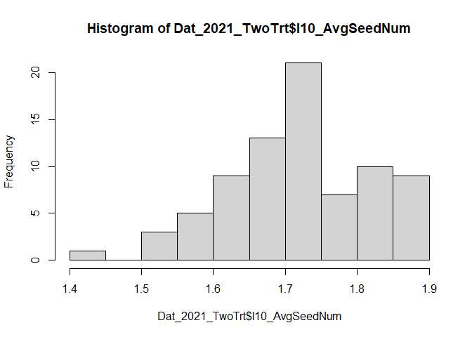<!-- -->
2) look within lines for difference in avg seeds/fruit - maybe do subtraction and histogram the differences? but won't work if more than two values


``` r
# start with copy of code from 03_Figures that makes the by line plot
Dat_2021_TwoTrt$Line.ID <- as.factor(paste0(Dat_2021_TwoTrt$Population, Dat_2021_TwoTrt$Line))
Dat_2021_TwoTrt$Line.ID.T <- as.factor(paste0(Dat_2021_TwoTrt$Line.ID, Dat_2021_TwoTrt$Treatment))
df_seed_line <- Dat_2021_TwoTrt %>%
  dplyr::group_by(Line.ID.T, .add = TRUE) %>%
  summarize(across(.col = c(AvgSeedNum, l10_AvgSeedNum), .fns = list(mean = ~mean(.x, na.rm = TRUE, .group = "keep"), ci_95 = ~conf_int(.x), n = ~sum(!is.na(.)))))
```

```
## Warning: There were 4 warnings in `summarize()`.
## The first warning was:
## ℹ In argument: `across(...)`.
## ℹ In group 7: `Line.ID.T = BELM1Current`.
## Caused by warning in `qt()`:
## ! NaNs produced
## ℹ Run `dplyr::last_dplyr_warnings()` to see the 3 remaining warnings.
```

``` r
df_seed_line$Population <- substr(df_seed_line$Line.ID.T, start = 1, stop = 4)

hist(df_seed_line$AvgSeedNum_n)
```

<!-- -->

``` r
# some lines only have 1 pot per treatment -- 10 instances, 7 in Cur
# some lines only have pots in one treatment 4 - all in Fut are the dead ones so only a rep in cur
# 3 and 4 are Roda parent. 6 and 7 are Belm parent.

# get list of Line.ID with 2 replicates
two_reps <- df_seed_line[df_seed_line$AvgSeedNum_n == 2, "Line.ID.T"]$Line.ID.T
# pull those out of the main dataframe
two_reps_seeds <- Dat_2021_TwoTrt[Dat_2021_TwoTrt$Line.ID.T %in% two_reps, c("Treatment", "Population", "Line", "Replicate", "Line.ID", "Line.ID.T", "AvgSeedNum", "l10_AvgSeedNum")]

# find the difference in values
two_reps_diff <-  two_reps_seeds %>% 
  group_by(Line.ID.T) %>% 
  summarize(across(.col = c(AvgSeedNum, l10_AvgSeedNum), .fns = ~diff(.x)))


# table of just RIL parent seed numbers
ril_pars_seed <- Dat_2021_TwoTrt[Dat_2021_TwoTrt$Line.ID %in% c("BELM12", "RODA47"), c("Treatment", "Population", "Line", "Replicate", "Line.ID", "Line.ID.T", "AvgSeedNum", "l10_AvgSeedNum")]
ril_pars_seed[order(ril_pars_seed$Line.ID.T), ]
```

```
##    Treatment Population Line Replicate Line.ID     Line.ID.T AvgSeedNum
## 1    Current       BELM   12        11  BELM12 BELM12Current   50.40000
## 3    Current       BELM   12        12  BELM12 BELM12Current   52.30000
## 5    Current       BELM   12        13  BELM12 BELM12Current   37.80000
## 7    Current       BELM   12        14  BELM12 BELM12Current   53.10000
## 9    Current       BELM   12        15  BELM12 BELM12Current   52.40000
## 13   Current       BELM   12         1  BELM12 BELM12Current   27.10000
## 15   Current       BELM   12         2  BELM12 BELM12Current   49.60000
## 2     Future       BELM   12        11  BELM12  BELM12Future   53.80000
## 4     Future       BELM   12        12  BELM12  BELM12Future   42.00000
## 6     Future       BELM   12        13  BELM12  BELM12Future   43.20000
## 8     Future       BELM   12        14  BELM12  BELM12Future   36.30000
## 10    Future       BELM   12        15  BELM12  BELM12Future   53.80000
## 14    Future       BELM   12         1  BELM12  BELM12Future         NA
## 16    Future       BELM   12         2  BELM12  BELM12Future   54.88889
## 77   Current       RODA   47         1  RODA47 RODA47Current   69.70000
## 79   Current       RODA   47         2  RODA47 RODA47Current   55.40000
## 81   Current       RODA   47         3  RODA47 RODA47Current   70.70000
## 83   Current       RODA   47         4  RODA47 RODA47Current         NA
## 85   Current       RODA   47         5  RODA47 RODA47Current         NA
## 87   Current       RODA   47         6  RODA47 RODA47Current   72.50000
## 78    Future       RODA   47         1  RODA47  RODA47Future   40.80000
## 80    Future       RODA   47         2  RODA47  RODA47Future   50.00000
## 82    Future       RODA   47         3  RODA47  RODA47Future         NA
## 84    Future       RODA   47         4  RODA47  RODA47Future         NA
## 86    Future       RODA   47         5  RODA47  RODA47Future   42.50000
## 88    Future       RODA   47         6  RODA47  RODA47Future         NA
##    l10_AvgSeedNum
## 1        1.702431
## 3        1.718502
## 5        1.577492
## 7        1.725095
## 9        1.719331
## 13       1.432969
## 15       1.695482
## 2        1.730782
## 4        1.623249
## 6        1.635484
## 8        1.559907
## 10       1.730782
## 14             NA
## 16       1.739484
## 77       1.843233
## 79       1.743510
## 81       1.849419
## 83             NA
## 85             NA
## 87       1.860338
## 78       1.610660
## 80       1.698970
## 82             NA
## 84             NA
## 86       1.628389
## 88             NA
```


3) figure out which genotypes are the outliers on the residuals plot.The low outlier on the residuals plot is B12. Note for interpretation that the residuals are scaled (so not log scale but divided by the mean)

``` r
tmp_seed <- lmer(l10_AvgSeedNum ~ Treatment * Population + (1|Population:Line) , data = Dat_2021_TwoTrt, contrasts = list(Treatment=contr.sum, Population = contr.sum))
```

```
## boundary (singular) fit: see help('isSingular')
```

``` r
df_seed <- data.frame(fitted = fitted(tmp_seed),
                      resid = residuals(tmp_seed, type = "pearson", scaled = TRUE),
                      pop = Dat_2021_TwoTrt$Population[complete.cases(Dat_2021_TwoTrt$l10_AvgSeedNum)],
                      trt = Dat_2021_TwoTrt$Treatment[complete.cases(Dat_2021_TwoTrt$l10_AvgSeedNum)],
                      line = Dat_2021_TwoTrt$Line[complete.cases(Dat_2021_TwoTrt$l10_AvgSeedNum)],
                      pot.id = Dat_2021_TwoTrt$Pot.ID[complete.cases(Dat_2021_TwoTrt$l10_AvgSeedNum)])

plot_seed <-  ggplot(df_seed) +
  geom_point(aes(x=fitted, y=resid,
       col = pop, shape = trt, text=pot.id))+
  scale_color_manual(values = c("red", "blue"))+
  theme_classic()
```

```
## Warning in geom_point(aes(x = fitted, y = resid, col = pop, shape = trt, :
## Ignoring unknown aesthetics: text
```

``` r
ggplotly(plot_seed)
```

```{=html}
<div class="plotly html-widget html-fill-item" id="htmlwidget-1f080258cafe28e80608" style="width:672px;height:480px;"></div>
<script type="application/json" data-for="htmlwidget-1f080258cafe28e80608">{"x":{"data":[{"x":[1.6846369645818056,1.6846369645818056,1.6846369645818056,1.6846369645818056,1.6846369645818056,1.6846369645818056,1.6846369645818056,1.6846369645818056,1.6846369645818056,1.6846369645818056,1.6846369645818056,1.6846369645818056,1.6846369645818056,1.6846369645818056,1.6846369645818056,1.6846369645818056,1.6846369645818056,1.6846369645818056],"y":[0.2674669162420692,0.50904300965489879,-1.6105696497567332,0.60814421963896215,0.52151324618914841,-0.93832041281694523,-3.7829828164833939,0.16301401842680832,-0.13315980453078638,-0.95391938521042907,0.60814421963896215,-0.11940180820462973,1.3729522074178417,0.34472423022904275,1.3947855616842038,0.2284926700882528,0.76604246385705199,0.75403111393582589],"text":["fitted: 1.684637<br />resid:  0.267466916<br />pop: BELM<br />trt: Current<br />B12-11-C","fitted: 1.684637<br />resid:  0.509043010<br />pop: BELM<br />trt: Current<br />B12-12-C","fitted: 1.684637<br />resid: -1.610569650<br />pop: BELM<br />trt: Current<br />B12-13-C","fitted: 1.684637<br />resid:  0.608144220<br />pop: BELM<br />trt: Current<br />B12-14-C","fitted: 1.684637<br />resid:  0.521513246<br />pop: BELM<br />trt: Current<br />B12-15-C","fitted: 1.684637<br />resid: -0.938320413<br />pop: BELM<br />trt: Current<br />B1-6-C","fitted: 1.684637<br />resid: -3.782982816<br />pop: BELM<br />trt: Current<br />B12-1-C","fitted: 1.684637<br />resid:  0.163014018<br />pop: BELM<br />trt: Current<br />B12-2-C","fitted: 1.684637<br />resid: -0.133159805<br />pop: BELM<br />trt: Current<br />B13-1-C","fitted: 1.684637<br />resid: -0.953919385<br />pop: BELM<br />trt: Current<br />B13-2-C","fitted: 1.684637<br />resid:  0.608144220<br />pop: BELM<br />trt: Current<br />B15-1-C","fitted: 1.684637<br />resid: -0.119401808<br />pop: BELM<br />trt: Current<br />B15-2-C","fitted: 1.684637<br />resid:  1.372952207<br />pop: BELM<br />trt: Current<br />B2-1-C","fitted: 1.684637<br />resid:  0.344724230<br />pop: BELM<br />trt: Current<br />B3-1-C","fitted: 1.684637<br />resid:  1.394785562<br />pop: BELM<br />trt: Current<br />B3-2-C","fitted: 1.684637<br />resid:  0.228492670<br />pop: BELM<br />trt: Current<br />B4-2-C","fitted: 1.684637<br />resid:  0.766042464<br />pop: BELM<br />trt: Current<br />B8-1-C","fitted: 1.684637<br />resid:  0.754031114<br />pop: BELM<br />trt: Current<br />B8-2-C"],"type":"scatter","mode":"markers","marker":{"autocolorscale":false,"color":"rgba(255,0,0,1)","opacity":1,"size":5.6692913385826778,"symbol":"circle","line":{"width":1.8897637795275593,"color":"rgba(255,0,0,1)"}},"hoveron":"points","name":"(BELM,Current)","legendgroup":"(BELM,Current)","showlegend":true,"xaxis":"x","yaxis":"y","hoverinfo":"text","frame":null},{"x":[1.6573891185101599,1.6573891185101599,1.6573891185101599,1.6573891185101599,1.6573891185101599,1.6573891185101599,1.6573891185101599,1.6573891185101599,1.6573891185101599,1.6573891185101599,1.6573891185101599,1.6573891185101599,1.6573891185101599,1.6573891185101599,1.6573891185101599],"y":[1.1032209591299795,-0.51317827674814775,-0.32927409186512946,-1.465323663892748,1.1032209591299795,0.34492239843450484,1.2340289238737077,-1.6415249961527645,0.06491307539388981,-0.12757753348639503,-0.46671425967083219,-1.2530068422517888,1.58142221857721,-0.52874006442835919,0.89361119395706057],"text":["fitted: 1.657389<br />resid:  1.103220959<br />pop: BELM<br />trt: Future<br />B12-11-F","fitted: 1.657389<br />resid: -0.513178277<br />pop: BELM<br />trt: Future<br />B12-12-F","fitted: 1.657389<br />resid: -0.329274092<br />pop: BELM<br />trt: Future<br />B12-13-F","fitted: 1.657389<br />resid: -1.465323664<br />pop: BELM<br />trt: Future<br />B12-14-F","fitted: 1.657389<br />resid:  1.103220959<br />pop: BELM<br />trt: Future<br />B12-15-F","fitted: 1.657389<br />resid:  0.344922398<br />pop: BELM<br />trt: Future<br />B1-6-F","fitted: 1.657389<br />resid:  1.234028924<br />pop: BELM<br />trt: Future<br />B12-2-F","fitted: 1.657389<br />resid: -1.641524996<br />pop: BELM<br />trt: Future<br />B15-1-F","fitted: 1.657389<br />resid:  0.064913075<br />pop: BELM<br />trt: Future<br />B15-2-F","fitted: 1.657389<br />resid: -0.127577533<br />pop: BELM<br />trt: Future<br />B2-1-F","fitted: 1.657389<br />resid: -0.466714260<br />pop: BELM<br />trt: Future<br />B2-2-F","fitted: 1.657389<br />resid: -1.253006842<br />pop: BELM<br />trt: Future<br />B3-1-F","fitted: 1.657389<br />resid:  1.581422219<br />pop: BELM<br />trt: Future<br />B3-2-F","fitted: 1.657389<br />resid: -0.528740064<br />pop: BELM<br />trt: Future<br />B8-1-F","fitted: 1.657389<br />resid:  0.893611194<br />pop: BELM<br />trt: Future<br />B8-2-F"],"type":"scatter","mode":"markers","marker":{"autocolorscale":false,"color":"rgba(255,0,0,1)","opacity":1,"size":5.6692913385826778,"symbol":"triangle-up","line":{"width":1.8897637795275593,"color":"rgba(255,0,0,1)"}},"hoveron":"points","name":"(BELM,Future)","legendgroup":"(BELM,Future)","showlegend":true,"xaxis":"x","yaxis":"y","hoverinfo":"text","frame":null},{"x":[1.8244362514521935,1.8244362514521935,1.8244362514521935,1.8244362514521935,1.8244362514521935,1.8244362514521935,1.8244362514521935,1.8244362514521935,1.8244362514521935,1.8244362514521935,1.8244362514521935,1.8244362514521935,1.8244362514521935,1.8244362514521935,1.8244362514521935,1.8244362514521935,1.8244362514521935,1.8244362514521935,1.8244362514521935,1.8244362514521935,1.8244362514521935,1.8244362514521935,1.8244362514521935,1.8244362514521935],"y":[-0.093351985339069174,0.014879333557095789,-0.35653853830621535,-0.84986952501221291,0.76967637412565504,0.6556826530604678,0.66452241993670469,0.47632612899565707,-2.3038033971827234,-0.18325930015027947,-1.1694939735967862,-0.39798735590111789,0.17869432945910024,0.41236876944442147,0.43985582832909204,0.28254299117243636,-1.2164594052325948,0.37553839338668527,0.53966296384139478,-0.0046660907456852023,0.51259381583553698,0.55764690590509425,0.37553839338668527,0.31990027103060731],"text":["fitted: 1.824436<br />resid: -0.093351985<br />pop: RODA<br />trt: Current<br />R11-1-C","fitted: 1.824436<br />resid:  0.014879334<br />pop: RODA<br />trt: Current<br />R11-2-C","fitted: 1.824436<br />resid: -0.356538538<br />pop: RODA<br />trt: Current<br />R15-1-C","fitted: 1.824436<br />resid: -0.849869525<br />pop: RODA<br />trt: Current<br />R15-2-C","fitted: 1.824436<br />resid:  0.769676374<br />pop: RODA<br />trt: Current<br />R2-1-C","fitted: 1.824436<br />resid:  0.655682653<br />pop: RODA<br />trt: Current<br />R2-2-C","fitted: 1.824436<br />resid:  0.664522420<br />pop: RODA<br />trt: Current<br />R21-1-C","fitted: 1.824436<br />resid:  0.476326129<br />pop: RODA<br />trt: Current<br />R21-2-C","fitted: 1.824436<br />resid: -2.303803397<br />pop: RODA<br />trt: Current<br />R26-1-C","fitted: 1.824436<br />resid: -0.183259300<br />pop: RODA<br />trt: Current<br />R29-1-C","fitted: 1.824436<br />resid: -1.169493974<br />pop: RODA<br />trt: Current<br />R29-2-C","fitted: 1.824436<br />resid: -0.397987356<br />pop: RODA<br />trt: Current<br />R33-2-C","fitted: 1.824436<br />resid:  0.178694329<br />pop: RODA<br />trt: Current<br />R35-1-C","fitted: 1.824436<br />resid:  0.412368769<br />pop: RODA<br />trt: Current<br />R40-1-C","fitted: 1.824436<br />resid:  0.439855828<br />pop: RODA<br />trt: Current<br />R40-2-C","fitted: 1.824436<br />resid:  0.282542991<br />pop: RODA<br />trt: Current<br />R47-1-C","fitted: 1.824436<br />resid: -1.216459405<br />pop: RODA<br />trt: Current<br />R47-2-C","fitted: 1.824436<br />resid:  0.375538393<br />pop: RODA<br />trt: Current<br />R47-3-C","fitted: 1.824436<br />resid:  0.539662964<br />pop: RODA<br />trt: Current<br />R47-6-C","fitted: 1.824436<br />resid: -0.004666091<br />pop: RODA<br />trt: Current<br />R5-1-C","fitted: 1.824436<br />resid:  0.512593816<br />pop: RODA<br />trt: Current<br />R8-1-C","fitted: 1.824436<br />resid:  0.557646906<br />pop: RODA<br />trt: Current<br />R8-2-C","fitted: 1.824436<br />resid:  0.375538393<br />pop: RODA<br />trt: Current<br />R9-1-C","fitted: 1.824436<br />resid:  0.319900271<br />pop: RODA<br />trt: Current<br />R9-2-C"],"type":"scatter","mode":"markers","marker":{"autocolorscale":false,"color":"rgba(0,0,255,1)","opacity":1,"size":5.6692913385826778,"symbol":"circle","line":{"width":1.8897637795275593,"color":"rgba(0,0,255,1)"}},"hoveron":"points","name":"(RODA,Current)","legendgroup":"(RODA,Current)","showlegend":true,"xaxis":"x","yaxis":"y","hoverinfo":"text","frame":null},{"x":[1.6710151051975177,1.6710151051975177,1.6710151051975177,1.6710151051975177,1.6710151051975177,1.6710151051975177,1.6710151051975177,1.6710151051975177,1.6710151051975177,1.6710151051975177,1.6710151051975177,1.6710151051975177,1.6710151051975177,1.6710151051975177,1.6710151051975177,1.6710151051975177,1.6710151051975177,1.6710151051975177,1.6710151051975177,1.6710151051975177,1.6710151051975177],"y":[0.0023710566782874799,0.82518591138579434,-1.9082250124286038,0.77591649381805705,1.1949160746636953,0.77591649381805705,-1.2860242570637637,0.87408626618145535,1.4563049288487979,0.42020852944520692,0.48516594937326524,-0.29668123742194163,0.56227117849399566,0.72627240027592799,-2.3491126394401269,-0.90723494805496741,0.42020852944520692,-0.64074215706297744,-1.2690899626378249,-0.1099442615025865,0.24823066318501499],"text":["fitted: 1.671015<br />resid:  0.002371057<br />pop: RODA<br />trt: Future<br />R11-1-F","fitted: 1.671015<br />resid:  0.825185911<br />pop: RODA<br />trt: Future<br />R11-2-F","fitted: 1.671015<br />resid: -1.908225012<br />pop: RODA<br />trt: Future<br />R15-1-F","fitted: 1.671015<br />resid:  0.775916494<br />pop: RODA<br />trt: Future<br />R15-2-F","fitted: 1.671015<br />resid:  1.194916075<br />pop: RODA<br />trt: Future<br />R2-1-F","fitted: 1.671015<br />resid:  0.775916494<br />pop: RODA<br />trt: Future<br />R2-2-F","fitted: 1.671015<br />resid: -1.286024257<br />pop: RODA<br />trt: Future<br />R21-2-F","fitted: 1.671015<br />resid:  0.874086266<br />pop: RODA<br />trt: Future<br />R29-1-F","fitted: 1.671015<br />resid:  1.456304929<br />pop: RODA<br />trt: Future<br />R29-2-F","fitted: 1.671015<br />resid:  0.420208529<br />pop: RODA<br />trt: Future<br />R33-1-F","fitted: 1.671015<br />resid:  0.485165949<br />pop: RODA<br />trt: Future<br />R33-2-F","fitted: 1.671015<br />resid: -0.296681237<br />pop: RODA<br />trt: Future<br />R35-1-F","fitted: 1.671015<br />resid:  0.562271178<br />pop: RODA<br />trt: Future<br />R35-2-F","fitted: 1.671015<br />resid:  0.726272400<br />pop: RODA<br />trt: Future<br />R40-1-F","fitted: 1.671015<br />resid: -2.349112639<br />pop: RODA<br />trt: Future<br />R40-2-F","fitted: 1.671015<br />resid: -0.907234948<br />pop: RODA<br />trt: Future<br />R47-1-F","fitted: 1.671015<br />resid:  0.420208529<br />pop: RODA<br />trt: Future<br />R47-2-F","fitted: 1.671015<br />resid: -0.640742157<br />pop: RODA<br />trt: Future<br />R47-5-F","fitted: 1.671015<br />resid: -1.269089963<br />pop: RODA<br />trt: Future<br />R8-1-F","fitted: 1.671015<br />resid: -0.109944262<br />pop: RODA<br />trt: Future<br />R8-2-F","fitted: 1.671015<br />resid:  0.248230663<br />pop: RODA<br />trt: Future<br />R9-2-F"],"type":"scatter","mode":"markers","marker":{"autocolorscale":false,"color":"rgba(0,0,255,1)","opacity":1,"size":5.6692913385826778,"symbol":"triangle-up","line":{"width":1.8897637795275593,"color":"rgba(0,0,255,1)"}},"hoveron":"points","name":"(RODA,Future)","legendgroup":"(RODA,Future)","showlegend":true,"xaxis":"x","yaxis":"y","hoverinfo":"text","frame":null}],"layout":{"margin":{"t":26.228310502283104,"r":7.3059360730593621,"b":40.182648401826491,"l":37.260273972602747},"plot_bgcolor":"rgba(255,255,255,1)","paper_bgcolor":"rgba(255,255,255,1)","font":{"color":"rgba(0,0,0,1)","family":"","size":14.611872146118724},"xaxis":{"domain":[0,1],"automargin":true,"type":"linear","autorange":false,"range":[1.6490367618630581,1.8327886080992952],"tickmode":"array","ticktext":["1.65","1.70","1.75","1.80"],"tickvals":[1.6500000000000001,1.7000000000000002,1.7500000000000002,1.8000000000000003],"categoryorder":"array","categoryarray":["1.65","1.70","1.75","1.80"],"nticks":null,"ticks":"outside","tickcolor":"rgba(51,51,51,1)","ticklen":3.6529680365296811,"tickwidth":0.66417600664176002,"showticklabels":true,"tickfont":{"color":"rgba(77,77,77,1)","family":"","size":11.68949771689498},"tickangle":-0,"showline":true,"linecolor":"rgba(0,0,0,1)","linewidth":0.66417600664176002,"showgrid":false,"gridcolor":null,"gridwidth":0,"zeroline":false,"anchor":"y","title":{"text":"fitted","font":{"color":"rgba(0,0,0,1)","family":"","size":14.611872146118724}},"hoverformat":".2f"},"yaxis":{"domain":[0,1],"automargin":true,"type":"linear","autorange":false,"range":[-4.0512030682364237,1.8496424703302403],"tickmode":"array","ticktext":["-4","-3","-2","-1","0","1"],"tickvals":[-4,-3,-2,-0.99999999999999956,0,1],"categoryorder":"array","categoryarray":["-4","-3","-2","-1","0","1"],"nticks":null,"ticks":"outside","tickcolor":"rgba(51,51,51,1)","ticklen":3.6529680365296811,"tickwidth":0.66417600664176002,"showticklabels":true,"tickfont":{"color":"rgba(77,77,77,1)","family":"","size":11.68949771689498},"tickangle":-0,"showline":true,"linecolor":"rgba(0,0,0,1)","linewidth":0.66417600664176002,"showgrid":false,"gridcolor":null,"gridwidth":0,"zeroline":false,"anchor":"x","title":{"text":"resid","font":{"color":"rgba(0,0,0,1)","family":"","size":14.611872146118724}},"hoverformat":".2f"},"shapes":[{"type":"rect","fillcolor":null,"line":{"color":null,"width":0,"linetype":[]},"yref":"paper","xref":"paper","x0":0,"x1":1,"y0":0,"y1":1}],"showlegend":true,"legend":{"bgcolor":"rgba(255,255,255,1)","bordercolor":"transparent","borderwidth":1.8897637795275593,"font":{"color":"rgba(0,0,0,1)","family":"","size":11.68949771689498},"title":{"text":"trt<br />pop","font":{"color":"rgba(0,0,0,1)","family":"","size":14.611872146118724}}},"hovermode":"closest","barmode":"relative"},"config":{"doubleClick":"reset","modeBarButtonsToAdd":["hoverclosest","hovercompare"],"showSendToCloud":false},"source":"A","attrs":{"2ca0a9f34c8":{"x":{},"y":{},"colour":{},"shape":{},"text":{},"type":"scatter"}},"cur_data":"2ca0a9f34c8","visdat":{"2ca0a9f34c8":["function (y) ","x"]},"highlight":{"on":"plotly_click","persistent":false,"dynamic":false,"selectize":false,"opacityDim":0.20000000000000001,"selected":{"opacity":1},"debounce":0},"shinyEvents":["plotly_hover","plotly_click","plotly_selected","plotly_relayout","plotly_brushed","plotly_brushing","plotly_clickannotation","plotly_doubleclick","plotly_deselect","plotly_afterplot","plotly_sunburstclick"],"base_url":"https://plot.ly"},"evals":[],"jsHooks":[]}</script>
```

make a plot with genotype on the x axis and seed count per fruit on the y axis. color by pop and treatment.


```
## Warning in geom_point(aes(x = Line.ID.T, y = AvgSeedNum, col = Population, :
## Ignoring unknown aesthetics: text
```

```{=html}
<div class="plotly html-widget html-fill-item" id="htmlwidget-a850d28abd7e2e91176b" style="width:672px;height:480px;"></div>
<script type="application/json" data-for="htmlwidget-a850d28abd7e2e91176b">{"x":{"data":[{"x":[1,1,1,1,1,7,1,1,3,3,5,5,9,9,11,11,13,13,15,15],"y":[50.399999999999999,52.299999999999997,37.799999999999997,53.100000000000001,52.399999999999999,41.899999999999999,27.100000000000001,49.600000000000001,47.399999999999999,41.799999999999997,53.100000000000001,47.5,59.700000000000003,null,51,59.899999999999999,null,50.100000000000001,54.399999999999999,54.299999999999997],"text":["Line.ID.T: BELM12Current<br />AvgSeedNum: 50.40000<br />Population: BELM<br />Treatment: Current<br />B12-11-C","Line.ID.T: BELM12Current<br />AvgSeedNum: 52.30000<br />Population: BELM<br />Treatment: Current<br />B12-12-C","Line.ID.T: BELM12Current<br />AvgSeedNum: 37.80000<br />Population: BELM<br />Treatment: Current<br />B12-13-C","Line.ID.T: BELM12Current<br />AvgSeedNum: 53.10000<br />Population: BELM<br />Treatment: Current<br />B12-14-C","Line.ID.T: BELM12Current<br />AvgSeedNum: 52.40000<br />Population: BELM<br />Treatment: Current<br />B12-15-C","Line.ID.T: BELM1Current<br />AvgSeedNum: 41.90000<br />Population: BELM<br />Treatment: Current<br />B1-6-C","Line.ID.T: BELM12Current<br />AvgSeedNum: 27.10000<br />Population: BELM<br />Treatment: Current<br />B12-1-C","Line.ID.T: BELM12Current<br />AvgSeedNum: 49.60000<br />Population: BELM<br />Treatment: Current<br />B12-2-C","Line.ID.T: BELM13Current<br />AvgSeedNum: 47.40000<br />Population: BELM<br />Treatment: Current<br />B13-1-C","Line.ID.T: BELM13Current<br />AvgSeedNum: 41.80000<br />Population: BELM<br />Treatment: Current<br />B13-2-C","Line.ID.T: BELM15Current<br />AvgSeedNum: 53.10000<br />Population: BELM<br />Treatment: Current<br />B15-1-C","Line.ID.T: BELM15Current<br />AvgSeedNum: 47.50000<br />Population: BELM<br />Treatment: Current<br />B15-2-C","Line.ID.T: BELM2Current<br />AvgSeedNum: 59.70000<br />Population: BELM<br />Treatment: Current<br />B2-1-C","Line.ID.T: BELM2Current<br />AvgSeedNum:       NA<br />Population: BELM<br />Treatment: Current<br />B2-2-C","Line.ID.T: BELM3Current<br />AvgSeedNum: 51.00000<br />Population: BELM<br />Treatment: Current<br />B3-1-C","Line.ID.T: BELM3Current<br />AvgSeedNum: 59.90000<br />Population: BELM<br />Treatment: Current<br />B3-2-C","Line.ID.T: BELM4Current<br />AvgSeedNum:       NA<br />Population: BELM<br />Treatment: Current<br />B4-1-C","Line.ID.T: BELM4Current<br />AvgSeedNum: 50.10000<br />Population: BELM<br />Treatment: Current<br />B4-2-C","Line.ID.T: BELM8Current<br />AvgSeedNum: 54.40000<br />Population: BELM<br />Treatment: Current<br />B8-1-C","Line.ID.T: BELM8Current<br />AvgSeedNum: 54.30000<br />Population: BELM<br />Treatment: Current<br />B8-2-C"],"type":"scatter","mode":"markers","marker":{"autocolorscale":false,"color":"rgba(255,0,0,1)","opacity":1,"size":5.6692913385826778,"symbol":"circle","line":{"width":1.8897637795275593,"color":"rgba(255,0,0,1)"}},"hoveron":"points","name":"(BELM,Current)","legendgroup":"(BELM,Current)","showlegend":true,"xaxis":"x","yaxis":"y","hoverinfo":"text","frame":null},{"x":[2,2,2,2,2,8,2,2,4,4,6,6,10,10,12,12,14,14,16,16],"y":[53.799999999999997,42,43.200000000000003,36.299999999999997,53.799999999999997,47.899999999999999,null,54.8888888888889,null,null,35.3333333333333,45.8888888888889,44.5555555555556,42.299999999999997,37.5,57.8888888888889,null,null,41.899999999999999,52.100000000000001],"text":["Line.ID.T: BELM12Future<br />AvgSeedNum: 53.80000<br />Population: BELM<br />Treatment: Future<br />B12-11-F","Line.ID.T: BELM12Future<br />AvgSeedNum: 42.00000<br />Population: BELM<br />Treatment: Future<br />B12-12-F","Line.ID.T: BELM12Future<br />AvgSeedNum: 43.20000<br />Population: BELM<br />Treatment: Future<br />B12-13-F","Line.ID.T: BELM12Future<br />AvgSeedNum: 36.30000<br />Population: BELM<br />Treatment: Future<br />B12-14-F","Line.ID.T: BELM12Future<br />AvgSeedNum: 53.80000<br />Population: BELM<br />Treatment: Future<br />B12-15-F","Line.ID.T: BELM1Future<br />AvgSeedNum: 47.90000<br />Population: BELM<br />Treatment: Future<br />B1-6-F","Line.ID.T: BELM12Future<br />AvgSeedNum:       NA<br />Population: BELM<br />Treatment: Future<br />B12-1-F","Line.ID.T: BELM12Future<br />AvgSeedNum: 54.88889<br />Population: BELM<br />Treatment: Future<br />B12-2-F","Line.ID.T: BELM13Future<br />AvgSeedNum:       NA<br />Population: BELM<br />Treatment: Future<br />B13-1-F","Line.ID.T: BELM13Future<br />AvgSeedNum:       NA<br />Population: BELM<br />Treatment: Future<br />B13-2-F","Line.ID.T: BELM15Future<br />AvgSeedNum: 35.33333<br />Population: BELM<br />Treatment: Future<br />B15-1-F","Line.ID.T: BELM15Future<br />AvgSeedNum: 45.88889<br />Population: BELM<br />Treatment: Future<br />B15-2-F","Line.ID.T: BELM2Future<br />AvgSeedNum: 44.55556<br />Population: BELM<br />Treatment: Future<br />B2-1-F","Line.ID.T: BELM2Future<br />AvgSeedNum: 42.30000<br />Population: BELM<br />Treatment: Future<br />B2-2-F","Line.ID.T: BELM3Future<br />AvgSeedNum: 37.50000<br />Population: BELM<br />Treatment: Future<br />B3-1-F","Line.ID.T: BELM3Future<br />AvgSeedNum: 57.88889<br />Population: BELM<br />Treatment: Future<br />B3-2-F","Line.ID.T: BELM4Future<br />AvgSeedNum:       NA<br />Population: BELM<br />Treatment: Future<br />B4-1-F","Line.ID.T: BELM4Future<br />AvgSeedNum:       NA<br />Population: BELM<br />Treatment: Future<br />B4-2-F","Line.ID.T: BELM8Future<br />AvgSeedNum: 41.90000<br />Population: BELM<br />Treatment: Future<br />B8-1-F","Line.ID.T: BELM8Future<br />AvgSeedNum: 52.10000<br />Population: BELM<br />Treatment: Future<br />B8-2-F"],"type":"scatter","mode":"markers","marker":{"autocolorscale":false,"color":"rgba(255,0,0,1)","opacity":1,"size":5.6692913385826778,"symbol":"triangle-up","line":{"width":1.8897637795275593,"color":"rgba(255,0,0,1)"}},"hoveron":"points","name":"(BELM,Future)","legendgroup":"(BELM,Future)","showlegend":true,"xaxis":"x","yaxis":"y","hoverinfo":"text","frame":null},{"x":[17,17,19,19,27,27,21,21,23,23,25,25,29,29,31,31,33,33,35,35,35,35,35,35,37,37,39,39,41,41],"y":[65.799999999999997,66.900000000000006,63.200000000000003,58.600000000000001,75.099999999999994,73.799999999999997,73.900000000000006,71.799999999999997,46.899999999999999,null,64.900000000000006,55.799999999999997,null,62.799999999999997,68.599999999999994,null,71.099999999999994,71.400000000000006,69.700000000000003,55.399999999999999,70.700000000000003,null,null,72.5,66.700000000000003,null,72.200000000000003,72.700000000000003,70.700000000000003,70.099999999999994],"text":["Line.ID.T: RODA11Current<br />AvgSeedNum: 65.80000<br />Population: RODA<br />Treatment: Current<br />R11-1-C","Line.ID.T: RODA11Current<br />AvgSeedNum: 66.90000<br />Population: RODA<br />Treatment: Current<br />R11-2-C","Line.ID.T: RODA15Current<br />AvgSeedNum: 63.20000<br />Population: RODA<br />Treatment: Current<br />R15-1-C","Line.ID.T: RODA15Current<br />AvgSeedNum: 58.60000<br />Population: RODA<br />Treatment: Current<br />R15-2-C","Line.ID.T: RODA2Current<br />AvgSeedNum: 75.10000<br />Population: RODA<br />Treatment: Current<br />R2-1-C","Line.ID.T: RODA2Current<br />AvgSeedNum: 73.80000<br />Population: RODA<br />Treatment: Current<br />R2-2-C","Line.ID.T: RODA21Current<br />AvgSeedNum: 73.90000<br />Population: RODA<br />Treatment: Current<br />R21-1-C","Line.ID.T: RODA21Current<br />AvgSeedNum: 71.80000<br />Population: RODA<br />Treatment: Current<br />R21-2-C","Line.ID.T: RODA26Current<br />AvgSeedNum: 46.90000<br />Population: RODA<br />Treatment: Current<br />R26-1-C","Line.ID.T: RODA26Current<br />AvgSeedNum:       NA<br />Population: RODA<br />Treatment: Current<br />R26-2-C","Line.ID.T: RODA29Current<br />AvgSeedNum: 64.90000<br />Population: RODA<br />Treatment: Current<br />R29-1-C","Line.ID.T: RODA29Current<br />AvgSeedNum: 55.80000<br />Population: RODA<br />Treatment: Current<br />R29-2-C","Line.ID.T: RODA33Current<br />AvgSeedNum:       NA<br />Population: RODA<br />Treatment: Current<br />R33-1-C","Line.ID.T: RODA33Current<br />AvgSeedNum: 62.80000<br />Population: RODA<br />Treatment: Current<br />R33-2-C","Line.ID.T: RODA35Current<br />AvgSeedNum: 68.60000<br />Population: RODA<br />Treatment: Current<br />R35-1-C","Line.ID.T: RODA35Current<br />AvgSeedNum:       NA<br />Population: RODA<br />Treatment: Current<br />R35-2-C","Line.ID.T: RODA40Current<br />AvgSeedNum: 71.10000<br />Population: RODA<br />Treatment: Current<br />R40-1-C","Line.ID.T: RODA40Current<br />AvgSeedNum: 71.40000<br />Population: RODA<br />Treatment: Current<br />R40-2-C","Line.ID.T: RODA47Current<br />AvgSeedNum: 69.70000<br />Population: RODA<br />Treatment: Current<br />R47-1-C","Line.ID.T: RODA47Current<br />AvgSeedNum: 55.40000<br />Population: RODA<br />Treatment: Current<br />R47-2-C","Line.ID.T: RODA47Current<br />AvgSeedNum: 70.70000<br />Population: RODA<br />Treatment: Current<br />R47-3-C","Line.ID.T: RODA47Current<br />AvgSeedNum:       NA<br />Population: RODA<br />Treatment: Current<br />R47-4-C","Line.ID.T: RODA47Current<br />AvgSeedNum:       NA<br />Population: RODA<br />Treatment: Current<br />R47-5-C","Line.ID.T: RODA47Current<br />AvgSeedNum: 72.50000<br />Population: RODA<br />Treatment: Current<br />R47-6-C","Line.ID.T: RODA5Current<br />AvgSeedNum: 66.70000<br />Population: RODA<br />Treatment: Current<br />R5-1-C","Line.ID.T: RODA5Current<br />AvgSeedNum:       NA<br />Population: RODA<br />Treatment: Current<br />R5-2-C","Line.ID.T: RODA8Current<br />AvgSeedNum: 72.20000<br />Population: RODA<br />Treatment: Current<br />R8-1-C","Line.ID.T: RODA8Current<br />AvgSeedNum: 72.70000<br />Population: RODA<br />Treatment: Current<br />R8-2-C","Line.ID.T: RODA9Current<br />AvgSeedNum: 70.70000<br />Population: RODA<br />Treatment: Current<br />R9-1-C","Line.ID.T: RODA9Current<br />AvgSeedNum: 70.10000<br />Population: RODA<br />Treatment: Current<br />R9-2-C"],"type":"scatter","mode":"markers","marker":{"autocolorscale":false,"color":"rgba(0,0,255,1)","opacity":1,"size":5.6692913385826778,"symbol":"circle","line":{"width":1.8897637795275593,"color":"rgba(0,0,255,1)"}},"hoveron":"points","name":"(RODA,Current)","legendgroup":"(RODA,Current)","showlegend":true,"xaxis":"x","yaxis":"y","hoverinfo":"text","frame":null},{"x":[18,18,20,20,28,28,22,22,24,24,26,26,30,30,32,32,34,34,36,36,36,36,36,36,38,38,40,40,42,42],"y":[46.899999999999999,53.200000000000003,35,52.799999999999997,56.299999999999997,52.799999999999997,null,38.5,null,null,53.600000000000001,58.600000000000001,50,50.5,44.799999999999997,51.100000000000001,52.399999999999999,32.714285714285701,40.799999999999997,50,null,null,42.5,null,null,null,38.600000000000001,46.100000000000001,null,48.700000000000003],"text":["Line.ID.T: RODA11Future<br />AvgSeedNum: 46.90000<br />Population: RODA<br />Treatment: Future<br />R11-1-F","Line.ID.T: RODA11Future<br />AvgSeedNum: 53.20000<br />Population: RODA<br />Treatment: Future<br />R11-2-F","Line.ID.T: RODA15Future<br />AvgSeedNum: 35.00000<br />Population: RODA<br />Treatment: Future<br />R15-1-F","Line.ID.T: RODA15Future<br />AvgSeedNum: 52.80000<br />Population: RODA<br />Treatment: Future<br />R15-2-F","Line.ID.T: RODA2Future<br />AvgSeedNum: 56.30000<br />Population: RODA<br />Treatment: Future<br />R2-1-F","Line.ID.T: RODA2Future<br />AvgSeedNum: 52.80000<br />Population: RODA<br />Treatment: Future<br />R2-2-F","Line.ID.T: RODA21Future<br />AvgSeedNum:       NA<br />Population: RODA<br />Treatment: Future<br />R21-1-F","Line.ID.T: RODA21Future<br />AvgSeedNum: 38.50000<br />Population: RODA<br />Treatment: Future<br />R21-2-F","Line.ID.T: RODA26Future<br />AvgSeedNum:       NA<br />Population: RODA<br />Treatment: Future<br />R26-1-F","Line.ID.T: RODA26Future<br />AvgSeedNum:       NA<br />Population: RODA<br />Treatment: Future<br />R26-2-F","Line.ID.T: RODA29Future<br />AvgSeedNum: 53.60000<br />Population: RODA<br />Treatment: Future<br />R29-1-F","Line.ID.T: RODA29Future<br />AvgSeedNum: 58.60000<br />Population: RODA<br />Treatment: Future<br />R29-2-F","Line.ID.T: RODA33Future<br />AvgSeedNum: 50.00000<br />Population: RODA<br />Treatment: Future<br />R33-1-F","Line.ID.T: RODA33Future<br />AvgSeedNum: 50.50000<br />Population: RODA<br />Treatment: Future<br />R33-2-F","Line.ID.T: RODA35Future<br />AvgSeedNum: 44.80000<br />Population: RODA<br />Treatment: Future<br />R35-1-F","Line.ID.T: RODA35Future<br />AvgSeedNum: 51.10000<br />Population: RODA<br />Treatment: Future<br />R35-2-F","Line.ID.T: RODA40Future<br />AvgSeedNum: 52.40000<br />Population: RODA<br />Treatment: Future<br />R40-1-F","Line.ID.T: RODA40Future<br />AvgSeedNum: 32.71429<br />Population: RODA<br />Treatment: Future<br />R40-2-F","Line.ID.T: RODA47Future<br />AvgSeedNum: 40.80000<br />Population: RODA<br />Treatment: Future<br />R47-1-F","Line.ID.T: RODA47Future<br />AvgSeedNum: 50.00000<br />Population: RODA<br />Treatment: Future<br />R47-2-F","Line.ID.T: RODA47Future<br />AvgSeedNum:       NA<br />Population: RODA<br />Treatment: Future<br />R47-3-F","Line.ID.T: RODA47Future<br />AvgSeedNum:       NA<br />Population: RODA<br />Treatment: Future<br />R47-4-F","Line.ID.T: RODA47Future<br />AvgSeedNum: 42.50000<br />Population: RODA<br />Treatment: Future<br />R47-5-F","Line.ID.T: RODA47Future<br />AvgSeedNum:       NA<br />Population: RODA<br />Treatment: Future<br />R47-6-F","Line.ID.T: RODA5Future<br />AvgSeedNum:       NA<br />Population: RODA<br />Treatment: Future<br />R5-1-F","Line.ID.T: RODA5Future<br />AvgSeedNum:       NA<br />Population: RODA<br />Treatment: Future<br />R5-2-F","Line.ID.T: RODA8Future<br />AvgSeedNum: 38.60000<br />Population: RODA<br />Treatment: Future<br />R8-1-F","Line.ID.T: RODA8Future<br />AvgSeedNum: 46.10000<br />Population: RODA<br />Treatment: Future<br />R8-2-F","Line.ID.T: RODA9Future<br />AvgSeedNum:       NA<br />Population: RODA<br />Treatment: Future<br />R9-1-F","Line.ID.T: RODA9Future<br />AvgSeedNum: 48.70000<br />Population: RODA<br />Treatment: Future<br />R9-2-F"],"type":"scatter","mode":"markers","marker":{"autocolorscale":false,"color":"rgba(0,0,255,1)","opacity":1,"size":5.6692913385826778,"symbol":"triangle-up","line":{"width":1.8897637795275593,"color":"rgba(0,0,255,1)"}},"hoveron":"points","name":"(RODA,Future)","legendgroup":"(RODA,Future)","showlegend":true,"xaxis":"x","yaxis":"y","hoverinfo":"text","frame":null}],"layout":{"margin":{"t":26.228310502283104,"r":7.3059360730593621,"b":104.4748858447489,"l":37.260273972602747},"plot_bgcolor":"rgba(255,255,255,1)","paper_bgcolor":"rgba(255,255,255,1)","font":{"color":"rgba(0,0,0,1)","family":"","size":14.611872146118724},"xaxis":{"domain":[0,1],"automargin":true,"type":"linear","autorange":false,"range":[0.40000000000000002,42.600000000000001],"tickmode":"array","ticktext":["BELM12Current","BELM12Future","BELM13Current","BELM13Future","BELM15Current","BELM15Future","BELM1Current","BELM1Future","BELM2Current","BELM2Future","BELM3Current","BELM3Future","BELM4Current","BELM4Future","BELM8Current","BELM8Future","RODA11Current","RODA11Future","RODA15Current","RODA15Future","RODA21Current","RODA21Future","RODA26Current","RODA26Future","RODA29Current","RODA29Future","RODA2Current","RODA2Future","RODA33Current","RODA33Future","RODA35Current","RODA35Future","RODA40Current","RODA40Future","RODA47Current","RODA47Future","RODA5Current","RODA5Future","RODA8Current","RODA8Future","RODA9Current","RODA9Future"],"tickvals":[1,2.0000000000000004,3,4,5,6,7,8,9,10,11,11.999999999999998,13,14.000000000000002,15,16,17,18,19,20,21,21.999999999999996,23,24,25,26.000000000000004,27,28,29,30,30.999999999999996,32,33,34,35,36,37,38,39,40,41,42],"categoryorder":"array","categoryarray":["BELM12Current","BELM12Future","BELM13Current","BELM13Future","BELM15Current","BELM15Future","BELM1Current","BELM1Future","BELM2Current","BELM2Future","BELM3Current","BELM3Future","BELM4Current","BELM4Future","BELM8Current","BELM8Future","RODA11Current","RODA11Future","RODA15Current","RODA15Future","RODA21Current","RODA21Future","RODA26Current","RODA26Future","RODA29Current","RODA29Future","RODA2Current","RODA2Future","RODA33Current","RODA33Future","RODA35Current","RODA35Future","RODA40Current","RODA40Future","RODA47Current","RODA47Future","RODA5Current","RODA5Future","RODA8Current","RODA8Future","RODA9Current","RODA9Future"],"nticks":null,"ticks":"outside","tickcolor":"rgba(51,51,51,1)","ticklen":3.6529680365296811,"tickwidth":0.66417600664176002,"showticklabels":true,"tickfont":{"color":"rgba(77,77,77,1)","family":"","size":11.68949771689498},"tickangle":-90,"showline":true,"linecolor":"rgba(0,0,0,1)","linewidth":0.66417600664176002,"showgrid":false,"gridcolor":null,"gridwidth":0,"zeroline":false,"anchor":"y","title":{"text":"Line.ID.T","font":{"color":"rgba(0,0,0,1)","family":"","size":14.611872146118724}},"hoverformat":".2f"},"yaxis":{"domain":[0,1],"automargin":true,"type":"linear","autorange":false,"range":[24.700000000000003,77.5],"tickmode":"array","ticktext":["30","40","50","60","70"],"tickvals":[30,40,50,60,70],"categoryorder":"array","categoryarray":["30","40","50","60","70"],"nticks":null,"ticks":"outside","tickcolor":"rgba(51,51,51,1)","ticklen":3.6529680365296811,"tickwidth":0.66417600664176002,"showticklabels":true,"tickfont":{"color":"rgba(77,77,77,1)","family":"","size":11.68949771689498},"tickangle":-0,"showline":true,"linecolor":"rgba(0,0,0,1)","linewidth":0.66417600664176002,"showgrid":false,"gridcolor":null,"gridwidth":0,"zeroline":false,"anchor":"x","title":{"text":"AvgSeedNum","font":{"color":"rgba(0,0,0,1)","family":"","size":14.611872146118724}},"hoverformat":".2f"},"shapes":[{"type":"rect","fillcolor":null,"line":{"color":null,"width":0,"linetype":[]},"yref":"paper","xref":"paper","x0":0,"x1":1,"y0":0,"y1":1}],"showlegend":true,"legend":{"bgcolor":"rgba(255,255,255,1)","bordercolor":"transparent","borderwidth":1.8897637795275593,"font":{"color":"rgba(0,0,0,1)","family":"","size":11.68949771689498},"title":{"text":"Population<br />Treatment","font":{"color":"rgba(0,0,0,1)","family":"","size":14.611872146118724}}},"hovermode":"closest","barmode":"relative"},"config":{"doubleClick":"reset","modeBarButtonsToAdd":["hoverclosest","hovercompare"],"showSendToCloud":false},"source":"A","attrs":{"2ca04c691076":{"x":{},"y":{},"colour":{},"shape":{},"text":{},"type":"scatter"}},"cur_data":"2ca04c691076","visdat":{"2ca04c691076":["function (y) ","x"]},"highlight":{"on":"plotly_click","persistent":false,"dynamic":false,"selectize":false,"opacityDim":0.20000000000000001,"selected":{"opacity":1},"debounce":0},"shinyEvents":["plotly_hover","plotly_click","plotly_selected","plotly_relayout","plotly_brushed","plotly_brushing","plotly_clickannotation","plotly_doubleclick","plotly_deselect","plotly_afterplot","plotly_sunburstclick"],"base_url":"https://plot.ly"},"evals":[],"jsHooks":[]}</script>
```


Compare that to a plot of a trait that does have a genotype effect (just the first plot)


# test selection gradient

``` r
# create subset for each pop x trt combination (4 subsets) - only keeping traits related to avoidance/escape that are not too highly correlated and keeps the number of predictors decently low

# sweden - cur has 27 plants, fut has 25
sw_cur <- Dat_2021_TwoTrt[Dat_2021_TwoTrt$Population == "RODA" & Dat_2021_TwoTrt$Treatment == "Current", c("Pot.ID", "Population", "Line", "Replicate", "Treatment", "RWC", "SLA", "EmergeToFlwr", "fitness")]

sw_fut <- Dat_2021_TwoTrt[Dat_2021_TwoTrt$Population == "RODA" & Dat_2021_TwoTrt$Treatment == "Future", c("Pot.ID", "Population", "Line", "Replicate", "Treatment", "RWC", "SLA", "EmergeToFlwr", "fitness")]

# italy - cur has 18 plants, fut has 15 plants
it_cur <- Dat_2021_TwoTrt[Dat_2021_TwoTrt$Population == "BELM" & Dat_2021_TwoTrt$Treatment == "Current", c("Pot.ID", "Population", "Line", "Replicate", "Treatment", "RWC", "SLA", "EmergeToFlwr", "fitness")]

it_fut <- Dat_2021_TwoTrt[Dat_2021_TwoTrt$Population == "BELM" & Dat_2021_TwoTrt$Treatment == "Future", c("Pot.ID", "Population", "Line", "Replicate", "Treatment", "RWC", "SLA", "EmergeToFlwr", "fitness")]

# need to calculate relative fitness and scale the variables
sw_cur <- sw_cur %>%
  mutate(rel.fit = fitness / max(fitness, na.rm = T),
         RWC = c(scale(RWC, center = T, scale = T)),
         SLA = c(scale(SLA, center = T, scale = T)),
         EmergeToFlwr = c(scale(EmergeToFlwr, center = T, scale = T))
  )

sw_fut <- sw_fut %>%
  mutate(rel.fit = fitness / max(fitness, na.rm = T),
         RWC = c(scale(RWC, center = T, scale = T)),
         SLA = c(scale(SLA, center = T, scale = T)),
         EmergeToFlwr = c(scale(EmergeToFlwr, center = T, scale = T))
  )

it_cur <- it_cur %>%
  mutate(rel.fit = fitness / max(fitness, na.rm = T),
         RWC = c(scale(RWC, center = T, scale = T)),
         SLA = c(scale(SLA, center = T, scale = T)),
         EmergeToFlwr = c(scale(EmergeToFlwr, center = T, scale = T))
  )

it_fut <- it_fut %>%
  mutate(rel.fit = fitness / max(fitness, na.rm = T),
         RWC = c(scale(RWC, center = T, scale = T)),
         SLA = c(scale(SLA, center = T, scale = T)),
         EmergeToFlwr = c(scale(EmergeToFlwr, center = T, scale = T))
  )

# run the selection gradients
sg_sw_cur <- lmer(rel.fit ~ RWC + SLA + EmergeToFlwr + (1|Line), data = sw_cur)
summary(sg_sw_cur) # nothing significant

sg_sw_fut <- lmer(rel.fit ~ RWC + SLA + EmergeToFlwr + (1|Line), data = sw_fut)
summary(sg_sw_fut) # actually does show selection for earlier flowering

sg_it_cur <- lmer(rel.fit ~ RWC + SLA + EmergeToFlwr + (1|Line), data = it_cur)
summary(sg_it_cur) # nothing significant

sg_it_fut <- lmer(rel.fit ~ RWC + SLA + EmergeToFlwr + (1|Line), data = it_fut)
summary(sg_it_fut) # nothing significant
```

End of code.
