# Description

This code runs all linear models for the 2021 and 2022 experiments. 

# Set basic info for all code

This chunk sets things that will be constant for the whole document.


``` r
#setup code here

# read in packages
library(dplyr)
library(ggplot2)
library(lme4)
library(lmerTest)
library(tidyr)
library(rcompanion)
library(plotly)
library(predictmeans)
library(sjPlot)
# prep for doing statistical analyses
options(contrasts = c("contr.sum", "contr.poly"))

# let's make some functions
std_mean <- function(x){
  sd(x, na.rm = TRUE)/sqrt(length(x))
}

# Confidence interval multiplier for standard error
    # Calculate t-statistic for confidence interval: 
    # e.g., if conf.interval is .95, use .975 (above/below), and use df=N-1

conf_int <- function(x, conf.interval = 0.95){
  ciMult <- qt((1+conf.interval)/2, length(x)-1)
  ci <- std_mean(x) * ciMult
  return(ci)
}
```
# 2021

## Read in data


``` r
Dat_2021 <- read.csv("data/CleanData_2021.csv")
# set factors
Dat_2021 <- Dat_2021 %>% dplyr::mutate(
  Population = as.factor(Population),
  Line = as.factor(Line),
  Treatment = as.factor(Treatment),
  Soil.Mix.Batch.Number.x = as.factor(Soil.Mix.Batch.Number.x),
  BranchStructure = as.factor(BranchStructure),
  DoneFlwr = as.factor(DoneFlwr),
  FruitCounter = as.factor(FruitCounter),
  SeedCounter = as.factor(SeedCounter)
  
)
```


## Summarize some data

``` r
# for the things I can easily get a mean for (num or int). NOTE: These are raw means and confidence intervals, I might not actually want them later on because I will want model predicted means and standard errors.
ByPop_21 <- Dat_2021 %>%
  dplyr::group_by(Population) %>%
  summarize(across(.col = c(Emergence:LeafNum_08262021, RosetteLeafNum_10042021:Repro_to_Ros, LatBranches:IJ_FruitCount, FruitCollected, NumFlwrLeft:IJ_SeedCount, FruitCount_BL, AG_biomass, AvgSeedWt, AvgSeedNum, fitness), .fns = list(mean = ~mean(.x, na.rm = TRUE, .group = "keep"), ci_95 = ~conf_int(.x), n = ~sum(!is.na(.x)))))

# transpose for easier viewing
ByPop_21 <- data.frame(t(ByPop_21))

# now do by treatment
ByTrt_21 <- Dat_2021 %>%
  dplyr::group_by(Treatment) %>%
  summarize(across(.col = c(Emergence:LeafNum_08262021, RosetteLeafNum_10042021:Repro_to_Ros, LatBranches:IJ_FruitCount, FruitCollected, NumFlwrLeft:IJ_SeedCount, FruitCount_BL, AG_biomass, AvgSeedWt, AvgSeedNum, fitness), .fns = list(mean = ~mean(.x, na.rm = TRUE, .group = "keep"), ci_95 = ~conf_int(.x), n = ~sum(!is.na(.x)))))
ByTrt_21 <- data.frame(t(ByTrt_21))

# Now I want population  means within each treatment
ByTrt_Pop_21 <- Dat_2021 %>%
  dplyr::group_by(Population) %>%
  dplyr::group_by(Treatment, .add = TRUE) %>%
  summarize(across(.col = c(Emergence:LeafNum_08262021, RosetteLeafNum_10042021:Repro_to_Ros, LatBranches:IJ_FruitCount, FruitCollected, NumFlwrLeft:IJ_SeedCount, FruitCount_BL, AG_biomass, AvgSeedWt, AvgSeedNum, fitness), .fns = list(mean = ~mean(.x, na.rm = TRUE, .group = "keep"), ci_95 = ~conf_int(.x), n = ~sum(!is.na(.x)))))
```

```
## `summarise()` has grouped output by 'Population'. You can override using the
## `.groups` argument.
```

``` r
# get just the sample sizes
SampleSizes_2021 <- dplyr::select(ByTrt_Pop_21, "Treatment", "Population", ends_with("_n"))
save(SampleSizes_2021, file = "data/SampleSizes_2021.robj")

# for some ease of viewing
ByTrt_Pop_21 <- data.frame(t(ByTrt_Pop_21))
colnames(ByTrt_Pop_21) <- c("Belm_C", "Belm_CF", "Belm_F", "Roda_C", "Roda_CF", "Roda_F")

# save this to keep means
write.csv(ByTrt_Pop_21,"data/PopMeansByTreatment_2021.csv", row.names = TRUE )
```
## Two Treatment Anovas

This experiment included a Current/Future treatment where plants were in the current treatment before vernalization and the future treatment after vernalization to see if early heat and drought was important. We are not analyzing this third treatment here.

The initial model is was follows:
trait ~ Treatment * Population + (1|Population:Line) + (1|Soil.Mix.Batch.Number.x)

When removing the soil mix random effect, most p values and effect sizes were not meaningfully changed with the following 4 exceptions written as to what happened when soil  mix was removed from the model:\
- dry weight of single leaf: population effect increased, p value decreased \
- relative water content: interaction effect increased, p value decreased (makes sense because dry weight changed a little)\
- rosette dry weight: p value cut in half effect size doubles \
- fruit number: population p value increases, interaction p value decreases \

In general these model changes were slight and soil mix explained very little variance - the exceptions are relative water content (soil mix explained half as much variance as genotype), number of fruits, and number of primary stalks (soil mix explained more variance than genotype but over half the variance is still residual). Thus, soil mix was removed as a random variable from the analysis.

To make plotting easier, I want to have one function that runs the model and the model accuracy tests, then outputs the model object. I then want to create a data_table with predict means and run an anova with the model output object. The data tabel and the anova need to be saved to go into a summary table later or to be used for plotting.


``` r
# subset to only the Current and Future treatments
Dat_2021_TwoTrt <- Dat_2021[which(Dat_2021$Treatment == "Current"| Dat_2021$Treatment == "Future") , ]

# things I want to use as random variables; Line, soil mix batch number
# for single leaf traits also include leaf_Collected
# for traits at harvest I can use DoneFlwr

# function to run models on 2021 data: 
# the model itself is not saved to a global object. the anova table is saved.

# run the mixed model
do_lmer <- function(trait, data = Dat_2021_TwoTrt){
  lm <- lmer(trait ~ Treatment * Population + (1|Population:Line) , data = data, contrasts = list(Treatment=contr.sum, Population = contr.sum))
  print(plot(lm))
  hist(residuals(lm), breaks = 15)
  plot(fitted(lm), residuals(lm, type = "pearson", scaled = TRUE),
       col = c("red", "blue")[as.numeric(Dat_2021_TwoTrt$Population)[complete.cases(trait)]],
       pch = c(16, 15, 17)[as.numeric(Dat_2021_TwoTrt$Treatment)[complete.cases(trait)]])
  #legend("topleft", legend = c("Italy", "Sweden"), col = c("red", "blue"), pch = 16)
  #legend("topright", legend = c("Current", "Future"), col = "black", pch = c(16,17))
  # plotting sanity check
  print(paste0("the number of complete cases is ", sum(complete.cases(trait))))
  qqnorm(resid(lm))
  qqline(resid(lm))
  print(summary(lm))
  print(confint(lm))
  #sample.size <- data %>% group_by(Treatment) %>% group_by(Treatment, .add = TRUE) %>% summarize(across(.cols = trait, .fns= ~sum(!is.na(.x))))
  return(lm)
}
# do the anova
do_anov <- function(model){
  anov <- anova(model)
  print(anov)
  df <- as.data.frame(anov)
  df$exp <- "2021"
  return(df)
}

# get the means table, no backtransforming - can add pairwise to do comparisons within treatment or within population, but not both at the same time
get_table <- function(model){
  tab <- predictmeans(model=model, modelterm = "Treatment:Population", plot = FALSE)
  return(tab$mean_table)
}
# function to backtransform
undo_log10 <- function(x){
  10^x
}

#get the means table with backtransforming from log
get_table_bt <- function(model){
  tab <- predictmeans(model=model, modelterm = "Treatment:Population", trans=undo_log10, plot = FALSE)
  return(tab$mean_table)
}
```

The modelling function runs a mixed model where each trait is predicted by population, treatment, and their interaction while accounting for random effects of line nested within population and soil mix batch number.

If the interaction term in this model is significant, 4 additional models are run to identify differences between population in each treatment and differences between treatments for each population

### Phenology

Days to Emergence


``` r
# Emergence
emergence_lm_21 <- do_lmer(Dat_2021_TwoTrt$Emergence)
```

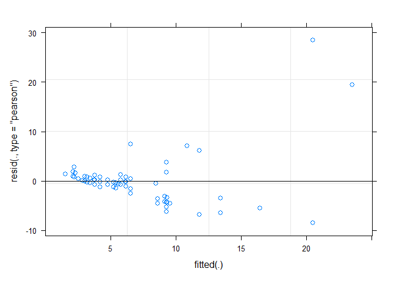<!-- -->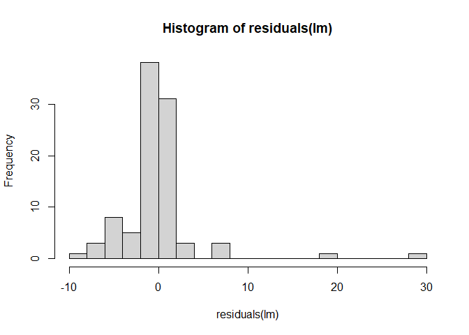<!-- -->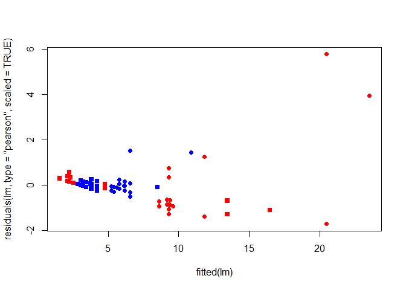<!-- -->

```
## [1] "the number of complete cases is 94"
```

```
## Linear mixed model fit by REML. t-tests use Satterthwaite's method [
## lmerModLmerTest]
## Formula: trait ~ Treatment * Population + (1 | Population:Line)
##    Data: data
## 
## REML criterion at convergence: 587.8
## 
## Scaled residuals: 
##     Min      1Q  Median      3Q     Max 
## -1.7201 -0.2424 -0.0381  0.1526  5.7740 
## 
## Random effects:
##  Groups          Name        Variance Std.Dev.
##  Population:Line (Intercept) 18.72    4.327   
##  Residual                    24.38    4.937   
## Number of obs: 94, groups:  Population:Line, 21
## 
## Fixed effects:
##                        Estimate Std. Error      df t value Pr(>|t|)    
## (Intercept)              7.0822     1.1271 15.2944   6.284 1.34e-05 ***
## Treatment1               2.3507     0.5225 67.1368   4.499 2.78e-05 ***
## Population1              2.1259     1.1271 15.2944   1.886   0.0784 .  
## Treatment1:Population1   1.1692     0.5225 67.1368   2.238   0.0286 *  
## ---
## Signif. codes:  0 '***' 0.001 '**' 0.01 '*' 0.05 '.' 0.1 ' ' 1
## 
## Correlation of Fixed Effects:
##             (Intr) Trtmn1 Ppltn1
## Treatment1  -0.005              
## Population1  0.251 -0.002       
## Trtmnt1:Pp1 -0.002  0.209 -0.005
```

```
## Computing profile confidence intervals ...
```

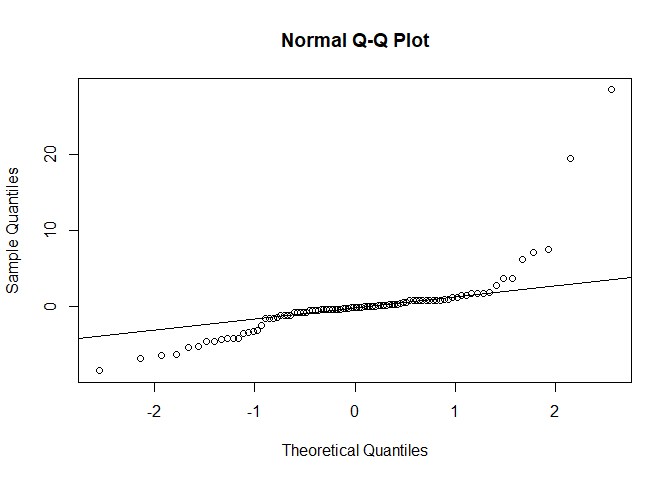<!-- -->

```
##                              2.5 %   97.5 %
## .sig01                  2.21265295 6.341862
## .sigma                  4.16574469 5.838843
## (Intercept)             4.90030687 9.315660
## Treatment1              1.31972452 3.373855
## Population1            -0.05862151 4.354736
## Treatment1:Population1  0.14419248 2.198033
```

``` r
emergence_anov_21 <- do_anov(emergence_lm_21)
```

```
## Type III Analysis of Variance Table with Satterthwaite's method
##                      Sum Sq Mean Sq NumDF  DenDF F value    Pr(>F)    
## Treatment            493.44  493.44     1 67.137 20.2428 2.778e-05 ***
## Population            86.72   86.72     1 15.294  3.5576   0.07841 .  
## Treatment:Population 122.07  122.07     1 67.137  5.0076   0.02856 *  
## ---
## Signif. codes:  0 '***' 0.001 '**' 0.01 '*' 0.05 '.' 0.1 ' ' 1
```

``` r
emergence_anov_21$trait <- "Emergence"
emergence_means_21 <- get_table(emergence_lm_21)
```

There is an interaction, so do post-hoc analyses to identify where there are differences between means within treatments and between treatments within populations.


``` r
# belm
as.data.frame(summary(lmer(Emergence ~ Treatment + (1|Population:Line), data = subset(Dat_2021_TwoTrt, Population == "BELM")))$coefficients) # yes, difference between treatments for belm
```

```
##             Estimate Std. Error        df  t value    Pr(>|t|)
## (Intercept) 9.237898   2.832456  5.745231 3.261444 0.018324953
## Treatment1  3.520640   1.239400 26.792721 2.840599 0.008495461
```

``` r
#roda
as.data.frame(summary(lmer(Emergence ~ Treatment + (1|Population:Line), data = subset(Dat_2021_TwoTrt, Population == "RODA")))$coefficients) # yes, difference between treatments for roda
```

```
##             Estimate Std. Error       df  t value       Pr(>|t|)
## (Intercept) 4.962928  0.5508862 10.63605 9.008990 0.000002646898
## Treatment1  1.189046  0.2306105 41.83380 5.156081 0.000006464424
```

``` r
#cur
as.data.frame(summary(lmer(Emergence ~ Population + (1|Population:Line), data = subset(Dat_2021_TwoTrt, Treatment == "Current")))$coefficients) # yes but weak difference between pops in cur
```

```
##             Estimate Std. Error       df  t value     Pr(>|t|)
## (Intercept) 9.752698   1.804341 13.28347 5.405131 0.0001113807
## Population1 3.561911   1.804341 13.28347 1.974079 0.0695407168
```

``` r
#fut
as.data.frame(summary(lmer(Emergence ~ Population + (1|Population:Line), data = subset(Dat_2021_TwoTrt, Treatment == "Future")))$coefficients) # no difference between pops in fut
```

```
##              Estimate Std. Error      df  t value         Pr(>|t|)
## (Intercept) 4.4215419  0.4605614 18.0996 9.600330 0.00000001584374
## Population1 0.6365664  0.4605614 18.0996 1.382153 0.18374536401906
```

Days between emergence and bolting
no post hoc models because not in paper


``` r
# days emergence to bolting
bolting_lm_21 <- do_lmer(Dat_2021_TwoTrt$DayToBolt)
```

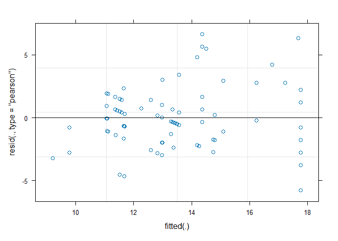<!-- -->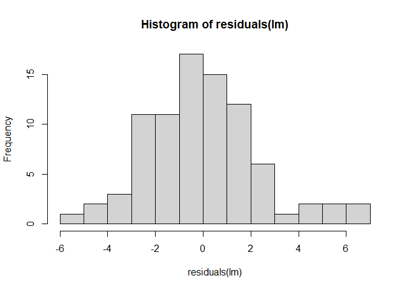<!-- -->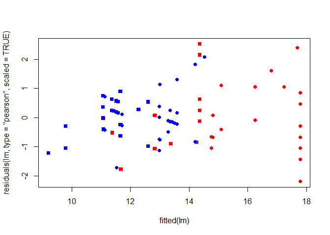<!-- -->

```
## [1] "the number of complete cases is 86"
```

```
## Linear mixed model fit by REML. t-tests use Satterthwaite's method [
## lmerModLmerTest]
## Formula: trait ~ Treatment * Population + (1 | Population:Line)
##    Data: data
## 
## REML criterion at convergence: 530.4
## 
## Scaled residuals: 
##     Min      1Q  Median      3Q     Max 
## -2.1964 -0.4846 -0.0055  0.4038  4.3559 
## 
## Random effects:
##  Groups          Name        Variance Std.Dev.
##  Population:Line (Intercept) 30.25    5.500   
##  Residual                    19.89    4.459   
## Number of obs: 86, groups:  Population:Line, 21
## 
## Fixed effects:
##                        Estimate Std. Error       df t value    Pr(>|t|)    
## (Intercept)             93.9889     1.3683  13.5792  68.690     < 2e-16 ***
## Treatment1              -2.1662     0.5100  59.1578  -4.247 0.000077627 ***
## Population1            -12.6459     1.3683  13.5792  -9.242 0.000000314 ***
## Treatment1:Population1  -0.4833     0.5100  59.1578  -0.948       0.347    
## ---
## Signif. codes:  0 '***' 0.001 '**' 0.01 '*' 0.05 '.' 0.1 ' ' 1
## 
## Correlation of Fixed Effects:
##             (Intr) Trtmn1 Ppltn1
## Treatment1  -0.054              
## Population1  0.257 -0.030       
## Trtmnt1:Pp1 -0.030  0.257 -0.054
```

```
## Computing profile confidence intervals ...
```

<!-- -->

```
##                             2.5 %      97.5 %
## .sig01                   3.030582   7.9669329
## .sigma                   3.715178   5.3719136
## (Intercept)             91.256461  96.6280012
## Treatment1              -3.208643  -1.1826092
## Population1            -15.364179 -10.0002752
## Treatment1:Population1  -1.519551   0.5020382
```

``` r
bolting_anov_21 <- do_anov(bolting_lm_21)
```

```
## Type III Analysis of Variance Table with Satterthwaite's method
##                       Sum Sq Mean Sq NumDF  DenDF F value       Pr(>F)    
## Treatment             358.71  358.71     1 59.158  18.039 0.0000776266 ***
## Population           1698.51 1698.51     1 13.579  85.416 0.0000003144 ***
## Treatment:Population   17.86   17.86     1 59.158   0.898       0.3472    
## ---
## Signif. codes:  0 '***' 0.001 '**' 0.01 '*' 0.05 '.' 0.1 ' ' 1
```

``` r
bolting_anov_21$trait <- "Bolting"
bolting_means_21 <- get_table(bolting_lm_21)
```

Days between bolting and flowering
no post hoc models because not in paper


``` r
# days bolting to flowering
flowering_lm_21 <- do_lmer(Dat_2021_TwoTrt$DayToFlwr)
```

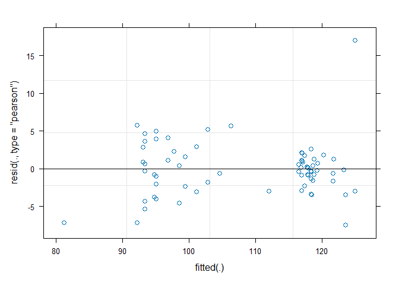<!-- --><!-- -->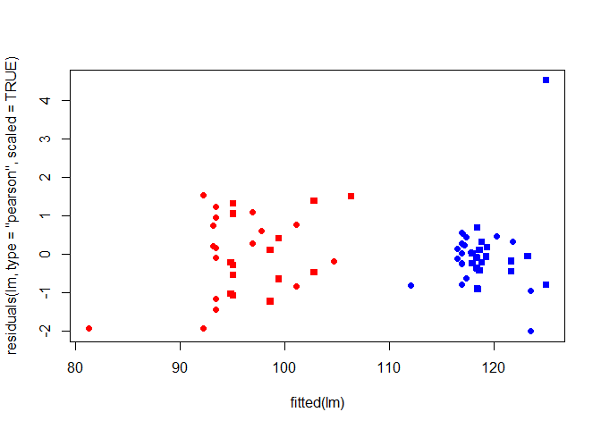<!-- -->

```
## [1] "the number of complete cases is 85"
```

```
## Linear mixed model fit by REML. t-tests use Satterthwaite's method [
## lmerModLmerTest]
## Formula: trait ~ Treatment * Population + (1 | Population:Line)
##    Data: data
## 
## REML criterion at convergence: 419.2
## 
## Scaled residuals: 
##     Min      1Q  Median      3Q     Max 
## -2.1984 -0.6315 -0.0941  0.5323  2.5234 
## 
## Random effects:
##  Groups          Name        Variance Std.Dev.
##  Population:Line (Intercept) 2.354    1.534   
##  Residual                    6.915    2.630   
## Number of obs: 85, groups:  Population:Line, 21
## 
## Fixed effects:
##                        Estimate Std. Error      df t value Pr(>|t|)    
## (Intercept)             13.3475     0.4764 14.4428  28.016 5.38e-14 ***
## Treatment1               1.3339     0.2980 63.9497   4.475 3.21e-05 ***
## Population1              1.2448     0.4764 14.4428   2.613   0.0201 *  
## Treatment1:Population1   0.3745     0.2980 63.9497   1.256   0.2135    
## ---
## Signif. codes:  0 '***' 0.001 '**' 0.01 '*' 0.05 '.' 0.1 ' ' 1
## 
## Correlation of Fixed Effects:
##             (Intr) Trtmn1 Ppltn1
## Treatment1  -0.063              
## Population1  0.269 -0.041       
## Trtmnt1:Pp1 -0.041  0.236 -0.063
```

```
## Computing profile confidence intervals ...
```

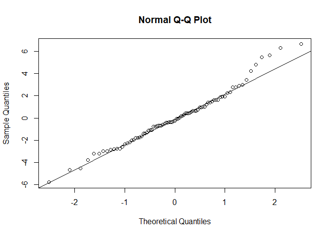<!-- -->

```
##                             2.5 %     97.5 %
## .sig01                  0.2588726  2.4981348
## .sigma                  2.1947908  3.1321150
## (Intercept)            12.4121106 14.2721081
## Treatment1              0.7375880  1.9105034
## Population1             0.3188873  2.1792307
## Treatment1:Population1 -0.2115299  0.9576623
```

``` r
flowering_anov_21 <- do_anov(flowering_lm_21)
```

```
## Type III Analysis of Variance Table with Satterthwaite's method
##                       Sum Sq Mean Sq NumDF  DenDF F value     Pr(>F)    
## Treatment            138.507 138.507     1 63.950 20.0296 0.00003205 ***
## Population            47.209  47.209     1 14.443  6.8268    0.02006 *  
## Treatment:Population  10.916  10.916     1 63.950  1.5785    0.21354    
## ---
## Signif. codes:  0 '***' 0.001 '**' 0.01 '*' 0.05 '.' 0.1 ' ' 1
```

``` r
flowering_anov_21$trait <- "Bolting To Flowering"
flowering_means_21 <- get_table(flowering_lm_21)
```

Days between Emergence and flowering


``` r
# Emergence to flowering
eTof_lm_21 <- do_lmer(Dat_2021_TwoTrt$EmergeToFlwr)
```

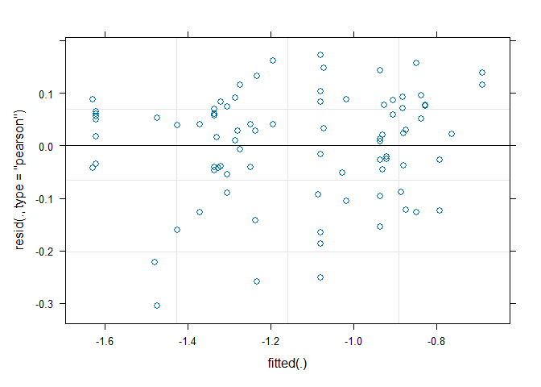<!-- -->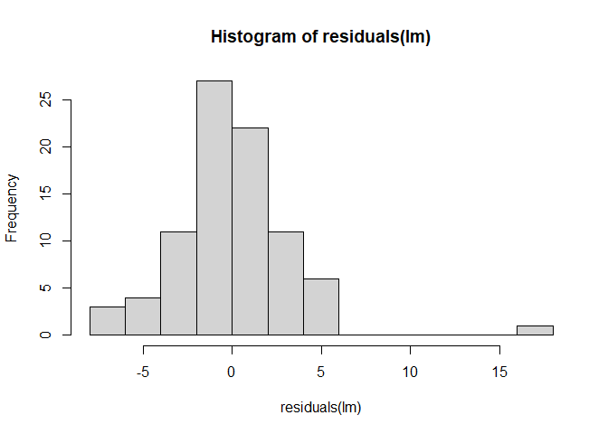<!-- -->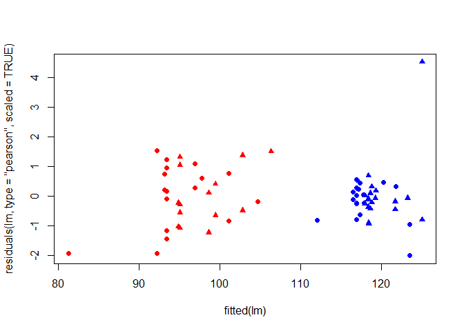<!-- -->

```
## [1] "the number of complete cases is 85"
```

```
## Linear mixed model fit by REML. t-tests use Satterthwaite's method [
## lmerModLmerTest]
## Formula: trait ~ Treatment * Population + (1 | Population:Line)
##    Data: data
## 
## REML criterion at convergence: 500.4
## 
## Scaled residuals: 
##     Min      1Q  Median      3Q     Max 
## -1.9982 -0.3696 -0.0644  0.4179  4.5201 
## 
## Random effects:
##  Groups          Name        Variance Std.Dev.
##  Population:Line (Intercept) 27.08    5.203   
##  Residual                    14.16    3.763   
## Number of obs: 85, groups:  Population:Line, 21
## 
## Fixed effects:
##                         Estimate Std. Error        df t value    Pr(>|t|)    
## (Intercept)            107.22498    1.27173  13.25347  84.314     < 2e-16 ***
## Treatment1              -0.78995    0.43311  57.28992  -1.824      0.0734 .  
## Population1            -11.33161    1.27173  13.25347  -8.910 0.000000582 ***
## Treatment1:Population1  -0.05427    0.43311  57.28992  -0.125      0.9007    
## ---
## Signif. codes:  0 '***' 0.001 '**' 0.01 '*' 0.05 '.' 0.1 ' ' 1
## 
## Correlation of Fixed Effects:
##             (Intr) Trtmn1 Ppltn1
## Treatment1  -0.048              
## Population1  0.253 -0.031       
## Trtmnt1:Pp1 -0.031  0.247 -0.048
```

```
## Computing profile confidence intervals ...
```

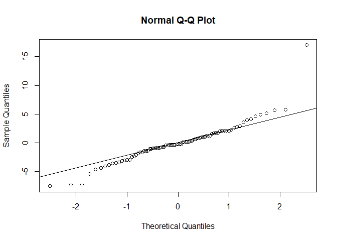<!-- -->

```
##                              2.5 %       97.5 %
## .sig01                   2.8356169   7.47763290
## .sigma                   3.1291636   4.56251355
## (Intercept)            104.6828260 109.67742145
## Treatment1              -1.6916233   0.04293869
## Population1            -13.8460381  -8.86451730
## Treatment1:Population1  -0.9383905   0.78228854
```

``` r
eTof_anov_21 <- do_anov(eTof_lm_21)
```

```
## Type III Analysis of Variance Table with Satterthwaite's method
##                       Sum Sq Mean Sq NumDF  DenDF F value       Pr(>F)    
## Treatment              47.11   47.11     1 57.290  3.3266      0.07338 .  
## Population           1124.29 1124.29     1 13.253 79.3946 0.0000005823 ***
## Treatment:Population    0.22    0.22     1 57.290  0.0157      0.90072    
## ---
## Signif. codes:  0 '***' 0.001 '**' 0.01 '*' 0.05 '.' 0.1 ' ' 1
```

``` r
eTof_anov_21$trait <- "Emergence To Flowering"
eTof_means_21 <- get_table(eTof_lm_21)
```

Run single models to test for difference only in future environment


``` r
# belm
as.data.frame(summary(lmer(EmergeToFlwr ~ Treatment + (1|Population:Line), data = subset(Dat_2021_TwoTrt, Population == "BELM")))$coefficients) # no, difference between treatments for belm
```

```
##               Estimate Std. Error        df    t value        Pr(>|t|)
## (Intercept) 95.5879986  3.2485850  5.959863 29.4245027 0.0000001109865
## Treatment1  -0.6796247  0.7253247 23.402696 -0.9369937 0.3583314712285
```

``` r
#roda
as.data.frame(summary(lmer(EmergeToFlwr ~ Treatment + (1|Population:Line), data = subset(Dat_2021_TwoTrt, Population == "RODA")))$coefficients) # weak, difference between treatments for roda
```

```
##                Estimate Std. Error        df    t value     Pr(>|t|)
## (Intercept) 118.7644310  0.8064123  9.527061 147.275067 2.556565e-17
## Treatment1   -0.8024289  0.5015059 37.766706  -1.600039 1.179233e-01
```

``` r
#cur
as.data.frame(summary(lmer(EmergeToFlwr ~ Population + (1|Population:Line), data = subset(Dat_2021_TwoTrt, Treatment == "Current")))$coefficients) # yes difference between pops in cur
```

```
##              Estimate Std. Error       df   t value     Pr(>|t|)
## (Intercept) 106.30622   1.278175 14.82489 83.170343 3.305448e-21
## Population1 -11.44864   1.278175 14.82489 -8.957021 2.288909e-07
```

``` r
#fut
as.data.frame(summary(lmer(EmergeToFlwr ~ Population + (1|Population:Line), data = subset(Dat_2021_TwoTrt, Treatment == "Future")))$coefficients) # yes difference between pops in fut
```

```
##              Estimate Std. Error       df   t value     Pr(>|t|)
## (Intercept) 109.53280   1.262595 13.73147 86.752102 3.280403e-20
## Population1 -10.27468   1.262595 13.73147 -8.137745 1.280514e-06
```

### Single Leaf Collected At Flowering

fresh weight

``` r
# Fresh weight
fresh_lm_21 <- do_lmer(Dat_2021_TwoTrt$l10_FreshWt)
```

<!-- -->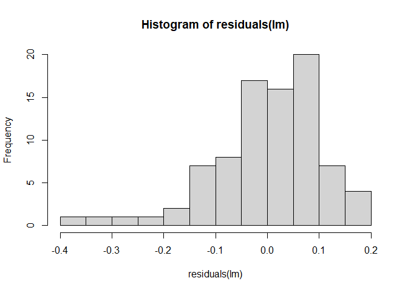<!-- -->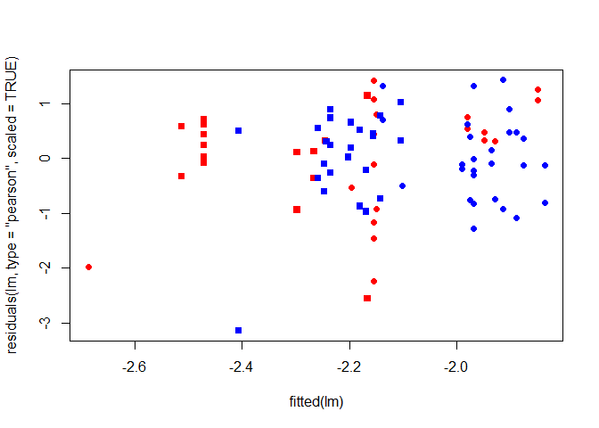<!-- -->

```
## [1] "the number of complete cases is 85"
```

```
## Linear mixed model fit by REML. t-tests use Satterthwaite's method [
## lmerModLmerTest]
## Formula: trait ~ Treatment * Population + (1 | Population:Line)
##    Data: data
## 
## REML criterion at convergence: -60.2
## 
## Scaled residuals: 
##     Min      1Q  Median      3Q     Max 
## -2.6215 -0.3928  0.1852  0.6380  1.4826 
## 
## Random effects:
##  Groups          Name        Variance Std.Dev.
##  Population:Line (Intercept) 0.03042  0.1744  
##  Residual                    0.01353  0.1163  
## Number of obs: 85, groups:  Population:Line, 21
## 
## Fixed effects:
##                        Estimate Std. Error       df t value Pr(>|t|)    
## (Intercept)            -1.17954    0.04216 14.50807 -27.980 4.95e-14 ***
## Treatment1              0.23573    0.01340 58.77530  17.591  < 2e-16 ***
## Population1            -0.06932    0.04216 14.50807  -1.644   0.1216    
## Treatment1:Population1  0.03560    0.01340 58.77530   2.657   0.0101 *  
## ---
## Signif. codes:  0 '***' 0.001 '**' 0.01 '*' 0.05 '.' 0.1 ' ' 1
## 
## Correlation of Fixed Effects:
##             (Intr) Trtmn1 Ppltn1
## Treatment1  -0.046              
## Population1  0.251 -0.029       
## Trtmnt1:Pp1 -0.029  0.247 -0.046
```

```
## Computing profile confidence intervals ...
```

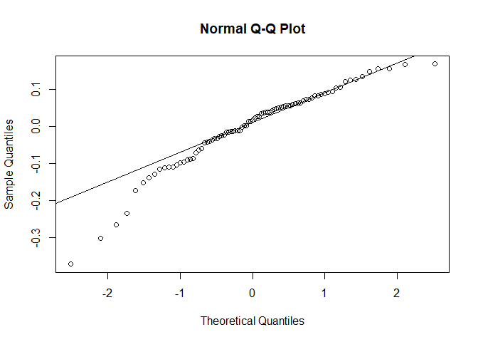<!-- -->

```
##                               2.5 %      97.5 %
## .sig01                  0.104432054  0.24700252
## .sigma                  0.096829514  0.13986969
## (Intercept)            -1.263451662 -1.09811659
## Treatment1              0.208458202  0.26158909
## Population1            -0.152814938  0.01231486
## Treatment1:Population1  0.008592208  0.06154450
```

``` r
fresh_anov_21 <- do_anov(fresh_lm_21)
```

```
## Type III Analysis of Variance Table with Satterthwaite's method
##                      Sum Sq Mean Sq NumDF  DenDF  F value  Pr(>F)    
## Treatment            4.1858  4.1858     1 58.775 309.4517 < 2e-16 ***
## Population           0.0366  0.0366     1 14.508   2.7037 0.12160    
## Treatment:Population 0.0955  0.0955     1 58.775   7.0570 0.01015 *  
## ---
## Signif. codes:  0 '***' 0.001 '**' 0.01 '*' 0.05 '.' 0.1 ' ' 1
```

``` r
fresh_anov_21$trait <- "l10_FreshWt"
fresh_means_21 <- get_table_bt(fresh_lm_21)
```

There is an interaction, so do posthoc analyses.


``` r
# belm
as.data.frame(summary(lmer(l10_FreshWt ~ Treatment + (1|Population:Line), data = subset(Dat_2021_TwoTrt, Population == "BELM")))$coefficients) 
```

```
##               Estimate Std. Error        df   t value     Pr(>|t|)
## (Intercept) -1.2582655 0.11003108  6.103673 -11.43555 2.380375e-05
## Treatment1   0.2750561 0.02398492 23.545262  11.46788 4.047579e-11
```

``` r
#roda
as.data.frame(summary(lmer(l10_FreshWt ~ Treatment + (1|Population:Line), data = subset(Dat_2021_TwoTrt, Population == "RODA")))$coefficients)
```

```
##               Estimate Std. Error       df   t value     Pr(>|t|)
## (Intercept) -1.1064522 0.02265805 10.92429 -48.83263 3.861093e-14
## Treatment1   0.1985206 0.01444864 39.39331  13.73974 1.303170e-16
```

``` r
#cur
as.data.frame(summary(lmer(l10_FreshWt ~ Population + (1|Population:Line), data = subset(Dat_2021_TwoTrt, Treatment == "Current")))$coefficients) 
```

```
##                Estimate Std. Error       df     t value     Pr(>|t|)
## (Intercept) -0.94174071 0.04816584 16.69245 -19.5520439 6.134842e-13
## Population1 -0.03343714 0.04816584 16.69245  -0.6942085 4.971002e-01
```

``` r
#fut
as.data.frame(summary(lmer(l10_FreshWt ~ Population + (1|Population:Line), data = subset(Dat_2021_TwoTrt, Treatment == "Future")))$coefficients)
```

```
##                Estimate Std. Error       df    t value     Pr(>|t|)
## (Intercept) -1.37688563 0.03253932 15.19179 -42.314520 3.498102e-17
## Population1 -0.07460598 0.03253932 15.19179  -2.292795 3.653283e-02
```


saturated/hydrated weight


``` r
# Saturated weight
sat_lm_21 <- do_lmer(Dat_2021_TwoTrt$l10_SatWt)
```

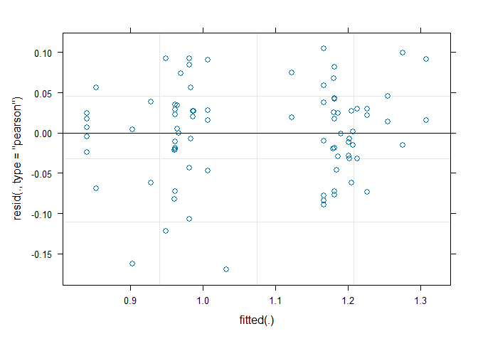<!-- -->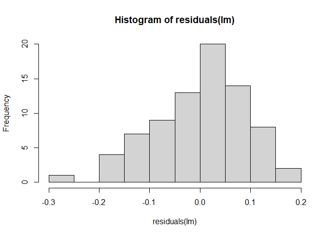<!-- -->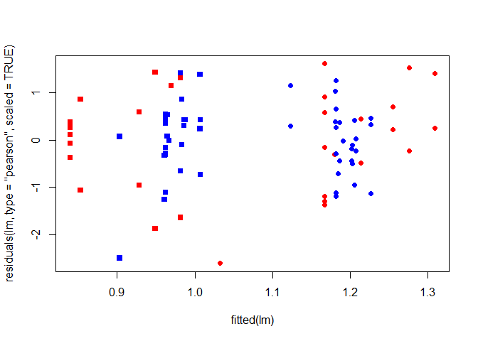<!-- -->

```
## [1] "the number of complete cases is 85"
```

```
## Linear mixed model fit by REML. t-tests use Satterthwaite's method [
## lmerModLmerTest]
## Formula: trait ~ Treatment * Population + (1 | Population:Line)
##    Data: data
## 
## REML criterion at convergence: -61.9
## 
## Scaled residuals: 
##     Min      1Q  Median      3Q     Max 
## -2.8140 -0.4114  0.1928  0.6112  1.4642 
## 
## Random effects:
##  Groups          Name        Variance Std.Dev.
##  Population:Line (Intercept) 0.02656  0.1630  
##  Residual                    0.01363  0.1167  
## Number of obs: 85, groups:  Population:Line, 21
## 
## Fixed effects:
##                        Estimate Std. Error       df t value Pr(>|t|)    
## (Intercept)            -1.11253    0.03977 14.07761 -27.971  9.7e-14 ***
## Treatment1              0.22307    0.01344 58.45017  16.602  < 2e-16 ***
## Population1            -0.06643    0.03977 14.07761  -1.670   0.1170    
## Treatment1:Population1  0.03205    0.01344 58.45017   2.386   0.0203 *  
## ---
## Signif. codes:  0 '***' 0.001 '**' 0.01 '*' 0.05 '.' 0.1 ' ' 1
## 
## Correlation of Fixed Effects:
##             (Intr) Trtmn1 Ppltn1
## Treatment1  -0.047              
## Population1  0.253 -0.031       
## Trtmnt1:Pp1 -0.031  0.247 -0.047
```

```
## Computing profile confidence intervals ...
```

<!-- -->

```
##                               2.5 %      97.5 %
## .sig01                  0.094437594  0.23270088
## .sigma                  0.097144666  0.14064005
## (Intercept)            -1.191920259 -1.03579818
## Treatment1              0.195621800  0.24898069
## Population1            -0.145309608  0.01054539
## Treatment1:Population1  0.004924121  0.05806381
```

``` r
sat_anov_21 <- do_anov(sat_lm_21)
```

```
## Type III Analysis of Variance Table with Satterthwaite's method
##                      Sum Sq Mean Sq NumDF  DenDF  F value  Pr(>F)    
## Treatment            3.7553  3.7553     1 58.450 275.6137 < 2e-16 ***
## Population           0.0380  0.0380     1 14.078   2.7893 0.11697    
## Treatment:Population 0.0775  0.0775     1 58.450   5.6910 0.02031 *  
## ---
## Signif. codes:  0 '***' 0.001 '**' 0.01 '*' 0.05 '.' 0.1 ' ' 1
```

``` r
sat_anov_21$trait <- "l10_SatWt"
sat_means_21 <- get_table_bt(sat_lm_21)
```


There is an interaction, so do posthoc analyses.


``` r
# belm
as.data.frame(summary(lmer(l10_SatWt ~ Treatment + (1|Population:Line), data = subset(Dat_2021_TwoTrt, Population == "BELM")))$coefficients) 
```

```
##               Estimate Std. Error        df  t value           Pr(>|t|)
## (Intercept) -1.1888522  0.1039306  6.010024 -11.4389 0.0000264737187830
## Treatment1   0.2591054  0.0238897 23.495559  10.8459 0.0000000001261363
```

``` r
#roda
as.data.frame(summary(lmer(l10_SatWt ~ Treatment + (1|Population:Line), data = subset(Dat_2021_TwoTrt, Population == "RODA")))$coefficients)
```

```
##               Estimate Std. Error       df   t value     Pr(>|t|)
## (Intercept) -1.0420404 0.02210710 10.55188 -47.13601 1.294243e-13
## Treatment1   0.1893232 0.01459086 39.18236  12.97547 9.145187e-16
```

``` r
#cur
as.data.frame(summary(lmer(l10_SatWt ~ Population + (1|Population:Line), data = subset(Dat_2021_TwoTrt, Treatment == "Current")))$coefficients) 
```

```
##                Estimate Std. Error       df    t value     Pr(>|t|)
## (Intercept) -0.88701166 0.04565457 16.29635 -19.428759 1.064632e-12
## Population1 -0.03373307 0.04565457 16.29635  -0.738876 4.704913e-01
```

``` r
#fut
as.data.frame(summary(lmer(l10_SatWt ~ Population + (1|Population:Line), data = subset(Dat_2021_TwoTrt, Treatment == "Future")))$coefficients)
```

```
##                Estimate Std. Error       df    t value     Pr(>|t|)
## (Intercept) -1.30173658 0.03050694 14.92966 -42.670173 5.124080e-17
## Population1 -0.07235192 0.03050694 14.92966  -2.371654 3.159144e-02
```


dried weight

``` r
# Dried weight
dry_lm_21 <- do_lmer(Dat_2021_TwoTrt$l10_DriedWt)
```

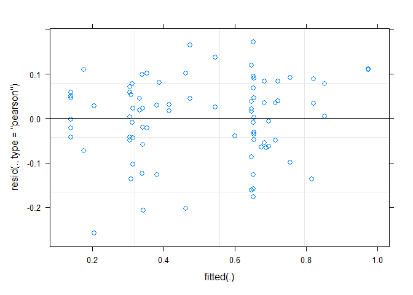<!-- --><!-- -->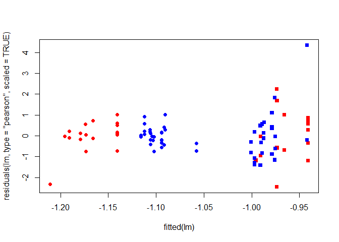<!-- -->

```
## [1] "the number of complete cases is 85"
```

```
## Linear mixed model fit by REML. t-tests use Satterthwaite's method [
## lmerModLmerTest]
## Formula: trait ~ Treatment * Population + (1 | Population:Line)
##    Data: data
## 
## REML criterion at convergence: -55.8
## 
## Scaled residuals: 
##     Min      1Q  Median      3Q     Max 
## -3.1379 -0.3692  0.1533  0.5441  1.4237 
## 
## Random effects:
##  Groups          Name        Variance Std.Dev.
##  Population:Line (Intercept) 0.03441  0.1855  
##  Residual                    0.01402  0.1184  
## Number of obs: 85, groups:  Population:Line, 21
## 
## Fixed effects:
##                        Estimate Std. Error       df t value Pr(>|t|)    
## (Intercept)            -2.18023    0.04459 14.01650 -48.896  < 2e-16 ***
## Treatment1              0.14602    0.01365 57.94126  10.698 2.43e-15 ***
## Population1            -0.09010    0.04459 14.01650  -2.021   0.0628 .  
## Treatment1:Population1  0.01238    0.01365 57.94126   0.907   0.3683    
## ---
## Signif. codes:  0 '***' 0.001 '**' 0.01 '*' 0.05 '.' 0.1 ' ' 1
## 
## Correlation of Fixed Effects:
##             (Intr) Trtmn1 Ppltn1
## Treatment1  -0.044              
## Population1  0.250 -0.028       
## Trtmnt1:Pp1 -0.028  0.248 -0.044
```

```
## Computing profile confidence intervals ...
```

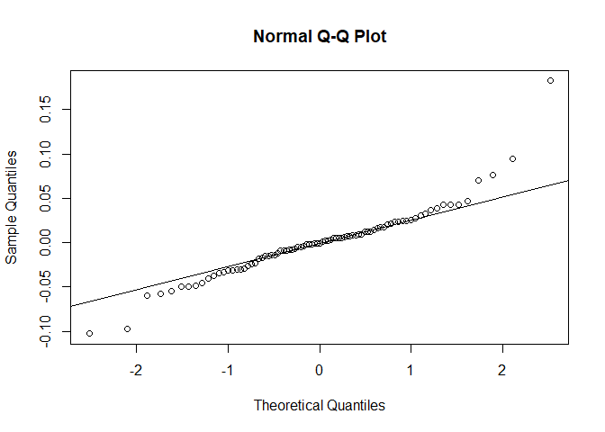<!-- -->

```
##                              2.5 %       97.5 %
## .sig01                  0.10894468  0.262791386
## .sigma                  0.09852769  0.142907333
## (Intercept)            -2.26923166 -2.094195810
## Treatment1              0.11807882  0.172344036
## Population1            -0.17856985 -0.003808402
## Treatment1:Population1 -0.01523668  0.038795020
```

``` r
dry_anov_21 <- do_anov(dry_lm_21)
```

```
## Type III Analysis of Variance Table with Satterthwaite's method
##                       Sum Sq Mean Sq NumDF  DenDF  F value    Pr(>F)    
## Treatment            1.60445 1.60445     1 57.941 114.4465 2.431e-15 ***
## Population           0.05724 0.05724     1 14.016   4.0831   0.06285 .  
## Treatment:Population 0.01153 0.01153     1 57.941   0.8223   0.36827    
## ---
## Signif. codes:  0 '***' 0.001 '**' 0.01 '*' 0.05 '.' 0.1 ' ' 1
```

``` r
dry_anov_21$trait <- "l10_DriedWt"
dry_means_21 <- get_table_bt(dry_lm_21)
# no significant interaction term

# testing, see below for more
#anov_lmer(Dat_2021_TwoTrt$DriedWt_g)
#anov_lmer(Dat_2021_TwoTrt$SQR_DriedWt)
```

No interaction but run single models to test for difference in the future environment

``` r
# belm
as.data.frame(summary(lmer(l10_DriedWt ~ Treatment + (1|Population:Line), data = subset(Dat_2021_TwoTrt, Population == "BELM")))$coefficients) # yes, difference between treatments for belm
```

```
##               Estimate Std. Error        df    t value        Pr(>|t|)
## (Intercept) -2.2818263 0.11642790  6.102344 -19.598620 0.0000009643733
## Treatment1   0.1626769 0.02342762 23.465476   6.943808 0.0000003981940
```

``` r
#roda
as.data.frame(summary(lmer(l10_DriedWt ~ Treatment + (1|Population:Line), data = subset(Dat_2021_TwoTrt, Population == "RODA")))$coefficients) # yes, difference between treatments for roda
```

```
##               Estimate Std. Error       df    t value     Pr(>|t|)
## (Intercept) -2.0851176 0.02529137 10.61852 -82.443852 2.994061e-16
## Treatment1   0.1318241 0.01532150 38.86882   8.603866 1.552347e-10
```

``` r
#cur
as.data.frame(summary(lmer(l10_DriedWt ~ Population + (1|Population:Line), data = subset(Dat_2021_TwoTrt, Treatment == "Current")))$coefficients) # weak difference between pops in cur
```

```
##                Estimate Std. Error       df    t value     Pr(>|t|)
## (Intercept) -2.03021249 0.05018916 16.37204 -40.451218 7.668555e-18
## Population1 -0.07675267 0.05018916 16.37204  -1.529268 1.452884e-01
```

``` r
#fut
as.data.frame(summary(lmer(l10_DriedWt ~ Population + (1|Population:Line), data = subset(Dat_2021_TwoTrt, Treatment == "Future")))$coefficients) # yes difference between pops in fut
```

```
##                Estimate Std. Error      df    t value     Pr(>|t|)
## (Intercept) -2.28095058  0.0312787 14.8775 -72.923446 2.028792e-20
## Population1 -0.06675257  0.0312787 14.8775  -2.134122 4.989226e-02
```

leaf area


``` r
# Leaf Area
area_lm_21 <- do_lmer(Dat_2021_TwoTrt$l10_LeafArea)
```

<!-- -->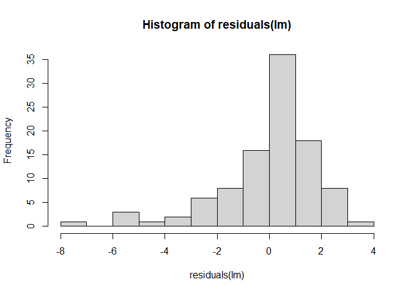<!-- --><!-- -->

```
## [1] "the number of complete cases is 83"
```

```
## Linear mixed model fit by REML. t-tests use Satterthwaite's method [
## lmerModLmerTest]
## Formula: trait ~ Treatment * Population + (1 | Population:Line)
##    Data: data
## 
## REML criterion at convergence: -81.4
## 
## Scaled residuals: 
##     Min      1Q  Median      3Q     Max 
## -2.5360 -0.4835  0.1834  0.6205  1.6891 
## 
## Random effects:
##  Groups          Name        Variance Std.Dev.
##  Population:Line (Intercept) 0.02002  0.1415  
##  Residual                    0.01040  0.1020  
## Number of obs: 83, groups:  Population:Line, 21
## 
## Fixed effects:
##                         Estimate Std. Error        df t value      Pr(>|t|)    
## (Intercept)             0.496041   0.034771 13.640020  14.266 0.00000000138 ***
## Treatment1              0.213058   0.011993 57.102785  17.765       < 2e-16 ***
## Population1            -0.008962   0.034771 13.640020  -0.258      0.800462    
## Treatment1:Population1  0.042910   0.011993 57.102785   3.578      0.000715 ***
## ---
## Signif. codes:  0 '***' 0.001 '**' 0.01 '*' 0.05 '.' 0.1 ' ' 1
## 
## Correlation of Fixed Effects:
##             (Intr) Trtmn1 Ppltn1
## Treatment1  -0.025              
## Population1  0.260 -0.014       
## Trtmnt1:Pp1 -0.014  0.259 -0.025
```

```
## Computing profile confidence intervals ...
```

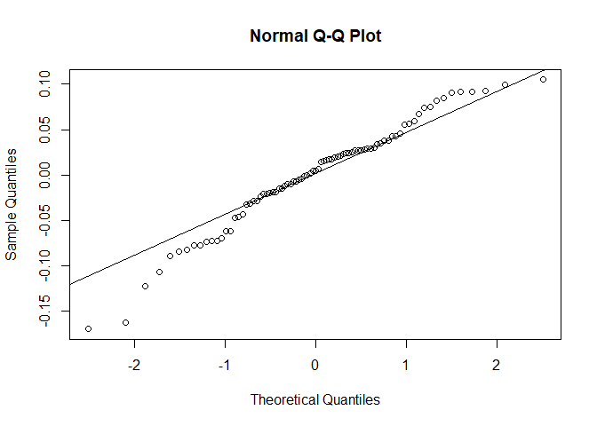<!-- -->

```
##                              2.5 %     97.5 %
## .sig01                  0.07972315 0.20336740
## .sigma                  0.08457513 0.12358809
## (Intercept)             0.42708114 0.56330824
## Treatment1              0.18799866 0.23609312
## Population1            -0.07769561 0.05843942
## Treatment1:Population1  0.01833760 0.06601646
```

``` r
area_anov_21 <- do_anov(area_lm_21)
```

```
## Type III Analysis of Variance Table with Satterthwaite's method
##                      Sum Sq Mean Sq NumDF  DenDF  F value    Pr(>F)    
## Treatment            3.2828  3.2828     1 57.103 315.5779 < 2.2e-16 ***
## Population           0.0007  0.0007     1 13.640   0.0664 0.8004624    
## Treatment:Population 0.1332  0.1332     1 57.103  12.8006 0.0007147 ***
## ---
## Signif. codes:  0 '***' 0.001 '**' 0.01 '*' 0.05 '.' 0.1 ' ' 1
```

``` r
area_anov_21$trait <- "l10_area"
area_means_21 <- get_table_bt(area_lm_21)
```


There is an interaction, so do posthoc analyses.


``` r
# belm
as.data.frame(summary(lmer(l10_LeafArea ~ Treatment + (1|Population:Line), data = subset(Dat_2021_TwoTrt, Population == "BELM")))$coefficients) 
```

```
##              Estimate Std. Error        df   t value     Pr(>|t|)
## (Intercept) 0.4805242 0.09183170  5.931911  5.232662 2.021528e-03
## Treatment1  0.2614153 0.02107347 22.795461 12.404952 1.286153e-11
```

``` r
#roda
as.data.frame(summary(lmer(l10_LeafArea ~ Treatment + (1|Population:Line), data = subset(Dat_2021_TwoTrt, Population == "RODA")))$coefficients)
```

```
##              Estimate Std. Error       df  t value     Pr(>|t|)
## (Intercept) 0.5061040 0.02087751 10.76542 24.24159 9.693493e-11
## Treatment1  0.1679575 0.01305196 38.40683 12.86838 1.670804e-15
```

``` r
#cur
as.data.frame(summary(lmer(l10_LeafArea ~ Population + (1|Population:Line), data = subset(Dat_2021_TwoTrt, Treatment == "Current")))$coefficients) 
```

```
##               Estimate Std. Error       df    t value     Pr(>|t|)
## (Intercept) 0.69537155 0.04050512 15.69837 17.1674974 1.360711e-11
## Population1 0.02444939 0.04050512 15.69837  0.6036122 5.547240e-01
```

``` r
#fut
as.data.frame(summary(lmer(l10_LeafArea ~ Population + (1|Population:Line), data = subset(Dat_2021_TwoTrt, Treatment == "Future")))$coefficients)
```

```
##                Estimate Std. Error       df    t value        Pr(>|t|)
## (Intercept)  0.31594825 0.02958385 15.65354 10.6797533 0.0000000136299
## Population1 -0.02518031 0.02958385 15.65354 -0.8511505 0.4075182023706
```

leaf perimeter


``` r
per_lm_21 <- do_lmer(Dat_2021_TwoTrt$l10_LeafPer)
```

<!-- -->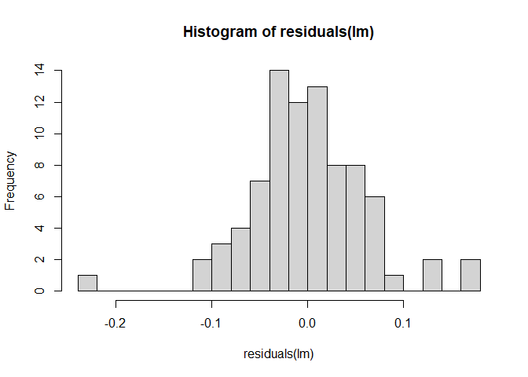<!-- -->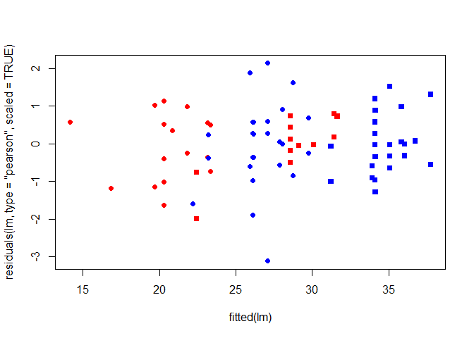<!-- -->

```
## [1] "the number of complete cases is 83"
```

```
## Linear mixed model fit by REML. t-tests use Satterthwaite's method [
## lmerModLmerTest]
## Formula: trait ~ Treatment * Population + (1 | Population:Line)
##    Data: data
## 
## REML criterion at convergence: -161.4
## 
## Scaled residuals: 
##      Min       1Q   Median       3Q      Max 
## -2.61222 -0.44221  0.07491  0.49319  1.61245 
## 
## Random effects:
##  Groups          Name        Variance Std.Dev.
##  Population:Line (Intercept) 0.004567 0.06758 
##  Residual                    0.004223 0.06499 
## Number of obs: 83, groups:  Population:Line, 21
## 
## Fixed effects:
##                         Estimate Std. Error        df t value Pr(>|t|)    
## (Intercept)             1.067498   0.017545 10.659214  60.844 6.77e-15 ***
## Treatment1              0.136535   0.007591 54.103865  17.987  < 2e-16 ***
## Population1            -0.014862   0.017545 10.659214  -0.847 0.415560    
## Treatment1:Population1  0.026822   0.007591 54.103865   3.533 0.000848 ***
## ---
## Signif. codes:  0 '***' 0.001 '**' 0.01 '*' 0.05 '.' 0.1 ' ' 1
## 
## Correlation of Fixed Effects:
##             (Intr) Trtmn1 Ppltn1
## Treatment1  -0.029              
## Population1  0.268 -0.018       
## Trtmnt1:Pp1 -0.018  0.254 -0.029
```

```
## Computing profile confidence intervals ...
```

<!-- -->

```
##                              2.5 %     97.5 %
## .sig01                  0.02783376 0.10297019
## .sigma                  0.05369511 0.07992568
## (Intercept)             1.03250517 1.10135898
## Treatment1              0.12043942 0.15107785
## Population1            -0.04990399 0.01897173
## Treatment1:Population1  0.01077325 0.04137020
```

``` r
per_anov_21 <- do_anov(per_lm_21)
```

```
## Type III Analysis of Variance Table with Satterthwaite's method
##                       Sum Sq Mean Sq NumDF  DenDF  F value    Pr(>F)    
## Treatment            1.36629 1.36629     1 54.104 323.5219 < 2.2e-16 ***
## Population           0.00303 0.00303     1 10.659   0.7176 0.4155605    
## Treatment:Population 0.05273 0.05273     1 54.104  12.4854 0.0008483 ***
## ---
## Signif. codes:  0 '***' 0.001 '**' 0.01 '*' 0.05 '.' 0.1 ' ' 1
```

``` r
per_anov_21$trait <- "l10_Perimeter"
per_means_21 <- get_table_bt(per_lm_21)
```


There is an interaction, so do posthoc analyses.


``` r
# belm
as.data.frame(summary(lmer(l10_LeafPer ~ Treatment + (1|Population:Line), data = subset(Dat_2021_TwoTrt, Population == "BELM")))$coefficients) 
```

```
##              Estimate Std. Error        df  t value     Pr(>|t|)
## (Intercept) 1.0473428 0.05148151  5.509978 20.34406 2.140142e-06
## Treatment1  0.1681529 0.01333603 22.543147 12.60892 1.085642e-11
```

``` r
#roda
as.data.frame(summary(lmer(l10_LeafPer ~ Treatment + (1|Population:Line), data = subset(Dat_2021_TwoTrt, Population == "RODA")))$coefficients)
```

```
##              Estimate  Std. Error        df   t value     Pr(>|t|)
## (Intercept) 1.0814040 0.009392197  9.605571 115.13856 2.078069e-16
## Treatment1  0.1095054 0.007921148 39.579543  13.82443 9.745714e-17
```

``` r
#cur
as.data.frame(summary(lmer(l10_LeafPer ~ Population + (1|Population:Line), data = subset(Dat_2021_TwoTrt, Treatment == "Current")))$coefficients) 
```

```
##                Estimate Std. Error       df   t value     Pr(>|t|)
## (Intercept) 1.197222160 0.02157123 14.43925 55.500874 3.061799e-18
## Population1 0.004916968 0.02157123 14.43925  0.227941 8.228884e-01
```

``` r
#fut
as.data.frame(summary(lmer(l10_LeafPer ~ Population + (1|Population:Line), data = subset(Dat_2021_TwoTrt, Treatment == "Future")))$coefficients)
```

```
##               Estimate Std. Error       df   t value     Pr(>|t|)
## (Intercept)  0.9422848 0.01642255 14.43604 57.377496 1.911930e-18
## Population1 -0.0292545 0.01642255 14.43604 -1.781361 9.589695e-02
```

specific leaf area


``` r
# SLA
SLA_lm_21 <- do_lmer(Dat_2021_TwoTrt$l10_SLA)
```

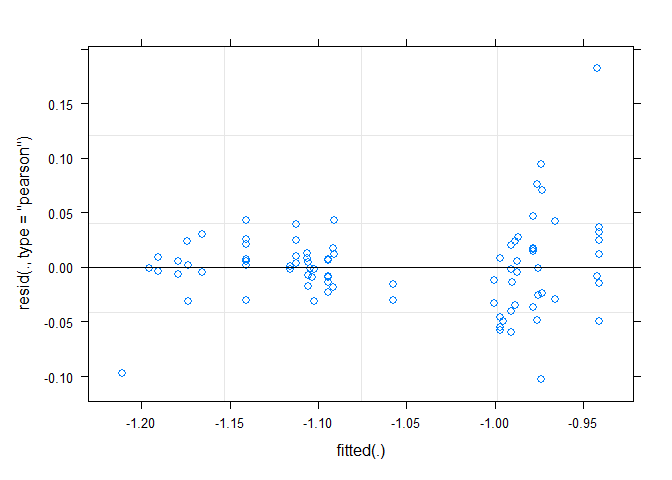<!-- --><!-- -->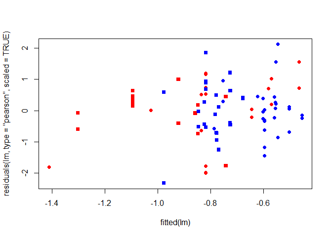<!-- -->

```
## [1] "the number of complete cases is 83"
```

```
## Linear mixed model fit by REML. t-tests use Satterthwaite's method [
## lmerModLmerTest]
## Formula: trait ~ Treatment * Population + (1 | Population:Line)
##    Data: data
## 
## REML criterion at convergence: -172.2
## 
## Scaled residuals: 
##     Min      1Q  Median      3Q     Max 
## -3.4966 -0.4782 -0.0399  0.4528  2.6551 
## 
## Random effects:
##  Groups          Name        Variance Std.Dev.
##  Population:Line (Intercept) 0.001299 0.03605 
##  Residual                    0.004492 0.06702 
## Number of obs: 83, groups:  Population:Line, 21
## 
## Fixed effects:
##                         Estimate Std. Error        df t value Pr(>|t|)    
## (Intercept)             2.667434   0.011759 12.922464 226.836  < 2e-16 ***
## Treatment1              0.070429   0.007699 62.693514   9.148 3.76e-13 ***
## Population1             0.076209   0.011759 12.922464   6.481 2.12e-05 ***
## Treatment1:Population1  0.033593   0.007699 62.693514   4.363 4.88e-05 ***
## ---
## Signif. codes:  0 '***' 0.001 '**' 0.01 '*' 0.05 '.' 0.1 ' ' 1
## 
## Correlation of Fixed Effects:
##             (Intr) Trtmn1 Ppltn1
## Treatment1  -0.035              
## Population1  0.280 -0.025       
## Trtmnt1:Pp1 -0.025  0.241 -0.035
```

```
## Computing profile confidence intervals ...
```

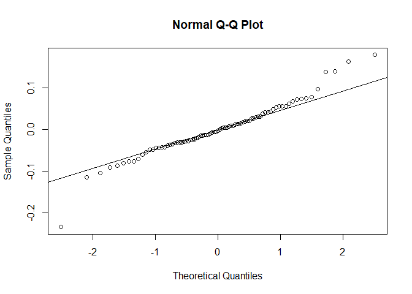<!-- -->

```
##                             2.5 %     97.5 %
## .sig01                 0.00000000 0.06097967
## .sigma                 0.05576688 0.08063255
## (Intercept)            2.64466235 2.69232461
## Treatment1             0.05545870 0.08571397
## Population1            0.05368135 0.10030121
## Treatment1:Population1 0.01861629 0.04887464
```

``` r
SLA_anov_21 <- do_anov(SLA_lm_21)
```

```
## Type III Analysis of Variance Table with Satterthwaite's method
##                       Sum Sq Mean Sq NumDF  DenDF F value    Pr(>F)    
## Treatment            0.37590 0.37590     1 62.694  83.681 3.757e-13 ***
## Population           0.18866 0.18866     1 12.922  42.000 2.125e-05 ***
## Treatment:Population 0.08552 0.08552     1 62.694  19.038 4.875e-05 ***
## ---
## Signif. codes:  0 '***' 0.001 '**' 0.01 '*' 0.05 '.' 0.1 ' ' 1
```

``` r
SLA_anov_21$trait <- "l10_SLA"
SLA_means_21 <- get_table_bt(SLA_lm_21)
```


There is an interaction, so do posthoc analyses.


``` r
# belm
as.data.frame(summary(lmer(l10_SLA ~ Treatment + (1|Population:Line), data = subset(Dat_2021_TwoTrt, Population == "BELM")))$coefficients) 
```

```
##              Estimate Std. Error        df    t value         Pr(>|t|)
## (Intercept) 2.7434211 0.02031779  2.433163 135.025587 0.00000894153874
## Treatment1  0.1040477 0.01319492 22.166536   7.885441 0.00000007108844
```

``` r
#roda
as.data.frame(summary(lmer(l10_SLA ~ Treatment + (1|Population:Line), data = subset(Dat_2021_TwoTrt, Population == "RODA")))$coefficients)
```

```
##               Estimate  Std. Error       df   t value     Pr(>|t|)
## (Intercept) 2.59130998 0.013459393 10.86824 192.52799 1.497742e-20
## Treatment1  0.03683304 0.008917223 38.79955   4.13055 1.862180e-04
```

``` r
#cur
as.data.frame(summary(lmer(l10_SLA ~ Population + (1|Population:Line), data = subset(Dat_2021_TwoTrt, Treatment == "Current")))$coefficients) 
```

```
## boundary (singular) fit: see help('isSingular')
```

```
##              Estimate  Std. Error df   t value     Pr(>|t|)
## (Intercept) 2.7294519 0.008995995 41 303.40745 2.443549e-70
## Population1 0.1045321 0.008995995 41  11.61985 1.497837e-14
```

``` r
#fut
as.data.frame(summary(lmer(l10_SLA ~ Population + (1|Population:Line), data = subset(Dat_2021_TwoTrt, Treatment == "Future")))$coefficients)
```

```
##               Estimate Std. Error       df    t value     Pr(>|t|)
## (Intercept) 2.59212045 0.01657371 12.79361 156.399571 2.226546e-22
## Population1 0.03843543 0.01657371 12.79361   2.319061 3.760730e-02
```

leaf dry matter content

``` r
# LDMC
LDMC_lm_21 <- do_lmer(Dat_2021_TwoTrt$l10_LDMC)
```

<!-- --><!-- -->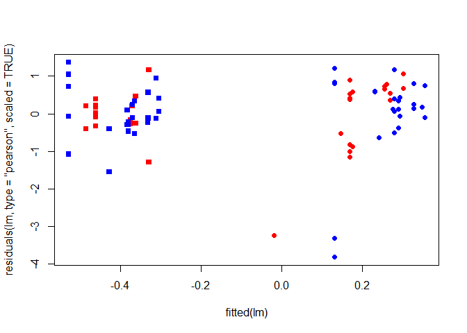<!-- -->

```
## [1] "the number of complete cases is 85"
```

```
## Linear mixed model fit by REML. t-tests use Satterthwaite's method [
## lmerModLmerTest]
## Formula: trait ~ Treatment * Population + (1 | Population:Line)
##    Data: data
## 
## REML criterion at convergence: -251.4
## 
## Scaled residuals: 
##     Min      1Q  Median      3Q     Max 
## -2.4485 -0.4358 -0.0234  0.4048  4.3451 
## 
## Random effects:
##  Groups          Name        Variance  Std.Dev.
##  Population:Line (Intercept) 0.0005846 0.02418 
##  Residual                    0.0017606 0.04196 
## Number of obs: 85, groups:  Population:Line, 21
## 
## Fixed effects:
##                         Estimate Std. Error        df  t value  Pr(>|t|)    
## (Intercept)            -1.060670   0.007549 16.820703 -140.503   < 2e-16 ***
## Treatment1             -0.078883   0.004755 66.433120  -16.591   < 2e-16 ***
## Population1            -0.018192   0.007549 16.820703   -2.410    0.0277 *  
## Treatment1:Population1 -0.021125   0.004755 66.433120   -4.443 0.0000344 ***
## ---
## Signif. codes:  0 '***' 0.001 '**' 0.01 '*' 0.05 '.' 0.1 ' ' 1
## 
## Correlation of Fixed Effects:
##             (Intr) Trtmn1 Ppltn1
## Treatment1  -0.063              
## Population1  0.269 -0.041       
## Trtmnt1:Pp1 -0.041  0.236 -0.063
```

```
## Computing profile confidence intervals ...
```

<!-- -->

```
##                               2.5 %       97.5 %
## .sig01                  0.007990638  0.038704065
## .sigma                  0.035089099  0.049593923
## (Intercept)            -1.076393477 -1.046047129
## Treatment1             -0.088328367 -0.069681981
## Population1            -0.033669760 -0.003655704
## Treatment1:Population1 -0.030546902 -0.011911948
```

``` r
LDMC_anov_21 <- do_anov(LDMC_lm_21)
```

```
## Type III Analysis of Variance Table with Satterthwaite's method
##                       Sum Sq Mean Sq NumDF  DenDF  F value     Pr(>F)    
## Treatment            0.48461 0.48461     1 66.433 275.2520  < 2.2e-16 ***
## Population           0.01022 0.01022     1 16.821   5.8071    0.02771 *  
## Treatment:Population 0.03475 0.03475     1 66.433  19.7403 0.00003442 ***
## ---
## Signif. codes:  0 '***' 0.001 '**' 0.01 '*' 0.05 '.' 0.1 ' ' 1
```

``` r
LDMC_anov_21$trait <- "l10_LDMC"
LDMC_means_21 <- get_table_bt(LDMC_lm_21)
```


There is an interaction, so do posthoc analyses.


``` r
# belm
as.data.frame(summary(lmer(l10_LDMC ~ Treatment + (1|Population:Line), data = subset(Dat_2021_TwoTrt, Population == "BELM")))$coefficients) 
```

```
##               Estimate  Std. Error        df   t value     Pr(>|t|)
## (Intercept) -1.0832388 0.015670987  4.907136 -69.12384 1.589650e-08
## Treatment1  -0.0991699 0.007615677 24.117732 -13.02181 2.101025e-12
```

``` r
#roda
as.data.frame(summary(lmer(l10_LDMC ~ Treatment + (1|Population:Line), data = subset(Dat_2021_TwoTrt, Population == "RODA")))$coefficients)
```

```
##                Estimate  Std. Error       df   t value     Pr(>|t|)
## (Intercept) -1.04212197 0.007703046 10.93881 -135.2870 5.500229e-19
## Treatment1  -0.05779488 0.005748903 40.27117  -10.0532 1.535825e-12
```

``` r
#cur
as.data.frame(summary(lmer(l10_LDMC ~ Population + (1|Population:Line), data = subset(Dat_2021_TwoTrt, Treatment == "Current")))$coefficients) 
```

```
##                Estimate  Std. Error       df    t value     Pr(>|t|)
## (Intercept) -1.14224997 0.007679154 17.37553 -148.74685 1.985044e-28
## Population1 -0.04235223 0.007679154 17.37553   -5.51522 3.500639e-05
```

``` r
#fut
as.data.frame(summary(lmer(l10_LDMC ~ Population + (1|Population:Line), data = subset(Dat_2021_TwoTrt, Treatment == "Future")))$coefficients)
```

```
##                 Estimate Std. Error       df     t value     Pr(>|t|)
## (Intercept) -0.976606573 0.01132999 12.42445 -86.1965759 1.237009e-18
## Population1  0.007599954 0.01132999 12.42445   0.6707819 5.146361e-01
```


relative water content

``` r
# RWC
RWC_lm_21 <- do_lmer(Dat_2021_TwoTrt$RWC)
```

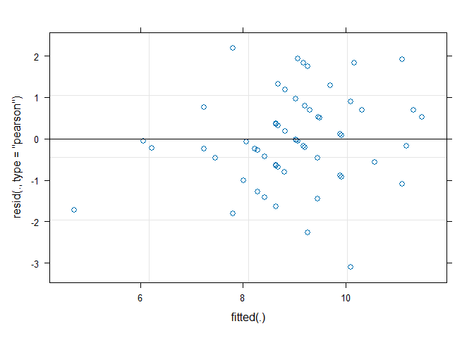<!-- -->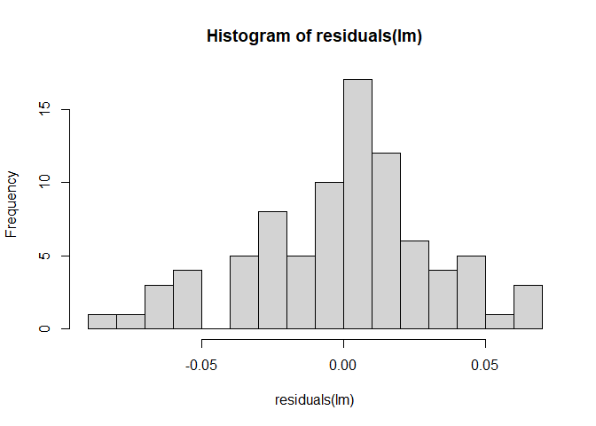<!-- -->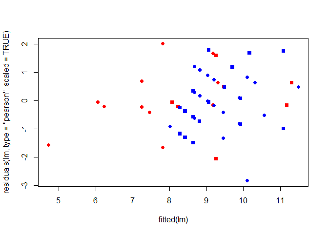<!-- -->

```
## [1] "the number of complete cases is 85"
```

```
## Linear mixed model fit by REML. t-tests use Satterthwaite's method [
## lmerModLmerTest]
## Formula: trait ~ Treatment * Population + (1 | Population:Line)
##    Data: data
## 
## REML criterion at convergence: -288.9
## 
## Scaled residuals: 
##     Min      1Q  Median      3Q     Max 
## -2.4821 -0.6542  0.0975  0.5190  1.9538 
## 
## Random effects:
##  Groups          Name        Variance  Std.Dev.
##  Population:Line (Intercept) 0.0002043 0.01429 
##  Residual                    0.0011878 0.03446 
## Number of obs: 85, groups:  Population:Line, 21
## 
## Fixed effects:
##                         Estimate Std. Error        df t value      Pr(>|t|)    
## (Intercept)             0.846388   0.005278 15.419685 160.365       < 2e-16 ***
## Treatment1              0.029322   0.003884 67.474634   7.549 0.00000000015 ***
## Population1            -0.002209   0.005278 15.419685  -0.418        0.6814    
## Treatment1:Population1  0.006977   0.003884 67.474634   1.796        0.0769 .  
## ---
## Signif. codes:  0 '***' 0.001 '**' 0.01 '*' 0.05 '.' 0.1 ' ' 1
## 
## Correlation of Fixed Effects:
##             (Intr) Trtmn1 Ppltn1
## Treatment1  -0.065              
## Population1  0.268 -0.042       
## Trtmnt1:Pp1 -0.042  0.232 -0.065
```

```
## Computing profile confidence intervals ...
```

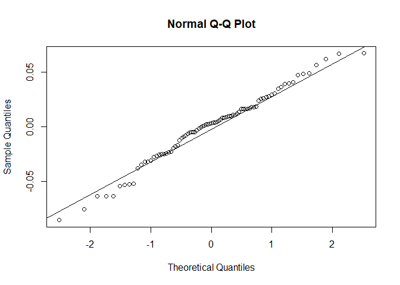<!-- -->

```
##                                2.5 %      97.5 %
## .sig01                  0.0000000000 0.025406546
## .sigma                  0.0288597924 0.040794032
## (Intercept)             0.8361768704 0.856752405
## Treatment1              0.0217038723 0.036908167
## Population1            -0.0125893115 0.008004342
## Treatment1:Population1 -0.0006520938 0.014552981
```

``` r
RWC_anov_21 <- do_anov(RWC_lm_21)
```

```
## Type III Analysis of Variance Table with Satterthwaite's method
##                        Sum Sq  Mean Sq NumDF  DenDF F value          Pr(>F)    
## Treatment            0.067694 0.067694     1 67.475 56.9929 0.0000000001503 ***
## Population           0.000208 0.000208     1 15.420  0.1751         0.68135    
## Treatment:Population 0.003832 0.003832     1 67.475  3.2264         0.07694 .  
## ---
## Signif. codes:  0 '***' 0.001 '**' 0.01 '*' 0.05 '.' 0.1 ' ' 1
```

``` r
RWC_anov_21$trait <- "RWC"
RWC_means_21 <- get_table(RWC_lm_21)
#no interaction (well, weak)
```

There is a weak interaction, so do posthoc analyses.


``` r
# belm
as.data.frame(summary(lmer(RWC ~ Treatment + (1|Population:Line), data = subset(Dat_2021_TwoTrt, Population == "BELM")))$coefficients) 
```

```
##               Estimate Std. Error        df   t value          Pr(>|t|)
## (Intercept) 0.84390921 0.01003779  4.877206 84.073231 0.000000006704119
## Treatment1  0.03647665 0.00588689 25.095540  6.196251 0.000001734012097
```

``` r
#roda
as.data.frame(summary(lmer(RWC ~ Treatment + (1|Population:Line), data = subset(Dat_2021_TwoTrt, Population == "RODA")))$coefficients)
```

```
##               Estimate  Std. Error       df    t value     Pr(>|t|)
## (Intercept) 0.84827088 0.005861524 10.93237 144.718498 2.689577e-19
## Treatment1  0.02235734 0.004885940 41.20520   4.575853 4.301726e-05
```

``` r
#cur
as.data.frame(summary(lmer(RWC ~ Population + (1|Population:Line), data = subset(Dat_2021_TwoTrt, Treatment == "Current")))$coefficients) 
```

```
##                Estimate  Std. Error       df    t value     Pr(>|t|)
## (Intercept) 0.874825759 0.006206274 9.397954 140.958280 6.000920e-17
## Population1 0.004618076 0.006206274 9.397954   0.744098 4.750103e-01
```

``` r
#fut
as.data.frame(summary(lmer(RWC ~ Population + (1|Population:Line), data = subset(Dat_2021_TwoTrt, Treatment == "Future")))$coefficients)
```

```
##                 Estimate  Std. Error       df   t value     Pr(>|t|)
## (Intercept)  0.817418534 0.006738096 11.10463 121.31299 1.075719e-18
## Population1 -0.008748203 0.006738096 11.10463  -1.29832 2.204937e-01
```

### Leaf Number
Note that Basia is potentially interested in looking at growth curves or leaf number changes over time wth a shade or photoperiod response but would also probably be interested in a temperature response but I should do a bit more literature searching on that if we go that route. but that is all to say that all these leaf number traits could be the basis of why she does that, and I could go back and see what Tori did too.
 
leaf num at 4 weeks
no post hoc analyses because not in paper

``` r
# Leaf Num 7/22/21 - a little under 5 weeks post planting on 6/19/2022 - 4 weeks post moving to the chambers on 6/24
LN_PreVern_lm_21 <- do_lmer(Dat_2021_TwoTrt$LeafNum_.07222021)
```

<!-- -->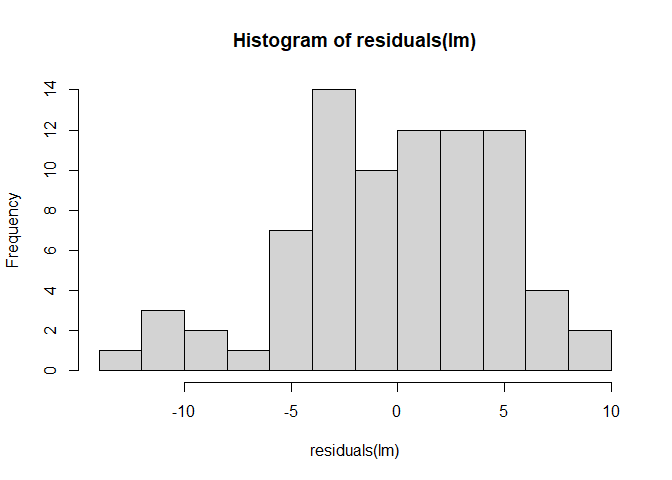<!-- -->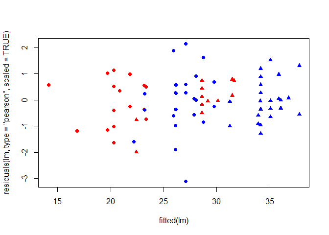<!-- -->

```
## [1] "the number of complete cases is 100"
```

```
## Linear mixed model fit by REML. t-tests use Satterthwaite's method [
## lmerModLmerTest]
## Formula: trait ~ Treatment * Population + (1 | Population:Line)
##    Data: data
## 
## REML criterion at convergence: 463
## 
## Scaled residuals: 
##     Min      1Q  Median      3Q     Max 
## -3.6198 -0.1407  0.1878  0.5052  1.5872 
## 
## Random effects:
##  Groups          Name        Variance Std.Dev.
##  Population:Line (Intercept) 3.613    1.901   
##  Residual                    4.463    2.113   
## Number of obs: 100, groups:  Population:Line, 21
## 
## Fixed effects:
##                        Estimate Std. Error       df t value      Pr(>|t|)    
## (Intercept)             5.37119    0.48702 18.47556  11.029 0.00000000145 ***
## Treatment1             -1.01250    0.21561 76.62921  -4.696 0.00001142105 ***
## Population1            -0.02693    0.48702 18.47556  -0.055         0.956    
## Treatment1:Population1 -0.16250    0.21561 76.62921  -0.754         0.453    
## ---
## Signif. codes:  0 '***' 0.001 '**' 0.01 '*' 0.05 '.' 0.1 ' ' 1
## 
## Correlation of Fixed Effects:
##             (Intr) Trtmn1 Ppltn1
## Treatment1  0.000               
## Population1 0.244  0.000        
## Trtmnt1:Pp1 0.000  0.200  0.000
```

```
## Computing profile confidence intervals ...
```

<!-- -->

```
##                             2.5 %     97.5 %
## .sig01                  1.1510388  2.7019195
## .sigma                  1.7980875  2.4607102
## (Intercept)             4.4201712  6.3224854
## Treatment1             -1.4349754 -0.5900246
## Population1            -0.9786447  0.9236755
## Treatment1:Population1 -0.5849754  0.2599754
```

``` r
LN_PreVern_anov_21 <- do_anov(LN_PreVern_lm_21)
```

```
## Type III Analysis of Variance Table with Satterthwaite's method
##                      Sum Sq Mean Sq NumDF  DenDF F value     Pr(>F)    
## Treatment            98.415  98.415     1 76.629 22.0524 0.00001142 ***
## Population            0.014   0.014     1 18.476  0.0031     0.9565    
## Treatment:Population  2.535   2.535     1 76.629  0.5680     0.4534    
## ---
## Signif. codes:  0 '***' 0.001 '**' 0.01 '*' 0.05 '.' 0.1 ' ' 1
```

``` r
LN_PreVern_anov_21$trait <- "LeafNum_4wks"
LN_PreVern_means_21 <- get_table(LN_PreVern_lm_21)
# no interaction
# diagonal lines in residual plot are artifact of discrete trait. none in left corner is indicative of zeros.
# double check that residual lines all have same value
lm <- lmer(LeafNum_.07222021 ~ Treatment * Population + (1|Population:Line) , data = Dat_2021_TwoTrt, contrasts = list(Treatment=contr.sum, Population = contr.sum))

plot(fitted(lm), residuals(lm, type = "pearson", scaled = TRUE),
       col = c("red", "blue")[as.numeric(Dat_2021_TwoTrt$Population)],
       pch = c(16, 15, 17)[as.numeric(Dat_2021_TwoTrt$Treatment)])
legend("topleft", legend = c("Italy", "Sweden"), col = c("red", "blue"), pch = 16)
legend("topright", legend = c("Current", "Future"), col = "black", pch = c(16,17))
text(fitted(lm), residuals(lm, type = "pearson", scaled = TRUE)-0.15, labels = Dat_2021_TwoTrt$LeafNum_.07222021, cex = 0.7)
```

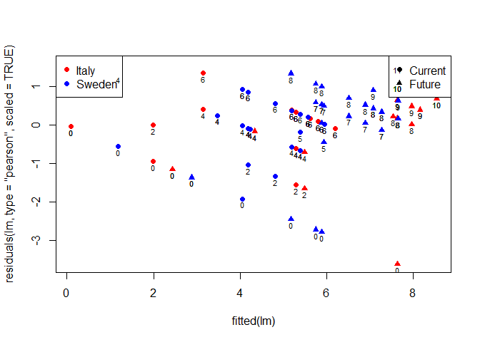<!-- -->

Leaf num 5 weeks into vernalization
no post hoc analyses because not in paper

``` r
# LeafNumber from 08262021 - 5 weeks into vernalization... why did I choose this date? I think I was thinning on this day?
LN_Vern_lm_21 <- do_lmer(Dat_2021_TwoTrt$LeafNum_08262021)
```

<!-- -->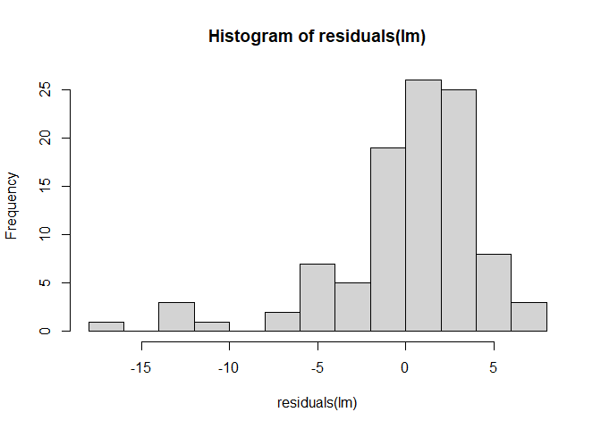<!-- -->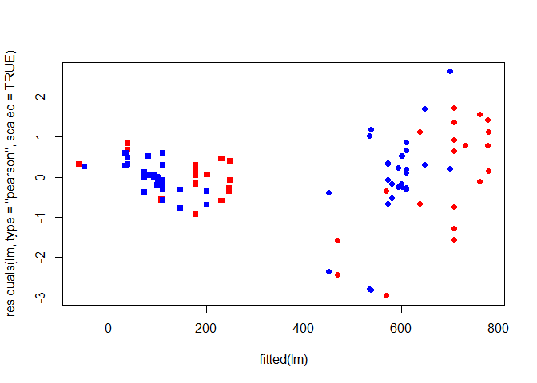<!-- -->

```
## [1] "the number of complete cases is 100"
```

```
## Linear mixed model fit by REML. t-tests use Satterthwaite's method [
## lmerModLmerTest]
## Formula: trait ~ Treatment * Population + (1 | Population:Line)
##    Data: data
## 
## REML criterion at convergence: 624
## 
## Scaled residuals: 
##     Min      1Q  Median      3Q     Max 
## -3.4782 -0.2605  0.1347  0.6310  1.4455 
## 
## Random effects:
##  Groups          Name        Variance Std.Dev.
##  Population:Line (Intercept) 23.1     4.806   
##  Residual                    23.1     4.806   
## Number of obs: 100, groups:  Population:Line, 21
## 
## Fixed effects:
##                        Estimate Std. Error      df t value      Pr(>|t|)    
## (Intercept)             12.3952     1.2046 18.5942  10.290 0.00000000413 ***
## Treatment1              -1.6042     0.4905 76.6794  -3.270       0.00161 ** 
## Population1             -0.2598     1.2046 18.5942  -0.216       0.83160    
## Treatment1:Population1   0.2292     0.4905 76.6794   0.467       0.64171    
## ---
## Signif. codes:  0 '***' 0.001 '**' 0.01 '*' 0.05 '.' 0.1 ' ' 1
## 
## Correlation of Fixed Effects:
##             (Intr) Trtmn1 Ppltn1
## Treatment1  0.000               
## Population1 0.244  0.000        
## Trtmnt1:Pp1 0.000  0.200  0.000
```

```
## Computing profile confidence intervals ...
```

<!-- -->

```
##                             2.5 %     97.5 %
## .sig01                  3.0323874  6.7525736
## .sigma                  4.0909672  5.5975373
## (Intercept)            10.0435491 14.7486009
## Treatment1             -2.5653036 -0.6430297
## Population1            -2.6127788  2.0922604
## Treatment1:Population1 -0.7319703  1.1903036
```

``` r
LN_Vern_anov_21 <- do_anov(LN_Vern_lm_21)
```

```
## Type III Analysis of Variance Table with Satterthwaite's method
##                       Sum Sq Mean Sq NumDF  DenDF F value   Pr(>F)   
## Treatment            247.042 247.042     1 76.679 10.6939 0.001611 **
## Population             1.074   1.074     1 18.594  0.0465 0.831602   
## Treatment:Population   5.042   5.042     1 76.679  0.2182 0.641707   
## ---
## Signif. codes:  0 '***' 0.001 '**' 0.01 '*' 0.05 '.' 0.1 ' ' 1
```

``` r
LN_Vern_anov_21$trait <- "LeafNum_9wks"
LN_Vern_means_21 <- get_table(LN_Vern_lm_21)
# no interaction
```

Leaf num about when bolting started
no post hoc analyses becuase not in paper - not at a constant developmental stage

``` r
# Leaf Num October 4 - picked this day because was about when bolting started but some had already bolted by this day
LN_PostVern_lm_21 <- do_lmer(Dat_2021_TwoTrt$RosetteLeafNum_10042021)
```

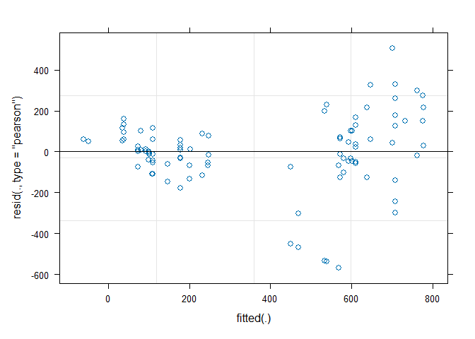<!-- -->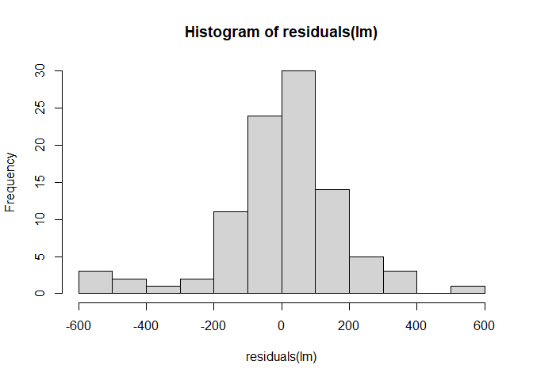<!-- -->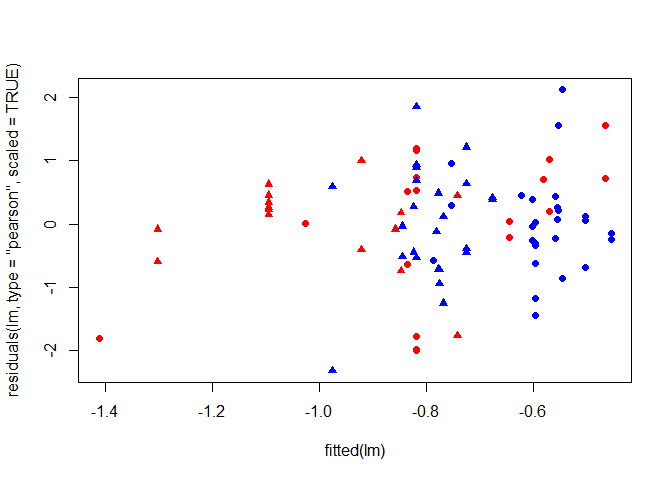<!-- -->

```
## [1] "the number of complete cases is 86"
```

```
## Linear mixed model fit by REML. t-tests use Satterthwaite's method [
## lmerModLmerTest]
## Formula: trait ~ Treatment * Population + (1 | Population:Line)
##    Data: data
## 
## REML criterion at convergence: 469.1
## 
## Scaled residuals: 
##      Min       1Q   Median       3Q      Max 
## -3.11105 -0.53300 -0.01163  0.57750  2.13867 
## 
## Random effects:
##  Groups          Name        Variance Std.Dev.
##  Population:Line (Intercept)  8.757   2.959   
##  Residual                    10.486   3.238   
## Number of obs: 86, groups:  Population:Line, 21
## 
## Fixed effects:
##                        Estimate Std. Error       df t value Pr(>|t|)    
## (Intercept)            27.32958    0.78550 15.04734  34.792 8.54e-16 ***
## Treatment1             -4.07342    0.36855 62.59267 -11.053 2.38e-16 ***
## Population1            -3.16379    0.78550 15.04734  -4.028  0.00109 ** 
## Treatment1:Population1 -0.07216    0.36855 62.59267  -0.196  0.84541    
## ---
## Signif. codes:  0 '***' 0.001 '**' 0.01 '*' 0.05 '.' 0.1 ' ' 1
## 
## Correlation of Fixed Effects:
##             (Intr) Trtmn1 Ppltn1
## Treatment1  -0.062              
## Population1  0.264 -0.033       
## Trtmnt1:Pp1 -0.033  0.253 -0.062
```

```
## Computing profile confidence intervals ...
```

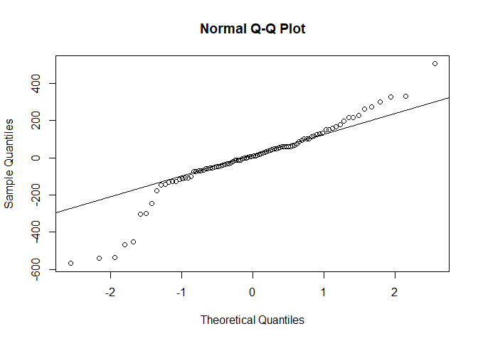<!-- -->

```
##                             2.5 %     97.5 %
## .sig01                  1.4705541  4.3801870
## .sigma                  2.7035639  3.8702438
## (Intercept)            25.7534651 28.8407528
## Treatment1             -4.8033806 -3.3553464
## Population1            -4.7075398 -1.6381721
## Treatment1:Population1 -0.7934106  0.6538245
```

``` r
LN_PostVern_anov_21 <- do_anov(LN_PostVern_lm_21)
```

```
## Type III Analysis of Variance Table with Satterthwaite's method
##                       Sum Sq Mean Sq NumDF  DenDF  F value    Pr(>F)    
## Treatment            1281.03 1281.03     1 62.593 122.1611 2.382e-16 ***
## Population            170.12  170.12     1 15.047  16.2226  0.001089 ** 
## Treatment:Population    0.40    0.40     1 62.593   0.0383  0.845411    
## ---
## Signif. codes:  0 '***' 0.001 '**' 0.01 '*' 0.05 '.' 0.1 ' ' 1
```

``` r
LN_PostVern_anov_21$trait <- "LeafNum_14wks"
LN_PostVern_means_21 <- get_table(LN_PostVern_lm_21)
# no interaction
```


Leaf number at bolting and flower were only doneo n some plants, not all (bolting only for SW plants and flowering only for 16 plants), so there are no models or figures for these traits.


Leaf num at harvest

``` r
# LN at harvest - from all plants - not sure totally accurate count because hard to count at this point in life cycle
LN_harv_lm_21 <- do_lmer(Dat_2021_TwoTrt$RosetteLeafNum)
```

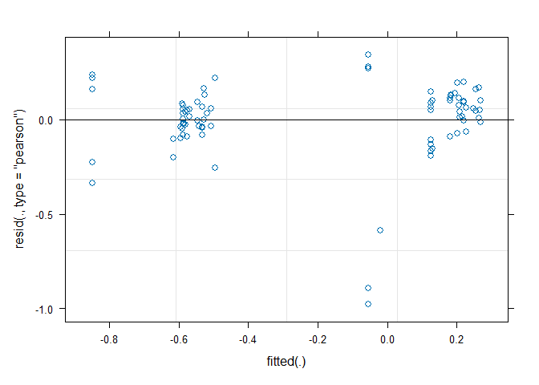<!-- -->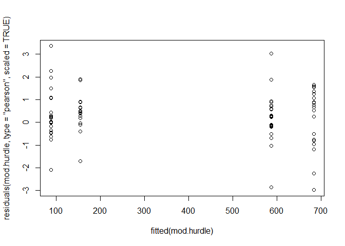<!-- -->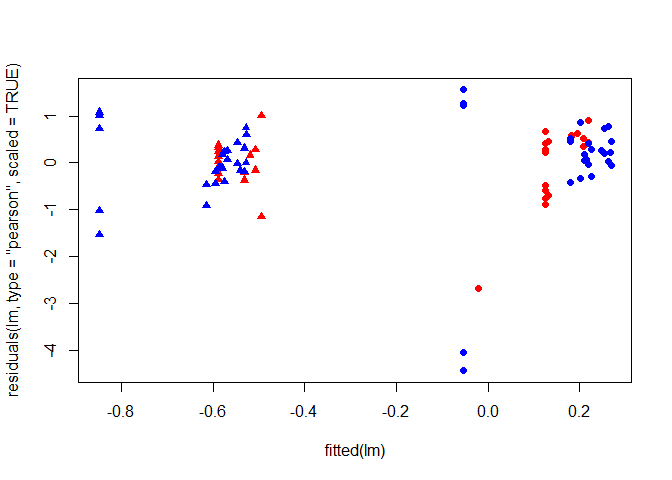<!-- -->

```
## [1] "the number of complete cases is 85"
```

```
## Linear mixed model fit by REML. t-tests use Satterthwaite's method [
## lmerModLmerTest]
## Formula: trait ~ Treatment * Population + (1 | Population:Line)
##    Data: data
## 
## REML criterion at convergence: 482.6
## 
## Scaled residuals: 
##     Min      1Q  Median      3Q     Max 
## -1.7089 -0.5071 -0.0334  0.5976  3.1975 
## 
## Random effects:
##  Groups          Name        Variance Std.Dev.
##  Population:Line (Intercept) 15.95    3.994   
##  Residual                    12.25    3.499   
## Number of obs: 85, groups:  Population:Line, 21
## 
## Fixed effects:
##                        Estimate Std. Error      df t value Pr(>|t|)    
## (Intercept)             28.3584     1.0086 16.5638  28.116 2.05e-15 ***
## Treatment1              -4.6312     0.4016 62.3690 -11.532  < 2e-16 ***
## Population1             -4.3791     1.0086 16.5638  -4.342 0.000469 ***
## Treatment1:Population1   0.4442     0.4016 62.3690   1.106 0.272946    
## ---
## Signif. codes:  0 '***' 0.001 '**' 0.01 '*' 0.05 '.' 0.1 ' ' 1
## 
## Correlation of Fixed Effects:
##             (Intr) Trtmn1 Ppltn1
## Treatment1  -0.053              
## Population1  0.257 -0.034       
## Trtmnt1:Pp1 -0.034  0.245 -0.053
```

```
## Computing profile confidence intervals ...
```

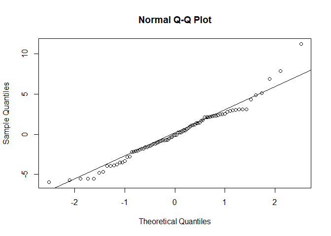<!-- -->

```
##                             2.5 %    97.5 %
## .sig01                  2.3943057  5.699256
## .sigma                  2.9198477  4.167205
## (Intercept)            26.3547018 30.305366
## Treatment1             -5.4293029 -3.851771
## Population1            -6.3669344 -2.424450
## Treatment1:Population1 -0.3458082  1.229091
```

``` r
LN_harv_anov_21 <- do_anov(LN_harv_lm_21)
```

```
## Type III Analysis of Variance Table with Satterthwaite's method
##                       Sum Sq Mean Sq NumDF  DenDF  F value    Pr(>F)    
## Treatment            1628.54 1628.54     1 62.369 132.9939 < 2.2e-16 ***
## Population            230.83  230.83     1 16.564  18.8505 0.0004686 ***
## Treatment:Population   14.98   14.98     1 62.369   1.2234 0.2729462    
## ---
## Signif. codes:  0 '***' 0.001 '**' 0.01 '*' 0.05 '.' 0.1 ' ' 1
```

``` r
LN_harv_anov_21$trait <- "LeafNum_harvest"
LN_harv_means_21 <- get_table(LN_harv_lm_21)
# no interaction
```

No interaction but run individual models to check for difference in future environment

``` r
# belm
as.data.frame(summary(lmer(RosetteLeafNum ~ Treatment + (1|Population:Line), data = subset(Dat_2021_TwoTrt, Population == "BELM")))$coefficients) 
```

```
##              Estimate Std. Error        df   t value       Pr(>|t|)
## (Intercept) 23.798378  2.2664067  6.456598 10.500488 0.000026988960
## Treatment1  -4.146016  0.6769811 24.376617 -6.124272 0.000002350653
```

``` r
#roda
as.data.frame(summary(lmer(RosetteLeafNum ~ Treatment + (1|Population:Line), data = subset(Dat_2021_TwoTrt, Population == "RODA")))$coefficients)
```

```
##              Estimate Std. Error       df   t value     Pr(>|t|)
## (Intercept) 32.793037  0.8290926 10.85513  39.55293 4.390346e-13
## Treatment1  -5.108005  0.4694502 38.85865 -10.88082 2.327865e-13
```

``` r
#cur
as.data.frame(summary(lmer(RosetteLeafNum ~ Population + (1|Population:Line), data = subset(Dat_2021_TwoTrt, Treatment == "Current")))$coefficients) 
```

```
##              Estimate Std. Error       df   t value     Pr(>|t|)
## (Intercept) 24.100939   1.208588 17.43232 19.941401 1.918953e-13
## Population1 -3.798948   1.208588 17.43232 -3.143294 5.789537e-03
```

``` r
#fut
as.data.frame(summary(lmer(RosetteLeafNum ~ Population + (1|Population:Line), data = subset(Dat_2021_TwoTrt, Treatment == "Future")))$coefficients)
```

```
##              Estimate Std. Error       df   t value     Pr(>|t|)
## (Intercept) 33.374512  0.9868071 15.62265 33.820704 4.893622e-16
## Population1 -4.475532  0.9868071 15.62265 -4.535367 3.577479e-04
```

### Biomass

Any biomass traits and biomass allocation

Rosette biomass

``` r
# dry rosette biomass
Ros_lm_21 <- do_lmer(Dat_2021_TwoTrt$l10_DryRosG)
```

<!-- -->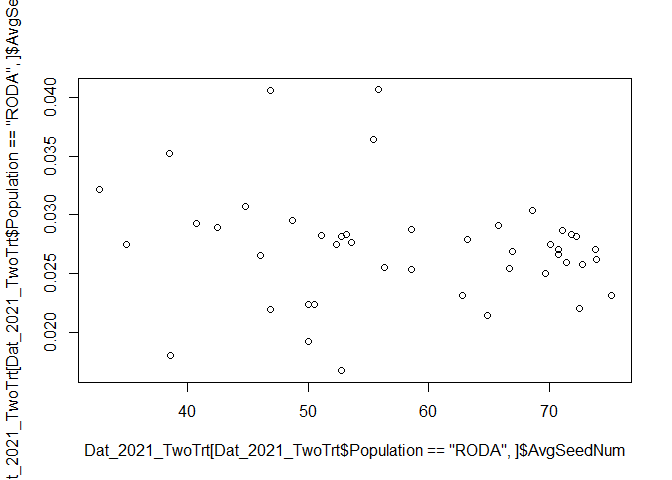<!-- -->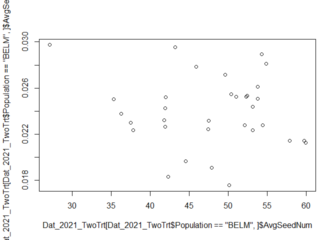<!-- -->

```
## [1] "the number of complete cases is 83"
```

```
## Linear mixed model fit by REML. t-tests use Satterthwaite's method [
## lmerModLmerTest]
## Formula: trait ~ Treatment * Population + (1 | Population:Line)
##    Data: data
## 
## REML criterion at convergence: -32.5
## 
## Scaled residuals: 
##      Min       1Q   Median       3Q      Max 
## -2.32003 -0.48565  0.06503  0.50362  2.11980 
## 
## Random effects:
##  Groups          Name        Variance Std.Dev.
##  Population:Line (Intercept) 0.04629  0.2152  
##  Residual                    0.01826  0.1351  
## Number of obs: 83, groups:  Population:Line, 21
## 
## Fixed effects:
##                        Estimate Std. Error       df t value Pr(>|t|)    
## (Intercept)            -0.81541    0.05176 14.88376 -15.752 1.09e-10 ***
## Treatment1              0.12474    0.01573 57.45863   7.929 8.56e-11 ***
## Population1            -0.11676    0.05176 14.88376  -2.256   0.0396 *  
## Treatment1:Population1  0.01364    0.01573 57.45863   0.867   0.3894    
## ---
## Signif. codes:  0 '***' 0.001 '**' 0.01 '*' 0.05 '.' 0.1 ' ' 1
## 
## Correlation of Fixed Effects:
##             (Intr) Trtmn1 Ppltn1
## Treatment1  -0.048              
## Population1  0.243 -0.023       
## Trtmnt1:Pp1 -0.023  0.224 -0.048
```

```
## Computing profile confidence intervals ...
```

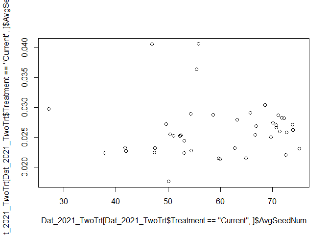<!-- -->

```
##                              2.5 %      97.5 %
## .sig01                  0.13099090  0.30303367
## .sigma                  0.11221853  0.16274272
## (Intercept)            -0.91853109 -0.71548607
## Treatment1              0.09283174  0.15512139
## Population1            -0.21915936 -0.01646753
## Treatment1:Population1 -0.01782677  0.04418726
```

``` r
Ros_anov_21 <- do_anov(Ros_lm_21)
```

```
## Type III Analysis of Variance Table with Satterthwaite's method
##                       Sum Sq Mean Sq NumDF  DenDF F value    Pr(>F)    
## Treatment            1.14817 1.14817     1 57.459 62.8714 8.555e-11 ***
## Population           0.09291 0.09291     1 14.884  5.0876   0.03959 *  
## Treatment:Population 0.01374 0.01374     1 57.459  0.7522   0.38939    
## ---
## Signif. codes:  0 '***' 0.001 '**' 0.01 '*' 0.05 '.' 0.1 ' ' 1
```

``` r
Ros_anov_21$trait <- "l10_DryRosG"
Ros_means_21 <- get_table_bt(Ros_lm_21)
#no interaction

## check how it compares to the sqr transformed
#Ros_lm_21SR <- do_lmer(Dat_2021_TwoTrt$SQR_DryRosG)
#Ros_anov_21SR <- do_anov(Ros_lm_21SR)
#Ros_anov_21SR$trait <- "SQR_DryRosG"
#Ros_means_21SR <- get_table_bt(Ros_lm_21SR)
## commented out b/c no difference in signficance levels.
```

No interaction but run individual models to test for a difference in the future environment

``` r
# belm
as.data.frame(summary(lmer(l10_DryRosG ~ Treatment + (1|Population:Line), data = subset(Dat_2021_TwoTrt, Population == "BELM")))$coefficients) 
```

```
##               Estimate Std. Error        df   t value      Pr(>|t|)
## (Intercept) -0.9450861  0.1337465  6.317965 -7.066251 0.00031944179
## Treatment1   0.1427030  0.0256780 23.670773  5.557401 0.00001071027
```

``` r
#roda
as.data.frame(summary(lmer(l10_DryRosG ~ Treatment + (1|Population:Line), data = subset(Dat_2021_TwoTrt, Population == "RODA")))$coefficients)
```

```
##               Estimate Std. Error        df    t value           Pr(>|t|)
## (Intercept) -0.6894729 0.02593595  8.868167 -26.583676 0.0000000009184363
## Treatment1   0.1072855 0.01865639 36.899676   5.750605 0.0000013791302849
```

``` r
#cur
as.data.frame(summary(lmer(l10_DryRosG ~ Population + (1|Population:Line), data = subset(Dat_2021_TwoTrt, Treatment == "Current")))$coefficients) 
```

```
##               Estimate Std. Error       df    t value          Pr(>|t|)
## (Intercept) -0.6753367 0.05731776 16.31923 -11.782329 0.000000002137811
## Population1 -0.1020605 0.05731776 16.31923  -1.780609 0.093598610230065
```

``` r
#fut
as.data.frame(summary(lmer(l10_DryRosG ~ Population + (1|Population:Line), data = subset(Dat_2021_TwoTrt, Treatment == "Future")))$coefficients)
```

```
##                Estimate Std. Error       df    t value     Pr(>|t|)
## (Intercept) -0.89361068 0.03938445 14.65358 -22.689430 7.990348e-13
## Population1 -0.08982352 0.03938445 14.65358  -2.280685 3.797752e-02
```


Reproductive biomass

``` r
# dry reproductive biomass
Repro_lm_21 <- do_lmer(Dat_2021_TwoTrt$l10_DryReproG)
```

<!-- -->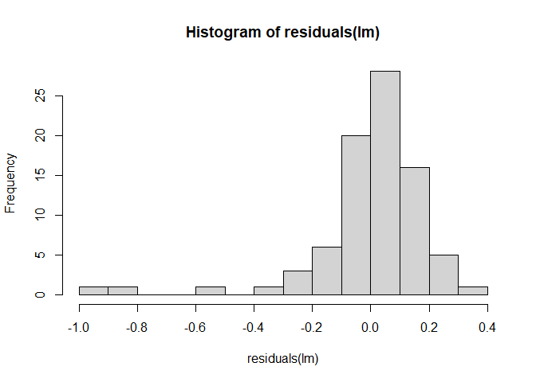<!-- --><!-- -->

```
## [1] "the number of complete cases is 83"
```

```
## Linear mixed model fit by REML. t-tests use Satterthwaite's method [
## lmerModLmerTest]
## Formula: trait ~ Treatment * Population + (1 | Population:Line)
##    Data: data
## 
## REML criterion at convergence: 16.2
## 
## Scaled residuals: 
##     Min      1Q  Median      3Q     Max 
## -4.4254 -0.2092  0.1804  0.4597  1.5550 
## 
## Random effects:
##  Groups          Name        Variance Std.Dev.
##  Population:Line (Intercept) 0.01379  0.1174  
##  Residual                    0.04880  0.2209  
## Number of obs: 83, groups:  Population:Line, 21
## 
## Fixed effects:
##                        Estimate Std. Error       df t value  Pr(>|t|)    
## (Intercept)            -0.20172    0.03813 19.77693  -5.290 0.0000367 ***
## Treatment1              0.37715    0.02519 67.38359  14.970   < 2e-16 ***
## Population1            -0.01000    0.03813 19.77693  -0.262     0.796    
## Treatment1:Population1 -0.02013    0.02519 67.38359  -0.799     0.427    
## ---
## Signif. codes:  0 '***' 0.001 '**' 0.01 '*' 0.05 '.' 0.1 ' ' 1
## 
## Correlation of Fixed Effects:
##             (Intr) Trtmn1 Ppltn1
## Treatment1  -0.055              
## Population1  0.263 -0.049       
## Trtmnt1:Pp1 -0.049  0.216 -0.055
```

```
## Computing profile confidence intervals ...
```

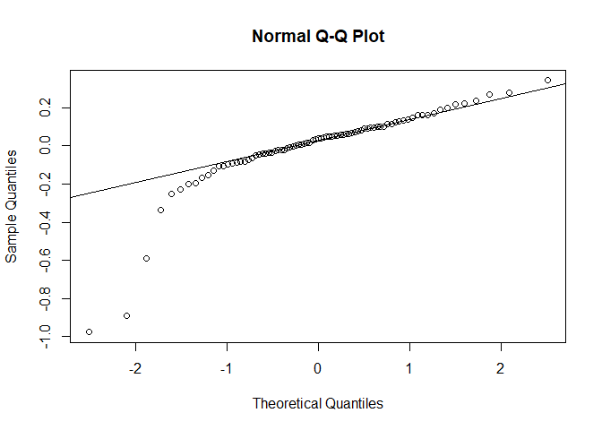<!-- -->

```
##                              2.5 %      97.5 %
## .sig01                  0.04813853  0.18930847
## .sigma                  0.18460378  0.25951873
## (Intercept)            -0.27637168 -0.12774696
## Treatment1              0.32733389  0.42585366
## Population1            -0.08736629  0.06341489
## Treatment1:Population1 -0.06984545  0.02862048
```

``` r
Repro_anov_21 <- do_anov(Repro_lm_21)
```

```
## Type III Analysis of Variance Table with Satterthwaite's method
##                       Sum Sq Mean Sq NumDF  DenDF  F value Pr(>F)    
## Treatment            10.9358 10.9358     1 67.384 224.1077 <2e-16 ***
## Population            0.0034  0.0034     1 19.777   0.0688 0.7959    
## Treatment:Population  0.0312  0.0312     1 67.384   0.6385 0.4270    
## ---
## Signif. codes:  0 '***' 0.001 '**' 0.01 '*' 0.05 '.' 0.1 ' ' 1
```

``` r
Repro_anov_21$trait <- "l10_DryReproG"
Repro_means_21 <- get_table_bt(Repro_lm_21)
```

No interaction but run individual models to test for a difference in the future environment

``` r
# belm
as.data.frame(summary(lmer(l10_DryReproG ~ Treatment + (1|Population:Line), data = subset(Dat_2021_TwoTrt, Population == "BELM")))$coefficients) 
```

```
##               Estimate Std. Error        df   t value     Pr(>|t|)
## (Intercept) -0.2538158 0.09644543  5.515782 -2.631703 4.221342e-02
## Treatment1   0.3732317 0.02314503 22.935904 16.125781 5.242662e-14
```

``` r
#roda
as.data.frame(summary(lmer(l10_DryReproG ~ Treatment + (1|Population:Line), data = subset(Dat_2021_TwoTrt, Population == "RODA")))$coefficients)
```

```
##               Estimate Std. Error       df   t value     Pr(>|t|)
## (Intercept) -0.1943989 0.04917490 17.98688 -3.953213 9.332138e-04
## Treatment1   0.3971901 0.03568424 42.63098 11.130687 3.404316e-14
```

``` r
#cur
as.data.frame(summary(lmer(l10_DryReproG ~ Population + (1|Population:Line), data = subset(Dat_2021_TwoTrt, Treatment == "Current")))$coefficients) 
```

```
##               Estimate Std. Error       df    t value    Pr(>|t|)
## (Intercept)  0.1733283 0.05526152 21.33609  3.1365101 0.004919434
## Population1 -0.0258151 0.05526152 21.33609 -0.4671442 0.645132201
```

``` r
#fut
as.data.frame(summary(lmer(l10_DryReproG ~ Population + (1|Population:Line), data = subset(Dat_2021_TwoTrt, Treatment == "Future")))$coefficients)
```

```
##                Estimate Std. Error       df    t value     Pr(>|t|)
## (Intercept) -0.57527688 0.03063599 18.61136 -18.777815 1.497231e-13
## Population1  0.02835364 0.03063599 18.61136   0.925501 3.665513e-01
```


Above ground biomass (rosette + reproductive)
no post hoc analyses because not in paper

``` r
# dry above ground biomass (ros + repro)
AG_lm_21 <- do_lmer(Dat_2021_TwoTrt$l10_AG_biomass)
```

<!-- -->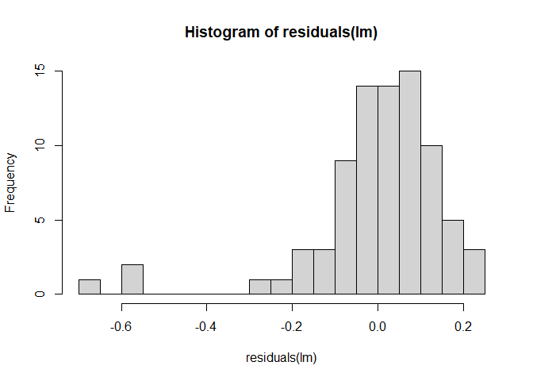<!-- -->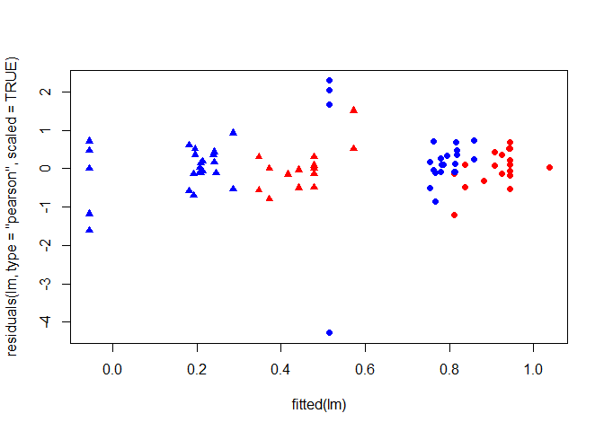<!-- -->

```
## [1] "the number of complete cases is 81"
```

```
## Linear mixed model fit by REML. t-tests use Satterthwaite's method [
## lmerModLmerTest]
## Formula: trait ~ Treatment * Population + (1 | Population:Line)
##    Data: data
## 
## REML criterion at convergence: -20.8
## 
## Scaled residuals: 
##     Min      1Q  Median      3Q     Max 
## -3.8186 -0.2876  0.1331  0.5642  1.3681 
## 
## Random effects:
##  Groups          Name        Variance Std.Dev.
##  Population:Line (Intercept) 0.01124  0.1060  
##  Residual                    0.02904  0.1704  
## Number of obs: 81, groups:  Population:Line, 21
## 
## Fixed effects:
##                         Estimate Std. Error        df t value Pr(>|t|)    
## (Intercept)            -0.083573   0.032314 11.281868  -2.586   0.0249 *  
## Treatment1              0.322743   0.019665 56.420512  16.412   <2e-16 ***
## Population1            -0.036682   0.032314 11.281868  -1.135   0.2799    
## Treatment1:Population1 -0.006954   0.019665 56.420512  -0.354   0.7250    
## ---
## Signif. codes:  0 '***' 0.001 '**' 0.01 '*' 0.05 '.' 0.1 ' ' 1
## 
## Correlation of Fixed Effects:
##             (Intr) Trtmn1 Ppltn1
## Treatment1  -0.057              
## Population1  0.247 -0.043       
## Trtmnt1:Pp1 -0.043  0.196 -0.057
```

```
## Computing profile confidence intervals ...
```

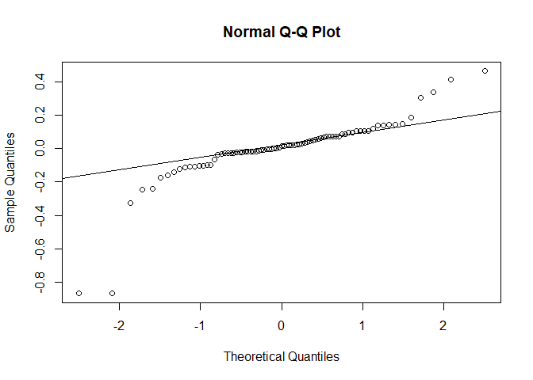<!-- -->

```
##                              2.5 %      97.5 %
## .sig01                  0.02402241  0.17986084
## .sigma                  0.14066799  0.20509850
## (Intercept)            -0.14934651 -0.02158573
## Treatment1              0.28250753  0.36054440
## Population1            -0.10397576  0.02516996
## Treatment1:Population1 -0.04662350  0.03105821
```

``` r
AG_anov_21 <- do_anov(AG_lm_21)
```

```
## Type III Analysis of Variance Table with Satterthwaite's method
##                      Sum Sq Mean Sq NumDF  DenDF  F value Pr(>F)    
## Treatment            7.8223  7.8223     1 56.421 269.3511 <2e-16 ***
## Population           0.0374  0.0374     1 11.282   1.2886 0.2799    
## Treatment:Population 0.0036  0.0036     1 56.421   0.1250 0.7250    
## ---
## Signif. codes:  0 '***' 0.001 '**' 0.01 '*' 0.05 '.' 0.1 ' ' 1
```

``` r
AG_anov_21$trait <- "l10_AG_biomass"
AG_means_21 <- get_table_bt(AG_lm_21)
```

Skipping dry root biomass because only have for a few plants. Also skipping root to shoot for the same reason.

Above ground biomass allocation (repro/ros)

``` r
# reproductive biomass divided by rosette biomass - above ground biomass allocation
RR_lm_21 <- do_lmer(Dat_2021_TwoTrt$l10_R_to_R)
```

<!-- --><!-- -->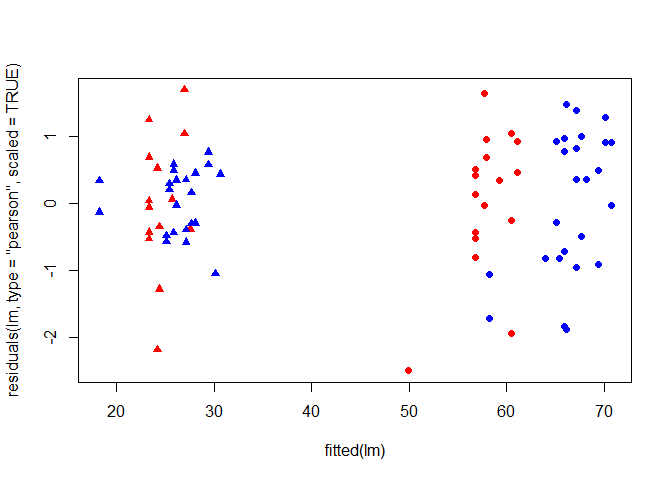<!-- -->

```
## [1] "the number of complete cases is 81"
```

```
## Linear mixed model fit by REML. t-tests use Satterthwaite's method [
## lmerModLmerTest]
## Formula: trait ~ Treatment * Population + (1 | Population:Line)
##    Data: data
## 
## REML criterion at convergence: 3.7
## 
## Scaled residuals: 
##     Min      1Q  Median      3Q     Max 
## -4.2794 -0.1430  0.0724  0.3559  2.2872 
## 
## Random effects:
##  Groups          Name        Variance Std.Dev.
##  Population:Line (Intercept) 0.01253  0.1120  
##  Residual                    0.04114  0.2028  
## Number of obs: 81, groups:  Population:Line, 21
## 
## Fixed effects:
##                        Estimate Std. Error       df t value Pr(>|t|)    
## (Intercept)             0.58273    0.03597 23.48758  16.200 3.03e-14 ***
## Treatment1              0.25919    0.02335 67.96255  11.101  < 2e-16 ***
## Population1             0.09539    0.03597 23.48758   2.652   0.0141 *  
## Treatment1:Population1 -0.02667    0.02335 67.96255  -1.142   0.2574    
## ---
## Signif. codes:  0 '***' 0.001 '**' 0.01 '*' 0.05 '.' 0.1 ' ' 1
## 
## Correlation of Fixed Effects:
##             (Intr) Trtmn1 Ppltn1
## Treatment1  -0.057              
## Population1  0.246 -0.045       
## Trtmnt1:Pp1 -0.045  0.195 -0.057
```

```
## Computing profile confidence intervals ...
```

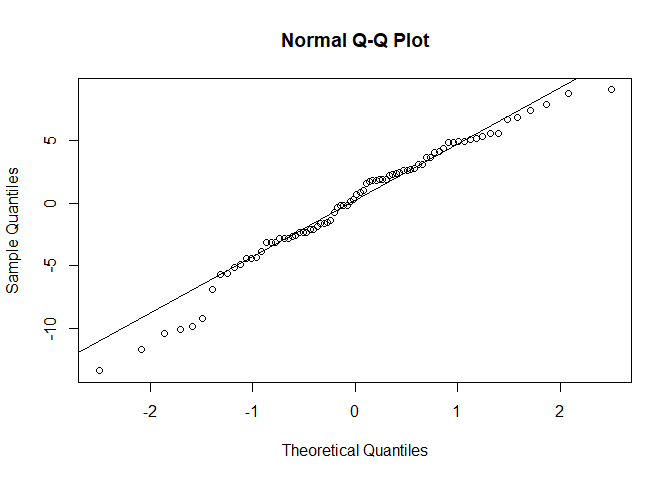<!-- -->

```
##                              2.5 %     97.5 %
## .sig01                  0.05442927 0.17132197
## .sigma                  0.16949169 0.23774067
## (Intercept)             0.51344796 0.65409911
## Treatment1              0.21376763 0.30469549
## Population1             0.02456477 0.16476723
## Treatment1:Population1 -0.07226191 0.01867931
```

``` r
RR_anov_21 <- do_anov(RR_lm_21)
```

```
## Type III Analysis of Variance Table with Satterthwaite's method
##                      Sum Sq Mean Sq NumDF  DenDF  F value  Pr(>F)    
## Treatment            5.0694  5.0694     1 67.963 123.2345 < 2e-16 ***
## Population           0.2893  0.2893     1 23.488   7.0321 0.01411 *  
## Treatment:Population 0.0537  0.0537     1 67.963   1.3048 0.25735    
## ---
## Signif. codes:  0 '***' 0.001 '**' 0.01 '*' 0.05 '.' 0.1 ' ' 1
```

``` r
RR_anov_21$trait <- "l10_Repro_to_Ros"
RR_means_21 <- get_table_bt(RR_lm_21)
```

No interaction but run individual models to test for a difference in the future environment

``` r
# belm
as.data.frame(summary(lmer(l10_R_to_R ~ Treatment + (1|Population:Line), data = subset(Dat_2021_TwoTrt, Population == "BELM")))$coefficients) 
```

```
##              Estimate Std. Error        df  t value     Pr(>|t|)
## (Intercept) 0.6843600 0.05156011  7.014174 13.27305 3.168369e-06
## Treatment1  0.2325074 0.01665276 25.056223 13.96209 2.524047e-13
```

``` r
#roda
as.data.frame(summary(lmer(l10_R_to_R ~ Treatment + (1|Population:Line), data = subset(Dat_2021_TwoTrt, Population == "RODA")))$coefficients)
```

```
##              Estimate Std. Error       df  t value           Pr(>|t|)
## (Intercept) 0.4825674 0.04947565 17.67570 9.753635 0.0000000155209100
## Treatment1  0.2861926 0.03621871 41.13943 7.901789 0.0000000008852199
```

``` r
#cur
as.data.frame(summary(lmer(l10_R_to_R ~ Population + (1|Population:Line), data = subset(Dat_2021_TwoTrt, Treatment == "Current")))$coefficients) 
```

```
##               Estimate Std. Error       df   t value     Pr(>|t|)
## (Intercept) 0.82790691 0.04594504 20.77846 18.019507 3.688761e-14
## Population1 0.08007398 0.04594504 20.77846  1.742821 9.614671e-02
```

``` r
#fut
as.data.frame(summary(lmer(l10_R_to_R ~ Population + (1|Population:Line), data = subset(Dat_2021_TwoTrt, Treatment == "Future")))$coefficients)
```

```
##              Estimate Std. Error       df  t value        Pr(>|t|)
## (Intercept) 0.3191850 0.03947755 16.65624 8.085229 0.0000003646979
## Population1 0.1221365 0.03947755 16.65624 3.093822 0.0067150146952
```


### Plant Structure
branches and height. Branch structure is about damage so skip. but maybe should be a random effect in other models?

Num lateral branches

``` r
# number of lateral branches
LatBranch_lm_21 <- do_lmer(Dat_2021_TwoTrt$LatBranches)
```

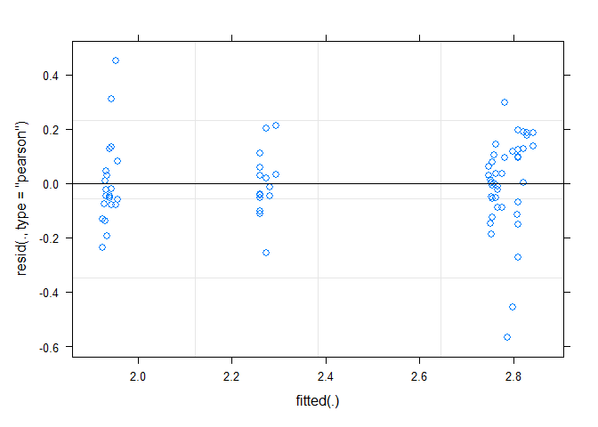<!-- -->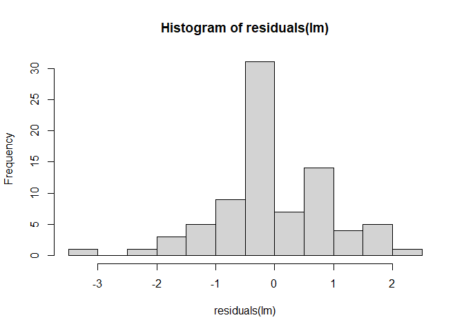<!-- -->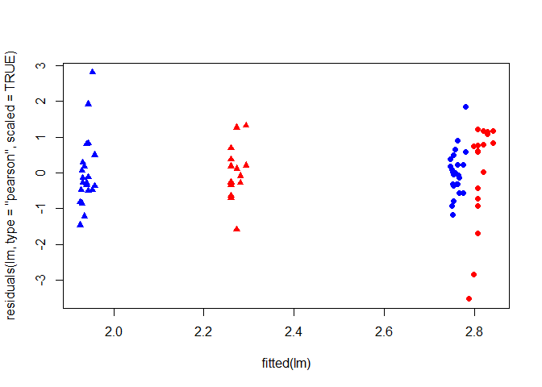<!-- -->

```
## [1] "the number of complete cases is 81"
```

```
## Linear mixed model fit by REML. t-tests use Satterthwaite's method [
## lmerModLmerTest]
## Formula: trait ~ Treatment * Population + (1 | Population:Line)
##    Data: data
## 
## REML criterion at convergence: 283.7
## 
## Scaled residuals: 
##      Min       1Q   Median       3Q      Max 
## -2.82972 -0.41908 -0.05185  0.48440  2.00082 
## 
## Random effects:
##  Groups          Name        Variance Std.Dev.
##  Population:Line (Intercept) 1.774    1.332   
##  Residual                    1.198    1.095   
## Number of obs: 81, groups:  Population:Line, 21
## 
## Fixed effects:
##                        Estimate Std. Error      df t value Pr(>|t|)    
## (Intercept)              8.7811     0.3325 15.4039  26.409 3.01e-14 ***
## Treatment1              -0.4042     0.1278 56.6333  -3.162  0.00252 ** 
## Population1             -0.5285     0.3325 15.4039  -1.589  0.13227    
## Treatment1:Population1  -0.6014     0.1278 56.6333  -4.705 1.68e-05 ***
## ---
## Signif. codes:  0 '***' 0.001 '**' 0.01 '*' 0.05 '.' 0.1 ' ' 1
## 
## Correlation of Fixed Effects:
##             (Intr) Trtmn1 Ppltn1
## Treatment1  -0.052              
## Population1  0.254 -0.031       
## Trtmnt1:Pp1 -0.031  0.205 -0.052
```

```
## Computing profile confidence intervals ...
```

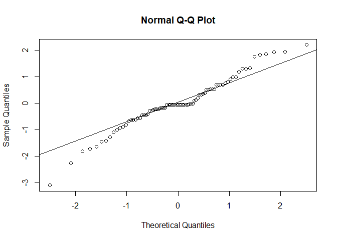<!-- -->

```
##                             2.5 %     97.5 %
## .sig01                  0.7853967  1.9069417
## .sigma                  0.9063581  1.3172171
## (Intercept)             8.1239363  9.4253009
## Treatment1             -0.6601496 -0.1565446
## Population1            -1.1807113  0.1191597
## Treatment1:Population1 -0.8526191 -0.3506372
```

``` r
LatBranch_anov_21 <- do_anov(LatBranch_lm_21)
```

```
## Type III Analysis of Variance Table with Satterthwaite's method
##                      Sum Sq Mean Sq NumDF  DenDF F value     Pr(>F)    
## Treatment            11.981  11.981     1 56.633  9.9997   0.002516 ** 
## Population            3.027   3.027     1 15.404  2.5264   0.132266    
## Treatment:Population 26.524  26.524     1 56.633 22.1372 0.00001676 ***
## ---
## Signif. codes:  0 '***' 0.001 '**' 0.01 '*' 0.05 '.' 0.1 ' ' 1
```

``` r
LatBranch_anov_21$trait <- "Lateral Branches"
LatBranch_means_21 <- get_table(LatBranch_lm_21)
```

There is an interaction, so do posthoc analyses.


``` r
# belm
as.data.frame(summary(lmer(LatBranches ~ Treatment + (1|Population:Line), data = subset(Dat_2021_TwoTrt, Population == "BELM")))$coefficients) 
```

```
##               Estimate Std. Error       df   t value       Pr(>|t|)
## (Intercept)  8.1977879  0.7449266  6.28060 11.004827 0.000024505020
## Treatment1  -0.9841491  0.1711827 23.80319 -5.749114 0.000006531059
```

``` r
#roda
as.data.frame(summary(lmer(LatBranches ~ Treatment + (1|Population:Line), data = subset(Dat_2021_TwoTrt, Population == "RODA")))$coefficients)
```

```
##              Estimate Std. Error        df   t value     Pr(>|t|)
## (Intercept) 9.3314800  0.2941943  9.904513 31.718763 2.726427e-11
## Treatment1  0.1757355  0.1739916 33.744075  1.010023 3.196721e-01
```

``` r
#cur
as.data.frame(summary(lmer(LatBranches ~ Population + (1|Population:Line), data = subset(Dat_2021_TwoTrt, Treatment == "Current")))$coefficients) 
```

```
##              Estimate Std. Error       df   t value     Pr(>|t|)
## (Intercept)  8.342096   0.338755 14.59772 24.625749 2.681293e-13
## Population1 -1.120216   0.338755 14.59772 -3.306861 4.943403e-03
```

``` r
#fut
as.data.frame(summary(lmer(LatBranches ~ Population + (1|Population:Line), data = subset(Dat_2021_TwoTrt, Treatment == "Future")))$coefficients)
```

```
##              Estimate Std. Error       df    t value     Pr(>|t|)
## (Intercept) 9.4179509  0.3886123 15.02059 24.2348232 1.866385e-13
## Population1 0.1418446  0.3886123 15.02059  0.3650028 7.201976e-01
```

Num primary stalks

``` r
# number of primary stalks
PrimStalks_lm_21 <- do_lmer(Dat_2021_TwoTrt$PrimaryStalks)
```

<!-- --><!-- --><!-- -->

```
## [1] "the number of complete cases is 81"
```

```
## Linear mixed model fit by REML. t-tests use Satterthwaite's method [
## lmerModLmerTest]
## Formula: trait ~ Treatment * Population + (1 | Population:Line)
##    Data: data
## 
## REML criterion at convergence: 376
## 
## Scaled residuals: 
##     Min      1Q  Median      3Q     Max 
## -2.1000 -0.6171  0.1159  0.7020  2.1086 
## 
## Random effects:
##  Groups          Name        Variance Std.Dev.
##  Population:Line (Intercept) 1.535    1.239   
##  Residual                    5.172    2.274   
## Number of obs: 81, groups:  Population:Line, 21
## 
## Fixed effects:
##                        Estimate Std. Error      df t value Pr(>|t|)    
## (Intercept)              9.5160     0.3978 18.1477  23.920 3.55e-15 ***
## Treatment1               2.0955     0.2616 63.7311   8.009 3.19e-11 ***
## Population1              1.0178     0.3978 18.1477   2.558   0.0197 *  
## Treatment1:Population1  -0.4921     0.2616 63.7311  -1.881   0.0646 .  
## ---
## Signif. codes:  0 '***' 0.001 '**' 0.01 '*' 0.05 '.' 0.1 ' ' 1
## 
## Correlation of Fixed Effects:
##             (Intr) Trtmn1 Ppltn1
## Treatment1  -0.064              
## Population1  0.263 -0.038       
## Trtmnt1:Pp1 -0.038  0.196 -0.064
```

```
## Computing profile confidence intervals ...
```

<!-- -->

```
##                             2.5 %      97.5 %
## .sig01                  0.3316510  1.98113053
## .sigma                  1.8933161  2.69472902
## (Intercept)             8.7393175 10.28960784
## Treatment1              1.5825550  2.60516643
## Population1             0.2479346  1.79932248
## Treatment1:Population1 -1.0012379  0.02152321
```

``` r
PrimStalks_anov_21 <- do_anov(PrimStalks_lm_21)
```

```
## Type III Analysis of Variance Table with Satterthwaite's method
##                      Sum Sq Mean Sq NumDF  DenDF F value    Pr(>F)    
## Treatment            331.79  331.79     1 63.731 64.1496 3.189e-11 ***
## Population            33.85   33.85     1 18.148  6.5452   0.01967 *  
## Treatment:Population  18.29   18.29     1 63.731  3.5370   0.06458 .  
## ---
## Signif. codes:  0 '***' 0.001 '**' 0.01 '*' 0.05 '.' 0.1 ' ' 1
```

``` r
PrimStalks_anov_21$trait <- "Primary Stalks"
PrimStalks_means_21 <- get_table(PrimStalks_lm_21)
```

There is a weak interaction, so do posthoc analyses.


``` r
# belm
as.data.frame(summary(lmer(PrimaryStalks ~ Treatment + (1|Population:Line), data = subset(Dat_2021_TwoTrt, Population == "BELM")))$coefficients) 
```

```
##              Estimate Std. Error        df   t value       Pr(>|t|)
## (Intercept) 10.538198  0.7554204  7.410892 13.950111 0.000001378928
## Treatment1   1.603884  0.3756244 26.557427  4.269915 0.000222222555
```

``` r
#roda
as.data.frame(summary(lmer(PrimaryStalks ~ Treatment + (1|Population:Line), data = subset(Dat_2021_TwoTrt, Population == "RODA")))$coefficients)
```

```
##             Estimate Std. Error       df  t value           Pr(>|t|)
## (Intercept) 8.520560  0.3993956 10.71934 21.33363 0.0000000003994594
## Treatment1  2.571601  0.3508994 36.41209  7.32860 0.0000000114251243
```

``` r
#cur
as.data.frame(summary(lmer(PrimaryStalks ~ Population + (1|Population:Line), data = subset(Dat_2021_TwoTrt, Treatment == "Current")))$coefficients) 
```

```
##               Estimate Std. Error       df   t value     Pr(>|t|)
## (Intercept) 11.6970449   0.440166 20.22246 26.574166 3.332402e-17
## Population1  0.6138654   0.440166 20.22246  1.394623 1.782623e-01
```

``` r
#fut
as.data.frame(summary(lmer(PrimaryStalks ~ Population + (1|Population:Line), data = subset(Dat_2021_TwoTrt, Treatment == "Future")))$coefficients)
```

```
##             Estimate Std. Error       df   t value          Pr(>|t|)
## (Intercept) 7.409017  0.5695613 13.93514 13.008287 0.000000003487095
## Population1 1.396607  0.5695613 13.93514  2.452075 0.028002337268128
```

Height main stalk

``` r
# height of main stalk (cm)
height_lm_21 <- do_lmer(Dat_2021_TwoTrt$Height_cm)
```

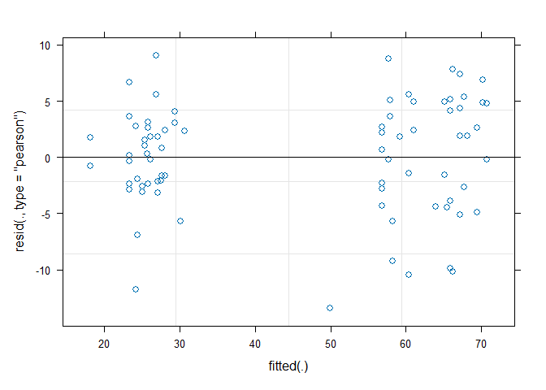<!-- --><!-- -->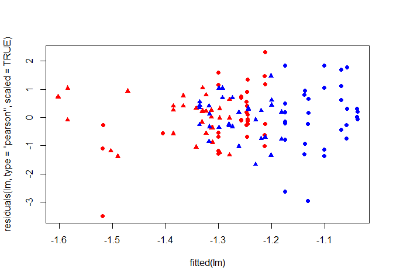<!-- -->

```
## [1] "the number of complete cases is 80"
```

```
## Linear mixed model fit by REML. t-tests use Satterthwaite's method [
## lmerModLmerTest]
## Formula: trait ~ Treatment * Population + (1 | Population:Line)
##    Data: data
## 
## REML criterion at convergence: 509.3
## 
## Scaled residuals: 
##     Min      1Q  Median      3Q     Max 
## -2.5012 -0.5269  0.0902  0.6035  1.6876 
## 
## Random effects:
##  Groups          Name        Variance Std.Dev.
##  Population:Line (Intercept) 17.19    4.146   
##  Residual                    28.79    5.366   
## Number of obs: 80, groups:  Population:Line, 21
## 
## Fixed effects:
##                        Estimate Std. Error      df t value Pr(>|t|)    
## (Intercept)             43.8643     1.1649 12.6077  37.655 2.46e-14 ***
## Treatment1              18.3650     0.6298 54.3700  29.160  < 2e-16 ***
## Population1             -2.6748     1.1649 12.6077  -2.296   0.0395 *  
## Treatment1:Population1  -1.6231     0.6298 54.3700  -2.577   0.0127 *  
## ---
## Signif. codes:  0 '***' 0.001 '**' 0.01 '*' 0.05 '.' 0.1 ' ' 1
## 
## Correlation of Fixed Effects:
##             (Intr) Trtmn1 Ppltn1
## Treatment1  -0.076              
## Population1  0.270 -0.053       
## Trtmnt1:Pp1 -0.053  0.221 -0.076
```

```
## Computing profile confidence intervals ...
```

<!-- -->

```
##                            2.5 %     97.5 %
## .sig01                  1.196890  6.5072091
## .sigma                  4.423567  6.5339442
## (Intercept)            41.529862 46.1075269
## Treatment1             17.110760 19.5935083
## Population1            -4.996172 -0.4267735
## Treatment1:Population1 -2.886587 -0.3998313
```

``` r
height_anov_21 <- do_anov(height_lm_21)
```

```
## Type III Analysis of Variance Table with Satterthwaite's method
##                       Sum Sq Mean Sq NumDF  DenDF  F value  Pr(>F)    
## Treatment            24482.8 24482.8     1 54.370 850.3263 < 2e-16 ***
## Population             151.8   151.8     1 12.608   5.2724 0.03951 *  
## Treatment:Population   191.2   191.2     1 54.370   6.6422 0.01270 *  
## ---
## Signif. codes:  0 '***' 0.001 '**' 0.01 '*' 0.05 '.' 0.1 ' ' 1
```

``` r
height_anov_21$trait <- "Height (cm)"
height_means_21 <- get_table(height_lm_21)
```

There is an interaction, so do posthoc analyses.


``` r
# belm
as.data.frame(summary(lmer(Height_cm ~ Treatment + (1|Population:Line), data = subset(Dat_2021_TwoTrt, Population == "BELM")))$coefficients) 
```

```
##             Estimate Std. Error        df  t value      Pr(>|t|)
## (Intercept) 41.41515   1.497931 0.1530115 27.64823 0.47286181563
## Treatment1  16.64274   1.160854 4.8165346 14.33663 0.00003905214
```

``` r
#roda
as.data.frame(summary(lmer(Height_cm ~ Treatment + (1|Population:Line), data = subset(Dat_2021_TwoTrt, Population == "RODA")))$coefficients)
```

```
##             Estimate Std. Error       df  t value     Pr(>|t|)
## (Intercept) 46.53579  1.3328067 11.36596 34.91564 6.375138e-13
## Treatment1  19.98653  0.7196255 35.02518 27.77352 1.908524e-25
```

``` r
#cur
as.data.frame(summary(lmer(Height_cm ~ Population + (1|Population:Line), data = subset(Dat_2021_TwoTrt, Treatment == "Current")))$coefficients) 
```

```
##              Estimate Std. Error      df   t value     Pr(>|t|)
## (Intercept) 62.000400    1.61787 15.8366 38.322244 4.822192e-17
## Population1 -4.480354    1.61787 15.8366 -2.769292 1.377838e-02
```

``` r
#fut
as.data.frame(summary(lmer(Height_cm ~ Population + (1|Population:Line), data = subset(Dat_2021_TwoTrt, Treatment == "Future")))$coefficients)
```

```
##              Estimate Std. Error       df    t value     Pr(>|t|)
## (Intercept) 25.666965   1.112787 15.30924 23.0654759 2.617943e-13
## Population1 -0.828804   1.112787 15.30924 -0.7448001 4.676730e-01
```


### Fitness

Fruit Count
at first, only using IJ fruit count because of issue with skipping counter for other fruit count.

Now (9/20/2024) only using Basia's fruit counts


``` r
# number fruits on plant
# maybe would want to add done flower or not done flower as a random effect in this model?
fruit_lm_21 <- do_lmer(Dat_2021_TwoTrt$FruitCount_BL)
```

<!-- --><!-- -->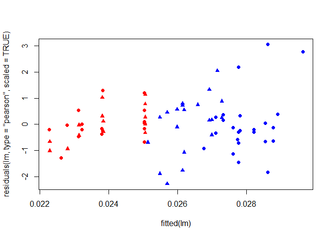<!-- -->

```
## [1] "the number of complete cases is 96"
```

```
## Linear mixed model fit by REML. t-tests use Satterthwaite's method [
## lmerModLmerTest]
## Formula: trait ~ Treatment * Population + (1 | Population:Line)
##    Data: data
## 
## REML criterion at convergence: 1263.3
## 
## Scaled residuals: 
##      Min       1Q   Median       3Q      Max 
## -2.95586 -0.32149  0.04401  0.46782  2.63198 
## 
## Random effects:
##  Groups          Name        Variance Std.Dev.
##  Population:Line (Intercept) 11931    109.2   
##  Residual                    36911    192.1   
## Number of obs: 96, groups:  Population:Line, 21
## 
## Fixed effects:
##                        Estimate Std. Error      df t value     Pr(>|t|)    
## (Intercept)             376.023     32.365  17.041  11.618 0.0000000016 ***
## Treatment1              257.257     19.887  71.888  12.936      < 2e-16 ***
## Population1              37.728     32.365  17.041   1.166        0.260    
## Treatment1:Population1    7.543     19.887  71.888   0.379        0.706    
## ---
## Signif. codes:  0 '***' 0.001 '**' 0.01 '*' 0.05 '.' 0.1 ' ' 1
## 
## Correlation of Fixed Effects:
##             (Intr) Trtmn1 Ppltn1
## Treatment1  0.000               
## Population1 0.239  0.000        
## Trtmnt1:Pp1 0.000  0.167  0.000
```

```
## Computing profile confidence intervals ...
```

<!-- -->

```
##                            2.5 %    97.5 %
## .sig01                  29.98821 169.56497
## .sigma                 162.77760 225.24820
## (Intercept)            312.86468 439.33735
## Treatment1             218.25449 296.25980
## Population1            -25.49054 100.97883
## Treatment1:Population1 -31.45980  46.54551
```

``` r
fruit_anov_21 <- do_anov(fruit_lm_21)
```

```
## Type III Analysis of Variance Table with Satterthwaite's method
##                       Sum Sq Mean Sq NumDF  DenDF  F value Pr(>F)    
## Treatment            6176916 6176916     1 71.888 167.3450 <2e-16 ***
## Population             50158   50158     1 17.041   1.3589 0.2598    
## Treatment:Population    5310    5310     1 71.888   0.1439 0.7056    
## ---
## Signif. codes:  0 '***' 0.001 '**' 0.01 '*' 0.05 '.' 0.1 ' ' 1
```

``` r
fruit_anov_21$trait <- "FruitNum"
fruit_means_21 <- get_table(fruit_lm_21)
```


There is not an interaction, but do post-hoc analyses (there was an interaction with IJ_FruitCount)


``` r
# belm
as.data.frame(summary(lmer(FruitCount_BL ~ Treatment + (1|Population:Line), data = subset(Dat_2021_TwoTrt, Population == "BELM")))$coefficients) 
```

```
##             Estimate Std. Error        df  t value          Pr(>|t|)
## (Intercept)  414.365   70.26781  6.630847 5.896939 0.000734805495624
## Treatment1   264.800   32.23411 30.811264 8.214901 0.000000002938428
```

``` r
#roda
as.data.frame(summary(lmer(FruitCount_BL ~ Treatment + (1|Population:Line), data = subset(Dat_2021_TwoTrt, Population == "RODA")))$coefficients)
```

```
##             Estimate Std. Error       df  t value     Pr(>|t|)
## (Intercept) 337.7082   27.95124 10.10679 12.08205 2.476333e-07
## Treatment1  249.7143   24.47692 40.62676 10.20203 9.036968e-13
```

``` r
#cur
as.data.frame(summary(lmer(FruitCount_BL ~ Population + (1|Population:Line), data = subset(Dat_2021_TwoTrt, Treatment == "Current")))$coefficients) 
```

```
##              Estimate Std. Error       df    t value          Pr(>|t|)
## (Intercept) 630.98523    56.5375 16.96773 11.1604726 0.000000003090344
## Population1  43.20968    56.5375 16.96773  0.7642658 0.455206645233996
```

``` r
#fut
as.data.frame(summary(lmer(FruitCount_BL ~ Population + (1|Population:Line), data = subset(Dat_2021_TwoTrt, Treatment == "Future")))$coefficients)
```

```
##              Estimate Std. Error       df  t value        Pr(>|t|)
## (Intercept) 121.11227   15.41546 17.28622 7.856544 0.0000004168146
## Population1  32.25978   15.41546 17.28622 2.092690 0.0514251187538
```

Average weight of a seed (collected seed weight / count of collected seeds)

``` r
# weight of collected seeds - take weight divided by number of seeds counted
AvSeedWt_lm_21 <- do_lmer(Dat_2021_TwoTrt$AvgSeedWt)
```

<!-- -->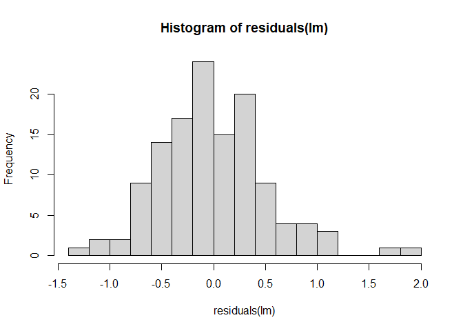<!-- --><!-- -->

```
## [1] "the number of complete cases is 78"
```

```
## Linear mixed model fit by REML. t-tests use Satterthwaite's method [
## lmerModLmerTest]
## Formula: trait ~ Treatment * Population + (1 | Population:Line)
##    Data: data
## 
## REML criterion at convergence: -584.9
## 
## Scaled residuals: 
##      Min       1Q   Median       3Q      Max 
## -2.27837 -0.46170 -0.02911  0.37446  3.05478 
## 
## Random effects:
##  Groups          Name        Variance    Std.Dev.
##  Population:Line (Intercept) 0.000002218 0.001489
##  Residual                    0.000015452 0.003931
## Number of obs: 78, groups:  Population:Line, 21
## 
## Fixed effects:
##                          Estimate Std. Error         df t value Pr(>|t|)    
## (Intercept)             0.0252961  0.0005897 12.5741046  42.899 5.15e-15 ***
## Treatment1              0.0004029  0.0004562 59.2648244   0.883  0.38080    
## Population1            -0.0019567  0.0005897 12.5741046  -3.318  0.00578 ** 
## Treatment1:Population1 -0.0004111  0.0004562 59.2648244  -0.901  0.37116    
## ---
## Signif. codes:  0 '***' 0.001 '**' 0.01 '*' 0.05 '.' 0.1 ' ' 1
## 
## Correlation of Fixed Effects:
##             (Intr) Trtmn1 Ppltn1
## Treatment1  -0.076              
## Population1  0.227 -0.026       
## Trtmnt1:Pp1 -0.026  0.158 -0.076
```

```
## Computing profile confidence intervals ...
```

<!-- -->

```
##                                2.5 %        97.5 %
## .sig01                  0.0000000000  0.0029356393
## .sigma                  0.0032494688  0.0046958587
## (Intercept)             0.0240911788  0.0264255212
## Treatment1             -0.0004819081  0.0013091426
## Population1            -0.0032385517 -0.0007800292
## Treatment1:Population1 -0.0013185254  0.0004727017
```

``` r
AvSeedWt_anov_21 <- do_anov(AvSeedWt_lm_21)
```

```
## Type III Analysis of Variance Table with Satterthwaite's method
##                           Sum Sq     Mean Sq NumDF  DenDF F value  Pr(>F)   
## Treatment            0.000012048 0.000012048     1 59.265  0.7797 0.38080   
## Population           0.000170151 0.000170151     1 12.574 11.0117 0.00578 **
## Treatment:Population 0.000012548 0.000012548     1 59.265  0.8121 0.37116   
## ---
## Signif. codes:  0 '***' 0.001 '**' 0.01 '*' 0.05 '.' 0.1 ' ' 1
```

``` r
AvSeedWt_anov_21$trait <- "Average Seed Wt"
AvSeedWt_means_21 <- get_table(AvSeedWt_lm_21)
```

No interaction, but want to do post hoc to be able to discuss differences


``` r
# belm
as.data.frame(summary(lmer(AvgSeedWt ~ Treatment + (1|Population:Line), data = subset(Dat_2021_TwoTrt, Population == "BELM")))$coefficients) 
```

```
##                  Estimate   Std. Error       df     t value       Pr(>|t|)
## (Intercept) 0.02274526082 0.0009413707  6.46036 24.16185337 0.000000140673
## Treatment1  0.00002012891 0.0004082549 25.33674  0.04930476 0.961063049499
```

``` r
#roda
as.data.frame(summary(lmer(AvgSeedWt ~ Treatment + (1|Population:Line), data = subset(Dat_2021_TwoTrt, Population == "RODA")))$coefficients)
```

```
## boundary (singular) fit: see help('isSingular')
```

```
##                Estimate   Std. Error df   t value     Pr(>|t|)
## (Intercept) 0.027137237 0.0007173583 43 37.829402 1.217006e-34
## Treatment1  0.000872003 0.0007173583 43  1.215575 2.307786e-01
```

``` r
#cur
as.data.frame(summary(lmer(AvgSeedWt ~ Population + (1|Population:Line), data = subset(Dat_2021_TwoTrt, Treatment == "Current")))$coefficients) 
```

```
## boundary (singular) fit: see help('isSingular')
```

```
##                 Estimate   Std. Error df   t value     Pr(>|t|)
## (Intercept)  0.025972502 0.0006513087 40 39.877409 7.937281e-34
## Population1 -0.002036739 0.0006513087 40 -3.127148 3.285150e-03
```

``` r
#fut
as.data.frame(summary(lmer(AvgSeedWt ~ Population + (1|Population:Line), data = subset(Dat_2021_TwoTrt, Treatment == "Future")))$coefficients)
```

```
##                 Estimate   Std. Error       df   t value     Pr(>|t|)
## (Intercept)  0.024871467 0.0008643317 11.87432 28.775372 2.380522e-12
## Population1 -0.001576327 0.0008643317 11.87432 -1.823752 9.344280e-02
```


average Seed number per fruit -

``` r
# number seeds from collected fruits

#seeds_2021 <- anov_lmer(Dat_2021_TwoTrt$AvgSeedNum)
seeds_lm_21 <- do_lmer(Dat_2021_TwoTrt$l10_AvgSeedNum)
```

```
## boundary (singular) fit: see help('isSingular')
```

<!-- --><!-- -->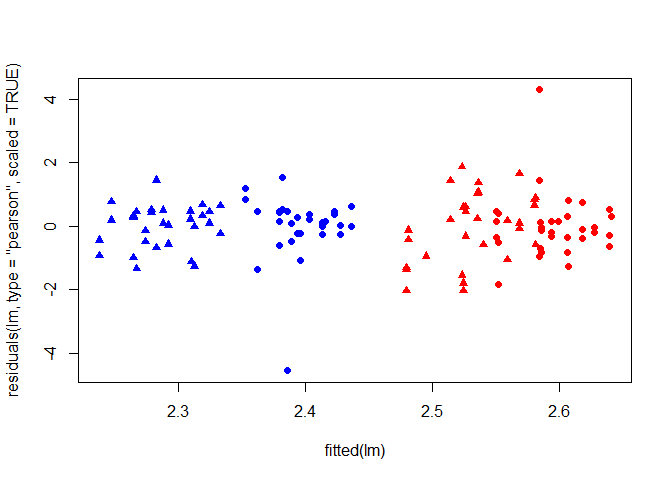<!-- -->

```
## [1] "the number of complete cases is 78"
```

```
## Linear mixed model fit by REML. t-tests use Satterthwaite's method [
## lmerModLmerTest]
## Formula: trait ~ Treatment * Population + (1 | Population:Line)
##    Data: data
## 
## REML criterion at convergence: -173.7
## 
## Scaled residuals: 
##     Min      1Q  Median      3Q     Max 
## -3.7830 -0.4495  0.2750  0.6081  1.5814 
## 
## Random effects:
##  Groups          Name        Variance Std.Dev.
##  Population:Line (Intercept) 0.000000 0.00000 
##  Residual                    0.004426 0.06653 
## Number of obs: 78, groups:  Population:Line, 21
## 
## Fixed effects:
##                         Estimate Std. Error        df t value     Pr(>|t|)    
## (Intercept)             1.709369   0.007649 74.000000 223.480      < 2e-16 ***
## Treatment1              0.045167   0.007649 74.000000   5.905 0.0000000995 ***
## Population1            -0.038356   0.007649 74.000000  -5.015 0.0000035283 ***
## Treatment1:Population1 -0.031543   0.007649 74.000000  -4.124 0.0000963456 ***
## ---
## Signif. codes:  0 '***' 0.001 '**' 0.01 '*' 0.05 '.' 0.1 ' ' 1
## 
## Correlation of Fixed Effects:
##             (Intr) Trtmn1 Ppltn1
## Treatment1  -0.081              
## Population1  0.156 -0.024       
## Trtmnt1:Pp1 -0.024  0.156 -0.081
## optimizer (nloptwrap) convergence code: 0 (OK)
## boundary (singular) fit: see help('isSingular')
```

```
## Computing profile confidence intervals ...
```

<!-- -->

```
##                              2.5 %      97.5 %
## .sig01                  0.00000000  0.02297541
## .sigma                  0.05582089  0.07646654
## (Intercept)             1.69458675  1.72415037
## Treatment1              0.03038359  0.05995091
## Population1            -0.05313945 -0.02357805
## Treatment1:Population1 -0.04632699 -0.01675966
```

``` r
seeds_anov_21 <- do_anov(seeds_lm_21)
```

```
## Type III Analysis of Variance Table with Satterthwaite's method
##                        Sum Sq  Mean Sq NumDF DenDF F value        Pr(>F)    
## Treatment            0.154327 0.154327     1    74  34.870 0.00000009946 ***
## Population           0.111293 0.111293     1    74  25.147 0.00000352830 ***
## Treatment:Population 0.075268 0.075268     1    74  17.007 0.00009634562 ***
## ---
## Signif. codes:  0 '***' 0.001 '**' 0.01 '*' 0.05 '.' 0.1 ' ' 1
```

``` r
seeds_anov_21$trait <- "l10_Average Seeds per Fruit"
seeds_means_21 <- get_table_bt(seeds_lm_21)
# why are residuals so odd? because population explains 0 variance.

## test if SeedCounter matters
#seeds_lm <- lmer(l10_AvgSeedNum ~ Treatment * Population + (1|Population:Line) + (1|SeedCounter), data = Dat_2021_TwoTrt, #contrasts = list(Treatment=contr.sum, Population = contr.sum))
#plot(fitted(seeds_lm), residuals(seeds_lm, type = "pearson", scaled = TRUE),
#       col = c("red", "blue")[as.numeric(Dat_2021_TwoTrt$Population)[complete.cases(Dat_2021_TwoTrt$l10_AvgSeedNum)]],
#       pch = c(16, 15, 17)[as.numeric(Dat_2021_TwoTrt$Treatment)[complete.cases(Dat_2021_TwoTrt$l10_AvgSeedNum)]])
#summary(seeds_lm)
#anova(seeds_lm)
#
## when including seed counter, it does explain some variance (0.0001) but there is more residual (0.0004) and population #still explains nothing. The significance levels don't change, and the effect sizes don't really change either though not the #standard error and df are different for each predictor
## so, not going to include in the model.
#
## see if the nesting is doing something weird. if LineID was the random variable, does anything change?
#Dat_2021_TwoTrt$Line.ID <- as.factor(paste0(Dat_2021_TwoTrt$Population, Dat_2021_TwoTrt$Line))
#seeds_lm2 <- lmer(l10_AvgSeedNum ~ Treatment * Population + (1|Line.ID), data = Dat_2021_TwoTrt, contrasts = #list(Treatment=contr.sum, Population = contr.sum))
#plot(fitted(seeds_lm2), residuals(seeds_lm2, type = "pearson", scaled = TRUE),
#       col = c("red", "blue")[as.numeric(Dat_2021_TwoTrt$Population)[complete.cases(Dat_2021_TwoTrt$l10_AvgSeedNum)]],
#       pch = c(16, 15, 17)[as.numeric(Dat_2021_TwoTrt$Treatment)[complete.cases(Dat_2021_TwoTrt$l10_AvgSeedNum)]])
#summary(seeds_lm2)
#anova(seeds_lm2)
#
## no difference, as expected if the model was functioning as expected. All testing code is commented out and no changes were made to the model.
```

There is an interaction, so do posthoc analyses.


``` r
# belm
as.data.frame(summary(lmer(l10_AvgSeedNum ~ Treatment + (1|Population:Line), data = subset(Dat_2021_TwoTrt, Population == "BELM")))$coefficients) 
```

```
## boundary (singular) fit: see help('isSingular')
```

```
##               Estimate Std. Error df    t value     Pr(>|t|)
## (Intercept) 1.67101304 0.01319795 31 126.611549 1.201102e-43
## Treatment1  0.01362392 0.01319795 31   1.032276 3.099296e-01
```

``` r
#roda
as.data.frame(summary(lmer(l10_AvgSeedNum ~ Treatment + (1|Population:Line), data = subset(Dat_2021_TwoTrt, Population == "RODA")))$coefficients)
```

```
## boundary (singular) fit: see help('isSingular')
```

```
##               Estimate  Std. Error df    t value     Pr(>|t|)
## (Intercept) 1.74772568 0.008847212 43 197.545365 3.009707e-65
## Treatment1  0.07671057 0.008847212 43   8.670593 5.438523e-11
```

``` r
#cur
as.data.frame(summary(lmer(l10_AvgSeedNum ~ Population + (1|Population:Line), data = subset(Dat_2021_TwoTrt, Treatment == "Current")))$coefficients) 
```

```
##                Estimate Std. Error       df    t value     Pr(>|t|)
## (Intercept)  1.75486172 0.01022104 12.84778 171.691179 5.615455e-23
## Population1 -0.06949126 0.01022104 12.84778  -6.798847 1.343811e-05
```

``` r
#fut
as.data.frame(summary(lmer(l10_AvgSeedNum ~ Population + (1|Population:Line), data = subset(Dat_2021_TwoTrt, Treatment == "Future")))$coefficients)
```

```
## boundary (singular) fit: see help('isSingular')
```

```
##                 Estimate Std. Error df     t value     Pr(>|t|)
## (Intercept)  1.664202112 0.01159126 34 143.5738507 6.542713e-49
## Population1 -0.006812993 0.01159126 34  -0.5877698 5.605707e-01
```

Total Fitness


``` r
# total fitness 
fitness_lm_21 <- do_lmer(Dat_2021_TwoTrt$fitness)
```

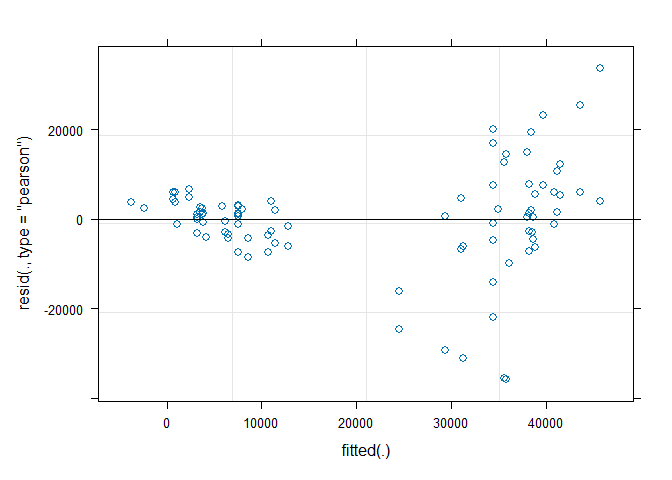<!-- --><!-- --><!-- -->

```
## [1] "the number of complete cases is 93"
```

```
## Linear mixed model fit by REML. t-tests use Satterthwaite's method [
## lmerModLmerTest]
## Formula: trait ~ Treatment * Population + (1 | Population:Line)
##    Data: data
## 
## REML criterion at convergence: 1956.9
## 
## Scaled residuals: 
##      Min       1Q   Median       3Q      Max 
## -2.97677 -0.34420  0.07632  0.36589  2.79464 
## 
## Random effects:
##  Groups          Name        Variance  Std.Dev.
##  Population:Line (Intercept)  37372493  6113   
##  Residual                    144910416 12038   
## Number of obs: 93, groups:  Population:Line, 21
## 
## Fixed effects:
##                        Estimate Std. Error       df t value      Pr(>|t|)    
## (Intercept)            20873.25    1916.28    16.51  10.893 0.00000000595 ***
## Treatment1             15482.40    1261.46    69.36  12.273       < 2e-16 ***
## Population1             -540.91    1916.28    16.51  -0.282         0.781    
## Treatment1:Population1 -2006.15    1261.46    69.36  -1.590         0.116    
## ---
## Signif. codes:  0 '***' 0.001 '**' 0.01 '*' 0.05 '.' 0.1 ' ' 1
## 
## Correlation of Fixed Effects:
##             (Intr) Trtmn1 Ppltn1
## Treatment1  -0.006              
## Population1  0.220  0.006       
## Trtmnt1:Pp1  0.006  0.138 -0.006
```

```
## Computing profile confidence intervals ...
```

<!-- -->

```
##                            2.5 %     97.5 %
## .sig01                     0.000  9834.9355
## .sigma                 10166.933 14167.4614
## (Intercept)            17125.744 24613.8151
## Treatment1             13010.983 17959.8083
## Population1            -4280.441  3207.7593
## Treatment1:Population1 -4483.566   465.2587
```

``` r
fitness_anov_21 <- do_anov(fitness_lm_21)
```

```
## Type III Analysis of Variance Table with Satterthwaite's method
##                           Sum Sq     Mean Sq NumDF  DenDF  F value Pr(>F)    
## Treatment            21828870577 21828870577     1 69.360 150.6370 <2e-16 ***
## Population              11545765    11545765     1 16.507   0.0797 0.7812    
## Treatment:Population   366508256   366508256     1 69.360   2.5292 0.1163    
## ---
## Signif. codes:  0 '***' 0.001 '**' 0.01 '*' 0.05 '.' 0.1 ' ' 1
```

``` r
fitness_anov_21$trait <- "Total Fitness"
fitness_means_21 <- get_table(fitness_lm_21)
```

There is no interaction (but there was when this was log10 transformed, before I corrected a 0s issue), so do posthoc analyses.


``` r
# belm
as.data.frame(summary(lmer(fitness ~ Treatment + (1|Population:Line), data = subset(Dat_2021_TwoTrt, Population == "BELM")))$coefficients) 
```

```
##             Estimate Std. Error        df  t value         Pr(>|t|)
## (Intercept) 20342.85   3598.545  6.567225 5.653078 0.00096474554037
## Treatment1  13476.24   1799.340 30.823323 7.489549 0.00000002010826
```

``` r
#roda
as.data.frame(summary(lmer(fitness ~ Treatment + (1|Population:Line), data = subset(Dat_2021_TwoTrt, Population == "RODA")))$coefficients)
```

```
##             Estimate Std. Error       df  t value     Pr(>|t|)
## (Intercept) 21433.72   2065.509 10.39462 10.37696 8.218451e-07
## Treatment1  17505.57   1724.873 38.62350 10.14890 1.877630e-12
```

``` r
#cur
as.data.frame(summary(lmer(fitness ~ Population + (1|Population:Line), data = subset(Dat_2021_TwoTrt, Treatment == "Current")))$coefficients) 
```

```
##             Estimate Std. Error       df    t value          Pr(>|t|)
## (Intercept) 36299.26   3439.528 16.46264 10.5535580 0.000000009690787
## Population1 -2538.47   3439.528 16.46264 -0.7380285 0.470887610947486
```

``` r
#fut
as.data.frame(summary(lmer(fitness ~ Population + (1|Population:Line), data = subset(Dat_2021_TwoTrt, Treatment == "Future")))$coefficients)
```

```
##             Estimate Std. Error       df  t value        Pr(>|t|)
## (Intercept) 5456.428   724.0918 16.86775 7.535547 0.0000008571918
## Population1 1460.678   724.0918 16.86775 2.017256 0.0598711923127
```


###Outputs

1) Results table

Messing around with the stargazer package, but it ultimately works for model outputs but not for anova tables.

``` r
seeds_lm <- lmer(l10_AvgSeedNum ~ Treatment * Population + (1|Population:Line) + (1|SeedCounter), data = Dat_2021_TwoTrt, contrasts = list(Treatment=contr.sum, Population = contr.sum))
anova(seeds_lm)
class(seeds_lm) <- "lmerMod"

stargazer(seeds_lm, align = TRUE, type = "text")

stargazer(RR_2021,RWC_2021, type = "text")
```

also tried with sjPlot but again is with model outputs and doesn't look great b/c just 'trait' and 'pop1' and 'treat1' instead of more helfpul terms. 

``` r
sjPlot::tab_model(AG_lm_21, area_lm_21, AvSeedWt_lm_21, bolting_lm_21, dry_lm_21, emergence_lm_21, eTof_lm_21, fitness_lm_21, flowering_lm_21, fresh_lm_21, fruit_lm_21, height_lm_21, LatBranch_lm_21, LDMC_lm_21, LN_harv_lm_21, LN_PostVern_lm_21, LN_PreVern_lm_21, LN_Vern_lm_21, per_lm_21, PrimStalks_lm_21, Repro_lm_21, Ros_lm_21, RR_lm_21, RWC_lm_21, sat_lm_21, seeds_lm_21, SLA_lm_21) 
# would actually work to make a table with only p values
sjPlot::tab_model(anova(RWC_lm_21), anova(LDMC_lm_21), show.r2 = FALSE)
```

I made a bunch of anova tables. Can I simply rbind them all together? Current plan is to r bind all these together, r bind all the 2022 models together, and then cbind the 2021 and 2022 models together.


``` r
AnovaResults_2021 <- rbind(emergence_anov_21, bolting_anov_21, flowering_anov_21, eTof_anov_21, fresh_anov_21, sat_anov_21, dry_anov_21, area_anov_21, per_anov_21, SLA_anov_21, LDMC_anov_21, RWC_anov_21, LN_PreVern_anov_21, LN_Vern_anov_21, LN_PostVern_anov_21, LN_harv_anov_21, Ros_anov_21, Repro_anov_21, RR_anov_21, LatBranch_anov_21, PrimStalks_anov_21, height_anov_21, fruit_anov_21, AG_anov_21, AvSeedWt_anov_21, seeds_anov_21, fitness_anov_21)

write.csv(AnovaResults_2021, file = "data/AnovaResults_2021.csv", row.names = TRUE)
```

2) All the tables to read in to the figures code


``` r
# change column names
# not transformed
dfs <- c("emergence_means_21", "bolting_means_21", "flowering_means_21", "eTof_means_21", "RWC_means_21", 'LN_PreVern_means_21', 'LN_Vern_means_21', "LN_PostVern_means_21", "LN_harv_means_21", 'LatBranch_means_21', "PrimStalks_means_21", "height_means_21", "AvSeedWt_means_21", "fruit_means_21", "fitness_means_21")

for (i in dfs) {
  x=get(i)
  colnames(x) <- c("Treatment", "Population", "Mean", "SE", "Df", "LL_95", "UL_95")
  assign(i,x)
}

# transformed
dfs2 <- c("fresh_means_21", 'sat_means_21', "dry_means_21", "area_means_21", "per_means_21", "SLA_means_21", "LDMC_means_21", "Ros_means_21", "Repro_means_21", 'RR_means_21', "AG_means_21", "seeds_means_21")

for (i in dfs2) {
  x=get(i)
  colnames(x) <- c("Treatment", "Population", "Mean", "SE", "Df", "LL_95", "UL_95", "Bk_Mean", "Bk_LL_95", "Bk_UL_95")
  assign(i,x)
}

# create list of data frames
Means_2021 <- list(emergence_means_21, bolting_means_21, flowering_means_21, eTof_means_21, fresh_means_21, sat_means_21, dry_means_21, area_means_21, per_means_21, SLA_means_21, LDMC_means_21, RWC_means_21, LN_PreVern_means_21, LN_Vern_means_21, LN_PostVern_means_21, LN_harv_means_21, Ros_means_21, Repro_means_21, RR_means_21, LatBranch_means_21, PrimStalks_means_21, height_means_21, fruit_means_21, AG_means_21, AvSeedWt_means_21, seeds_means_21, fitness_means_21)

# name that list
names(Means_2021) <- c("emergence_means_21", "bolting_means_21", "flowering_means_21", "eTof_means_21", "fresh_means_21", 'sat_means_21', "dry_means_21", "area_means_21", "per_means_21", "SLA_means_21", "LDMC_means_21", "RWC_means_21", 'LN_PreVern_means_21', 'LN_Vern_means_21', "LN_PostVern_means_21", "LN_harv_means_21", "Ros_means_21", "Repro_means_21", 'RR_means_21', 'LatBranch_means_21', "PrimStalks_means_21", "height_means_21", "fruit_means_21", "AG_means_21", "AvSeedWt_means_21", "seeds_means_21", "fitness_means_21")

# save named list
save(Means_2021, file = "data/ModelMeans_2021.robj")
```


## Adaptive?
not sure any of this code is useful. doesn't include correlated traits just looks at plasticity. None of this is being run in July 2024.

``` r
CleanData_TwoTrt$Line.ID <- as.factor(paste0(CleanData_TwoTrt$Population, CleanData_TwoTrt$Line))

plasticity <- CleanData_TwoTrt %>% group_by(Treatment) %>% group_by(Line.ID, .add = TRUE) %>%summarize(mean_SLA = mean(SLA, na.rm = TRUE), mean_RR = mean(Repro_to_Ros, na.rm = TRUE), mean_height = mean(Height_cm, na.rm = TRUE), mean_fruit = mean(TotFruit, na.rm = TRUE), mean_emerge = mean(Emergence, na.rm = TRUE),mean_bolt = mean(DayToBolt, na.rm = TRUE), mean_LDMC = mean(LDMC, na.rm = TRUE), mean_RWC = mean(RWC, na.rm = TRUE), mean_flwr = mean(DayToFlwr, na.rm = TRUE), mean_dehis = mean(DayToDehis, na.rm = TRUE), mean_LeafNum = mean(RosetteLeafNum, na.rm = TRUE), mean_RosWt = mean(DryRosetteG, na.rm = TRUE), mean_LB = mean(LatBranches, na.rm = TRUE), mean_PS = mean(PrimaryStalks, na.rm = TRUE), )

# need to calculate plasticity for each line.

# first calcualte relative fitness
fitness <- CleanData_TwoTrt %>% group_by(Treatment) %>% group_by(Line.ID, .add = TRUE) %>%
  summarize(mean_fruits = mean(TotFruit, na.rm = TRUE))
tmp2 <- merge(fitness, plasticity, by = c("Treatment", "Line.ID"))
tmp2$Population <- substr(tmp2$Line.ID,1,4)
# test with SLA
Fut_SLA <- tmp2[tmp2$Treatment == "Future", c("Treatment", "Line.ID", "mean_fruits", "mean_SLA", "Population")]
Cur_SLA <- tmp2[tmp2$Treatment == "Current", c("Treatment", "Line.ID", "mean_fruits", "mean_SLA", "Population")]

# now everything:
Fut_tmp <- tmp2[tmp2$Treatment == "Future", ]
Cur_tmp <- tmp2[tmp2$Treatment == "Current", ]
# make fitness relative
Fut_tmp <- cbind(Fut_tmp, "rel_fitness" = Fut_tmp$mean_fruits/mean(Fut_tmp$mean_fruits))
Cur_tmp <- cbind(Cur_tmp, "rel_fitness" = Cur_tmp$mean_fruits/mean(Cur_tmp$mean_fruits))
# and standardize
Fut_tmp[4:17] <- scale(Fut_tmp[4:17], center = TRUE, scale = TRUE)

Cur_tmp[4:17] <- scale(Cur_tmp[4:17], center = TRUE, scale = TRUE)

# test on just SLA
summary(lm(rel_fitness ~ mean_SLA * Population, data = Fut_tmp))
# so not significant, but trait term is barely positive, so positive selection
summary(lm(rel_fitness ~ mean_SLA * Population, data = Cur_tmp))
# hey, trait term is slightly negative! so different directions in different environments.
# trait and pop terms are also significant.

# now I want to include like all the traits
# the interaction is only for the population term... maybe I need to fit each population separately? or type * population a million times?
# I probably want to standardize everything too because the scales are so different.
fit_fut <- lm(rel_fitness ~ mean_SLA*Population + mean_RR*Population + mean_height*Population + mean_emerge*Population + mean_bolt*Population + mean_LDMC*Population + mean_RWC*Population + mean_flwr*Population + mean_dehis*Population + mean_LeafNum*Population + mean_RosWt*Population + mean_LB*Population + mean_PS*Population, data = Fut_tmp)
summary(fit_fut)
# ahahahahaha the R2 is one. so some super overfitting which I already knew, and maybe the interaction effects are actually wrong too.

# I think the model should actually be quite a bit more complicated?
# I can also tell my committee that i haven't done these yet. I did a full regression for SLA but I haven't done partial regressions.

tmp3 <- merge(Fut_tmp, Cur_tmp, by = c("Line.ID"))
# not the cleanest data frame but whatever
tmp3$mean_fit <- rowMeans(tmp3[, c("mean_fruits.x", "mean_fruits.y")], na.rm = TRUE)
# difference is current minus future

# calculate plasticity for SLA. I would need to do this for every trait which seems like a lot of work
tmp3$dif_SLA <- tmp3$mean_SLA.y - tmp3$mean_SLA.x
#tmp3 <- tmp3[,c("Line.ID", "Treatment.x", "Population.x", "mean_fruits.x", "mean_fit", "dif_SLA")]
## mean fitness
#summary(lm(mean_fit ~ dif_SLA * Population.x, data = tmp3))
## negative and significant

# future fitness
summary(lm(rel_fitness.x ~ dif_SLA + mean_SLA.x + Population.x + dif_SLA:Population.x + mean_SLA.x:Population.x, data = tmp3))
# negative on trait and on plasticity but not significant


ggplot(data = tmp3, aes(x = dif_SLA, y = mean_fit)) +
  geom_point(aes(col=Population.x), size = 4) +
  labs(y="Mean fitness", 
      x="SLA plasticity")+
  scale_color_manual(name = "Population",
                     labels = c("IT", "SW"),
                     values = c("maroon3", "darkgreen"))+
  scale_linetype_manual(name = "Population",
                        labels = c("IT", "SW"),
                        values = c("solid", "dotted"))+
  theme_classic() +
  theme(
    legend.title = element_text(family = "serif", color = "black", size = 20),
    legend.text = element_text(family = "serif", color = "black", size = 20),
    axis.title = element_text(family = "serif", color = "black", size = 20),
    axis.text = element_text(family = "serif", color = "black", size = 20),
    axis.line = element_line(colour = 'black', size = 1),
    axis.ticks = element_line(color = 'black', size = 1),
    axis.ticks.length=unit(.15, "cm"),
    legend.spacing.y = unit(0.03, "cm"),
    panel.border = element_blank(),
    panel.grid.major.x = element_blank(),
    panel.grid.minor.x = element_blank()
    )

ggplot(data = tmp3, aes(x = dif_SLA, y = mean_fruits.x)) +
  geom_point(aes(col=Population.x), size = 4) +
  labs(y="Future fitness", 
      x="SLA plasticity")+
  scale_color_manual(name = "Population",
                     labels = c("IT", "SW"),
                     values = c("maroon3", "darkgreen"))+
  scale_linetype_manual(name = "Population",
                        labels = c("IT", "SW"),
                        values = c("solid", "dotted"))+
  theme_classic() +
  theme(
    legend.title = element_text(family = "serif", color = "black", size = 20),
    legend.text = element_text(family = "serif", color = "black", size = 20),
    axis.title = element_text(family = "serif", color = "black", size = 20),
    axis.text = element_text(family = "serif", color = "black", size = 20),
    axis.line = element_line(colour = 'black', size = 1),
    axis.ticks = element_line(color = 'black', size = 1),
    axis.ticks.length=unit(.15, "cm"),
    legend.spacing.y = unit(0.03, "cm"),
    panel.border = element_blank(),
    panel.grid.major.x = element_blank(),
    panel.grid.minor.x = element_blank()
    )

ggplot(data = Fut_SLA, aes(x = mean_SLA, y = mean_fruits)) +
  geom_point(aes(col=Population), size = 4) +
  labs(y="Future Fruit Number", 
      x="Future SLA")+
  scale_color_manual(name = "Population",
                     labels = c("IT", "SW"),
                     values = c("maroon3", "darkgreen"))+
  scale_linetype_manual(name = "Population",
                        labels = c("IT", "SW"),
                        values = c("solid", "dotted"))+
  theme_classic() +
  theme(
    legend.title = element_text(family = "serif", color = "black", size = 20),
    legend.text = element_text(family = "serif", color = "black", size = 20),
    axis.title = element_text(family = "serif", color = "black", size = 20),
    axis.text = element_text(family = "serif", color = "black", size = 20),
    axis.line = element_line(colour = 'black', size = 1),
    axis.ticks = element_line(color = 'black', size = 1),
    axis.ticks.length=unit(.15, "cm"),
    legend.spacing.y = unit(0.03, "cm"),
    panel.border = element_blank(),
    panel.grid.major.x = element_blank(),
    panel.grid.minor.x = element_blank()
    )

ggplot(data = Cur_SLA, aes(x = mean_SLA, y = mean_fruits)) +
  geom_point(aes(col=Population), size = 4) +
  labs(y="Current Fruit Number", 
      x="Current SLA")+
  scale_color_manual(name = "Population",
                     labels = c("IT", "SW"),
                     values = c("maroon3", "darkgreen"))+
  scale_linetype_manual(name = "Population",
                        labels = c("IT", "SW"),
                        values = c("solid", "dotted"))+
  theme_classic() +
  theme(
    legend.title = element_text(family = "serif", color = "black", size = 20),
    legend.text = element_text(family = "serif", color = "black", size = 20),
    axis.title = element_text(family = "serif", color = "black", size = 20),
    axis.text = element_text(family = "serif", color = "black", size = 20),
    axis.line = element_line(colour = 'black', size = 1),
    axis.ticks = element_line(color = 'black', size = 1),
    axis.ticks.length=unit(.15, "cm"),
    legend.spacing.y = unit(0.03, "cm"),
    panel.border = element_blank(),
    panel.grid.major.x = element_blank(),
    panel.grid.minor.x = element_blank()
    )
```

## Sample size information

The goal here is to know how many lines and how many replicates per line for this experiment.

What I want is a count of total plants, a mean, min, and max of plants per line, and the number of lines per population

I got the number of observations that were not NA from earlier in the summarize section


``` r
# sample size of 2021 total
Dat_2021_TwoTrt %>% count(Treatment)
```

```
##   Treatment  n
## 1   Current 50
## 2    Future 50
```

``` r
# 50 plants per treatments
Dat_2021_TwoTrt %>% count(Treatment, Population)
```

```
##   Treatment Population  n
## 1   Current       BELM 20
## 2   Current       RODA 30
## 3    Future       BELM 20
## 4    Future       RODA 30
```

``` r
# in each treatment, 20 are IT, 30 are SW

# from models know that there are 21 unique lines. 8 IT, 13 SW.

n_2021 <- Dat_2021_TwoTrt %>%
  group_by(Treatment) %>%
  group_by(Population, .add = TRUE) %>%
  group_by(Line, .add = TRUE) %>%
  count

# so only line with 1 rep is Belm 1. Then everything has 2 but RIL parents. B12 has 7, R47 has 6.

n_2021 %>% 
  group_by(Treatment) %>%
  group_by(Population, .add = TRUE) %>%
  summarize(min = min(n), mean = mean(n), median = median(n), max = max(n))
```

```
## `summarise()` has grouped output by 'Treatment'. You can override using the
## `.groups` argument.
```

```
## # A tibble: 4 × 6
## # Groups:   Treatment [2]
##   Treatment Population   min  mean median   max
##   <fct>     <fct>      <int> <dbl>  <dbl> <int>
## 1 Current   BELM           1  2.5       2     7
## 2 Current   RODA           2  2.31      2     6
## 3 Future    BELM           1  2.5       2     7
## 4 Future    RODA           2  2.31      2     6
```


# 2022

## Read in data

``` r
Dat_2022 <- read.csv("data/CleanData_2022.csv", header= TRUE)

# make some things factors
Dat_2022$Treatment <- as.factor(Dat_2022$Treatment)
Dat_2022$Population <- as.factor(Dat_2022$Population)
Dat_2022$PotID <- as.factor(Dat_2022$PotID)
Dat_2022$Flat <- as.factor(Dat_2022$Flat)
Dat_2022$Chamber <- as.factor(Dat_2022$Chamber)
Dat_2022$Transplanted <- as.factor(Dat_2022$Transplanted)
```

## Summarize!


``` r
# by population only
ByPop_22 <- Dat_2022 %>%
  dplyr::group_by(Population) %>%
  summarize(across(.col = c(DaysToEmergence:l10_Stomata_density), .fns = list(mean = ~mean(.x, na.rm = TRUE, .group = "keep"), ci_95 = ~conf_int(.x), n = ~sum(!is.na(.x)))))

# transpose for easier viewing
ByPop_22 <- data.frame(t(ByPop_22))

# now do by treatment
ByTrt_22 <- Dat_2022 %>%
  dplyr::group_by(Treatment) %>%
  summarize(across(.col = c(DaysToEmergence:l10_Stomata_density), .fns = list(mean = ~mean(.x, na.rm = TRUE, .group = "keep"), ci_95 = ~conf_int(.x), n = ~sum(!is.na(.x)))))
ByTrt_22 <- data.frame(t(ByTrt_22))

# Now I want population  means within each treatment
ByTrt_Pop_22 <- Dat_2022 %>%
  dplyr::group_by(Population) %>%
  dplyr::group_by(Treatment, .add = TRUE) %>%
  summarize(across(.col = c(DaysToEmergence:l10_Stomata_density), .fns = list(mean = ~mean(.x, na.rm = TRUE, .group = "keep"), ci_95 = ~conf_int(.x), n = ~sum(!is.na(.x)))))
```

```
## `summarise()` has grouped output by 'Population'. You can override using the
## `.groups` argument.
```

``` r
# get just the sample sizes
SampleSizes_2022 <- dplyr::select(ByTrt_Pop_22, "Treatment", "Population", ends_with("_n"))
save(SampleSizes_2022, file = "data/SampleSizes_2022.robj")

# for some ease of viewing
ByTrt_Pop_22 <- data.frame(t(ByTrt_Pop_22))
colnames(ByTrt_Pop_22) <- c("Belm_C", "Belm_F", "Roda_C", "Roda_F")

# save this to keep means
write.csv(ByTrt_Pop_22,"data/PopMeansByTreatment_2022.csv", row.names = TRUE )
```


## Anovas
Now, we can make some models. Initially there were three models for this analysis.

For traits collected before bolting: trait ~ Treatment * Population + (1|Population:Line) + (1|Treatment:Chamber) + (1|Transplanted)

For traits collected when a single leaf was harvesting: trait ~ Treatment * Population + (1|BoltingToHarvest) + (1|Population:Line) + (1|Treatment:Chamber) + (1|Transplanted)

For root harvesting traits: trait ~ Treatment * Population + (1|BoltingToRootWashing) + (1|Population:Line) + (1|Treatment:Chamber) + (1|Transplanted)

After discussing with Jeff, chamber nested within treatment was changed to a fixed effect because models struggle to fit a variance with few groups. The Bolting to harvest and bolting to root washing variables were also removed because they are continuous but being treated like categorical as a random effect. These two variables did explain some variation and removing sometimes increased and sometimes decreased both effect sizes and p values. 

If included, the transplanting effect should be fixed. There is a population bias where only italian lines were transplanted. 17 plants from 6 genotypes were transplanted. They became 10 current plants and 7 future plants. **However, when included, the transplanting effect sometimes explains 0 variance** Because this is such a small number (17 plants of 127 plants), the transplanting effect was removed from the model. All models were run with and without transplanting as  a fixed effect, but only small changes were seen in 3 traits (see data/ModelResults_InitalModels.xlsx for notes.)

Final model (only 1): trait ~ Treatment * Population + Treatment:Chamber + (1|Population:Line)


``` r
# set contrasts for models to ensure we are doing the correct type of ANOVA (type-III)
contrasts(Dat_2022$Population) <- contr.sum
contrasts(Dat_2022$Treatment) <- contr.sum

# make a modelling function to streamline analyses. This function runs a mixed model, then plots the residuals, the model summary, and runs an ANOVA

do_lmer2 <- function(trait, data = Dat_2022){
  lm<- lmer(trait ~ Treatment * Population + Treatment:Chamber + (1|Population:Line), data = data, contrasts = list(Treatment=contr.sum, Population = contr.sum))
  print(plot(lm))
  hist(residuals(lm), breaks = 15)
  # in the residual plots, red is italy, blue is sweden; filled circle is current, filled triangle is future
  plot(fitted(lm), residuals(lm, type = "pearson", scaled = TRUE),
       col = c("red", "blue")[as.numeric(Dat_2022$Population)[complete.cases(trait)]],
       pch = c(16, 17)[as.numeric(Dat_2022$Treatment)[complete.cases(trait)]])
  #legend("topleft", legend = c("Italy", "Sweden"), col = c("red", "blue"), pch = 16)
  #legend("bottomleft", legend = c("Current", "Future"), col = "black", pch = c(16,17))
  #plotting sanity check
  print(paste0("the number of complete cases is ", sum(complete.cases(trait))))
  # make qq plot
  qqnorm(resid(lm))
  qqline(resid(lm))
  print(summary(lm))
  print(confint(lm))
  return(lm)
}
# do the anova
do_anov2 <- function(model){
  anov <- anova(model)
  print(anov)
  df <- as.data.frame(anov)
  df$exp <- "2022"
  return(df)
}

# get table functions are the same as from 2021
```


Run the models
### Phenology

Days to emergence - log10 transformed this time!
no post hoc because not in manuscript

``` r
# days to emergence
emergence_lm_22 <- do_lmer2(Dat_2022$l10_DaysToEmergence)
```

<!-- --><!-- --><!-- -->

```
## [1] "the number of complete cases is 114"
```

```
## Linear mixed model fit by REML. t-tests use Satterthwaite's method [
## lmerModLmerTest]
## Formula: 
## trait ~ Treatment * Population + Treatment:Chamber + (1 | Population:Line)
##    Data: data
## 
## REML criterion at convergence: -173.3
## 
## Scaled residuals: 
##     Min      1Q  Median      3Q     Max 
## -3.5542 -0.4853  0.0366  0.4726  3.2646 
## 
## Random effects:
##  Groups          Name        Variance Std.Dev.
##  Population:Line (Intercept) 0.012906 0.11360 
##  Residual                    0.006515 0.08071 
## Number of obs: 114, groups:  Population:Line, 16
## 
## Fixed effects:
##                            Estimate Std. Error        df t value Pr(>|t|)    
## (Intercept)                0.691631   0.029682 11.196389  23.301 7.67e-11 ***
## Treatment1                 0.030151   0.007675 91.472400   3.929 0.000166 ***
## Population1                0.054874   0.029682 11.196389   1.849 0.091058 .  
## Treatment1:Population1    -0.002207   0.007675 91.472400  -0.288 0.774300    
## TreatmentCurrent:Chamber1  0.016156   0.010826 91.012390   1.492 0.139098    
## TreatmentFuture:Chamber1  -0.019243   0.010680 91.637850  -1.802 0.074865 .  
## ---
## Signif. codes:  0 '***' 0.001 '**' 0.01 '*' 0.05 '.' 0.1 ' ' 1
## 
## Correlation of Fixed Effects:
##             (Intr) Trtmn1 Ppltn1 Tr1:P1 TrC:C1
## Treatment1   0.019                            
## Population1  0.027  0.019                     
## Trtmnt1:Pp1  0.019  0.136  0.019              
## TrtmntCr:C1 -0.004 -0.002 -0.004 -0.002       
## TrtmntFt:C1 -0.019  0.020 -0.019  0.020  0.000
```

```
## Computing profile confidence intervals ...
```

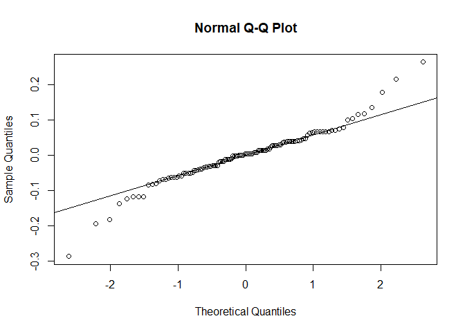<!-- -->

```
##                                  2.5 %      97.5 %
## .sig01                     0.068587746 0.164680139
## .sigma                     0.069111980 0.092050929
## (Intercept)                0.634542542 0.750751174
## Treatment1                 0.014986031 0.044886544
## Population1               -0.002215050 0.113993582
## Treatment1:Population1    -0.017372017 0.012528496
## TreatmentCurrent:Chamber1 -0.004822676 0.037252042
## TreatmentFuture:Chamber1  -0.039765038 0.001818416
```

``` r
emergence_anov_22 <- do_anov2(emergence_lm_22)
```

```
## Type III Analysis of Variance Table with Satterthwaite's method
##                        Sum Sq  Mean Sq NumDF  DenDF F value     Pr(>F)    
## Treatment            0.129859 0.129859     1 91.777 19.9336 0.00002277 ***
## Population           0.022265 0.022265     1 11.196  3.4178    0.09106 .  
## Treatment:Population 0.000539 0.000539     1 91.472  0.0827    0.77430    
## Treatment:Chamber    0.035658 0.017829     2 91.324  2.7368    0.07009 .  
## ---
## Signif. codes:  0 '***' 0.001 '**' 0.01 '*' 0.05 '.' 0.1 ' ' 1
```

``` r
emergence_anov_22$trait <- "Emergence"
emergence_means_22 <- get_table_bt(emergence_lm_22)
# no interaction
```

Days between emergence and bolting

``` r
# days emergence to bolting
bolting_lm_22 <- do_lmer2(Dat_2022$EmergenceToBolting)
```

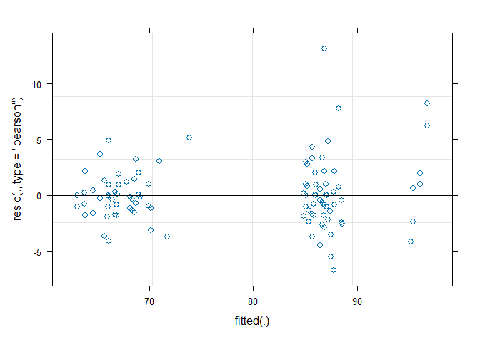<!-- --><!-- --><!-- -->

```
## [1] "the number of complete cases is 113"
```

```
## Linear mixed model fit by REML. t-tests use Satterthwaite's method [
## lmerModLmerTest]
## Formula: 
## trait ~ Treatment * Population + Treatment:Chamber + (1 | Population:Line)
##    Data: data
## 
## REML criterion at convergence: 596.7
## 
## Scaled residuals: 
##     Min      1Q  Median      3Q     Max 
## -2.2202 -0.5600 -0.0418  0.3258  4.3449 
## 
## Random effects:
##  Groups          Name        Variance Std.Dev.
##  Population:Line (Intercept) 10.011   3.164   
##  Residual                     9.141   3.023   
## Number of obs: 113, groups:  Population:Line, 16
## 
## Fixed effects:
##                            Estimate Std. Error        df t value     Pr(>|t|)
## (Intercept)                77.67604    0.85253  13.75834  91.113      < 2e-16
## Treatment1                  0.36471    0.28843  93.81339   1.264      0.20921
## Population1               -10.01749    0.85236  13.75125 -11.753 0.0000000148
## Treatment1:Population1      0.93323    0.28828  93.84112   3.237      0.00167
## TreatmentCurrent:Chamber1  -0.08781    0.40542  93.35913  -0.217      0.82900
## TreatmentFuture:Chamber1   -0.37577    0.40367  94.00569  -0.931      0.35430
##                              
## (Intercept)               ***
## Treatment1                   
## Population1               ***
## Treatment1:Population1    ** 
## TreatmentCurrent:Chamber1    
## TreatmentFuture:Chamber1     
## ---
## Signif. codes:  0 '***' 0.001 '**' 0.01 '*' 0.05 '.' 0.1 ' ' 1
## 
## Correlation of Fixed Effects:
##             (Intr) Trtmn1 Ppltn1 Tr1:P1 TrC:C1
## Treatment1   0.019                            
## Population1  0.039  0.024                     
## Trtmnt1:Pp1  0.025  0.125  0.020              
## TrtmntCr:C1 -0.005 -0.002 -0.005 -0.002       
## TrtmntFt:C1 -0.026  0.035 -0.018  0.009  0.000
```

```
## Computing profile confidence intervals ...
```

<!-- -->

```
##                                 2.5 %     97.5 %
## .sig01                      1.9787901  4.5449405
## .sigma                      2.5885838  3.4320976
## (Intercept)                76.0225532 79.3442471
## Treatment1                 -0.1961394  0.9220867
## Population1               -11.6703448 -8.3491502
## Treatment1:Population1      0.3731224  1.4906457
## TreatmentCurrent:Chamber1  -0.8696697  0.7029427
## TreatmentFuture:Chamber1   -1.1585300  0.4061086
```

``` r
bolting_anov_22 <- do_anov2(bolting_lm_22)
```

```
## Type III Analysis of Variance Table with Satterthwaite's method
##                       Sum Sq Mean Sq NumDF  DenDF  F value        Pr(>F)    
## Treatment              14.71   14.71     1 94.081   1.6097      0.207668    
## Population           1262.59 1262.59     1 13.751 138.1233 0.00000001481 ***
## Treatment:Population   95.80   95.80     1 93.841  10.4800      0.001668 ** 
## Treatment:Chamber       8.35    4.17     2 93.681   0.4567      0.634778    
## ---
## Signif. codes:  0 '***' 0.001 '**' 0.01 '*' 0.05 '.' 0.1 ' ' 1
```

``` r
bolting_anov_22$trait <- "Bolting"
bolting_means_22 <- get_table(bolting_lm_22)
```

There is an interaction, so do posthoc analyses.No chamber effect in full model, so not included here.


``` r
# belm
as.data.frame(summary(lmer(EmergenceToBolting ~ Treatment + (1|Population:Line), data = subset(Dat_2022, Population == "B")))$coefficients) # not concerened about the warnings
```

```
## Warning: contrasts dropped from factor Population due to missing levels
## Warning: contrasts dropped from factor Population due to missing levels
## Warning: contrasts dropped from factor Population due to missing levels
## Warning: contrasts dropped from factor Population due to missing levels
```

```
##              Estimate Std. Error        df   t value           Pr(>|t|)
## (Intercept) 67.655888  1.0280441  6.586274 65.810295 0.0000000001564546
## Treatment1   1.316612  0.2939341 41.271858  4.479277 0.0000581847771925
```

``` r
#roda
as.data.frame(summary(lmer(EmergenceToBolting ~ Treatment + (1|Population:Line), data = subset(Dat_2022, Population == "R")))$coefficients) # not concerened about the warnings
```

```
## Warning: contrasts dropped from factor Population due to missing levels
## Warning: contrasts dropped from factor Population due to missing levels
## Warning: contrasts dropped from factor Population due to missing levels
## Warning: contrasts dropped from factor Population due to missing levels
```

```
##               Estimate Std. Error        df   t value     Pr(>|t|)
## (Intercept) 87.6869845  1.3427946  7.022572 65.301860 4.874121e-11
## Treatment1  -0.5619845  0.4497706 54.049275 -1.249491 2.168693e-01
```

``` r
#cur
as.data.frame(summary(lmer(EmergenceToBolting ~ Population + (1|Population:Line), data = subset(Dat_2022, Treatment == "Current")))$coefficients) 
```

```
##              Estimate Std. Error       df   t value    Pr(>|t|)
## (Intercept) 78.015644  0.7686325 9.361182 101.49928 1.46741e-15
## Population1 -9.109356  0.7686325 9.361182 -11.85138 6.02129e-07
```

``` r
#fut
as.data.frame(summary(lmer(EmergenceToBolting ~ Population + (1|Population:Line), data = subset(Dat_2022, Treatment == "Future")))$coefficients)
```

```
##              Estimate Std. Error       df   t value     Pr(>|t|)
## (Intercept)  77.22157   1.031433 14.36729  74.86827 4.940811e-20
## Population1 -11.02596   1.031433 14.36729 -10.68995 3.156778e-08
```

 Not analyzing bolting to root washing or bolting to harvest. Those could be included as random effects, but most were close together. maybe should do analysis on if that should matter. should look at summary sheet to see. There do seem to be differences so the root washing traits (biomass) should have days to root wash as a random effect and other bolting day traits should have bolting to harvest as a random effect. might need to redo the model or not use the function to do this.
 
Not looking an number emerged because doesn't have a 2021 comparison for emergence success... ignoring but might want to look at later.

### Single Leaf Traits: bolting

Fresh weight

``` r
# single leaf fresh weight
fresh_lm_22 <- do_lmer2(Dat_2022$l10_SL_FreshWt)
```

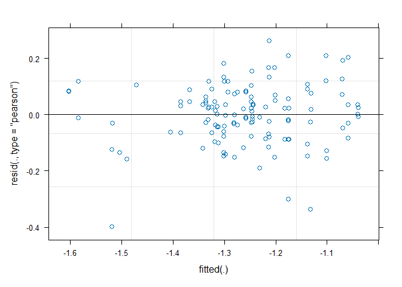<!-- --><!-- -->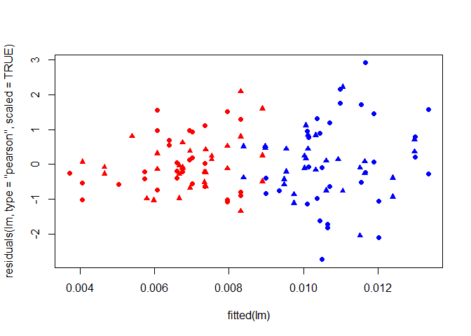<!-- -->

```
## [1] "the number of complete cases is 127"
```

```
## Linear mixed model fit by REML. t-tests use Satterthwaite's method [
## lmerModLmerTest]
## Formula: 
## trait ~ Treatment * Population + Treatment:Chamber + (1 | Population:Line)
##    Data: data
## 
## REML criterion at convergence: -129.6
## 
## Scaled residuals: 
##     Min      1Q  Median      3Q     Max 
## -3.5017 -0.5621  0.0157  0.6128  2.3040 
## 
## Random effects:
##  Groups          Name        Variance Std.Dev.
##  Population:Line (Intercept) 0.008922 0.09445 
##  Residual                    0.012981 0.11393 
## Number of obs: 127, groups:  Population:Line, 16
## 
## Fixed effects:
##                              Estimate  Std. Error          df t value Pr(>|t|)
## (Intercept)                -1.2751834   0.0261722  12.3819754 -48.723 1.59e-15
## Treatment1                  0.0568443   0.0101576 106.7430241   5.596 1.71e-07
## Population1                -0.0882698   0.0261686  12.3797341  -3.373  0.00532
## Treatment1:Population1     -0.0191415   0.0101589 106.7838418  -1.884  0.06226
## TreatmentCurrent:Chamber1   0.0003109   0.0143007 106.4133663   0.022  0.98270
## TreatmentFuture:Chamber1   -0.0091793   0.0144489 107.2319501  -0.635  0.52659
##                              
## (Intercept)               ***
## Treatment1                ***
## Population1               ** 
## Treatment1:Population1    .  
## TreatmentCurrent:Chamber1    
## TreatmentFuture:Chamber1     
## ---
## Signif. codes:  0 '***' 0.001 '**' 0.01 '*' 0.05 '.' 0.1 ' ' 1
## 
## Correlation of Fixed Effects:
##             (Intr) Trtmn1 Ppltn1 Tr1:P1 TrC:C1
## Treatment1   0.012                            
## Population1  0.035  0.019                     
## Trtmnt1:Pp1  0.019 -0.001  0.012              
## TrtmntCr:C1 -0.005  0.000 -0.005  0.000       
## TrtmntFt:C1 -0.019  0.008 -0.009 -0.018  0.002
```

```
## Computing profile confidence intervals ...
```

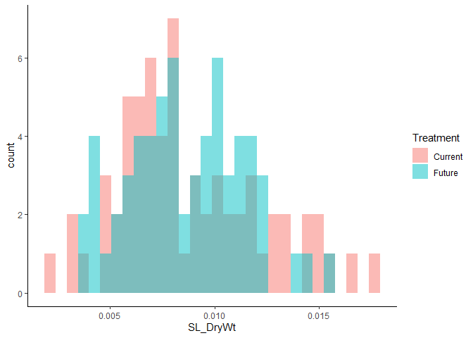<!-- -->

```
##                                 2.5 %        97.5 %
## .sig01                     0.05456799  0.1394255868
## .sigma                     0.09862586  0.1285834553
## (Intercept)               -1.32742293 -1.2249751742
## Treatment1                 0.03730415  0.0768432661
## Population1               -0.14052460 -0.0380774334
## Treatment1:Population1    -0.03869656  0.0008342726
## TreatmentCurrent:Chamber1 -0.02744503  0.0281182085
## TreatmentFuture:Chamber1  -0.03746390  0.0186998818
```

``` r
fresh_anov_22 <- do_anov2(fresh_lm_22)
```

```
## Type III Analysis of Variance Table with Satterthwaite's method
##                        Sum Sq  Mean Sq NumDF  DenDF F value     Pr(>F)    
## Treatment            0.239981 0.239981     1 107.19 18.4877 0.00003783 ***
## Population           0.147692 0.147692     1  12.38 11.3779   0.005318 ** 
## Treatment:Population 0.046084 0.046084     1 106.78  3.5503   0.062256 .  
## Treatment:Chamber    0.005246 0.002623     2 106.82  0.2021   0.817359    
## ---
## Signif. codes:  0 '***' 0.001 '**' 0.01 '*' 0.05 '.' 0.1 ' ' 1
```

``` r
fresh_anov_22$trait <- "l10_FreshWt"
fresh_means_22 <- get_table_bt(fresh_lm_22)
```

There is an interaction, so do posthoc analyses. No chamber effect in full model, so not included here.


``` r
# belm
as.data.frame(summary(lmer(l10_SL_FreshWt ~ Treatment + (1|Population:Line), data = subset(Dat_2022, Population == "B")))$coefficients) # not concerened about the warnings
```

```
## Warning: contrasts dropped from factor Population due to missing levels
## Warning: contrasts dropped from factor Population due to missing levels
## Warning: contrasts dropped from factor Population due to missing levels
## Warning: contrasts dropped from factor Population due to missing levels
```

```
##                Estimate Std. Error        df    t value         Pr(>|t|)
## (Intercept) -1.37229666 0.05073141  6.307426 -27.050235 0.00000009198563
## Treatment1   0.03601268 0.01375581 55.148274   2.617998 0.01139552966040
```

``` r
#roda
as.data.frame(summary(lmer(l10_SL_FreshWt ~ Treatment + (1|Population:Line), data = subset(Dat_2022, Population == "R")))$coefficients) # not concerened about the warnings
```

```
## Warning: contrasts dropped from factor Population due to missing levels
## Warning: contrasts dropped from factor Population due to missing levels
## Warning: contrasts dropped from factor Population due to missing levels
## Warning: contrasts dropped from factor Population due to missing levels
```

```
##                Estimate Std. Error        df    t value           Pr(>|t|)
## (Intercept) -1.18731870 0.02184455  7.028777 -54.353074 0.0000000001736361
## Treatment1   0.07639095 0.01466827 54.133626   5.207906 0.0000030402340048
```

``` r
#cur
as.data.frame(summary(lmer(l10_SL_FreshWt ~ Population + (1|Population:Line), data = subset(Dat_2022, Treatment == "Current")))$coefficients) 
```

```
##               Estimate Std. Error       df    t value     Pr(>|t|)
## (Intercept) -1.2134854 0.03652461 11.81436 -33.223777 4.911294e-13
## Population1 -0.1025577 0.03652461 11.81436  -2.807907 1.601939e-02
```

``` r
#fut
as.data.frame(summary(lmer(l10_SL_FreshWt ~ Population + (1|Population:Line), data = subset(Dat_2022, Treatment == "Future")))$coefficients)
```

```
##                Estimate Std. Error      df    t value     Pr(>|t|)
## (Intercept) -1.33091212 0.02040914 10.9194 -65.211580 1.675778e-15
## Population1 -0.06526035 0.02040914 10.9194  -3.197604 8.565675e-03
```


Saturated/Hydrated weight

``` r
# single leaf hydrated (also called saturated) weight
hyd_lm_22 <- do_lmer2(Dat_2022$l10_SL_HydWt)
```

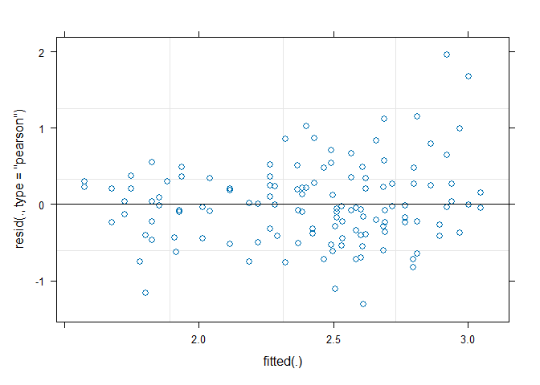<!-- -->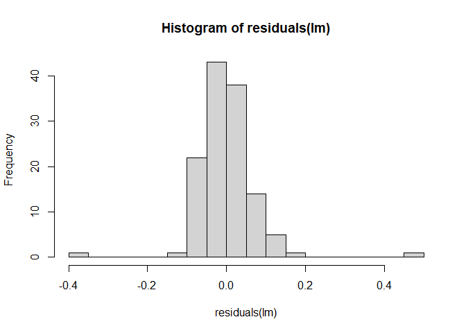<!-- -->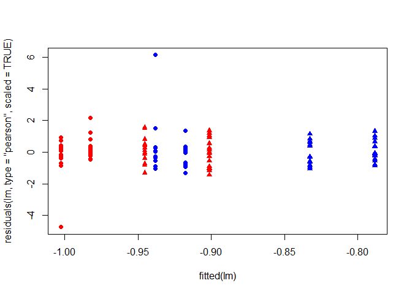<!-- -->

```
## [1] "the number of complete cases is 126"
```

```
## Linear mixed model fit by REML. t-tests use Satterthwaite's method [
## lmerModLmerTest]
## Formula: 
## trait ~ Treatment * Population + Treatment:Chamber + (1 | Population:Line)
##    Data: data
## 
## REML criterion at convergence: -127.6
## 
## Scaled residuals: 
##     Min      1Q  Median      3Q     Max 
## -3.6374 -0.5389  0.0137  0.5921  2.2783 
## 
## Random effects:
##  Groups          Name        Variance Std.Dev.
##  Population:Line (Intercept) 0.009201 0.09592 
##  Residual                    0.013016 0.11409 
## Number of obs: 126, groups:  Population:Line, 16
## 
## Fixed effects:
##                             Estimate Std. Error         df t value Pr(>|t|)    
## (Intercept)                -1.192566   0.026537  12.396080 -44.939 4.18e-15 ***
## Treatment1                  0.037950   0.010220 105.731483   3.713 0.000329 ***
## Population1                -0.079389   0.026530  12.391275  -2.992 0.010878 *  
## Treatment1:Population1     -0.024270   0.010223 105.814593  -2.374 0.019393 *  
## TreatmentCurrent:Chamber1   0.003295   0.014321 105.397279   0.230 0.818463    
## TreatmentFuture:Chamber1   -0.010582   0.014610 106.301718  -0.724 0.470481    
## ---
## Signif. codes:  0 '***' 0.001 '**' 0.01 '*' 0.05 '.' 0.1 ' ' 1
## 
## Correlation of Fixed Effects:
##             (Intr) Trtmn1 Ppltn1 Tr1:P1 TrC:C1
## Treatment1   0.008                            
## Population1  0.033  0.022                     
## Trtmnt1:Pp1  0.023 -0.010  0.008              
## TrtmntCr:C1 -0.005  0.000 -0.005  0.000       
## TrtmntFt:C1 -0.024  0.021 -0.004 -0.031  0.002
```

```
## Computing profile confidence intervals ...
```

<!-- -->

```
##                                 2.5 %       97.5 %
## .sig01                     0.05562091  0.141472707
## .sigma                     0.09868873  0.128821965
## (Intercept)               -1.24551407 -1.141649966
## Treatment1                 0.01830131  0.058093015
## Population1               -0.13238231 -0.028511484
## Treatment1:Population1    -0.04395713 -0.004190417
## TreatmentCurrent:Chamber1 -0.02449199  0.031144174
## TreatmentFuture:Chamber1  -0.03914506  0.017627404
```

``` r
hyd_anov_22 <- do_anov2(hyd_lm_22)
```

```
## Type III Analysis of Variance Table with Satterthwaite's method
##                        Sum Sq  Mean Sq NumDF   DenDF F value   Pr(>F)   
## Treatment            0.127458 0.127458     1 106.169  9.7924 0.002263 **
## Population           0.116553 0.116553     1  12.391  8.9546 0.010878 * 
## Treatment:Population 0.073364 0.073364     1 105.815  5.6365 0.019393 * 
## Treatment:Chamber    0.007524 0.003762     2 105.847  0.2890 0.749582   
## ---
## Signif. codes:  0 '***' 0.001 '**' 0.01 '*' 0.05 '.' 0.1 ' ' 1
```

``` r
hyd_anov_22$trait <- "l10_SatWt"
hyd_means_22 <- get_table_bt(hyd_lm_22)
## also has SQR transformation. Pop becomes more significant but no other significance changes
#hyd_lm_22SQR <- do_lmer2(Dat_2022$SQR_SL_HydWt)
#hyd_anov_22SQR <- do_anov2(hyd_lm_22SQR)
#hyd_anov_22SQR$trait <- "l10_SatWt"
```

There is an interaction, so do posthoc analyses. No chamber effect in full model, so not included here.


``` r
# belm
as.data.frame(summary(lmer(l10_SL_HydWt ~ Treatment + (1|Population:Line), data = subset(Dat_2022, Population == "B")))$coefficients) # not concerened about the warnings
```

```
## Warning: contrasts dropped from factor Population due to missing levels
## Warning: contrasts dropped from factor Population due to missing levels
## Warning: contrasts dropped from factor Population due to missing levels
## Warning: contrasts dropped from factor Population due to missing levels
```

```
##                Estimate Std. Error        df     t value        Pr(>|t|)
## (Intercept) -1.28176047 0.05250455  6.357457 -24.4123707 0.0000001592724
## Treatment1   0.01180838 0.01350718 55.127536   0.8742297 0.3857858636311
```

``` r
#roda
as.data.frame(summary(lmer(l10_SL_HydWt ~ Treatment + (1|Population:Line), data = subset(Dat_2022, Population == "R")))$coefficients) # not concerened about the warnings
```

```
## Warning: contrasts dropped from factor Population due to missing levels
## Warning: contrasts dropped from factor Population due to missing levels
## Warning: contrasts dropped from factor Population due to missing levels
## Warning: contrasts dropped from factor Population due to missing levels
```

```
##                Estimate Std. Error        df    t value           Pr(>|t|)
## (Intercept) -1.11444927 0.01994442  6.889696 -55.877756 0.0000000002059373
## Treatment1   0.06349202 0.01510585 53.118404   4.203141 0.0001013198507561
```

``` r
#cur
as.data.frame(summary(lmer(l10_SL_HydWt ~ Population + (1|Population:Line), data = subset(Dat_2022, Treatment == "Current")))$coefficients) 
```

```
##                Estimate Std. Error       df    t value     Pr(>|t|)
## (Intercept) -1.14841681 0.03598646 11.75554 -31.912470 8.733716e-13
## Population1 -0.09745955 0.03598646 11.75554  -2.708228 1.932085e-02
```

``` r
#fut
as.data.frame(summary(lmer(l10_SL_HydWt ~ Population + (1|Population:Line), data = subset(Dat_2022, Treatment == "Future")))$coefficients)
```

```
##                Estimate Std. Error       df    t value     Pr(>|t|)
## (Intercept) -1.23035099 0.02117863 11.11552 -58.093991 3.678550e-15
## Population1 -0.05128456 0.02117863 11.11552  -2.421524 3.370357e-02
```


Dried weight

``` r
# single leaf dry weight
dry_lm_22 <- do_lmer2(Dat_2022$SL_DryWt)
```

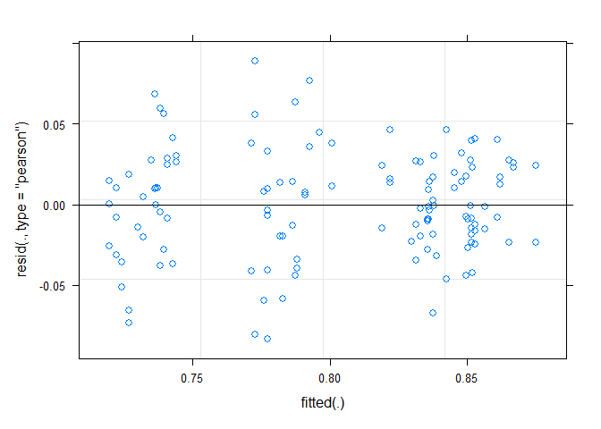<!-- -->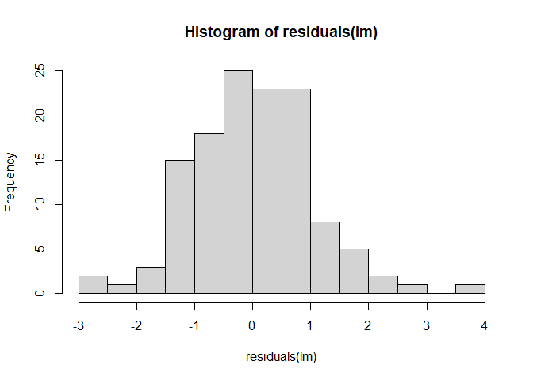<!-- --><!-- -->

```
## [1] "the number of complete cases is 127"
```

```
## Linear mixed model fit by REML. t-tests use Satterthwaite's method [
## lmerModLmerTest]
## Formula: 
## trait ~ Treatment * Population + Treatment:Chamber + (1 | Population:Line)
##    Data: data
## 
## REML criterion at convergence: -1110.2
## 
## Scaled residuals: 
##     Min      1Q  Median      3Q     Max 
## -2.7379 -0.5791 -0.1121  0.5190  2.9141 
## 
## Random effects:
##  Groups          Name        Variance    Std.Dev.
##  Population:Line (Intercept) 0.000002155 0.001468
##  Residual                    0.000004014 0.002003
## Number of obs: 127, groups:  Population:Line, 16
## 
## Fixed effects:
##                                Estimate    Std. Error            df t value
## (Intercept)                 0.008525292   0.000416158  13.130449208  20.486
## Treatment1                  0.000004994   0.000178548 107.764900581   0.028
## Population1                -0.002203303   0.000416097  13.128761022  -5.295
## Treatment1:Population1     -0.000241410   0.000178567 107.803262291  -1.352
## TreatmentCurrent:Chamber1  -0.000172177   0.000251410 107.478252426  -0.685
## TreatmentFuture:Chamber1    0.000292407   0.000253924 108.209685406   1.152
##                           Pr(>|t|)    
## (Intercept)               2.37e-11 ***
## Treatment1                 0.97774    
## Population1                0.00014 ***
## Treatment1:Population1     0.17923    
## TreatmentCurrent:Chamber1  0.49491    
## TreatmentFuture:Chamber1   0.25204    
## ---
## Signif. codes:  0 '***' 0.001 '**' 0.01 '*' 0.05 '.' 0.1 ' ' 1
## 
## Correlation of Fixed Effects:
##             (Intr) Trtmn1 Ppltn1 Tr1:P1 TrC:C1
## Treatment1   0.011                            
## Population1  0.038  0.019                     
## Trtmnt1:Pp1  0.019 -0.001  0.011              
## TrtmntCr:C1 -0.005  0.000 -0.005  0.000       
## TrtmntFt:C1 -0.019  0.008 -0.008 -0.017  0.001
```

```
## Computing profile confidence intervals ...
```

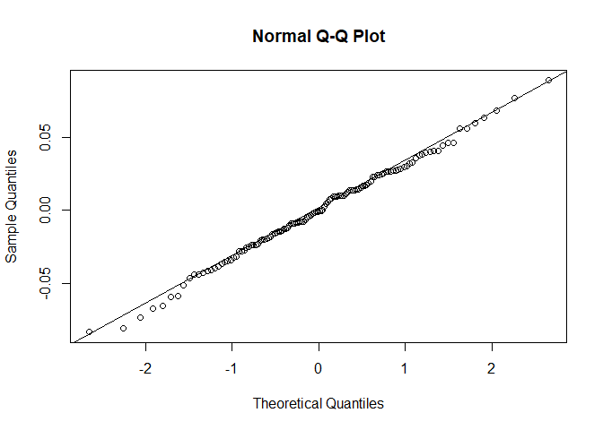<!-- -->

```
##                                   2.5 %        97.5 %
## .sig01                     0.0008372766  0.0021758224
## .sigma                     0.0017345818  0.0022582129
## (Intercept)                0.0076988658  0.0093250630
## Treatment1                -0.0003390982  0.0003549110
## Population1               -0.0030301218 -0.0014038831
## Treatment1:Population1    -0.0005858582  0.0001080053
## TreatmentCurrent:Chamber1 -0.0006598584  0.0003163963
## TreatmentFuture:Chamber1  -0.0002031777  0.0007829750
```

``` r
dry_anov_22 <- do_anov2(dry_lm_22)
```

```
## Type III Analysis of Variance Table with Satterthwaite's method
##                           Sum Sq     Mean Sq NumDF   DenDF F value    Pr(>F)
## Treatment            0.000003272 0.000003272     1 108.163  0.8153 0.3685734
## Population           0.000112541 0.000112541     1  13.129 28.0389 0.0001404
## Treatment:Population 0.000007336 0.000007336     1 107.803  1.8277 0.1792277
## Treatment:Chamber    0.000007214 0.000003607     2 107.843  0.8987 0.4101213
##                         
## Treatment               
## Population           ***
## Treatment:Population    
## Treatment:Chamber       
## ---
## Signif. codes:  0 '***' 0.001 '**' 0.01 '*' 0.05 '.' 0.1 ' ' 1
```

``` r
dry_anov_22$trait <- "DriedWt"
dry_means_22 <- get_table(dry_lm_22)
# also has SQR transformation
# no interaction

# what about SQR transformation - no meaningful change
#anov_lmer2(Dat_2022$SQR_SL_DryWt)

# and what about l10 transformation - no meaningful change
#anov_lmer2(log10(Dat_2022$SL_DryWt))
```

No interaction but do individual models to see difference in future environment. no chamber effect in full model so not included here


``` r
# belm
as.data.frame(summary(lmer(SL_DryWt ~ Treatment + (1|Population:Line), data = subset(Dat_2022, Population == "B")))$coefficients) # not concerened about the warnings
```

```
## Warning: contrasts dropped from factor Population due to missing levels
## Warning: contrasts dropped from factor Population due to missing levels
## Warning: contrasts dropped from factor Population due to missing levels
## Warning: contrasts dropped from factor Population due to missing levels
```

```
##                  Estimate   Std. Error        df   t value      Pr(>|t|)
## (Intercept)  0.0062258394 0.0006428229  6.492696  9.685155 0.00004272517
## Treatment1  -0.0002549481 0.0001943122 55.507640 -1.312054 0.19490214432
```

``` r
#roda
as.data.frame(summary(lmer(SL_DryWt ~ Treatment + (1|Population:Line), data = subset(Dat_2022, Population == "R")))$coefficients) # not concerened about the warnings
```

```
## Warning: contrasts dropped from factor Population due to missing levels
## Warning: contrasts dropped from factor Population due to missing levels
## Warning: contrasts dropped from factor Population due to missing levels
## Warning: contrasts dropped from factor Population due to missing levels
```

```
##                 Estimate   Std. Error        df  t value        Pr(>|t|)
## (Intercept) 0.0107318229 0.0005389559  7.038242 19.91225 0.0000001895476
## Treatment1  0.0002431771 0.0003004783 54.111055  0.80930 0.4218870666026
```

``` r
#cur
as.data.frame(summary(lmer(SL_DryWt ~ Population + (1|Population:Line), data = subset(Dat_2022, Treatment == "Current")))$coefficients) 
```

```
##                 Estimate   Std. Error       df   t value         Pr(>|t|)
## (Intercept)  0.008646582 0.0004992591 11.37159 17.318827 0.00000000158023
## Population1 -0.002328418 0.0004992591 11.37159 -4.663746 0.00063120474730
```

``` r
#fut
as.data.frame(summary(lmer(SL_DryWt ~ Population + (1|Population:Line), data = subset(Dat_2022, Treatment == "Future")))$coefficients)
```

```
##                 Estimate   Std. Error       df   t value     Pr(>|t|)
## (Intercept)  0.008518235 0.0003872323 13.92292 21.997740 3.266733e-12
## Population1 -0.001939112 0.0003872323 13.92292 -5.007621 1.949901e-04
```

leaf area

``` r
# single leaf area
area_lm_22 <- do_lmer2(Dat_2022$SL_Area)
```

<!-- --><!-- -->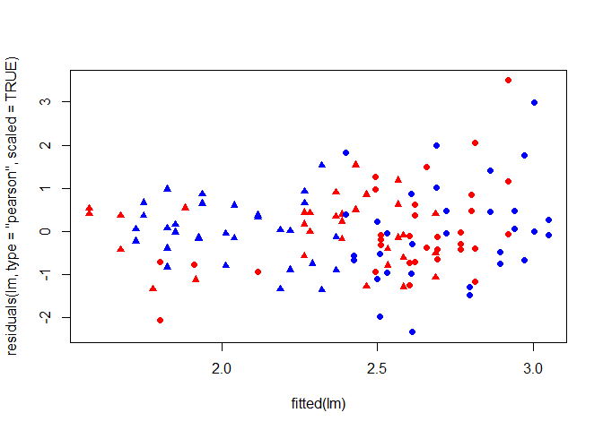<!-- -->

```
## [1] "the number of complete cases is 127"
```

```
## Linear mixed model fit by REML. t-tests use Satterthwaite's method [
## lmerModLmerTest]
## Formula: 
## trait ~ Treatment * Population + Treatment:Chamber + (1 | Population:Line)
##    Data: data
## 
## REML criterion at convergence: 249.6
## 
## Scaled residuals: 
##     Min      1Q  Median      3Q     Max 
## -2.3367 -0.6544 -0.0584  0.4826  3.4995 
## 
## Random effects:
##  Groups          Name        Variance Std.Dev.
##  Population:Line (Intercept) 0.1230   0.3507  
##  Residual                    0.3135   0.5599  
## Number of obs: 127, groups:  Population:Line, 16
## 
## Fixed effects:
##                            Estimate Std. Error        df t value Pr(>|t|)    
## (Intercept)                 2.35413    0.10300  11.87300  22.855 3.51e-11 ***
## Treatment1                  0.22697    0.04987 106.69936   4.551 1.42e-05 ***
## Population1                -0.02561    0.10299  11.87248  -0.249   0.8079    
## Treatment1:Population1     -0.11142    0.04988 106.73938  -2.234   0.0276 *  
## TreatmentCurrent:Chamber1   0.05410    0.07024 106.43719   0.770   0.4429    
## TreatmentFuture:Chamber1   -0.05114    0.07091 107.14650  -0.721   0.4723    
## ---
## Signif. codes:  0 '***' 0.001 '**' 0.01 '*' 0.05 '.' 0.1 ' ' 1
## 
## Correlation of Fixed Effects:
##             (Intr) Trtmn1 Ppltn1 Tr1:P1 TrC:C1
## Treatment1   0.010                            
## Population1  0.040  0.019                     
## Trtmnt1:Pp1  0.019 -0.002  0.010              
## TrtmntCr:C1 -0.005  0.000 -0.005  0.000       
## TrtmntFt:C1 -0.019  0.009 -0.007 -0.016  0.001
```

```
## Computing profile confidence intervals ...
```

<!-- -->

```
##                                 2.5 %      97.5 %
## .sig01                     0.17259745  0.53631785
## .sigma                     0.48473123  0.63222932
## (Intercept)                2.14707434  2.55116765
## Treatment1                 0.13108146  0.32531545
## Population1               -0.23285314  0.17133450
## Treatment1:Population1    -0.20743423 -0.01330760
## TreatmentCurrent:Chamber1 -0.08246602  0.19048548
## TreatmentFuture:Chamber1  -0.18967204  0.08593541
```

``` r
area_anov_22 <- do_anov2(area_lm_22)
```

```
## Type III Analysis of Variance Table with Satterthwaite's method
##                      Sum Sq Mean Sq NumDF   DenDF F value    Pr(>F)    
## Treatment            4.9582  4.9582     1 107.087 15.8164 0.0001271 ***
## Population           0.0194  0.0194     1  11.872  0.0618 0.8078759    
## Treatment:Population 1.5642  1.5642     1 106.739  4.9898 0.0275829 *  
## Treatment:Chamber    0.3495  0.1748     2 106.790  0.5575 0.5743097    
## ---
## Signif. codes:  0 '***' 0.001 '**' 0.01 '*' 0.05 '.' 0.1 ' ' 1
```

``` r
area_anov_22$trait <- "Area"
area_means_22 <- get_table(area_lm_22)
## also has SQR - no significance changes
#area_lm_22SQR <- do_lmer2(Dat_2022$SQR_SL_Area)
#area_anov_22SQR <- do_anov2(area_lm_22SQR)
#area_anov_22SQR$trait <- "SQR_Area"
```


There is an interaction, so do posthoc analyses. No chamber effect in full model, so not included here.


``` r
# belm
as.data.frame(summary(lmer(SL_Area ~ Treatment + (1|Population:Line), data = subset(Dat_2022, Population == "B")))$coefficients) # not concerened about the warnings
```

```
## Warning: contrasts dropped from factor Population due to missing levels
## Warning: contrasts dropped from factor Population due to missing levels
## Warning: contrasts dropped from factor Population due to missing levels
## Warning: contrasts dropped from factor Population due to missing levels
```

```
##              Estimate Std. Error        df   t value      Pr(>|t|)
## (Intercept) 2.2912687 0.19289568  5.937253 11.878279 0.00002322074
## Treatment1  0.1080815 0.06832997 55.203990  1.581758 0.11941790850
```

``` r
#roda
as.data.frame(summary(lmer(SL_Area ~ Treatment + (1|Population:Line), data = subset(Dat_2022, Population == "R")))$coefficients) # not concerened about the warnings
```

```
## Warning: contrasts dropped from factor Population due to missing levels
## Warning: contrasts dropped from factor Population due to missing levels
## Warning: contrasts dropped from factor Population due to missing levels
## Warning: contrasts dropped from factor Population due to missing levels
```

```
##              Estimate Std. Error        df   t value         Pr(>|t|)
## (Intercept) 2.3777023 0.10082154  7.004574 23.583278 0.00000006210662
## Treatment1  0.3404227 0.07174914 54.122333  4.744625 0.00001566176837
```

``` r
#cur
as.data.frame(summary(lmer(SL_Area ~ Population + (1|Population:Line), data = subset(Dat_2022, Treatment == "Current")))$coefficients) 
```

```
##               Estimate Std. Error       df   t value          Pr(>|t|)
## (Intercept)  2.5986086  0.1459646 11.39526 17.803000 0.000000001133176
## Population1 -0.1195164  0.1459646 11.39526 -0.818804 0.429689624921292
```

``` r
#fut
as.data.frame(summary(lmer(SL_Area ~ Population + (1|Population:Line), data = subset(Dat_2022, Treatment == "Future")))$coefficients)
```

```
##              Estimate Std. Error       df   t value     Pr(>|t|)
## (Intercept) 2.1333955 0.08484646 10.68332 25.144191 7.504112e-11
## Population1 0.1035258 0.08484646 10.68332  1.220155 2.486556e-01
```

leaf perimeter

``` r
# single leaf perimeter
per_lm_22 <- do_lmer2(Dat_2022$SL_Perim)
```

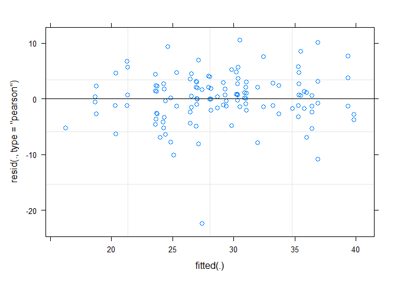<!-- --><!-- --><!-- -->

```
## [1] "the number of complete cases is 127"
```

```
## Linear mixed model fit by REML. t-tests use Satterthwaite's method [
## lmerModLmerTest]
## Formula: 
## trait ~ Treatment * Population + Treatment:Chamber + (1 | Population:Line)
##    Data: data
## 
## REML criterion at convergence: 417.3
## 
## Scaled residuals: 
##     Min      1Q  Median      3Q     Max 
## -2.6520 -0.6000 -0.0246  0.5986  3.3693 
## 
## Random effects:
##  Groups          Name        Variance Std.Dev.
##  Population:Line (Intercept) 0.5403   0.735   
##  Residual                    1.2418   1.114   
## Number of obs: 127, groups:  Population:Line, 16
## 
## Fixed effects:
##                            Estimate Std. Error        df t value Pr(>|t|)    
## (Intercept)                 7.92219    0.21319  12.05151  37.161 8.38e-14 ***
## Treatment1                  0.29219    0.09928 106.80223   2.943  0.00399 ** 
## Population1                -0.19721    0.21315  12.05061  -0.925  0.37301    
## Treatment1:Population1     -0.21530    0.09929 106.84246  -2.168  0.03234 *  
## TreatmentCurrent:Chamber1   0.12597    0.13981 106.52570   0.901  0.36959    
## TreatmentFuture:Chamber1   -0.15466    0.14117 107.25684  -1.096  0.27571    
## ---
## Signif. codes:  0 '***' 0.001 '**' 0.01 '*' 0.05 '.' 0.1 ' ' 1
## 
## Correlation of Fixed Effects:
##             (Intr) Trtmn1 Ppltn1 Tr1:P1 TrC:C1
## Treatment1   0.010                            
## Population1  0.040  0.019                     
## Trtmnt1:Pp1  0.019 -0.002  0.011              
## TrtmntCr:C1 -0.005  0.000 -0.005  0.000       
## TrtmntFt:C1 -0.019  0.009 -0.007 -0.016  0.001
```

```
## Computing profile confidence intervals ...
```

<!-- -->

```
##                                2.5 %      97.5 %
## .sig01                     0.3774757  1.11417862
## .sigma                     0.9647337  1.25805010
## (Intercept)                7.4947242  8.33035943
## Treatment1                 0.1012749  0.48783360
## Population1               -0.6248483  0.21081333
## Treatment1:Population1    -0.4063641 -0.01990473
## TreatmentCurrent:Chamber1 -0.1457850  0.39747057
## TreatmentFuture:Chamber1  -0.4309340  0.11783177
```

``` r
per_anov_22 <- do_anov2(per_lm_22)
```

```
## Type III Analysis of Variance Table with Satterthwaite's method
##                       Sum Sq Mean Sq NumDF   DenDF F value   Pr(>F)   
## Treatment            11.8595 11.8595     1 107.201  9.5506 0.002547 **
## Population            1.0630  1.0630     1  12.051  0.8560 0.373009   
## Treatment:Population  5.8392  5.8392     1 106.842  4.7024 0.032339 * 
## Treatment:Chamber     2.5022  1.2511     2 106.890  1.0075 0.368565   
## ---
## Signif. codes:  0 '***' 0.001 '**' 0.01 '*' 0.05 '.' 0.1 ' ' 1
```

``` r
per_anov_22$trait <- "Perimeter"
per_means_22 <- get_table(per_lm_22)
```

There is an interaction, so do posthoc analyses. No chamber effect in full model, so not included here.


``` r
# belm
as.data.frame(summary(lmer(SL_Perim ~ Treatment + (1|Population:Line), data = subset(Dat_2022, Population == "B")))$coefficients) # not concerened about the warnings
```

```
## Warning: contrasts dropped from factor Population due to missing levels
## Warning: contrasts dropped from factor Population due to missing levels
## Warning: contrasts dropped from factor Population due to missing levels
## Warning: contrasts dropped from factor Population due to missing levels
```

```
##               Estimate Std. Error        df    t value       Pr(>|t|)
## (Intercept) 7.63873479  0.4032339  6.074683 18.9436813 0.000001237704
## Treatment1  0.05928602  0.1302239 55.180912  0.4552623 0.650706847155
```

``` r
#roda
as.data.frame(summary(lmer(SL_Perim ~ Treatment + (1|Population:Line), data = subset(Dat_2022, Population == "R")))$coefficients) # not concerened about the warnings
```

```
## Warning: contrasts dropped from factor Population due to missing levels
## Warning: contrasts dropped from factor Population due to missing levels
## Warning: contrasts dropped from factor Population due to missing levels
## Warning: contrasts dropped from factor Population due to missing levels
```

```
##              Estimate Std. Error        df t value          Pr(>|t|)
## (Intercept) 8.1151438  0.2074853  7.074167 39.1119 0.000000001572576
## Treatment1  0.5117624  0.1491497 54.192520  3.4312 0.001157144610434
```

``` r
#cur
as.data.frame(summary(lmer(SL_Perim ~ Population + (1|Population:Line), data = subset(Dat_2022, Treatment == "Current")))$coefficients) 
```

```
##               Estimate Std. Error       df   t value     Pr(>|t|)
## (Intercept)  8.2384250  0.3037568 10.94359 27.121779 2.190245e-11
## Population1 -0.3884812  0.3037568 10.94359 -1.278922 2.273786e-01
```

``` r
#fut
as.data.frame(summary(lmer(SL_Perim ~ Population + (1|Population:Line), data = subset(Dat_2022, Treatment == "Future")))$coefficients)
```

```
##               Estimate Std. Error       df    t value     Pr(>|t|)
## (Intercept) 7.63890345  0.1796868 11.42036 42.5123174 6.172560e-14
## Population1 0.05354338  0.1796868 11.42036  0.2979817 7.710685e-01
```

specific leaf area

``` r
# SLA
sla_lm_22 <- do_lmer2(Dat_2022$l10_SLA)
```

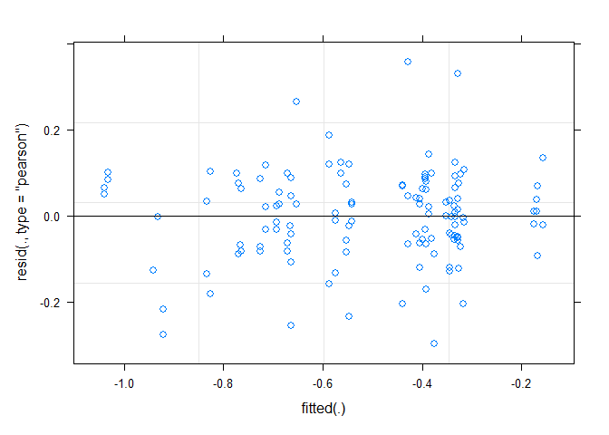<!-- -->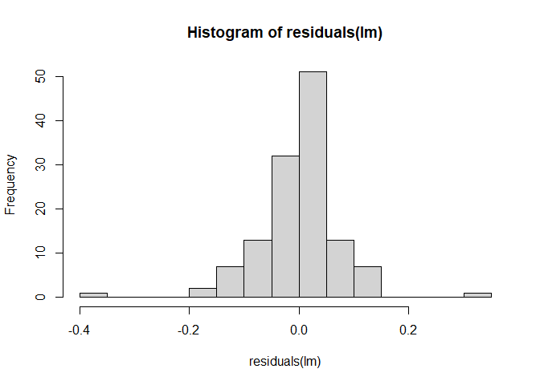<!-- --><!-- -->

```
## [1] "the number of complete cases is 127"
```

```
## Linear mixed model fit by REML. t-tests use Satterthwaite's method [
## lmerModLmerTest]
## Formula: 
## trait ~ Treatment * Population + Treatment:Chamber + (1 | Population:Line)
##    Data: data
## 
## REML criterion at convergence: -238.6
## 
## Scaled residuals: 
##     Min      1Q  Median      3Q     Max 
## -4.5714 -0.4464  0.1081  0.4762  4.3116 
## 
## Random effects:
##  Groups          Name        Variance  Std.Dev.
##  Population:Line (Intercept) 0.0007804 0.02794 
##  Residual                    0.0059913 0.07740 
## Number of obs: 127, groups:  Population:Line, 16
## 
## Fixed effects:
##                             Estimate Std. Error         df t value
## (Intercept)                 2.453514   0.010002  14.049693 245.298
## Treatment1                  0.043342   0.006884 109.894072   6.296
## Population1                 0.111143   0.010001  14.054733  11.113
## Treatment1:Population1     -0.011178   0.006884 109.918842  -1.624
## TreatmentCurrent:Chamber1   0.016833   0.009697 109.847568   1.736
## TreatmentFuture:Chamber1   -0.022281   0.009782 110.196317  -2.278
##                                Pr(>|t|)    
## (Intercept)                     < 2e-16 ***
## Treatment1                0.00000000643 ***
## Population1               0.00000002393 ***
## Treatment1:Population1           0.1073    
## TreatmentCurrent:Chamber1        0.0854 .  
## TreatmentFuture:Chamber1         0.0247 *  
## ---
## Signif. codes:  0 '***' 0.001 '**' 0.01 '*' 0.05 '.' 0.1 ' ' 1
## 
## Correlation of Fixed Effects:
##             (Intr) Trtmn1 Ppltn1 Tr1:P1 TrC:C1
## Treatment1   0.004                            
## Population1  0.036  0.016                     
## Trtmnt1:Pp1  0.016 -0.005  0.004              
## TrtmntCr:C1 -0.004  0.000 -0.004  0.000       
## TrtmntFt:C1 -0.016  0.011  0.001 -0.014  0.001
```

```
## Computing profile confidence intervals ...
```

<!-- -->

```
##                                  2.5 %       97.5 %
## .sig01                     0.000000000  0.046885570
## .sigma                     0.067052567  0.087054950
## (Intercept)                2.434078195  2.472997266
## Treatment1                 0.029979172  0.056683753
## Population1                0.091710362  0.130624022
## Treatment1:Population1    -0.024542210  0.002163110
## TreatmentCurrent:Chamber1 -0.002099958  0.035539735
## TreatmentFuture:Chamber1  -0.041180405 -0.003226982
```

``` r
sla_anov_22 <- do_anov2(sla_lm_22)
```

```
## Type III Analysis of Variance Table with Satterthwaite's method
##                       Sum Sq Mean Sq NumDF   DenDF  F value         Pr(>F)    
## Treatment            0.25199 0.25199     1 110.096  42.0583 0.000000002598 ***
## Population           0.73997 0.73997     1  14.055 123.5065 0.000000023925 ***
## Treatment:Population 0.01580 0.01580     1 109.919   2.6368        0.10728    
## Treatment:Chamber    0.04918 0.02459     2 110.021   4.1047        0.01909 *  
## ---
## Signif. codes:  0 '***' 0.001 '**' 0.01 '*' 0.05 '.' 0.1 ' ' 1
```

``` r
sla_anov_22$trait <- "l10_SLA"
sla_means_22 <- get_table_bt(sla_lm_22)
```

There is an interaction, so do posthoc analyses. There is a chamber effect in full model, so included here.


``` r
# belm
as.data.frame(summary(lmer(l10_SLA ~ Treatment + Treatment:Chamber + (1|Population:Line), data = subset(Dat_2022, Population == "B")))$coefficients) # not concerned about the warnings
```

```
## Warning: contrasts dropped from factor Population due to missing levels
## Warning: contrasts dropped from factor Population due to missing levels
## Warning: contrasts dropped from factor Population due to missing levels
## Warning: contrasts dropped from factor Population due to missing levels
```

```
##                              Estimate Std. Error        df    t value
## (Intercept)                2.56447427 0.01708440  6.545188 150.106158
## Treatment1                 0.03218684 0.01052636 55.036505   3.057738
## TreatmentCurrent:Chamber1  0.03638408 0.01489729 55.012453   2.442329
## TreatmentFuture:Chamber1  -0.01970605 0.01490111 55.223097  -1.322455
##                               Pr(>|t|)
## (Intercept)               7.986068e-13
## Treatment1                3.439386e-03
## TreatmentCurrent:Chamber1 1.783366e-02
## TreatmentFuture:Chamber1  1.914678e-01
```

``` r
#roda
as.data.frame(summary(lmer(l10_SLA ~ Treatment + Treatment:Chamber + (1|Population:Line), data = subset(Dat_2022, Population == "R")))$coefficients) # not concerened about the warnings
```

```
## Warning: contrasts dropped from factor Population due to missing levels
## Warning: contrasts dropped from factor Population due to missing levels
## Warning: contrasts dropped from factor Population due to missing levels
## Warning: contrasts dropped from factor Population due to missing levels
```

```
##                               Estimate  Std. Error        df    t value
## (Intercept)                2.342418840 0.011336121  7.125978 206.633191
## Treatment1                 0.054472277 0.008616462 52.260210   6.321885
## TreatmentCurrent:Chamber1 -0.002224467 0.012080039 52.135192  -0.184144
## TreatmentFuture:Chamber1  -0.025062781 0.012290089 52.380320  -2.039268
##                               Pr(>|t|)
## (Intercept)               1.001640e-14
## Treatment1                5.841871e-08
## TreatmentCurrent:Chamber1 8.546148e-01
## TreatmentFuture:Chamber1  4.648294e-02
```

``` r
#cur
as.data.frame(summary(lmer(l10_SLA ~ Population + Chamber + (1|Population:Line), data = subset(Dat_2022, Treatment == "Current")))$coefficients) 
```

```
##               Estimate Std. Error       df    t value     Pr(>|t|)
## (Intercept) 2.49634699 0.01085598 13.36983 229.951302 1.920704e-25
## Population1 0.09945587 0.01085598 13.36983   9.161389 3.945664e-07
## Chamber1    0.01609897 0.01006237 51.45589   1.599919 1.157393e-01
```

``` r
#fut
as.data.frame(summary(lmer(l10_SLA ~ Population + Chamber + (1|Population:Line), data = subset(Dat_2022, Treatment == "Future")))$coefficients)
```

```
##                Estimate  Std. Error       df    t value     Pr(>|t|)
## (Intercept)  2.41080734 0.015400107 15.16210 156.544842 9.518015e-26
## Population1  0.12323046 0.015396505 15.15973   8.003795 7.966966e-07
## Chamber1    -0.02241467 0.007966659 48.40553  -2.813560 7.061111e-03
```


leaf dry matter content

``` r
# leaf dry matter content
ldmc_lm_22 <- do_lmer2(Dat_2022$l10_LDMC)
```

```
## boundary (singular) fit: see help('isSingular')
```

<!-- --><!-- --><!-- -->

```
## [1] "the number of complete cases is 126"
```

```
## Linear mixed model fit by REML. t-tests use Satterthwaite's method [
## lmerModLmerTest]
## Formula: 
## trait ~ Treatment * Population + Treatment:Chamber + (1 | Population:Line)
##    Data: data
## 
## REML criterion at convergence: -256.5
## 
## Scaled residuals: 
##     Min      1Q  Median      3Q     Max 
## -4.7294 -0.5346 -0.0458  0.3678  6.1353 
## 
## Random effects:
##  Groups          Name        Variance Std.Dev.
##  Population:Line (Intercept) 0.000000 0.00000 
##  Residual                    0.005484 0.07406 
## Number of obs: 126, groups:  Population:Line, 16
## 
## Fixed effects:
##                             Estimate Std. Error         df  t value
## (Intercept)                -0.913647   0.006602 120.000000 -138.394
## Treatment1                 -0.046595   0.006602 120.000000   -7.058
## Population1                -0.044355   0.006602 120.000000   -6.719
## Treatment1:Population1      0.012022   0.006602 120.000000    1.821
## TreatmentCurrent:Chamber1  -0.010191   0.009257 120.000000   -1.101
## TreatmentFuture:Chamber1    0.022098   0.009415 120.000000    2.347
##                                 Pr(>|t|)    
## (Intercept)                      < 2e-16 ***
## Treatment1                0.000000000118 ***
## Population1               0.000000000652 ***
## Treatment1:Population1            0.0711 .  
## TreatmentCurrent:Chamber1         0.2731    
## TreatmentFuture:Chamber1          0.0206 *  
## ---
## Signif. codes:  0 '***' 0.001 '**' 0.01 '*' 0.05 '.' 0.1 ' ' 1
## 
## Correlation of Fixed Effects:
##             (Intr) Trtmn1 Ppltn1 Tr1:P1 TrC:C1
## Treatment1  -0.017                            
## Population1 -0.017  0.017                     
## Trtmnt1:Pp1  0.017 -0.017 -0.017              
## TrtmntCr:C1  0.000  0.000  0.000  0.000       
## TrtmntFt:C1 -0.024  0.024  0.024 -0.024  0.000
## optimizer (nloptwrap) convergence code: 0 (OK)
## boundary (singular) fit: see help('isSingular')
```

```
## Computing profile confidence intervals ...
```

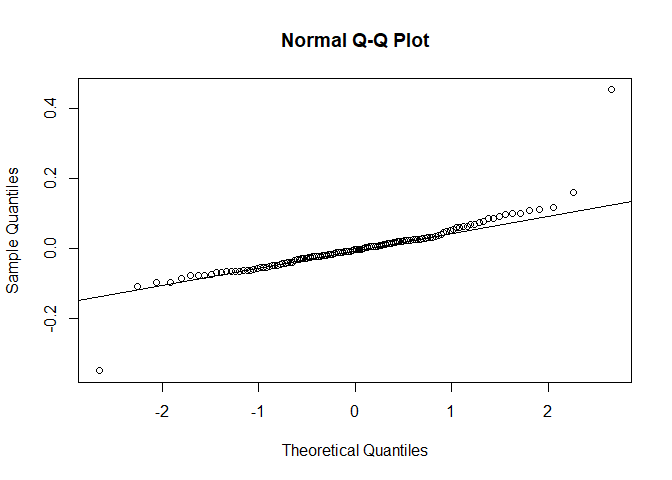<!-- -->

```
##                                   2.5 %       97.5 %
## .sig01                     0.0000000000  0.023210121
## .sigma                     0.0641891740  0.082201912
## (Intercept)               -0.9263714299 -0.900894634
## Treatment1                -0.0593190851 -0.033870473
## Population1               -0.0570893507 -0.031617033
## Treatment1:Population1    -0.0007018066  0.024746806
## TreatmentCurrent:Chamber1 -0.0280327041  0.007650767
## TreatmentFuture:Chamber1   0.0039515712  0.040245061
```

``` r
ldmc_anov_22 <- do_anov2(ldmc_lm_22)
```

```
## Type III Analysis of Variance Table with Satterthwaite's method
##                        Sum Sq  Mean Sq NumDF DenDF F value          Pr(>F)    
## Treatment            0.251919 0.251919     1   120 45.9357 0.0000000004853 ***
## Population           0.247549 0.247549     1   120 45.1389 0.0000000006516 ***
## Treatment:Population 0.018188 0.018188     1   120  3.3164         0.07108 .  
## Treatment:Chamber    0.036858 0.018429     2   120  3.3604         0.03802 *  
## ---
## Signif. codes:  0 '***' 0.001 '**' 0.01 '*' 0.05 '.' 0.1 ' ' 1
```

``` r
ldmc_anov_22$trait <- "l10_LDMC"
ldmc_means_22 <- get_table_bt(ldmc_lm_22)
```

There is an interaction, so do posthoc analyses. There is a chamber effect in full model, so included here.


``` r
# belm
as.data.frame(summary(lmer(l10_LDMC ~ Treatment + Treatment:Chamber + (1|Population:Line), data = subset(Dat_2022, Population == "B")))$coefficients) # not concerned about the warnings
```

```
## Warning: contrasts dropped from factor Population due to missing levels
## Warning: contrasts dropped from factor Population due to missing levels
```

```
## boundary (singular) fit: see help('isSingular')
```

```
## Warning: contrasts dropped from factor Population due to missing levels
## Warning: contrasts dropped from factor Population due to missing levels
```

```
##                              Estimate  Std. Error df     t value     Pr(>|t|)
## (Intercept)               -0.95800140 0.008732203 60 -109.709020 7.538927e-71
## Treatment1                -0.03457228 0.008732203 60   -3.959170 2.019448e-04
## TreatmentCurrent:Chamber1 -0.02958530 0.012349199 60   -2.395726 1.972367e-02
## TreatmentFuture:Chamber1   0.01718337 0.012349199 60    1.391456 1.692249e-01
```

``` r
#roda
as.data.frame(summary(lmer(l10_LDMC ~ Treatment + Treatment:Chamber + (1|Population:Line), data = subset(Dat_2022, Population == "R")))$coefficients) # not concerened about the warnings
```

```
## Warning: contrasts dropped from factor Population due to missing levels
## Warning: contrasts dropped from factor Population due to missing levels
## Warning: contrasts dropped from factor Population due to missing levels
## Warning: contrasts dropped from factor Population due to missing levels
```

```
##                              Estimate  Std. Error        df     t value
## (Intercept)               -0.86937900 0.010831737  6.904365 -80.2621987
## Treatment1                -0.05853062 0.009578772 51.236131  -6.1104520
## TreatmentCurrent:Chamber1  0.00920336 0.013305177 50.920155   0.6917127
## TreatmentFuture:Chamber1   0.02718657 0.013783458 51.526606   1.9724058
##                               Pr(>|t|)
## (Intercept)               1.631737e-11
## Treatment1                1.354839e-07
## TreatmentCurrent:Chamber1 4.922598e-01
## TreatmentFuture:Chamber1  5.394111e-02
```

``` r
#cur
as.data.frame(summary(lmer(l10_LDMC ~ Population + Chamber + (1|Population:Line), data = subset(Dat_2022, Treatment == "Current")))$coefficients) 
```

```
## boundary (singular) fit: see help('isSingular')
```

```
##                Estimate Std. Error df     t value     Pr(>|t|)
## (Intercept) -0.96024165 0.01088914 61 -88.1834485 4.893119e-66
## Population1 -0.03233203 0.01088914 61  -2.9692001 4.263536e-03
## Chamber1    -0.01019097 0.01088914 61  -0.9358839 3.530234e-01
```

``` r
#fut
as.data.frame(summary(lmer(l10_LDMC ~ Population + Chamber + (1|Population:Line), data = subset(Dat_2022, Treatment == "Future")))$coefficients)
```

```
##                Estimate  Std. Error       df    t value     Pr(>|t|)
## (Intercept) -0.86711377 0.009564376 16.18760 -90.660774 2.426974e-23
## Population1 -0.05698119 0.009559973 16.19933  -5.960393 1.895906e-05
## Chamber1     0.02221278 0.006402599 49.00217   3.469338 1.097391e-03
```

relative water content

``` r
# relative water content
rwc_lm_22 <- do_lmer2(Dat_2022$RWC)
```

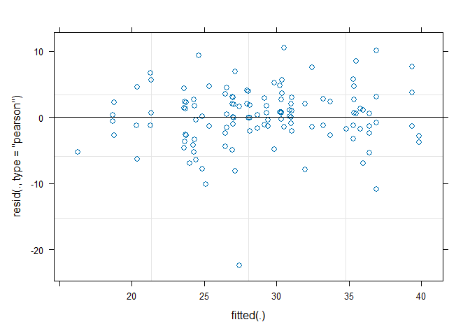<!-- -->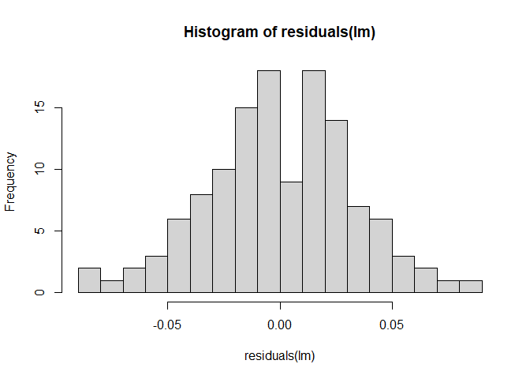<!-- -->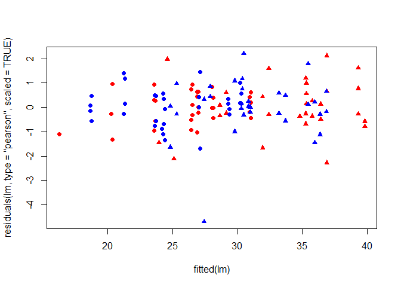<!-- -->

```
## [1] "the number of complete cases is 126"
```

```
## Linear mixed model fit by REML. t-tests use Satterthwaite's method [
## lmerModLmerTest]
## Formula: 
## trait ~ Treatment * Population + Treatment:Chamber + (1 | Population:Line)
##    Data: data
## 
## REML criterion at convergence: -431.1
## 
## Scaled residuals: 
##      Min       1Q   Median       3Q      Max 
## -2.41580 -0.58474 -0.02198  0.69105  2.57789 
## 
## Random effects:
##  Groups          Name        Variance  Std.Dev.
##  Population:Line (Intercept) 0.0001425 0.01194 
##  Residual                    0.0011879 0.03447 
## Number of obs: 126, groups:  Population:Line, 16
## 
## Fixed effects:
##                             Estimate Std. Error         df t value Pr(>|t|)    
## (Intercept)                 0.801943   0.004371  13.290880 183.454  < 2e-16 ***
## Treatment1                  0.043575   0.003079 108.392724  14.152  < 2e-16 ***
## Population1                -0.016242   0.004370  13.301770  -3.716  0.00249 ** 
## Treatment1:Population1      0.008633   0.003079 108.444542   2.804  0.00599 ** 
## TreatmentCurrent:Chamber1  -0.007038   0.004317 108.286491  -1.630  0.10598    
## TreatmentFuture:Chamber1    0.002303   0.004395 108.837211   0.524  0.60132    
## ---
## Signif. codes:  0 '***' 0.001 '**' 0.01 '*' 0.05 '.' 0.1 ' ' 1
## 
## Correlation of Fixed Effects:
##             (Intr) Trtmn1 Ppltn1 Tr1:P1 TrC:C1
## Treatment1  -0.003                            
## Population1  0.030  0.022                     
## Trtmnt1:Pp1  0.022 -0.014 -0.003              
## TrtmntCr:C1 -0.004  0.000 -0.004  0.000       
## TrtmntFt:C1 -0.025  0.024  0.010 -0.026  0.001
```

```
## Computing profile confidence intervals ...
```

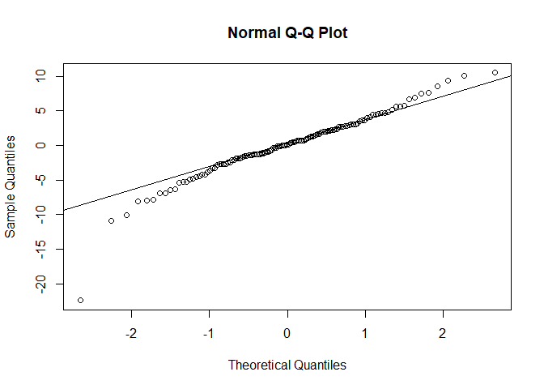<!-- -->

```
##                                  2.5 %       97.5 %
## .sig01                     0.000000000  0.020444346
## .sigma                     0.029834895  0.038822226
## (Intercept)                0.793499703  0.810522558
## Treatment1                 0.037593040  0.049541927
## Population1               -0.024698451 -0.007686023
## Treatment1:Population1     0.002628024  0.014581537
## TreatmentCurrent:Chamber1 -0.015454679  0.001304601
## TreatmentFuture:Chamber1  -0.006182233  0.010879932
```

``` r
rwc_anov_22 <- do_anov2(rwc_lm_22)
```

```
## Type III Analysis of Variance Table with Satterthwaite's method
##                        Sum Sq  Mean Sq NumDF   DenDF F value    Pr(>F)    
## Treatment            0.096428 0.096428     1 108.528 81.1781 7.966e-15 ***
## Population           0.016406 0.016406     1  13.302 13.8117  0.002495 ** 
## Treatment:Population 0.009337 0.009337     1 108.445  7.8602  0.005989 ** 
## Treatment:Chamber    0.003485 0.001742     2 108.561  1.4668  0.235200    
## ---
## Signif. codes:  0 '***' 0.001 '**' 0.01 '*' 0.05 '.' 0.1 ' ' 1
```

``` r
rwc_anov_22$trait <- "RWC"
rwc_means_22 <- get_table(rwc_lm_22)
# tori did log for RWC.
```

There is an interaction, so do posthoc analyses. No chamber effect in full model, so not included here.


``` r
# belm
as.data.frame(summary(lmer(RWC ~ Treatment + (1|Population:Line), data = subset(Dat_2022, Population == "B")))$coefficients) # not concerened about the warnings
```

```
## Warning: contrasts dropped from factor Population due to missing levels
## Warning: contrasts dropped from factor Population due to missing levels
## Warning: contrasts dropped from factor Population due to missing levels
## Warning: contrasts dropped from factor Population due to missing levels
```

```
##               Estimate  Std. Error        df   t value     Pr(>|t|)
## (Intercept) 0.78573773 0.005792021  6.877998 135.65864 4.786785e-13
## Treatment1  0.05223191 0.003860944 57.451041  13.52828 1.648921e-19
```

``` r
#roda
as.data.frame(summary(lmer(RWC ~ Treatment + (1|Population:Line), data = subset(Dat_2022, Population == "R")))$coefficients) # not concerened about the warnings
```

```
## Warning: contrasts dropped from factor Population due to missing levels
## Warning: contrasts dropped from factor Population due to missing levels
## Warning: contrasts dropped from factor Population due to missing levels
## Warning: contrasts dropped from factor Population due to missing levels
```

```
##               Estimate  Std. Error        df   t value     Pr(>|t|)
## (Intercept) 0.81825841 0.006570931  6.696777 124.52702 1.607328e-12
## Treatment1  0.03486865 0.004854147 52.909427   7.18327 2.307091e-09
```

``` r
#cur
as.data.frame(summary(lmer(RWC ~ Population + (1|Population:Line), data = subset(Dat_2022, Treatment == "Current")))$coefficients) 
```

```
##                 Estimate  Std. Error       df    t value     Pr(>|t|)
## (Intercept)  0.844855273 0.004558062 11.38397 185.354061 3.606240e-21
## Population1 -0.008271777 0.004558062 11.38397  -1.814758 9.597641e-02
```

``` r
#fut
as.data.frame(summary(lmer(RWC ~ Population + (1|Population:Line), data = subset(Dat_2022, Treatment == "Future")))$coefficients)
```

```
##                Estimate Std. Error       df    t value     Pr(>|t|)
## (Intercept)  0.75868658  0.0065857 14.47678 115.202116 7.395755e-23
## Population1 -0.02461898  0.0065857 14.47678  -3.738248 2.090588e-03
```


### Leaf Number

leaf num at 4 weeks
no post hoc because not in manuscript

``` r
# pre vern leaf number
LN_PreVern_lm_22 <- do_lmer2(Dat_2022$LeafNumber_PreVern)
```

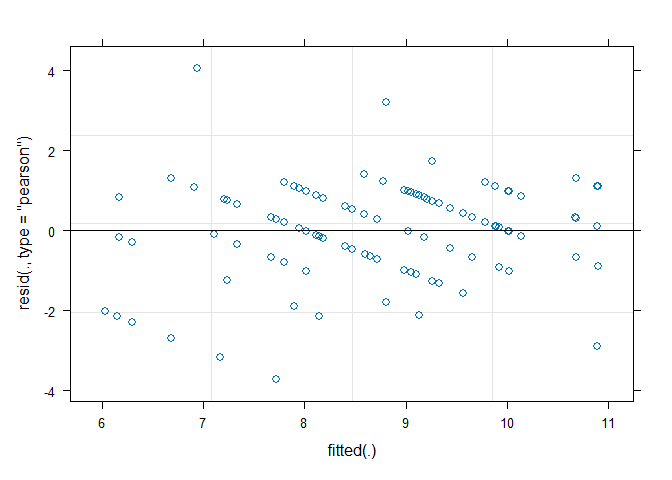<!-- --><!-- --><!-- -->

```
## [1] "the number of complete cases is 128"
```

```
## Linear mixed model fit by REML. t-tests use Satterthwaite's method [
## lmerModLmerTest]
## Formula: 
## trait ~ Treatment * Population + Treatment:Chamber + (1 | Population:Line)
##    Data: data
## 
## REML criterion at convergence: 457.9
## 
## Scaled residuals: 
##     Min      1Q  Median      3Q     Max 
## -3.0344 -0.5289  0.0761  0.6676  3.3110 
## 
## Random effects:
##  Groups          Name        Variance Std.Dev.
##  Population:Line (Intercept) 2.201    1.483   
##  Residual                    1.504    1.226   
## Number of obs: 128, groups:  Population:Line, 16
## 
## Fixed effects:
##                           Estimate Std. Error       df t value       Pr(>|t|)
## (Intercept)                 8.3089     0.3914  10.4350  21.229 0.000000000634
## Treatment1                 -0.3497     0.1090 104.5071  -3.208        0.00177
## Population1                 0.1527     0.3914  10.4350   0.390        0.70436
## Treatment1:Population1     -0.0684     0.1090 104.5071  -0.628        0.53158
## TreatmentCurrent:Chamber1  -0.0651     0.1540 104.1109  -0.423        0.67344
## TreatmentFuture:Chamber1    0.1113     0.1544 104.9805   0.721        0.47240
##                              
## (Intercept)               ***
## Treatment1                ** 
## Population1                  
## Treatment1:Population1       
## TreatmentCurrent:Chamber1    
## TreatmentFuture:Chamber1     
## ---
## Signif. codes:  0 '***' 0.001 '**' 0.01 '*' 0.05 '.' 0.1 ' ' 1
## 
## Correlation of Fixed Effects:
##             (Intr) Trtmn1 Ppltn1 Tr1:P1 TrC:C1
## Treatment1   0.015                            
## Population1  0.025  0.015                     
## Trtmnt1:Pp1  0.015  0.010  0.015              
## TrtmntCr:C1 -0.004 -0.001 -0.004 -0.001       
## TrtmntFt:C1 -0.014 -0.007 -0.014 -0.007  0.002
```

```
## Computing profile confidence intervals ...
```

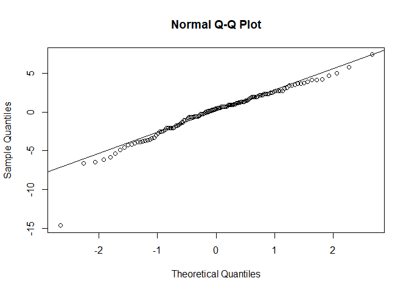<!-- -->

```
##                                2.5 %     97.5 %
## .sig01                     0.8606930  2.1779465
## .sigma                     1.0619229  1.3894972
## (Intercept)                7.5237500  9.0588339
## Treatment1                -0.5590846 -0.1336554
## Population1               -0.6325000  0.9025839
## Treatment1:Population1    -0.2778346  0.1475946
## TreatmentCurrent:Chamber1 -0.3664326  0.2333896
## TreatmentFuture:Chamber1  -0.1944768  0.4080200
```

``` r
LN_PreVern_anov_22 <- do_anov2(LN_PreVern_lm_22)
```

```
## Type III Analysis of Variance Table with Satterthwaite's method
##                       Sum Sq Mean Sq NumDF   DenDF F value Pr(>F)   
## Treatment            12.0887 12.0887     1 105.014  8.0365 0.0055 **
## Population            0.2288  0.2288     1  10.435  0.1521 0.7044   
## Treatment:Population  0.5926  0.5926     1 104.507  0.3940 0.5316   
## Treatment:Chamber     1.0525  0.5262     2 104.545  0.3498 0.7056   
## ---
## Signif. codes:  0 '***' 0.001 '**' 0.01 '*' 0.05 '.' 0.1 ' ' 1
```

``` r
LN_PreVern_anov_22$trait <- "LeafNum_5wks"
LN_PreVern_means_22 <- get_table(LN_PreVern_lm_22)
# no interaction
```

leaf num first week post vern
no post hoc because not in manuscript

``` r
# june 6 leaf number(first week post vern?)
LN_Jun6_lm_22 <- do_lmer2(Dat_2022$LeafNumber_Jun6)
```

<!-- --><!-- -->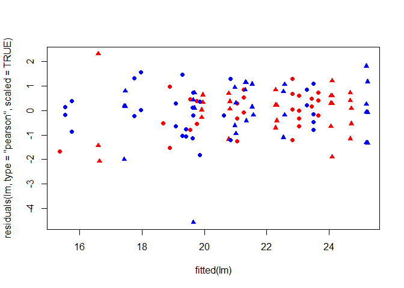<!-- -->

```
## [1] "the number of complete cases is 128"
```

```
## Linear mixed model fit by REML. t-tests use Satterthwaite's method [
## lmerModLmerTest]
## Formula: 
## trait ~ Treatment * Population + Treatment:Chamber + (1 | Population:Line)
##    Data: data
## 
## REML criterion at convergence: 687.5
## 
## Scaled residuals: 
##     Min      1Q  Median      3Q     Max 
## -4.5711 -0.5406  0.1455  0.6114  2.3122 
## 
## Random effects:
##  Groups          Name        Variance Std.Dev.
##  Population:Line (Intercept) 10.20    3.194   
##  Residual                    10.27    3.205   
## Number of obs: 128, groups:  Population:Line, 16
## 
## Fixed effects:
##                            Estimate Std. Error        df t value Pr(>|t|)    
## (Intercept)                20.70341    0.86076  11.21400  24.052 5.27e-11 ***
## Treatment1                 -0.74102    0.28464 105.96361  -2.603   0.0106 *  
## Population1                -0.14034    0.86076  11.21400  -0.163   0.8734    
## Treatment1:Population1      0.16523    0.28464 105.96361   0.580   0.5628    
## TreatmentCurrent:Chamber1  -0.10567    0.40242 105.58551  -0.263   0.7934    
## TreatmentFuture:Chamber1    0.01772    0.40311 106.42316   0.044   0.9650    
## ---
## Signif. codes:  0 '***' 0.001 '**' 0.01 '*' 0.05 '.' 0.1 ' ' 1
## 
## Correlation of Fixed Effects:
##             (Intr) Trtmn1 Ppltn1 Tr1:P1 TrC:C1
## Treatment1   0.015                            
## Population1  0.031  0.015                     
## Trtmnt1:Pp1  0.015  0.009  0.015              
## TrtmntCr:C1 -0.005  0.000 -0.005  0.000       
## TrtmntFt:C1 -0.014 -0.006 -0.014 -0.006  0.002
```

```
## Computing profile confidence intervals ...
```

<!-- -->

```
##                                2.5 %     97.5 %
## .sig01                     1.8511296  4.7038791
## .sigma                     2.7756684  3.6237341
## (Intercept)               18.9775607 22.3525923
## Treatment1                -1.2886958 -0.1794252
## Population1               -1.8661893  1.5088423
## Treatment1:Population1    -0.3824458  0.7268248
## TreatmentCurrent:Chamber1 -0.8933267  0.6726867
## TreatmentFuture:Chamber1  -0.7761656  0.7938905
```

``` r
LN_Jun6_anov_22 <- do_anov2(LN_Jun6_lm_22)
```

```
## Type III Analysis of Variance Table with Satterthwaite's method
##                      Sum Sq Mean Sq NumDF   DenDF F value  Pr(>F)  
## Treatment            40.696  40.696     1 106.470  3.9617 0.04911 *
## Population            0.273   0.273     1  11.214  0.0266 0.87339  
## Treatment:Population  3.461   3.461     1 105.964  0.3370 0.56282  
## Treatment:Chamber     0.729   0.364     2 106.004  0.0355 0.96517  
## ---
## Signif. codes:  0 '***' 0.001 '**' 0.01 '*' 0.05 '.' 0.1 ' ' 1
```

``` r
LN_Jun6_anov_22$trait <- "LeafNum_9wks"
LN_Jun6_means_22 <- get_table(LN_Jun6_lm_22)
# no interaction
```

leaf num second week post vern
no post hoc because not in manuscript

``` r
# june 14 leaf number (second week post vern?)
LN_Jun13_lm_22 <- do_lmer2(Dat_2022$LeafNumber_Jun13)
```

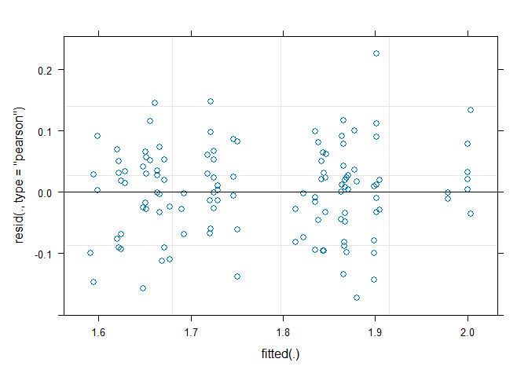<!-- -->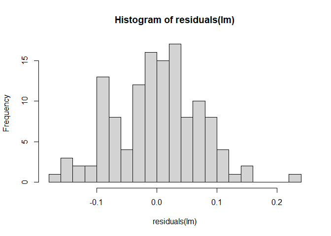<!-- --><!-- -->

```
## [1] "the number of complete cases is 128"
```

```
## Linear mixed model fit by REML. t-tests use Satterthwaite's method [
## lmerModLmerTest]
## Formula: 
## trait ~ Treatment * Population + Treatment:Chamber + (1 | Population:Line)
##    Data: data
## 
## REML criterion at convergence: 787.3
## 
## Scaled residuals: 
##     Min      1Q  Median      3Q     Max 
## -4.6947 -0.3937  0.0304  0.5628  2.1978 
## 
## Random effects:
##  Groups          Name        Variance Std.Dev.
##  Population:Line (Intercept) 27.34    5.229   
##  Residual                    22.85    4.780   
## Number of obs: 128, groups:  Population:Line, 16
## 
## Fixed effects:
##                           Estimate Std. Error       df t value Pr(>|t|)    
## (Intercept)                27.9230     1.3938  11.1643  20.034 4.19e-10 ***
## Treatment1                 -3.7334     0.4246 105.7419  -8.793 2.94e-14 ***
## Population1                -0.1395     1.3938  11.1643  -0.100    0.922    
## Treatment1:Population1     -0.5460     0.4246 105.7419  -1.286    0.201    
## TreatmentCurrent:Chamber1  -0.0405     0.6002 105.3596  -0.067    0.946    
## TreatmentFuture:Chamber1    0.2454     0.6014 106.2017   0.408    0.684    
## ---
## Signif. codes:  0 '***' 0.001 '**' 0.01 '*' 0.05 '.' 0.1 ' ' 1
## 
## Correlation of Fixed Effects:
##             (Intr) Trtmn1 Ppltn1 Tr1:P1 TrC:C1
## Treatment1   0.015                            
## Population1  0.028  0.015                     
## Trtmnt1:Pp1  0.015  0.010  0.015              
## TrtmntCr:C1 -0.005  0.000 -0.005  0.000       
## TrtmntFt:C1 -0.014 -0.007 -0.014 -0.007  0.002
```

```
## Computing profile confidence intervals ...
```

<!-- -->

```
##                                2.5 %     97.5 %
## .sig01                     3.0779841  7.6605808
## .sigma                     4.1391514  5.4053249
## (Intercept)               25.1324193 30.5952471
## Treatment1                -4.5502752 -2.8952371
## Population1               -2.9300807  2.5327471
## Treatment1:Population1    -1.3627752  0.2922629
## TreatmentCurrent:Chamber1 -1.2145070  1.1211849
## TreatmentFuture:Chamber1  -0.9405559  1.4027367
```

``` r
LN_Jun13_anov_22 <- do_anov2(LN_Jun13_lm_22)
```

```
## Type III Analysis of Variance Table with Satterthwaite's method
##                      Sum Sq Mean Sq NumDF   DenDF F value        Pr(>F)    
## Treatment            948.25  948.25     1 106.241 41.5070 0.00000000351 ***
## Population             0.23    0.23     1  11.164  0.0100        0.9221    
## Treatment:Population  37.77   37.77     1 105.742  1.6534        0.2013    
## Treatment:Chamber      3.91    1.96     2 105.780  0.0856        0.9180    
## ---
## Signif. codes:  0 '***' 0.001 '**' 0.01 '*' 0.05 '.' 0.1 ' ' 1
```

``` r
LN_Jun13_anov_22$trait <- "LeafNum_10wks"
LN_Jun13_means_22 <- get_table(LN_Jun13_lm_22)
# no interaction
```

leaf num at bolting

``` r
# total leaf number counted at bolting when plants were harvested
LN_bolt_lm_22 <- do_lmer2(Dat_2022$l10_LeafNumber_Total)
```

<!-- --><!-- --><!-- -->

```
## [1] "the number of complete cases is 127"
```

```
## Linear mixed model fit by REML. t-tests use Satterthwaite's method [
## lmerModLmerTest]
## Formula: 
## trait ~ Treatment * Population + Treatment:Chamber + (1 | Population:Line)
##    Data: data
## 
## REML criterion at convergence: -229.8
## 
## Scaled residuals: 
##      Min       1Q   Median       3Q      Max 
## -2.26097 -0.58772  0.04958  0.60793  2.96092 
## 
## Random effects:
##  Groups          Name        Variance Std.Dev.
##  Population:Line (Intercept) 0.003048 0.05521 
##  Residual                    0.005813 0.07625 
## Number of obs: 127, groups:  Population:Line, 16
## 
## Fixed effects:
##                             Estimate Std. Error         df t value   Pr(>|t|)
## (Intercept)                 1.774185   0.015689  14.205284 113.084    < 2e-16
## Treatment1                 -0.001106   0.006795 108.794740  -0.163      0.871
## Population1                -0.105678   0.015687  14.203556  -6.737 0.00000884
## Treatment1:Population1     -0.007202   0.006796 108.830424  -1.060      0.292
## TreatmentCurrent:Chamber1  -0.001558   0.009568 108.530307  -0.163      0.871
## TreatmentFuture:Chamber1   -0.010752   0.009663 109.207094  -1.113      0.268
##                              
## (Intercept)               ***
## Treatment1                   
## Population1               ***
## Treatment1:Population1       
## TreatmentCurrent:Chamber1    
## TreatmentFuture:Chamber1     
## ---
## Signif. codes:  0 '***' 0.001 '**' 0.01 '*' 0.05 '.' 0.1 ' ' 1
## 
## Correlation of Fixed Effects:
##             (Intr) Trtmn1 Ppltn1 Tr1:P1 TrC:C1
## Treatment1   0.011                            
## Population1  0.038  0.019                     
## Trtmnt1:Pp1  0.019 -0.001  0.011              
## TrtmntCr:C1 -0.005  0.000 -0.005  0.000       
## TrtmntFt:C1 -0.019  0.008 -0.008 -0.017  0.001
```

```
## Computing profile confidence intervals ...
```

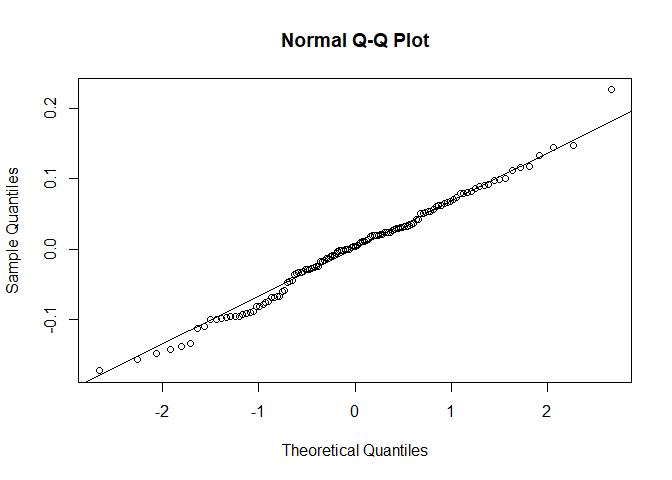<!-- -->

```
##                                 2.5 %       97.5 %
## .sig01                     0.03241696  0.081025806
## .sigma                     0.06602341  0.085829392
## (Intercept)                1.74345411  1.804561062
## Treatment1                -0.01427859  0.012088211
## Population1               -0.13637868 -0.075286407
## Treatment1:Population1    -0.02035184  0.006020632
## TreatmentCurrent:Chamber1 -0.02011290  0.017016900
## TreatmentFuture:Chamber1  -0.02956340  0.007935385
```

``` r
LN_bolt_anov_22 <- do_anov2(LN_bolt_lm_22)
```

```
## Type III Analysis of Variance Table with Satterthwaite's method
##                        Sum Sq  Mean Sq NumDF   DenDF F value     Pr(>F)    
## Treatment            0.000772 0.000772     1 109.163  0.1328     0.7163    
## Population           0.263839 0.263839     1  14.204 45.3842 0.00000884 ***
## Treatment:Population 0.006530 0.006530     1 108.830  1.1232     0.2916    
## Treatment:Chamber    0.007349 0.003674     2 108.867  0.6321     0.5334    
## ---
## Signif. codes:  0 '***' 0.001 '**' 0.01 '*' 0.05 '.' 0.1 ' ' 1
```

``` r
LN_bolt_anov_22$trait <- "l10_LeafNumb_bolting"
LN_bolt_means_22 <- get_table_bt(LN_bolt_lm_22)
# no interaction
```

No interaction but do individual models to see difference in future environment. no chamber effect in full model so not included here


``` r
# belm
as.data.frame(summary(lmer(l10_LeafNumber_Total ~ Treatment + (1|Population:Line), data = subset(Dat_2022, Population == "B")))$coefficients) # not concerened about the warnings
```

```
## Warning: contrasts dropped from factor Population due to missing levels
## Warning: contrasts dropped from factor Population due to missing levels
## Warning: contrasts dropped from factor Population due to missing levels
## Warning: contrasts dropped from factor Population due to missing levels
```

```
##                 Estimate  Std. Error        df   t value     Pr(>|t|)
## (Intercept)  1.667995559 0.021224896  7.153641 78.586747 9.032076e-12
## Treatment1  -0.008375321 0.008998446 56.690210 -0.930752 3.559287e-01
```

``` r
#roda
as.data.frame(summary(lmer(l10_LeafNumber_Total ~ Treatment + (1|Population:Line), data = subset(Dat_2022, Population == "R")))$coefficients) # not concerened about the warnings
```

```
## Warning: contrasts dropped from factor Population due to missing levels
## Warning: contrasts dropped from factor Population due to missing levels
## Warning: contrasts dropped from factor Population due to missing levels
## Warning: contrasts dropped from factor Population due to missing levels
```

```
##                Estimate Std. Error        df    t value     Pr(>|t|)
## (Intercept) 1.879671031 0.02305605  7.010874 81.5261622 1.064463e-11
## Treatment1  0.006288548 0.01013022 54.056728  0.6207713 5.373588e-01
```

``` r
#cur
as.data.frame(summary(lmer(l10_LeafNumber_Total ~ Population + (1|Population:Line), data = subset(Dat_2022, Treatment == "Current")))$coefficients) 
```

```
##               Estimate Std. Error       df   t value     Pr(>|t|)
## (Intercept)  1.7767463 0.02107073 11.89181 84.322965 6.942723e-18
## Population1 -0.1092133 0.02107073 11.89181 -5.183176 2.349160e-04
```

``` r
#fut
as.data.frame(summary(lmer(l10_LeafNumber_Total ~ Population + (1|Population:Line), data = subset(Dat_2022, Treatment == "Future")))$coefficients)
```

```
##                Estimate Std. Error       df    t value     Pr(>|t|)
## (Intercept)  1.77357798 0.01588412 13.67961 111.657303 1.199907e-21
## Population1 -0.09898981 0.01588412 13.67961  -6.231998 2.433112e-05
```


Not analyzing rosette leaf number or under leaves because this split was started partway through the experiment.


### Biomass

above ground biomass

``` r
# above ground biomass (same as rosette biomass)
AG_lm_22 <- do_lmer2(Dat_2022$l10_AG_DryBiomass)
```

<!-- -->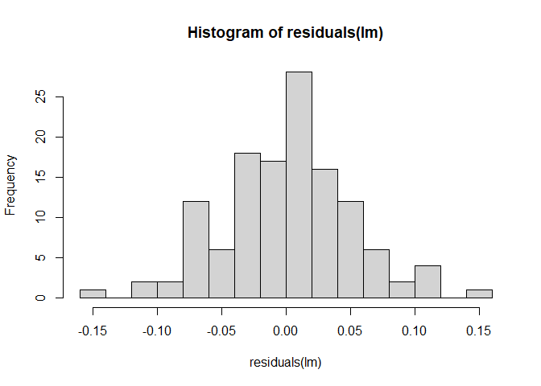<!-- --><!-- -->

```
## [1] "the number of complete cases is 127"
```

```
## Linear mixed model fit by REML. t-tests use Satterthwaite's method [
## lmerModLmerTest]
## Formula: 
## trait ~ Treatment * Population + Treatment:Chamber + (1 | Population:Line)
##    Data: data
## 
## REML criterion at convergence: -120.6
## 
## Scaled residuals: 
##      Min       1Q   Median       3Q      Max 
## -2.59163 -0.52416  0.05903  0.61737  3.11954 
## 
## Random effects:
##  Groups          Name        Variance Std.Dev.
##  Population:Line (Intercept) 0.01698  0.1303  
##  Residual                    0.01314  0.1146  
## Number of obs: 127, groups:  Population:Line, 16
## 
## Fixed effects:
##                            Estimate Std. Error        df t value      Pr(>|t|)
## (Intercept)                -0.53060    0.03461  13.01310 -15.330 0.00000000104
## Treatment1                  0.02970    0.01023 106.93364   2.903       0.00449
## Population1                -0.19595    0.03461  13.00997  -5.662 0.00007746570
## Treatment1:Population1      0.02497    0.01023 106.96972   2.440       0.01632
## TreatmentCurrent:Chamber1  -0.00562    0.01440 106.60158  -0.390       0.69703
## TreatmentFuture:Chamber1    0.00325    0.01456 107.39808   0.223       0.82376
##                              
## (Intercept)               ***
## Treatment1                ** 
## Population1               ***
## Treatment1:Population1    *  
## TreatmentCurrent:Chamber1    
## TreatmentFuture:Chamber1     
## ---
## Signif. codes:  0 '***' 0.001 '**' 0.01 '*' 0.05 '.' 0.1 ' ' 1
## 
## Correlation of Fixed Effects:
##             (Intr) Trtmn1 Ppltn1 Tr1:P1 TrC:C1
## Treatment1   0.012                            
## Population1  0.026  0.017                     
## Trtmnt1:Pp1  0.018  0.001  0.012              
## TrtmntCr:C1 -0.004  0.000 -0.004 -0.001       
## TrtmntFt:C1 -0.018  0.006 -0.011 -0.020  0.002
```

```
## Computing profile confidence intervals ...
```

<!-- -->

```
##                                  2.5 %      97.5 %
## .sig01                     0.082072636  0.18729355
## .sigma                     0.099228879  0.12928382
## (Intercept)               -0.598980003 -0.46385361
## Treatment1                 0.009953920  0.04971060
## Population1               -0.264326661 -0.12921510
## Treatment1:Population1     0.005223505  0.04498747
## TreatmentCurrent:Chamber1 -0.033527101  0.02239162
## TreatmentFuture:Chamber1  -0.025293696  0.03130687
```

``` r
AG_anov_22 <- do_anov2(AG_lm_22)
```

```
## Type III Analysis of Variance Table with Satterthwaite's method
##                       Sum Sq Mean Sq NumDF  DenDF F value     Pr(>F)    
## Treatment            0.04025 0.04025     1 107.36  3.0630    0.08295 .  
## Population           0.42132 0.42132     1  13.01 32.0605 0.00007747 ***
## Treatment:Population 0.07825 0.07825     1 106.97  5.9548    0.01632 *  
## Treatment:Chamber    0.00266 0.00133     2 107.00  0.1013    0.90378    
## ---
## Signif. codes:  0 '***' 0.001 '**' 0.01 '*' 0.05 '.' 0.1 ' ' 1
```

``` r
AG_anov_22$trait <- "l10_Above Ground Biomass"
AG_means_22 <- get_table_bt(AG_lm_22)
## also has SQR transformation -interaction gets a little weaker
#AG_lm_22SQR <- do_lmer2(Dat_2022$SQR_AG_DryBiomass)
#AG_anov_22SQR <- do_anov2(AG_lm_22SQR)
#AG_anov_22SQR$trait <- "SQR_Above Ground Biomass"
```

There is an interaction, so do posthoc analyses. No chamber effect in full model, so not included here.


``` r
# belm
as.data.frame(summary(lmer(l10_AG_DryBiomass ~ Treatment + (1|Population:Line), data = subset(Dat_2022, Population == "B")))$coefficients) # not concerened about the warnings
```

```
## Warning: contrasts dropped from factor Population due to missing levels
## Warning: contrasts dropped from factor Population due to missing levels
## Warning: contrasts dropped from factor Population due to missing levels
## Warning: contrasts dropped from factor Population due to missing levels
```

```
##                Estimate Std. Error        df    t value     Pr(>|t|)
## (Intercept) -0.73002307 0.06453121  6.573676 -11.312713 0.0000149824
## Treatment1   0.05410441 0.01586684 55.294079   3.409905 0.0012200878
```

``` r
#roda
as.data.frame(summary(lmer(l10_AG_DryBiomass ~ Treatment + (1|Population:Line), data = subset(Dat_2022, Population == "R")))$coefficients) # not concerened about the warnings
```

```
## Warning: contrasts dropped from factor Population due to missing levels
## Warning: contrasts dropped from factor Population due to missing levels
## Warning: contrasts dropped from factor Population due to missing levels
## Warning: contrasts dropped from factor Population due to missing levels
```

```
##                 Estimate Std. Error        df     t value       Pr(>|t|)
## (Intercept) -0.334602278 0.02893410  7.044089 -11.5642874 0.000007765416
## Treatment1   0.004687269 0.01258938 54.088656   0.3723194 0.711109930520
```

``` r
#cur
as.data.frame(summary(lmer(l10_AG_DryBiomass ~ Population + (1|Population:Line), data = subset(Dat_2022, Treatment == "Current")))$coefficients) 
```

```
##               Estimate Std. Error       df    t value         Pr(>|t|)
## (Intercept) -0.4918215 0.04226944 12.56658 -11.635394 0.00000004280558
## Population1 -0.1619065 0.04226944 12.56658  -3.830345 0.00220919800102
```

``` r
#fut
as.data.frame(summary(lmer(l10_AG_DryBiomass ~ Population + (1|Population:Line), data = subset(Dat_2022, Treatment == "Future")))$coefficients)
```

```
##               Estimate Std. Error       df    t value           Pr(>|t|)
## (Intercept) -0.5602558 0.03040813 12.94289 -18.424541 0.0000000001142772
## Population1 -0.2206406 0.03040813 12.94289  -7.255974 0.0000065639134629
```


below ground biomass

``` r
# below ground biomass
BG_lm_22 <- do_lmer2(Dat_2022$BG_DryBiomass)
```

<!-- --><!-- --><!-- -->

```
## [1] "the number of complete cases is 127"
```

```
## Linear mixed model fit by REML. t-tests use Satterthwaite's method [
## lmerModLmerTest]
## Formula: 
## trait ~ Treatment * Population + Treatment:Chamber + (1 | Population:Line)
##    Data: data
## 
## REML criterion at convergence: -675.7
## 
## Scaled residuals: 
##     Min      1Q  Median      3Q     Max 
## -2.2316 -0.5640 -0.0698  0.5048  4.3594 
## 
## Random effects:
##  Groups          Name        Variance   Std.Dev.
##  Population:Line (Intercept) 0.00006057 0.007783
##  Residual                    0.00014925 0.012217
## Number of obs: 127, groups:  Population:Line, 16
## 
## Fixed effects:
##                              Estimate  Std. Error          df t value Pr(>|t|)
## (Intercept)                 0.0440960   0.0022761  14.3853891  19.373 1.04e-11
## Treatment1                  0.0032806   0.0010883 109.1693192   3.014   0.0032
## Population1                -0.0122500   0.0022758  14.3846326  -5.383 8.79e-05
## Treatment1:Population1      0.0005955   0.0010884 109.2033338   0.547   0.5854
## TreatmentCurrent:Chamber1  -0.0018009   0.0015326 108.9427641  -1.175   0.2426
## TreatmentFuture:Chamber1   -0.0008509   0.0015474 109.5504139  -0.550   0.5835
##                              
## (Intercept)               ***
## Treatment1                ** 
## Population1               ***
## Treatment1:Population1       
## TreatmentCurrent:Chamber1    
## TreatmentFuture:Chamber1     
## ---
## Signif. codes:  0 '***' 0.001 '**' 0.01 '*' 0.05 '.' 0.1 ' ' 1
## 
## Correlation of Fixed Effects:
##             (Intr) Trtmn1 Ppltn1 Tr1:P1 TrC:C1
## Treatment1   0.010                            
## Population1  0.040  0.019                     
## Trtmnt1:Pp1  0.019 -0.002  0.010              
## TrtmntCr:C1 -0.005  0.000 -0.005  0.000       
## TrtmntFt:C1 -0.019  0.009 -0.007 -0.016  0.001
```

```
## Computing profile confidence intervals ...
```

<!-- -->

```
##                                  2.5 %       97.5 %
## .sig01                     0.004391222  0.011580680
## .sigma                     0.010579878  0.013746425
## (Intercept)                0.039621781  0.048490529
## Treatment1                 0.001175239  0.005398136
## Population1               -0.016723355 -0.007856030
## Treatment1:Population1    -0.001509924  0.002713352
## TreatmentCurrent:Chamber1 -0.004769008  0.001177901
## TreatmentFuture:Chamber1  -0.003867158  0.002137839
```

``` r
BG_anov_22 <- do_anov2(BG_lm_22)
```

```
## Type III Analysis of Variance Table with Satterthwaite's method
##                         Sum Sq   Mean Sq NumDF   DenDF F value     Pr(>F)    
## Treatment            0.0004992 0.0004992     1 109.501  3.3447    0.07014 .  
## Population           0.0043246 0.0043246     1  14.385 28.9749 0.00008793 ***
## Treatment:Population 0.0000447 0.0000447     1 109.203  0.2993    0.58543    
## Treatment:Chamber    0.0002509 0.0001255     2 109.245  0.8406    0.43422    
## ---
## Signif. codes:  0 '***' 0.001 '**' 0.01 '*' 0.05 '.' 0.1 ' ' 1
```

``` r
BG_anov_22$trait <- "Below Ground Biomass"
BG_means_22 <- get_table(BG_lm_22)
### also has SQR transformation; non significance changes
#BG_lm_22SQR <- do_lmer2(Dat_2022$SQR_BG_DryBiomass)
#BG_anov_22SQR <- do_anov2(BG_lm_22SQR)
#BG_anov_22SQR$trait <- "SQR_Below Ground Biomass"
# no interaction
```

No interaction but do individual models to see difference in future environment. no chamber effect in full model so not included here


``` r
# belm
as.data.frame(summary(lmer(BG_DryBiomass ~ Treatment + (1|Population:Line), data = subset(Dat_2022, Population == "B")))$coefficients) # not concerened about the warnings
```

```
## Warning: contrasts dropped from factor Population due to missing levels
## Warning: contrasts dropped from factor Population due to missing levels
## Warning: contrasts dropped from factor Population due to missing levels
## Warning: contrasts dropped from factor Population due to missing levels
```

```
##                Estimate  Std. Error        df  t value      Pr(>|t|)
## (Intercept) 0.031340494 0.003905077  7.200709 8.025576 0.00007662272
## Treatment1  0.003801099 0.001239060 56.226178 3.067727 0.00331494473
```

``` r
#roda
as.data.frame(summary(lmer(BG_DryBiomass ~ Treatment + (1|Population:Line), data = subset(Dat_2022, Population == "R")))$coefficients) # not concerened about the warnings
```

```
## Warning: contrasts dropped from factor Population due to missing levels
## Warning: contrasts dropped from factor Population due to missing levels
## Warning: contrasts dropped from factor Population due to missing levels
## Warning: contrasts dropped from factor Population due to missing levels
```

```
##                Estimate  Std. Error        df   t value         Pr(>|t|)
## (Intercept) 0.056331392 0.002324651  7.125737 24.232195 0.00000004143986
## Treatment1  0.002699858 0.001796793 54.259735  1.502599 0.13874061215932
```

``` r
#cur
as.data.frame(summary(lmer(BG_DryBiomass ~ Population + (1|Population:Line), data = subset(Dat_2022, Treatment == "Current")))$coefficients) 
```

```
##                Estimate  Std. Error       df   t value           Pr(>|t|)
## (Intercept)  0.04756751 0.002930192 12.84609 16.233582 0.0000000006135583
## Population1 -0.01146374 0.002930192 12.84609 -3.912284 0.0018229571331547
```

``` r
#fut
as.data.frame(summary(lmer(BG_DryBiomass ~ Population + (1|Population:Line), data = subset(Dat_2022, Treatment == "Future")))$coefficients)
```

```
##                Estimate  Std. Error       df   t value           Pr(>|t|)
## (Intercept)  0.04055348 0.002478238 14.11434 16.363838 0.0000000001418708
## Population1 -0.01288595 0.002478238 14.11434 -5.199644 0.0001311809417757
```


Root to shoot ration (below ground / above ground)

``` r
# Root to Shoot ratio
RS_lm_22 <- do_lmer2(Dat_2022$l10_Root_to_Shoot)
```

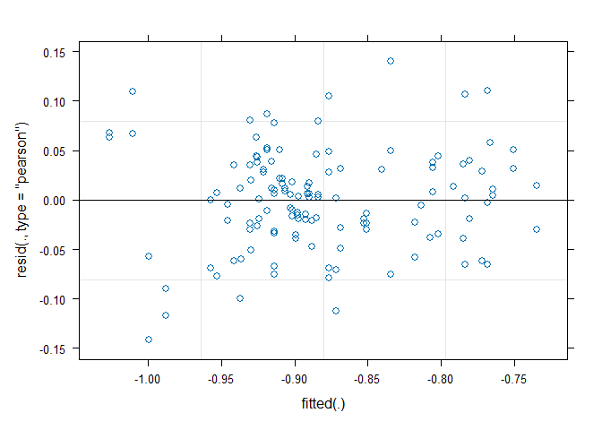<!-- --><!-- -->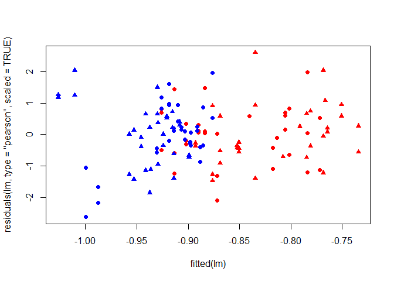<!-- -->

```
## [1] "the number of complete cases is 127"
```

```
## Linear mixed model fit by REML. t-tests use Satterthwaite's method [
## lmerModLmerTest]
## Formula: 
## trait ~ Treatment * Population + Treatment:Chamber + (1 | Population:Line)
##    Data: data
## 
## REML criterion at convergence: -308.8
## 
## Scaled residuals: 
##      Min       1Q   Median       3Q      Max 
## -2.62345 -0.56122  0.05564  0.59296  2.60167 
## 
## Random effects:
##  Groups          Name        Variance Std.Dev.
##  Population:Line (Intercept) 0.002330 0.04827 
##  Residual                    0.002909 0.05393 
## Number of obs: 127, groups:  Population:Line, 16
## 
## Fixed effects:
##                             Estimate Std. Error         df t value Pr(>|t|)    
## (Intercept)                -0.875248   0.013212  13.543103 -66.245  < 2e-16 ***
## Treatment1                 -0.002563   0.004809 107.833220  -0.533  0.59526    
## Population1                 0.052948   0.013211  13.540354   4.008  0.00138 ** 
## Treatment1:Population1     -0.015004   0.004810 107.870814  -3.119  0.00232 ** 
## TreatmentCurrent:Chamber1  -0.006003   0.006770 107.517251  -0.887  0.37727    
## TreatmentFuture:Chamber1   -0.008126   0.006842 108.292219  -1.188  0.23757    
## ---
## Signif. codes:  0 '***' 0.001 '**' 0.01 '*' 0.05 '.' 0.1 ' ' 1
## 
## Correlation of Fixed Effects:
##             (Intr) Trtmn1 Ppltn1 Tr1:P1 TrC:C1
## Treatment1   0.012                            
## Population1  0.033  0.018                     
## Trtmnt1:Pp1  0.019  0.000  0.012              
## TrtmntCr:C1 -0.005  0.000 -0.005  0.000       
## TrtmntFt:C1 -0.019  0.007 -0.010 -0.018  0.002
```

```
## Computing profile confidence intervals ...
```

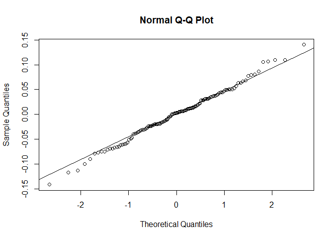<!-- -->

```
##                                 2.5 %       97.5 %
## .sig01                     0.02967421  0.070092456
## .sigma                     0.04669147  0.060763485
## (Intercept)               -0.90070215 -0.849129278
## Treatment1                -0.01195666  0.006723307
## Population1                0.02749790  0.079064403
## Treatment1:Population1    -0.02439909 -0.005716967
## TreatmentCurrent:Chamber1 -0.01914064  0.007144826
## TreatmentFuture:Chamber1  -0.02134209  0.005225668
```

``` r
RS_anov_22 <- do_anov2(RS_lm_22)
```

```
## Type III Analysis of Variance Table with Satterthwaite's method
##                        Sum Sq  Mean Sq NumDF  DenDF F value   Pr(>F)   
## Treatment            0.000142 0.000142     1 108.25  0.0490 0.825297   
## Population           0.046725 0.046725     1  13.54 16.0642 0.001379 **
## Treatment:Population 0.028303 0.028303     1 107.87  9.7305 0.002325 **
## Treatment:Chamber    0.006380 0.003190     2 107.90  1.0967 0.337676   
## ---
## Signif. codes:  0 '***' 0.001 '**' 0.01 '*' 0.05 '.' 0.1 ' ' 1
```

``` r
RS_anov_22$trait <- "l10_Root to Shoot Ratio"
RS_means_22 <- get_table_bt(RS_lm_22)
```

There is an interaction, so do posthoc analyses. No chamber effect in full model, so not included here.


``` r
# belm
as.data.frame(summary(lmer(l10_Root_to_Shoot ~ Treatment + (1|Population:Line), data = subset(Dat_2022, Population == "B")))$coefficients)
```

```
## Warning: contrasts dropped from factor Population due to missing levels
## Warning: contrasts dropped from factor Population due to missing levels
## Warning: contrasts dropped from factor Population due to missing levels
## Warning: contrasts dropped from factor Population due to missing levels
```

```
##                Estimate  Std. Error        df    t value          Pr(>|t|)
## (Intercept) -0.82112574 0.022528541  6.765913 -36.448243 0.000000005092894
## Treatment1  -0.01734827 0.006539639 55.709558  -2.652787 0.010380577635618
```

``` r
as.data.frame(summary(lmer(l10_Root_to_Shoot ~ Treatment + (1|Population:Line)-1, data = subset(Dat_2022, Population == "B")))$coefficients) # not concerned about the warnings
```

```
## Warning: contrasts dropped from factor Population due to missing levels
## Warning: contrasts dropped from factor Population due to missing levels
## Warning: contrasts dropped from factor Population due to missing levels
## Warning: contrasts dropped from factor Population due to missing levels
```

```
##                    Estimate Std. Error       df   t value           Pr(>|t|)
## TreatmentCurrent -0.8384740 0.02363919 8.090928 -35.46966 0.0000000003613274
## TreatmentFuture  -0.8037775 0.02327644 7.791511 -34.53180 0.0000000008333466
```

``` r
# the estimate in the intercept model is the distance between the global mean and the current treatment. switch sign to get to future treatment.
#roda
as.data.frame(summary(lmer(l10_Root_to_Shoot ~ Treatment + (1|Population:Line), data = subset(Dat_2022, Population == "R")))$coefficients) # not concerned about the warnings
```

```
## Warning: contrasts dropped from factor Population due to missing levels
## Warning: contrasts dropped from factor Population due to missing levels
## Warning: contrasts dropped from factor Population due to missing levels
## Warning: contrasts dropped from factor Population due to missing levels
```

```
##                Estimate  Std. Error        df    t value     Pr(>|t|)
## (Intercept) -0.92833064 0.014189130  7.056572 -65.425480 4.377185e-11
## Treatment1   0.01257593 0.007081232 54.114788   1.775952 8.136341e-02
```

``` r
#cur
as.data.frame(summary(lmer(l10_Root_to_Shoot ~ Population + (1|Population:Line), data = subset(Dat_2022, Treatment == "Current")))$coefficients) 
```

```
##                Estimate Std. Error       df    t value     Pr(>|t|)
## (Intercept) -0.88063864 0.01717698 13.18091 -51.268539 1.458549e-16
## Population1  0.03511607 0.01717698 13.18091   2.044368 6.142738e-02
```

``` r
#fut
as.data.frame(summary(lmer(l10_Root_to_Shoot ~ Population + (1|Population:Line), data = subset(Dat_2022, Treatment == "Future")))$coefficients)
```

```
##                Estimate Std. Error       df    t value     Pr(>|t|)
## (Intercept) -0.87408324 0.01328505 13.75198 -65.794518 1.379363e-18
## Population1  0.06780111 0.01328505 13.75198   5.103566 1.698402e-04
```


### Stomatal Density
Not analyzing stomata average becuase density is the average information with the viewing window area included in the calculation.

``` r
# stomatal density - imaged on harvest day
sto_den_lm_22 <- do_lmer2(Dat_2022$l10_Stomata_density)
```

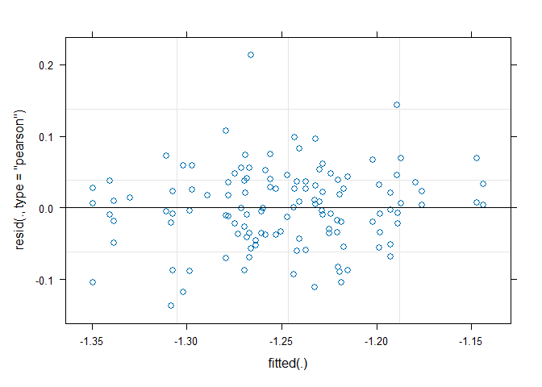<!-- -->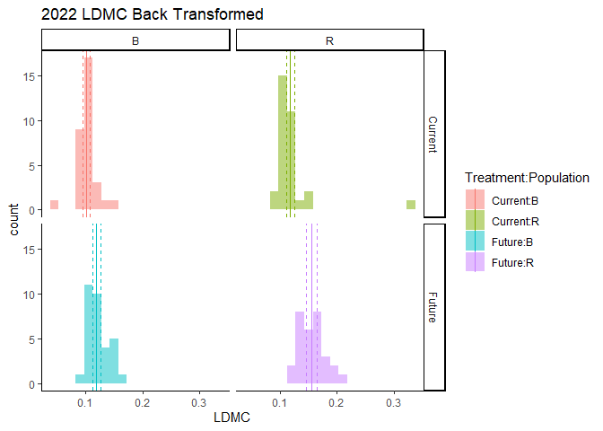<!-- -->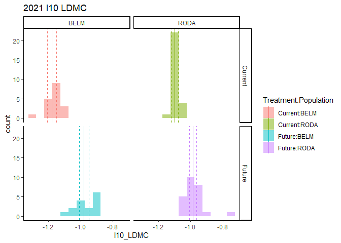<!-- -->

```
## [1] "the number of complete cases is 127"
```

```
## Linear mixed model fit by REML. t-tests use Satterthwaite's method [
## lmerModLmerTest]
## Formula: 
## trait ~ Treatment * Population + Treatment:Chamber + (1 | Population:Line)
##    Data: data
## 
## REML criterion at convergence: -299.6
## 
## Scaled residuals: 
##     Min      1Q  Median      3Q     Max 
## -2.3586 -0.6030 -0.0011  0.5991  3.6672 
## 
## Random effects:
##  Groups          Name        Variance Std.Dev.
##  Population:Line (Intercept) 0.001170 0.03421 
##  Residual                    0.003383 0.05816 
## Number of obs: 127, groups:  Population:Line, 16
## 
## Fixed effects:
##                             Estimate Std. Error         df t value Pr(>|t|)    
## (Intercept)                 2.765004   0.010214  13.393049 270.720  < 2e-16 ***
## Treatment1                 -0.020502   0.005180 108.428073  -3.958 0.000135 ***
## Population1                -0.030335   0.010212  13.393007  -2.971 0.010542 *  
## Treatment1:Population1      0.003031   0.005180 108.463193   0.585 0.559669    
## TreatmentCurrent:Chamber1   0.005461   0.007295 108.212670   0.749 0.455691    
## TreatmentFuture:Chamber1    0.001724   0.007364 108.815721   0.234 0.815344    
## ---
## Signif. codes:  0 '***' 0.001 '**' 0.01 '*' 0.05 '.' 0.1 ' ' 1
## 
## Correlation of Fixed Effects:
##             (Intr) Trtmn1 Ppltn1 Tr1:P1 TrC:C1
## Treatment1   0.009                            
## Population1  0.041  0.018                     
## Trtmnt1:Pp1  0.019 -0.003  0.010              
## TrtmntCr:C1 -0.005  0.000 -0.005  0.000       
## TrtmntFt:C1 -0.018  0.009 -0.006 -0.016  0.001
```

```
## Computing profile confidence intervals ...
```

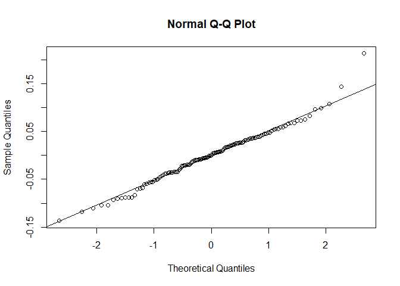<!-- -->

```
##                                  2.5 %      97.5 %
## .sig01                     0.017716412  0.05195990
## .sigma                     0.050364286  0.06551283
## (Intercept)                2.745101417  2.78487629
## Treatment1                -0.030538747 -0.01043163
## Population1               -0.050248565 -0.01047892
## Treatment1:Population1    -0.007021201  0.01308637
## TreatmentCurrent:Chamber1 -0.008611128  0.01972901
## TreatmentFuture:Chamber1  -0.012633925  0.01595629
```

``` r
sto_den_anov_22 <- do_anov2(sto_den_lm_22)
```

```
## Type III Analysis of Variance Table with Satterthwaite's method
##                         Sum Sq   Mean Sq NumDF   DenDF F value  Pr(>F)  
## Treatment            0.0220343 0.0220343     1 108.759  6.5139 0.01209 *
## Population           0.0298484 0.0298484     1  13.393  8.8239 0.01054 *
## Treatment:Population 0.0011582 0.0011582     1 108.463  0.3424 0.55967  
## Treatment:Chamber    0.0020797 0.0010399     2 108.513  0.3074 0.73599  
## ---
## Signif. codes:  0 '***' 0.001 '**' 0.01 '*' 0.05 '.' 0.1 ' ' 1
```

``` r
sto_den_anov_22$trait <- "l10_Stomatal Density"
sto_den_means_22 <- get_table_bt(sto_den_lm_22)
# no interaction

# check results don't change if using stomatal average
do_anov2(do_lmer2(Dat_2022$l10_Stomata_avg))
```

<!-- -->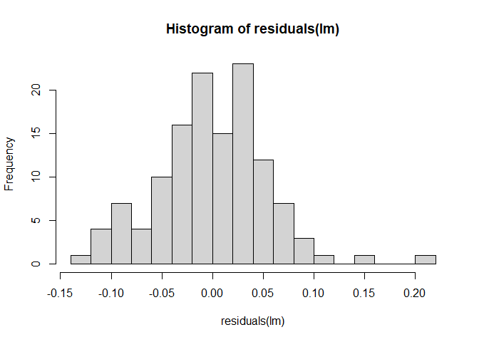<!-- --><!-- -->

```
## [1] "the number of complete cases is 127"
```

```
## Linear mixed model fit by REML. t-tests use Satterthwaite's method [
## lmerModLmerTest]
## Formula: 
## trait ~ Treatment * Population + Treatment:Chamber + (1 | Population:Line)
##    Data: data
## 
## REML criterion at convergence: -299.6
## 
## Scaled residuals: 
##     Min      1Q  Median      3Q     Max 
## -2.3586 -0.6030 -0.0011  0.5991  3.6672 
## 
## Random effects:
##  Groups          Name        Variance Std.Dev.
##  Population:Line (Intercept) 0.001170 0.03421 
##  Residual                    0.003383 0.05816 
## Number of obs: 127, groups:  Population:Line, 16
## 
## Fixed effects:
##                             Estimate Std. Error         df t value Pr(>|t|)    
## (Intercept)                 1.585336   0.010214  13.393049 155.219  < 2e-16 ***
## Treatment1                 -0.020502   0.005180 108.428073  -3.958 0.000135 ***
## Population1                -0.030335   0.010212  13.393007  -2.971 0.010542 *  
## Treatment1:Population1      0.003031   0.005180 108.463193   0.585 0.559669    
## TreatmentCurrent:Chamber1   0.005461   0.007295 108.212670   0.749 0.455691    
## TreatmentFuture:Chamber1    0.001724   0.007364 108.815721   0.234 0.815344    
## ---
## Signif. codes:  0 '***' 0.001 '**' 0.01 '*' 0.05 '.' 0.1 ' ' 1
## 
## Correlation of Fixed Effects:
##             (Intr) Trtmn1 Ppltn1 Tr1:P1 TrC:C1
## Treatment1   0.009                            
## Population1  0.041  0.018                     
## Trtmnt1:Pp1  0.019 -0.003  0.010              
## TrtmntCr:C1 -0.005  0.000 -0.005  0.000       
## TrtmntFt:C1 -0.018  0.009 -0.006 -0.016  0.001
```

```
## Computing profile confidence intervals ...
```

<!-- -->

```
##                                  2.5 %      97.5 %
## .sig01                     0.017716412  0.05195990
## .sigma                     0.050364286  0.06551283
## (Intercept)                1.565434262  1.60520914
## Treatment1                -0.030538747 -0.01043163
## Population1               -0.050248565 -0.01047892
## Treatment1:Population1    -0.007021201  0.01308637
## TreatmentCurrent:Chamber1 -0.008611128  0.01972901
## TreatmentFuture:Chamber1  -0.012633925  0.01595629
## Type III Analysis of Variance Table with Satterthwaite's method
##                         Sum Sq   Mean Sq NumDF   DenDF F value  Pr(>F)  
## Treatment            0.0220343 0.0220343     1 108.759  6.5139 0.01209 *
## Population           0.0298484 0.0298484     1  13.393  8.8239 0.01054 *
## Treatment:Population 0.0011582 0.0011582     1 108.463  0.3424 0.55967  
## Treatment:Chamber    0.0020797 0.0010399     2 108.513  0.3074 0.73599  
## ---
## Signif. codes:  0 '***' 0.001 '**' 0.01 '*' 0.05 '.' 0.1 ' ' 1
```

```
##                           Sum Sq     Mean Sq NumDF     DenDF   F value
## Treatment            0.022034327 0.022034327     1 108.75907 6.5138865
## Population           0.029848386 0.029848386     1  13.39301 8.8239135
## Treatment:Population 0.001158188 0.001158188     1 108.46319 0.3423887
## Treatment:Chamber    0.002079714 0.001039857     2 108.51306 0.3074072
##                          Pr(>F)  exp
## Treatment            0.01209153 2022
## Population           0.01054210 2022
## Treatment:Population 0.55966904 2022
## Treatment:Chamber    0.73598935 2022
```

``` r
# results don't change. might want to switch to this if can't figure out actual area of those photos. Published rates for Arabidopsis are 87-204 stomata/mm2
```

No interaction but do individual models to see difference in future environment. no chamber effect in full model so not included here


``` r
# belm
as.data.frame(summary(lmer(l10_Stomata_density ~ Treatment + (1|Population:Line), data = subset(Dat_2022, Population == "B")))$coefficients) # not concerened about the warnings
```

```
## Warning: contrasts dropped from factor Population due to missing levels
## Warning: contrasts dropped from factor Population due to missing levels
## Warning: contrasts dropped from factor Population due to missing levels
## Warning: contrasts dropped from factor Population due to missing levels
```

```
##               Estimate Std. Error        df    t value     Pr(>|t|)
## (Intercept)  2.7347795 0.01659878  6.466921 164.757844 5.817849e-13
## Treatment1  -0.0174782 0.00774581 56.319027  -2.256472 2.794061e-02
```

``` r
#roda
as.data.frame(summary(lmer(l10_Stomata_density ~ Treatment + (1|Population:Line), data = subset(Dat_2022, Population == "R")))$coefficients) # not concerened about the warnings
```

```
## Warning: contrasts dropped from factor Population due to missing levels
## Warning: contrasts dropped from factor Population due to missing levels
## Warning: contrasts dropped from factor Population due to missing levels
## Warning: contrasts dropped from factor Population due to missing levels
```

```
##                Estimate  Std. Error        df    t value     Pr(>|t|)
## (Intercept)  2.79535688 0.012412243  7.028156 225.209648 8.025143e-15
## Treatment1  -0.02355207 0.006756048 54.097791  -3.486071 9.806530e-04
```

``` r
#cur
as.data.frame(summary(lmer(l10_Stomata_density ~ Population + (1|Population:Line), data = subset(Dat_2022, Treatment == "Current")))$coefficients) 
```

```
##                Estimate Std. Error       df   t value     Pr(>|t|)
## (Intercept)  2.74500738 0.01099955 13.57051 249.55629 3.028302e-26
## Population1 -0.02679744 0.01099955 13.57051  -2.43623 2.928103e-02
```

``` r
#fut
as.data.frame(summary(lmer(l10_Stomata_density ~ Population + (1|Population:Line), data = subset(Dat_2022, Treatment == "Future")))$coefficients)
```

```
##                Estimate Std. Error      df    t value     Pr(>|t|)
## (Intercept)  2.78540039 0.01265696 13.2566 220.068752 5.215054e-25
## Population1 -0.03364559 0.01265696 13.2566  -2.658269 1.943344e-02
```

### Outputs

1) results table


``` r
AnovaResults_2022 <- rbind(emergence_anov_22, bolting_anov_22, fresh_anov_22, hyd_anov_22, dry_anov_22, area_anov_22, per_anov_22, sla_anov_22, ldmc_anov_22, rwc_anov_22, LN_PreVern_anov_22, LN_Jun6_anov_22, LN_Jun13_anov_22, LN_bolt_anov_22, AG_anov_22, BG_anov_22, RS_anov_22, sto_den_anov_22 )

write.csv(AnovaResults_2022, file = "data/AnovaResults_2022.csv", row.names = TRUE)
```

2) All the tables to read in to the figures code


``` r
# change column names
# not transformed
dfs3 <- c("bolting_means_22", "dry_means_22", "area_means_22", "per_means_22", "rwc_means_22", "LN_PreVern_means_22", "LN_Jun6_means_22", "LN_Jun13_means_22", "BG_means_22")

for (i in dfs3) {
  x=get(i)
  colnames(x) <- c("Treatment", "Population", "Mean", "SE", "Df", "LL_95", "UL_95")
  assign(i,x)
}

# transformed
dfs4 <- c("emergence_means_22", "fresh_means_22", "hyd_means_22", "sla_means_22", "ldmc_means_22", "LN_bolt_means_22", "AG_means_22", "RS_means_22", "sto_den_means_22")

for (i in dfs4) {
  x=get(i)
  colnames(x) <- c("Treatment", "Population", "Mean", "SE", "Df", "LL_95", "UL_95", "Bk_Mean", "Bk_LL_95", "Bk_UL_95")
  assign(i,x)
}

# create list of data frames
Means_2022 <- list(emergence_means_22, bolting_means_22, fresh_means_22, hyd_means_22, dry_means_22, area_means_22, per_means_22, sla_means_22, ldmc_means_22, rwc_means_22, LN_PreVern_means_22, LN_Jun6_means_22, LN_Jun13_means_22, LN_bolt_means_22, AG_means_22, BG_means_22, RS_means_22, sto_den_means_22)

# name that list
names(Means_2022) <- c("emergence_means_22", "bolting_means_22", "fresh_means_22", "hyd_means_22", "dry_means_22", "area_means_22", "per_means_22", "sla_means_22", "ldmc_means_22", "rwc_means_22", "LN_PreVern_means_22", "LN_Jun6_means_22", "LN_Jun13_means_22", "LN_bolt_means_22", "AG_means_22", "BG_means_22", "RS_means_22", "sto_den_means_22")

# save named list
save(Means_2022, file = "data/ModelMeans_2022.robj")
```

## Sample size information

The goal here is to know how many lines and how many replicates per line for this experiment.

What I want is a count of total plants, a mean, min, and max of plants per line, and the number of lines per population


``` r
# sample size of 2022 total
Dat_2022 %>% count(Treatment)
```

```
##   Treatment  n
## 1   Current 64
## 2    Future 64
```

``` r
# 72 plants in current, 69 plants in future
Dat_2022 %>% count(Treatment, Population)
```

```
##   Treatment Population  n
## 1   Current          B 32
## 2   Current          R 32
## 3    Future          B 32
## 4    Future          R 32
```

``` r
# in each treatment, 20 are IT, 30 are SW

# from models know that there are 16 unique lines. 8 IT, 8 SW. ( but 1 line fully died in IT cur)

n_2022 <- Dat_2022 %>%
  group_by(Treatment) %>%
  group_by(Population, .add = TRUE) %>%
  group_by(Line, .add = TRUE) %>%
  count

# so only line with 1 rep is Belm 1. Then everything has 2 but RIL parents. B12 has 7, R47 has 6.
n_2022 %>% 
  group_by(Treatment) %>%
  summarize(min = min(n), mean = mean(n), median = median(n), max = max(n))
```

```
## # A tibble: 2 × 5
##   Treatment   min  mean median   max
##   <fct>     <int> <dbl>  <dbl> <int>
## 1 Current       1  4.27      4     6
## 2 Future        1  4         4     6
```

``` r
n_2022 %>% 
  group_by(Treatment) %>%
  group_by(Population, .add = TRUE) %>%
  summarize(min = min(n), mean = mean(n), median = median(n), max = max(n))
```

```
## `summarise()` has grouped output by 'Treatment'. You can override using the
## `.groups` argument.
```

```
## # A tibble: 4 × 6
## # Groups:   Treatment [2]
##   Treatment Population   min  mean median   max
##   <fct>     <fct>      <int> <dbl>  <dbl> <int>
## 1 Current   B              1  4.57    5       6
## 2 Current   R              4  4       4       4
## 3 Future    B              1  4       4.5     6
## 4 Future    R              4  4       4       4
```

#Notes
The AnovaResults_YEAR files that were output have been copied over to the data/ModelResults.xlsx on 8/2/2024 to make formatting changes and color code for easier comparison and analysis.

The spreadsheet is color coded so p values below 0.05 are green, between 0.1 and 0.05 are orange, and others are left white. The model terms are red if there is disagreement in significance between experiments for traits that were measured in both experiments. Post hoc analyses if there was an interaction between population and treatment are only recorded here (as of 7/19/2024) and are only done for 2021 as of 8/2/2024.More were done after and added to the spreadsheet with a note of if there was an interaction or not.

Choosing to only include SLA and move LDMC to the supplemental so I want correlation information for the two traits.

``` r
cor.test(Dat_2021_TwoTrt$SLA, Dat_2021_TwoTrt$LDMC)
```

```
## 
## 	Pearson's product-moment correlation
## 
## data:  Dat_2021_TwoTrt$SLA and Dat_2021_TwoTrt$LDMC
## t = -8.8506, df = 81, p-value = 1.569e-13
## alternative hypothesis: true correlation is not equal to 0
## 95 percent confidence interval:
##  -0.7964101 -0.5719779
## sample estimates:
##        cor 
## -0.7011649
```

``` r
cor.test(Dat_2022$SLA, Dat_2022$LDMC)
```

```
## 
## 	Pearson's product-moment correlation
## 
## data:  Dat_2022$SLA and Dat_2022$LDMC
## t = -12.482, df = 124, p-value < 2.2e-16
## alternative hypothesis: true correlation is not equal to 0
## 95 percent confidence interval:
##  -0.8147757 -0.6570626
## sample estimates:
##        cor 
## -0.7462113
```


# Results Tables

## Main Text Tables

``` r
sjPlot::tab_model(eTof_lm_21, RWC_lm_21, rwc_lm_22, sto_den_lm_22, SLA_lm_21, sla_lm_22, RS_lm_22 ,  fitness_lm_21, 
                   collapse.ci = TRUE, 
                  dv.labels = c("Emergence To Flower 21", "RWC 21", "RWC 22", "Stomatal Density 22","SLA 21", "SLA 22",  "Root-to-Shoot 22", "Fitness 21"), 
                 pred.labels = c("(Intercept)", "Treatment", "Population", "Trt x Pop Interaction", "Current Trt x Chamber", "Future Trt x Chamber")
                 
        )
```

<table style="border-collapse:collapse; border:none;">
<tr>
<th style="border-top: double; text-align:center; font-style:normal; font-weight:bold; padding:0.2cm;  text-align:left; ">&nbsp;</th>
<th colspan="2" style="border-top: double; text-align:center; font-style:normal; font-weight:bold; padding:0.2cm; ">Emergence To Flower 21</th>
<th colspan="2" style="border-top: double; text-align:center; font-style:normal; font-weight:bold; padding:0.2cm; ">RWC 21</th>
<th colspan="2" style="border-top: double; text-align:center; font-style:normal; font-weight:bold; padding:0.2cm; ">RWC 22</th>
<th colspan="2" style="border-top: double; text-align:center; font-style:normal; font-weight:bold; padding:0.2cm; ">Stomatal Density 22</th>
<th colspan="2" style="border-top: double; text-align:center; font-style:normal; font-weight:bold; padding:0.2cm; ">SLA 21</th>
<th colspan="2" style="border-top: double; text-align:center; font-style:normal; font-weight:bold; padding:0.2cm; ">SLA 22</th>
<th colspan="2" style="border-top: double; text-align:center; font-style:normal; font-weight:bold; padding:0.2cm; ">Root-to-Shoot 22</th>
<th colspan="2" style="border-top: double; text-align:center; font-style:normal; font-weight:bold; padding:0.2cm; ">Fitness 21</th>
</tr>
<tr>
<td style=" text-align:center; border-bottom:1px solid; font-style:italic; font-weight:normal;  text-align:left; ">Predictors</td>
<td style=" text-align:center; border-bottom:1px solid; font-style:italic; font-weight:normal;  ">Estimates</td>
<td style=" text-align:center; border-bottom:1px solid; font-style:italic; font-weight:normal;  ">p</td>
<td style=" text-align:center; border-bottom:1px solid; font-style:italic; font-weight:normal;  ">Estimates</td>
<td style=" text-align:center; border-bottom:1px solid; font-style:italic; font-weight:normal;  ">p</td>
<td style=" text-align:center; border-bottom:1px solid; font-style:italic; font-weight:normal;  ">Estimates</td>
<td style=" text-align:center; border-bottom:1px solid; font-style:italic; font-weight:normal;  col7">p</td>
<td style=" text-align:center; border-bottom:1px solid; font-style:italic; font-weight:normal;  col8">Estimates</td>
<td style=" text-align:center; border-bottom:1px solid; font-style:italic; font-weight:normal;  col9">p</td>
<td style=" text-align:center; border-bottom:1px solid; font-style:italic; font-weight:normal;  0">Estimates</td>
<td style=" text-align:center; border-bottom:1px solid; font-style:italic; font-weight:normal;  1">p</td>
<td style=" text-align:center; border-bottom:1px solid; font-style:italic; font-weight:normal;  2">Estimates</td>
<td style=" text-align:center; border-bottom:1px solid; font-style:italic; font-weight:normal;  3">p</td>
<td style=" text-align:center; border-bottom:1px solid; font-style:italic; font-weight:normal;  4">Estimates</td>
<td style=" text-align:center; border-bottom:1px solid; font-style:italic; font-weight:normal;  5">p</td>
<td style=" text-align:center; border-bottom:1px solid; font-style:italic; font-weight:normal;  6">Estimates</td>
<td style=" text-align:center; border-bottom:1px solid; font-style:italic; font-weight:normal;  7">p</td>
</tr>
<tr>
<td style=" padding:0.2cm; text-align:left; vertical-align:top; text-align:left; ">(Intercept)</td>
<td style=" padding:0.2cm; text-align:left; vertical-align:top; text-align:center;  ">107.22<br>(104.69&nbsp;&ndash;&nbsp;109.76)</td>
<td style=" padding:0.2cm; text-align:left; vertical-align:top; text-align:center;  "><strong>&lt;0.001</strong></td>
<td style=" padding:0.2cm; text-align:left; vertical-align:top; text-align:center;  ">0.85<br>(0.84&nbsp;&ndash;&nbsp;0.86)</td>
<td style=" padding:0.2cm; text-align:left; vertical-align:top; text-align:center;  "><strong>&lt;0.001</strong></td>
<td style=" padding:0.2cm; text-align:left; vertical-align:top; text-align:center;  ">0.80<br>(0.79&nbsp;&ndash;&nbsp;0.81)</td>
<td style=" padding:0.2cm; text-align:left; vertical-align:top; text-align:center;  col7"><strong>&lt;0.001</strong></td>
<td style=" padding:0.2cm; text-align:left; vertical-align:top; text-align:center;  col8">2.77<br>(2.74&nbsp;&ndash;&nbsp;2.79)</td>
<td style=" padding:0.2cm; text-align:left; vertical-align:top; text-align:center;  col9"><strong>&lt;0.001</strong></td>
<td style=" padding:0.2cm; text-align:left; vertical-align:top; text-align:center;  0">2.67<br>(2.64&nbsp;&ndash;&nbsp;2.69)</td>
<td style=" padding:0.2cm; text-align:left; vertical-align:top; text-align:center;  1"><strong>&lt;0.001</strong></td>
<td style=" padding:0.2cm; text-align:left; vertical-align:top; text-align:center;  2">2.45<br>(2.43&nbsp;&ndash;&nbsp;2.47)</td>
<td style=" padding:0.2cm; text-align:left; vertical-align:top; text-align:center;  3"><strong>&lt;0.001</strong></td>
<td style=" padding:0.2cm; text-align:left; vertical-align:top; text-align:center;  4">&#45;0.88<br>(-0.90&nbsp;&ndash;&nbsp;-0.85)</td>
<td style=" padding:0.2cm; text-align:left; vertical-align:top; text-align:center;  5"><strong>&lt;0.001</strong></td>
<td style=" padding:0.2cm; text-align:left; vertical-align:top; text-align:center; modelcolumn8 6">20873.25<br>(17064.43&nbsp;&ndash;&nbsp;24682.07)</td>
<td style=" padding:0.2cm; text-align:left; vertical-align:top; text-align:center; modelcolumn8 7"><strong>&lt;0.001</strong></td>
</tr>
<tr>
<td style=" padding:0.2cm; text-align:left; vertical-align:top; text-align:left; ">Treatment</td>
<td style=" padding:0.2cm; text-align:left; vertical-align:top; text-align:center;  ">&#45;0.79<br>(-1.65&nbsp;&ndash;&nbsp;0.07)</td>
<td style=" padding:0.2cm; text-align:left; vertical-align:top; text-align:center;  ">0.072</td>
<td style=" padding:0.2cm; text-align:left; vertical-align:top; text-align:center;  ">0.03<br>(0.02&nbsp;&ndash;&nbsp;0.04)</td>
<td style=" padding:0.2cm; text-align:left; vertical-align:top; text-align:center;  "><strong>&lt;0.001</strong></td>
<td style=" padding:0.2cm; text-align:left; vertical-align:top; text-align:center;  ">0.04<br>(0.04&nbsp;&ndash;&nbsp;0.05)</td>
<td style=" padding:0.2cm; text-align:left; vertical-align:top; text-align:center;  col7"><strong>&lt;0.001</strong></td>
<td style=" padding:0.2cm; text-align:left; vertical-align:top; text-align:center;  col8">&#45;0.02<br>(-0.03&nbsp;&ndash;&nbsp;-0.01)</td>
<td style=" padding:0.2cm; text-align:left; vertical-align:top; text-align:center;  col9"><strong>&lt;0.001</strong></td>
<td style=" padding:0.2cm; text-align:left; vertical-align:top; text-align:center;  0">0.07<br>(0.06&nbsp;&ndash;&nbsp;0.09)</td>
<td style=" padding:0.2cm; text-align:left; vertical-align:top; text-align:center;  1"><strong>&lt;0.001</strong></td>
<td style=" padding:0.2cm; text-align:left; vertical-align:top; text-align:center;  2">0.04<br>(0.03&nbsp;&ndash;&nbsp;0.06)</td>
<td style=" padding:0.2cm; text-align:left; vertical-align:top; text-align:center;  3"><strong>&lt;0.001</strong></td>
<td style=" padding:0.2cm; text-align:left; vertical-align:top; text-align:center;  4">&#45;0.00<br>(-0.01&nbsp;&ndash;&nbsp;0.01)</td>
<td style=" padding:0.2cm; text-align:left; vertical-align:top; text-align:center;  5">0.595</td>
<td style=" padding:0.2cm; text-align:left; vertical-align:top; text-align:center; modelcolumn8 6">15482.40<br>(12975.11&nbsp;&ndash;&nbsp;17989.68)</td>
<td style=" padding:0.2cm; text-align:left; vertical-align:top; text-align:center; modelcolumn8 7"><strong>&lt;0.001</strong></td>
</tr>
<tr>
<td style=" padding:0.2cm; text-align:left; vertical-align:top; text-align:left; ">Population</td>
<td style=" padding:0.2cm; text-align:left; vertical-align:top; text-align:center;  ">&#45;11.33<br>(-13.86&nbsp;&ndash;&nbsp;-8.80)</td>
<td style=" padding:0.2cm; text-align:left; vertical-align:top; text-align:center;  "><strong>&lt;0.001</strong></td>
<td style=" padding:0.2cm; text-align:left; vertical-align:top; text-align:center;  ">&#45;0.00<br>(-0.01&nbsp;&ndash;&nbsp;0.01)</td>
<td style=" padding:0.2cm; text-align:left; vertical-align:top; text-align:center;  ">0.677</td>
<td style=" padding:0.2cm; text-align:left; vertical-align:top; text-align:center;  ">&#45;0.02<br>(-0.02&nbsp;&ndash;&nbsp;-0.01)</td>
<td style=" padding:0.2cm; text-align:left; vertical-align:top; text-align:center;  col7"><strong>&lt;0.001</strong></td>
<td style=" padding:0.2cm; text-align:left; vertical-align:top; text-align:center;  col8">&#45;0.03<br>(-0.05&nbsp;&ndash;&nbsp;-0.01)</td>
<td style=" padding:0.2cm; text-align:left; vertical-align:top; text-align:center;  col9"><strong>0.004</strong></td>
<td style=" padding:0.2cm; text-align:left; vertical-align:top; text-align:center;  0">0.08<br>(0.05&nbsp;&ndash;&nbsp;0.10)</td>
<td style=" padding:0.2cm; text-align:left; vertical-align:top; text-align:center;  1"><strong>&lt;0.001</strong></td>
<td style=" padding:0.2cm; text-align:left; vertical-align:top; text-align:center;  2">0.11<br>(0.09&nbsp;&ndash;&nbsp;0.13)</td>
<td style=" padding:0.2cm; text-align:left; vertical-align:top; text-align:center;  3"><strong>&lt;0.001</strong></td>
<td style=" padding:0.2cm; text-align:left; vertical-align:top; text-align:center;  4">0.05<br>(0.03&nbsp;&ndash;&nbsp;0.08)</td>
<td style=" padding:0.2cm; text-align:left; vertical-align:top; text-align:center;  5"><strong>&lt;0.001</strong></td>
<td style=" padding:0.2cm; text-align:left; vertical-align:top; text-align:center; modelcolumn8 6">&#45;540.91<br>(-4349.73&nbsp;&ndash;&nbsp;3267.92)</td>
<td style=" padding:0.2cm; text-align:left; vertical-align:top; text-align:center; modelcolumn8 7">0.778</td>
</tr>
<tr>
<td style=" padding:0.2cm; text-align:left; vertical-align:top; text-align:left; ">Trt x Pop Interaction</td>
<td style=" padding:0.2cm; text-align:left; vertical-align:top; text-align:center;  ">&#45;0.05<br>(-0.92&nbsp;&ndash;&nbsp;0.81)</td>
<td style=" padding:0.2cm; text-align:left; vertical-align:top; text-align:center;  ">0.901</td>
<td style=" padding:0.2cm; text-align:left; vertical-align:top; text-align:center;  ">0.01<br>(&#45;0.00&nbsp;&ndash;&nbsp;0.01)</td>
<td style=" padding:0.2cm; text-align:left; vertical-align:top; text-align:center;  ">0.076</td>
<td style=" padding:0.2cm; text-align:left; vertical-align:top; text-align:center;  ">0.01<br>(0.00&nbsp;&ndash;&nbsp;0.01)</td>
<td style=" padding:0.2cm; text-align:left; vertical-align:top; text-align:center;  col7"><strong>0.006</strong></td>
<td style=" padding:0.2cm; text-align:left; vertical-align:top; text-align:center;  col8">0.00<br>(&#45;0.01&nbsp;&ndash;&nbsp;0.01)</td>
<td style=" padding:0.2cm; text-align:left; vertical-align:top; text-align:center;  col9">0.560</td>
<td style=" padding:0.2cm; text-align:left; vertical-align:top; text-align:center;  0">0.03<br>(0.02&nbsp;&ndash;&nbsp;0.05)</td>
<td style=" padding:0.2cm; text-align:left; vertical-align:top; text-align:center;  1"><strong>&lt;0.001</strong></td>
<td style=" padding:0.2cm; text-align:left; vertical-align:top; text-align:center;  2">&#45;0.01<br>(-0.02&nbsp;&ndash;&nbsp;0.00)</td>
<td style=" padding:0.2cm; text-align:left; vertical-align:top; text-align:center;  3">0.107</td>
<td style=" padding:0.2cm; text-align:left; vertical-align:top; text-align:center;  4">&#45;0.02<br>(-0.02&nbsp;&ndash;&nbsp;-0.01)</td>
<td style=" padding:0.2cm; text-align:left; vertical-align:top; text-align:center;  5"><strong>0.002</strong></td>
<td style=" padding:0.2cm; text-align:left; vertical-align:top; text-align:center; modelcolumn8 6">&#45;2006.15<br>(-4513.44&nbsp;&ndash;&nbsp;501.13)</td>
<td style=" padding:0.2cm; text-align:left; vertical-align:top; text-align:center; modelcolumn8 7">0.115</td>
</tr>
<tr>
<td style=" padding:0.2cm; text-align:left; vertical-align:top; text-align:left; ">Current Trt x Chamber</td>
<td style=" padding:0.2cm; text-align:left; vertical-align:top; text-align:center;  "></td>
<td style=" padding:0.2cm; text-align:left; vertical-align:top; text-align:center;  "></td>
<td style=" padding:0.2cm; text-align:left; vertical-align:top; text-align:center;  "></td>
<td style=" padding:0.2cm; text-align:left; vertical-align:top; text-align:center;  "></td>
<td style=" padding:0.2cm; text-align:left; vertical-align:top; text-align:center;  ">&#45;0.01<br>(-0.02&nbsp;&ndash;&nbsp;0.00)</td>
<td style=" padding:0.2cm; text-align:left; vertical-align:top; text-align:center;  col7">0.106</td>
<td style=" padding:0.2cm; text-align:left; vertical-align:top; text-align:center;  col8">0.01<br>(&#45;0.01&nbsp;&ndash;&nbsp;0.02)</td>
<td style=" padding:0.2cm; text-align:left; vertical-align:top; text-align:center;  col9">0.456</td>
<td style=" padding:0.2cm; text-align:left; vertical-align:top; text-align:center;  0"></td>
<td style=" padding:0.2cm; text-align:left; vertical-align:top; text-align:center;  1"></td>
<td style=" padding:0.2cm; text-align:left; vertical-align:top; text-align:center;  2">0.02<br>(&#45;0.00&nbsp;&ndash;&nbsp;0.04)</td>
<td style=" padding:0.2cm; text-align:left; vertical-align:top; text-align:center;  3">0.085</td>
<td style=" padding:0.2cm; text-align:left; vertical-align:top; text-align:center;  4">&#45;0.01<br>(-0.02&nbsp;&ndash;&nbsp;0.01)</td>
<td style=" padding:0.2cm; text-align:left; vertical-align:top; text-align:center;  5">0.377</td>
<td style=" padding:0.2cm; text-align:left; vertical-align:top; text-align:center; modelcolumn8 6"></td>
<td style=" padding:0.2cm; text-align:left; vertical-align:top; text-align:center; modelcolumn8 7"></td>
</tr>
<tr>
<td style=" padding:0.2cm; text-align:left; vertical-align:top; text-align:left; ">Future Trt x Chamber</td>
<td style=" padding:0.2cm; text-align:left; vertical-align:top; text-align:center;  "></td>
<td style=" padding:0.2cm; text-align:left; vertical-align:top; text-align:center;  "></td>
<td style=" padding:0.2cm; text-align:left; vertical-align:top; text-align:center;  "></td>
<td style=" padding:0.2cm; text-align:left; vertical-align:top; text-align:center;  "></td>
<td style=" padding:0.2cm; text-align:left; vertical-align:top; text-align:center;  ">0.00<br>(&#45;0.01&nbsp;&ndash;&nbsp;0.01)</td>
<td style=" padding:0.2cm; text-align:left; vertical-align:top; text-align:center;  col7">0.601</td>
<td style=" padding:0.2cm; text-align:left; vertical-align:top; text-align:center;  col8">0.00<br>(&#45;0.01&nbsp;&ndash;&nbsp;0.02)</td>
<td style=" padding:0.2cm; text-align:left; vertical-align:top; text-align:center;  col9">0.815</td>
<td style=" padding:0.2cm; text-align:left; vertical-align:top; text-align:center;  0"></td>
<td style=" padding:0.2cm; text-align:left; vertical-align:top; text-align:center;  1"></td>
<td style=" padding:0.2cm; text-align:left; vertical-align:top; text-align:center;  2">&#45;0.02<br>(-0.04&nbsp;&ndash;&nbsp;-0.00)</td>
<td style=" padding:0.2cm; text-align:left; vertical-align:top; text-align:center;  3"><strong>0.025</strong></td>
<td style=" padding:0.2cm; text-align:left; vertical-align:top; text-align:center;  4">&#45;0.01<br>(-0.02&nbsp;&ndash;&nbsp;0.01)</td>
<td style=" padding:0.2cm; text-align:left; vertical-align:top; text-align:center;  5">0.237</td>
<td style=" padding:0.2cm; text-align:left; vertical-align:top; text-align:center; modelcolumn8 6"></td>
<td style=" padding:0.2cm; text-align:left; vertical-align:top; text-align:center; modelcolumn8 7"></td>
</tr>
<tr>
<td colspan="17" style="font-weight:bold; text-align:left; padding-top:.8em;">Random Effects</td>
</tr>

<tr>
<td style=" padding:0.2cm; text-align:left; vertical-align:top; text-align:left; padding-top:0.1cm; padding-bottom:0.1cm;">&sigma;<sup>2</sup></td>
<td style=" padding:0.2cm; text-align:left; vertical-align:top; padding-top:0.1cm; padding-bottom:0.1cm; text-align:left;" colspan="2">14.16</td>
<td style=" padding:0.2cm; text-align:left; vertical-align:top; padding-top:0.1cm; padding-bottom:0.1cm; text-align:left;" colspan="2">0.00</td>
<td style=" padding:0.2cm; text-align:left; vertical-align:top; padding-top:0.1cm; padding-bottom:0.1cm; text-align:left;" colspan="2">0.00</td>
<td style=" padding:0.2cm; text-align:left; vertical-align:top; padding-top:0.1cm; padding-bottom:0.1cm; text-align:left;" colspan="2">0.00</td>
<td style=" padding:0.2cm; text-align:left; vertical-align:top; padding-top:0.1cm; padding-bottom:0.1cm; text-align:left;" colspan="2">0.00</td>
<td style=" padding:0.2cm; text-align:left; vertical-align:top; padding-top:0.1cm; padding-bottom:0.1cm; text-align:left;" colspan="2">0.01</td>
<td style=" padding:0.2cm; text-align:left; vertical-align:top; padding-top:0.1cm; padding-bottom:0.1cm; text-align:left;" colspan="2">0.00</td>
<td style=" padding:0.2cm; text-align:left; vertical-align:top; padding-top:0.1cm; padding-bottom:0.1cm; text-align:left;" colspan="2">144910415.71</td>
</tr>

<tr>
<td style=" padding:0.2cm; text-align:left; vertical-align:top; text-align:left; padding-top:0.1cm; padding-bottom:0.1cm;">&tau;<sub>00</sub></td>
<td style=" padding:0.2cm; text-align:left; vertical-align:top; padding-top:0.1cm; padding-bottom:0.1cm; text-align:left;" colspan="2">27.08 <sub>Population:Line</sub></td>
<td style=" padding:0.2cm; text-align:left; vertical-align:top; padding-top:0.1cm; padding-bottom:0.1cm; text-align:left;" colspan="2">0.00 <sub>Population:Line</sub></td>
<td style=" padding:0.2cm; text-align:left; vertical-align:top; padding-top:0.1cm; padding-bottom:0.1cm; text-align:left;" colspan="2">0.00 <sub>Population:Line</sub></td>
<td style=" padding:0.2cm; text-align:left; vertical-align:top; padding-top:0.1cm; padding-bottom:0.1cm; text-align:left;" colspan="2">0.00 <sub>Population:Line</sub></td>
<td style=" padding:0.2cm; text-align:left; vertical-align:top; padding-top:0.1cm; padding-bottom:0.1cm; text-align:left;" colspan="2">0.00 <sub>Population:Line</sub></td>
<td style=" padding:0.2cm; text-align:left; vertical-align:top; padding-top:0.1cm; padding-bottom:0.1cm; text-align:left;" colspan="2">0.00 <sub>Population:Line</sub></td>
<td style=" padding:0.2cm; text-align:left; vertical-align:top; padding-top:0.1cm; padding-bottom:0.1cm; text-align:left;" colspan="2">0.00 <sub>Population:Line</sub></td>
<td style=" padding:0.2cm; text-align:left; vertical-align:top; padding-top:0.1cm; padding-bottom:0.1cm; text-align:left;" colspan="2">37372492.94 <sub>Population:Line</sub></td>

<tr>
<td style=" padding:0.2cm; text-align:left; vertical-align:top; text-align:left; padding-top:0.1cm; padding-bottom:0.1cm;">ICC</td>
<td style=" padding:0.2cm; text-align:left; vertical-align:top; padding-top:0.1cm; padding-bottom:0.1cm; text-align:left;" colspan="2">0.66</td>
<td style=" padding:0.2cm; text-align:left; vertical-align:top; padding-top:0.1cm; padding-bottom:0.1cm; text-align:left;" colspan="2">0.15</td>
<td style=" padding:0.2cm; text-align:left; vertical-align:top; padding-top:0.1cm; padding-bottom:0.1cm; text-align:left;" colspan="2">0.11</td>
<td style=" padding:0.2cm; text-align:left; vertical-align:top; padding-top:0.1cm; padding-bottom:0.1cm; text-align:left;" colspan="2">0.26</td>
<td style=" padding:0.2cm; text-align:left; vertical-align:top; padding-top:0.1cm; padding-bottom:0.1cm; text-align:left;" colspan="2">0.22</td>
<td style=" padding:0.2cm; text-align:left; vertical-align:top; padding-top:0.1cm; padding-bottom:0.1cm; text-align:left;" colspan="2">0.12</td>
<td style=" padding:0.2cm; text-align:left; vertical-align:top; padding-top:0.1cm; padding-bottom:0.1cm; text-align:left;" colspan="2">0.44</td>
<td style=" padding:0.2cm; text-align:left; vertical-align:top; padding-top:0.1cm; padding-bottom:0.1cm; text-align:left;" colspan="2">0.21</td>

<tr>
<td style=" padding:0.2cm; text-align:left; vertical-align:top; text-align:left; padding-top:0.1cm; padding-bottom:0.1cm;">N</td>
<td style=" padding:0.2cm; text-align:left; vertical-align:top; padding-top:0.1cm; padding-bottom:0.1cm; text-align:left;" colspan="2">2 <sub>Population</sub></td>
<td style=" padding:0.2cm; text-align:left; vertical-align:top; padding-top:0.1cm; padding-bottom:0.1cm; text-align:left;" colspan="2">2 <sub>Population</sub></td>
<td style=" padding:0.2cm; text-align:left; vertical-align:top; padding-top:0.1cm; padding-bottom:0.1cm; text-align:left;" colspan="2">2 <sub>Population</sub></td>
<td style=" padding:0.2cm; text-align:left; vertical-align:top; padding-top:0.1cm; padding-bottom:0.1cm; text-align:left;" colspan="2">2 <sub>Population</sub></td>
<td style=" padding:0.2cm; text-align:left; vertical-align:top; padding-top:0.1cm; padding-bottom:0.1cm; text-align:left;" colspan="2">2 <sub>Population</sub></td>
<td style=" padding:0.2cm; text-align:left; vertical-align:top; padding-top:0.1cm; padding-bottom:0.1cm; text-align:left;" colspan="2">2 <sub>Population</sub></td>
<td style=" padding:0.2cm; text-align:left; vertical-align:top; padding-top:0.1cm; padding-bottom:0.1cm; text-align:left;" colspan="2">2 <sub>Population</sub></td>
<td style=" padding:0.2cm; text-align:left; vertical-align:top; padding-top:0.1cm; padding-bottom:0.1cm; text-align:left;" colspan="2">2 <sub>Population</sub></td>

<tr>
<td style=" padding:0.2cm; text-align:left; vertical-align:top; text-align:left; padding-top:0.1cm; padding-bottom:0.1cm;"></td>
<td style=" padding:0.2cm; text-align:left; vertical-align:top; padding-top:0.1cm; padding-bottom:0.1cm; text-align:left;" colspan="2">18 <sub>Line</sub></td>
<td style=" padding:0.2cm; text-align:left; vertical-align:top; padding-top:0.1cm; padding-bottom:0.1cm; text-align:left;" colspan="2">18 <sub>Line</sub></td>
<td style=" padding:0.2cm; text-align:left; vertical-align:top; padding-top:0.1cm; padding-bottom:0.1cm; text-align:left;" colspan="2">14 <sub>Line</sub></td>
<td style=" padding:0.2cm; text-align:left; vertical-align:top; padding-top:0.1cm; padding-bottom:0.1cm; text-align:left;" colspan="2">14 <sub>Line</sub></td>
<td style=" padding:0.2cm; text-align:left; vertical-align:top; padding-top:0.1cm; padding-bottom:0.1cm; text-align:left;" colspan="2">18 <sub>Line</sub></td>
<td style=" padding:0.2cm; text-align:left; vertical-align:top; padding-top:0.1cm; padding-bottom:0.1cm; text-align:left;" colspan="2">14 <sub>Line</sub></td>
<td style=" padding:0.2cm; text-align:left; vertical-align:top; padding-top:0.1cm; padding-bottom:0.1cm; text-align:left;" colspan="2">14 <sub>Line</sub></td>
<td style=" padding:0.2cm; text-align:left; vertical-align:top; padding-top:0.1cm; padding-bottom:0.1cm; text-align:left;" colspan="2">18 <sub>Line</sub></td>
<tr>
<td style=" padding:0.2cm; text-align:left; vertical-align:top; text-align:left; padding-top:0.1cm; padding-bottom:0.1cm; border-top:1px solid;">Observations</td>
<td style=" padding:0.2cm; text-align:left; vertical-align:top; padding-top:0.1cm; padding-bottom:0.1cm; text-align:left; border-top:1px solid;" colspan="2">85</td>
<td style=" padding:0.2cm; text-align:left; vertical-align:top; padding-top:0.1cm; padding-bottom:0.1cm; text-align:left; border-top:1px solid;" colspan="2">85</td>
<td style=" padding:0.2cm; text-align:left; vertical-align:top; padding-top:0.1cm; padding-bottom:0.1cm; text-align:left; border-top:1px solid;" colspan="2">126</td>
<td style=" padding:0.2cm; text-align:left; vertical-align:top; padding-top:0.1cm; padding-bottom:0.1cm; text-align:left; border-top:1px solid;" colspan="2">127</td>
<td style=" padding:0.2cm; text-align:left; vertical-align:top; padding-top:0.1cm; padding-bottom:0.1cm; text-align:left; border-top:1px solid;" colspan="2">83</td>
<td style=" padding:0.2cm; text-align:left; vertical-align:top; padding-top:0.1cm; padding-bottom:0.1cm; text-align:left; border-top:1px solid;" colspan="2">127</td>
<td style=" padding:0.2cm; text-align:left; vertical-align:top; padding-top:0.1cm; padding-bottom:0.1cm; text-align:left; border-top:1px solid;" colspan="2">127</td>
<td style=" padding:0.2cm; text-align:left; vertical-align:top; padding-top:0.1cm; padding-bottom:0.1cm; text-align:left; border-top:1px solid;" colspan="2">93</td>
</tr>
<tr>
<td style=" padding:0.2cm; text-align:left; vertical-align:top; text-align:left; padding-top:0.1cm; padding-bottom:0.1cm;">Marginal R<sup>2</sup> / Conditional R<sup>2</sup></td>
<td style=" padding:0.2cm; text-align:left; vertical-align:top; padding-top:0.1cm; padding-bottom:0.1cm; text-align:left;" colspan="2">0.751 / 0.915</td>
<td style=" padding:0.2cm; text-align:left; vertical-align:top; padding-top:0.1cm; padding-bottom:0.1cm; text-align:left;" colspan="2">0.372 / 0.464</td>
<td style=" padding:0.2cm; text-align:left; vertical-align:top; padding-top:0.1cm; padding-bottom:0.1cm; text-align:left;" colspan="2">0.635 / 0.674</td>
<td style=" padding:0.2cm; text-align:left; vertical-align:top; padding-top:0.1cm; padding-bottom:0.1cm; text-align:left;" colspan="2">0.231 / 0.429</td>
<td style=" padding:0.2cm; text-align:left; vertical-align:top; padding-top:0.1cm; padding-bottom:0.1cm; text-align:left;" colspan="2">0.656 / 0.733</td>
<td style=" padding:0.2cm; text-align:left; vertical-align:top; padding-top:0.1cm; padding-bottom:0.1cm; text-align:left;" colspan="2">0.686 / 0.722</td>
<td style=" padding:0.2cm; text-align:left; vertical-align:top; padding-top:0.1cm; padding-bottom:0.1cm; text-align:left;" colspan="2">0.372 / 0.652</td>
<td style=" padding:0.2cm; text-align:left; vertical-align:top; padding-top:0.1cm; padding-bottom:0.1cm; text-align:left;" colspan="2">0.584 / 0.669</td>
</tr>

</table>

``` r
#show.reflvl = TRUE 
#p.style = "stars" or "scientific"
#digits.p=
# I think I can use css code from this tutorial to remove the intercept row if I want?? https://strengejacke.github.io/sjPlot/articles/table_css.html
```

## Supplemental Tables

``` r
drought_extra <- sjPlot::tab_model(fresh_lm_21, fresh_lm_22, sat_lm_21, hyd_lm_22, dry_lm_21, dry_lm_22, area_lm_21, area_lm_22, per_lm_21, per_lm_22, LDMC_lm_21, ldmc_lm_22,
                                   collapse.ci = TRUE, 
                                   dv.labels = c("Fresh 21", "Fresh 22", "Sat 21", "Sat 22", "Dry 21", "Dry 22", "area 21", "area 22", "perimeter 21", "perimeter 22", "LDMC 21", "LDMC 22")
                                   )
growth_extra <- sjPlot::tab_model(emergence_lm_21, emergence_lm_22, bolting_lm_21, bolting_lm_22, Ros_lm_21, AG_lm_22, RR_lm_21, Repro_lm_21, AG_lm_21, LN_Vern_lm_21, LN_PreVern_lm_21, LN_PreVern_lm_22, LN_PostVern_lm_21, LN_Jun6_lm_22, LN_Jun13_lm_22, LN_harv_lm_21, LN_bolt_lm_22, BG_lm_22, AvSeedWt_lm_21,
                                  collapse.ci = TRUE, 
                                  dv.labels = c("Emergence 21", "Emergence 22", "Bolting 21", "Bolting 22", "Ros Biomass 21", "Ros Biomass 22", "Ros:Repro 21", "Repro 21", "AG 21", "LN Vern 21", "LN Prevern 21", "Ln Prevern 22", "LN Postvern 21", "LN June 6 22", "LN June 13 22", "LN harvest 21", "Ln bolt 22", "BG 22", "Avg. Seed Wt 21"))
fitness_extra <- sjPlot::tab_model(seeds_lm_21, PrimStalks_lm_21, LatBranch_lm_21, height_lm_21, fruit_lm_21,
                                   collapse.ci = TRUE,
                                   dv.labels = c("SeedsPerFruit", "Primary Stalks", "Lateral Branches", "Height", "Fruit Number"))

#flowering_lm_21 vs eTof_lm_21??
```

# Problem Solve
## Dry weight difference in signficance
For dry weight, there is a huge difference in significance between 2021 (p value below 0.001) and 2022 (p value above 0.95). Quickly looking at the spreadsheets I can not tell a difference and the values are of similar magnitudes. I then did untransformed models and square root transformed models because those were reported as having the most normal residuals in the previous code. None of the models had differences in p values due to transformation that changed the interpretation of the results. I also excluded the "days between bolting and harvest" random effect for the 2022 data but did not find a major difference in the models but the denominator degrees of freedom for treatment did change a lot. As a final check for if there is a potential mistake, I am going to look at some data distributions.


``` r
ggplot(dat = Dat_2021_TwoTrt)+
  geom_histogram(aes(x = DriedWt_g, fill = Population), alpha = 0.5, position = "identity")+
  theme_classic()
```

```
## `stat_bin()` using `bins = 30`. Pick better value with `binwidth`.
```

```
## Warning: Removed 15 rows containing non-finite outside the scale range
## (`stat_bin()`).
```

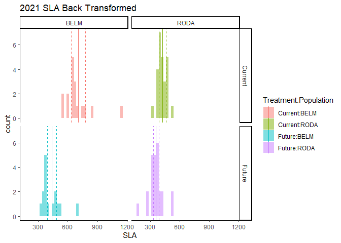<!-- -->

``` r
ggplot(dat = Dat_2021_TwoTrt)+
  geom_histogram(aes(x = DriedWt_g, fill = Treatment), alpha = 0.5, position = "identity")+
  theme_classic()
```

```
## `stat_bin()` using `bins = 30`. Pick better value with `binwidth`.
```

```
## Warning: Removed 15 rows containing non-finite outside the scale range
## (`stat_bin()`).
```

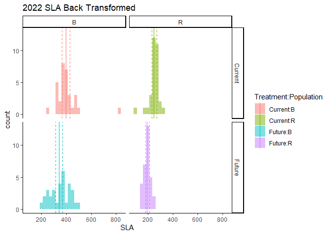<!-- -->

``` r
ggplot(dat = Dat_2022)+
  geom_histogram(aes(x = SL_DryWt, fill = Population), alpha = 0.5, position = "identity")+
  theme_classic()
```

```
## `stat_bin()` using `bins = 30`. Pick better value with `binwidth`.
```

```
## Warning: Removed 1 row containing non-finite outside the scale range
## (`stat_bin()`).
```

<!-- -->

``` r
ggplot(dat = Dat_2022)+
  geom_histogram(aes(x = SL_DryWt, fill = Treatment), alpha = 0.5, position = "identity")+
  theme_classic()
```

```
## `stat_bin()` using `bins = 30`. Pick better value with `binwidth`.
```

```
## Warning: Removed 1 row containing non-finite outside the scale range
## (`stat_bin()`).
```

<!-- -->

Visually looking at the histograms it does seems like 2021 has a treatment difference and 2022 has a population difference.Scales of both are comparable. 

## 2022 B1 to B12

I am trying to figure out if I need to adjust these things or not, so I want to look at how different their trait values are. so first let's subset down to just these from Dat_2022 and then we can summarize by line to see if the means are like identical or not identical. Could also make figures if I think it is needed. 

``` r
B_comp <- Dat_2022[Dat_2022$Population == "B" & Dat_2022$Line %in% c(1,12), ]

B_comp <- B_comp %>%
  dplyr::group_by(Line) %>%
  dplyr::group_by(Treatment, .add = TRUE) %>%
  summarize(across(.col = c(DaysToEmergence:Stomata_density), .fns = list(mean = ~mean(.x, na.rm = TRUE, .group = "keep"))))
```

```
## `summarise()` has grouped output by 'Line'. You can override using the
## `.groups` argument.
```

``` r
# for some ease of viewing
B_comp <- data.frame(t(B_comp))
```

They honestly don't seem to be close enough to the same for me to think they are the same genotype. So I am going to leave them as labelled because I don't know for sure that I planted stock center seeds instead of going of the labelled tubes. The only indication to me that B1 might be stock center seeds is the higher number of seeds that emerged, but in the later growing seasons B1 also had good emergence (1 and 3 in GS2, 7 and 7 in GS3). Also, since I fixed it immediately once found for the pilot results, I think I would have also fixed it immediately for Tori's results since we were still working together when I found the mistake.

## 2021 Avg Seed per fruit
Concerned that line does not explain any variance. Is it true that all the variation is within lines and not between lines? to check this: 1) make histogram of all the values (not line means) - done in CleanData but repeat here


``` r
hist(Dat_2021_TwoTrt$AvgSeedNum)
```

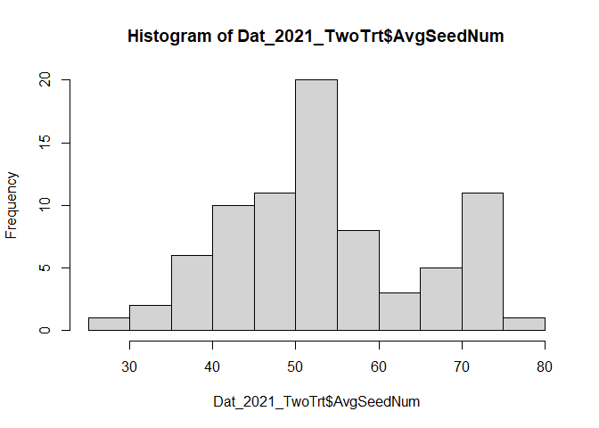<!-- -->

``` r
hist(Dat_2021_TwoTrt$l10_AvgSeedNum)
```

<!-- -->
2) look within lines for difference in avg seeds/fruit - maybe do subtraction and histogram the differences? but won't work if more than two values


``` r
# start with copy of code from 03_Figures that makes the by line plot
Dat_2021_TwoTrt$Line.ID <- as.factor(paste0(Dat_2021_TwoTrt$Population, Dat_2021_TwoTrt$Line))
Dat_2021_TwoTrt$Line.ID.T <- as.factor(paste0(Dat_2021_TwoTrt$Line.ID, Dat_2021_TwoTrt$Treatment))
df_seed_line <- Dat_2021_TwoTrt %>%
  dplyr::group_by(Line.ID.T, .add = TRUE) %>%
  summarize(across(.col = c(AvgSeedNum, l10_AvgSeedNum), .fns = list(mean = ~mean(.x, na.rm = TRUE, .group = "keep"), ci_95 = ~conf_int(.x), n = ~sum(!is.na(.)))))
```

```
## Warning: There were 4 warnings in `summarize()`.
## The first warning was:
## ℹ In argument: `across(...)`.
## ℹ In group 7: `Line.ID.T = BELM1Current`.
## Caused by warning in `qt()`:
## ! NaNs produced
## ℹ Run `dplyr::last_dplyr_warnings()` to see the 3 remaining warnings.
```

``` r
df_seed_line$Population <- substr(df_seed_line$Line.ID.T, start = 1, stop = 4)

hist(df_seed_line$AvgSeedNum_n)
```

<!-- -->

``` r
# some lines only have 1 pot per treatment -- 10 instances, 7 in Cur
# some lines only have pots in one treatment 4 - all in Fut are the dead ones so only a rep in cur
# 3 and 4 are Roda parent. 6 and 7 are Belm parent.

# get list of Line.ID with 2 replicates
two_reps <- df_seed_line[df_seed_line$AvgSeedNum_n == 2, "Line.ID.T"]$Line.ID.T
# pull those out of the main dataframe
two_reps_seeds <- Dat_2021_TwoTrt[Dat_2021_TwoTrt$Line.ID.T %in% two_reps, c("Treatment", "Population", "Line", "Replicate", "Line.ID", "Line.ID.T", "AvgSeedNum", "l10_AvgSeedNum")]

# find the difference in values
two_reps_diff <-  two_reps_seeds %>% 
  group_by(Line.ID.T) %>% 
  summarize(across(.col = c(AvgSeedNum, l10_AvgSeedNum), .fns = ~diff(.x)))


# table of just RIL parent seed numbers
ril_pars_seed <- Dat_2021_TwoTrt[Dat_2021_TwoTrt$Line.ID %in% c("BELM12", "RODA47"), c("Treatment", "Population", "Line", "Replicate", "Line.ID", "Line.ID.T", "AvgSeedNum", "l10_AvgSeedNum")]
ril_pars_seed[order(ril_pars_seed$Line.ID.T), ]
```

```
##     Treatment Population Line Replicate Line.ID     Line.ID.T AvgSeedNum
## 1     Current       BELM   12        11  BELM12 BELM12Current   50.40000
## 4     Current       BELM   12        12  BELM12 BELM12Current   52.30000
## 7     Current       BELM   12        13  BELM12 BELM12Current   37.80000
## 10    Current       BELM   12        14  BELM12 BELM12Current   53.10000
## 13    Current       BELM   12        15  BELM12 BELM12Current   52.40000
## 19    Current       BELM   12         1  BELM12 BELM12Current   27.10000
## 22    Current       BELM   12         2  BELM12 BELM12Current   49.60000
## 3      Future       BELM   12        11  BELM12  BELM12Future   53.80000
## 6      Future       BELM   12        12  BELM12  BELM12Future   42.00000
## 9      Future       BELM   12        13  BELM12  BELM12Future   43.20000
## 12     Future       BELM   12        14  BELM12  BELM12Future   36.30000
## 15     Future       BELM   12        15  BELM12  BELM12Future   53.80000
## 21     Future       BELM   12         1  BELM12  BELM12Future         NA
## 24     Future       BELM   12         2  BELM12  BELM12Future   54.88889
## 115   Current       RODA   47         1  RODA47 RODA47Current   69.70000
## 118   Current       RODA   47         2  RODA47 RODA47Current   55.40000
## 121   Current       RODA   47         3  RODA47 RODA47Current   70.70000
## 124   Current       RODA   47         4  RODA47 RODA47Current         NA
## 127   Current       RODA   47         5  RODA47 RODA47Current         NA
## 130   Current       RODA   47         6  RODA47 RODA47Current   72.50000
## 117    Future       RODA   47         1  RODA47  RODA47Future   40.80000
## 120    Future       RODA   47         2  RODA47  RODA47Future   50.00000
## 123    Future       RODA   47         3  RODA47  RODA47Future         NA
## 126    Future       RODA   47         4  RODA47  RODA47Future         NA
## 129    Future       RODA   47         5  RODA47  RODA47Future   42.50000
## 132    Future       RODA   47         6  RODA47  RODA47Future         NA
##     l10_AvgSeedNum
## 1         1.702431
## 4         1.718502
## 7         1.577492
## 10        1.725095
## 13        1.719331
## 19        1.432969
## 22        1.695482
## 3         1.730782
## 6         1.623249
## 9         1.635484
## 12        1.559907
## 15        1.730782
## 21              NA
## 24        1.739484
## 115       1.843233
## 118       1.743510
## 121       1.849419
## 124             NA
## 127             NA
## 130       1.860338
## 117       1.610660
## 120       1.698970
## 123             NA
## 126             NA
## 129       1.628389
## 132             NA
```


3) figure out which genotypes are the outliers on the residuals plot.The low outlier on the residuals plot is B12. Note for interpretation that the residuals are scales (so not log scale but divided by the mean)

``` r
# test out ggplotly
tmp_seed <- lmer(l10_AvgSeedNum ~ Treatment * Population + (1|Population:Line) , data = Dat_2021_TwoTrt, contrasts = list(Treatment=contr.sum, Population = contr.sum))
```

```
## boundary (singular) fit: see help('isSingular')
```

``` r
df_seed <- data.frame(fitted = fitted(tmp_seed),
                      resid = residuals(tmp_seed, type = "pearson", scaled = TRUE),
                      pop = Dat_2021_TwoTrt$Population[complete.cases(Dat_2021_TwoTrt$l10_AvgSeedNum)],
                      trt = Dat_2021_TwoTrt$Treatment[complete.cases(Dat_2021_TwoTrt$l10_AvgSeedNum)],
                      line = Dat_2021_TwoTrt$Line[complete.cases(Dat_2021_TwoTrt$l10_AvgSeedNum)],
                      pot.id = Dat_2021_TwoTrt$Pot.ID[complete.cases(Dat_2021_TwoTrt$l10_AvgSeedNum)])

plot_seed <-  ggplot(df_seed) +
  geom_point(aes(x=fitted, y=resid,
       col = pop, shape = trt, text=pot.id))+
  scale_color_manual(values = c("red", "blue"))+
  theme_classic()
```

```
## Warning in geom_point(aes(x = fitted, y = resid, col = pop, shape = trt, :
## Ignoring unknown aesthetics: text
```

``` r
ggplotly(plot_seed)
```

```{=html}
<div class="plotly html-widget html-fill-item" id="htmlwidget-2953a0655e46daa06580" style="width:672px;height:480px;"></div>
<script type="application/json" data-for="htmlwidget-2953a0655e46daa06580">{"x":{"data":[{"x":[1.6846369645818056,1.6846369645818056,1.6846369645818056,1.6846369645818056,1.6846369645818056,1.6846369645818056,1.6846369645818056,1.6846369645818056,1.6846369645818056,1.6846369645818056,1.6846369645818056,1.6846369645818056,1.6846369645818056,1.6846369645818056,1.6846369645818056,1.6846369645818056,1.6846369645818056,1.6846369645818056],"y":[0.2674669162420692,0.50904300965489879,-1.6105696497567332,0.60814421963896215,0.52151324618914841,-0.93832041281694523,-3.7829828164833939,0.16301401842680832,-0.13315980453078638,-0.95391938521042907,0.60814421963896215,-0.11940180820462973,1.3729522074178417,0.34472423022904275,1.3947855616842038,0.2284926700882528,0.76604246385705199,0.75403111393582589],"text":["fitted: 1.684637<br />resid:  0.267466916<br />pop: BELM<br />trt: Current<br />B12-11-C","fitted: 1.684637<br />resid:  0.509043010<br />pop: BELM<br />trt: Current<br />B12-12-C","fitted: 1.684637<br />resid: -1.610569650<br />pop: BELM<br />trt: Current<br />B12-13-C","fitted: 1.684637<br />resid:  0.608144220<br />pop: BELM<br />trt: Current<br />B12-14-C","fitted: 1.684637<br />resid:  0.521513246<br />pop: BELM<br />trt: Current<br />B12-15-C","fitted: 1.684637<br />resid: -0.938320413<br />pop: BELM<br />trt: Current<br />B1-6-C","fitted: 1.684637<br />resid: -3.782982816<br />pop: BELM<br />trt: Current<br />B12-1-C","fitted: 1.684637<br />resid:  0.163014018<br />pop: BELM<br />trt: Current<br />B12-2-C","fitted: 1.684637<br />resid: -0.133159805<br />pop: BELM<br />trt: Current<br />B13-1-C","fitted: 1.684637<br />resid: -0.953919385<br />pop: BELM<br />trt: Current<br />B13-2-C","fitted: 1.684637<br />resid:  0.608144220<br />pop: BELM<br />trt: Current<br />B15-1-C","fitted: 1.684637<br />resid: -0.119401808<br />pop: BELM<br />trt: Current<br />B15-2-C","fitted: 1.684637<br />resid:  1.372952207<br />pop: BELM<br />trt: Current<br />B2-1-C","fitted: 1.684637<br />resid:  0.344724230<br />pop: BELM<br />trt: Current<br />B3-1-C","fitted: 1.684637<br />resid:  1.394785562<br />pop: BELM<br />trt: Current<br />B3-2-C","fitted: 1.684637<br />resid:  0.228492670<br />pop: BELM<br />trt: Current<br />B4-2-C","fitted: 1.684637<br />resid:  0.766042464<br />pop: BELM<br />trt: Current<br />B8-1-C","fitted: 1.684637<br />resid:  0.754031114<br />pop: BELM<br />trt: Current<br />B8-2-C"],"type":"scatter","mode":"markers","marker":{"autocolorscale":false,"color":"rgba(255,0,0,1)","opacity":1,"size":5.6692913385826778,"symbol":"circle","line":{"width":1.8897637795275593,"color":"rgba(255,0,0,1)"}},"hoveron":"points","name":"(BELM,Current)","legendgroup":"(BELM,Current)","showlegend":true,"xaxis":"x","yaxis":"y","hoverinfo":"text","frame":null},{"x":[1.6573891185101599,1.6573891185101599,1.6573891185101599,1.6573891185101599,1.6573891185101599,1.6573891185101599,1.6573891185101599,1.6573891185101599,1.6573891185101599,1.6573891185101599,1.6573891185101599,1.6573891185101599,1.6573891185101599,1.6573891185101599,1.6573891185101599],"y":[1.1032209591299795,-0.51317827674814775,-0.32927409186512946,-1.465323663892748,1.1032209591299795,0.34492239843450484,1.2340289238737077,-1.6415249961527645,0.06491307539388981,-0.12757753348639503,-0.46671425967083219,-1.2530068422517888,1.58142221857721,-0.52874006442835919,0.89361119395706057],"text":["fitted: 1.657389<br />resid:  1.103220959<br />pop: BELM<br />trt: Future<br />B12-11-F","fitted: 1.657389<br />resid: -0.513178277<br />pop: BELM<br />trt: Future<br />B12-12-F","fitted: 1.657389<br />resid: -0.329274092<br />pop: BELM<br />trt: Future<br />B12-13-F","fitted: 1.657389<br />resid: -1.465323664<br />pop: BELM<br />trt: Future<br />B12-14-F","fitted: 1.657389<br />resid:  1.103220959<br />pop: BELM<br />trt: Future<br />B12-15-F","fitted: 1.657389<br />resid:  0.344922398<br />pop: BELM<br />trt: Future<br />B1-6-F","fitted: 1.657389<br />resid:  1.234028924<br />pop: BELM<br />trt: Future<br />B12-2-F","fitted: 1.657389<br />resid: -1.641524996<br />pop: BELM<br />trt: Future<br />B15-1-F","fitted: 1.657389<br />resid:  0.064913075<br />pop: BELM<br />trt: Future<br />B15-2-F","fitted: 1.657389<br />resid: -0.127577533<br />pop: BELM<br />trt: Future<br />B2-1-F","fitted: 1.657389<br />resid: -0.466714260<br />pop: BELM<br />trt: Future<br />B2-2-F","fitted: 1.657389<br />resid: -1.253006842<br />pop: BELM<br />trt: Future<br />B3-1-F","fitted: 1.657389<br />resid:  1.581422219<br />pop: BELM<br />trt: Future<br />B3-2-F","fitted: 1.657389<br />resid: -0.528740064<br />pop: BELM<br />trt: Future<br />B8-1-F","fitted: 1.657389<br />resid:  0.893611194<br />pop: BELM<br />trt: Future<br />B8-2-F"],"type":"scatter","mode":"markers","marker":{"autocolorscale":false,"color":"rgba(255,0,0,1)","opacity":1,"size":5.6692913385826778,"symbol":"triangle-up","line":{"width":1.8897637795275593,"color":"rgba(255,0,0,1)"}},"hoveron":"points","name":"(BELM,Future)","legendgroup":"(BELM,Future)","showlegend":true,"xaxis":"x","yaxis":"y","hoverinfo":"text","frame":null},{"x":[1.8244362514521935,1.8244362514521935,1.8244362514521935,1.8244362514521935,1.8244362514521935,1.8244362514521935,1.8244362514521935,1.8244362514521935,1.8244362514521935,1.8244362514521935,1.8244362514521935,1.8244362514521935,1.8244362514521935,1.8244362514521935,1.8244362514521935,1.8244362514521935,1.8244362514521935,1.8244362514521935,1.8244362514521935,1.8244362514521935,1.8244362514521935,1.8244362514521935,1.8244362514521935,1.8244362514521935],"y":[-0.093351985339069174,0.014879333557095789,-0.35653853830621535,-0.84986952501221291,0.76967637412565504,0.6556826530604678,0.66452241993670469,0.47632612899565707,-2.3038033971827234,-0.18325930015027947,-1.1694939735967862,-0.39798735590111789,0.17869432945910024,0.41236876944442147,0.43985582832909204,0.28254299117243636,-1.2164594052325948,0.37553839338668527,0.53966296384139478,-0.0046660907456852023,0.51259381583553698,0.55764690590509425,0.37553839338668527,0.31990027103060731],"text":["fitted: 1.824436<br />resid: -0.093351985<br />pop: RODA<br />trt: Current<br />R11-1-C","fitted: 1.824436<br />resid:  0.014879334<br />pop: RODA<br />trt: Current<br />R11-2-C","fitted: 1.824436<br />resid: -0.356538538<br />pop: RODA<br />trt: Current<br />R15-1-C","fitted: 1.824436<br />resid: -0.849869525<br />pop: RODA<br />trt: Current<br />R15-2-C","fitted: 1.824436<br />resid:  0.769676374<br />pop: RODA<br />trt: Current<br />R2-1-C","fitted: 1.824436<br />resid:  0.655682653<br />pop: RODA<br />trt: Current<br />R2-2-C","fitted: 1.824436<br />resid:  0.664522420<br />pop: RODA<br />trt: Current<br />R21-1-C","fitted: 1.824436<br />resid:  0.476326129<br />pop: RODA<br />trt: Current<br />R21-2-C","fitted: 1.824436<br />resid: -2.303803397<br />pop: RODA<br />trt: Current<br />R26-1-C","fitted: 1.824436<br />resid: -0.183259300<br />pop: RODA<br />trt: Current<br />R29-1-C","fitted: 1.824436<br />resid: -1.169493974<br />pop: RODA<br />trt: Current<br />R29-2-C","fitted: 1.824436<br />resid: -0.397987356<br />pop: RODA<br />trt: Current<br />R33-2-C","fitted: 1.824436<br />resid:  0.178694329<br />pop: RODA<br />trt: Current<br />R35-1-C","fitted: 1.824436<br />resid:  0.412368769<br />pop: RODA<br />trt: Current<br />R40-1-C","fitted: 1.824436<br />resid:  0.439855828<br />pop: RODA<br />trt: Current<br />R40-2-C","fitted: 1.824436<br />resid:  0.282542991<br />pop: RODA<br />trt: Current<br />R47-1-C","fitted: 1.824436<br />resid: -1.216459405<br />pop: RODA<br />trt: Current<br />R47-2-C","fitted: 1.824436<br />resid:  0.375538393<br />pop: RODA<br />trt: Current<br />R47-3-C","fitted: 1.824436<br />resid:  0.539662964<br />pop: RODA<br />trt: Current<br />R47-6-C","fitted: 1.824436<br />resid: -0.004666091<br />pop: RODA<br />trt: Current<br />R5-1-C","fitted: 1.824436<br />resid:  0.512593816<br />pop: RODA<br />trt: Current<br />R8-1-C","fitted: 1.824436<br />resid:  0.557646906<br />pop: RODA<br />trt: Current<br />R8-2-C","fitted: 1.824436<br />resid:  0.375538393<br />pop: RODA<br />trt: Current<br />R9-1-C","fitted: 1.824436<br />resid:  0.319900271<br />pop: RODA<br />trt: Current<br />R9-2-C"],"type":"scatter","mode":"markers","marker":{"autocolorscale":false,"color":"rgba(0,0,255,1)","opacity":1,"size":5.6692913385826778,"symbol":"circle","line":{"width":1.8897637795275593,"color":"rgba(0,0,255,1)"}},"hoveron":"points","name":"(RODA,Current)","legendgroup":"(RODA,Current)","showlegend":true,"xaxis":"x","yaxis":"y","hoverinfo":"text","frame":null},{"x":[1.6710151051975177,1.6710151051975177,1.6710151051975177,1.6710151051975177,1.6710151051975177,1.6710151051975177,1.6710151051975177,1.6710151051975177,1.6710151051975177,1.6710151051975177,1.6710151051975177,1.6710151051975177,1.6710151051975177,1.6710151051975177,1.6710151051975177,1.6710151051975177,1.6710151051975177,1.6710151051975177,1.6710151051975177,1.6710151051975177,1.6710151051975177],"y":[0.0023710566782874799,0.82518591138579434,-1.9082250124286038,0.77591649381805705,1.1949160746636953,0.77591649381805705,-1.2860242570637637,0.87408626618145535,1.4563049288487979,0.42020852944520692,0.48516594937326524,-0.29668123742194163,0.56227117849399566,0.72627240027592799,-2.3491126394401269,-0.90723494805496741,0.42020852944520692,-0.64074215706297744,-1.2690899626378249,-0.1099442615025865,0.24823066318501499],"text":["fitted: 1.671015<br />resid:  0.002371057<br />pop: RODA<br />trt: Future<br />R11-1-F","fitted: 1.671015<br />resid:  0.825185911<br />pop: RODA<br />trt: Future<br />R11-2-F","fitted: 1.671015<br />resid: -1.908225012<br />pop: RODA<br />trt: Future<br />R15-1-F","fitted: 1.671015<br />resid:  0.775916494<br />pop: RODA<br />trt: Future<br />R15-2-F","fitted: 1.671015<br />resid:  1.194916075<br />pop: RODA<br />trt: Future<br />R2-1-F","fitted: 1.671015<br />resid:  0.775916494<br />pop: RODA<br />trt: Future<br />R2-2-F","fitted: 1.671015<br />resid: -1.286024257<br />pop: RODA<br />trt: Future<br />R21-2-F","fitted: 1.671015<br />resid:  0.874086266<br />pop: RODA<br />trt: Future<br />R29-1-F","fitted: 1.671015<br />resid:  1.456304929<br />pop: RODA<br />trt: Future<br />R29-2-F","fitted: 1.671015<br />resid:  0.420208529<br />pop: RODA<br />trt: Future<br />R33-1-F","fitted: 1.671015<br />resid:  0.485165949<br />pop: RODA<br />trt: Future<br />R33-2-F","fitted: 1.671015<br />resid: -0.296681237<br />pop: RODA<br />trt: Future<br />R35-1-F","fitted: 1.671015<br />resid:  0.562271178<br />pop: RODA<br />trt: Future<br />R35-2-F","fitted: 1.671015<br />resid:  0.726272400<br />pop: RODA<br />trt: Future<br />R40-1-F","fitted: 1.671015<br />resid: -2.349112639<br />pop: RODA<br />trt: Future<br />R40-2-F","fitted: 1.671015<br />resid: -0.907234948<br />pop: RODA<br />trt: Future<br />R47-1-F","fitted: 1.671015<br />resid:  0.420208529<br />pop: RODA<br />trt: Future<br />R47-2-F","fitted: 1.671015<br />resid: -0.640742157<br />pop: RODA<br />trt: Future<br />R47-5-F","fitted: 1.671015<br />resid: -1.269089963<br />pop: RODA<br />trt: Future<br />R8-1-F","fitted: 1.671015<br />resid: -0.109944262<br />pop: RODA<br />trt: Future<br />R8-2-F","fitted: 1.671015<br />resid:  0.248230663<br />pop: RODA<br />trt: Future<br />R9-2-F"],"type":"scatter","mode":"markers","marker":{"autocolorscale":false,"color":"rgba(0,0,255,1)","opacity":1,"size":5.6692913385826778,"symbol":"triangle-up","line":{"width":1.8897637795275593,"color":"rgba(0,0,255,1)"}},"hoveron":"points","name":"(RODA,Future)","legendgroup":"(RODA,Future)","showlegend":true,"xaxis":"x","yaxis":"y","hoverinfo":"text","frame":null}],"layout":{"margin":{"t":26.228310502283104,"r":7.3059360730593621,"b":40.182648401826491,"l":37.260273972602747},"plot_bgcolor":"rgba(255,255,255,1)","paper_bgcolor":"rgba(255,255,255,1)","font":{"color":"rgba(0,0,0,1)","family":"","size":14.611872146118724},"xaxis":{"domain":[0,1],"automargin":true,"type":"linear","autorange":false,"range":[1.6490367618630581,1.8327886080992952],"tickmode":"array","ticktext":["1.65","1.70","1.75","1.80"],"tickvals":[1.6500000000000001,1.7000000000000002,1.7500000000000002,1.8000000000000003],"categoryorder":"array","categoryarray":["1.65","1.70","1.75","1.80"],"nticks":null,"ticks":"outside","tickcolor":"rgba(51,51,51,1)","ticklen":3.6529680365296811,"tickwidth":0.66417600664176002,"showticklabels":true,"tickfont":{"color":"rgba(77,77,77,1)","family":"","size":11.68949771689498},"tickangle":-0,"showline":true,"linecolor":"rgba(0,0,0,1)","linewidth":0.66417600664176002,"showgrid":false,"gridcolor":null,"gridwidth":0,"zeroline":false,"anchor":"y","title":{"text":"fitted","font":{"color":"rgba(0,0,0,1)","family":"","size":14.611872146118724}},"hoverformat":".2f"},"yaxis":{"domain":[0,1],"automargin":true,"type":"linear","autorange":false,"range":[-4.0512030682364237,1.8496424703302403],"tickmode":"array","ticktext":["-4","-3","-2","-1","0","1"],"tickvals":[-4,-3,-2,-0.99999999999999956,0,1],"categoryorder":"array","categoryarray":["-4","-3","-2","-1","0","1"],"nticks":null,"ticks":"outside","tickcolor":"rgba(51,51,51,1)","ticklen":3.6529680365296811,"tickwidth":0.66417600664176002,"showticklabels":true,"tickfont":{"color":"rgba(77,77,77,1)","family":"","size":11.68949771689498},"tickangle":-0,"showline":true,"linecolor":"rgba(0,0,0,1)","linewidth":0.66417600664176002,"showgrid":false,"gridcolor":null,"gridwidth":0,"zeroline":false,"anchor":"x","title":{"text":"resid","font":{"color":"rgba(0,0,0,1)","family":"","size":14.611872146118724}},"hoverformat":".2f"},"shapes":[{"type":"rect","fillcolor":null,"line":{"color":null,"width":0,"linetype":[]},"yref":"paper","xref":"paper","x0":0,"x1":1,"y0":0,"y1":1}],"showlegend":true,"legend":{"bgcolor":"rgba(255,255,255,1)","bordercolor":"transparent","borderwidth":1.8897637795275593,"font":{"color":"rgba(0,0,0,1)","family":"","size":11.68949771689498},"title":{"text":"trt<br />pop","font":{"color":"rgba(0,0,0,1)","family":"","size":14.611872146118724}}},"hovermode":"closest","barmode":"relative"},"config":{"doubleClick":"reset","modeBarButtonsToAdd":["hoverclosest","hovercompare"],"showSendToCloud":false},"source":"A","attrs":{"23ec619449ed":{"x":{},"y":{},"colour":{},"shape":{},"text":{},"type":"scatter"}},"cur_data":"23ec619449ed","visdat":{"23ec619449ed":["function (y) ","x"]},"highlight":{"on":"plotly_click","persistent":false,"dynamic":false,"selectize":false,"opacityDim":0.20000000000000001,"selected":{"opacity":1},"debounce":0},"shinyEvents":["plotly_hover","plotly_click","plotly_selected","plotly_relayout","plotly_brushed","plotly_brushing","plotly_clickannotation","plotly_doubleclick","plotly_deselect","plotly_afterplot","plotly_sunburstclick"],"base_url":"https://plot.ly"},"evals":[],"jsHooks":[]}</script>
```

make a plot with genotype on the x axis and seed count per fruit on the y axis. color by pop and treatment.


```
## Warning in geom_point(aes(x = Line.ID.T, y = AvgSeedNum, col = Population, :
## Ignoring unknown aesthetics: text
```

```{=html}
<div class="plotly html-widget html-fill-item" id="htmlwidget-fc15428005f2f15f4422" style="width:672px;height:480px;"></div>
<script type="application/json" data-for="htmlwidget-fc15428005f2f15f4422">{"x":{"data":[{"x":[1,1,1,1,1,7,1,1,3,3,5,5,9,9,11,11,13,13,15,15],"y":[50.399999999999999,52.299999999999997,37.799999999999997,53.100000000000001,52.399999999999999,41.899999999999999,27.100000000000001,49.600000000000001,47.399999999999999,41.799999999999997,53.100000000000001,47.5,59.700000000000003,null,51,59.899999999999999,null,50.100000000000001,54.399999999999999,54.299999999999997],"text":["Line.ID.T: BELM12Current<br />AvgSeedNum: 50.40000<br />Population: BELM<br />Treatment: Current<br />B12-11-C","Line.ID.T: BELM12Current<br />AvgSeedNum: 52.30000<br />Population: BELM<br />Treatment: Current<br />B12-12-C","Line.ID.T: BELM12Current<br />AvgSeedNum: 37.80000<br />Population: BELM<br />Treatment: Current<br />B12-13-C","Line.ID.T: BELM12Current<br />AvgSeedNum: 53.10000<br />Population: BELM<br />Treatment: Current<br />B12-14-C","Line.ID.T: BELM12Current<br />AvgSeedNum: 52.40000<br />Population: BELM<br />Treatment: Current<br />B12-15-C","Line.ID.T: BELM1Current<br />AvgSeedNum: 41.90000<br />Population: BELM<br />Treatment: Current<br />B1-6-C","Line.ID.T: BELM12Current<br />AvgSeedNum: 27.10000<br />Population: BELM<br />Treatment: Current<br />B12-1-C","Line.ID.T: BELM12Current<br />AvgSeedNum: 49.60000<br />Population: BELM<br />Treatment: Current<br />B12-2-C","Line.ID.T: BELM13Current<br />AvgSeedNum: 47.40000<br />Population: BELM<br />Treatment: Current<br />B13-1-C","Line.ID.T: BELM13Current<br />AvgSeedNum: 41.80000<br />Population: BELM<br />Treatment: Current<br />B13-2-C","Line.ID.T: BELM15Current<br />AvgSeedNum: 53.10000<br />Population: BELM<br />Treatment: Current<br />B15-1-C","Line.ID.T: BELM15Current<br />AvgSeedNum: 47.50000<br />Population: BELM<br />Treatment: Current<br />B15-2-C","Line.ID.T: BELM2Current<br />AvgSeedNum: 59.70000<br />Population: BELM<br />Treatment: Current<br />B2-1-C","Line.ID.T: BELM2Current<br />AvgSeedNum:       NA<br />Population: BELM<br />Treatment: Current<br />B2-2-C","Line.ID.T: BELM3Current<br />AvgSeedNum: 51.00000<br />Population: BELM<br />Treatment: Current<br />B3-1-C","Line.ID.T: BELM3Current<br />AvgSeedNum: 59.90000<br />Population: BELM<br />Treatment: Current<br />B3-2-C","Line.ID.T: BELM4Current<br />AvgSeedNum:       NA<br />Population: BELM<br />Treatment: Current<br />B4-1-C","Line.ID.T: BELM4Current<br />AvgSeedNum: 50.10000<br />Population: BELM<br />Treatment: Current<br />B4-2-C","Line.ID.T: BELM8Current<br />AvgSeedNum: 54.40000<br />Population: BELM<br />Treatment: Current<br />B8-1-C","Line.ID.T: BELM8Current<br />AvgSeedNum: 54.30000<br />Population: BELM<br />Treatment: Current<br />B8-2-C"],"type":"scatter","mode":"markers","marker":{"autocolorscale":false,"color":"rgba(255,0,0,1)","opacity":1,"size":5.6692913385826778,"symbol":"circle","line":{"width":1.8897637795275593,"color":"rgba(255,0,0,1)"}},"hoveron":"points","name":"(BELM,Current)","legendgroup":"(BELM,Current)","showlegend":true,"xaxis":"x","yaxis":"y","hoverinfo":"text","frame":null},{"x":[2,2,2,2,2,8,2,2,4,4,6,6,10,10,12,12,14,14,16,16],"y":[53.799999999999997,42,43.200000000000003,36.299999999999997,53.799999999999997,47.899999999999999,null,54.8888888888889,null,null,35.3333333333333,45.8888888888889,44.5555555555556,42.299999999999997,37.5,57.8888888888889,null,null,41.899999999999999,52.100000000000001],"text":["Line.ID.T: BELM12Future<br />AvgSeedNum: 53.80000<br />Population: BELM<br />Treatment: Future<br />B12-11-F","Line.ID.T: BELM12Future<br />AvgSeedNum: 42.00000<br />Population: BELM<br />Treatment: Future<br />B12-12-F","Line.ID.T: BELM12Future<br />AvgSeedNum: 43.20000<br />Population: BELM<br />Treatment: Future<br />B12-13-F","Line.ID.T: BELM12Future<br />AvgSeedNum: 36.30000<br />Population: BELM<br />Treatment: Future<br />B12-14-F","Line.ID.T: BELM12Future<br />AvgSeedNum: 53.80000<br />Population: BELM<br />Treatment: Future<br />B12-15-F","Line.ID.T: BELM1Future<br />AvgSeedNum: 47.90000<br />Population: BELM<br />Treatment: Future<br />B1-6-F","Line.ID.T: BELM12Future<br />AvgSeedNum:       NA<br />Population: BELM<br />Treatment: Future<br />B12-1-F","Line.ID.T: BELM12Future<br />AvgSeedNum: 54.88889<br />Population: BELM<br />Treatment: Future<br />B12-2-F","Line.ID.T: BELM13Future<br />AvgSeedNum:       NA<br />Population: BELM<br />Treatment: Future<br />B13-1-F","Line.ID.T: BELM13Future<br />AvgSeedNum:       NA<br />Population: BELM<br />Treatment: Future<br />B13-2-F","Line.ID.T: BELM15Future<br />AvgSeedNum: 35.33333<br />Population: BELM<br />Treatment: Future<br />B15-1-F","Line.ID.T: BELM15Future<br />AvgSeedNum: 45.88889<br />Population: BELM<br />Treatment: Future<br />B15-2-F","Line.ID.T: BELM2Future<br />AvgSeedNum: 44.55556<br />Population: BELM<br />Treatment: Future<br />B2-1-F","Line.ID.T: BELM2Future<br />AvgSeedNum: 42.30000<br />Population: BELM<br />Treatment: Future<br />B2-2-F","Line.ID.T: BELM3Future<br />AvgSeedNum: 37.50000<br />Population: BELM<br />Treatment: Future<br />B3-1-F","Line.ID.T: BELM3Future<br />AvgSeedNum: 57.88889<br />Population: BELM<br />Treatment: Future<br />B3-2-F","Line.ID.T: BELM4Future<br />AvgSeedNum:       NA<br />Population: BELM<br />Treatment: Future<br />B4-1-F","Line.ID.T: BELM4Future<br />AvgSeedNum:       NA<br />Population: BELM<br />Treatment: Future<br />B4-2-F","Line.ID.T: BELM8Future<br />AvgSeedNum: 41.90000<br />Population: BELM<br />Treatment: Future<br />B8-1-F","Line.ID.T: BELM8Future<br />AvgSeedNum: 52.10000<br />Population: BELM<br />Treatment: Future<br />B8-2-F"],"type":"scatter","mode":"markers","marker":{"autocolorscale":false,"color":"rgba(255,0,0,1)","opacity":1,"size":5.6692913385826778,"symbol":"triangle-up","line":{"width":1.8897637795275593,"color":"rgba(255,0,0,1)"}},"hoveron":"points","name":"(BELM,Future)","legendgroup":"(BELM,Future)","showlegend":true,"xaxis":"x","yaxis":"y","hoverinfo":"text","frame":null},{"x":[17,17,19,19,27,27,21,21,23,23,25,25,29,29,31,31,33,33,35,35,35,35,35,35,37,37,39,39,41,41],"y":[65.799999999999997,66.900000000000006,63.200000000000003,58.600000000000001,75.099999999999994,73.799999999999997,73.900000000000006,71.799999999999997,46.899999999999999,null,64.900000000000006,55.799999999999997,null,62.799999999999997,68.599999999999994,null,71.099999999999994,71.400000000000006,69.700000000000003,55.399999999999999,70.700000000000003,null,null,72.5,66.700000000000003,null,72.200000000000003,72.700000000000003,70.700000000000003,70.099999999999994],"text":["Line.ID.T: RODA11Current<br />AvgSeedNum: 65.80000<br />Population: RODA<br />Treatment: Current<br />R11-1-C","Line.ID.T: RODA11Current<br />AvgSeedNum: 66.90000<br />Population: RODA<br />Treatment: Current<br />R11-2-C","Line.ID.T: RODA15Current<br />AvgSeedNum: 63.20000<br />Population: RODA<br />Treatment: Current<br />R15-1-C","Line.ID.T: RODA15Current<br />AvgSeedNum: 58.60000<br />Population: RODA<br />Treatment: Current<br />R15-2-C","Line.ID.T: RODA2Current<br />AvgSeedNum: 75.10000<br />Population: RODA<br />Treatment: Current<br />R2-1-C","Line.ID.T: RODA2Current<br />AvgSeedNum: 73.80000<br />Population: RODA<br />Treatment: Current<br />R2-2-C","Line.ID.T: RODA21Current<br />AvgSeedNum: 73.90000<br />Population: RODA<br />Treatment: Current<br />R21-1-C","Line.ID.T: RODA21Current<br />AvgSeedNum: 71.80000<br />Population: RODA<br />Treatment: Current<br />R21-2-C","Line.ID.T: RODA26Current<br />AvgSeedNum: 46.90000<br />Population: RODA<br />Treatment: Current<br />R26-1-C","Line.ID.T: RODA26Current<br />AvgSeedNum:       NA<br />Population: RODA<br />Treatment: Current<br />R26-2-C","Line.ID.T: RODA29Current<br />AvgSeedNum: 64.90000<br />Population: RODA<br />Treatment: Current<br />R29-1-C","Line.ID.T: RODA29Current<br />AvgSeedNum: 55.80000<br />Population: RODA<br />Treatment: Current<br />R29-2-C","Line.ID.T: RODA33Current<br />AvgSeedNum:       NA<br />Population: RODA<br />Treatment: Current<br />R33-1-C","Line.ID.T: RODA33Current<br />AvgSeedNum: 62.80000<br />Population: RODA<br />Treatment: Current<br />R33-2-C","Line.ID.T: RODA35Current<br />AvgSeedNum: 68.60000<br />Population: RODA<br />Treatment: Current<br />R35-1-C","Line.ID.T: RODA35Current<br />AvgSeedNum:       NA<br />Population: RODA<br />Treatment: Current<br />R35-2-C","Line.ID.T: RODA40Current<br />AvgSeedNum: 71.10000<br />Population: RODA<br />Treatment: Current<br />R40-1-C","Line.ID.T: RODA40Current<br />AvgSeedNum: 71.40000<br />Population: RODA<br />Treatment: Current<br />R40-2-C","Line.ID.T: RODA47Current<br />AvgSeedNum: 69.70000<br />Population: RODA<br />Treatment: Current<br />R47-1-C","Line.ID.T: RODA47Current<br />AvgSeedNum: 55.40000<br />Population: RODA<br />Treatment: Current<br />R47-2-C","Line.ID.T: RODA47Current<br />AvgSeedNum: 70.70000<br />Population: RODA<br />Treatment: Current<br />R47-3-C","Line.ID.T: RODA47Current<br />AvgSeedNum:       NA<br />Population: RODA<br />Treatment: Current<br />R47-4-C","Line.ID.T: RODA47Current<br />AvgSeedNum:       NA<br />Population: RODA<br />Treatment: Current<br />R47-5-C","Line.ID.T: RODA47Current<br />AvgSeedNum: 72.50000<br />Population: RODA<br />Treatment: Current<br />R47-6-C","Line.ID.T: RODA5Current<br />AvgSeedNum: 66.70000<br />Population: RODA<br />Treatment: Current<br />R5-1-C","Line.ID.T: RODA5Current<br />AvgSeedNum:       NA<br />Population: RODA<br />Treatment: Current<br />R5-2-C","Line.ID.T: RODA8Current<br />AvgSeedNum: 72.20000<br />Population: RODA<br />Treatment: Current<br />R8-1-C","Line.ID.T: RODA8Current<br />AvgSeedNum: 72.70000<br />Population: RODA<br />Treatment: Current<br />R8-2-C","Line.ID.T: RODA9Current<br />AvgSeedNum: 70.70000<br />Population: RODA<br />Treatment: Current<br />R9-1-C","Line.ID.T: RODA9Current<br />AvgSeedNum: 70.10000<br />Population: RODA<br />Treatment: Current<br />R9-2-C"],"type":"scatter","mode":"markers","marker":{"autocolorscale":false,"color":"rgba(0,0,255,1)","opacity":1,"size":5.6692913385826778,"symbol":"circle","line":{"width":1.8897637795275593,"color":"rgba(0,0,255,1)"}},"hoveron":"points","name":"(RODA,Current)","legendgroup":"(RODA,Current)","showlegend":true,"xaxis":"x","yaxis":"y","hoverinfo":"text","frame":null},{"x":[18,18,20,20,28,28,22,22,24,24,26,26,30,30,32,32,34,34,36,36,36,36,36,36,38,38,40,40,42,42],"y":[46.899999999999999,53.200000000000003,35,52.799999999999997,56.299999999999997,52.799999999999997,null,38.5,null,null,53.600000000000001,58.600000000000001,50,50.5,44.799999999999997,51.100000000000001,52.399999999999999,32.714285714285701,40.799999999999997,50,null,null,42.5,null,null,null,38.600000000000001,46.100000000000001,null,48.700000000000003],"text":["Line.ID.T: RODA11Future<br />AvgSeedNum: 46.90000<br />Population: RODA<br />Treatment: Future<br />R11-1-F","Line.ID.T: RODA11Future<br />AvgSeedNum: 53.20000<br />Population: RODA<br />Treatment: Future<br />R11-2-F","Line.ID.T: RODA15Future<br />AvgSeedNum: 35.00000<br />Population: RODA<br />Treatment: Future<br />R15-1-F","Line.ID.T: RODA15Future<br />AvgSeedNum: 52.80000<br />Population: RODA<br />Treatment: Future<br />R15-2-F","Line.ID.T: RODA2Future<br />AvgSeedNum: 56.30000<br />Population: RODA<br />Treatment: Future<br />R2-1-F","Line.ID.T: RODA2Future<br />AvgSeedNum: 52.80000<br />Population: RODA<br />Treatment: Future<br />R2-2-F","Line.ID.T: RODA21Future<br />AvgSeedNum:       NA<br />Population: RODA<br />Treatment: Future<br />R21-1-F","Line.ID.T: RODA21Future<br />AvgSeedNum: 38.50000<br />Population: RODA<br />Treatment: Future<br />R21-2-F","Line.ID.T: RODA26Future<br />AvgSeedNum:       NA<br />Population: RODA<br />Treatment: Future<br />R26-1-F","Line.ID.T: RODA26Future<br />AvgSeedNum:       NA<br />Population: RODA<br />Treatment: Future<br />R26-2-F","Line.ID.T: RODA29Future<br />AvgSeedNum: 53.60000<br />Population: RODA<br />Treatment: Future<br />R29-1-F","Line.ID.T: RODA29Future<br />AvgSeedNum: 58.60000<br />Population: RODA<br />Treatment: Future<br />R29-2-F","Line.ID.T: RODA33Future<br />AvgSeedNum: 50.00000<br />Population: RODA<br />Treatment: Future<br />R33-1-F","Line.ID.T: RODA33Future<br />AvgSeedNum: 50.50000<br />Population: RODA<br />Treatment: Future<br />R33-2-F","Line.ID.T: RODA35Future<br />AvgSeedNum: 44.80000<br />Population: RODA<br />Treatment: Future<br />R35-1-F","Line.ID.T: RODA35Future<br />AvgSeedNum: 51.10000<br />Population: RODA<br />Treatment: Future<br />R35-2-F","Line.ID.T: RODA40Future<br />AvgSeedNum: 52.40000<br />Population: RODA<br />Treatment: Future<br />R40-1-F","Line.ID.T: RODA40Future<br />AvgSeedNum: 32.71429<br />Population: RODA<br />Treatment: Future<br />R40-2-F","Line.ID.T: RODA47Future<br />AvgSeedNum: 40.80000<br />Population: RODA<br />Treatment: Future<br />R47-1-F","Line.ID.T: RODA47Future<br />AvgSeedNum: 50.00000<br />Population: RODA<br />Treatment: Future<br />R47-2-F","Line.ID.T: RODA47Future<br />AvgSeedNum:       NA<br />Population: RODA<br />Treatment: Future<br />R47-3-F","Line.ID.T: RODA47Future<br />AvgSeedNum:       NA<br />Population: RODA<br />Treatment: Future<br />R47-4-F","Line.ID.T: RODA47Future<br />AvgSeedNum: 42.50000<br />Population: RODA<br />Treatment: Future<br />R47-5-F","Line.ID.T: RODA47Future<br />AvgSeedNum:       NA<br />Population: RODA<br />Treatment: Future<br />R47-6-F","Line.ID.T: RODA5Future<br />AvgSeedNum:       NA<br />Population: RODA<br />Treatment: Future<br />R5-1-F","Line.ID.T: RODA5Future<br />AvgSeedNum:       NA<br />Population: RODA<br />Treatment: Future<br />R5-2-F","Line.ID.T: RODA8Future<br />AvgSeedNum: 38.60000<br />Population: RODA<br />Treatment: Future<br />R8-1-F","Line.ID.T: RODA8Future<br />AvgSeedNum: 46.10000<br />Population: RODA<br />Treatment: Future<br />R8-2-F","Line.ID.T: RODA9Future<br />AvgSeedNum:       NA<br />Population: RODA<br />Treatment: Future<br />R9-1-F","Line.ID.T: RODA9Future<br />AvgSeedNum: 48.70000<br />Population: RODA<br />Treatment: Future<br />R9-2-F"],"type":"scatter","mode":"markers","marker":{"autocolorscale":false,"color":"rgba(0,0,255,1)","opacity":1,"size":5.6692913385826778,"symbol":"triangle-up","line":{"width":1.8897637795275593,"color":"rgba(0,0,255,1)"}},"hoveron":"points","name":"(RODA,Future)","legendgroup":"(RODA,Future)","showlegend":true,"xaxis":"x","yaxis":"y","hoverinfo":"text","frame":null}],"layout":{"margin":{"t":26.228310502283104,"r":7.3059360730593621,"b":104.4748858447489,"l":37.260273972602747},"plot_bgcolor":"rgba(255,255,255,1)","paper_bgcolor":"rgba(255,255,255,1)","font":{"color":"rgba(0,0,0,1)","family":"","size":14.611872146118724},"xaxis":{"domain":[0,1],"automargin":true,"type":"linear","autorange":false,"range":[0.40000000000000002,42.600000000000001],"tickmode":"array","ticktext":["BELM12Current","BELM12Future","BELM13Current","BELM13Future","BELM15Current","BELM15Future","BELM1Current","BELM1Future","BELM2Current","BELM2Future","BELM3Current","BELM3Future","BELM4Current","BELM4Future","BELM8Current","BELM8Future","RODA11Current","RODA11Future","RODA15Current","RODA15Future","RODA21Current","RODA21Future","RODA26Current","RODA26Future","RODA29Current","RODA29Future","RODA2Current","RODA2Future","RODA33Current","RODA33Future","RODA35Current","RODA35Future","RODA40Current","RODA40Future","RODA47Current","RODA47Future","RODA5Current","RODA5Future","RODA8Current","RODA8Future","RODA9Current","RODA9Future"],"tickvals":[1,2.0000000000000004,3,4,5,6,7,8,9,10,11,11.999999999999998,13,14.000000000000002,15,16,17,18,19,20,21,21.999999999999996,23,24,25,26.000000000000004,27,28,29,30,30.999999999999996,32,33,34,35,36,37,38,39,40,41,42],"categoryorder":"array","categoryarray":["BELM12Current","BELM12Future","BELM13Current","BELM13Future","BELM15Current","BELM15Future","BELM1Current","BELM1Future","BELM2Current","BELM2Future","BELM3Current","BELM3Future","BELM4Current","BELM4Future","BELM8Current","BELM8Future","RODA11Current","RODA11Future","RODA15Current","RODA15Future","RODA21Current","RODA21Future","RODA26Current","RODA26Future","RODA29Current","RODA29Future","RODA2Current","RODA2Future","RODA33Current","RODA33Future","RODA35Current","RODA35Future","RODA40Current","RODA40Future","RODA47Current","RODA47Future","RODA5Current","RODA5Future","RODA8Current","RODA8Future","RODA9Current","RODA9Future"],"nticks":null,"ticks":"outside","tickcolor":"rgba(51,51,51,1)","ticklen":3.6529680365296811,"tickwidth":0.66417600664176002,"showticklabels":true,"tickfont":{"color":"rgba(77,77,77,1)","family":"","size":11.68949771689498},"tickangle":-90,"showline":true,"linecolor":"rgba(0,0,0,1)","linewidth":0.66417600664176002,"showgrid":false,"gridcolor":null,"gridwidth":0,"zeroline":false,"anchor":"y","title":{"text":"Line.ID.T","font":{"color":"rgba(0,0,0,1)","family":"","size":14.611872146118724}},"hoverformat":".2f"},"yaxis":{"domain":[0,1],"automargin":true,"type":"linear","autorange":false,"range":[24.700000000000003,77.5],"tickmode":"array","ticktext":["30","40","50","60","70"],"tickvals":[30,40,50,60,70],"categoryorder":"array","categoryarray":["30","40","50","60","70"],"nticks":null,"ticks":"outside","tickcolor":"rgba(51,51,51,1)","ticklen":3.6529680365296811,"tickwidth":0.66417600664176002,"showticklabels":true,"tickfont":{"color":"rgba(77,77,77,1)","family":"","size":11.68949771689498},"tickangle":-0,"showline":true,"linecolor":"rgba(0,0,0,1)","linewidth":0.66417600664176002,"showgrid":false,"gridcolor":null,"gridwidth":0,"zeroline":false,"anchor":"x","title":{"text":"AvgSeedNum","font":{"color":"rgba(0,0,0,1)","family":"","size":14.611872146118724}},"hoverformat":".2f"},"shapes":[{"type":"rect","fillcolor":null,"line":{"color":null,"width":0,"linetype":[]},"yref":"paper","xref":"paper","x0":0,"x1":1,"y0":0,"y1":1}],"showlegend":true,"legend":{"bgcolor":"rgba(255,255,255,1)","bordercolor":"transparent","borderwidth":1.8897637795275593,"font":{"color":"rgba(0,0,0,1)","family":"","size":11.68949771689498},"title":{"text":"Population<br />Treatment","font":{"color":"rgba(0,0,0,1)","family":"","size":14.611872146118724}}},"hovermode":"closest","barmode":"relative"},"config":{"doubleClick":"reset","modeBarButtonsToAdd":["hoverclosest","hovercompare"],"showSendToCloud":false},"source":"A","attrs":{"23ec5eac614":{"x":{},"y":{},"colour":{},"shape":{},"text":{},"type":"scatter"}},"cur_data":"23ec5eac614","visdat":{"23ec5eac614":["function (y) ","x"]},"highlight":{"on":"plotly_click","persistent":false,"dynamic":false,"selectize":false,"opacityDim":0.20000000000000001,"selected":{"opacity":1},"debounce":0},"shinyEvents":["plotly_hover","plotly_click","plotly_selected","plotly_relayout","plotly_brushed","plotly_brushing","plotly_clickannotation","plotly_doubleclick","plotly_deselect","plotly_afterplot","plotly_sunburstclick"],"base_url":"https://plot.ly"},"evals":[],"jsHooks":[]}</script>
```


Compare that to a plot of a trait that does have a genotype effect (just the first plot)

```
## Warning in geom_point(aes(x = Line.ID.T, y = IJ_FruitCount, col = Population, :
## Ignoring unknown aesthetics: text
```

```{=html}
<div class="plotly html-widget html-fill-item" id="htmlwidget-50c77a80f7e5b18428ee" style="width:672px;height:480px;"></div>
<script type="application/json" data-for="htmlwidget-50c77a80f7e5b18428ee">{"x":{"data":[{"x":[1,1,1,1,1,7,1,1,3,3,5,5,9,9,11,11,13,13,15,15],"y":[797,550,807,853,1007,888,455,345,220,824,948,1069,494,0,1009,1033,0,166,1023,665],"text":["Line.ID.T: BELM12Current<br />IJ_FruitCount:  797<br />Population: BELM<br />Treatment: Current<br />B12-11-C","Line.ID.T: BELM12Current<br />IJ_FruitCount:  550<br />Population: BELM<br />Treatment: Current<br />B12-12-C","Line.ID.T: BELM12Current<br />IJ_FruitCount:  807<br />Population: BELM<br />Treatment: Current<br />B12-13-C","Line.ID.T: BELM12Current<br />IJ_FruitCount:  853<br />Population: BELM<br />Treatment: Current<br />B12-14-C","Line.ID.T: BELM12Current<br />IJ_FruitCount: 1007<br />Population: BELM<br />Treatment: Current<br />B12-15-C","Line.ID.T: BELM1Current<br />IJ_FruitCount:  888<br />Population: BELM<br />Treatment: Current<br />B1-6-C","Line.ID.T: BELM12Current<br />IJ_FruitCount:  455<br />Population: BELM<br />Treatment: Current<br />B12-1-C","Line.ID.T: BELM12Current<br />IJ_FruitCount:  345<br />Population: BELM<br />Treatment: Current<br />B12-2-C","Line.ID.T: BELM13Current<br />IJ_FruitCount:  220<br />Population: BELM<br />Treatment: Current<br />B13-1-C","Line.ID.T: BELM13Current<br />IJ_FruitCount:  824<br />Population: BELM<br />Treatment: Current<br />B13-2-C","Line.ID.T: BELM15Current<br />IJ_FruitCount:  948<br />Population: BELM<br />Treatment: Current<br />B15-1-C","Line.ID.T: BELM15Current<br />IJ_FruitCount: 1069<br />Population: BELM<br />Treatment: Current<br />B15-2-C","Line.ID.T: BELM2Current<br />IJ_FruitCount:  494<br />Population: BELM<br />Treatment: Current<br />B2-1-C","Line.ID.T: BELM2Current<br />IJ_FruitCount:    0<br />Population: BELM<br />Treatment: Current<br />B2-2-C","Line.ID.T: BELM3Current<br />IJ_FruitCount: 1009<br />Population: BELM<br />Treatment: Current<br />B3-1-C","Line.ID.T: BELM3Current<br />IJ_FruitCount: 1033<br />Population: BELM<br />Treatment: Current<br />B3-2-C","Line.ID.T: BELM4Current<br />IJ_FruitCount:    0<br />Population: BELM<br />Treatment: Current<br />B4-1-C","Line.ID.T: BELM4Current<br />IJ_FruitCount:  166<br />Population: BELM<br />Treatment: Current<br />B4-2-C","Line.ID.T: BELM8Current<br />IJ_FruitCount: 1023<br />Population: BELM<br />Treatment: Current<br />B8-1-C","Line.ID.T: BELM8Current<br />IJ_FruitCount:  665<br />Population: BELM<br />Treatment: Current<br />B8-2-C"],"type":"scatter","mode":"markers","marker":{"autocolorscale":false,"color":"rgba(255,0,0,1)","opacity":1,"size":5.6692913385826778,"symbol":"circle","line":{"width":1.8897637795275593,"color":"rgba(255,0,0,1)"}},"hoveron":"points","name":"(BELM,Current)","legendgroup":"(BELM,Current)","showlegend":true,"xaxis":"x","yaxis":"y","hoverinfo":"text","frame":null},{"x":[2,2,2,2,2,8,2,2,4,4,6,6,10,10,12,12,14,14,16,16],"y":[144,209,141,235,166,196,0,161,0,0,212,321,195,165,172,185,0,0,300,104],"text":["Line.ID.T: BELM12Future<br />IJ_FruitCount:  144<br />Population: BELM<br />Treatment: Future<br />B12-11-F","Line.ID.T: BELM12Future<br />IJ_FruitCount:  209<br />Population: BELM<br />Treatment: Future<br />B12-12-F","Line.ID.T: BELM12Future<br />IJ_FruitCount:  141<br />Population: BELM<br />Treatment: Future<br />B12-13-F","Line.ID.T: BELM12Future<br />IJ_FruitCount:  235<br />Population: BELM<br />Treatment: Future<br />B12-14-F","Line.ID.T: BELM12Future<br />IJ_FruitCount:  166<br />Population: BELM<br />Treatment: Future<br />B12-15-F","Line.ID.T: BELM1Future<br />IJ_FruitCount:  196<br />Population: BELM<br />Treatment: Future<br />B1-6-F","Line.ID.T: BELM12Future<br />IJ_FruitCount:    0<br />Population: BELM<br />Treatment: Future<br />B12-1-F","Line.ID.T: BELM12Future<br />IJ_FruitCount:  161<br />Population: BELM<br />Treatment: Future<br />B12-2-F","Line.ID.T: BELM13Future<br />IJ_FruitCount:    0<br />Population: BELM<br />Treatment: Future<br />B13-1-F","Line.ID.T: BELM13Future<br />IJ_FruitCount:    0<br />Population: BELM<br />Treatment: Future<br />B13-2-F","Line.ID.T: BELM15Future<br />IJ_FruitCount:  212<br />Population: BELM<br />Treatment: Future<br />B15-1-F","Line.ID.T: BELM15Future<br />IJ_FruitCount:  321<br />Population: BELM<br />Treatment: Future<br />B15-2-F","Line.ID.T: BELM2Future<br />IJ_FruitCount:  195<br />Population: BELM<br />Treatment: Future<br />B2-1-F","Line.ID.T: BELM2Future<br />IJ_FruitCount:  165<br />Population: BELM<br />Treatment: Future<br />B2-2-F","Line.ID.T: BELM3Future<br />IJ_FruitCount:  172<br />Population: BELM<br />Treatment: Future<br />B3-1-F","Line.ID.T: BELM3Future<br />IJ_FruitCount:  185<br />Population: BELM<br />Treatment: Future<br />B3-2-F","Line.ID.T: BELM4Future<br />IJ_FruitCount:    0<br />Population: BELM<br />Treatment: Future<br />B4-1-F","Line.ID.T: BELM4Future<br />IJ_FruitCount:    0<br />Population: BELM<br />Treatment: Future<br />B4-2-F","Line.ID.T: BELM8Future<br />IJ_FruitCount:  300<br />Population: BELM<br />Treatment: Future<br />B8-1-F","Line.ID.T: BELM8Future<br />IJ_FruitCount:  104<br />Population: BELM<br />Treatment: Future<br />B8-2-F"],"type":"scatter","mode":"markers","marker":{"autocolorscale":false,"color":"rgba(255,0,0,1)","opacity":1,"size":5.6692913385826778,"symbol":"triangle-up","line":{"width":1.8897637795275593,"color":"rgba(255,0,0,1)"}},"hoveron":"points","name":"(BELM,Future)","legendgroup":"(BELM,Future)","showlegend":true,"xaxis":"x","yaxis":"y","hoverinfo":"text","frame":null},{"x":[17,17,19,19,27,27,21,21,23,23,25,25,29,29,31,31,33,33,35,35,35,35,35,35,37,37,39,39,41,41],"y":[1192,748,401,580,574,730,646,485,627,null,504,569,0,567,513,0,474,555,498,425,558,null,null,680,366,0,599,645,514,807],"text":["Line.ID.T: RODA11Current<br />IJ_FruitCount: 1192<br />Population: RODA<br />Treatment: Current<br />R11-1-C","Line.ID.T: RODA11Current<br />IJ_FruitCount:  748<br />Population: RODA<br />Treatment: Current<br />R11-2-C","Line.ID.T: RODA15Current<br />IJ_FruitCount:  401<br />Population: RODA<br />Treatment: Current<br />R15-1-C","Line.ID.T: RODA15Current<br />IJ_FruitCount:  580<br />Population: RODA<br />Treatment: Current<br />R15-2-C","Line.ID.T: RODA2Current<br />IJ_FruitCount:  574<br />Population: RODA<br />Treatment: Current<br />R2-1-C","Line.ID.T: RODA2Current<br />IJ_FruitCount:  730<br />Population: RODA<br />Treatment: Current<br />R2-2-C","Line.ID.T: RODA21Current<br />IJ_FruitCount:  646<br />Population: RODA<br />Treatment: Current<br />R21-1-C","Line.ID.T: RODA21Current<br />IJ_FruitCount:  485<br />Population: RODA<br />Treatment: Current<br />R21-2-C","Line.ID.T: RODA26Current<br />IJ_FruitCount:  627<br />Population: RODA<br />Treatment: Current<br />R26-1-C","Line.ID.T: RODA26Current<br />IJ_FruitCount:   NA<br />Population: RODA<br />Treatment: Current<br />R26-2-C","Line.ID.T: RODA29Current<br />IJ_FruitCount:  504<br />Population: RODA<br />Treatment: Current<br />R29-1-C","Line.ID.T: RODA29Current<br />IJ_FruitCount:  569<br />Population: RODA<br />Treatment: Current<br />R29-2-C","Line.ID.T: RODA33Current<br />IJ_FruitCount:    0<br />Population: RODA<br />Treatment: Current<br />R33-1-C","Line.ID.T: RODA33Current<br />IJ_FruitCount:  567<br />Population: RODA<br />Treatment: Current<br />R33-2-C","Line.ID.T: RODA35Current<br />IJ_FruitCount:  513<br />Population: RODA<br />Treatment: Current<br />R35-1-C","Line.ID.T: RODA35Current<br />IJ_FruitCount:    0<br />Population: RODA<br />Treatment: Current<br />R35-2-C","Line.ID.T: RODA40Current<br />IJ_FruitCount:  474<br />Population: RODA<br />Treatment: Current<br />R40-1-C","Line.ID.T: RODA40Current<br />IJ_FruitCount:  555<br />Population: RODA<br />Treatment: Current<br />R40-2-C","Line.ID.T: RODA47Current<br />IJ_FruitCount:  498<br />Population: RODA<br />Treatment: Current<br />R47-1-C","Line.ID.T: RODA47Current<br />IJ_FruitCount:  425<br />Population: RODA<br />Treatment: Current<br />R47-2-C","Line.ID.T: RODA47Current<br />IJ_FruitCount:  558<br />Population: RODA<br />Treatment: Current<br />R47-3-C","Line.ID.T: RODA47Current<br />IJ_FruitCount:   NA<br />Population: RODA<br />Treatment: Current<br />R47-4-C","Line.ID.T: RODA47Current<br />IJ_FruitCount:   NA<br />Population: RODA<br />Treatment: Current<br />R47-5-C","Line.ID.T: RODA47Current<br />IJ_FruitCount:  680<br />Population: RODA<br />Treatment: Current<br />R47-6-C","Line.ID.T: RODA5Current<br />IJ_FruitCount:  366<br />Population: RODA<br />Treatment: Current<br />R5-1-C","Line.ID.T: RODA5Current<br />IJ_FruitCount:    0<br />Population: RODA<br />Treatment: Current<br />R5-2-C","Line.ID.T: RODA8Current<br />IJ_FruitCount:  599<br />Population: RODA<br />Treatment: Current<br />R8-1-C","Line.ID.T: RODA8Current<br />IJ_FruitCount:  645<br />Population: RODA<br />Treatment: Current<br />R8-2-C","Line.ID.T: RODA9Current<br />IJ_FruitCount:  514<br />Population: RODA<br />Treatment: Current<br />R9-1-C","Line.ID.T: RODA9Current<br />IJ_FruitCount:  807<br />Population: RODA<br />Treatment: Current<br />R9-2-C"],"type":"scatter","mode":"markers","marker":{"autocolorscale":false,"color":"rgba(0,0,255,1)","opacity":1,"size":5.6692913385826778,"symbol":"circle","line":{"width":1.8897637795275593,"color":"rgba(0,0,255,1)"}},"hoveron":"points","name":"(RODA,Current)","legendgroup":"(RODA,Current)","showlegend":true,"xaxis":"x","yaxis":"y","hoverinfo":"text","frame":null},{"x":[18,18,20,20,28,28,22,22,24,24,26,26,30,30,32,32,34,34,36,36,36,36,36,36,38,38,40,40,42,42],"y":[79,109,71,null,92,55,75,254,0,null,62,87,119,84,117,78,73,179,95,81,null,null,77,0,0,0,62,49,0,77],"text":["Line.ID.T: RODA11Future<br />IJ_FruitCount:   79<br />Population: RODA<br />Treatment: Future<br />R11-1-F","Line.ID.T: RODA11Future<br />IJ_FruitCount:  109<br />Population: RODA<br />Treatment: Future<br />R11-2-F","Line.ID.T: RODA15Future<br />IJ_FruitCount:   71<br />Population: RODA<br />Treatment: Future<br />R15-1-F","Line.ID.T: RODA15Future<br />IJ_FruitCount:   NA<br />Population: RODA<br />Treatment: Future<br />R15-2-F","Line.ID.T: RODA2Future<br />IJ_FruitCount:   92<br />Population: RODA<br />Treatment: Future<br />R2-1-F","Line.ID.T: RODA2Future<br />IJ_FruitCount:   55<br />Population: RODA<br />Treatment: Future<br />R2-2-F","Line.ID.T: RODA21Future<br />IJ_FruitCount:   75<br />Population: RODA<br />Treatment: Future<br />R21-1-F","Line.ID.T: RODA21Future<br />IJ_FruitCount:  254<br />Population: RODA<br />Treatment: Future<br />R21-2-F","Line.ID.T: RODA26Future<br />IJ_FruitCount:    0<br />Population: RODA<br />Treatment: Future<br />R26-1-F","Line.ID.T: RODA26Future<br />IJ_FruitCount:   NA<br />Population: RODA<br />Treatment: Future<br />R26-2-F","Line.ID.T: RODA29Future<br />IJ_FruitCount:   62<br />Population: RODA<br />Treatment: Future<br />R29-1-F","Line.ID.T: RODA29Future<br />IJ_FruitCount:   87<br />Population: RODA<br />Treatment: Future<br />R29-2-F","Line.ID.T: RODA33Future<br />IJ_FruitCount:  119<br />Population: RODA<br />Treatment: Future<br />R33-1-F","Line.ID.T: RODA33Future<br />IJ_FruitCount:   84<br />Population: RODA<br />Treatment: Future<br />R33-2-F","Line.ID.T: RODA35Future<br />IJ_FruitCount:  117<br />Population: RODA<br />Treatment: Future<br />R35-1-F","Line.ID.T: RODA35Future<br />IJ_FruitCount:   78<br />Population: RODA<br />Treatment: Future<br />R35-2-F","Line.ID.T: RODA40Future<br />IJ_FruitCount:   73<br />Population: RODA<br />Treatment: Future<br />R40-1-F","Line.ID.T: RODA40Future<br />IJ_FruitCount:  179<br />Population: RODA<br />Treatment: Future<br />R40-2-F","Line.ID.T: RODA47Future<br />IJ_FruitCount:   95<br />Population: RODA<br />Treatment: Future<br />R47-1-F","Line.ID.T: RODA47Future<br />IJ_FruitCount:   81<br />Population: RODA<br />Treatment: Future<br />R47-2-F","Line.ID.T: RODA47Future<br />IJ_FruitCount:   NA<br />Population: RODA<br />Treatment: Future<br />R47-3-F","Line.ID.T: RODA47Future<br />IJ_FruitCount:   NA<br />Population: RODA<br />Treatment: Future<br />R47-4-F","Line.ID.T: RODA47Future<br />IJ_FruitCount:   77<br />Population: RODA<br />Treatment: Future<br />R47-5-F","Line.ID.T: RODA47Future<br />IJ_FruitCount:    0<br />Population: RODA<br />Treatment: Future<br />R47-6-F","Line.ID.T: RODA5Future<br />IJ_FruitCount:    0<br />Population: RODA<br />Treatment: Future<br />R5-1-F","Line.ID.T: RODA5Future<br />IJ_FruitCount:    0<br />Population: RODA<br />Treatment: Future<br />R5-2-F","Line.ID.T: RODA8Future<br />IJ_FruitCount:   62<br />Population: RODA<br />Treatment: Future<br />R8-1-F","Line.ID.T: RODA8Future<br />IJ_FruitCount:   49<br />Population: RODA<br />Treatment: Future<br />R8-2-F","Line.ID.T: RODA9Future<br />IJ_FruitCount:    0<br />Population: RODA<br />Treatment: Future<br />R9-1-F","Line.ID.T: RODA9Future<br />IJ_FruitCount:   77<br />Population: RODA<br />Treatment: Future<br />R9-2-F"],"type":"scatter","mode":"markers","marker":{"autocolorscale":false,"color":"rgba(0,0,255,1)","opacity":1,"size":5.6692913385826778,"symbol":"triangle-up","line":{"width":1.8897637795275593,"color":"rgba(0,0,255,1)"}},"hoveron":"points","name":"(RODA,Future)","legendgroup":"(RODA,Future)","showlegend":true,"xaxis":"x","yaxis":"y","hoverinfo":"text","frame":null}],"layout":{"margin":{"t":26.228310502283104,"r":7.3059360730593621,"b":104.4748858447489,"l":48.949771689497723},"plot_bgcolor":"rgba(255,255,255,1)","paper_bgcolor":"rgba(255,255,255,1)","font":{"color":"rgba(0,0,0,1)","family":"","size":14.611872146118724},"xaxis":{"domain":[0,1],"automargin":true,"type":"linear","autorange":false,"range":[0.40000000000000002,42.600000000000001],"tickmode":"array","ticktext":["BELM12Current","BELM12Future","BELM13Current","BELM13Future","BELM15Current","BELM15Future","BELM1Current","BELM1Future","BELM2Current","BELM2Future","BELM3Current","BELM3Future","BELM4Current","BELM4Future","BELM8Current","BELM8Future","RODA11Current","RODA11Future","RODA15Current","RODA15Future","RODA21Current","RODA21Future","RODA26Current","RODA26Future","RODA29Current","RODA29Future","RODA2Current","RODA2Future","RODA33Current","RODA33Future","RODA35Current","RODA35Future","RODA40Current","RODA40Future","RODA47Current","RODA47Future","RODA5Current","RODA5Future","RODA8Current","RODA8Future","RODA9Current","RODA9Future"],"tickvals":[1,2.0000000000000004,3,4,5,6,7,8,9,10,11,11.999999999999998,13,14.000000000000002,15,16,17,18,19,20,21,21.999999999999996,23,24,25,26.000000000000004,27,28,29,30,30.999999999999996,32,33,34,35,36,37,38,39,40,41,42],"categoryorder":"array","categoryarray":["BELM12Current","BELM12Future","BELM13Current","BELM13Future","BELM15Current","BELM15Future","BELM1Current","BELM1Future","BELM2Current","BELM2Future","BELM3Current","BELM3Future","BELM4Current","BELM4Future","BELM8Current","BELM8Future","RODA11Current","RODA11Future","RODA15Current","RODA15Future","RODA21Current","RODA21Future","RODA26Current","RODA26Future","RODA29Current","RODA29Future","RODA2Current","RODA2Future","RODA33Current","RODA33Future","RODA35Current","RODA35Future","RODA40Current","RODA40Future","RODA47Current","RODA47Future","RODA5Current","RODA5Future","RODA8Current","RODA8Future","RODA9Current","RODA9Future"],"nticks":null,"ticks":"outside","tickcolor":"rgba(51,51,51,1)","ticklen":3.6529680365296811,"tickwidth":0.66417600664176002,"showticklabels":true,"tickfont":{"color":"rgba(77,77,77,1)","family":"","size":11.68949771689498},"tickangle":-90,"showline":true,"linecolor":"rgba(0,0,0,1)","linewidth":0.66417600664176002,"showgrid":false,"gridcolor":null,"gridwidth":0,"zeroline":false,"anchor":"y","title":{"text":"Line.ID.T","font":{"color":"rgba(0,0,0,1)","family":"","size":14.611872146118724}},"hoverformat":".2f"},"yaxis":{"domain":[0,1],"automargin":true,"type":"linear","autorange":false,"range":[-59.600000000000001,1251.5999999999999],"tickmode":"array","ticktext":["0","250","500","750","1000","1250"],"tickvals":[0,250.00000000000003,500,750,999.99999999999989,1250],"categoryorder":"array","categoryarray":["0","250","500","750","1000","1250"],"nticks":null,"ticks":"outside","tickcolor":"rgba(51,51,51,1)","ticklen":3.6529680365296811,"tickwidth":0.66417600664176002,"showticklabels":true,"tickfont":{"color":"rgba(77,77,77,1)","family":"","size":11.68949771689498},"tickangle":-0,"showline":true,"linecolor":"rgba(0,0,0,1)","linewidth":0.66417600664176002,"showgrid":false,"gridcolor":null,"gridwidth":0,"zeroline":false,"anchor":"x","title":{"text":"IJ_FruitCount","font":{"color":"rgba(0,0,0,1)","family":"","size":14.611872146118724}},"hoverformat":".2f"},"shapes":[{"type":"rect","fillcolor":null,"line":{"color":null,"width":0,"linetype":[]},"yref":"paper","xref":"paper","x0":0,"x1":1,"y0":0,"y1":1}],"showlegend":true,"legend":{"bgcolor":"rgba(255,255,255,1)","bordercolor":"transparent","borderwidth":1.8897637795275593,"font":{"color":"rgba(0,0,0,1)","family":"","size":11.68949771689498},"title":{"text":"Population<br />Treatment","font":{"color":"rgba(0,0,0,1)","family":"","size":14.611872146118724}}},"hovermode":"closest","barmode":"relative"},"config":{"doubleClick":"reset","modeBarButtonsToAdd":["hoverclosest","hovercompare"],"showSendToCloud":false},"source":"A","attrs":{"23ec22f2373":{"x":{},"y":{},"colour":{},"shape":{},"text":{},"type":"scatter"}},"cur_data":"23ec22f2373","visdat":{"23ec22f2373":["function (y) ","x"]},"highlight":{"on":"plotly_click","persistent":false,"dynamic":false,"selectize":false,"opacityDim":0.20000000000000001,"selected":{"opacity":1},"debounce":0},"shinyEvents":["plotly_hover","plotly_click","plotly_selected","plotly_relayout","plotly_brushed","plotly_brushing","plotly_clickannotation","plotly_doubleclick","plotly_deselect","plotly_afterplot","plotly_sunburstclick"],"base_url":"https://plot.ly"},"evals":[],"jsHooks":[]}</script>
```

```
## Warning in geom_point(aes(x = Line.ID.T, y = DayToBolt, col = Population, :
## Ignoring unknown aesthetics: text
```

```{=html}
<div class="plotly html-widget html-fill-item" id="htmlwidget-9c9d973f1ecc22060c06" style="width:672px;height:480px;"></div>
<script type="application/json" data-for="htmlwidget-9c9d973f1ecc22060c06">{"x":{"data":[{"x":[1,1,1,1,1,7,1,1,3,3,5,5,9,9,11,11,13,13,15,15],"y":[79,72,80,81,79,80,73,75,73,85,81,81,79,null,82,82,null,54,80,90],"text":["Line.ID.T: BELM12Current<br />DayToBolt:  79<br />Population: BELM<br />Treatment: Current<br />B12-11-C","Line.ID.T: BELM12Current<br />DayToBolt:  72<br />Population: BELM<br />Treatment: Current<br />B12-12-C","Line.ID.T: BELM12Current<br />DayToBolt:  80<br />Population: BELM<br />Treatment: Current<br />B12-13-C","Line.ID.T: BELM12Current<br />DayToBolt:  81<br />Population: BELM<br />Treatment: Current<br />B12-14-C","Line.ID.T: BELM12Current<br />DayToBolt:  79<br />Population: BELM<br />Treatment: Current<br />B12-15-C","Line.ID.T: BELM1Current<br />DayToBolt:  80<br />Population: BELM<br />Treatment: Current<br />B1-6-C","Line.ID.T: BELM12Current<br />DayToBolt:  73<br />Population: BELM<br />Treatment: Current<br />B12-1-C","Line.ID.T: BELM12Current<br />DayToBolt:  75<br />Population: BELM<br />Treatment: Current<br />B12-2-C","Line.ID.T: BELM13Current<br />DayToBolt:  73<br />Population: BELM<br />Treatment: Current<br />B13-1-C","Line.ID.T: BELM13Current<br />DayToBolt:  85<br />Population: BELM<br />Treatment: Current<br />B13-2-C","Line.ID.T: BELM15Current<br />DayToBolt:  81<br />Population: BELM<br />Treatment: Current<br />B15-1-C","Line.ID.T: BELM15Current<br />DayToBolt:  81<br />Population: BELM<br />Treatment: Current<br />B15-2-C","Line.ID.T: BELM2Current<br />DayToBolt:  79<br />Population: BELM<br />Treatment: Current<br />B2-1-C","Line.ID.T: BELM2Current<br />DayToBolt:  NA<br />Population: BELM<br />Treatment: Current<br />B2-2-C","Line.ID.T: BELM3Current<br />DayToBolt:  82<br />Population: BELM<br />Treatment: Current<br />B3-1-C","Line.ID.T: BELM3Current<br />DayToBolt:  82<br />Population: BELM<br />Treatment: Current<br />B3-2-C","Line.ID.T: BELM4Current<br />DayToBolt:  NA<br />Population: BELM<br />Treatment: Current<br />B4-1-C","Line.ID.T: BELM4Current<br />DayToBolt:  54<br />Population: BELM<br />Treatment: Current<br />B4-2-C","Line.ID.T: BELM8Current<br />DayToBolt:  80<br />Population: BELM<br />Treatment: Current<br />B8-1-C","Line.ID.T: BELM8Current<br />DayToBolt:  90<br />Population: BELM<br />Treatment: Current<br />B8-2-C"],"type":"scatter","mode":"markers","marker":{"autocolorscale":false,"color":"rgba(255,0,0,1)","opacity":1,"size":5.6692913385826778,"symbol":"circle","line":{"width":1.8897637795275593,"color":"rgba(255,0,0,1)"}},"hoveron":"points","name":"(BELM,Current)","legendgroup":"(BELM,Current)","showlegend":true,"xaxis":"x","yaxis":"y","hoverinfo":"text","frame":null},{"x":[2,2,2,2,2,8,2,2,4,4,6,6,10,10,12,12,14,14,16,16],"y":[79,80,78,78,78,100,null,76,null,null,84,81,86,88,86,84,null,null,90,101],"text":["Line.ID.T: BELM12Future<br />DayToBolt:  79<br />Population: BELM<br />Treatment: Future<br />B12-11-F","Line.ID.T: BELM12Future<br />DayToBolt:  80<br />Population: BELM<br />Treatment: Future<br />B12-12-F","Line.ID.T: BELM12Future<br />DayToBolt:  78<br />Population: BELM<br />Treatment: Future<br />B12-13-F","Line.ID.T: BELM12Future<br />DayToBolt:  78<br />Population: BELM<br />Treatment: Future<br />B12-14-F","Line.ID.T: BELM12Future<br />DayToBolt:  78<br />Population: BELM<br />Treatment: Future<br />B12-15-F","Line.ID.T: BELM1Future<br />DayToBolt: 100<br />Population: BELM<br />Treatment: Future<br />B1-6-F","Line.ID.T: BELM12Future<br />DayToBolt:  NA<br />Population: BELM<br />Treatment: Future<br />B12-1-F","Line.ID.T: BELM12Future<br />DayToBolt:  76<br />Population: BELM<br />Treatment: Future<br />B12-2-F","Line.ID.T: BELM13Future<br />DayToBolt:  NA<br />Population: BELM<br />Treatment: Future<br />B13-1-F","Line.ID.T: BELM13Future<br />DayToBolt:  NA<br />Population: BELM<br />Treatment: Future<br />B13-2-F","Line.ID.T: BELM15Future<br />DayToBolt:  84<br />Population: BELM<br />Treatment: Future<br />B15-1-F","Line.ID.T: BELM15Future<br />DayToBolt:  81<br />Population: BELM<br />Treatment: Future<br />B15-2-F","Line.ID.T: BELM2Future<br />DayToBolt:  86<br />Population: BELM<br />Treatment: Future<br />B2-1-F","Line.ID.T: BELM2Future<br />DayToBolt:  88<br />Population: BELM<br />Treatment: Future<br />B2-2-F","Line.ID.T: BELM3Future<br />DayToBolt:  86<br />Population: BELM<br />Treatment: Future<br />B3-1-F","Line.ID.T: BELM3Future<br />DayToBolt:  84<br />Population: BELM<br />Treatment: Future<br />B3-2-F","Line.ID.T: BELM4Future<br />DayToBolt:  NA<br />Population: BELM<br />Treatment: Future<br />B4-1-F","Line.ID.T: BELM4Future<br />DayToBolt:  NA<br />Population: BELM<br />Treatment: Future<br />B4-2-F","Line.ID.T: BELM8Future<br />DayToBolt:  90<br />Population: BELM<br />Treatment: Future<br />B8-1-F","Line.ID.T: BELM8Future<br />DayToBolt: 101<br />Population: BELM<br />Treatment: Future<br />B8-2-F"],"type":"scatter","mode":"markers","marker":{"autocolorscale":false,"color":"rgba(255,0,0,1)","opacity":1,"size":5.6692913385826778,"symbol":"triangle-up","line":{"width":1.8897637795275593,"color":"rgba(255,0,0,1)"}},"hoveron":"points","name":"(BELM,Future)","legendgroup":"(BELM,Future)","showlegend":true,"xaxis":"x","yaxis":"y","hoverinfo":"text","frame":null},{"x":[17,17,19,19,27,27,21,21,23,23,25,25,29,29,31,31,33,33,35,35,35,35,35,35,37,37,39,39,41,41],"y":[110,111,112,107,98,105,103,105,105,105,103,104,null,97,105,107,106,105,104,106,105,105,107,106,102,null,106,107,106,98],"text":["Line.ID.T: RODA11Current<br />DayToBolt: 110<br />Population: RODA<br />Treatment: Current<br />R11-1-C","Line.ID.T: RODA11Current<br />DayToBolt: 111<br />Population: RODA<br />Treatment: Current<br />R11-2-C","Line.ID.T: RODA15Current<br />DayToBolt: 112<br />Population: RODA<br />Treatment: Current<br />R15-1-C","Line.ID.T: RODA15Current<br />DayToBolt: 107<br />Population: RODA<br />Treatment: Current<br />R15-2-C","Line.ID.T: RODA2Current<br />DayToBolt:  98<br />Population: RODA<br />Treatment: Current<br />R2-1-C","Line.ID.T: RODA2Current<br />DayToBolt: 105<br />Population: RODA<br />Treatment: Current<br />R2-2-C","Line.ID.T: RODA21Current<br />DayToBolt: 103<br />Population: RODA<br />Treatment: Current<br />R21-1-C","Line.ID.T: RODA21Current<br />DayToBolt: 105<br />Population: RODA<br />Treatment: Current<br />R21-2-C","Line.ID.T: RODA26Current<br />DayToBolt: 105<br />Population: RODA<br />Treatment: Current<br />R26-1-C","Line.ID.T: RODA26Current<br />DayToBolt: 105<br />Population: RODA<br />Treatment: Current<br />R26-2-C","Line.ID.T: RODA29Current<br />DayToBolt: 103<br />Population: RODA<br />Treatment: Current<br />R29-1-C","Line.ID.T: RODA29Current<br />DayToBolt: 104<br />Population: RODA<br />Treatment: Current<br />R29-2-C","Line.ID.T: RODA33Current<br />DayToBolt:  NA<br />Population: RODA<br />Treatment: Current<br />R33-1-C","Line.ID.T: RODA33Current<br />DayToBolt:  97<br />Population: RODA<br />Treatment: Current<br />R33-2-C","Line.ID.T: RODA35Current<br />DayToBolt: 105<br />Population: RODA<br />Treatment: Current<br />R35-1-C","Line.ID.T: RODA35Current<br />DayToBolt: 107<br />Population: RODA<br />Treatment: Current<br />R35-2-C","Line.ID.T: RODA40Current<br />DayToBolt: 106<br />Population: RODA<br />Treatment: Current<br />R40-1-C","Line.ID.T: RODA40Current<br />DayToBolt: 105<br />Population: RODA<br />Treatment: Current<br />R40-2-C","Line.ID.T: RODA47Current<br />DayToBolt: 104<br />Population: RODA<br />Treatment: Current<br />R47-1-C","Line.ID.T: RODA47Current<br />DayToBolt: 106<br />Population: RODA<br />Treatment: Current<br />R47-2-C","Line.ID.T: RODA47Current<br />DayToBolt: 105<br />Population: RODA<br />Treatment: Current<br />R47-3-C","Line.ID.T: RODA47Current<br />DayToBolt: 105<br />Population: RODA<br />Treatment: Current<br />R47-4-C","Line.ID.T: RODA47Current<br />DayToBolt: 107<br />Population: RODA<br />Treatment: Current<br />R47-5-C","Line.ID.T: RODA47Current<br />DayToBolt: 106<br />Population: RODA<br />Treatment: Current<br />R47-6-C","Line.ID.T: RODA5Current<br />DayToBolt: 102<br />Population: RODA<br />Treatment: Current<br />R5-1-C","Line.ID.T: RODA5Current<br />DayToBolt:  NA<br />Population: RODA<br />Treatment: Current<br />R5-2-C","Line.ID.T: RODA8Current<br />DayToBolt: 106<br />Population: RODA<br />Treatment: Current<br />R8-1-C","Line.ID.T: RODA8Current<br />DayToBolt: 107<br />Population: RODA<br />Treatment: Current<br />R8-2-C","Line.ID.T: RODA9Current<br />DayToBolt: 106<br />Population: RODA<br />Treatment: Current<br />R9-1-C","Line.ID.T: RODA9Current<br />DayToBolt:  98<br />Population: RODA<br />Treatment: Current<br />R9-2-C"],"type":"scatter","mode":"markers","marker":{"autocolorscale":false,"color":"rgba(0,0,255,1)","opacity":1,"size":5.6692913385826778,"symbol":"circle","line":{"width":1.8897637795275593,"color":"rgba(0,0,255,1)"}},"hoveron":"points","name":"(RODA,Current)","legendgroup":"(RODA,Current)","showlegend":true,"xaxis":"x","yaxis":"y","hoverinfo":"text","frame":null},{"x":[18,18,20,20,28,28,22,22,24,24,26,26,30,30,32,32,34,34,36,36,36,36,36,36,38,38,40,40,42,42],"y":[113,112,113,112,110,107,104,106,null,103,106,104,108,104,105,106,107,106,102,105,106,106,108,null,null,null,136,116,null,107],"text":["Line.ID.T: RODA11Future<br />DayToBolt: 113<br />Population: RODA<br />Treatment: Future<br />R11-1-F","Line.ID.T: RODA11Future<br />DayToBolt: 112<br />Population: RODA<br />Treatment: Future<br />R11-2-F","Line.ID.T: RODA15Future<br />DayToBolt: 113<br />Population: RODA<br />Treatment: Future<br />R15-1-F","Line.ID.T: RODA15Future<br />DayToBolt: 112<br />Population: RODA<br />Treatment: Future<br />R15-2-F","Line.ID.T: RODA2Future<br />DayToBolt: 110<br />Population: RODA<br />Treatment: Future<br />R2-1-F","Line.ID.T: RODA2Future<br />DayToBolt: 107<br />Population: RODA<br />Treatment: Future<br />R2-2-F","Line.ID.T: RODA21Future<br />DayToBolt: 104<br />Population: RODA<br />Treatment: Future<br />R21-1-F","Line.ID.T: RODA21Future<br />DayToBolt: 106<br />Population: RODA<br />Treatment: Future<br />R21-2-F","Line.ID.T: RODA26Future<br />DayToBolt:  NA<br />Population: RODA<br />Treatment: Future<br />R26-1-F","Line.ID.T: RODA26Future<br />DayToBolt: 103<br />Population: RODA<br />Treatment: Future<br />R26-2-F","Line.ID.T: RODA29Future<br />DayToBolt: 106<br />Population: RODA<br />Treatment: Future<br />R29-1-F","Line.ID.T: RODA29Future<br />DayToBolt: 104<br />Population: RODA<br />Treatment: Future<br />R29-2-F","Line.ID.T: RODA33Future<br />DayToBolt: 108<br />Population: RODA<br />Treatment: Future<br />R33-1-F","Line.ID.T: RODA33Future<br />DayToBolt: 104<br />Population: RODA<br />Treatment: Future<br />R33-2-F","Line.ID.T: RODA35Future<br />DayToBolt: 105<br />Population: RODA<br />Treatment: Future<br />R35-1-F","Line.ID.T: RODA35Future<br />DayToBolt: 106<br />Population: RODA<br />Treatment: Future<br />R35-2-F","Line.ID.T: RODA40Future<br />DayToBolt: 107<br />Population: RODA<br />Treatment: Future<br />R40-1-F","Line.ID.T: RODA40Future<br />DayToBolt: 106<br />Population: RODA<br />Treatment: Future<br />R40-2-F","Line.ID.T: RODA47Future<br />DayToBolt: 102<br />Population: RODA<br />Treatment: Future<br />R47-1-F","Line.ID.T: RODA47Future<br />DayToBolt: 105<br />Population: RODA<br />Treatment: Future<br />R47-2-F","Line.ID.T: RODA47Future<br />DayToBolt: 106<br />Population: RODA<br />Treatment: Future<br />R47-3-F","Line.ID.T: RODA47Future<br />DayToBolt: 106<br />Population: RODA<br />Treatment: Future<br />R47-4-F","Line.ID.T: RODA47Future<br />DayToBolt: 108<br />Population: RODA<br />Treatment: Future<br />R47-5-F","Line.ID.T: RODA47Future<br />DayToBolt:  NA<br />Population: RODA<br />Treatment: Future<br />R47-6-F","Line.ID.T: RODA5Future<br />DayToBolt:  NA<br />Population: RODA<br />Treatment: Future<br />R5-1-F","Line.ID.T: RODA5Future<br />DayToBolt:  NA<br />Population: RODA<br />Treatment: Future<br />R5-2-F","Line.ID.T: RODA8Future<br />DayToBolt: 136<br />Population: RODA<br />Treatment: Future<br />R8-1-F","Line.ID.T: RODA8Future<br />DayToBolt: 116<br />Population: RODA<br />Treatment: Future<br />R8-2-F","Line.ID.T: RODA9Future<br />DayToBolt:  NA<br />Population: RODA<br />Treatment: Future<br />R9-1-F","Line.ID.T: RODA9Future<br />DayToBolt: 107<br />Population: RODA<br />Treatment: Future<br />R9-2-F"],"type":"scatter","mode":"markers","marker":{"autocolorscale":false,"color":"rgba(0,0,255,1)","opacity":1,"size":5.6692913385826778,"symbol":"triangle-up","line":{"width":1.8897637795275593,"color":"rgba(0,0,255,1)"}},"hoveron":"points","name":"(RODA,Future)","legendgroup":"(RODA,Future)","showlegend":true,"xaxis":"x","yaxis":"y","hoverinfo":"text","frame":null}],"layout":{"margin":{"t":26.228310502283104,"r":7.3059360730593621,"b":104.4748858447489,"l":43.105022831050235},"plot_bgcolor":"rgba(255,255,255,1)","paper_bgcolor":"rgba(255,255,255,1)","font":{"color":"rgba(0,0,0,1)","family":"","size":14.611872146118724},"xaxis":{"domain":[0,1],"automargin":true,"type":"linear","autorange":false,"range":[0.40000000000000002,42.600000000000001],"tickmode":"array","ticktext":["BELM12Current","BELM12Future","BELM13Current","BELM13Future","BELM15Current","BELM15Future","BELM1Current","BELM1Future","BELM2Current","BELM2Future","BELM3Current","BELM3Future","BELM4Current","BELM4Future","BELM8Current","BELM8Future","RODA11Current","RODA11Future","RODA15Current","RODA15Future","RODA21Current","RODA21Future","RODA26Current","RODA26Future","RODA29Current","RODA29Future","RODA2Current","RODA2Future","RODA33Current","RODA33Future","RODA35Current","RODA35Future","RODA40Current","RODA40Future","RODA47Current","RODA47Future","RODA5Current","RODA5Future","RODA8Current","RODA8Future","RODA9Current","RODA9Future"],"tickvals":[1,2.0000000000000004,3,4,5,6,7,8,9,10,11,11.999999999999998,13,14.000000000000002,15,16,17,18,19,20,21,21.999999999999996,23,24,25,26.000000000000004,27,28,29,30,30.999999999999996,32,33,34,35,36,37,38,39,40,41,42],"categoryorder":"array","categoryarray":["BELM12Current","BELM12Future","BELM13Current","BELM13Future","BELM15Current","BELM15Future","BELM1Current","BELM1Future","BELM2Current","BELM2Future","BELM3Current","BELM3Future","BELM4Current","BELM4Future","BELM8Current","BELM8Future","RODA11Current","RODA11Future","RODA15Current","RODA15Future","RODA21Current","RODA21Future","RODA26Current","RODA26Future","RODA29Current","RODA29Future","RODA2Current","RODA2Future","RODA33Current","RODA33Future","RODA35Current","RODA35Future","RODA40Current","RODA40Future","RODA47Current","RODA47Future","RODA5Current","RODA5Future","RODA8Current","RODA8Future","RODA9Current","RODA9Future"],"nticks":null,"ticks":"outside","tickcolor":"rgba(51,51,51,1)","ticklen":3.6529680365296811,"tickwidth":0.66417600664176002,"showticklabels":true,"tickfont":{"color":"rgba(77,77,77,1)","family":"","size":11.68949771689498},"tickangle":-90,"showline":true,"linecolor":"rgba(0,0,0,1)","linewidth":0.66417600664176002,"showgrid":false,"gridcolor":null,"gridwidth":0,"zeroline":false,"anchor":"y","title":{"text":"Line.ID.T","font":{"color":"rgba(0,0,0,1)","family":"","size":14.611872146118724}},"hoverformat":".2f"},"yaxis":{"domain":[0,1],"automargin":true,"type":"linear","autorange":false,"range":[49.899999999999999,140.09999999999999],"tickmode":"array","ticktext":["50","75","100","125"],"tickvals":[50,75,100,125],"categoryorder":"array","categoryarray":["50","75","100","125"],"nticks":null,"ticks":"outside","tickcolor":"rgba(51,51,51,1)","ticklen":3.6529680365296811,"tickwidth":0.66417600664176002,"showticklabels":true,"tickfont":{"color":"rgba(77,77,77,1)","family":"","size":11.68949771689498},"tickangle":-0,"showline":true,"linecolor":"rgba(0,0,0,1)","linewidth":0.66417600664176002,"showgrid":false,"gridcolor":null,"gridwidth":0,"zeroline":false,"anchor":"x","title":{"text":"DayToBolt","font":{"color":"rgba(0,0,0,1)","family":"","size":14.611872146118724}},"hoverformat":".2f"},"shapes":[{"type":"rect","fillcolor":null,"line":{"color":null,"width":0,"linetype":[]},"yref":"paper","xref":"paper","x0":0,"x1":1,"y0":0,"y1":1}],"showlegend":true,"legend":{"bgcolor":"rgba(255,255,255,1)","bordercolor":"transparent","borderwidth":1.8897637795275593,"font":{"color":"rgba(0,0,0,1)","family":"","size":11.68949771689498},"title":{"text":"Population<br />Treatment","font":{"color":"rgba(0,0,0,1)","family":"","size":14.611872146118724}}},"hovermode":"closest","barmode":"relative"},"config":{"doubleClick":"reset","modeBarButtonsToAdd":["hoverclosest","hovercompare"],"showSendToCloud":false},"source":"A","attrs":{"23ec3f1b2c2e":{"x":{},"y":{},"colour":{},"shape":{},"text":{},"type":"scatter"}},"cur_data":"23ec3f1b2c2e","visdat":{"23ec3f1b2c2e":["function (y) ","x"]},"highlight":{"on":"plotly_click","persistent":false,"dynamic":false,"selectize":false,"opacityDim":0.20000000000000001,"selected":{"opacity":1},"debounce":0},"shinyEvents":["plotly_hover","plotly_click","plotly_selected","plotly_relayout","plotly_brushed","plotly_brushing","plotly_clickannotation","plotly_doubleclick","plotly_deselect","plotly_afterplot","plotly_sunburstclick"],"base_url":"https://plot.ly"},"evals":[],"jsHooks":[]}</script>
```

```
## Warning in geom_point(aes(x = Line.ID.T, y = LeafPerimeter, col = Population, :
## Ignoring unknown aesthetics: text
```

```{=html}
<div class="plotly html-widget html-fill-item" id="htmlwidget-ca14bda0befb5a0fffe0" style="width:672px;height:480px;"></div>
<script type="application/json" data-for="htmlwidget-ca14bda0befb5a0fffe0">{"x":{"data":[{"x":[1,1,1,1,1,7,1,1,3,3,5,5,9,9,11,11,13,13,15,15],"y":[16.013000000000002,12.272,16.811,14.349,18.686,null,12.099,11.942,15.178000000000001,17.477,18.239000000000001,23.754999999999999,14.443,null,20,18.588999999999999,null,7.2889999999999997,21.105,25.126000000000001],"text":["Line.ID.T: BELM12Current<br />LeafPerimeter: 16.013<br />Population: BELM<br />Treatment: Current<br />B12-11-C","Line.ID.T: BELM12Current<br />LeafPerimeter: 12.272<br />Population: BELM<br />Treatment: Current<br />B12-12-C","Line.ID.T: BELM12Current<br />LeafPerimeter: 16.811<br />Population: BELM<br />Treatment: Current<br />B12-13-C","Line.ID.T: BELM12Current<br />LeafPerimeter: 14.349<br />Population: BELM<br />Treatment: Current<br />B12-14-C","Line.ID.T: BELM12Current<br />LeafPerimeter: 18.686<br />Population: BELM<br />Treatment: Current<br />B12-15-C","Line.ID.T: BELM1Current<br />LeafPerimeter:     NA<br />Population: BELM<br />Treatment: Current<br />B1-6-C","Line.ID.T: BELM12Current<br />LeafPerimeter: 12.099<br />Population: BELM<br />Treatment: Current<br />B12-1-C","Line.ID.T: BELM12Current<br />LeafPerimeter: 11.942<br />Population: BELM<br />Treatment: Current<br />B12-2-C","Line.ID.T: BELM13Current<br />LeafPerimeter: 15.178<br />Population: BELM<br />Treatment: Current<br />B13-1-C","Line.ID.T: BELM13Current<br />LeafPerimeter: 17.477<br />Population: BELM<br />Treatment: Current<br />B13-2-C","Line.ID.T: BELM15Current<br />LeafPerimeter: 18.239<br />Population: BELM<br />Treatment: Current<br />B15-1-C","Line.ID.T: BELM15Current<br />LeafPerimeter: 23.755<br />Population: BELM<br />Treatment: Current<br />B15-2-C","Line.ID.T: BELM2Current<br />LeafPerimeter: 14.443<br />Population: BELM<br />Treatment: Current<br />B2-1-C","Line.ID.T: BELM2Current<br />LeafPerimeter:     NA<br />Population: BELM<br />Treatment: Current<br />B2-2-C","Line.ID.T: BELM3Current<br />LeafPerimeter: 20.000<br />Population: BELM<br />Treatment: Current<br />B3-1-C","Line.ID.T: BELM3Current<br />LeafPerimeter: 18.589<br />Population: BELM<br />Treatment: Current<br />B3-2-C","Line.ID.T: BELM4Current<br />LeafPerimeter:     NA<br />Population: BELM<br />Treatment: Current<br />B4-1-C","Line.ID.T: BELM4Current<br />LeafPerimeter:  7.289<br />Population: BELM<br />Treatment: Current<br />B4-2-C","Line.ID.T: BELM8Current<br />LeafPerimeter: 21.105<br />Population: BELM<br />Treatment: Current<br />B8-1-C","Line.ID.T: BELM8Current<br />LeafPerimeter: 25.126<br />Population: BELM<br />Treatment: Current<br />B8-2-C"],"type":"scatter","mode":"markers","marker":{"autocolorscale":false,"color":"rgba(255,0,0,1)","opacity":1,"size":5.6692913385826778,"symbol":"circle","line":{"width":1.8897637795275593,"color":"rgba(255,0,0,1)"}},"hoveron":"points","name":"(BELM,Current)","legendgroup":"(BELM,Current)","showlegend":true,"xaxis":"x","yaxis":"y","hoverinfo":"text","frame":null},{"x":[2,2,2,2,2,8,2,2,4,4,6,6,10,10,12,12,14,14,16,16],"y":[7.194,7.0250000000000004,6.5469999999999997,6.8479999999999999,7.3150000000000004,11.064,null,6.8399999999999999,null,null,6.7160000000000002,11.012,8.1080000000000005,6.0780000000000003,7.3520000000000003,9.2599999999999998,null,null,11.657,7.4980000000000002],"text":["Line.ID.T: BELM12Future<br />LeafPerimeter:  7.194<br />Population: BELM<br />Treatment: Future<br />B12-11-F","Line.ID.T: BELM12Future<br />LeafPerimeter:  7.025<br />Population: BELM<br />Treatment: Future<br />B12-12-F","Line.ID.T: BELM12Future<br />LeafPerimeter:  6.547<br />Population: BELM<br />Treatment: Future<br />B12-13-F","Line.ID.T: BELM12Future<br />LeafPerimeter:  6.848<br />Population: BELM<br />Treatment: Future<br />B12-14-F","Line.ID.T: BELM12Future<br />LeafPerimeter:  7.315<br />Population: BELM<br />Treatment: Future<br />B12-15-F","Line.ID.T: BELM1Future<br />LeafPerimeter: 11.064<br />Population: BELM<br />Treatment: Future<br />B1-6-F","Line.ID.T: BELM12Future<br />LeafPerimeter:     NA<br />Population: BELM<br />Treatment: Future<br />B12-1-F","Line.ID.T: BELM12Future<br />LeafPerimeter:  6.840<br />Population: BELM<br />Treatment: Future<br />B12-2-F","Line.ID.T: BELM13Future<br />LeafPerimeter:     NA<br />Population: BELM<br />Treatment: Future<br />B13-1-F","Line.ID.T: BELM13Future<br />LeafPerimeter:     NA<br />Population: BELM<br />Treatment: Future<br />B13-2-F","Line.ID.T: BELM15Future<br />LeafPerimeter:  6.716<br />Population: BELM<br />Treatment: Future<br />B15-1-F","Line.ID.T: BELM15Future<br />LeafPerimeter: 11.012<br />Population: BELM<br />Treatment: Future<br />B15-2-F","Line.ID.T: BELM2Future<br />LeafPerimeter:  8.108<br />Population: BELM<br />Treatment: Future<br />B2-1-F","Line.ID.T: BELM2Future<br />LeafPerimeter:  6.078<br />Population: BELM<br />Treatment: Future<br />B2-2-F","Line.ID.T: BELM3Future<br />LeafPerimeter:  7.352<br />Population: BELM<br />Treatment: Future<br />B3-1-F","Line.ID.T: BELM3Future<br />LeafPerimeter:  9.260<br />Population: BELM<br />Treatment: Future<br />B3-2-F","Line.ID.T: BELM4Future<br />LeafPerimeter:     NA<br />Population: BELM<br />Treatment: Future<br />B4-1-F","Line.ID.T: BELM4Future<br />LeafPerimeter:     NA<br />Population: BELM<br />Treatment: Future<br />B4-2-F","Line.ID.T: BELM8Future<br />LeafPerimeter: 11.657<br />Population: BELM<br />Treatment: Future<br />B8-1-F","Line.ID.T: BELM8Future<br />LeafPerimeter:  7.498<br />Population: BELM<br />Treatment: Future<br />B8-2-F"],"type":"scatter","mode":"markers","marker":{"autocolorscale":false,"color":"rgba(255,0,0,1)","opacity":1,"size":5.6692913385826778,"symbol":"triangle-up","line":{"width":1.8897637795275593,"color":"rgba(255,0,0,1)"}},"hoveron":"points","name":"(BELM,Future)","legendgroup":"(BELM,Future)","showlegend":true,"xaxis":"x","yaxis":"y","hoverinfo":"text","frame":null},{"x":[17,17,19,19,27,27,21,21,23,23,25,25,29,29,31,31,33,33,35,35,35,35,35,35,37,37,39,39,41,41],"y":[null,14.202999999999999,17.085999999999999,13.912000000000001,17.698,18.053000000000001,14.894,15.468,14.359,16.241,15.683,14.801,null,18.341999999999999,13.741,null,16.067,17.704999999999998,16.776,12.728999999999999,15.829000000000001,16.754000000000001,12.869999999999999,14.558,15.449,null,13.856999999999999,15.775,15.555,16.155999999999999],"text":["Line.ID.T: RODA11Current<br />LeafPerimeter:     NA<br />Population: RODA<br />Treatment: Current<br />R11-1-C","Line.ID.T: RODA11Current<br />LeafPerimeter: 14.203<br />Population: RODA<br />Treatment: Current<br />R11-2-C","Line.ID.T: RODA15Current<br />LeafPerimeter: 17.086<br />Population: RODA<br />Treatment: Current<br />R15-1-C","Line.ID.T: RODA15Current<br />LeafPerimeter: 13.912<br />Population: RODA<br />Treatment: Current<br />R15-2-C","Line.ID.T: RODA2Current<br />LeafPerimeter: 17.698<br />Population: RODA<br />Treatment: Current<br />R2-1-C","Line.ID.T: RODA2Current<br />LeafPerimeter: 18.053<br />Population: RODA<br />Treatment: Current<br />R2-2-C","Line.ID.T: RODA21Current<br />LeafPerimeter: 14.894<br />Population: RODA<br />Treatment: Current<br />R21-1-C","Line.ID.T: RODA21Current<br />LeafPerimeter: 15.468<br />Population: RODA<br />Treatment: Current<br />R21-2-C","Line.ID.T: RODA26Current<br />LeafPerimeter: 14.359<br />Population: RODA<br />Treatment: Current<br />R26-1-C","Line.ID.T: RODA26Current<br />LeafPerimeter: 16.241<br />Population: RODA<br />Treatment: Current<br />R26-2-C","Line.ID.T: RODA29Current<br />LeafPerimeter: 15.683<br />Population: RODA<br />Treatment: Current<br />R29-1-C","Line.ID.T: RODA29Current<br />LeafPerimeter: 14.801<br />Population: RODA<br />Treatment: Current<br />R29-2-C","Line.ID.T: RODA33Current<br />LeafPerimeter:     NA<br />Population: RODA<br />Treatment: Current<br />R33-1-C","Line.ID.T: RODA33Current<br />LeafPerimeter: 18.342<br />Population: RODA<br />Treatment: Current<br />R33-2-C","Line.ID.T: RODA35Current<br />LeafPerimeter: 13.741<br />Population: RODA<br />Treatment: Current<br />R35-1-C","Line.ID.T: RODA35Current<br />LeafPerimeter:     NA<br />Population: RODA<br />Treatment: Current<br />R35-2-C","Line.ID.T: RODA40Current<br />LeafPerimeter: 16.067<br />Population: RODA<br />Treatment: Current<br />R40-1-C","Line.ID.T: RODA40Current<br />LeafPerimeter: 17.705<br />Population: RODA<br />Treatment: Current<br />R40-2-C","Line.ID.T: RODA47Current<br />LeafPerimeter: 16.776<br />Population: RODA<br />Treatment: Current<br />R47-1-C","Line.ID.T: RODA47Current<br />LeafPerimeter: 12.729<br />Population: RODA<br />Treatment: Current<br />R47-2-C","Line.ID.T: RODA47Current<br />LeafPerimeter: 15.829<br />Population: RODA<br />Treatment: Current<br />R47-3-C","Line.ID.T: RODA47Current<br />LeafPerimeter: 16.754<br />Population: RODA<br />Treatment: Current<br />R47-4-C","Line.ID.T: RODA47Current<br />LeafPerimeter: 12.870<br />Population: RODA<br />Treatment: Current<br />R47-5-C","Line.ID.T: RODA47Current<br />LeafPerimeter: 14.558<br />Population: RODA<br />Treatment: Current<br />R47-6-C","Line.ID.T: RODA5Current<br />LeafPerimeter: 15.449<br />Population: RODA<br />Treatment: Current<br />R5-1-C","Line.ID.T: RODA5Current<br />LeafPerimeter:     NA<br />Population: RODA<br />Treatment: Current<br />R5-2-C","Line.ID.T: RODA8Current<br />LeafPerimeter: 13.857<br />Population: RODA<br />Treatment: Current<br />R8-1-C","Line.ID.T: RODA8Current<br />LeafPerimeter: 15.775<br />Population: RODA<br />Treatment: Current<br />R8-2-C","Line.ID.T: RODA9Current<br />LeafPerimeter: 15.555<br />Population: RODA<br />Treatment: Current<br />R9-1-C","Line.ID.T: RODA9Current<br />LeafPerimeter: 16.156<br />Population: RODA<br />Treatment: Current<br />R9-2-C"],"type":"scatter","mode":"markers","marker":{"autocolorscale":false,"color":"rgba(0,0,255,1)","opacity":1,"size":5.6692913385826778,"symbol":"circle","line":{"width":1.8897637795275593,"color":"rgba(0,0,255,1)"}},"hoveron":"points","name":"(RODA,Current)","legendgroup":"(RODA,Current)","showlegend":true,"xaxis":"x","yaxis":"y","hoverinfo":"text","frame":null},{"x":[18,18,20,20,28,28,22,22,24,24,26,26,30,30,32,32,34,34,36,36,36,36,36,36,38,38,40,40,42,42],"y":[10.522,12.506,10.141999999999999,10.315,10.836,9.1120000000000001,8.6869999999999994,11.856,null,9.25,10.948,9.4640000000000004,8.7789999999999999,7.758,9.3249999999999993,9.9730000000000008,8.7059999999999995,7.5650000000000004,8.952,9.6649999999999991,9.8019999999999996,8.7490000000000006,9.9489999999999998,null,null,null,5.5049999999999999,8.0899999999999999,null,10.351000000000001],"text":["Line.ID.T: RODA11Future<br />LeafPerimeter: 10.522<br />Population: RODA<br />Treatment: Future<br />R11-1-F","Line.ID.T: RODA11Future<br />LeafPerimeter: 12.506<br />Population: RODA<br />Treatment: Future<br />R11-2-F","Line.ID.T: RODA15Future<br />LeafPerimeter: 10.142<br />Population: RODA<br />Treatment: Future<br />R15-1-F","Line.ID.T: RODA15Future<br />LeafPerimeter: 10.315<br />Population: RODA<br />Treatment: Future<br />R15-2-F","Line.ID.T: RODA2Future<br />LeafPerimeter: 10.836<br />Population: RODA<br />Treatment: Future<br />R2-1-F","Line.ID.T: RODA2Future<br />LeafPerimeter:  9.112<br />Population: RODA<br />Treatment: Future<br />R2-2-F","Line.ID.T: RODA21Future<br />LeafPerimeter:  8.687<br />Population: RODA<br />Treatment: Future<br />R21-1-F","Line.ID.T: RODA21Future<br />LeafPerimeter: 11.856<br />Population: RODA<br />Treatment: Future<br />R21-2-F","Line.ID.T: RODA26Future<br />LeafPerimeter:     NA<br />Population: RODA<br />Treatment: Future<br />R26-1-F","Line.ID.T: RODA26Future<br />LeafPerimeter:  9.250<br />Population: RODA<br />Treatment: Future<br />R26-2-F","Line.ID.T: RODA29Future<br />LeafPerimeter: 10.948<br />Population: RODA<br />Treatment: Future<br />R29-1-F","Line.ID.T: RODA29Future<br />LeafPerimeter:  9.464<br />Population: RODA<br />Treatment: Future<br />R29-2-F","Line.ID.T: RODA33Future<br />LeafPerimeter:  8.779<br />Population: RODA<br />Treatment: Future<br />R33-1-F","Line.ID.T: RODA33Future<br />LeafPerimeter:  7.758<br />Population: RODA<br />Treatment: Future<br />R33-2-F","Line.ID.T: RODA35Future<br />LeafPerimeter:  9.325<br />Population: RODA<br />Treatment: Future<br />R35-1-F","Line.ID.T: RODA35Future<br />LeafPerimeter:  9.973<br />Population: RODA<br />Treatment: Future<br />R35-2-F","Line.ID.T: RODA40Future<br />LeafPerimeter:  8.706<br />Population: RODA<br />Treatment: Future<br />R40-1-F","Line.ID.T: RODA40Future<br />LeafPerimeter:  7.565<br />Population: RODA<br />Treatment: Future<br />R40-2-F","Line.ID.T: RODA47Future<br />LeafPerimeter:  8.952<br />Population: RODA<br />Treatment: Future<br />R47-1-F","Line.ID.T: RODA47Future<br />LeafPerimeter:  9.665<br />Population: RODA<br />Treatment: Future<br />R47-2-F","Line.ID.T: RODA47Future<br />LeafPerimeter:  9.802<br />Population: RODA<br />Treatment: Future<br />R47-3-F","Line.ID.T: RODA47Future<br />LeafPerimeter:  8.749<br />Population: RODA<br />Treatment: Future<br />R47-4-F","Line.ID.T: RODA47Future<br />LeafPerimeter:  9.949<br />Population: RODA<br />Treatment: Future<br />R47-5-F","Line.ID.T: RODA47Future<br />LeafPerimeter:     NA<br />Population: RODA<br />Treatment: Future<br />R47-6-F","Line.ID.T: RODA5Future<br />LeafPerimeter:     NA<br />Population: RODA<br />Treatment: Future<br />R5-1-F","Line.ID.T: RODA5Future<br />LeafPerimeter:     NA<br />Population: RODA<br />Treatment: Future<br />R5-2-F","Line.ID.T: RODA8Future<br />LeafPerimeter:  5.505<br />Population: RODA<br />Treatment: Future<br />R8-1-F","Line.ID.T: RODA8Future<br />LeafPerimeter:  8.090<br />Population: RODA<br />Treatment: Future<br />R8-2-F","Line.ID.T: RODA9Future<br />LeafPerimeter:     NA<br />Population: RODA<br />Treatment: Future<br />R9-1-F","Line.ID.T: RODA9Future<br />LeafPerimeter: 10.351<br />Population: RODA<br />Treatment: Future<br />R9-2-F"],"type":"scatter","mode":"markers","marker":{"autocolorscale":false,"color":"rgba(0,0,255,1)","opacity":1,"size":5.6692913385826778,"symbol":"triangle-up","line":{"width":1.8897637795275593,"color":"rgba(0,0,255,1)"}},"hoveron":"points","name":"(RODA,Future)","legendgroup":"(RODA,Future)","showlegend":true,"xaxis":"x","yaxis":"y","hoverinfo":"text","frame":null}],"layout":{"margin":{"t":26.228310502283104,"r":7.3059360730593621,"b":104.4748858447489,"l":37.260273972602747},"plot_bgcolor":"rgba(255,255,255,1)","paper_bgcolor":"rgba(255,255,255,1)","font":{"color":"rgba(0,0,0,1)","family":"","size":14.611872146118724},"xaxis":{"domain":[0,1],"automargin":true,"type":"linear","autorange":false,"range":[0.40000000000000002,42.600000000000001],"tickmode":"array","ticktext":["BELM12Current","BELM12Future","BELM13Current","BELM13Future","BELM15Current","BELM15Future","BELM1Current","BELM1Future","BELM2Current","BELM2Future","BELM3Current","BELM3Future","BELM4Current","BELM4Future","BELM8Current","BELM8Future","RODA11Current","RODA11Future","RODA15Current","RODA15Future","RODA21Current","RODA21Future","RODA26Current","RODA26Future","RODA29Current","RODA29Future","RODA2Current","RODA2Future","RODA33Current","RODA33Future","RODA35Current","RODA35Future","RODA40Current","RODA40Future","RODA47Current","RODA47Future","RODA5Current","RODA5Future","RODA8Current","RODA8Future","RODA9Current","RODA9Future"],"tickvals":[1,2.0000000000000004,3,4,5,6,7,8,9,10,11,11.999999999999998,13,14.000000000000002,15,16,17,18,19,20,21,21.999999999999996,23,24,25,26.000000000000004,27,28,29,30,30.999999999999996,32,33,34,35,36,37,38,39,40,41,42],"categoryorder":"array","categoryarray":["BELM12Current","BELM12Future","BELM13Current","BELM13Future","BELM15Current","BELM15Future","BELM1Current","BELM1Future","BELM2Current","BELM2Future","BELM3Current","BELM3Future","BELM4Current","BELM4Future","BELM8Current","BELM8Future","RODA11Current","RODA11Future","RODA15Current","RODA15Future","RODA21Current","RODA21Future","RODA26Current","RODA26Future","RODA29Current","RODA29Future","RODA2Current","RODA2Future","RODA33Current","RODA33Future","RODA35Current","RODA35Future","RODA40Current","RODA40Future","RODA47Current","RODA47Future","RODA5Current","RODA5Future","RODA8Current","RODA8Future","RODA9Current","RODA9Future"],"nticks":null,"ticks":"outside","tickcolor":"rgba(51,51,51,1)","ticklen":3.6529680365296811,"tickwidth":0.66417600664176002,"showticklabels":true,"tickfont":{"color":"rgba(77,77,77,1)","family":"","size":11.68949771689498},"tickangle":-90,"showline":true,"linecolor":"rgba(0,0,0,1)","linewidth":0.66417600664176002,"showgrid":false,"gridcolor":null,"gridwidth":0,"zeroline":false,"anchor":"y","title":{"text":"Line.ID.T","font":{"color":"rgba(0,0,0,1)","family":"","size":14.611872146118724}},"hoverformat":".2f"},"yaxis":{"domain":[0,1],"automargin":true,"type":"linear","autorange":false,"range":[4.5239499999999992,26.107050000000001],"tickmode":"array","ticktext":["5","10","15","20","25"],"tickvals":[5,10,15,20,25],"categoryorder":"array","categoryarray":["5","10","15","20","25"],"nticks":null,"ticks":"outside","tickcolor":"rgba(51,51,51,1)","ticklen":3.6529680365296811,"tickwidth":0.66417600664176002,"showticklabels":true,"tickfont":{"color":"rgba(77,77,77,1)","family":"","size":11.68949771689498},"tickangle":-0,"showline":true,"linecolor":"rgba(0,0,0,1)","linewidth":0.66417600664176002,"showgrid":false,"gridcolor":null,"gridwidth":0,"zeroline":false,"anchor":"x","title":{"text":"LeafPerimeter","font":{"color":"rgba(0,0,0,1)","family":"","size":14.611872146118724}},"hoverformat":".2f"},"shapes":[{"type":"rect","fillcolor":null,"line":{"color":null,"width":0,"linetype":[]},"yref":"paper","xref":"paper","x0":0,"x1":1,"y0":0,"y1":1}],"showlegend":true,"legend":{"bgcolor":"rgba(255,255,255,1)","bordercolor":"transparent","borderwidth":1.8897637795275593,"font":{"color":"rgba(0,0,0,1)","family":"","size":11.68949771689498},"title":{"text":"Population<br />Treatment","font":{"color":"rgba(0,0,0,1)","family":"","size":14.611872146118724}}},"hovermode":"closest","barmode":"relative"},"config":{"doubleClick":"reset","modeBarButtonsToAdd":["hoverclosest","hovercompare"],"showSendToCloud":false},"source":"A","attrs":{"23ec17e744a9":{"x":{},"y":{},"colour":{},"shape":{},"text":{},"type":"scatter"}},"cur_data":"23ec17e744a9","visdat":{"23ec17e744a9":["function (y) ","x"]},"highlight":{"on":"plotly_click","persistent":false,"dynamic":false,"selectize":false,"opacityDim":0.20000000000000001,"selected":{"opacity":1},"debounce":0},"shinyEvents":["plotly_hover","plotly_click","plotly_selected","plotly_relayout","plotly_brushed","plotly_brushing","plotly_clickannotation","plotly_doubleclick","plotly_deselect","plotly_afterplot","plotly_sunburstclick"],"base_url":"https://plot.ly"},"evals":[],"jsHooks":[]}</script>
```

## Why are some confidence intervals so small?

SLA - focus on 2022 SW

Plot the histograms for everything, then add the means and confidence intervals on top of the distributions

``` r
ggplot(dat = Dat_2021_TwoTrt)+
  geom_histogram(aes(x = SLA, fill = Treatment:Population), alpha = 0.5, position = "identity", binwidth = 25)+
  geom_vline(data = SLA_means_21, aes(xintercept = Bk_Mean, color = Treatment:Population),  linetype = "solid")+
  geom_vline(data = SLA_means_21, aes(xintercept = Bk_LL_95, color = Treatment:Population),  linetype = "dashed")+
  geom_vline(data = SLA_means_21, aes(xintercept = Bk_UL_95, color = Treatment:Population),  linetype = "dashed")+
  labs(title = "2021 SLA Back Transformed")+
  facet_grid(Treatment ~ Population)+
  theme_classic()
```

```
## Warning: Removed 17 rows containing non-finite outside the scale range
## (`stat_bin()`).
```

<!-- -->

``` r
ggplot(dat = Dat_2022)+
  geom_histogram(aes(x = SLA, fill = Treatment:Population), alpha = 0.5, position = "identity", binwidth = 25)+
  geom_vline(data = sla_means_22, aes(xintercept = Bk_Mean, color = Treatment:Population),  linetype = "solid")+
  geom_vline(data = sla_means_22, aes(xintercept = Bk_LL_95, color = Treatment:Population),  linetype = "dashed")+
  geom_vline(data = sla_means_22, aes(xintercept = Bk_UL_95, color = Treatment:Population),  linetype = "dashed")+
  labs(title = "2022 SLA Back Transformed")+
  facet_grid(Treatment ~ Population)+
  theme_classic()
```

```
## Warning: Removed 1 row containing non-finite outside the scale range
## (`stat_bin()`).
```

<!-- -->

``` r
# transformed

ggplot(dat = Dat_2021_TwoTrt)+
  geom_histogram(aes(x = l10_SLA, fill = Treatment:Population), alpha = 0.5, position = "identity", binwidth = .025)+
  geom_vline(data = SLA_means_21, aes(xintercept = Mean, color = Treatment:Population),  linetype = "solid")+
  geom_vline(data = SLA_means_21, aes(xintercept = LL_95, color = Treatment:Population),  linetype = "dashed")+
  geom_vline(data = SLA_means_21, aes(xintercept = UL_95, color = Treatment:Population),  linetype = "dashed")+
  labs(title = "2021 SLA")+
  facet_grid(Treatment ~ Population)+
  theme_classic()
```

```
## Warning: Removed 17 rows containing non-finite outside the scale range
## (`stat_bin()`).
```

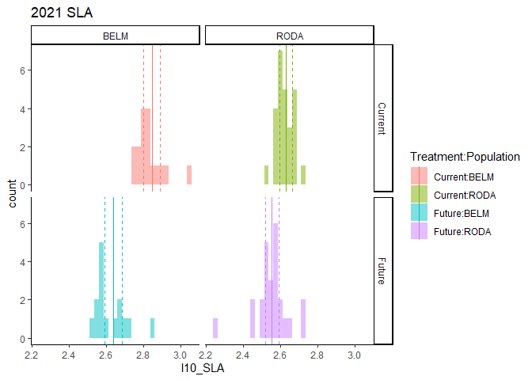<!-- -->

``` r
ggplot(dat = Dat_2022)+
  geom_histogram(aes(x = l10_SLA, fill = Treatment:Population), alpha = 0.5, position = "identity", binwidth = .025)+
  geom_vline(data = sla_means_22, aes(xintercept = Mean, color = Treatment:Population),  linetype = "solid")+
  geom_vline(data = sla_means_22, aes(xintercept = LL_95, color = Treatment:Population),  linetype = "dashed")+
  geom_vline(data = sla_means_22, aes(xintercept = UL_95, color = Treatment:Population),  linetype = "dashed")+
  labs(title = "2022 SLA")+
  facet_grid(Treatment ~ Population)+
  theme_classic()
```

```
## Warning: Removed 1 row containing non-finite outside the scale range
## (`stat_bin()`).
```

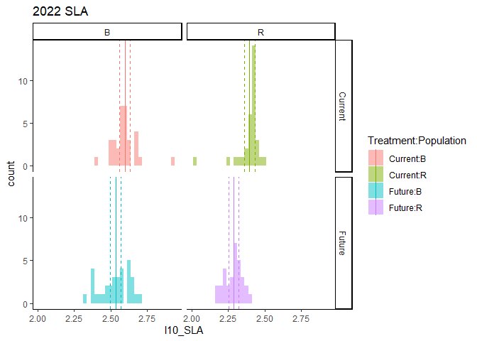<!-- -->


``` r
ggplot(dat = Dat_2021_TwoTrt)+
  geom_histogram(aes(x = LDMC, fill = Treatment:Population), alpha = 0.5, position = "identity", binwidth = 0.01)+
  geom_vline(data = LDMC_means_21, aes(xintercept = Bk_Mean, color = Treatment:Population),  linetype = "solid")+
  geom_vline(data = LDMC_means_21, aes(xintercept = Bk_LL_95, color = Treatment:Population),  linetype = "dashed")+
  geom_vline(data = LDMC_means_21, aes(xintercept = Bk_UL_95, color = Treatment:Population),  linetype = "dashed")+
  labs(title = "2021 LDMC Back Transformed")+
  facet_grid(Treatment ~ Population)+
  theme_classic()
```

```
## Warning: Removed 15 rows containing non-finite outside the scale range
## (`stat_bin()`).
```

<!-- -->

``` r
ggplot(dat = Dat_2022)+
  geom_histogram(aes(x = LDMC, fill = Treatment:Population), alpha = 0.5, position = "identity", binwidth = 0.015)+
  geom_vline(data = ldmc_means_22, aes(xintercept = Bk_Mean, color = Treatment:Population),  linetype = "solid")+
  geom_vline(data = ldmc_means_22, aes(xintercept = Bk_LL_95, color = Treatment:Population),  linetype = "dashed")+
  geom_vline(data = ldmc_means_22, aes(xintercept = Bk_UL_95, color = Treatment:Population),  linetype = "dashed")+
  labs(title = "2022 LDMC Back Transformed")+
  facet_grid(Treatment ~ Population)+
  theme_classic()
```

```
## Warning: Removed 2 rows containing non-finite outside the scale range
## (`stat_bin()`).
```

<!-- -->

``` r
# transformed scale
ggplot(dat = Dat_2021_TwoTrt)+
  geom_histogram(aes(x = l10_LDMC, fill = Treatment:Population), alpha = 0.5, position = "identity", binwidth = 0.05)+
  geom_vline(data = LDMC_means_21, aes(xintercept = Mean, color = Treatment:Population),  linetype = "solid")+
  geom_vline(data = LDMC_means_21, aes(xintercept = LL_95, color = Treatment:Population),  linetype = "dashed")+
  geom_vline(data = LDMC_means_21, aes(xintercept = UL_95, color = Treatment:Population),  linetype = "dashed")+
  labs(title = "2021 l10 LDMC")+
  facet_grid(Treatment ~ Population)+
  theme_classic()
```

```
## Warning: Removed 15 rows containing non-finite outside the scale range
## (`stat_bin()`).
```

<!-- -->

``` r
ggplot(dat = Dat_2022)+
  geom_histogram(aes(x = l10_LDMC, fill = Treatment:Population), alpha = 0.5, position = "identity", binwidth = 0.05)+
  geom_vline(data = ldmc_means_22, aes(xintercept = Mean, color = Treatment:Population),  linetype = "solid")+
  geom_vline(data = ldmc_means_22, aes(xintercept = LL_95, color = Treatment:Population),  linetype = "dashed")+
  geom_vline(data = ldmc_means_22, aes(xintercept = UL_95, color = Treatment:Population),  linetype = "dashed")+
  labs(title = "2022 l10 LDMC")+
  facet_grid(Treatment ~ Population)+
  theme_classic()
```

```
## Warning: Removed 2 rows containing non-finite outside the scale range
## (`stat_bin()`).
```

<!-- -->


## Test: Predicted means
Test new plotting function with predictmeans package. Use emergence to flowering trait to test things out. This works and gives an output of values, including the mean_table which I think is what I want to plot with. I don't want their premade plots becuase I want more customization.


``` r
# testing plotting functions
# run lm
lm <- lmer(EmergeToFlwr ~ Treatment * Population + (1|Population:Line) , data = Dat_2021_TwoTrt, contrasts = list(Treatment=contr.sum, Population = contr.sum))

predictmeans(lm, modelterm="Treatment:Population",  plotord = c(1,2), lineplot = TRUE, plotxlab = "Treatment", plotylab = "Days between Emergence and Flowering", mplot = TRUE, pplot = FALSE, bkplot = FALSE, plot = TRUE, jitterv = 0.05, prtplt = TRUE, newwd= FALSE)
```

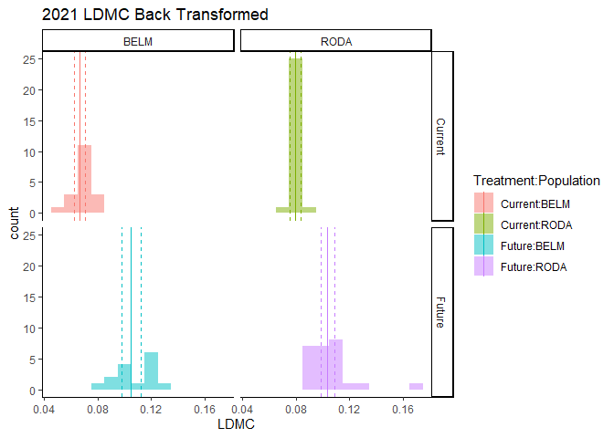<!-- -->

```
## $`Predicted Means`
##           Population     BELM     RODA
## Treatment                             
## Current               95.0492 117.8209
## Future                96.7376 119.2923
## 
## $`Standard Error of Means`
##           Population    BELM    RODA
## Treatment                           
## Current              2.08497 1.63161
## Future               2.16627 1.65443
## 
## $`Standard Error of Differences`
##  Max.SED  Min.SED Aveg.SED 
## 2.725777 1.063346 2.196323 
## attr(,"For the Same Level of Factor")
##          Treatment Population
## Aveg.SED  2.686638   1.215526
## Min.SED   2.647498   1.063346
## Max.SED   2.725777   1.367706
## 
## $LSD
##  Max.LSD  Min.LSD Aveg.LSD 
##  5.63932  2.19994  4.54394 
## attr(,"For the Same Level of Factor")
##          Treatment Population
## Aveg.LSD   5.55834    2.51478
## Min.LSD    5.47736    2.19994
## Max.LSD    5.63932    2.82962
## attr(,"Significant level")
## [1] 0.05
## attr(,"Degree of freedom")
## [1] 22.95
## 
## $mean_table
##   Treatment Population     Mean      SE      Df  LL(95%)  UL(95%)
## 1   Current       BELM  95.0492 2.08497 22.9547  90.7356  99.3627
## 2   Current       RODA 117.8209 1.63161 22.9547 114.4453 121.1965
## 3    Future       BELM  96.7376 2.16627 22.9547  92.2558 101.2193
## 4    Future       RODA 119.2923 1.65443 22.9547 115.8694 122.7151
```


        
        
