# Description

This code runs all linear models for the 2021 and 2022 experiments. 

# Set basic info for all code

This chunk sets things that will be constant for the whole document.


``` r
# read in packages
library(dplyr)
library(ggplot2)
library(lme4)
library(lmerTest)
library(tidyr)
library(rcompanion)
library(plotly)
library(emmeans)
library(sjPlot)
# prep for doing statistical analyses
options(contrasts = c("contr.sum", "contr.poly"))

# let's make some functions
std_mean <- function(x){
  sd(x, na.rm = TRUE)/sqrt(length(x))
}

# Confidence interval multiplier for standard error
    # Calculate t-statistic for confidence interval: 
    # e.g., if conf.interval is .95, use .975 (above/below), and use df=N-1

conf_int <- function(x, conf.interval = 0.95){
  ciMult <- qt((1+conf.interval)/2, length(x)-1)
  ci <- std_mean(x) * ciMult
  return(ci)
}
```
# 2021

## Read in data


``` r
Dat_2021 <- read.csv("data/CleanData_2021.csv")
# set factors
Dat_2021 <- Dat_2021 %>% dplyr::mutate(
  Population = as.factor(Population),
  Line = as.factor(Line),
  Treatment = as.factor(Treatment),
  Soil.Mix.Batch.Number.x = as.factor(Soil.Mix.Batch.Number.x),
  BranchStructure = as.factor(BranchStructure),
  DoneFlwr = as.factor(DoneFlwr),
  FruitCounter = as.factor(FruitCounter),
  SeedCounter = as.factor(SeedCounter)
  
)
```


## Summarize

``` r
# NOTE: These are raw means and confidence intervals, used to get a quick look at the data.
ByPop_21 <- Dat_2021 %>%
  dplyr::group_by(Population) %>%
  summarize(across(.col = c(Emergence:LeafNum_08262021, RosetteLeafNum_10042021:Repro_to_Ros, LatBranches:IJ_FruitCount, FruitCollected, NumFlwrLeft:IJ_SeedCount, FruitCount_BL, AG_biomass, AvgSeedWt, AvgSeedNum, fitness), .fns = list(mean = ~mean(.x, na.rm = TRUE, .group = "keep"), ci_95 = ~conf_int(.x), n = ~sum(!is.na(.x)))))

# transpose for easier viewing
ByPop_21 <- data.frame(t(ByPop_21))

# by treatment
ByTrt_21 <- Dat_2021 %>%
  dplyr::group_by(Treatment) %>%
  summarize(across(.col = c(Emergence:LeafNum_08262021, RosetteLeafNum_10042021:Repro_to_Ros, LatBranches:IJ_FruitCount, FruitCollected, NumFlwrLeft:IJ_SeedCount, FruitCount_BL, AG_biomass, AvgSeedWt, AvgSeedNum, fitness), .fns = list(mean = ~mean(.x, na.rm = TRUE, .group = "keep"), ci_95 = ~conf_int(.x), n = ~sum(!is.na(.x)))))
ByTrt_21 <- data.frame(t(ByTrt_21))

#population means within each treatment
ByTrt_Pop_21 <- Dat_2021 %>%
  dplyr::group_by(Population) %>%
  dplyr::group_by(Treatment, .add = TRUE) %>%
  summarize(across(.col = c(Emergence:LeafNum_08262021, RosetteLeafNum_10042021:Repro_to_Ros, LatBranches:IJ_FruitCount, FruitCollected, NumFlwrLeft:IJ_SeedCount, FruitCount_BL, AG_biomass, AvgSeedWt, AvgSeedNum, fitness), .fns = list(mean = ~mean(.x, na.rm = TRUE, .group = "keep"), ci_95 = ~conf_int(.x), n = ~sum(!is.na(.x)))))
```

```
## `summarise()` has grouped output by 'Population'. You can override using the
## `.groups` argument.
```

``` r
# get sample sizes
SampleSizes_2021 <- dplyr::select(ByTrt_Pop_21, "Treatment", "Population", ends_with("_n"))
save(SampleSizes_2021, file = "data/SampleSizes_2021.robj")

# for some ease of viewing
ByTrt_Pop_21 <- data.frame(t(ByTrt_Pop_21))
colnames(ByTrt_Pop_21) <- c("Belm_C", "Belm_F", "Roda_C", "Roda_F")

# save this to keep raw means
write.csv(ByTrt_Pop_21,"data/PopMeansByTreatment_2021.csv", row.names = TRUE )
```
## Two Treatment Anovas

This experiment included a Current/Future treatment where plants were in the current treatment before vernalization and the future treatment after vernalization to see if early heat and drought was important. We are not analyzing this third treatment here and it was removed during the data cleaning step.

The initial model is was follows:
trait ~ Treatment * Population + (1|Population:Line) + (1|Soil.Mix.Batch.Number.x)

When removing the soil mix random effect, most p values and effect sizes were not meaningfully changed with the following 4 exceptions written as to what happened when soil  mix was removed from the model:\
- dry weight of single leaf: population effect increased, p value decreased \
- relative water content: interaction effect increased, p value decreased (makes sense because dry weight changed a little)\
- rosette dry weight: p value cut in half and effect size doubles (did not write down which predictor this was for) \
- fruit number: population p value increases, interaction p value decreases \

In general these model changes were slight and soil mix explained very little variance - the exceptions are relative water content (soil mix explained half as much variance as genotype), number of fruits, and number of primary stalks (soil mix explained more variance than genotype but over half the variance is still residual). Thus, soil mix was removed as a random variable from the analysis.

To make plotting easier, I have one function that runs the model and the model accuracy tests, then outputs the model object. I then create a data_table with predict means and run an anova with the model output object. The data table and the anova are saved to go into a summary table later or to be used for plotting.


``` r
#renaming step
Dat_2021_TwoTrt <- Dat_2021
rm(Dat_2021)
# things I want to use as random variables: Line, soil mix batch number
# for single leaf traits also include leaf_Collected
# for traits at harvest I can use DoneFlwr

# function to run models on 2021 data:
do_lmer <- function(trait, data = Dat_2021_TwoTrt){
  lm <- lmer(trait ~ Treatment * Population + (1|Population:Line) , data = data, contrasts = list(Treatment=contr.sum, Population = contr.sum))
  print(plot(lm))
  hist(residuals(lm), breaks = 15)
  plot(fitted(lm), residuals(lm, type = "pearson", scaled = TRUE),
       col = c("red", "blue")[as.numeric(Dat_2021_TwoTrt$Population)[complete.cases(trait)]],
       pch = c(16, 15, 17)[as.numeric(Dat_2021_TwoTrt$Treatment)[complete.cases(trait)]])
  #legend("topleft", legend = c("Italy", "Sweden"), col = c("red", "blue"), pch = 16)
  #legend("topright", legend = c("Current", "Future"), col = "black", pch = c(16,17))
  # plotting sanity check
  print(paste0("the number of complete cases is ", sum(complete.cases(trait))))
  qqnorm(resid(lm))
  qqline(resid(lm))
  print(summary(lm))
  print(confint(lm))
  #sample.size <- data %>% group_by(Treatment) %>% group_by(Treatment, .add = TRUE) %>% summarize(across(.cols = trait, .fns= ~sum(!is.na(.x))))
  return(lm)
}
# do the anova
do_anov <- function(model){
  anov <- anova(model)
  print(anov)
  df <- as.data.frame(anov)
  df$exp <- "2021"
  return(df)
}

# get the means table, no backtransforming - can add pairwise to do comparisons within treatment or within population, but not both at the same time.
get_table <- function(model){
  tab <- emmeans(model, c("Treatment", "Population"), type = "response")
  return(tab)
}
#for backtransformed
get_table_bt <- function(model){
  tab <- get_table(update(ref_grid(model), tran = "log10"))
  return(tab)
}
```

The modelling function runs a mixed model where each trait is predicted by population, treatment, and their interaction while accounting for random effects of line nested within population and soil mix batch number -> and just line in the final model.

### Phenology

Days to Emergence


``` r
# Emergence
emergence_lm_21 <- do_lmer(Dat_2021_TwoTrt$Emergence)
```

<!-- --><!-- --><!-- -->

```
## [1] "the number of complete cases is 94"
```

```
## Linear mixed model fit by REML. t-tests use Satterthwaite's method [
## lmerModLmerTest]
## Formula: trait ~ Treatment * Population + (1 | Population:Line)
##    Data: data
## 
## REML criterion at convergence: 587.8
## 
## Scaled residuals: 
##     Min      1Q  Median      3Q     Max 
## -1.7201 -0.2424 -0.0381  0.1526  5.7740 
## 
## Random effects:
##  Groups          Name        Variance Std.Dev.
##  Population:Line (Intercept) 18.72    4.327   
##  Residual                    24.38    4.937   
## Number of obs: 94, groups:  Population:Line, 21
## 
## Fixed effects:
##                        Estimate Std. Error      df t value Pr(>|t|)    
## (Intercept)              7.0822     1.1271 15.2944   6.284 1.34e-05 ***
## Treatment1               2.3507     0.5225 67.1368   4.499 2.78e-05 ***
## Population1              2.1259     1.1271 15.2944   1.886   0.0784 .  
## Treatment1:Population1   1.1692     0.5225 67.1368   2.238   0.0286 *  
## ---
## Signif. codes:  0 '***' 0.001 '**' 0.01 '*' 0.05 '.' 0.1 ' ' 1
## 
## Correlation of Fixed Effects:
##             (Intr) Trtmn1 Ppltn1
## Treatment1  -0.005              
## Population1  0.251 -0.002       
## Trtmnt1:Pp1 -0.002  0.209 -0.005
```

```
## Computing profile confidence intervals ...
```

<!-- -->

```
##                              2.5 %   97.5 %
## .sig01                  2.21265295 6.341862
## .sigma                  4.16574469 5.838843
## (Intercept)             4.90030687 9.315660
## Treatment1              1.31972452 3.373855
## Population1            -0.05862151 4.354736
## Treatment1:Population1  0.14419248 2.198033
```

``` r
emergence_anov_21 <- do_anov(emergence_lm_21)
```

```
## Type III Analysis of Variance Table with Satterthwaite's method
##                      Sum Sq Mean Sq NumDF  DenDF F value    Pr(>F)    
## Treatment            493.44  493.44     1 67.137 20.2428 2.778e-05 ***
## Population            86.72   86.72     1 15.294  3.5576   0.07841 .  
## Treatment:Population 122.07  122.07     1 67.137  5.0076   0.02856 *  
## ---
## Signif. codes:  0 '***' 0.001 '**' 0.01 '*' 0.05 '.' 0.1 ' ' 1
```

``` r
emergence_anov_21$trait <- "Emergence"
emergence_emmeans_21 <- get_table(emergence_lm_21)
emergence_means_21 <- as.data.frame(emergence_emmeans_21)
emergence_pairs_21 <- as.data.frame(pairs(emergence_emmeans_21))
emergence_pairs_21$trait <- "Emergence"
```

Days between emergence and bolting (note: not included in fina manuscript)


``` r
# days emergence to bolting
bolting_lm_21 <- do_lmer(Dat_2021_TwoTrt$DayToBolt)
```

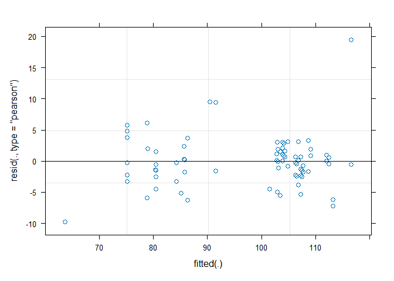<!-- -->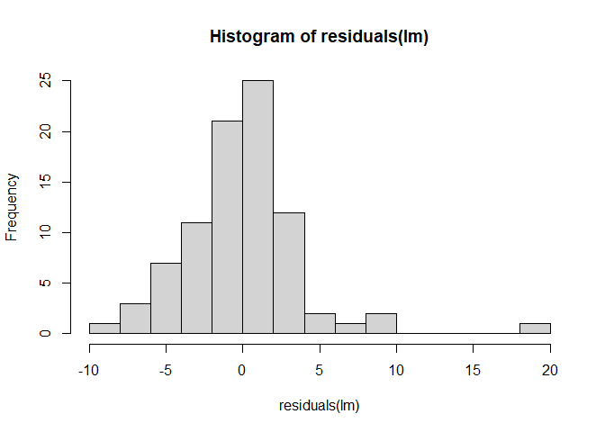<!-- -->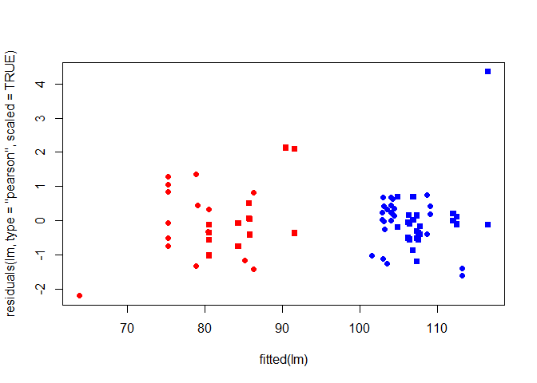<!-- -->

```
## [1] "the number of complete cases is 86"
```

```
## Linear mixed model fit by REML. t-tests use Satterthwaite's method [
## lmerModLmerTest]
## Formula: trait ~ Treatment * Population + (1 | Population:Line)
##    Data: data
## 
## REML criterion at convergence: 530.4
## 
## Scaled residuals: 
##     Min      1Q  Median      3Q     Max 
## -2.1964 -0.4846 -0.0055  0.4038  4.3559 
## 
## Random effects:
##  Groups          Name        Variance Std.Dev.
##  Population:Line (Intercept) 30.25    5.500   
##  Residual                    19.89    4.459   
## Number of obs: 86, groups:  Population:Line, 21
## 
## Fixed effects:
##                        Estimate Std. Error       df t value Pr(>|t|)    
## (Intercept)             93.9889     1.3683  13.5792  68.690  < 2e-16 ***
## Treatment1              -2.1662     0.5100  59.1578  -4.247 7.76e-05 ***
## Population1            -12.6459     1.3683  13.5792  -9.242 3.14e-07 ***
## Treatment1:Population1  -0.4833     0.5100  59.1578  -0.948    0.347    
## ---
## Signif. codes:  0 '***' 0.001 '**' 0.01 '*' 0.05 '.' 0.1 ' ' 1
## 
## Correlation of Fixed Effects:
##             (Intr) Trtmn1 Ppltn1
## Treatment1  -0.054              
## Population1  0.257 -0.030       
## Trtmnt1:Pp1 -0.030  0.257 -0.054
```

```
## Computing profile confidence intervals ...
```

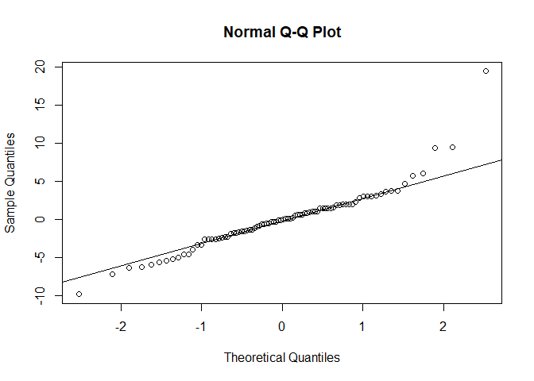<!-- -->

```
##                             2.5 %      97.5 %
## .sig01                   3.030582   7.9669329
## .sigma                   3.715178   5.3719136
## (Intercept)             91.256461  96.6280012
## Treatment1              -3.208643  -1.1826092
## Population1            -15.364179 -10.0002752
## Treatment1:Population1  -1.519551   0.5020382
```

``` r
bolting_anov_21 <- do_anov(bolting_lm_21)
```

```
## Type III Analysis of Variance Table with Satterthwaite's method
##                       Sum Sq Mean Sq NumDF  DenDF F value    Pr(>F)    
## Treatment             358.71  358.71     1 59.158  18.039 7.763e-05 ***
## Population           1698.51 1698.51     1 13.579  85.416 3.144e-07 ***
## Treatment:Population   17.86   17.86     1 59.158   0.898    0.3472    
## ---
## Signif. codes:  0 '***' 0.001 '**' 0.01 '*' 0.05 '.' 0.1 ' ' 1
```

``` r
bolting_anov_21$trait <- "Bolting"
bolting_means_21 <- as.data.frame(get_table(bolting_lm_21))
```

Days between bolting and flowering (note: not included in manuscript)


``` r
# days bolting to flowering
flowering_lm_21 <- do_lmer(Dat_2021_TwoTrt$DayToFlwr)
```

<!-- --><!-- --><!-- -->

```
## [1] "the number of complete cases is 85"
```

```
## Linear mixed model fit by REML. t-tests use Satterthwaite's method [
## lmerModLmerTest]
## Formula: trait ~ Treatment * Population + (1 | Population:Line)
##    Data: data
## 
## REML criterion at convergence: 419.2
## 
## Scaled residuals: 
##     Min      1Q  Median      3Q     Max 
## -2.1984 -0.6315 -0.0941  0.5323  2.5234 
## 
## Random effects:
##  Groups          Name        Variance Std.Dev.
##  Population:Line (Intercept) 2.354    1.534   
##  Residual                    6.915    2.630   
## Number of obs: 85, groups:  Population:Line, 21
## 
## Fixed effects:
##                        Estimate Std. Error      df t value Pr(>|t|)    
## (Intercept)             13.3475     0.4764 14.4428  28.016 5.38e-14 ***
## Treatment1               1.3339     0.2980 63.9497   4.475 3.21e-05 ***
## Population1              1.2448     0.4764 14.4428   2.613   0.0201 *  
## Treatment1:Population1   0.3745     0.2980 63.9497   1.256   0.2135    
## ---
## Signif. codes:  0 '***' 0.001 '**' 0.01 '*' 0.05 '.' 0.1 ' ' 1
## 
## Correlation of Fixed Effects:
##             (Intr) Trtmn1 Ppltn1
## Treatment1  -0.063              
## Population1  0.269 -0.041       
## Trtmnt1:Pp1 -0.041  0.236 -0.063
```

```
## Computing profile confidence intervals ...
```

<!-- -->

```
##                             2.5 %     97.5 %
## .sig01                  0.2588726  2.4981348
## .sigma                  2.1947908  3.1321150
## (Intercept)            12.4121106 14.2721081
## Treatment1              0.7375880  1.9105034
## Population1             0.3188873  2.1792307
## Treatment1:Population1 -0.2115299  0.9576623
```

``` r
flowering_anov_21 <- do_anov(flowering_lm_21)
```

```
## Type III Analysis of Variance Table with Satterthwaite's method
##                       Sum Sq Mean Sq NumDF  DenDF F value    Pr(>F)    
## Treatment            138.507 138.507     1 63.950 20.0296 3.205e-05 ***
## Population            47.209  47.209     1 14.443  6.8268   0.02006 *  
## Treatment:Population  10.916  10.916     1 63.950  1.5785   0.21354    
## ---
## Signif. codes:  0 '***' 0.001 '**' 0.01 '*' 0.05 '.' 0.1 ' ' 1
```

``` r
flowering_anov_21$trait <- "Bolting To Flowering"
flowering_means_21 <- as.data.frame(get_table(flowering_lm_21))
```

Days between Emergence and flowering


``` r
# Emergence to flowering
eTof_lm_21 <- do_lmer(Dat_2021_TwoTrt$EmergeToFlwr)
```

<!-- --><!-- --><!-- -->

```
## [1] "the number of complete cases is 85"
```

```
## Linear mixed model fit by REML. t-tests use Satterthwaite's method [
## lmerModLmerTest]
## Formula: trait ~ Treatment * Population + (1 | Population:Line)
##    Data: data
## 
## REML criterion at convergence: 500.4
## 
## Scaled residuals: 
##     Min      1Q  Median      3Q     Max 
## -1.9982 -0.3696 -0.0644  0.4179  4.5201 
## 
## Random effects:
##  Groups          Name        Variance Std.Dev.
##  Population:Line (Intercept) 27.08    5.203   
##  Residual                    14.16    3.763   
## Number of obs: 85, groups:  Population:Line, 21
## 
## Fixed effects:
##                         Estimate Std. Error        df t value Pr(>|t|)    
## (Intercept)            107.22498    1.27173  13.25347  84.314  < 2e-16 ***
## Treatment1              -0.78995    0.43311  57.28992  -1.824   0.0734 .  
## Population1            -11.33161    1.27173  13.25347  -8.910 5.82e-07 ***
## Treatment1:Population1  -0.05427    0.43311  57.28992  -0.125   0.9007    
## ---
## Signif. codes:  0 '***' 0.001 '**' 0.01 '*' 0.05 '.' 0.1 ' ' 1
## 
## Correlation of Fixed Effects:
##             (Intr) Trtmn1 Ppltn1
## Treatment1  -0.048              
## Population1  0.253 -0.031       
## Trtmnt1:Pp1 -0.031  0.247 -0.048
```

```
## Computing profile confidence intervals ...
```

<!-- -->

```
##                              2.5 %       97.5 %
## .sig01                   2.8356169   7.47763290
## .sigma                   3.1291636   4.56251355
## (Intercept)            104.6828260 109.67742145
## Treatment1              -1.6916233   0.04293869
## Population1            -13.8460381  -8.86451730
## Treatment1:Population1  -0.9383905   0.78228854
```

``` r
eTof_anov_21 <- do_anov(eTof_lm_21)
```

```
## Type III Analysis of Variance Table with Satterthwaite's method
##                       Sum Sq Mean Sq NumDF  DenDF F value    Pr(>F)    
## Treatment              47.11   47.11     1 57.290  3.3266   0.07338 .  
## Population           1124.29 1124.29     1 13.253 79.3946 5.823e-07 ***
## Treatment:Population    0.22    0.22     1 57.290  0.0157   0.90072    
## ---
## Signif. codes:  0 '***' 0.001 '**' 0.01 '*' 0.05 '.' 0.1 ' ' 1
```

``` r
eTof_anov_21$trait <- "Emergence To Flowering"
eTof_emmeans_21 <- get_table(eTof_lm_21)
eTof_means_21 <- as.data.frame(eTof_emmeans_21)
eTof_pairs_21 <- as.data.frame(pairs(eTof_emmeans_21))
eTof_pairs_21$trait <- "Emergence To Flowering"
```

### Single Leaf Collected At Flowering

fresh weight

``` r
# Fresh weight
fresh_lm_21 <- do_lmer(Dat_2021_TwoTrt$l10_FreshWt)
```

<!-- --><!-- --><!-- -->

```
## [1] "the number of complete cases is 85"
```

```
## Linear mixed model fit by REML. t-tests use Satterthwaite's method [
## lmerModLmerTest]
## Formula: trait ~ Treatment * Population + (1 | Population:Line)
##    Data: data
## 
## REML criterion at convergence: -60.2
## 
## Scaled residuals: 
##     Min      1Q  Median      3Q     Max 
## -2.6215 -0.3928  0.1852  0.6380  1.4826 
## 
## Random effects:
##  Groups          Name        Variance Std.Dev.
##  Population:Line (Intercept) 0.03042  0.1744  
##  Residual                    0.01353  0.1163  
## Number of obs: 85, groups:  Population:Line, 21
## 
## Fixed effects:
##                        Estimate Std. Error       df t value Pr(>|t|)    
## (Intercept)            -1.17954    0.04216 14.50807 -27.980 4.95e-14 ***
## Treatment1              0.23573    0.01340 58.77530  17.591  < 2e-16 ***
## Population1            -0.06932    0.04216 14.50807  -1.644   0.1216    
## Treatment1:Population1  0.03560    0.01340 58.77530   2.657   0.0101 *  
## ---
## Signif. codes:  0 '***' 0.001 '**' 0.01 '*' 0.05 '.' 0.1 ' ' 1
## 
## Correlation of Fixed Effects:
##             (Intr) Trtmn1 Ppltn1
## Treatment1  -0.046              
## Population1  0.251 -0.029       
## Trtmnt1:Pp1 -0.029  0.247 -0.046
```

```
## Computing profile confidence intervals ...
```

<!-- -->

```
##                               2.5 %      97.5 %
## .sig01                  0.104432054  0.24700252
## .sigma                  0.096829514  0.13986969
## (Intercept)            -1.263451662 -1.09811659
## Treatment1              0.208458202  0.26158909
## Population1            -0.152814938  0.01231486
## Treatment1:Population1  0.008592208  0.06154450
```

``` r
fresh_anov_21 <- do_anov(fresh_lm_21)
```

```
## Type III Analysis of Variance Table with Satterthwaite's method
##                      Sum Sq Mean Sq NumDF  DenDF  F value  Pr(>F)    
## Treatment            4.1858  4.1858     1 58.775 309.4517 < 2e-16 ***
## Population           0.0366  0.0366     1 14.508   2.7037 0.12160    
## Treatment:Population 0.0955  0.0955     1 58.775   7.0570 0.01015 *  
## ---
## Signif. codes:  0 '***' 0.001 '**' 0.01 '*' 0.05 '.' 0.1 ' ' 1
```

``` r
fresh_anov_21$trait <- "l10_FreshWt"
fresh_emmeans_21 <- get_table_bt(fresh_lm_21)
fresh_means_21 <- as.data.frame(fresh_emmeans_21)
fresh_pairs_21 <- as.data.frame(pairs(fresh_emmeans_21))
fresh_pairs_21$trait <- "l10_FreshWt"
```

saturated/hydrated weight


``` r
# Saturated weight
sat_lm_21 <- do_lmer(Dat_2021_TwoTrt$l10_SatWt)
```

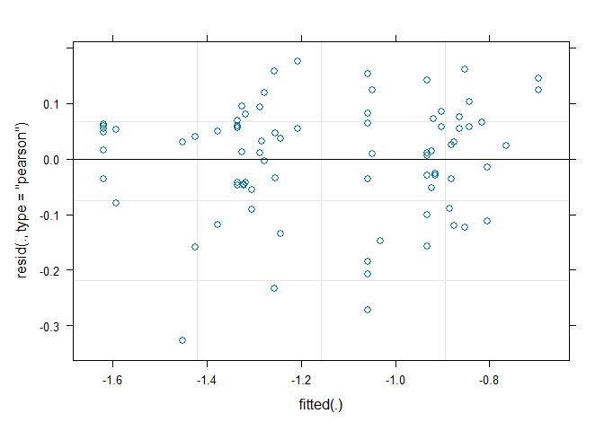<!-- -->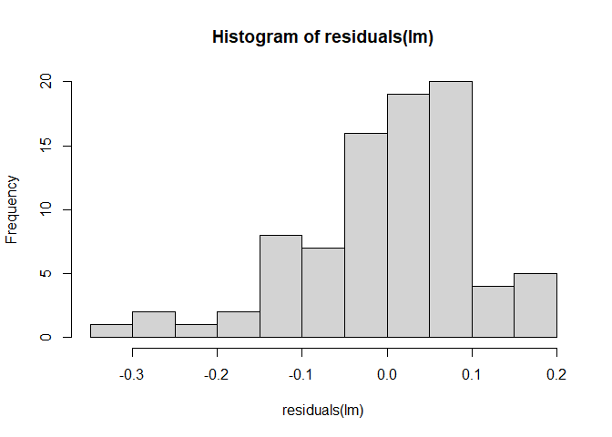<!-- -->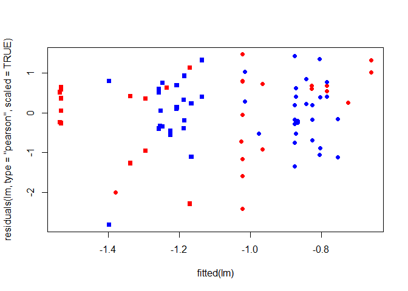<!-- -->

```
## [1] "the number of complete cases is 85"
```

```
## Linear mixed model fit by REML. t-tests use Satterthwaite's method [
## lmerModLmerTest]
## Formula: trait ~ Treatment * Population + (1 | Population:Line)
##    Data: data
## 
## REML criterion at convergence: -61.9
## 
## Scaled residuals: 
##     Min      1Q  Median      3Q     Max 
## -2.8140 -0.4114  0.1928  0.6112  1.4642 
## 
## Random effects:
##  Groups          Name        Variance Std.Dev.
##  Population:Line (Intercept) 0.02656  0.1630  
##  Residual                    0.01363  0.1167  
## Number of obs: 85, groups:  Population:Line, 21
## 
## Fixed effects:
##                        Estimate Std. Error       df t value Pr(>|t|)    
## (Intercept)            -1.11253    0.03977 14.07761 -27.971  9.7e-14 ***
## Treatment1              0.22307    0.01344 58.45017  16.602  < 2e-16 ***
## Population1            -0.06643    0.03977 14.07761  -1.670   0.1170    
## Treatment1:Population1  0.03205    0.01344 58.45017   2.386   0.0203 *  
## ---
## Signif. codes:  0 '***' 0.001 '**' 0.01 '*' 0.05 '.' 0.1 ' ' 1
## 
## Correlation of Fixed Effects:
##             (Intr) Trtmn1 Ppltn1
## Treatment1  -0.047              
## Population1  0.253 -0.031       
## Trtmnt1:Pp1 -0.031  0.247 -0.047
```

```
## Computing profile confidence intervals ...
```

<!-- -->

```
##                               2.5 %      97.5 %
## .sig01                  0.094437594  0.23270088
## .sigma                  0.097144666  0.14064005
## (Intercept)            -1.191920259 -1.03579818
## Treatment1              0.195621800  0.24898069
## Population1            -0.145309608  0.01054539
## Treatment1:Population1  0.004924121  0.05806381
```

``` r
sat_anov_21 <- do_anov(sat_lm_21)
```

```
## Type III Analysis of Variance Table with Satterthwaite's method
##                      Sum Sq Mean Sq NumDF  DenDF  F value  Pr(>F)    
## Treatment            3.7553  3.7553     1 58.450 275.6137 < 2e-16 ***
## Population           0.0380  0.0380     1 14.078   2.7893 0.11697    
## Treatment:Population 0.0775  0.0775     1 58.450   5.6910 0.02031 *  
## ---
## Signif. codes:  0 '***' 0.001 '**' 0.01 '*' 0.05 '.' 0.1 ' ' 1
```

``` r
sat_anov_21$trait <- "l10_SatWt"
sat_emmeans_21 <- get_table_bt(sat_lm_21)
sat_means_21 <- as.data.frame(sat_emmeans_21)
sat_pairs_21 <- as.data.frame(pairs(sat_emmeans_21))
sat_pairs_21$trait <- "l10_SatWt"
```


dried weight

``` r
# Dried weight
dry_lm_21 <- do_lmer(Dat_2021_TwoTrt$l10_DriedWt)
```

<!-- --><!-- --><!-- -->

```
## [1] "the number of complete cases is 85"
```

```
## Linear mixed model fit by REML. t-tests use Satterthwaite's method [
## lmerModLmerTest]
## Formula: trait ~ Treatment * Population + (1 | Population:Line)
##    Data: data
## 
## REML criterion at convergence: -55.8
## 
## Scaled residuals: 
##     Min      1Q  Median      3Q     Max 
## -3.1379 -0.3692  0.1533  0.5441  1.4237 
## 
## Random effects:
##  Groups          Name        Variance Std.Dev.
##  Population:Line (Intercept) 0.03441  0.1855  
##  Residual                    0.01402  0.1184  
## Number of obs: 85, groups:  Population:Line, 21
## 
## Fixed effects:
##                        Estimate Std. Error       df t value Pr(>|t|)    
## (Intercept)            -2.18023    0.04459 14.01650 -48.896  < 2e-16 ***
## Treatment1              0.14602    0.01365 57.94126  10.698 2.43e-15 ***
## Population1            -0.09010    0.04459 14.01650  -2.021   0.0628 .  
## Treatment1:Population1  0.01238    0.01365 57.94126   0.907   0.3683    
## ---
## Signif. codes:  0 '***' 0.001 '**' 0.01 '*' 0.05 '.' 0.1 ' ' 1
## 
## Correlation of Fixed Effects:
##             (Intr) Trtmn1 Ppltn1
## Treatment1  -0.044              
## Population1  0.250 -0.028       
## Trtmnt1:Pp1 -0.028  0.248 -0.044
```

```
## Computing profile confidence intervals ...
```

<!-- -->

```
##                              2.5 %       97.5 %
## .sig01                  0.10894468  0.262791386
## .sigma                  0.09852769  0.142907333
## (Intercept)            -2.26923166 -2.094195810
## Treatment1              0.11807882  0.172344036
## Population1            -0.17856985 -0.003808402
## Treatment1:Population1 -0.01523668  0.038795020
```

``` r
dry_anov_21 <- do_anov(dry_lm_21)
```

```
## Type III Analysis of Variance Table with Satterthwaite's method
##                       Sum Sq Mean Sq NumDF  DenDF  F value    Pr(>F)    
## Treatment            1.60445 1.60445     1 57.941 114.4465 2.431e-15 ***
## Population           0.05724 0.05724     1 14.016   4.0831   0.06285 .  
## Treatment:Population 0.01153 0.01153     1 57.941   0.8223   0.36827    
## ---
## Signif. codes:  0 '***' 0.001 '**' 0.01 '*' 0.05 '.' 0.1 ' ' 1
```

``` r
dry_anov_21$trait <- "l10_DriedWt"
dry_emmeans_21 <- get_table_bt(dry_lm_21)
dry_means_21 <- as.data.frame(dry_emmeans_21)
dry_pairs_21 <- as.data.frame(pairs(dry_emmeans_21))
dry_pairs_21$trait <- "l10_DriedWt"

# testing, no meaningfully changes - done before updating lmer and anov to differnt functions
#anov_lmer(Dat_2021_TwoTrt$DriedWt_g)
#anov_lmer(Dat_2021_TwoTrt$SQR_DriedWt)
```

leaf area


``` r
# Leaf Area
area_lm_21 <- do_lmer(Dat_2021_TwoTrt$l10_LeafArea)
```

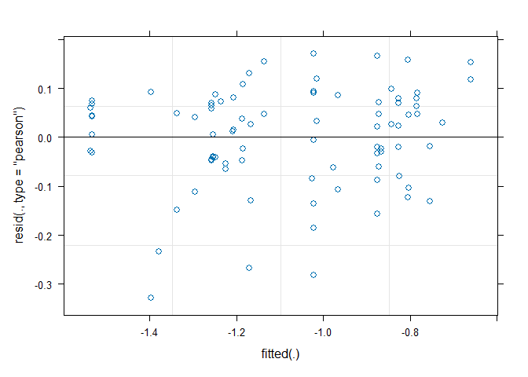<!-- -->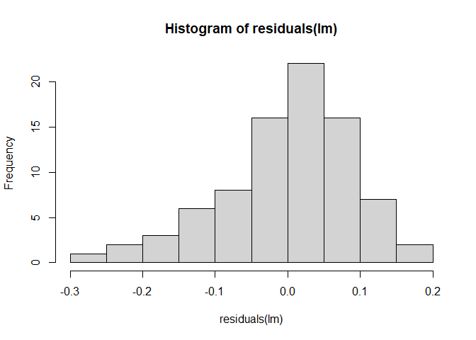<!-- -->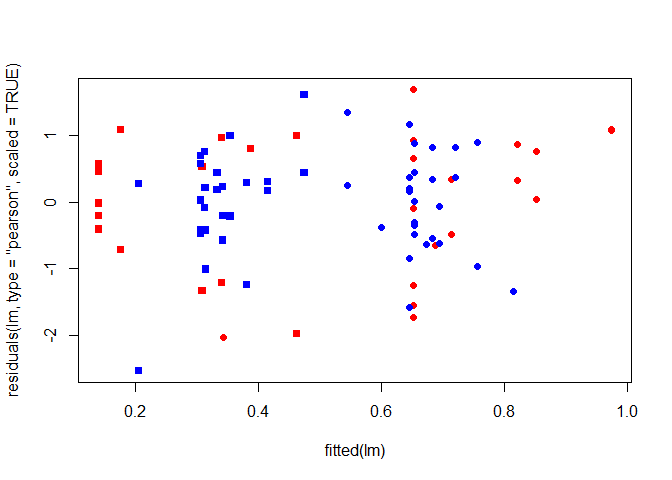<!-- -->

```
## [1] "the number of complete cases is 83"
```

```
## Linear mixed model fit by REML. t-tests use Satterthwaite's method [
## lmerModLmerTest]
## Formula: trait ~ Treatment * Population + (1 | Population:Line)
##    Data: data
## 
## REML criterion at convergence: -81.4
## 
## Scaled residuals: 
##     Min      1Q  Median      3Q     Max 
## -2.5360 -0.4835  0.1834  0.6205  1.6891 
## 
## Random effects:
##  Groups          Name        Variance Std.Dev.
##  Population:Line (Intercept) 0.02002  0.1415  
##  Residual                    0.01040  0.1020  
## Number of obs: 83, groups:  Population:Line, 21
## 
## Fixed effects:
##                         Estimate Std. Error        df t value Pr(>|t|)    
## (Intercept)             0.496041   0.034771 13.640020  14.266 1.38e-09 ***
## Treatment1              0.213058   0.011993 57.102785  17.765  < 2e-16 ***
## Population1            -0.008962   0.034771 13.640020  -0.258 0.800462    
## Treatment1:Population1  0.042910   0.011993 57.102785   3.578 0.000715 ***
## ---
## Signif. codes:  0 '***' 0.001 '**' 0.01 '*' 0.05 '.' 0.1 ' ' 1
## 
## Correlation of Fixed Effects:
##             (Intr) Trtmn1 Ppltn1
## Treatment1  -0.025              
## Population1  0.260 -0.014       
## Trtmnt1:Pp1 -0.014  0.259 -0.025
```

```
## Computing profile confidence intervals ...
```

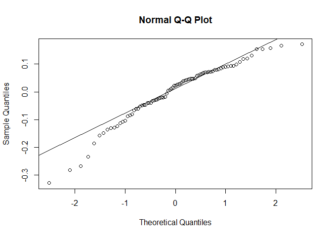<!-- -->

```
##                              2.5 %     97.5 %
## .sig01                  0.07972315 0.20336740
## .sigma                  0.08457513 0.12358809
## (Intercept)             0.42708114 0.56330824
## Treatment1              0.18799866 0.23609312
## Population1            -0.07769561 0.05843942
## Treatment1:Population1  0.01833760 0.06601646
```

``` r
area_anov_21 <- do_anov(area_lm_21)
```

```
## Type III Analysis of Variance Table with Satterthwaite's method
##                      Sum Sq Mean Sq NumDF  DenDF  F value    Pr(>F)    
## Treatment            3.2828  3.2828     1 57.103 315.5779 < 2.2e-16 ***
## Population           0.0007  0.0007     1 13.640   0.0664 0.8004624    
## Treatment:Population 0.1332  0.1332     1 57.103  12.8006 0.0007147 ***
## ---
## Signif. codes:  0 '***' 0.001 '**' 0.01 '*' 0.05 '.' 0.1 ' ' 1
```

``` r
area_anov_21$trait <- "l10_area"
area_emmeans_21 <- get_table_bt(area_lm_21)
area_means_21 <- as.data.frame(area_emmeans_21)
area_pairs_21 <- as.data.frame(pairs(area_emmeans_21))
area_pairs_21$trait <- "l10_area"
```


leaf perimeter


``` r
per_lm_21 <- do_lmer(Dat_2021_TwoTrt$l10_LeafPer)
```

<!-- --><!-- --><!-- -->

```
## [1] "the number of complete cases is 83"
```

```
## Linear mixed model fit by REML. t-tests use Satterthwaite's method [
## lmerModLmerTest]
## Formula: trait ~ Treatment * Population + (1 | Population:Line)
##    Data: data
## 
## REML criterion at convergence: -161.4
## 
## Scaled residuals: 
##      Min       1Q   Median       3Q      Max 
## -2.61222 -0.44221  0.07491  0.49319  1.61245 
## 
## Random effects:
##  Groups          Name        Variance Std.Dev.
##  Population:Line (Intercept) 0.004567 0.06758 
##  Residual                    0.004223 0.06499 
## Number of obs: 83, groups:  Population:Line, 21
## 
## Fixed effects:
##                         Estimate Std. Error        df t value Pr(>|t|)    
## (Intercept)             1.067498   0.017545 10.659214  60.844 6.77e-15 ***
## Treatment1              0.136535   0.007591 54.103865  17.987  < 2e-16 ***
## Population1            -0.014862   0.017545 10.659214  -0.847 0.415560    
## Treatment1:Population1  0.026822   0.007591 54.103865   3.533 0.000848 ***
## ---
## Signif. codes:  0 '***' 0.001 '**' 0.01 '*' 0.05 '.' 0.1 ' ' 1
## 
## Correlation of Fixed Effects:
##             (Intr) Trtmn1 Ppltn1
## Treatment1  -0.029              
## Population1  0.268 -0.018       
## Trtmnt1:Pp1 -0.018  0.254 -0.029
```

```
## Computing profile confidence intervals ...
```

<!-- -->

```
##                              2.5 %     97.5 %
## .sig01                  0.02783376 0.10297019
## .sigma                  0.05369511 0.07992568
## (Intercept)             1.03250517 1.10135898
## Treatment1              0.12043942 0.15107785
## Population1            -0.04990399 0.01897173
## Treatment1:Population1  0.01077325 0.04137020
```

``` r
per_anov_21 <- do_anov(per_lm_21)
```

```
## Type III Analysis of Variance Table with Satterthwaite's method
##                       Sum Sq Mean Sq NumDF  DenDF  F value    Pr(>F)    
## Treatment            1.36629 1.36629     1 54.104 323.5219 < 2.2e-16 ***
## Population           0.00303 0.00303     1 10.659   0.7176 0.4155605    
## Treatment:Population 0.05273 0.05273     1 54.104  12.4854 0.0008483 ***
## ---
## Signif. codes:  0 '***' 0.001 '**' 0.01 '*' 0.05 '.' 0.1 ' ' 1
```

``` r
per_anov_21$trait <- "l10_Perimeter"
per_emmeans_21 <- get_table_bt(per_lm_21)
per_means_21 <- as.data.frame(per_emmeans_21)
per_pairs_21 <- as.data.frame(pairs(per_emmeans_21))
per_pairs_21$trait <- "l10_Perimeter"
```


specific leaf area


``` r
# SLA
SLA_lm_21 <- do_lmer(Dat_2021_TwoTrt$l10_SLA)
```

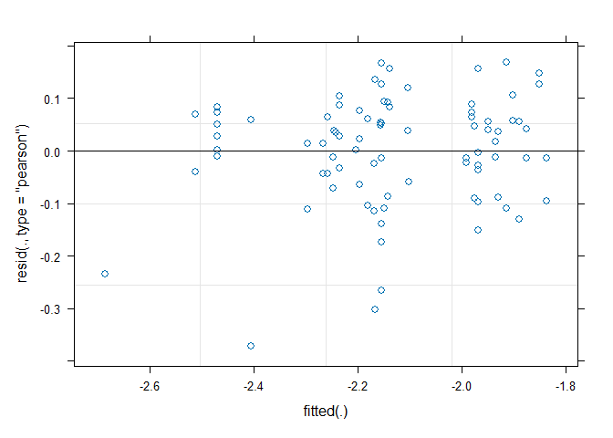<!-- --><!-- -->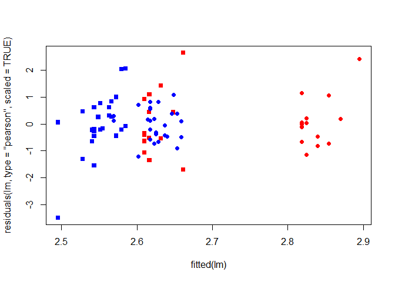<!-- -->

```
## [1] "the number of complete cases is 83"
```

```
## Linear mixed model fit by REML. t-tests use Satterthwaite's method [
## lmerModLmerTest]
## Formula: trait ~ Treatment * Population + (1 | Population:Line)
##    Data: data
## 
## REML criterion at convergence: -172.2
## 
## Scaled residuals: 
##     Min      1Q  Median      3Q     Max 
## -3.4966 -0.4782 -0.0399  0.4528  2.6551 
## 
## Random effects:
##  Groups          Name        Variance Std.Dev.
##  Population:Line (Intercept) 0.001299 0.03605 
##  Residual                    0.004492 0.06702 
## Number of obs: 83, groups:  Population:Line, 21
## 
## Fixed effects:
##                         Estimate Std. Error        df t value Pr(>|t|)    
## (Intercept)             2.667434   0.011759 12.922464 226.836  < 2e-16 ***
## Treatment1              0.070429   0.007699 62.693514   9.148 3.76e-13 ***
## Population1             0.076209   0.011759 12.922464   6.481 2.12e-05 ***
## Treatment1:Population1  0.033593   0.007699 62.693514   4.363 4.88e-05 ***
## ---
## Signif. codes:  0 '***' 0.001 '**' 0.01 '*' 0.05 '.' 0.1 ' ' 1
## 
## Correlation of Fixed Effects:
##             (Intr) Trtmn1 Ppltn1
## Treatment1  -0.035              
## Population1  0.280 -0.025       
## Trtmnt1:Pp1 -0.025  0.241 -0.035
```

```
## Computing profile confidence intervals ...
```

<!-- -->

```
##                             2.5 %     97.5 %
## .sig01                 0.00000000 0.06097967
## .sigma                 0.05576688 0.08063255
## (Intercept)            2.64466235 2.69232461
## Treatment1             0.05545870 0.08571397
## Population1            0.05368135 0.10030121
## Treatment1:Population1 0.01861629 0.04887464
```

``` r
SLA_anov_21 <- do_anov(SLA_lm_21)
```

```
## Type III Analysis of Variance Table with Satterthwaite's method
##                       Sum Sq Mean Sq NumDF  DenDF F value    Pr(>F)    
## Treatment            0.37590 0.37590     1 62.694  83.681 3.757e-13 ***
## Population           0.18866 0.18866     1 12.922  42.000 2.125e-05 ***
## Treatment:Population 0.08552 0.08552     1 62.694  19.038 4.875e-05 ***
## ---
## Signif. codes:  0 '***' 0.001 '**' 0.01 '*' 0.05 '.' 0.1 ' ' 1
```

``` r
SLA_anov_21$trait <- "l10_SLA"
SLA_emmeans_21 <- get_table_bt(SLA_lm_21)
SLA_means_21 <- as.data.frame(SLA_emmeans_21)
SLA_pairs_21 <- as.data.frame(pairs(SLA_emmeans_21))
SLA_pairs_21$trait <- "l10_SLA"
```


leaf dry matter content

``` r
# LDMC
LDMC_lm_21 <- do_lmer(Dat_2021_TwoTrt$l10_LDMC)
```

<!-- --><!-- --><!-- -->

```
## [1] "the number of complete cases is 85"
```

```
## Linear mixed model fit by REML. t-tests use Satterthwaite's method [
## lmerModLmerTest]
## Formula: trait ~ Treatment * Population + (1 | Population:Line)
##    Data: data
## 
## REML criterion at convergence: -251.4
## 
## Scaled residuals: 
##     Min      1Q  Median      3Q     Max 
## -2.4485 -0.4358 -0.0234  0.4048  4.3451 
## 
## Random effects:
##  Groups          Name        Variance  Std.Dev.
##  Population:Line (Intercept) 0.0005846 0.02418 
##  Residual                    0.0017606 0.04196 
## Number of obs: 85, groups:  Population:Line, 21
## 
## Fixed effects:
##                         Estimate Std. Error        df  t value Pr(>|t|)    
## (Intercept)            -1.060670   0.007549 16.820703 -140.503  < 2e-16 ***
## Treatment1             -0.078883   0.004755 66.433120  -16.591  < 2e-16 ***
## Population1            -0.018192   0.007549 16.820703   -2.410   0.0277 *  
## Treatment1:Population1 -0.021125   0.004755 66.433120   -4.443 3.44e-05 ***
## ---
## Signif. codes:  0 '***' 0.001 '**' 0.01 '*' 0.05 '.' 0.1 ' ' 1
## 
## Correlation of Fixed Effects:
##             (Intr) Trtmn1 Ppltn1
## Treatment1  -0.063              
## Population1  0.269 -0.041       
## Trtmnt1:Pp1 -0.041  0.236 -0.063
```

```
## Computing profile confidence intervals ...
```

<!-- -->

```
##                               2.5 %       97.5 %
## .sig01                  0.007990638  0.038704065
## .sigma                  0.035089099  0.049593923
## (Intercept)            -1.076393477 -1.046047129
## Treatment1             -0.088328367 -0.069681981
## Population1            -0.033669760 -0.003655704
## Treatment1:Population1 -0.030546902 -0.011911948
```

``` r
LDMC_anov_21 <- do_anov(LDMC_lm_21)
```

```
## Type III Analysis of Variance Table with Satterthwaite's method
##                       Sum Sq Mean Sq NumDF  DenDF  F value    Pr(>F)    
## Treatment            0.48461 0.48461     1 66.433 275.2520 < 2.2e-16 ***
## Population           0.01022 0.01022     1 16.821   5.8071   0.02771 *  
## Treatment:Population 0.03475 0.03475     1 66.433  19.7403 3.442e-05 ***
## ---
## Signif. codes:  0 '***' 0.001 '**' 0.01 '*' 0.05 '.' 0.1 ' ' 1
```

``` r
LDMC_anov_21$trait <- "l10_LDMC"
LDMC_emmeans_21 <- get_table_bt(LDMC_lm_21)
LDMC_means_21 <- as.data.frame(LDMC_emmeans_21)
LDMC_pairs_21 <- as.data.frame(pairs(LDMC_emmeans_21))
LDMC_pairs_21$trait <- "l10_LDMC"
```


relative water content

``` r
# RWC
RWC_lm_21 <- do_lmer(Dat_2021_TwoTrt$RWC)
```

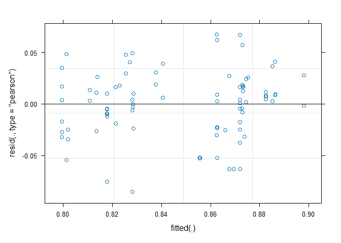<!-- -->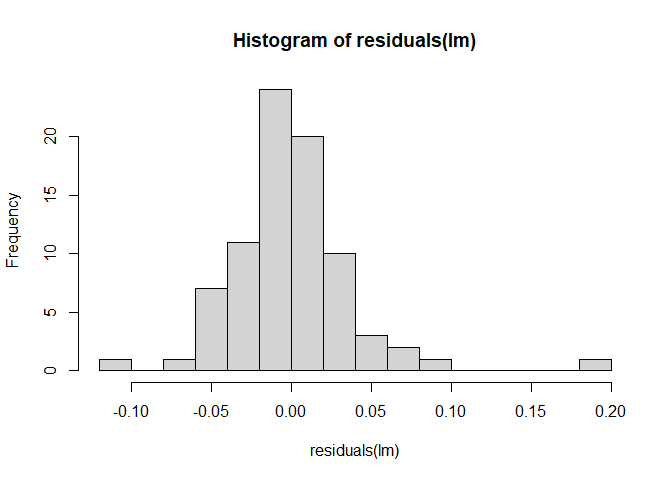<!-- -->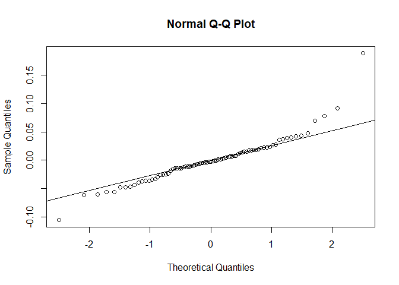<!-- -->

```
## [1] "the number of complete cases is 85"
```

```
## Linear mixed model fit by REML. t-tests use Satterthwaite's method [
## lmerModLmerTest]
## Formula: trait ~ Treatment * Population + (1 | Population:Line)
##    Data: data
## 
## REML criterion at convergence: -288.9
## 
## Scaled residuals: 
##     Min      1Q  Median      3Q     Max 
## -2.4821 -0.6542  0.0975  0.5190  1.9538 
## 
## Random effects:
##  Groups          Name        Variance  Std.Dev.
##  Population:Line (Intercept) 0.0002043 0.01429 
##  Residual                    0.0011878 0.03446 
## Number of obs: 85, groups:  Population:Line, 21
## 
## Fixed effects:
##                         Estimate Std. Error        df t value Pr(>|t|)    
## (Intercept)             0.846388   0.005278 15.419685 160.365  < 2e-16 ***
## Treatment1              0.029322   0.003884 67.474634   7.549  1.5e-10 ***
## Population1            -0.002209   0.005278 15.419685  -0.418   0.6814    
## Treatment1:Population1  0.006977   0.003884 67.474634   1.796   0.0769 .  
## ---
## Signif. codes:  0 '***' 0.001 '**' 0.01 '*' 0.05 '.' 0.1 ' ' 1
## 
## Correlation of Fixed Effects:
##             (Intr) Trtmn1 Ppltn1
## Treatment1  -0.065              
## Population1  0.268 -0.042       
## Trtmnt1:Pp1 -0.042  0.232 -0.065
```

```
## Computing profile confidence intervals ...
```

<!-- -->

```
##                                2.5 %      97.5 %
## .sig01                  0.0000000000 0.025406546
## .sigma                  0.0288597924 0.040794032
## (Intercept)             0.8361768704 0.856752405
## Treatment1              0.0217038723 0.036908167
## Population1            -0.0125893115 0.008004342
## Treatment1:Population1 -0.0006520938 0.014552981
```

``` r
RWC_anov_21 <- do_anov(RWC_lm_21)
```

```
## Type III Analysis of Variance Table with Satterthwaite's method
##                        Sum Sq  Mean Sq NumDF  DenDF F value    Pr(>F)    
## Treatment            0.067694 0.067694     1 67.475 56.9929 1.503e-10 ***
## Population           0.000208 0.000208     1 15.420  0.1751   0.68135    
## Treatment:Population 0.003832 0.003832     1 67.475  3.2264   0.07694 .  
## ---
## Signif. codes:  0 '***' 0.001 '**' 0.01 '*' 0.05 '.' 0.1 ' ' 1
```

``` r
RWC_anov_21$trait <- "RWC"
RWC_emmeans_21 <- get_table(RWC_lm_21)
RWC_means_21 <- as.data.frame(RWC_emmeans_21)
RWC_pairs_21 <- as.data.frame(pairs(RWC_emmeans_21))
RWC_pairs_21$trait <- "RWC"
```

### Leaf Number
leaf num at 4 weeks (note: not included in manuscript)

``` r
# Leaf Num 7/22/21 - a little under 5 weeks post planting on 6/19/2022 - 4 weeks post moving to the chambers on 6/24
LN_PreVern_lm_21 <- do_lmer(Dat_2021_TwoTrt$LeafNum_.07222021)
```

<!-- --><!-- --><!-- -->

```
## [1] "the number of complete cases is 100"
```

```
## Linear mixed model fit by REML. t-tests use Satterthwaite's method [
## lmerModLmerTest]
## Formula: trait ~ Treatment * Population + (1 | Population:Line)
##    Data: data
## 
## REML criterion at convergence: 463
## 
## Scaled residuals: 
##     Min      1Q  Median      3Q     Max 
## -3.6198 -0.1407  0.1878  0.5052  1.5872 
## 
## Random effects:
##  Groups          Name        Variance Std.Dev.
##  Population:Line (Intercept) 3.613    1.901   
##  Residual                    4.463    2.113   
## Number of obs: 100, groups:  Population:Line, 21
## 
## Fixed effects:
##                        Estimate Std. Error       df t value Pr(>|t|)    
## (Intercept)             5.37119    0.48702 18.47556  11.029 1.45e-09 ***
## Treatment1             -1.01250    0.21561 76.62921  -4.696 1.14e-05 ***
## Population1            -0.02693    0.48702 18.47556  -0.055    0.956    
## Treatment1:Population1 -0.16250    0.21561 76.62921  -0.754    0.453    
## ---
## Signif. codes:  0 '***' 0.001 '**' 0.01 '*' 0.05 '.' 0.1 ' ' 1
## 
## Correlation of Fixed Effects:
##             (Intr) Trtmn1 Ppltn1
## Treatment1  0.000               
## Population1 0.244  0.000        
## Trtmnt1:Pp1 0.000  0.200  0.000
```

```
## Computing profile confidence intervals ...
```

<!-- -->

```
##                             2.5 %     97.5 %
## .sig01                  1.1510388  2.7019195
## .sigma                  1.7980875  2.4607102
## (Intercept)             4.4201712  6.3224854
## Treatment1             -1.4349754 -0.5900246
## Population1            -0.9786447  0.9236755
## Treatment1:Population1 -0.5849754  0.2599754
```

``` r
LN_PreVern_anov_21 <- do_anov(LN_PreVern_lm_21)
```

```
## Type III Analysis of Variance Table with Satterthwaite's method
##                      Sum Sq Mean Sq NumDF  DenDF F value    Pr(>F)    
## Treatment            98.415  98.415     1 76.629 22.0524 1.142e-05 ***
## Population            0.014   0.014     1 18.476  0.0031    0.9565    
## Treatment:Population  2.535   2.535     1 76.629  0.5680    0.4534    
## ---
## Signif. codes:  0 '***' 0.001 '**' 0.01 '*' 0.05 '.' 0.1 ' ' 1
```

``` r
LN_PreVern_anov_21$trait <- "LeafNum_4wks"
LN_PreVern_means_21 <- as.data.frame(get_table(LN_PreVern_lm_21))
# diagonal lines in residual plot are artifact of discrete trait. none in left corner is indicative of zeros.
# double check that residual lines all have same value
lm <- lmer(LeafNum_.07222021 ~ Treatment * Population + (1|Population:Line) , data = Dat_2021_TwoTrt, contrasts = list(Treatment=contr.sum, Population = contr.sum))

plot(fitted(lm), residuals(lm, type = "pearson", scaled = TRUE),
       col = c("red", "blue")[as.numeric(Dat_2021_TwoTrt$Population)],
       pch = c(16, 15, 17)[as.numeric(Dat_2021_TwoTrt$Treatment)])
legend("topleft", legend = c("Italy", "Sweden"), col = c("red", "blue"), pch = 16)
legend("topright", legend = c("Current", "Future"), col = "black", pch = c(16,17))
text(fitted(lm), residuals(lm, type = "pearson", scaled = TRUE)-0.15, labels = Dat_2021_TwoTrt$LeafNum_.07222021, cex = 0.7)
```

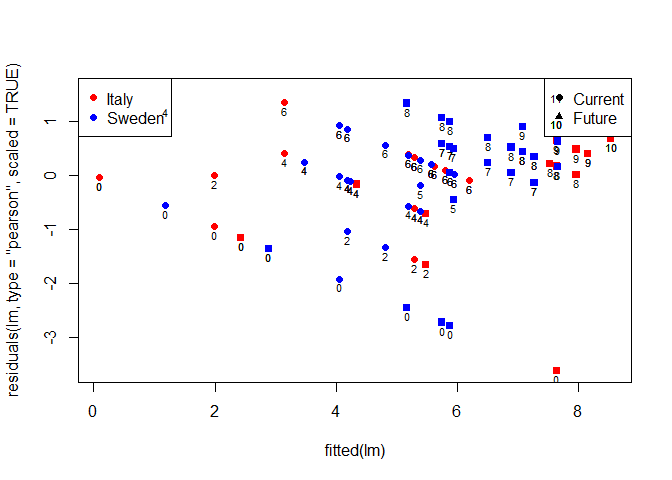<!-- -->

Leaf num 5 weeks into vernalization (note: not included in manuscript)

``` r
# LeafNumber from 08262021 - 5 weeks into vernalization
LN_Vern_lm_21 <- do_lmer(Dat_2021_TwoTrt$LeafNum_08262021)
```

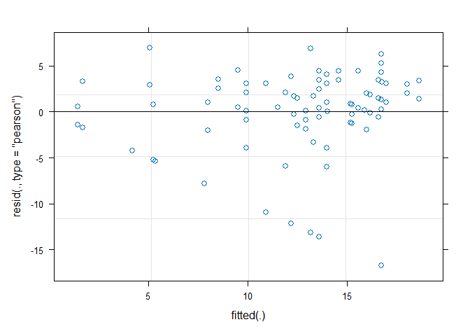<!-- --><!-- -->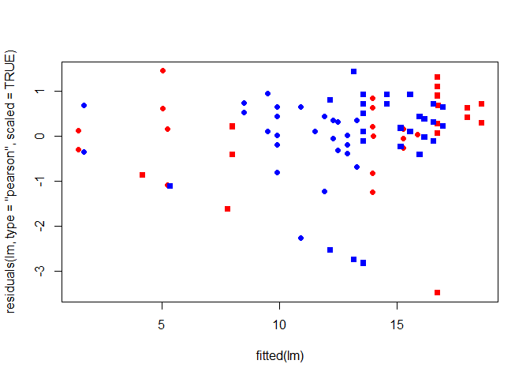<!-- -->

```
## [1] "the number of complete cases is 100"
```

```
## Linear mixed model fit by REML. t-tests use Satterthwaite's method [
## lmerModLmerTest]
## Formula: trait ~ Treatment * Population + (1 | Population:Line)
##    Data: data
## 
## REML criterion at convergence: 624
## 
## Scaled residuals: 
##     Min      1Q  Median      3Q     Max 
## -3.4782 -0.2605  0.1347  0.6310  1.4455 
## 
## Random effects:
##  Groups          Name        Variance Std.Dev.
##  Population:Line (Intercept) 23.1     4.806   
##  Residual                    23.1     4.806   
## Number of obs: 100, groups:  Population:Line, 21
## 
## Fixed effects:
##                        Estimate Std. Error      df t value Pr(>|t|)    
## (Intercept)             12.3952     1.2046 18.5942  10.290 4.13e-09 ***
## Treatment1              -1.6042     0.4905 76.6794  -3.270  0.00161 ** 
## Population1             -0.2598     1.2046 18.5942  -0.216  0.83160    
## Treatment1:Population1   0.2292     0.4905 76.6794   0.467  0.64171    
## ---
## Signif. codes:  0 '***' 0.001 '**' 0.01 '*' 0.05 '.' 0.1 ' ' 1
## 
## Correlation of Fixed Effects:
##             (Intr) Trtmn1 Ppltn1
## Treatment1  0.000               
## Population1 0.244  0.000        
## Trtmnt1:Pp1 0.000  0.200  0.000
```

```
## Computing profile confidence intervals ...
```

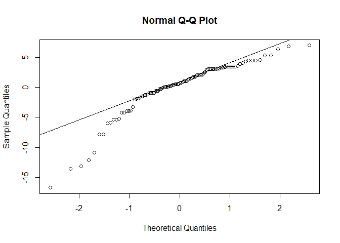<!-- -->

```
##                             2.5 %     97.5 %
## .sig01                  3.0323874  6.7525736
## .sigma                  4.0909672  5.5975373
## (Intercept)            10.0435491 14.7486009
## Treatment1             -2.5653036 -0.6430297
## Population1            -2.6127788  2.0922604
## Treatment1:Population1 -0.7319703  1.1903036
```

``` r
LN_Vern_anov_21 <- do_anov(LN_Vern_lm_21)
```

```
## Type III Analysis of Variance Table with Satterthwaite's method
##                       Sum Sq Mean Sq NumDF  DenDF F value   Pr(>F)   
## Treatment            247.042 247.042     1 76.679 10.6939 0.001611 **
## Population             1.074   1.074     1 18.594  0.0465 0.831602   
## Treatment:Population   5.042   5.042     1 76.679  0.2182 0.641707   
## ---
## Signif. codes:  0 '***' 0.001 '**' 0.01 '*' 0.05 '.' 0.1 ' ' 1
```

``` r
LN_Vern_anov_21$trait <- "LeafNum_9wks"
LN_Vern_means_21 <- as.data.frame(get_table(LN_Vern_lm_21))
```

Leaf num about when bolting started (note: not included in manuscript because not a constant developmental stage)

``` r
# Leaf Num October 4 - picked this day because was about when bolting started but some had already bolted by this day
LN_PostVern_lm_21 <- do_lmer(Dat_2021_TwoTrt$RosetteLeafNum_10042021)
```

<!-- --><!-- --><!-- -->

```
## [1] "the number of complete cases is 86"
```

```
## Linear mixed model fit by REML. t-tests use Satterthwaite's method [
## lmerModLmerTest]
## Formula: trait ~ Treatment * Population + (1 | Population:Line)
##    Data: data
## 
## REML criterion at convergence: 469.1
## 
## Scaled residuals: 
##      Min       1Q   Median       3Q      Max 
## -3.11105 -0.53300 -0.01163  0.57750  2.13867 
## 
## Random effects:
##  Groups          Name        Variance Std.Dev.
##  Population:Line (Intercept)  8.757   2.959   
##  Residual                    10.486   3.238   
## Number of obs: 86, groups:  Population:Line, 21
## 
## Fixed effects:
##                        Estimate Std. Error       df t value Pr(>|t|)    
## (Intercept)            27.32958    0.78550 15.04734  34.792 8.54e-16 ***
## Treatment1             -4.07342    0.36855 62.59267 -11.053 2.38e-16 ***
## Population1            -3.16379    0.78550 15.04734  -4.028  0.00109 ** 
## Treatment1:Population1 -0.07216    0.36855 62.59267  -0.196  0.84541    
## ---
## Signif. codes:  0 '***' 0.001 '**' 0.01 '*' 0.05 '.' 0.1 ' ' 1
## 
## Correlation of Fixed Effects:
##             (Intr) Trtmn1 Ppltn1
## Treatment1  -0.062              
## Population1  0.264 -0.033       
## Trtmnt1:Pp1 -0.033  0.253 -0.062
```

```
## Computing profile confidence intervals ...
```

<!-- -->

```
##                             2.5 %     97.5 %
## .sig01                  1.4705541  4.3801870
## .sigma                  2.7035639  3.8702438
## (Intercept)            25.7534651 28.8407528
## Treatment1             -4.8033806 -3.3553464
## Population1            -4.7075398 -1.6381721
## Treatment1:Population1 -0.7934106  0.6538245
```

``` r
LN_PostVern_anov_21 <- do_anov(LN_PostVern_lm_21)
```

```
## Type III Analysis of Variance Table with Satterthwaite's method
##                       Sum Sq Mean Sq NumDF  DenDF  F value    Pr(>F)    
## Treatment            1281.03 1281.03     1 62.593 122.1611 2.382e-16 ***
## Population            170.12  170.12     1 15.047  16.2226  0.001089 ** 
## Treatment:Population    0.40    0.40     1 62.593   0.0383  0.845411    
## ---
## Signif. codes:  0 '***' 0.001 '**' 0.01 '*' 0.05 '.' 0.1 ' ' 1
```

``` r
LN_PostVern_anov_21$trait <- "LeafNum_14wks"
LN_PostVern_means_21 <- as.data.frame(get_table(LN_PostVern_lm_21))
```


Leaf number at bolting and flower were only done on some plants, not all (bolting only for SW plants and flowering only for 16 plants), so there are no models or figures for these traits.


Leaf number at harvest

``` r
# LN at harvest - from all plants - hard to count at this point in life cycle
LN_harv_lm_21 <- do_lmer(Dat_2021_TwoTrt$RosetteLeafNum)
```

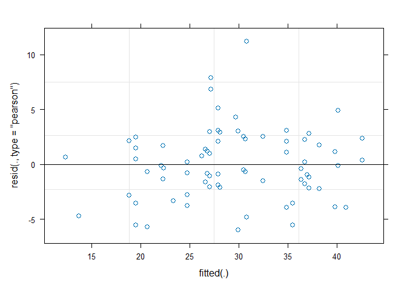<!-- -->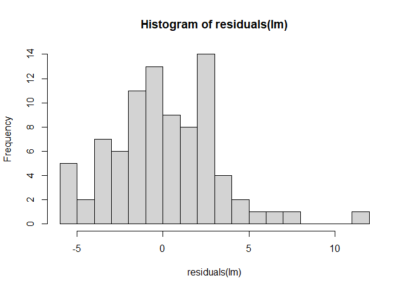<!-- -->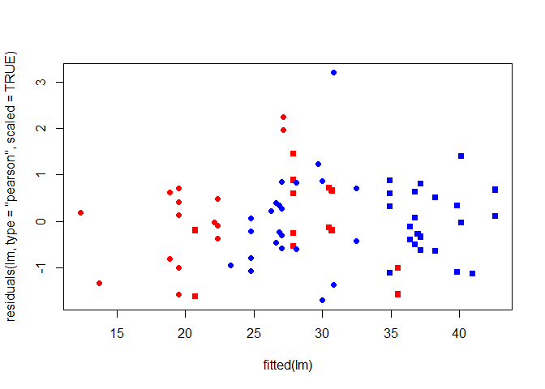<!-- -->

```
## [1] "the number of complete cases is 85"
```

```
## Linear mixed model fit by REML. t-tests use Satterthwaite's method [
## lmerModLmerTest]
## Formula: trait ~ Treatment * Population + (1 | Population:Line)
##    Data: data
## 
## REML criterion at convergence: 482.6
## 
## Scaled residuals: 
##     Min      1Q  Median      3Q     Max 
## -1.7089 -0.5071 -0.0334  0.5976  3.1975 
## 
## Random effects:
##  Groups          Name        Variance Std.Dev.
##  Population:Line (Intercept) 15.95    3.994   
##  Residual                    12.25    3.499   
## Number of obs: 85, groups:  Population:Line, 21
## 
## Fixed effects:
##                        Estimate Std. Error      df t value Pr(>|t|)    
## (Intercept)             28.3584     1.0086 16.5638  28.116 2.05e-15 ***
## Treatment1              -4.6312     0.4016 62.3690 -11.532  < 2e-16 ***
## Population1             -4.3791     1.0086 16.5638  -4.342 0.000469 ***
## Treatment1:Population1   0.4442     0.4016 62.3690   1.106 0.272946    
## ---
## Signif. codes:  0 '***' 0.001 '**' 0.01 '*' 0.05 '.' 0.1 ' ' 1
## 
## Correlation of Fixed Effects:
##             (Intr) Trtmn1 Ppltn1
## Treatment1  -0.053              
## Population1  0.257 -0.034       
## Trtmnt1:Pp1 -0.034  0.245 -0.053
```

```
## Computing profile confidence intervals ...
```

<!-- -->

```
##                             2.5 %    97.5 %
## .sig01                  2.3943057  5.699256
## .sigma                  2.9198477  4.167205
## (Intercept)            26.3547018 30.305366
## Treatment1             -5.4293029 -3.851771
## Population1            -6.3669344 -2.424450
## Treatment1:Population1 -0.3458082  1.229091
```

``` r
LN_harv_anov_21 <- do_anov(LN_harv_lm_21)
```

```
## Type III Analysis of Variance Table with Satterthwaite's method
##                       Sum Sq Mean Sq NumDF  DenDF  F value    Pr(>F)    
## Treatment            1628.54 1628.54     1 62.369 132.9939 < 2.2e-16 ***
## Population            230.83  230.83     1 16.564  18.8505 0.0004686 ***
## Treatment:Population   14.98   14.98     1 62.369   1.2234 0.2729462    
## ---
## Signif. codes:  0 '***' 0.001 '**' 0.01 '*' 0.05 '.' 0.1 ' ' 1
```

``` r
LN_harv_anov_21$trait <- "LeafNum_harvest"
LN_harv_emmeans_21 <- get_table(LN_harv_lm_21)
LN_harv_means_21 <- as.data.frame(LN_harv_emmeans_21)
LN_harv_pairs_21 <- as.data.frame(pairs(LN_harv_emmeans_21))
LN_harv_pairs_21$trait <- "LeafNum_harvest"
```

### Biomass

Rosette biomass

``` r
# dry rosette biomass
Ros_lm_21 <- do_lmer(Dat_2021_TwoTrt$l10_DryRosG)
```

<!-- --><!-- --><!-- -->

```
## [1] "the number of complete cases is 83"
```

```
## Linear mixed model fit by REML. t-tests use Satterthwaite's method [
## lmerModLmerTest]
## Formula: trait ~ Treatment * Population + (1 | Population:Line)
##    Data: data
## 
## REML criterion at convergence: -32.5
## 
## Scaled residuals: 
##      Min       1Q   Median       3Q      Max 
## -2.32003 -0.48565  0.06503  0.50362  2.11980 
## 
## Random effects:
##  Groups          Name        Variance Std.Dev.
##  Population:Line (Intercept) 0.04629  0.2152  
##  Residual                    0.01826  0.1351  
## Number of obs: 83, groups:  Population:Line, 21
## 
## Fixed effects:
##                        Estimate Std. Error       df t value Pr(>|t|)    
## (Intercept)            -0.81541    0.05176 14.88376 -15.752 1.09e-10 ***
## Treatment1              0.12474    0.01573 57.45863   7.929 8.56e-11 ***
## Population1            -0.11676    0.05176 14.88376  -2.256   0.0396 *  
## Treatment1:Population1  0.01364    0.01573 57.45863   0.867   0.3894    
## ---
## Signif. codes:  0 '***' 0.001 '**' 0.01 '*' 0.05 '.' 0.1 ' ' 1
## 
## Correlation of Fixed Effects:
##             (Intr) Trtmn1 Ppltn1
## Treatment1  -0.048              
## Population1  0.243 -0.023       
## Trtmnt1:Pp1 -0.023  0.224 -0.048
```

```
## Computing profile confidence intervals ...
```

<!-- -->

```
##                              2.5 %      97.5 %
## .sig01                  0.13099090  0.30303367
## .sigma                  0.11221853  0.16274272
## (Intercept)            -0.91853109 -0.71548607
## Treatment1              0.09283174  0.15512139
## Population1            -0.21915936 -0.01646753
## Treatment1:Population1 -0.01782677  0.04418726
```

``` r
Ros_anov_21 <- do_anov(Ros_lm_21)
```

```
## Type III Analysis of Variance Table with Satterthwaite's method
##                       Sum Sq Mean Sq NumDF  DenDF F value    Pr(>F)    
## Treatment            1.14817 1.14817     1 57.459 62.8714 8.555e-11 ***
## Population           0.09291 0.09291     1 14.884  5.0876   0.03959 *  
## Treatment:Population 0.01374 0.01374     1 57.459  0.7522   0.38939    
## ---
## Signif. codes:  0 '***' 0.001 '**' 0.01 '*' 0.05 '.' 0.1 ' ' 1
```

``` r
Ros_anov_21$trait <- "l10_DryRosG"
Ros_emmeans_21 <- get_table_bt(Ros_lm_21)
Ros_means_21 <- as.data.frame(Ros_emmeans_21)
Ros_pairs_21 <- as.data.frame(pairs(Ros_emmeans_21))
Ros_pairs_21$trait <- "l10_DryRosG"
#no interaction

## check how it compares to the sqr transformed
#Ros_lm_21SR <- do_lmer(Dat_2021_TwoTrt$SQR_DryRosG)
#Ros_anov_21SR <- do_anov(Ros_lm_21SR)
#Ros_anov_21SR$trait <- "SQR_DryRosG"
#Ros_means_21SR <- get_table_bt(Ros_lm_21SR)
## commented out b/c no difference in signficance levels.
```

Reproductive biomass

``` r
# dry reproductive biomass
Repro_lm_21 <- do_lmer(Dat_2021_TwoTrt$l10_DryReproG)
```

<!-- --><!-- -->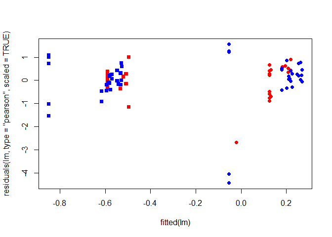<!-- -->

```
## [1] "the number of complete cases is 83"
```

```
## Linear mixed model fit by REML. t-tests use Satterthwaite's method [
## lmerModLmerTest]
## Formula: trait ~ Treatment * Population + (1 | Population:Line)
##    Data: data
## 
## REML criterion at convergence: 16.2
## 
## Scaled residuals: 
##     Min      1Q  Median      3Q     Max 
## -4.4254 -0.2092  0.1804  0.4597  1.5550 
## 
## Random effects:
##  Groups          Name        Variance Std.Dev.
##  Population:Line (Intercept) 0.01379  0.1174  
##  Residual                    0.04880  0.2209  
## Number of obs: 83, groups:  Population:Line, 21
## 
## Fixed effects:
##                        Estimate Std. Error       df t value Pr(>|t|)    
## (Intercept)            -0.20172    0.03813 19.77693  -5.290 3.67e-05 ***
## Treatment1              0.37715    0.02519 67.38359  14.970  < 2e-16 ***
## Population1            -0.01000    0.03813 19.77693  -0.262    0.796    
## Treatment1:Population1 -0.02013    0.02519 67.38359  -0.799    0.427    
## ---
## Signif. codes:  0 '***' 0.001 '**' 0.01 '*' 0.05 '.' 0.1 ' ' 1
## 
## Correlation of Fixed Effects:
##             (Intr) Trtmn1 Ppltn1
## Treatment1  -0.055              
## Population1  0.263 -0.049       
## Trtmnt1:Pp1 -0.049  0.216 -0.055
```

```
## Computing profile confidence intervals ...
```

<!-- -->

```
##                              2.5 %      97.5 %
## .sig01                  0.04813853  0.18930847
## .sigma                  0.18460378  0.25951873
## (Intercept)            -0.27637168 -0.12774696
## Treatment1              0.32733389  0.42585366
## Population1            -0.08736629  0.06341489
## Treatment1:Population1 -0.06984545  0.02862048
```

``` r
Repro_anov_21 <- do_anov(Repro_lm_21)
```

```
## Type III Analysis of Variance Table with Satterthwaite's method
##                       Sum Sq Mean Sq NumDF  DenDF  F value Pr(>F)    
## Treatment            10.9358 10.9358     1 67.384 224.1077 <2e-16 ***
## Population            0.0034  0.0034     1 19.777   0.0688 0.7959    
## Treatment:Population  0.0312  0.0312     1 67.384   0.6385 0.4270    
## ---
## Signif. codes:  0 '***' 0.001 '**' 0.01 '*' 0.05 '.' 0.1 ' ' 1
```

``` r
Repro_anov_21$trait <- "l10_DryReproG"
Repro_emmeans_21 <- get_table_bt(Repro_lm_21)
Repro_means_21 <- as.data.frame(Repro_emmeans_21)
Repro_pairs_21 <- as.data.frame(pairs(Repro_emmeans_21))
Repro_pairs_21$trait <- "l10_DryReproG"
```


Above ground biomass (rosette + reproductive) (note: not included in final paper because so similar to reproductive)


``` r
# dry above ground biomass (ros + repro)
AG_lm_21 <- do_lmer(Dat_2021_TwoTrt$l10_AG_biomass)
```

<!-- --><!-- --><!-- -->

```
## [1] "the number of complete cases is 81"
```

```
## Linear mixed model fit by REML. t-tests use Satterthwaite's method [
## lmerModLmerTest]
## Formula: trait ~ Treatment * Population + (1 | Population:Line)
##    Data: data
## 
## REML criterion at convergence: -20.8
## 
## Scaled residuals: 
##     Min      1Q  Median      3Q     Max 
## -3.8186 -0.2876  0.1331  0.5642  1.3681 
## 
## Random effects:
##  Groups          Name        Variance Std.Dev.
##  Population:Line (Intercept) 0.01124  0.1060  
##  Residual                    0.02904  0.1704  
## Number of obs: 81, groups:  Population:Line, 21
## 
## Fixed effects:
##                         Estimate Std. Error        df t value Pr(>|t|)    
## (Intercept)            -0.083573   0.032314 11.281868  -2.586   0.0249 *  
## Treatment1              0.322743   0.019665 56.420512  16.412   <2e-16 ***
## Population1            -0.036682   0.032314 11.281868  -1.135   0.2799    
## Treatment1:Population1 -0.006954   0.019665 56.420512  -0.354   0.7250    
## ---
## Signif. codes:  0 '***' 0.001 '**' 0.01 '*' 0.05 '.' 0.1 ' ' 1
## 
## Correlation of Fixed Effects:
##             (Intr) Trtmn1 Ppltn1
## Treatment1  -0.057              
## Population1  0.247 -0.043       
## Trtmnt1:Pp1 -0.043  0.196 -0.057
```

```
## Computing profile confidence intervals ...
```

<!-- -->

```
##                              2.5 %      97.5 %
## .sig01                  0.02402241  0.17986084
## .sigma                  0.14066799  0.20509850
## (Intercept)            -0.14934651 -0.02158573
## Treatment1              0.28250753  0.36054440
## Population1            -0.10397576  0.02516996
## Treatment1:Population1 -0.04662350  0.03105821
```

``` r
AG_anov_21 <- do_anov(AG_lm_21)
```

```
## Type III Analysis of Variance Table with Satterthwaite's method
##                      Sum Sq Mean Sq NumDF  DenDF  F value Pr(>F)    
## Treatment            7.8223  7.8223     1 56.421 269.3511 <2e-16 ***
## Population           0.0374  0.0374     1 11.282   1.2886 0.2799    
## Treatment:Population 0.0036  0.0036     1 56.421   0.1250 0.7250    
## ---
## Signif. codes:  0 '***' 0.001 '**' 0.01 '*' 0.05 '.' 0.1 ' ' 1
```

``` r
AG_anov_21$trait <- "l10_AG_biomass"
AG_means_21 <- as.data.frame(get_table_bt(AG_lm_21))
```

Skipping dry root biomass because only have for a few plants. Also skipping root to shoot for the same reason.

Above ground biomass allocation (repro/ros)

``` r
# reproductive biomass divided by rosette biomass (i.e., above ground biomass allocation)
RR_lm_21 <- do_lmer(Dat_2021_TwoTrt$l10_R_to_R)
```

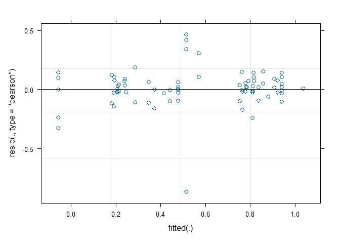<!-- -->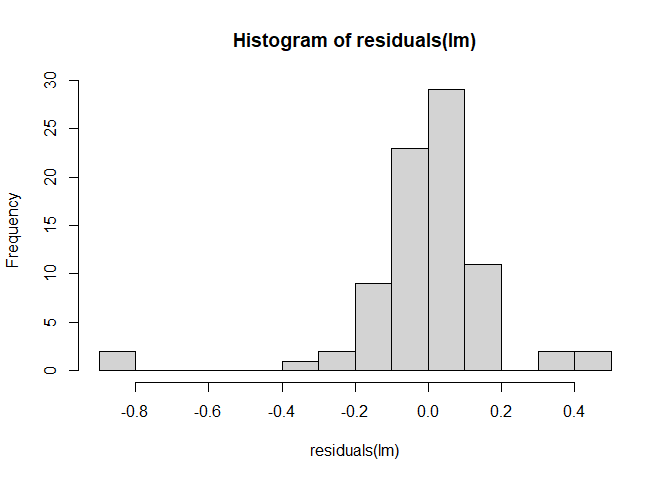<!-- -->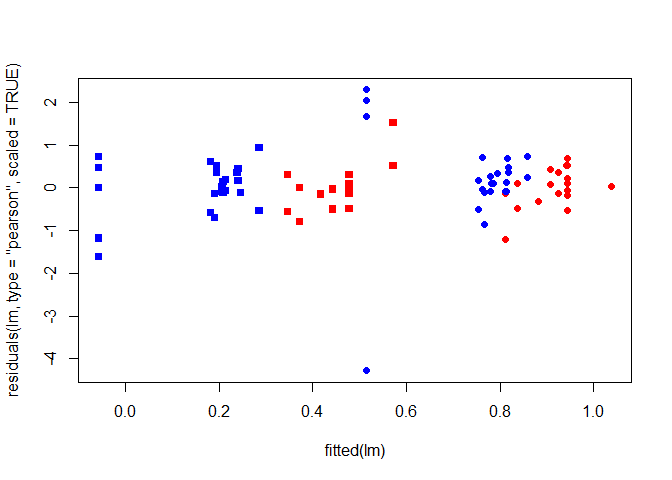<!-- -->

```
## [1] "the number of complete cases is 81"
```

```
## Linear mixed model fit by REML. t-tests use Satterthwaite's method [
## lmerModLmerTest]
## Formula: trait ~ Treatment * Population + (1 | Population:Line)
##    Data: data
## 
## REML criterion at convergence: 3.7
## 
## Scaled residuals: 
##     Min      1Q  Median      3Q     Max 
## -4.2794 -0.1430  0.0724  0.3559  2.2872 
## 
## Random effects:
##  Groups          Name        Variance Std.Dev.
##  Population:Line (Intercept) 0.01253  0.1120  
##  Residual                    0.04114  0.2028  
## Number of obs: 81, groups:  Population:Line, 21
## 
## Fixed effects:
##                        Estimate Std. Error       df t value Pr(>|t|)    
## (Intercept)             0.58273    0.03597 23.48758  16.200 3.03e-14 ***
## Treatment1              0.25919    0.02335 67.96255  11.101  < 2e-16 ***
## Population1             0.09539    0.03597 23.48758   2.652   0.0141 *  
## Treatment1:Population1 -0.02667    0.02335 67.96255  -1.142   0.2574    
## ---
## Signif. codes:  0 '***' 0.001 '**' 0.01 '*' 0.05 '.' 0.1 ' ' 1
## 
## Correlation of Fixed Effects:
##             (Intr) Trtmn1 Ppltn1
## Treatment1  -0.057              
## Population1  0.246 -0.045       
## Trtmnt1:Pp1 -0.045  0.195 -0.057
```

```
## Computing profile confidence intervals ...
```

<!-- -->

```
##                              2.5 %     97.5 %
## .sig01                  0.05442927 0.17132197
## .sigma                  0.16949169 0.23774067
## (Intercept)             0.51344796 0.65409911
## Treatment1              0.21376763 0.30469549
## Population1             0.02456477 0.16476723
## Treatment1:Population1 -0.07226191 0.01867931
```

``` r
RR_anov_21 <- do_anov(RR_lm_21)
```

```
## Type III Analysis of Variance Table with Satterthwaite's method
##                      Sum Sq Mean Sq NumDF  DenDF  F value  Pr(>F)    
## Treatment            5.0694  5.0694     1 67.963 123.2345 < 2e-16 ***
## Population           0.2893  0.2893     1 23.488   7.0321 0.01411 *  
## Treatment:Population 0.0537  0.0537     1 67.963   1.3048 0.25735    
## ---
## Signif. codes:  0 '***' 0.001 '**' 0.01 '*' 0.05 '.' 0.1 ' ' 1
```

``` r
RR_anov_21$trait <- "l10_Repro_to_Ros"
RR_emmeans_21 <- get_table_bt(RR_lm_21)
RR_means_21 <- as.data.frame(RR_emmeans_21)
RR_pairs_21 <- as.data.frame(pairs(RR_emmeans_21))
RR_pairs_21$trait <- "l10_Repro_to_Ros"
```


### Plant Structure
branches and height. Branch structure is about damage and was skipped.

Num lateral branches

``` r
# number of lateral branches
LatBranch_lm_21 <- do_lmer(Dat_2021_TwoTrt$LatBranches)
```

<!-- --><!-- --><!-- -->

```
## [1] "the number of complete cases is 81"
```

```
## Linear mixed model fit by REML. t-tests use Satterthwaite's method [
## lmerModLmerTest]
## Formula: trait ~ Treatment * Population + (1 | Population:Line)
##    Data: data
## 
## REML criterion at convergence: 283.7
## 
## Scaled residuals: 
##      Min       1Q   Median       3Q      Max 
## -2.82972 -0.41908 -0.05185  0.48440  2.00082 
## 
## Random effects:
##  Groups          Name        Variance Std.Dev.
##  Population:Line (Intercept) 1.774    1.332   
##  Residual                    1.198    1.095   
## Number of obs: 81, groups:  Population:Line, 21
## 
## Fixed effects:
##                        Estimate Std. Error      df t value Pr(>|t|)    
## (Intercept)              8.7811     0.3325 15.4039  26.409 3.01e-14 ***
## Treatment1              -0.4042     0.1278 56.6333  -3.162  0.00252 ** 
## Population1             -0.5285     0.3325 15.4039  -1.589  0.13227    
## Treatment1:Population1  -0.6014     0.1278 56.6333  -4.705 1.68e-05 ***
## ---
## Signif. codes:  0 '***' 0.001 '**' 0.01 '*' 0.05 '.' 0.1 ' ' 1
## 
## Correlation of Fixed Effects:
##             (Intr) Trtmn1 Ppltn1
## Treatment1  -0.052              
## Population1  0.254 -0.031       
## Trtmnt1:Pp1 -0.031  0.205 -0.052
```

```
## Computing profile confidence intervals ...
```

<!-- -->

```
##                             2.5 %     97.5 %
## .sig01                  0.7853967  1.9069417
## .sigma                  0.9063581  1.3172171
## (Intercept)             8.1239363  9.4253009
## Treatment1             -0.6601496 -0.1565446
## Population1            -1.1807113  0.1191597
## Treatment1:Population1 -0.8526191 -0.3506372
```

``` r
LatBranch_anov_21 <- do_anov(LatBranch_lm_21)
```

```
## Type III Analysis of Variance Table with Satterthwaite's method
##                      Sum Sq Mean Sq NumDF  DenDF F value    Pr(>F)    
## Treatment            11.981  11.981     1 56.633  9.9997  0.002516 ** 
## Population            3.027   3.027     1 15.404  2.5264  0.132266    
## Treatment:Population 26.524  26.524     1 56.633 22.1372 1.676e-05 ***
## ---
## Signif. codes:  0 '***' 0.001 '**' 0.01 '*' 0.05 '.' 0.1 ' ' 1
```

``` r
LatBranch_anov_21$trait <- "Lateral Branches"
LatBranch_emmeans_21 <- get_table(LatBranch_lm_21)
LatBranch_means_21 <- as.data.frame(LatBranch_emmeans_21)
LatBranch_pairs_21 <- as.data.frame(pairs(LatBranch_emmeans_21))
LatBranch_pairs_21$trait <- "Lateral Branches"
```

Num primary stalks

``` r
# number of primary stalks
PrimStalks_lm_21 <- do_lmer(Dat_2021_TwoTrt$PrimaryStalks)
```

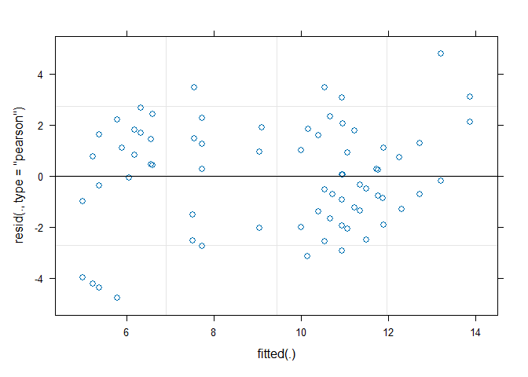<!-- --><!-- -->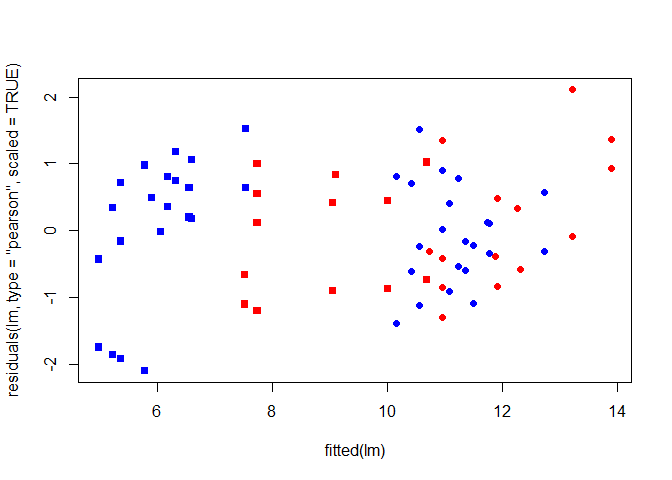<!-- -->

```
## [1] "the number of complete cases is 81"
```

```
## Linear mixed model fit by REML. t-tests use Satterthwaite's method [
## lmerModLmerTest]
## Formula: trait ~ Treatment * Population + (1 | Population:Line)
##    Data: data
## 
## REML criterion at convergence: 376
## 
## Scaled residuals: 
##     Min      1Q  Median      3Q     Max 
## -2.1000 -0.6171  0.1159  0.7020  2.1086 
## 
## Random effects:
##  Groups          Name        Variance Std.Dev.
##  Population:Line (Intercept) 1.535    1.239   
##  Residual                    5.172    2.274   
## Number of obs: 81, groups:  Population:Line, 21
## 
## Fixed effects:
##                        Estimate Std. Error      df t value Pr(>|t|)    
## (Intercept)              9.5160     0.3978 18.1477  23.920 3.55e-15 ***
## Treatment1               2.0955     0.2616 63.7311   8.009 3.19e-11 ***
## Population1              1.0178     0.3978 18.1477   2.558   0.0197 *  
## Treatment1:Population1  -0.4921     0.2616 63.7311  -1.881   0.0646 .  
## ---
## Signif. codes:  0 '***' 0.001 '**' 0.01 '*' 0.05 '.' 0.1 ' ' 1
## 
## Correlation of Fixed Effects:
##             (Intr) Trtmn1 Ppltn1
## Treatment1  -0.064              
## Population1  0.263 -0.038       
## Trtmnt1:Pp1 -0.038  0.196 -0.064
```

```
## Computing profile confidence intervals ...
```

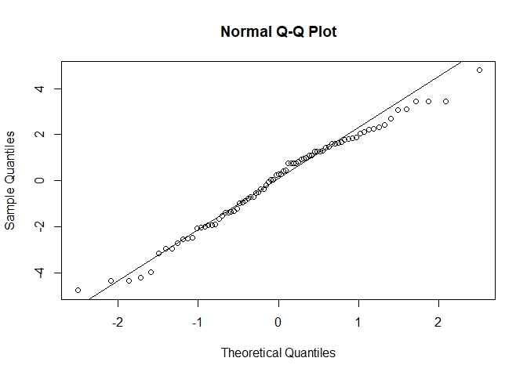<!-- -->

```
##                             2.5 %      97.5 %
## .sig01                  0.3316510  1.98113053
## .sigma                  1.8933161  2.69472902
## (Intercept)             8.7393175 10.28960784
## Treatment1              1.5825550  2.60516643
## Population1             0.2479346  1.79932248
## Treatment1:Population1 -1.0012379  0.02152321
```

``` r
PrimStalks_anov_21 <- do_anov(PrimStalks_lm_21)
```

```
## Type III Analysis of Variance Table with Satterthwaite's method
##                      Sum Sq Mean Sq NumDF  DenDF F value    Pr(>F)    
## Treatment            331.79  331.79     1 63.731 64.1496 3.189e-11 ***
## Population            33.85   33.85     1 18.148  6.5452   0.01967 *  
## Treatment:Population  18.29   18.29     1 63.731  3.5370   0.06458 .  
## ---
## Signif. codes:  0 '***' 0.001 '**' 0.01 '*' 0.05 '.' 0.1 ' ' 1
```

``` r
PrimStalks_anov_21$trait <- "Primary Stalks"
PrimStalks_emmeans_21 <- get_table(PrimStalks_lm_21)
PrimStalks_means_21 <- as.data.frame(PrimStalks_emmeans_21)
PrimStalks_pairs_21 <- as.data.frame(pairs(PrimStalks_emmeans_21))
PrimStalks_pairs_21$trait <- "Primary Stalks"
```

Height main stalk

``` r
# height of main stalk (cm)
height_lm_21 <- do_lmer(Dat_2021_TwoTrt$Height_cm)
```

<!-- --><!-- --><!-- -->

```
## [1] "the number of complete cases is 80"
```

```
## Linear mixed model fit by REML. t-tests use Satterthwaite's method [
## lmerModLmerTest]
## Formula: trait ~ Treatment * Population + (1 | Population:Line)
##    Data: data
## 
## REML criterion at convergence: 509.3
## 
## Scaled residuals: 
##     Min      1Q  Median      3Q     Max 
## -2.5012 -0.5269  0.0902  0.6035  1.6876 
## 
## Random effects:
##  Groups          Name        Variance Std.Dev.
##  Population:Line (Intercept) 17.19    4.146   
##  Residual                    28.79    5.366   
## Number of obs: 80, groups:  Population:Line, 21
## 
## Fixed effects:
##                        Estimate Std. Error      df t value Pr(>|t|)    
## (Intercept)             43.8643     1.1649 12.6077  37.655 2.46e-14 ***
## Treatment1              18.3650     0.6298 54.3700  29.160  < 2e-16 ***
## Population1             -2.6748     1.1649 12.6077  -2.296   0.0395 *  
## Treatment1:Population1  -1.6231     0.6298 54.3700  -2.577   0.0127 *  
## ---
## Signif. codes:  0 '***' 0.001 '**' 0.01 '*' 0.05 '.' 0.1 ' ' 1
## 
## Correlation of Fixed Effects:
##             (Intr) Trtmn1 Ppltn1
## Treatment1  -0.076              
## Population1  0.270 -0.053       
## Trtmnt1:Pp1 -0.053  0.221 -0.076
```

```
## Computing profile confidence intervals ...
```

<!-- -->

```
##                            2.5 %     97.5 %
## .sig01                  1.196890  6.5072091
## .sigma                  4.423567  6.5339442
## (Intercept)            41.529862 46.1075269
## Treatment1             17.110760 19.5935083
## Population1            -4.996172 -0.4267735
## Treatment1:Population1 -2.886587 -0.3998313
```

``` r
height_anov_21 <- do_anov(height_lm_21)
```

```
## Type III Analysis of Variance Table with Satterthwaite's method
##                       Sum Sq Mean Sq NumDF  DenDF  F value  Pr(>F)    
## Treatment            24482.8 24482.8     1 54.370 850.3263 < 2e-16 ***
## Population             151.8   151.8     1 12.608   5.2724 0.03951 *  
## Treatment:Population   191.2   191.2     1 54.370   6.6422 0.01270 *  
## ---
## Signif. codes:  0 '***' 0.001 '**' 0.01 '*' 0.05 '.' 0.1 ' ' 1
```

``` r
height_anov_21$trait <- "Height (cm)"
height_emmeans_21 <- get_table(height_lm_21)
height_means_21 <- as.data.frame(height_emmeans_21)
height_pairs_21 <- as.data.frame(pairs(height_emmeans_21))
height_pairs_21$trait <- "Height (cm)"
```


### Fitness

Fruit Count: (9/20/2024) using Basia's fruit counts


``` r
# number fruits on plant
fruit_lm_21 <- do_lmer(Dat_2021_TwoTrt$FruitCount_BL)
```

<!-- --><!-- --><!-- -->

```
## [1] "the number of complete cases is 96"
```

```
## Linear mixed model fit by REML. t-tests use Satterthwaite's method [
## lmerModLmerTest]
## Formula: trait ~ Treatment * Population + (1 | Population:Line)
##    Data: data
## 
## REML criterion at convergence: 1263.3
## 
## Scaled residuals: 
##      Min       1Q   Median       3Q      Max 
## -2.95586 -0.32149  0.04401  0.46782  2.63198 
## 
## Random effects:
##  Groups          Name        Variance Std.Dev.
##  Population:Line (Intercept) 11931    109.2   
##  Residual                    36911    192.1   
## Number of obs: 96, groups:  Population:Line, 21
## 
## Fixed effects:
##                        Estimate Std. Error      df t value Pr(>|t|)    
## (Intercept)             376.023     32.365  17.041  11.618  1.6e-09 ***
## Treatment1              257.257     19.887  71.888  12.936  < 2e-16 ***
## Population1              37.728     32.365  17.041   1.166    0.260    
## Treatment1:Population1    7.543     19.887  71.888   0.379    0.706    
## ---
## Signif. codes:  0 '***' 0.001 '**' 0.01 '*' 0.05 '.' 0.1 ' ' 1
## 
## Correlation of Fixed Effects:
##             (Intr) Trtmn1 Ppltn1
## Treatment1  0.000               
## Population1 0.239  0.000        
## Trtmnt1:Pp1 0.000  0.167  0.000
```

```
## Computing profile confidence intervals ...
```

<!-- -->

```
##                            2.5 %    97.5 %
## .sig01                  29.98821 169.56497
## .sigma                 162.77760 225.24820
## (Intercept)            312.86468 439.33735
## Treatment1             218.25449 296.25980
## Population1            -25.49054 100.97883
## Treatment1:Population1 -31.45980  46.54551
```

``` r
fruit_anov_21 <- do_anov(fruit_lm_21)
```

```
## Type III Analysis of Variance Table with Satterthwaite's method
##                       Sum Sq Mean Sq NumDF  DenDF  F value Pr(>F)    
## Treatment            6176916 6176916     1 71.888 167.3450 <2e-16 ***
## Population             50158   50158     1 17.041   1.3589 0.2598    
## Treatment:Population    5310    5310     1 71.888   0.1439 0.7056    
## ---
## Signif. codes:  0 '***' 0.001 '**' 0.01 '*' 0.05 '.' 0.1 ' ' 1
```

``` r
fruit_anov_21$trait <- "FruitNum"
fruit_emmeans_21 <- get_table(fruit_lm_21)
fruit_means_21 <- as.data.frame(fruit_emmeans_21)
fruit_pairs_21 <- as.data.frame(pairs(fruit_emmeans_21))
fruit_pairs_21$trait <- "FruitNum"
```

Code to see if a hurdle model changes results since there is a pattern of zero inflation. Not evaluated because not used in the final manuscript.

``` r
# try a hurdle model
library(pscl)
mod.hurdle <- hurdle(FruitCount_BL ~ Treatment * Population  , data = Dat_2021_TwoTrt, dist = "poisson", zero.dist = "binomial") 
summary(mod.hurdle)
hist(residuals(mod.hurdle), breaks = 15) # decent
plot(fitted(mod.hurdle), residuals(mod.hurdle, type = "pearson", scaled = TRUE)) # this looks very similar


mod.zeroinf <- zeroinfl(FruitCount_BL ~ Treatment * Population  , data = Dat_2021_TwoTrt, dist = "poisson")
summary(mod.zeroinf)

#remove zeros from my initial model
mod.nozero <- lmer(FruitCount_BL ~ Treatment * Population + (1|Population:Line) , data = Dat_2021_TwoTrt[Dat_2021_TwoTrt$FruitCount_BL >0, ],contrasts = list(Treatment=contr.sum, Population = contr.sum))
summary(mod.nozero)
hist(residuals(mod.nozero), breaks = 15) # this is more normal
plot(fitted(mod.nozero), residuals(mod.nozero, type = "pearson", scaled = TRUE)) # this looks very similar

# try to get random component back in there
library(glmmTMB)
mod.zeroinf2 <- glmmTMB(FruitCount_BL ~ Treatment * Population + (1|Population:Line), data = Dat_2021_TwoTrt, ziformula = ~Treatment * Population, family = poisson)
summary(mod.zeroinf2)
mod.poisson <- glmmTMB(FruitCount_BL ~ Treatment * Population + (1|Population:Line), data = Dat_2021_TwoTrt, ziformula = ~0, family = poisson)
summary(mod.poisson)
hist(residuals(mod.poisson), breaks = 15) # okay
plot(fitted(mod.poisson), residuals(mod.poisson, type = "pearson"))
plot(fitted(fruit_lm_21), residuals(fruit_lm_21, type = "pearson"))
# okay, so if I fit a poisson model is really where the changes happen, not for adding in the zero inflated component


# get emmeans from the poisson
mod.poisson_emmeans <- get_table(mod.poisson)
mod.poisson_means <- as.data.frame(mod.poisson_emmeans)
mod.poisson_pairs <- as.data.frame(pairs(mod.poisson_emmeans))
mod.poisson_pairs$trait <- "FruitNumP_Pois"

# tester fig
ggplot(data = mod.poisson_means, aes(x = Treatment, y = rate)) +
  geom_point(aes(col=Population, shape = Population), size = 2, position = position_dodge(width = 0.3), show.legend = TRUE) +
  geom_errorbar(aes(ymin=asymp.LCL, ymax = asymp.UCL, col = Population), width = 0.1, size = 0.8, position = position_dodge(width = 0.3), show.legend = TRUE)+
  geom_line(aes(group = Population, col = Population), size = 1, position = position_dodge(width = 0.3))+ 
  labs(y="Fruit Count Poisson Model (rate)", 
      x="Treatment")+
  scale_color_manual(name = "Population",
                     labels = c("IT", "SW"),
                     values = c("#CC79A7", "#009E73"))+
  scale_x_discrete(expand = c(0.6,0))


# zero inflated poisson
mod.zeroinf2_emmeans <- get_table(mod.zeroinf2)
mod.zeroinf2_means <- as.data.frame(mod.zeroinf2_emmeans)
mod.zeroinf2_pairs <- as.data.frame(pairs(mod.zeroinf2_emmeans))
mod.zeroinf2_pairs$trait <- "FruitNumP_PoisZI"

# tester fig
ggplot(data = mod.zeroinf2_means, aes(x = Treatment, y = rate)) +
  geom_point(aes(col=Population, shape = Population), size = 2, position = position_dodge(width = 0.3), show.legend = TRUE) +
  geom_errorbar(aes(ymin=asymp.LCL, ymax = asymp.UCL, col = Population), width = 0.1, size = 0.8, position = position_dodge(width = 0.3), show.legend = TRUE)+
  geom_line(aes(group = Population, col = Population), size = 1, position = position_dodge(width = 0.3))+ 
  labs(y="Fruit Count Poisson ZI Model (rate)", 
      x="Treatment")+
  scale_color_manual(name = "Population",
                     labels = c("IT", "SW"),
                     values = c("#CC79A7", "#009E73"))+
  scale_x_discrete(expand = c(0.6,0))
```

Average weight of a seed (collected seed weight / count of collected seeds)

``` r
# weight of collected seeds - take weight divided by number of seeds counted
AvSeedWt_lm_21 <- do_lmer(Dat_2021_TwoTrt$AvgSeedWt)
```

<!-- --><!-- --><!-- -->

```
## [1] "the number of complete cases is 78"
```

```
## Linear mixed model fit by REML. t-tests use Satterthwaite's method [
## lmerModLmerTest]
## Formula: trait ~ Treatment * Population + (1 | Population:Line)
##    Data: data
## 
## REML criterion at convergence: -584.9
## 
## Scaled residuals: 
##      Min       1Q   Median       3Q      Max 
## -2.27837 -0.46170 -0.02911  0.37446  3.05478 
## 
## Random effects:
##  Groups          Name        Variance  Std.Dev.
##  Population:Line (Intercept) 2.218e-06 0.001489
##  Residual                    1.545e-05 0.003931
## Number of obs: 78, groups:  Population:Line, 21
## 
## Fixed effects:
##                          Estimate Std. Error         df t value Pr(>|t|)    
## (Intercept)             0.0252961  0.0005897 12.5741046  42.899 5.15e-15 ***
## Treatment1              0.0004029  0.0004562 59.2648244   0.883  0.38080    
## Population1            -0.0019567  0.0005897 12.5741046  -3.318  0.00578 ** 
## Treatment1:Population1 -0.0004111  0.0004562 59.2648244  -0.901  0.37116    
## ---
## Signif. codes:  0 '***' 0.001 '**' 0.01 '*' 0.05 '.' 0.1 ' ' 1
## 
## Correlation of Fixed Effects:
##             (Intr) Trtmn1 Ppltn1
## Treatment1  -0.076              
## Population1  0.227 -0.026       
## Trtmnt1:Pp1 -0.026  0.158 -0.076
```

```
## Computing profile confidence intervals ...
```

<!-- -->

```
##                                2.5 %        97.5 %
## .sig01                  0.0000000000  0.0029356393
## .sigma                  0.0032494688  0.0046958587
## (Intercept)             0.0240911788  0.0264255212
## Treatment1             -0.0004819081  0.0013091426
## Population1            -0.0032385517 -0.0007800292
## Treatment1:Population1 -0.0013185254  0.0004727017
```

``` r
AvSeedWt_anov_21 <- do_anov(AvSeedWt_lm_21)
```

```
## Type III Analysis of Variance Table with Satterthwaite's method
##                          Sum Sq    Mean Sq NumDF  DenDF F value  Pr(>F)   
## Treatment            1.2048e-05 1.2048e-05     1 59.265  0.7797 0.38080   
## Population           1.7015e-04 1.7015e-04     1 12.574 11.0117 0.00578 **
## Treatment:Population 1.2548e-05 1.2548e-05     1 59.265  0.8121 0.37116   
## ---
## Signif. codes:  0 '***' 0.001 '**' 0.01 '*' 0.05 '.' 0.1 ' ' 1
```

``` r
AvSeedWt_anov_21$trait <- "Average Seed Wt"
AvSeedWt_emmeans_21 <- get_table(AvSeedWt_lm_21)
AvSeedWt_means_21 <- as.data.frame(AvSeedWt_emmeans_21)
AvSeedWt_pairs_21 <- as.data.frame(pairs(AvSeedWt_emmeans_21))
AvSeedWt_pairs_21$trait <- "Average Seed Wt"
```

average Seed number per fruit -

``` r
# number seeds from collected fruits
seeds_lm_21 <- do_lmer(Dat_2021_TwoTrt$l10_AvgSeedNum)
```

```
## boundary (singular) fit: see help('isSingular')
```

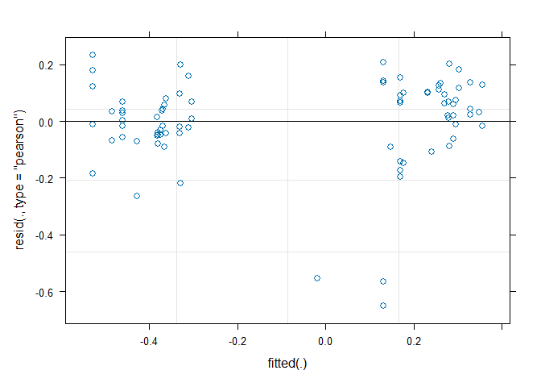<!-- -->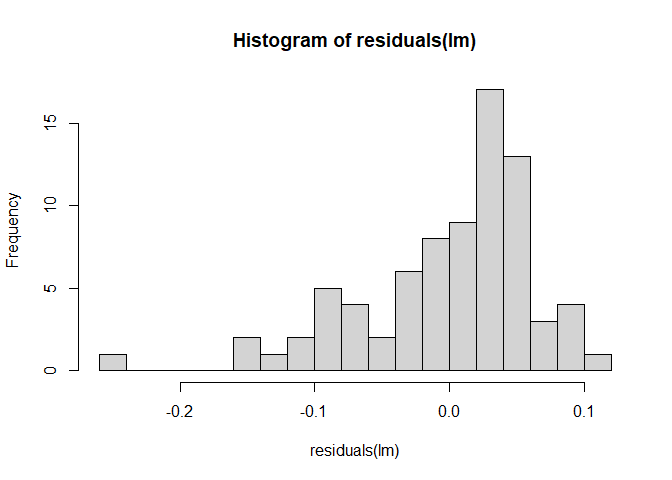<!-- -->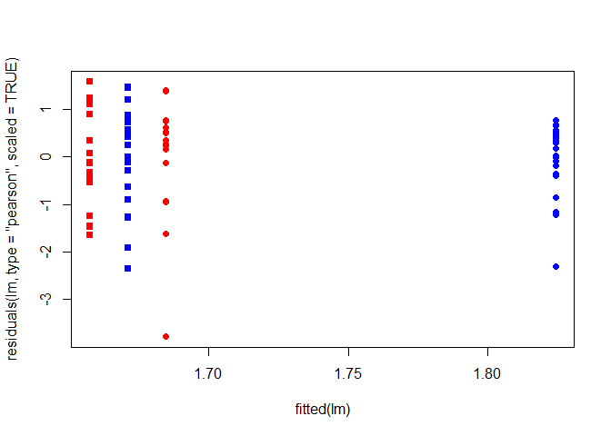<!-- -->

```
## [1] "the number of complete cases is 78"
```

```
## Linear mixed model fit by REML. t-tests use Satterthwaite's method [
## lmerModLmerTest]
## Formula: trait ~ Treatment * Population + (1 | Population:Line)
##    Data: data
## 
## REML criterion at convergence: -173.7
## 
## Scaled residuals: 
##     Min      1Q  Median      3Q     Max 
## -3.7830 -0.4495  0.2750  0.6081  1.5814 
## 
## Random effects:
##  Groups          Name        Variance Std.Dev.
##  Population:Line (Intercept) 0.000000 0.00000 
##  Residual                    0.004426 0.06653 
## Number of obs: 78, groups:  Population:Line, 21
## 
## Fixed effects:
##                         Estimate Std. Error        df t value Pr(>|t|)    
## (Intercept)             1.709369   0.007649 74.000000 223.480  < 2e-16 ***
## Treatment1              0.045167   0.007649 74.000000   5.905 9.95e-08 ***
## Population1            -0.038356   0.007649 74.000000  -5.015 3.53e-06 ***
## Treatment1:Population1 -0.031543   0.007649 74.000000  -4.124 9.63e-05 ***
## ---
## Signif. codes:  0 '***' 0.001 '**' 0.01 '*' 0.05 '.' 0.1 ' ' 1
## 
## Correlation of Fixed Effects:
##             (Intr) Trtmn1 Ppltn1
## Treatment1  -0.081              
## Population1  0.156 -0.024       
## Trtmnt1:Pp1 -0.024  0.156 -0.081
## optimizer (nloptwrap) convergence code: 0 (OK)
## boundary (singular) fit: see help('isSingular')
```

```
## Computing profile confidence intervals ...
```

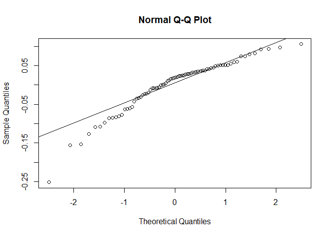<!-- -->

```
##                              2.5 %      97.5 %
## .sig01                  0.00000000  0.02297541
## .sigma                  0.05582089  0.07646654
## (Intercept)             1.69458675  1.72415037
## Treatment1              0.03038359  0.05995091
## Population1            -0.05313945 -0.02357805
## Treatment1:Population1 -0.04632699 -0.01675966
```

``` r
seeds_anov_21 <- do_anov(seeds_lm_21)
```

```
## Type III Analysis of Variance Table with Satterthwaite's method
##                        Sum Sq  Mean Sq NumDF DenDF F value    Pr(>F)    
## Treatment            0.154327 0.154327     1    74  34.870 9.946e-08 ***
## Population           0.111293 0.111293     1    74  25.147 3.528e-06 ***
## Treatment:Population 0.075268 0.075268     1    74  17.007 9.635e-05 ***
## ---
## Signif. codes:  0 '***' 0.001 '**' 0.01 '*' 0.05 '.' 0.1 ' ' 1
```

``` r
seeds_anov_21$trait <- "l10_Average Seeds per Fruit"
seeds_emmeans_21 <- get_table_bt(seeds_lm_21)
seeds_means_21 <- as.data.frame(seeds_emmeans_21)
seeds_pairs_21 <- as.data.frame(pairs(seeds_emmeans_21))
seeds_pairs_21$trait <- "l10_Average Seeds per Fruit"
# why are residuals so odd? because population explains 0 variance.

## test if SeedCounter matters
#seeds_lm <- lmer(l10_AvgSeedNum ~ Treatment * Population + (1|Population:Line) + (1|SeedCounter), data = Dat_2021_TwoTrt, #contrasts = list(Treatment=contr.sum, Population = contr.sum))
#plot(fitted(seeds_lm), residuals(seeds_lm, type = "pearson", scaled = TRUE),
#       col = c("red", "blue")[as.numeric(Dat_2021_TwoTrt$Population)[complete.cases(Dat_2021_TwoTrt$l10_AvgSeedNum)]],
#       pch = c(16, 15, 17)[as.numeric(Dat_2021_TwoTrt$Treatment)[complete.cases(Dat_2021_TwoTrt$l10_AvgSeedNum)]])
#summary(seeds_lm)
#anova(seeds_lm)
#
## when including seed counter, it does explain some variance (0.0001) but there is more residual (0.0004) and population still explains nothing. The significance levels don't change, and the effect sizes don't really change either though not the standard error and df are different for each predictor
## not going to include in the model.
#
## see if the nesting is doing something unintended. if LineID was the random variable, does anything change?
#Dat_2021_TwoTrt$Line.ID <- as.factor(paste0(Dat_2021_TwoTrt$Population, Dat_2021_TwoTrt$Line))
#seeds_lm2 <- lmer(l10_AvgSeedNum ~ Treatment * Population + (1|Line.ID), data = Dat_2021_TwoTrt, contrasts = #list(Treatment=contr.sum, Population = contr.sum))
#plot(fitted(seeds_lm2), residuals(seeds_lm2, type = "pearson", scaled = TRUE),
#       col = c("red", "blue")[as.numeric(Dat_2021_TwoTrt$Population)[complete.cases(Dat_2021_TwoTrt$l10_AvgSeedNum)]],
#       pch = c(16, 15, 17)[as.numeric(Dat_2021_TwoTrt$Treatment)[complete.cases(Dat_2021_TwoTrt$l10_AvgSeedNum)]])
#summary(seeds_lm2)
#anova(seeds_lm2)
#
## no difference, as expected if the model was functioning as expected. All testing code is commented out and no changes were made to the model.
```

Bonus question about a trade off - are seed weight and seeds per fruit negatively correlated?

``` r
# overall
cor.test(Dat_2021_TwoTrt$AvgSeedNum, Dat_2021_TwoTrt$AvgSeedWt)
```

```
## 
## 	Pearson's product-moment correlation
## 
## data:  Dat_2021_TwoTrt$AvgSeedNum and Dat_2021_TwoTrt$AvgSeedWt
## t = 0.26528, df = 76, p-value = 0.7915
## alternative hypothesis: true correlation is not equal to 0
## 95 percent confidence interval:
##  -0.1934240  0.2512461
## sample estimates:
##        cor 
## 0.03041591
```

``` r
plot(Dat_2021_TwoTrt$AvgSeedNum, Dat_2021_TwoTrt$AvgSeedWt)
```

<!-- -->

``` r
# just in SW
cor.test(Dat_2021_TwoTrt[Dat_2021_TwoTrt$Population == "RODA", ]$AvgSeedNum, Dat_2021_TwoTrt[Dat_2021_TwoTrt$Population == "RODA", ]$AvgSeedWt)
```

```
## 
## 	Pearson's product-moment correlation
## 
## data:  Dat_2021_TwoTrt[Dat_2021_TwoTrt$Population == "RODA", ]$AvgSeedNum and Dat_2021_TwoTrt[Dat_2021_TwoTrt$Population == "RODA", ]$AvgSeedWt
## t = -1.0583, df = 43, p-value = 0.2958
## alternative hypothesis: true correlation is not equal to 0
## 95 percent confidence interval:
##  -0.4326312  0.1407873
## sample estimates:
##        cor 
## -0.1593311
```

``` r
plot(Dat_2021_TwoTrt[Dat_2021_TwoTrt$Population == "RODA", ]$AvgSeedNum, Dat_2021_TwoTrt[Dat_2021_TwoTrt$Population == "RODA", ]$AvgSeedWt)
```

<!-- -->

``` r
# just in IT
cor.test(Dat_2021_TwoTrt[Dat_2021_TwoTrt$Population == "BELM", ]$AvgSeedNum, Dat_2021_TwoTrt[Dat_2021_TwoTrt$Population == "BELM", ]$AvgSeedWt)
```

```
## 
## 	Pearson's product-moment correlation
## 
## data:  Dat_2021_TwoTrt[Dat_2021_TwoTrt$Population == "BELM", ]$AvgSeedNum and Dat_2021_TwoTrt[Dat_2021_TwoTrt$Population == "BELM", ]$AvgSeedWt
## t = -0.78614, df = 31, p-value = 0.4378
## alternative hypothesis: true correlation is not equal to 0
## 95 percent confidence interval:
##  -0.4609912  0.2137603
## sample estimates:
##        cor 
## -0.1398087
```

``` r
plot(Dat_2021_TwoTrt[Dat_2021_TwoTrt$Population == "BELM", ]$AvgSeedNum, Dat_2021_TwoTrt[Dat_2021_TwoTrt$Population == "BELM", ]$AvgSeedWt)
```

<!-- -->

``` r
# just cur?
cor.test(Dat_2021_TwoTrt[Dat_2021_TwoTrt$Treatment == "Current", ]$AvgSeedNum, Dat_2021_TwoTrt[Dat_2021_TwoTrt$Treatment == "Current", ]$AvgSeedWt)
```

```
## 
## 	Pearson's product-moment correlation
## 
## data:  Dat_2021_TwoTrt[Dat_2021_TwoTrt$Treatment == "Current", ]$AvgSeedNum and Dat_2021_TwoTrt[Dat_2021_TwoTrt$Treatment == "Current", ]$AvgSeedWt
## t = 0.13614, df = 40, p-value = 0.8924
## alternative hypothesis: true correlation is not equal to 0
## 95 percent confidence interval:
##  -0.2842706  0.3233366
## sample estimates:
##        cor 
## 0.02152005
```

``` r
plot(Dat_2021_TwoTrt[Dat_2021_TwoTrt$Treatment == "Current", ]$AvgSeedNum, Dat_2021_TwoTrt[Dat_2021_TwoTrt$Treatment == "Current", ]$AvgSeedWt)
```

<!-- -->

``` r
# just fut?
cor.test(Dat_2021_TwoTrt[Dat_2021_TwoTrt$Treatment == "Future", ]$AvgSeedNum, Dat_2021_TwoTrt[Dat_2021_TwoTrt$Treatment == "Future", ]$AvgSeedWt)
```

```
## 
## 	Pearson's product-moment correlation
## 
## data:  Dat_2021_TwoTrt[Dat_2021_TwoTrt$Treatment == "Future", ]$AvgSeedNum and Dat_2021_TwoTrt[Dat_2021_TwoTrt$Treatment == "Future", ]$AvgSeedWt
## t = -0.90399, df = 34, p-value = 0.3724
## alternative hypothesis: true correlation is not equal to 0
## 95 percent confidence interval:
##  -0.4586536  0.1846253
## sample estimates:
##        cor 
## -0.1532031
```

``` r
plot(Dat_2021_TwoTrt[Dat_2021_TwoTrt$Treatment == "Future", ]$AvgSeedNum, Dat_2021_TwoTrt[Dat_2021_TwoTrt$Treatment == "Future", ]$AvgSeedWt)
```

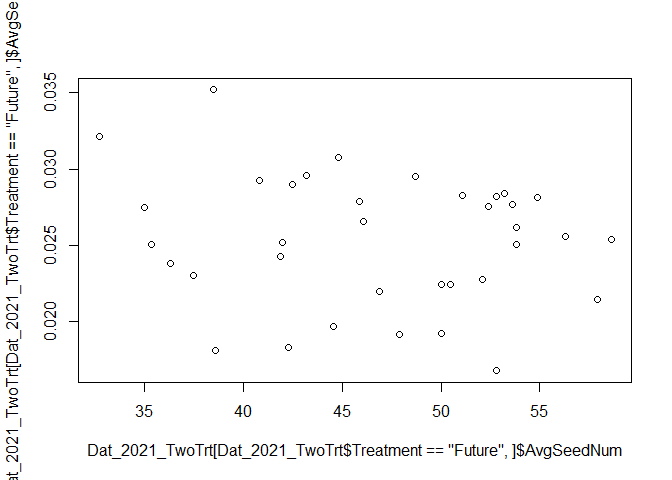<!-- -->

Total Fitness


``` r
# total fitness 
fitness_lm_21 <- do_lmer(Dat_2021_TwoTrt$fitness)
```

<!-- --><!-- -->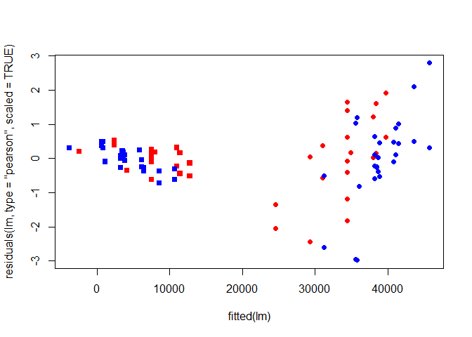<!-- -->

```
## [1] "the number of complete cases is 93"
```

```
## Linear mixed model fit by REML. t-tests use Satterthwaite's method [
## lmerModLmerTest]
## Formula: trait ~ Treatment * Population + (1 | Population:Line)
##    Data: data
## 
## REML criterion at convergence: 1956.9
## 
## Scaled residuals: 
##      Min       1Q   Median       3Q      Max 
## -2.97677 -0.34420  0.07632  0.36589  2.79464 
## 
## Random effects:
##  Groups          Name        Variance  Std.Dev.
##  Population:Line (Intercept)  37372493  6113   
##  Residual                    144910416 12038   
## Number of obs: 93, groups:  Population:Line, 21
## 
## Fixed effects:
##                        Estimate Std. Error       df t value Pr(>|t|)    
## (Intercept)            20873.25    1916.28    16.51  10.893 5.95e-09 ***
## Treatment1             15482.40    1261.46    69.36  12.273  < 2e-16 ***
## Population1             -540.91    1916.28    16.51  -0.282    0.781    
## Treatment1:Population1 -2006.15    1261.46    69.36  -1.590    0.116    
## ---
## Signif. codes:  0 '***' 0.001 '**' 0.01 '*' 0.05 '.' 0.1 ' ' 1
## 
## Correlation of Fixed Effects:
##             (Intr) Trtmn1 Ppltn1
## Treatment1  -0.006              
## Population1  0.220  0.006       
## Trtmnt1:Pp1  0.006  0.138 -0.006
```

```
## Computing profile confidence intervals ...
```

<!-- -->

```
##                            2.5 %     97.5 %
## .sig01                     0.000  9834.9355
## .sigma                 10166.933 14167.4614
## (Intercept)            17125.744 24613.8151
## Treatment1             13010.983 17959.8083
## Population1            -4280.441  3207.7593
## Treatment1:Population1 -4483.566   465.2587
```

``` r
fitness_anov_21 <- do_anov(fitness_lm_21)
```

```
## Type III Analysis of Variance Table with Satterthwaite's method
##                          Sum Sq    Mean Sq NumDF  DenDF  F value Pr(>F)    
## Treatment            2.1829e+10 2.1829e+10     1 69.360 150.6370 <2e-16 ***
## Population           1.1546e+07 1.1546e+07     1 16.507   0.0797 0.7812    
## Treatment:Population 3.6651e+08 3.6651e+08     1 69.360   2.5292 0.1163    
## ---
## Signif. codes:  0 '***' 0.001 '**' 0.01 '*' 0.05 '.' 0.1 ' ' 1
```

``` r
fitness_anov_21$trait <- "Total Fitness"
fitness_emmeans_21 <- get_table(fitness_lm_21)
fitness_means_21 <- as.data.frame(fitness_emmeans_21)
fitness_pairs_21 <- as.data.frame(pairs(fitness_emmeans_21))
fitness_pairs_21$trait <- "Total Fitness"
```

###Outputs

1) Results table


``` r
AnovaResults_2021 <- rbind(emergence_anov_21, bolting_anov_21, flowering_anov_21, eTof_anov_21, fresh_anov_21, sat_anov_21, dry_anov_21, area_anov_21, per_anov_21, SLA_anov_21, LDMC_anov_21, RWC_anov_21, LN_PreVern_anov_21, LN_Vern_anov_21, LN_PostVern_anov_21, LN_harv_anov_21, Ros_anov_21, Repro_anov_21, RR_anov_21, LatBranch_anov_21, PrimStalks_anov_21, height_anov_21, fruit_anov_21, AG_anov_21, AvSeedWt_anov_21, seeds_anov_21, fitness_anov_21)

write.csv(AnovaResults_2021, file = "data/AnovaResults_2021.csv", row.names = TRUE)
```

2) All the tables to read in to the figures code


``` r
# change column names - order is odd as artifact from updating code
dfs <- c("emergence_means_21", "bolting_means_21", "flowering_means_21", "eTof_means_21", "RWC_means_21", 'LN_PreVern_means_21', 'LN_Vern_means_21', "LN_PostVern_means_21", "LN_harv_means_21", 'LatBranch_means_21', "PrimStalks_means_21", "height_means_21", "AvSeedWt_means_21", "fruit_means_21", "fitness_means_21", "fresh_means_21", 'sat_means_21', "dry_means_21", "area_means_21", "per_means_21", "SLA_means_21", "LDMC_means_21", "Ros_means_21", "Repro_means_21", 'RR_means_21', "AG_means_21", "seeds_means_21")

for (i in dfs) {
  x=get(i)
  colnames(x) <- c("Treatment", "Population", "Mean", "SE", "Df", "LL_95", "UL_95")
  assign(i,x)
}

# create list of data frames
Means_2021 <- list(emergence_means_21, bolting_means_21, flowering_means_21, eTof_means_21, fresh_means_21, sat_means_21, dry_means_21, area_means_21, per_means_21, SLA_means_21, LDMC_means_21, RWC_means_21, LN_PreVern_means_21, LN_Vern_means_21, LN_PostVern_means_21, LN_harv_means_21, Ros_means_21, Repro_means_21, RR_means_21, LatBranch_means_21, PrimStalks_means_21, height_means_21, fruit_means_21, AG_means_21, AvSeedWt_means_21, seeds_means_21, fitness_means_21)

# name that list
names(Means_2021) <- c("emergence_means_21", "bolting_means_21", "flowering_means_21", "eTof_means_21", "fresh_means_21", 'sat_means_21', "dry_means_21", "area_means_21", "per_means_21", "SLA_means_21", "LDMC_means_21", "RWC_means_21", 'LN_PreVern_means_21', 'LN_Vern_means_21', "LN_PostVern_means_21", "LN_harv_means_21", "Ros_means_21", "Repro_means_21", 'RR_means_21', 'LatBranch_means_21', "PrimStalks_means_21", "height_means_21", "fruit_means_21", "AG_means_21", "AvSeedWt_means_21", "seeds_means_21", "fitness_means_21")

# save named list
save(Means_2021, file = "data/ModelMeans_2021.robj")
```

Save a .csv with the posthoc results

``` r
PostHocResults_2021 <- rbind(emergence_pairs_21, eTof_pairs_21, fresh_pairs_21, sat_pairs_21, dry_pairs_21, area_pairs_21, per_pairs_21, SLA_pairs_21, LDMC_pairs_21, RWC_pairs_21, LN_harv_pairs_21, Ros_pairs_21, Repro_pairs_21, RR_pairs_21, LatBranch_pairs_21, PrimStalks_pairs_21, height_pairs_21, fruit_pairs_21, AvSeedWt_pairs_21, seeds_pairs_21, fitness_pairs_21)

write.csv(PostHocResults_2021, file = "data/PostHocResults_2021.csv", row.names = TRUE)
```


## Sample size information

The goal here is to know how many lines and how many replicates per line for this experiment. The number of observations that wre not NA comes from earlier in the "summarize" section.


``` r
# sample size of 2021 total
Dat_2021_TwoTrt %>% count(Treatment)
```

```
##   Treatment  n
## 1   Current 50
## 2    Future 50
```

``` r
# 50 plants per treatments
Dat_2021_TwoTrt %>% count(Treatment, Population)
```

```
##   Treatment Population  n
## 1   Current       BELM 20
## 2   Current       RODA 30
## 3    Future       BELM 20
## 4    Future       RODA 30
```

``` r
# in each treatment, 20 are IT, 30 are SW

# there are 21 unique lines. 8 IT, 13 SW.
n_2021 <- Dat_2021_TwoTrt %>%
  group_by(Treatment) %>%
  group_by(Population, .add = TRUE) %>%
  group_by(Line, .add = TRUE) %>%
  count

# only line with 1 rep is Belm 1. Then everything has 2 but RIL parents. B12 has 7, R47 has 6.
n_2021 %>% 
  group_by(Treatment) %>%
  group_by(Population, .add = TRUE) %>%
  summarize(min = min(n), mean = mean(n), median = median(n), max = max(n))
```

```
## `summarise()` has grouped output by 'Treatment'. You can override using the
## `.groups` argument.
```

```
## # A tibble: 4 × 6
## # Groups:   Treatment [2]
##   Treatment Population   min  mean median   max
##   <fct>     <fct>      <int> <dbl>  <dbl> <int>
## 1 Current   BELM           1  2.5       2     7
## 2 Current   RODA           2  2.31      2     6
## 3 Future    BELM           1  2.5       2     7
## 4 Future    RODA           2  2.31      2     6
```


# 2022

## Read in data

``` r
Dat_2022 <- read.csv("data/CleanData_2022.csv", header= TRUE)

# make factors
Dat_2022$Treatment <- as.factor(Dat_2022$Treatment)
Dat_2022$Population <- as.factor(Dat_2022$Population)
Dat_2022$PotID <- as.factor(Dat_2022$PotID)
Dat_2022$Flat <- as.factor(Dat_2022$Flat)
Dat_2022$Chamber <- as.factor(Dat_2022$Chamber)
Dat_2022$Transplanted <- as.factor(Dat_2022$Transplanted)
```

## Summarize!


``` r
# by population only
ByPop_22 <- Dat_2022 %>%
  dplyr::group_by(Population) %>%
  summarize(across(.col = c(DaysToEmergence:l10_Stomata_density), .fns = list(mean = ~mean(.x, na.rm = TRUE, .group = "keep"), ci_95 = ~conf_int(.x), n = ~sum(!is.na(.x)))))

# transpose for easier viewing
ByPop_22 <- data.frame(t(ByPop_22))

# by treatment
ByTrt_22 <- Dat_2022 %>%
  dplyr::group_by(Treatment) %>%
  summarize(across(.col = c(DaysToEmergence:l10_Stomata_density), .fns = list(mean = ~mean(.x, na.rm = TRUE, .group = "keep"), ci_95 = ~conf_int(.x), n = ~sum(!is.na(.x)))))
ByTrt_22 <- data.frame(t(ByTrt_22))

# population means within each treatment
ByTrt_Pop_22 <- Dat_2022 %>%
  dplyr::group_by(Population) %>%
  dplyr::group_by(Treatment, .add = TRUE) %>%
  summarize(across(.col = c(DaysToEmergence:l10_Stomata_density), .fns = list(mean = ~mean(.x, na.rm = TRUE, .group = "keep"), ci_95 = ~conf_int(.x), n = ~sum(!is.na(.x)))))
```

```
## `summarise()` has grouped output by 'Population'. You can override using the
## `.groups` argument.
```

``` r
# get the sample sizes
SampleSizes_2022 <- dplyr::select(ByTrt_Pop_22, "Treatment", "Population", ends_with("_n"))
save(SampleSizes_2022, file = "data/SampleSizes_2022.robj")

# for some ease of viewing
ByTrt_Pop_22 <- data.frame(t(ByTrt_Pop_22))
colnames(ByTrt_Pop_22) <- c("Belm_C", "Belm_F", "Roda_C", "Roda_F")

# save this to keep means
write.csv(ByTrt_Pop_22,"data/PopMeansByTreatment_2022.csv", row.names = TRUE )
```


## Anovas
Now, we can make some models. Initially there were three models for this analysis.

For traits collected before bolting: trait ~ Treatment * Population + (1|Population:Line) + (1|Treatment:Chamber) + (1|Transplanted)

For traits collected when a single leaf was harvesting: trait ~ Treatment * Population + (1|BoltingToHarvest) + (1|Population:Line) + (1|Treatment:Chamber) + (1|Transplanted)

For root harvesting traits: trait ~ Treatment * Population + (1|BoltingToRootWashing) + (1|Population:Line) + (1|Treatment:Chamber) + (1|Transplanted)

Chamber nested within treatment was changed to a fixed effect because models struggle to fit a variance with few groups. The Bolting to harvest and bolting to root washing variables were also removed because they are continuous but being treated like categorical as a random effect. These two variables did explain some variation and removing sometimes increased and sometimes decreased both effect sizes and p values. 

There is a population bias where only italian lines were transplanted. 17 plants from 6 genotypes were transplanted. They became 10 current plants and 7 future plants. **However, when included, the transplanting effect sometimes explains 0 variance** Because this is such a small number (17 plants of 127 plants), the transplanting effect was removed from the model. All models were run with and without transplanting as  a fixed effect, but only small changes were seen in 3 traits (see data/ModelResults_InitalModels.xlsx for notes.)

Final model: trait ~ Treatment * Population + Treatment:Chamber + (1|Population:Line)


``` r
# set contrasts for models to ensure we are doing the correct type of ANOVA (type-III)
contrasts(Dat_2022$Population) <- contr.sum
contrasts(Dat_2022$Treatment) <- contr.sum

# make a modelling function to streamline analyses. This function follows the same pattern as from 2021 analysis

do_lmer2 <- function(trait, data = Dat_2022){
  lm<- lmer(trait ~ Treatment * Population + Treatment/Chamber + (1|Population:Line), data = data, contrasts = list(Treatment=contr.sum, Population = contr.sum))
  print(plot(lm))
  hist(residuals(lm), breaks = 15)
  # in the residual plots, red is italy, blue is sweden; filled circle is current, filled triangle is future
  plot(fitted(lm), residuals(lm, type = "pearson", scaled = TRUE),
       col = c("red", "blue")[as.numeric(Dat_2022$Population)[complete.cases(trait)]],
       pch = c(16, 17)[as.numeric(Dat_2022$Treatment)[complete.cases(trait)]])
  #legend("topleft", legend = c("Italy", "Sweden"), col = c("red", "blue"), pch = 16)
  #legend("bottomleft", legend = c("Current", "Future"), col = "black", pch = c(16,17))
  #plotting sanity check
  print(paste0("the number of complete cases is ", sum(complete.cases(trait))))
  # make qq plot
  qqnorm(resid(lm))
  qqline(resid(lm))
  print(summary(lm))
  print(confint(lm))
  return(lm)
}
# do the anova
do_anov2 <- function(model){
  anov <- anova(model)
  print(anov)
  df <- as.data.frame(anov)
  df$exp <- "2022"
  return(df)
}

# get table functions are the same as from 2021
```

Run the models
### Phenology

Days to emergence - log10 transformed this time!

``` r
# days to emergence
emergence_lm_22 <- do_lmer2(Dat_2022$l10_DaysToEmergence)
```

<!-- -->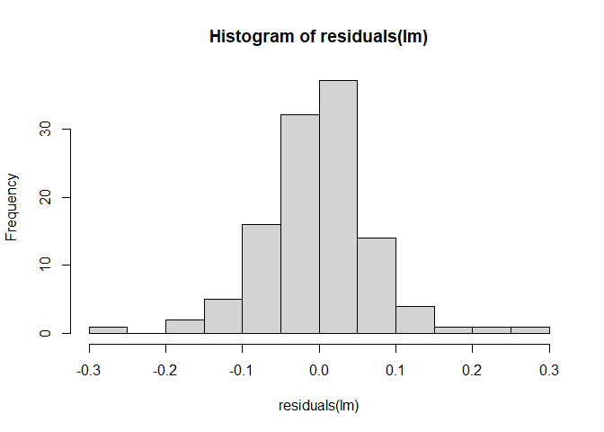<!-- -->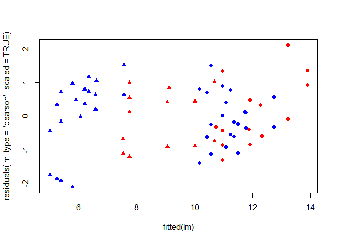<!-- -->

```
## [1] "the number of complete cases is 114"
```

```
## Linear mixed model fit by REML. t-tests use Satterthwaite's method [
## lmerModLmerTest]
## Formula: 
## trait ~ Treatment * Population + Treatment/Chamber + (1 | Population:Line)
##    Data: data
## 
## REML criterion at convergence: -173.3
## 
## Scaled residuals: 
##     Min      1Q  Median      3Q     Max 
## -3.5542 -0.4853  0.0366  0.4726  3.2646 
## 
## Random effects:
##  Groups          Name        Variance Std.Dev.
##  Population:Line (Intercept) 0.012906 0.11360 
##  Residual                    0.006515 0.08071 
## Number of obs: 114, groups:  Population:Line, 16
## 
## Fixed effects:
##                            Estimate Std. Error        df t value Pr(>|t|)    
## (Intercept)                0.691631   0.029682 11.196389  23.301 7.67e-11 ***
## Treatment1                 0.030151   0.007675 91.472400   3.929 0.000166 ***
## Population1                0.054874   0.029682 11.196389   1.849 0.091058 .  
## Treatment1:Population1    -0.002207   0.007675 91.472400  -0.288 0.774300    
## TreatmentCurrent:Chamber1  0.016156   0.010826 91.012390   1.492 0.139098    
## TreatmentFuture:Chamber1  -0.019243   0.010680 91.637850  -1.802 0.074865 .  
## ---
## Signif. codes:  0 '***' 0.001 '**' 0.01 '*' 0.05 '.' 0.1 ' ' 1
## 
## Correlation of Fixed Effects:
##             (Intr) Trtmn1 Ppltn1 Tr1:P1 TrC:C1
## Treatment1   0.019                            
## Population1  0.027  0.019                     
## Trtmnt1:Pp1  0.019  0.136  0.019              
## TrtmntCr:C1 -0.004 -0.002 -0.004 -0.002       
## TrtmntFt:C1 -0.019  0.020 -0.019  0.020  0.000
```

```
## Computing profile confidence intervals ...
```

<!-- -->

```
##                                  2.5 %      97.5 %
## .sig01                     0.068587746 0.164680139
## .sigma                     0.069111980 0.092050929
## (Intercept)                0.634542542 0.750751174
## Treatment1                 0.014986031 0.044886544
## Population1               -0.002215050 0.113993582
## Treatment1:Population1    -0.017372017 0.012528496
## TreatmentCurrent:Chamber1 -0.004822676 0.037252042
## TreatmentFuture:Chamber1  -0.039765038 0.001818416
```

``` r
emergence_anov_22 <- do_anov2(emergence_lm_22)
```

```
## Type III Analysis of Variance Table with Satterthwaite's method
##                        Sum Sq  Mean Sq NumDF  DenDF F value    Pr(>F)    
## Treatment            0.129859 0.129859     1 91.777 19.9336 2.277e-05 ***
## Population           0.022265 0.022265     1 11.196  3.4178   0.09106 .  
## Treatment:Population 0.000539 0.000539     1 91.472  0.0827   0.77430    
## Treatment:Chamber    0.035658 0.017829     2 91.324  2.7368   0.07009 .  
## ---
## Signif. codes:  0 '***' 0.001 '**' 0.01 '*' 0.05 '.' 0.1 ' ' 1
```

``` r
emergence_anov_22$trait <- "Emergence"
emergence_means_22 <- as.data.frame(get_table_bt(emergence_lm_22))
```

```
## NOTE: A nesting structure was detected in the fitted model:
##     Chamber %in% Treatment
```

Days between emergence and bolting

``` r
# days emergence to bolting
bolting_lm_22 <- do_lmer2(Dat_2022$EmergenceToBolting)
```

<!-- --><!-- --><!-- -->

```
## [1] "the number of complete cases is 113"
```

```
## Linear mixed model fit by REML. t-tests use Satterthwaite's method [
## lmerModLmerTest]
## Formula: 
## trait ~ Treatment * Population + Treatment/Chamber + (1 | Population:Line)
##    Data: data
## 
## REML criterion at convergence: 596.7
## 
## Scaled residuals: 
##     Min      1Q  Median      3Q     Max 
## -2.2202 -0.5600 -0.0418  0.3258  4.3449 
## 
## Random effects:
##  Groups          Name        Variance Std.Dev.
##  Population:Line (Intercept) 10.011   3.164   
##  Residual                     9.141   3.023   
## Number of obs: 113, groups:  Population:Line, 16
## 
## Fixed effects:
##                            Estimate Std. Error        df t value Pr(>|t|)    
## (Intercept)                77.67604    0.85253  13.75834  91.113  < 2e-16 ***
## Treatment1                  0.36471    0.28843  93.81339   1.264  0.20921    
## Population1               -10.01749    0.85236  13.75125 -11.753 1.48e-08 ***
## Treatment1:Population1      0.93323    0.28828  93.84112   3.237  0.00167 ** 
## TreatmentCurrent:Chamber1  -0.08781    0.40542  93.35913  -0.217  0.82900    
## TreatmentFuture:Chamber1   -0.37577    0.40367  94.00569  -0.931  0.35430    
## ---
## Signif. codes:  0 '***' 0.001 '**' 0.01 '*' 0.05 '.' 0.1 ' ' 1
## 
## Correlation of Fixed Effects:
##             (Intr) Trtmn1 Ppltn1 Tr1:P1 TrC:C1
## Treatment1   0.019                            
## Population1  0.039  0.024                     
## Trtmnt1:Pp1  0.025  0.125  0.020              
## TrtmntCr:C1 -0.005 -0.002 -0.005 -0.002       
## TrtmntFt:C1 -0.026  0.035 -0.018  0.009  0.000
```

```
## Computing profile confidence intervals ...
```

<!-- -->

```
##                                 2.5 %     97.5 %
## .sig01                      1.9787901  4.5449405
## .sigma                      2.5885838  3.4320976
## (Intercept)                76.0225532 79.3442471
## Treatment1                 -0.1961394  0.9220867
## Population1               -11.6703448 -8.3491502
## Treatment1:Population1      0.3731224  1.4906457
## TreatmentCurrent:Chamber1  -0.8696697  0.7029427
## TreatmentFuture:Chamber1   -1.1585300  0.4061086
```

``` r
bolting_anov_22 <- do_anov2(bolting_lm_22)
```

```
## Type III Analysis of Variance Table with Satterthwaite's method
##                       Sum Sq Mean Sq NumDF  DenDF  F value    Pr(>F)    
## Treatment              14.71   14.71     1 94.081   1.6097  0.207668    
## Population           1262.59 1262.59     1 13.751 138.1233 1.481e-08 ***
## Treatment:Population   95.80   95.80     1 93.841  10.4800  0.001668 ** 
## Treatment:Chamber       8.35    4.17     2 93.681   0.4567  0.634778    
## ---
## Signif. codes:  0 '***' 0.001 '**' 0.01 '*' 0.05 '.' 0.1 ' ' 1
```

``` r
bolting_anov_22$trait <- "Bolting"
bolting_emmeans_22 <- get_table(bolting_lm_22)
```

```
## NOTE: A nesting structure was detected in the fitted model:
##     Chamber %in% Treatment
```

``` r
bolting_means_22 <- as.data.frame(bolting_emmeans_22)
bolting_pairs_22 <- as.data.frame(pairs(bolting_emmeans_22))
bolting_pairs_22$trait <- "Bolting"
```

Not analyzing bolting to root washing or bolting to harvest. Those could be included as random effects, but most were close together.
 
Not looking an number emerged because it doesn't have a 2021 comparison for emergence success.

### Single Leaf Traits: bolting

Fresh weight

``` r
# single leaf fresh weight
fresh_lm_22 <- do_lmer2(Dat_2022$l10_SL_FreshWt)
```

<!-- --><!-- --><!-- -->

```
## [1] "the number of complete cases is 127"
```

```
## Linear mixed model fit by REML. t-tests use Satterthwaite's method [
## lmerModLmerTest]
## Formula: 
## trait ~ Treatment * Population + Treatment/Chamber + (1 | Population:Line)
##    Data: data
## 
## REML criterion at convergence: -129.6
## 
## Scaled residuals: 
##     Min      1Q  Median      3Q     Max 
## -3.5017 -0.5621  0.0157  0.6128  2.3040 
## 
## Random effects:
##  Groups          Name        Variance Std.Dev.
##  Population:Line (Intercept) 0.008922 0.09445 
##  Residual                    0.012981 0.11393 
## Number of obs: 127, groups:  Population:Line, 16
## 
## Fixed effects:
##                             Estimate Std. Error         df t value Pr(>|t|)    
## (Intercept)               -1.275e+00  2.617e-02  1.238e+01 -48.723 1.59e-15 ***
## Treatment1                 5.684e-02  1.016e-02  1.067e+02   5.596 1.71e-07 ***
## Population1               -8.827e-02  2.617e-02  1.238e+01  -3.373  0.00532 ** 
## Treatment1:Population1    -1.914e-02  1.016e-02  1.068e+02  -1.884  0.06226 .  
## TreatmentCurrent:Chamber1  3.109e-04  1.430e-02  1.064e+02   0.022  0.98270    
## TreatmentFuture:Chamber1  -9.179e-03  1.445e-02  1.072e+02  -0.635  0.52659    
## ---
## Signif. codes:  0 '***' 0.001 '**' 0.01 '*' 0.05 '.' 0.1 ' ' 1
## 
## Correlation of Fixed Effects:
##             (Intr) Trtmn1 Ppltn1 Tr1:P1 TrC:C1
## Treatment1   0.012                            
## Population1  0.035  0.019                     
## Trtmnt1:Pp1  0.019 -0.001  0.012              
## TrtmntCr:C1 -0.005  0.000 -0.005  0.000       
## TrtmntFt:C1 -0.019  0.008 -0.009 -0.018  0.002
```

```
## Computing profile confidence intervals ...
```

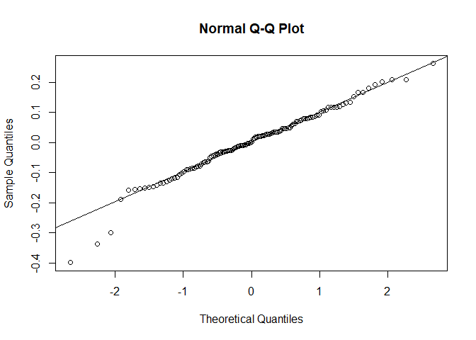<!-- -->

```
##                                 2.5 %        97.5 %
## .sig01                     0.05456799  0.1394255868
## .sigma                     0.09862586  0.1285834553
## (Intercept)               -1.32742293 -1.2249751742
## Treatment1                 0.03730415  0.0768432661
## Population1               -0.14052460 -0.0380774334
## Treatment1:Population1    -0.03869656  0.0008342726
## TreatmentCurrent:Chamber1 -0.02744503  0.0281182085
## TreatmentFuture:Chamber1  -0.03746390  0.0186998818
```

``` r
fresh_anov_22 <- do_anov2(fresh_lm_22)
```

```
## Type III Analysis of Variance Table with Satterthwaite's method
##                        Sum Sq  Mean Sq NumDF  DenDF F value    Pr(>F)    
## Treatment            0.239981 0.239981     1 107.19 18.4877 3.783e-05 ***
## Population           0.147692 0.147692     1  12.38 11.3779  0.005318 ** 
## Treatment:Population 0.046084 0.046084     1 106.78  3.5503  0.062256 .  
## Treatment:Chamber    0.005246 0.002623     2 106.82  0.2021  0.817359    
## ---
## Signif. codes:  0 '***' 0.001 '**' 0.01 '*' 0.05 '.' 0.1 ' ' 1
```

``` r
fresh_anov_22$trait <- "l10_FreshWt"
fresh_emmeans_22 <- get_table_bt(fresh_lm_22)
```

```
## NOTE: A nesting structure was detected in the fitted model:
##     Chamber %in% Treatment
```

``` r
fresh_means_22 <- as.data.frame(fresh_emmeans_22)
fresh_pairs_22 <- as.data.frame(pairs(fresh_emmeans_22))
fresh_pairs_22$trait <- "l10_FreshWt"
```

Saturated/Hydrated weight

``` r
# single leaf hydrated (also called saturated) weight
hyd_lm_22 <- do_lmer2(Dat_2022$l10_SL_HydWt)
```

<!-- --><!-- --><!-- -->

```
## [1] "the number of complete cases is 126"
```

```
## Linear mixed model fit by REML. t-tests use Satterthwaite's method [
## lmerModLmerTest]
## Formula: 
## trait ~ Treatment * Population + Treatment/Chamber + (1 | Population:Line)
##    Data: data
## 
## REML criterion at convergence: -127.6
## 
## Scaled residuals: 
##     Min      1Q  Median      3Q     Max 
## -3.6374 -0.5389  0.0137  0.5921  2.2783 
## 
## Random effects:
##  Groups          Name        Variance Std.Dev.
##  Population:Line (Intercept) 0.009201 0.09592 
##  Residual                    0.013016 0.11409 
## Number of obs: 126, groups:  Population:Line, 16
## 
## Fixed effects:
##                             Estimate Std. Error         df t value Pr(>|t|)    
## (Intercept)                -1.192566   0.026537  12.396080 -44.939 4.18e-15 ***
## Treatment1                  0.037950   0.010220 105.731483   3.713 0.000329 ***
## Population1                -0.079389   0.026530  12.391275  -2.992 0.010878 *  
## Treatment1:Population1     -0.024270   0.010223 105.814593  -2.374 0.019393 *  
## TreatmentCurrent:Chamber1   0.003295   0.014321 105.397279   0.230 0.818463    
## TreatmentFuture:Chamber1   -0.010582   0.014610 106.301718  -0.724 0.470481    
## ---
## Signif. codes:  0 '***' 0.001 '**' 0.01 '*' 0.05 '.' 0.1 ' ' 1
## 
## Correlation of Fixed Effects:
##             (Intr) Trtmn1 Ppltn1 Tr1:P1 TrC:C1
## Treatment1   0.008                            
## Population1  0.033  0.022                     
## Trtmnt1:Pp1  0.023 -0.010  0.008              
## TrtmntCr:C1 -0.005  0.000 -0.005  0.000       
## TrtmntFt:C1 -0.024  0.021 -0.004 -0.031  0.002
```

```
## Computing profile confidence intervals ...
```

<!-- -->

```
##                                 2.5 %       97.5 %
## .sig01                     0.05562091  0.141472707
## .sigma                     0.09868873  0.128821965
## (Intercept)               -1.24551407 -1.141649966
## Treatment1                 0.01830131  0.058093015
## Population1               -0.13238231 -0.028511484
## Treatment1:Population1    -0.04395713 -0.004190417
## TreatmentCurrent:Chamber1 -0.02449199  0.031144174
## TreatmentFuture:Chamber1  -0.03914506  0.017627404
```

``` r
hyd_anov_22 <- do_anov2(hyd_lm_22)
```

```
## Type III Analysis of Variance Table with Satterthwaite's method
##                        Sum Sq  Mean Sq NumDF   DenDF F value   Pr(>F)   
## Treatment            0.127458 0.127458     1 106.169  9.7924 0.002263 **
## Population           0.116553 0.116553     1  12.391  8.9546 0.010878 * 
## Treatment:Population 0.073364 0.073364     1 105.815  5.6365 0.019393 * 
## Treatment:Chamber    0.007524 0.003762     2 105.847  0.2890 0.749582   
## ---
## Signif. codes:  0 '***' 0.001 '**' 0.01 '*' 0.05 '.' 0.1 ' ' 1
```

``` r
hyd_anov_22$trait <- "l10_SatWt"
hyd_emmeans_22 <- get_table_bt(hyd_lm_22)
```

```
## NOTE: A nesting structure was detected in the fitted model:
##     Chamber %in% Treatment
```

``` r
hyd_means_22 <- as.data.frame(hyd_emmeans_22)
hyd_pairs_22 <- as.data.frame(pairs(hyd_emmeans_22))
hyd_pairs_22$trait <- "l10_SatWt"

## also has SQR transformation. Pop becomes more significant but no other significance changes
#hyd_lm_22SQR <- do_lmer2(Dat_2022$SQR_SL_HydWt)
#hyd_anov_22SQR <- do_anov2(hyd_lm_22SQR)
#hyd_anov_22SQR$trait <- "l10_SatWt"
```

Dried weight

``` r
# single leaf dry weight
dry_lm_22 <- do_lmer2(Dat_2022$SL_DryWt)
```

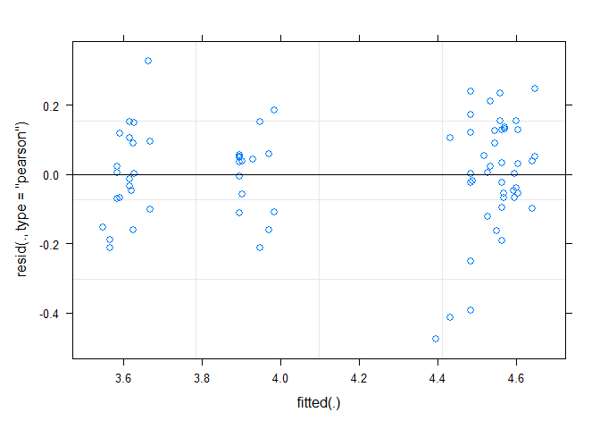<!-- --><!-- -->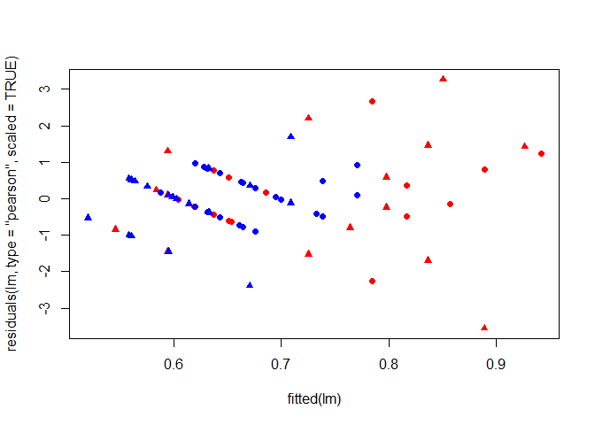<!-- -->

```
## [1] "the number of complete cases is 127"
```

```
## Linear mixed model fit by REML. t-tests use Satterthwaite's method [
## lmerModLmerTest]
## Formula: 
## trait ~ Treatment * Population + Treatment/Chamber + (1 | Population:Line)
##    Data: data
## 
## REML criterion at convergence: -1110.2
## 
## Scaled residuals: 
##     Min      1Q  Median      3Q     Max 
## -2.7379 -0.5791 -0.1121  0.5190  2.9141 
## 
## Random effects:
##  Groups          Name        Variance  Std.Dev.
##  Population:Line (Intercept) 2.155e-06 0.001468
##  Residual                    4.014e-06 0.002003
## Number of obs: 127, groups:  Population:Line, 16
## 
## Fixed effects:
##                             Estimate Std. Error         df t value Pr(>|t|)    
## (Intercept)                8.525e-03  4.162e-04  1.313e+01  20.486 2.37e-11 ***
## Treatment1                 4.994e-06  1.785e-04  1.078e+02   0.028  0.97774    
## Population1               -2.203e-03  4.161e-04  1.313e+01  -5.295  0.00014 ***
## Treatment1:Population1    -2.414e-04  1.786e-04  1.078e+02  -1.352  0.17923    
## TreatmentCurrent:Chamber1 -1.722e-04  2.514e-04  1.075e+02  -0.685  0.49491    
## TreatmentFuture:Chamber1   2.924e-04  2.539e-04  1.082e+02   1.152  0.25204    
## ---
## Signif. codes:  0 '***' 0.001 '**' 0.01 '*' 0.05 '.' 0.1 ' ' 1
## 
## Correlation of Fixed Effects:
##             (Intr) Trtmn1 Ppltn1 Tr1:P1 TrC:C1
## Treatment1   0.011                            
## Population1  0.038  0.019                     
## Trtmnt1:Pp1  0.019 -0.001  0.011              
## TrtmntCr:C1 -0.005  0.000 -0.005  0.000       
## TrtmntFt:C1 -0.019  0.008 -0.008 -0.017  0.001
```

```
## Computing profile confidence intervals ...
```

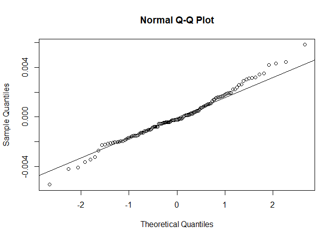<!-- -->

```
##                                   2.5 %        97.5 %
## .sig01                     0.0008372766  0.0021758224
## .sigma                     0.0017345818  0.0022582129
## (Intercept)                0.0076988658  0.0093250630
## Treatment1                -0.0003390982  0.0003549110
## Population1               -0.0030301218 -0.0014038831
## Treatment1:Population1    -0.0005858582  0.0001080053
## TreatmentCurrent:Chamber1 -0.0006598584  0.0003163963
## TreatmentFuture:Chamber1  -0.0002031777  0.0007829750
```

``` r
dry_anov_22 <- do_anov2(dry_lm_22)
```

```
## Type III Analysis of Variance Table with Satterthwaite's method
##                          Sum Sq    Mean Sq NumDF   DenDF F value    Pr(>F)    
## Treatment            3.2720e-06 3.2720e-06     1 108.163  0.8153 0.3685734    
## Population           1.1254e-04 1.1254e-04     1  13.129 28.0389 0.0001404 ***
## Treatment:Population 7.3360e-06 7.3360e-06     1 107.803  1.8277 0.1792277    
## Treatment:Chamber    7.2140e-06 3.6070e-06     2 107.843  0.8987 0.4101213    
## ---
## Signif. codes:  0 '***' 0.001 '**' 0.01 '*' 0.05 '.' 0.1 ' ' 1
```

``` r
dry_anov_22$trait <- "DriedWt"
dry_emmeans_22 <- get_table(dry_lm_22)
```

```
## NOTE: A nesting structure was detected in the fitted model:
##     Chamber %in% Treatment
```

``` r
dry_means_22 <- as.data.frame(dry_emmeans_22)
dry_pairs_22 <- as.data.frame(pairs(dry_emmeans_22))
dry_pairs_22$trait <- "DriedWt"

# what about SQR transformation - no meaningful change
#anov_lmer2(Dat_2022$SQR_SL_DryWt)

# and what about l10 transformation - no meaningful change
#anov_lmer2(log10(Dat_2022$SL_DryWt))
```

leaf area

``` r
# single leaf area
area_lm_22 <- do_lmer2(Dat_2022$SL_Area)
```

<!-- -->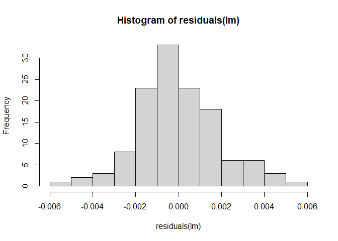<!-- --><!-- -->

```
## [1] "the number of complete cases is 127"
```

```
## Linear mixed model fit by REML. t-tests use Satterthwaite's method [
## lmerModLmerTest]
## Formula: 
## trait ~ Treatment * Population + Treatment/Chamber + (1 | Population:Line)
##    Data: data
## 
## REML criterion at convergence: 249.6
## 
## Scaled residuals: 
##     Min      1Q  Median      3Q     Max 
## -2.3367 -0.6544 -0.0584  0.4826  3.4995 
## 
## Random effects:
##  Groups          Name        Variance Std.Dev.
##  Population:Line (Intercept) 0.1230   0.3507  
##  Residual                    0.3135   0.5599  
## Number of obs: 127, groups:  Population:Line, 16
## 
## Fixed effects:
##                            Estimate Std. Error        df t value Pr(>|t|)    
## (Intercept)                 2.35413    0.10300  11.87300  22.855 3.51e-11 ***
## Treatment1                  0.22697    0.04987 106.69936   4.551 1.42e-05 ***
## Population1                -0.02561    0.10299  11.87248  -0.249   0.8079    
## Treatment1:Population1     -0.11142    0.04988 106.73938  -2.234   0.0276 *  
## TreatmentCurrent:Chamber1   0.05410    0.07024 106.43719   0.770   0.4429    
## TreatmentFuture:Chamber1   -0.05114    0.07091 107.14650  -0.721   0.4723    
## ---
## Signif. codes:  0 '***' 0.001 '**' 0.01 '*' 0.05 '.' 0.1 ' ' 1
## 
## Correlation of Fixed Effects:
##             (Intr) Trtmn1 Ppltn1 Tr1:P1 TrC:C1
## Treatment1   0.010                            
## Population1  0.040  0.019                     
## Trtmnt1:Pp1  0.019 -0.002  0.010              
## TrtmntCr:C1 -0.005  0.000 -0.005  0.000       
## TrtmntFt:C1 -0.019  0.009 -0.007 -0.016  0.001
```

```
## Computing profile confidence intervals ...
```

<!-- -->

```
##                                 2.5 %      97.5 %
## .sig01                     0.17259745  0.53631785
## .sigma                     0.48473123  0.63222932
## (Intercept)                2.14707434  2.55116765
## Treatment1                 0.13108146  0.32531545
## Population1               -0.23285314  0.17133450
## Treatment1:Population1    -0.20743423 -0.01330760
## TreatmentCurrent:Chamber1 -0.08246602  0.19048548
## TreatmentFuture:Chamber1  -0.18967204  0.08593541
```

``` r
area_anov_22 <- do_anov2(area_lm_22)
```

```
## Type III Analysis of Variance Table with Satterthwaite's method
##                      Sum Sq Mean Sq NumDF   DenDF F value    Pr(>F)    
## Treatment            4.9582  4.9582     1 107.087 15.8164 0.0001271 ***
## Population           0.0194  0.0194     1  11.872  0.0618 0.8078759    
## Treatment:Population 1.5642  1.5642     1 106.739  4.9898 0.0275829 *  
## Treatment:Chamber    0.3495  0.1748     2 106.790  0.5575 0.5743097    
## ---
## Signif. codes:  0 '***' 0.001 '**' 0.01 '*' 0.05 '.' 0.1 ' ' 1
```

``` r
area_anov_22$trait <- "Area"
area_emmeans_22 <- get_table(area_lm_22)
```

```
## NOTE: A nesting structure was detected in the fitted model:
##     Chamber %in% Treatment
```

``` r
area_means_22 <- as.data.frame(area_emmeans_22)
area_pairs_22 <- as.data.frame(pairs(area_emmeans_22))
area_pairs_22$trait <- "Area"
## also has SQR - no significance changes
#area_lm_22SQR <- do_lmer2(Dat_2022$SQR_SL_Area)
#area_anov_22SQR <- do_anov2(area_lm_22SQR)
#area_anov_22SQR$trait <- "SQR_Area"
```


leaf perimeter

``` r
# single leaf perimeter
per_lm_22 <- do_lmer2(Dat_2022$SL_Perim)
```

<!-- --><!-- --><!-- -->

```
## [1] "the number of complete cases is 127"
```

```
## Linear mixed model fit by REML. t-tests use Satterthwaite's method [
## lmerModLmerTest]
## Formula: 
## trait ~ Treatment * Population + Treatment/Chamber + (1 | Population:Line)
##    Data: data
## 
## REML criterion at convergence: 417.3
## 
## Scaled residuals: 
##     Min      1Q  Median      3Q     Max 
## -2.6520 -0.6000 -0.0246  0.5986  3.3693 
## 
## Random effects:
##  Groups          Name        Variance Std.Dev.
##  Population:Line (Intercept) 0.5403   0.735   
##  Residual                    1.2418   1.114   
## Number of obs: 127, groups:  Population:Line, 16
## 
## Fixed effects:
##                            Estimate Std. Error        df t value Pr(>|t|)    
## (Intercept)                 7.92219    0.21319  12.05151  37.161 8.38e-14 ***
## Treatment1                  0.29219    0.09928 106.80223   2.943  0.00399 ** 
## Population1                -0.19721    0.21315  12.05061  -0.925  0.37301    
## Treatment1:Population1     -0.21530    0.09929 106.84246  -2.168  0.03234 *  
## TreatmentCurrent:Chamber1   0.12597    0.13981 106.52570   0.901  0.36959    
## TreatmentFuture:Chamber1   -0.15466    0.14117 107.25684  -1.096  0.27571    
## ---
## Signif. codes:  0 '***' 0.001 '**' 0.01 '*' 0.05 '.' 0.1 ' ' 1
## 
## Correlation of Fixed Effects:
##             (Intr) Trtmn1 Ppltn1 Tr1:P1 TrC:C1
## Treatment1   0.010                            
## Population1  0.040  0.019                     
## Trtmnt1:Pp1  0.019 -0.002  0.011              
## TrtmntCr:C1 -0.005  0.000 -0.005  0.000       
## TrtmntFt:C1 -0.019  0.009 -0.007 -0.016  0.001
```

```
## Computing profile confidence intervals ...
```

<!-- -->

```
##                                2.5 %      97.5 %
## .sig01                     0.3774757  1.11417862
## .sigma                     0.9647337  1.25805010
## (Intercept)                7.4947242  8.33035943
## Treatment1                 0.1012749  0.48783360
## Population1               -0.6248483  0.21081333
## Treatment1:Population1    -0.4063641 -0.01990473
## TreatmentCurrent:Chamber1 -0.1457850  0.39747057
## TreatmentFuture:Chamber1  -0.4309340  0.11783177
```

``` r
per_anov_22 <- do_anov2(per_lm_22)
```

```
## Type III Analysis of Variance Table with Satterthwaite's method
##                       Sum Sq Mean Sq NumDF   DenDF F value   Pr(>F)   
## Treatment            11.8595 11.8595     1 107.201  9.5506 0.002547 **
## Population            1.0630  1.0630     1  12.051  0.8560 0.373009   
## Treatment:Population  5.8392  5.8392     1 106.842  4.7024 0.032339 * 
## Treatment:Chamber     2.5022  1.2511     2 106.890  1.0075 0.368565   
## ---
## Signif. codes:  0 '***' 0.001 '**' 0.01 '*' 0.05 '.' 0.1 ' ' 1
```

``` r
per_anov_22$trait <- "Perimeter"
per_emmeans_22 <- get_table(per_lm_22)
```

```
## NOTE: A nesting structure was detected in the fitted model:
##     Chamber %in% Treatment
```

``` r
per_means_22 <- as.data.frame(per_emmeans_22)
per_pairs_22 <- as.data.frame(pairs(per_emmeans_22))
per_pairs_22$trait <- "Perimeter"
```


specific leaf area

``` r
# SLA
sla_lm_22 <- do_lmer2(Dat_2022$l10_SLA)
```

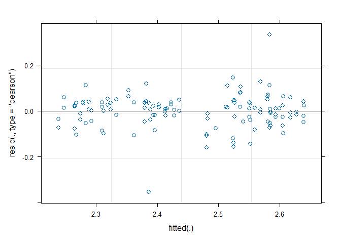<!-- -->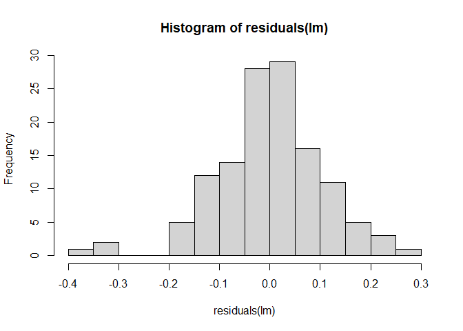<!-- -->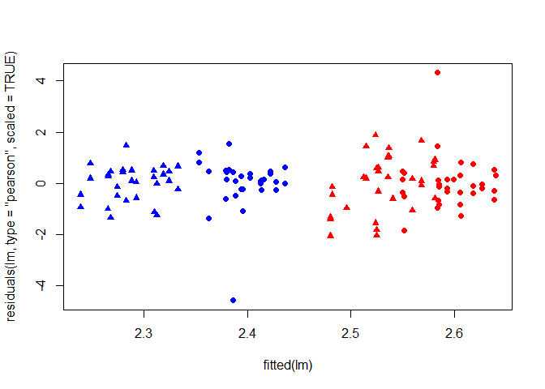<!-- -->

```
## [1] "the number of complete cases is 127"
```

```
## Linear mixed model fit by REML. t-tests use Satterthwaite's method [
## lmerModLmerTest]
## Formula: 
## trait ~ Treatment * Population + Treatment/Chamber + (1 | Population:Line)
##    Data: data
## 
## REML criterion at convergence: -238.6
## 
## Scaled residuals: 
##     Min      1Q  Median      3Q     Max 
## -4.5714 -0.4464  0.1081  0.4762  4.3116 
## 
## Random effects:
##  Groups          Name        Variance  Std.Dev.
##  Population:Line (Intercept) 0.0007804 0.02794 
##  Residual                    0.0059913 0.07740 
## Number of obs: 127, groups:  Population:Line, 16
## 
## Fixed effects:
##                             Estimate Std. Error         df t value Pr(>|t|)    
## (Intercept)                 2.453514   0.010002  14.049693 245.298  < 2e-16 ***
## Treatment1                  0.043342   0.006884 109.894072   6.296 6.43e-09 ***
## Population1                 0.111143   0.010001  14.054733  11.113 2.39e-08 ***
## Treatment1:Population1     -0.011178   0.006884 109.918842  -1.624   0.1073    
## TreatmentCurrent:Chamber1   0.016833   0.009697 109.847568   1.736   0.0854 .  
## TreatmentFuture:Chamber1   -0.022281   0.009782 110.196317  -2.278   0.0247 *  
## ---
## Signif. codes:  0 '***' 0.001 '**' 0.01 '*' 0.05 '.' 0.1 ' ' 1
## 
## Correlation of Fixed Effects:
##             (Intr) Trtmn1 Ppltn1 Tr1:P1 TrC:C1
## Treatment1   0.004                            
## Population1  0.036  0.016                     
## Trtmnt1:Pp1  0.016 -0.005  0.004              
## TrtmntCr:C1 -0.004  0.000 -0.004  0.000       
## TrtmntFt:C1 -0.016  0.011  0.001 -0.014  0.001
```

```
## Computing profile confidence intervals ...
```

<!-- -->

```
##                                  2.5 %       97.5 %
## .sig01                     0.000000000  0.046885570
## .sigma                     0.067052567  0.087054950
## (Intercept)                2.434078195  2.472997266
## Treatment1                 0.029979172  0.056683753
## Population1                0.091710362  0.130624022
## Treatment1:Population1    -0.024542210  0.002163110
## TreatmentCurrent:Chamber1 -0.002099958  0.035539735
## TreatmentFuture:Chamber1  -0.041180405 -0.003226982
```

``` r
sla_anov_22 <- do_anov2(sla_lm_22)
```

```
## Type III Analysis of Variance Table with Satterthwaite's method
##                       Sum Sq Mean Sq NumDF   DenDF  F value    Pr(>F)    
## Treatment            0.25199 0.25199     1 110.096  42.0583 2.598e-09 ***
## Population           0.73997 0.73997     1  14.055 123.5065 2.393e-08 ***
## Treatment:Population 0.01580 0.01580     1 109.919   2.6368   0.10728    
## Treatment:Chamber    0.04918 0.02459     2 110.021   4.1047   0.01909 *  
## ---
## Signif. codes:  0 '***' 0.001 '**' 0.01 '*' 0.05 '.' 0.1 ' ' 1
```

``` r
sla_anov_22$trait <- "l10_SLA"
sla_emmeans_22 <- get_table_bt(sla_lm_22)
```

```
## NOTE: A nesting structure was detected in the fitted model:
##     Chamber %in% Treatment
```

``` r
sla_means_22 <- as.data.frame(sla_emmeans_22)
sla_pairs_22 <- as.data.frame(pairs(sla_emmeans_22))
sla_pairs_22$trait <- "l10_SLA"
```

leaf dry matter content

``` r
# leaf dry matter content
ldmc_lm_22 <- do_lmer2(Dat_2022$l10_LDMC)
```

```
## boundary (singular) fit: see help('isSingular')
```

<!-- --><!-- --><!-- -->

```
## [1] "the number of complete cases is 126"
```

```
## Linear mixed model fit by REML. t-tests use Satterthwaite's method [
## lmerModLmerTest]
## Formula: 
## trait ~ Treatment * Population + Treatment/Chamber + (1 | Population:Line)
##    Data: data
## 
## REML criterion at convergence: -256.5
## 
## Scaled residuals: 
##     Min      1Q  Median      3Q     Max 
## -4.7294 -0.5346 -0.0458  0.3678  6.1353 
## 
## Random effects:
##  Groups          Name        Variance Std.Dev.
##  Population:Line (Intercept) 0.000000 0.00000 
##  Residual                    0.005484 0.07406 
## Number of obs: 126, groups:  Population:Line, 16
## 
## Fixed effects:
##                             Estimate Std. Error         df  t value Pr(>|t|)
## (Intercept)                -0.913647   0.006602 120.000000 -138.394  < 2e-16
## Treatment1                 -0.046595   0.006602 120.000000   -7.058 1.18e-10
## Population1                -0.044355   0.006602 120.000000   -6.719 6.52e-10
## Treatment1:Population1      0.012022   0.006602 120.000000    1.821   0.0711
## TreatmentCurrent:Chamber1  -0.010191   0.009257 120.000000   -1.101   0.2731
## TreatmentFuture:Chamber1    0.022098   0.009415 120.000000    2.347   0.0206
##                              
## (Intercept)               ***
## Treatment1                ***
## Population1               ***
## Treatment1:Population1    .  
## TreatmentCurrent:Chamber1    
## TreatmentFuture:Chamber1  *  
## ---
## Signif. codes:  0 '***' 0.001 '**' 0.01 '*' 0.05 '.' 0.1 ' ' 1
## 
## Correlation of Fixed Effects:
##             (Intr) Trtmn1 Ppltn1 Tr1:P1 TrC:C1
## Treatment1  -0.017                            
## Population1 -0.017  0.017                     
## Trtmnt1:Pp1  0.017 -0.017 -0.017              
## TrtmntCr:C1  0.000  0.000  0.000  0.000       
## TrtmntFt:C1 -0.024  0.024  0.024 -0.024  0.000
## optimizer (nloptwrap) convergence code: 0 (OK)
## boundary (singular) fit: see help('isSingular')
```

```
## Computing profile confidence intervals ...
```

<!-- -->

```
##                                   2.5 %       97.5 %
## .sig01                     0.0000000000  0.023210121
## .sigma                     0.0641891740  0.082201912
## (Intercept)               -0.9263714299 -0.900894634
## Treatment1                -0.0593190851 -0.033870473
## Population1               -0.0570893507 -0.031617033
## Treatment1:Population1    -0.0007018066  0.024746806
## TreatmentCurrent:Chamber1 -0.0280327041  0.007650767
## TreatmentFuture:Chamber1   0.0039515712  0.040245061
```

``` r
ldmc_anov_22 <- do_anov2(ldmc_lm_22)
```

```
## Type III Analysis of Variance Table with Satterthwaite's method
##                        Sum Sq  Mean Sq NumDF DenDF F value    Pr(>F)    
## Treatment            0.251919 0.251919     1   120 45.9357 4.853e-10 ***
## Population           0.247549 0.247549     1   120 45.1389 6.516e-10 ***
## Treatment:Population 0.018188 0.018188     1   120  3.3164   0.07108 .  
## Treatment:Chamber    0.036858 0.018429     2   120  3.3604   0.03802 *  
## ---
## Signif. codes:  0 '***' 0.001 '**' 0.01 '*' 0.05 '.' 0.1 ' ' 1
```

``` r
ldmc_anov_22$trait <- "l10_LDMC"
ldmc_emmeans_22 <- get_table_bt(ldmc_lm_22)
```

```
## NOTE: A nesting structure was detected in the fitted model:
##     Chamber %in% Treatment
```

``` r
ldmc_means_22 <- as.data.frame(ldmc_emmeans_22)
ldmc_pairs_22 <- as.data.frame(pairs(ldmc_emmeans_22))
ldmc_pairs_22$trait <- "l10_LDMC"
```


relative water content

``` r
# relative water content
rwc_lm_22 <- do_lmer2(Dat_2022$RWC)
```

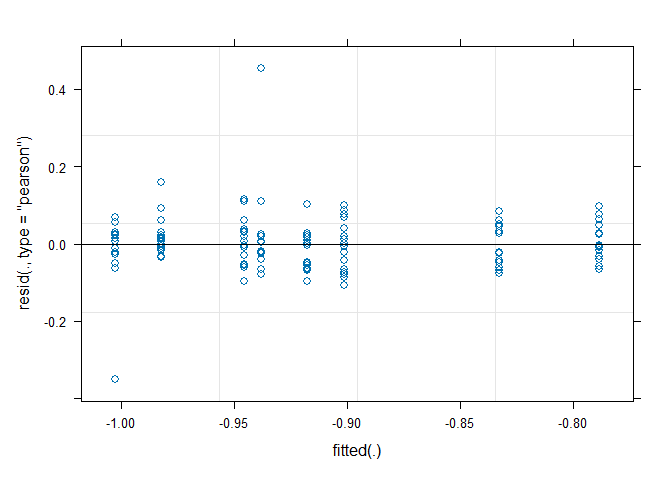<!-- -->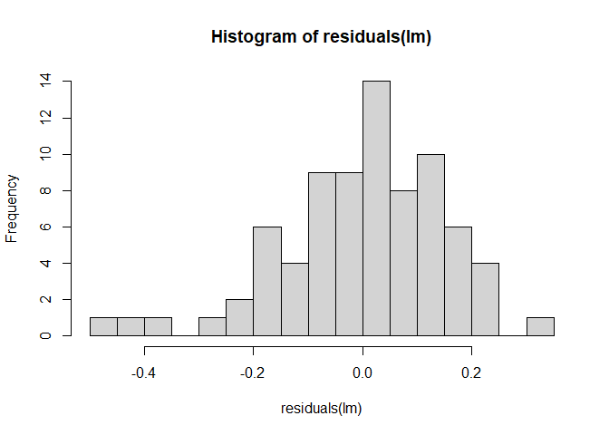<!-- --><!-- -->

```
## [1] "the number of complete cases is 126"
```

```
## Linear mixed model fit by REML. t-tests use Satterthwaite's method [
## lmerModLmerTest]
## Formula: 
## trait ~ Treatment * Population + Treatment/Chamber + (1 | Population:Line)
##    Data: data
## 
## REML criterion at convergence: -431.1
## 
## Scaled residuals: 
##      Min       1Q   Median       3Q      Max 
## -2.41580 -0.58474 -0.02198  0.69105  2.57789 
## 
## Random effects:
##  Groups          Name        Variance  Std.Dev.
##  Population:Line (Intercept) 0.0001425 0.01194 
##  Residual                    0.0011879 0.03447 
## Number of obs: 126, groups:  Population:Line, 16
## 
## Fixed effects:
##                             Estimate Std. Error         df t value Pr(>|t|)    
## (Intercept)                 0.801943   0.004371  13.290880 183.454  < 2e-16 ***
## Treatment1                  0.043575   0.003079 108.392724  14.152  < 2e-16 ***
## Population1                -0.016242   0.004370  13.301770  -3.716  0.00249 ** 
## Treatment1:Population1      0.008633   0.003079 108.444542   2.804  0.00599 ** 
## TreatmentCurrent:Chamber1  -0.007038   0.004317 108.286491  -1.630  0.10598    
## TreatmentFuture:Chamber1    0.002303   0.004395 108.837211   0.524  0.60132    
## ---
## Signif. codes:  0 '***' 0.001 '**' 0.01 '*' 0.05 '.' 0.1 ' ' 1
## 
## Correlation of Fixed Effects:
##             (Intr) Trtmn1 Ppltn1 Tr1:P1 TrC:C1
## Treatment1  -0.003                            
## Population1  0.030  0.022                     
## Trtmnt1:Pp1  0.022 -0.014 -0.003              
## TrtmntCr:C1 -0.004  0.000 -0.004  0.000       
## TrtmntFt:C1 -0.025  0.024  0.010 -0.026  0.001
```

```
## Computing profile confidence intervals ...
```

<!-- -->

```
##                                  2.5 %       97.5 %
## .sig01                     0.000000000  0.020444346
## .sigma                     0.029834895  0.038822226
## (Intercept)                0.793499703  0.810522558
## Treatment1                 0.037593040  0.049541927
## Population1               -0.024698451 -0.007686023
## Treatment1:Population1     0.002628024  0.014581537
## TreatmentCurrent:Chamber1 -0.015454679  0.001304601
## TreatmentFuture:Chamber1  -0.006182233  0.010879932
```

``` r
rwc_anov_22 <- do_anov2(rwc_lm_22)
```

```
## Type III Analysis of Variance Table with Satterthwaite's method
##                        Sum Sq  Mean Sq NumDF   DenDF F value    Pr(>F)    
## Treatment            0.096428 0.096428     1 108.528 81.1781 7.966e-15 ***
## Population           0.016406 0.016406     1  13.302 13.8117  0.002495 ** 
## Treatment:Population 0.009337 0.009337     1 108.445  7.8602  0.005989 ** 
## Treatment:Chamber    0.003485 0.001742     2 108.561  1.4668  0.235200    
## ---
## Signif. codes:  0 '***' 0.001 '**' 0.01 '*' 0.05 '.' 0.1 ' ' 1
```

``` r
rwc_anov_22$trait <- "RWC"
rwc_emmeans_22 <- get_table(rwc_lm_22)
```

```
## NOTE: A nesting structure was detected in the fitted model:
##     Chamber %in% Treatment
```

``` r
rwc_means_22 <- as.data.frame(rwc_emmeans_22)
rwc_pairs_22 <- as.data.frame(pairs(rwc_emmeans_22))
rwc_pairs_22$trait <- "RWC"
```

### Leaf Number

leaf num at 4 weeks (note: not included in manuscript)

``` r
# pre vern leaf number
LN_PreVern_lm_22 <- do_lmer2(Dat_2022$LeafNumber_PreVern)
```

<!-- --><!-- --><!-- -->

```
## [1] "the number of complete cases is 128"
```

```
## Linear mixed model fit by REML. t-tests use Satterthwaite's method [
## lmerModLmerTest]
## Formula: 
## trait ~ Treatment * Population + Treatment/Chamber + (1 | Population:Line)
##    Data: data
## 
## REML criterion at convergence: 457.9
## 
## Scaled residuals: 
##     Min      1Q  Median      3Q     Max 
## -3.0344 -0.5289  0.0761  0.6676  3.3110 
## 
## Random effects:
##  Groups          Name        Variance Std.Dev.
##  Population:Line (Intercept) 2.201    1.483   
##  Residual                    1.504    1.226   
## Number of obs: 128, groups:  Population:Line, 16
## 
## Fixed effects:
##                           Estimate Std. Error       df t value Pr(>|t|)    
## (Intercept)                 8.3089     0.3914  10.4350  21.229 6.34e-10 ***
## Treatment1                 -0.3497     0.1090 104.5071  -3.208  0.00177 ** 
## Population1                 0.1527     0.3914  10.4350   0.390  0.70436    
## Treatment1:Population1     -0.0684     0.1090 104.5071  -0.628  0.53158    
## TreatmentCurrent:Chamber1  -0.0651     0.1540 104.1109  -0.423  0.67344    
## TreatmentFuture:Chamber1    0.1113     0.1544 104.9805   0.721  0.47240    
## ---
## Signif. codes:  0 '***' 0.001 '**' 0.01 '*' 0.05 '.' 0.1 ' ' 1
## 
## Correlation of Fixed Effects:
##             (Intr) Trtmn1 Ppltn1 Tr1:P1 TrC:C1
## Treatment1   0.015                            
## Population1  0.025  0.015                     
## Trtmnt1:Pp1  0.015  0.010  0.015              
## TrtmntCr:C1 -0.004 -0.001 -0.004 -0.001       
## TrtmntFt:C1 -0.014 -0.007 -0.014 -0.007  0.002
```

```
## Computing profile confidence intervals ...
```

<!-- -->

```
##                                2.5 %     97.5 %
## .sig01                     0.8606930  2.1779465
## .sigma                     1.0619229  1.3894972
## (Intercept)                7.5237500  9.0588339
## Treatment1                -0.5590846 -0.1336554
## Population1               -0.6325000  0.9025839
## Treatment1:Population1    -0.2778346  0.1475946
## TreatmentCurrent:Chamber1 -0.3664326  0.2333896
## TreatmentFuture:Chamber1  -0.1944768  0.4080200
```

``` r
LN_PreVern_anov_22 <- do_anov2(LN_PreVern_lm_22)
```

```
## Type III Analysis of Variance Table with Satterthwaite's method
##                       Sum Sq Mean Sq NumDF   DenDF F value Pr(>F)   
## Treatment            12.0887 12.0887     1 105.014  8.0365 0.0055 **
## Population            0.2288  0.2288     1  10.435  0.1521 0.7044   
## Treatment:Population  0.5926  0.5926     1 104.507  0.3940 0.5316   
## Treatment:Chamber     1.0525  0.5262     2 104.545  0.3498 0.7056   
## ---
## Signif. codes:  0 '***' 0.001 '**' 0.01 '*' 0.05 '.' 0.1 ' ' 1
```

``` r
LN_PreVern_anov_22$trait <- "LeafNum_5wks"
LN_PreVern_means_22 <- as.data.frame(get_table(LN_PreVern_lm_22))
```

```
## NOTE: A nesting structure was detected in the fitted model:
##     Chamber %in% Treatment
```

leaf num first week post vern (note: not in final manuscript)

``` r
# june 6 leaf number
LN_Jun6_lm_22 <- do_lmer2(Dat_2022$LeafNumber_Jun6)
```

<!-- -->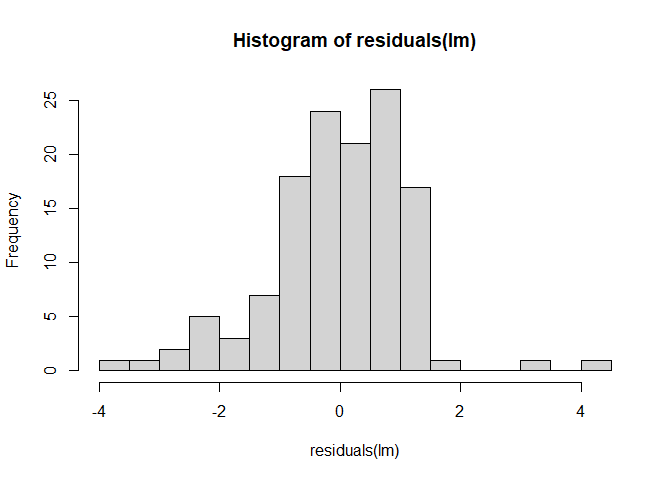<!-- -->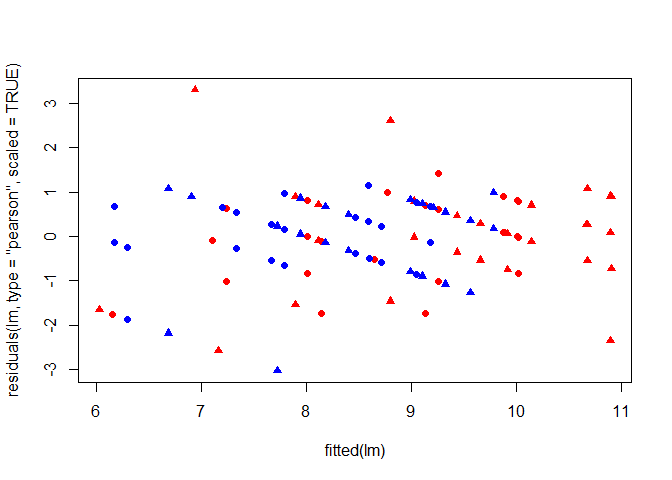<!-- -->

```
## [1] "the number of complete cases is 128"
```

```
## Linear mixed model fit by REML. t-tests use Satterthwaite's method [
## lmerModLmerTest]
## Formula: 
## trait ~ Treatment * Population + Treatment/Chamber + (1 | Population:Line)
##    Data: data
## 
## REML criterion at convergence: 687.5
## 
## Scaled residuals: 
##     Min      1Q  Median      3Q     Max 
## -4.5711 -0.5406  0.1455  0.6114  2.3122 
## 
## Random effects:
##  Groups          Name        Variance Std.Dev.
##  Population:Line (Intercept) 10.20    3.194   
##  Residual                    10.27    3.205   
## Number of obs: 128, groups:  Population:Line, 16
## 
## Fixed effects:
##                            Estimate Std. Error        df t value Pr(>|t|)    
## (Intercept)                20.70341    0.86076  11.21400  24.052 5.27e-11 ***
## Treatment1                 -0.74102    0.28464 105.96361  -2.603   0.0106 *  
## Population1                -0.14034    0.86076  11.21400  -0.163   0.8734    
## Treatment1:Population1      0.16523    0.28464 105.96361   0.580   0.5628    
## TreatmentCurrent:Chamber1  -0.10567    0.40242 105.58551  -0.263   0.7934    
## TreatmentFuture:Chamber1    0.01772    0.40311 106.42316   0.044   0.9650    
## ---
## Signif. codes:  0 '***' 0.001 '**' 0.01 '*' 0.05 '.' 0.1 ' ' 1
## 
## Correlation of Fixed Effects:
##             (Intr) Trtmn1 Ppltn1 Tr1:P1 TrC:C1
## Treatment1   0.015                            
## Population1  0.031  0.015                     
## Trtmnt1:Pp1  0.015  0.009  0.015              
## TrtmntCr:C1 -0.005  0.000 -0.005  0.000       
## TrtmntFt:C1 -0.014 -0.006 -0.014 -0.006  0.002
```

```
## Computing profile confidence intervals ...
```

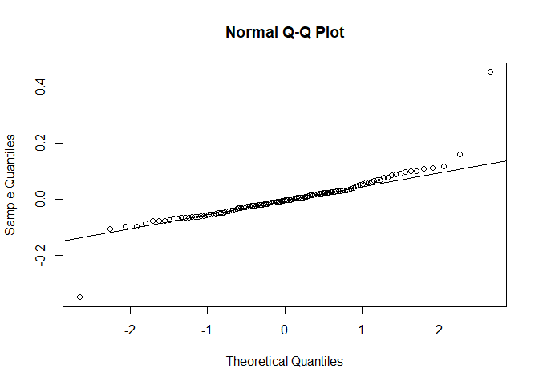<!-- -->

```
##                                2.5 %     97.5 %
## .sig01                     1.8511296  4.7038791
## .sigma                     2.7756684  3.6237341
## (Intercept)               18.9775607 22.3525923
## Treatment1                -1.2886958 -0.1794252
## Population1               -1.8661893  1.5088423
## Treatment1:Population1    -0.3824458  0.7268248
## TreatmentCurrent:Chamber1 -0.8933267  0.6726867
## TreatmentFuture:Chamber1  -0.7761656  0.7938905
```

``` r
LN_Jun6_anov_22 <- do_anov2(LN_Jun6_lm_22)
```

```
## Type III Analysis of Variance Table with Satterthwaite's method
##                      Sum Sq Mean Sq NumDF   DenDF F value  Pr(>F)  
## Treatment            40.696  40.696     1 106.470  3.9617 0.04911 *
## Population            0.273   0.273     1  11.214  0.0266 0.87339  
## Treatment:Population  3.461   3.461     1 105.964  0.3370 0.56282  
## Treatment:Chamber     0.729   0.364     2 106.004  0.0355 0.96517  
## ---
## Signif. codes:  0 '***' 0.001 '**' 0.01 '*' 0.05 '.' 0.1 ' ' 1
```

``` r
LN_Jun6_anov_22$trait <- "LeafNum_9wks"
LN_Jun6_means_22 <- as.data.frame(get_table(LN_Jun6_lm_22))
```

```
## NOTE: A nesting structure was detected in the fitted model:
##     Chamber %in% Treatment
```

leaf num second week post vern (not in final manuscript)

``` r
# june 14 leaf number
LN_Jun13_lm_22 <- do_lmer2(Dat_2022$LeafNumber_Jun13)
```

<!-- --><!-- --><!-- -->

```
## [1] "the number of complete cases is 128"
```

```
## Linear mixed model fit by REML. t-tests use Satterthwaite's method [
## lmerModLmerTest]
## Formula: 
## trait ~ Treatment * Population + Treatment/Chamber + (1 | Population:Line)
##    Data: data
## 
## REML criterion at convergence: 787.3
## 
## Scaled residuals: 
##     Min      1Q  Median      3Q     Max 
## -4.6947 -0.3937  0.0304  0.5628  2.1978 
## 
## Random effects:
##  Groups          Name        Variance Std.Dev.
##  Population:Line (Intercept) 27.34    5.229   
##  Residual                    22.85    4.780   
## Number of obs: 128, groups:  Population:Line, 16
## 
## Fixed effects:
##                           Estimate Std. Error       df t value Pr(>|t|)    
## (Intercept)                27.9230     1.3938  11.1643  20.034 4.19e-10 ***
## Treatment1                 -3.7334     0.4246 105.7419  -8.793 2.94e-14 ***
## Population1                -0.1395     1.3938  11.1643  -0.100    0.922    
## Treatment1:Population1     -0.5460     0.4246 105.7419  -1.286    0.201    
## TreatmentCurrent:Chamber1  -0.0405     0.6002 105.3596  -0.067    0.946    
## TreatmentFuture:Chamber1    0.2454     0.6014 106.2017   0.408    0.684    
## ---
## Signif. codes:  0 '***' 0.001 '**' 0.01 '*' 0.05 '.' 0.1 ' ' 1
## 
## Correlation of Fixed Effects:
##             (Intr) Trtmn1 Ppltn1 Tr1:P1 TrC:C1
## Treatment1   0.015                            
## Population1  0.028  0.015                     
## Trtmnt1:Pp1  0.015  0.010  0.015              
## TrtmntCr:C1 -0.005  0.000 -0.005  0.000       
## TrtmntFt:C1 -0.014 -0.007 -0.014 -0.007  0.002
```

```
## Computing profile confidence intervals ...
```

<!-- -->

```
##                                2.5 %     97.5 %
## .sig01                     3.0779841  7.6605808
## .sigma                     4.1391514  5.4053249
## (Intercept)               25.1324193 30.5952471
## Treatment1                -4.5502752 -2.8952371
## Population1               -2.9300807  2.5327471
## Treatment1:Population1    -1.3627752  0.2922629
## TreatmentCurrent:Chamber1 -1.2145070  1.1211849
## TreatmentFuture:Chamber1  -0.9405559  1.4027367
```

``` r
LN_Jun13_anov_22 <- do_anov2(LN_Jun13_lm_22)
```

```
## Type III Analysis of Variance Table with Satterthwaite's method
##                      Sum Sq Mean Sq NumDF   DenDF F value   Pr(>F)    
## Treatment            948.25  948.25     1 106.241 41.5070 3.51e-09 ***
## Population             0.23    0.23     1  11.164  0.0100   0.9221    
## Treatment:Population  37.77   37.77     1 105.742  1.6534   0.2013    
## Treatment:Chamber      3.91    1.96     2 105.780  0.0856   0.9180    
## ---
## Signif. codes:  0 '***' 0.001 '**' 0.01 '*' 0.05 '.' 0.1 ' ' 1
```

``` r
LN_Jun13_anov_22$trait <- "LeafNum_10wks"
LN_Jun13_means_22 <- as.data.frame(get_table(LN_Jun13_lm_22))
```

```
## NOTE: A nesting structure was detected in the fitted model:
##     Chamber %in% Treatment
```

leaf num at bolting

``` r
# total leaf number counted at bolting when plants were harvested
LN_bolt_lm_22 <- do_lmer2(Dat_2022$l10_LeafNumber_Total)
```

<!-- --><!-- -->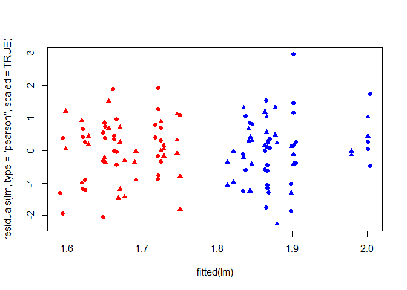<!-- -->

```
## [1] "the number of complete cases is 127"
```

```
## Linear mixed model fit by REML. t-tests use Satterthwaite's method [
## lmerModLmerTest]
## Formula: 
## trait ~ Treatment * Population + Treatment/Chamber + (1 | Population:Line)
##    Data: data
## 
## REML criterion at convergence: -229.8
## 
## Scaled residuals: 
##      Min       1Q   Median       3Q      Max 
## -2.26097 -0.58772  0.04958  0.60793  2.96092 
## 
## Random effects:
##  Groups          Name        Variance Std.Dev.
##  Population:Line (Intercept) 0.003048 0.05521 
##  Residual                    0.005813 0.07625 
## Number of obs: 127, groups:  Population:Line, 16
## 
## Fixed effects:
##                             Estimate Std. Error         df t value Pr(>|t|)    
## (Intercept)                 1.774185   0.015689  14.205284 113.084  < 2e-16 ***
## Treatment1                 -0.001106   0.006795 108.794740  -0.163    0.871    
## Population1                -0.105678   0.015687  14.203556  -6.737 8.84e-06 ***
## Treatment1:Population1     -0.007202   0.006796 108.830424  -1.060    0.292    
## TreatmentCurrent:Chamber1  -0.001558   0.009568 108.530307  -0.163    0.871    
## TreatmentFuture:Chamber1   -0.010752   0.009663 109.207094  -1.113    0.268    
## ---
## Signif. codes:  0 '***' 0.001 '**' 0.01 '*' 0.05 '.' 0.1 ' ' 1
## 
## Correlation of Fixed Effects:
##             (Intr) Trtmn1 Ppltn1 Tr1:P1 TrC:C1
## Treatment1   0.011                            
## Population1  0.038  0.019                     
## Trtmnt1:Pp1  0.019 -0.001  0.011              
## TrtmntCr:C1 -0.005  0.000 -0.005  0.000       
## TrtmntFt:C1 -0.019  0.008 -0.008 -0.017  0.001
```

```
## Computing profile confidence intervals ...
```

<!-- -->

```
##                                 2.5 %       97.5 %
## .sig01                     0.03241696  0.081025806
## .sigma                     0.06602341  0.085829392
## (Intercept)                1.74345411  1.804561062
## Treatment1                -0.01427859  0.012088211
## Population1               -0.13637868 -0.075286407
## Treatment1:Population1    -0.02035184  0.006020632
## TreatmentCurrent:Chamber1 -0.02011290  0.017016900
## TreatmentFuture:Chamber1  -0.02956340  0.007935385
```

``` r
LN_bolt_anov_22 <- do_anov2(LN_bolt_lm_22)
```

```
## Type III Analysis of Variance Table with Satterthwaite's method
##                        Sum Sq  Mean Sq NumDF   DenDF F value   Pr(>F)    
## Treatment            0.000772 0.000772     1 109.163  0.1328   0.7163    
## Population           0.263839 0.263839     1  14.204 45.3842 8.84e-06 ***
## Treatment:Population 0.006530 0.006530     1 108.830  1.1232   0.2916    
## Treatment:Chamber    0.007349 0.003674     2 108.867  0.6321   0.5334    
## ---
## Signif. codes:  0 '***' 0.001 '**' 0.01 '*' 0.05 '.' 0.1 ' ' 1
```

``` r
LN_bolt_anov_22$trait <- "l10_LeafNumb_bolting"
LN_bolt_emmeans_22 <- get_table_bt(LN_bolt_lm_22)
```

```
## NOTE: A nesting structure was detected in the fitted model:
##     Chamber %in% Treatment
```

``` r
LN_bolt_means_22<- as.data.frame(LN_bolt_emmeans_22)
LN_bolt_pairs_22 <- as.data.frame(pairs(LN_bolt_emmeans_22))
LN_bolt_pairs_22$trait <- "l10_LeafNumb_bolting"
```

Not analyzing rosette leaf number or under leaves because this split was started partway through the experiment.

### Biomass

above ground biomass

``` r
# above ground biomass (same as rosette biomass)
AG_lm_22 <- do_lmer2(Dat_2022$l10_AG_DryBiomass)
```

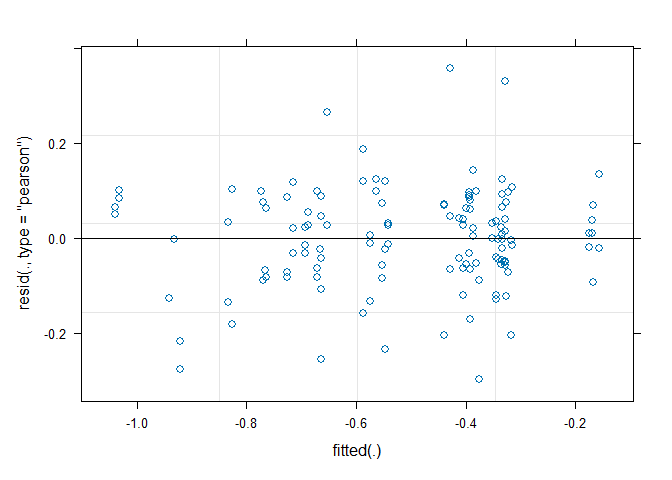<!-- --><!-- -->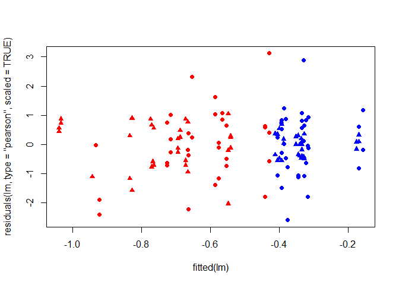<!-- -->

```
## [1] "the number of complete cases is 127"
```

```
## Linear mixed model fit by REML. t-tests use Satterthwaite's method [
## lmerModLmerTest]
## Formula: 
## trait ~ Treatment * Population + Treatment/Chamber + (1 | Population:Line)
##    Data: data
## 
## REML criterion at convergence: -120.6
## 
## Scaled residuals: 
##      Min       1Q   Median       3Q      Max 
## -2.59163 -0.52416  0.05903  0.61737  3.11954 
## 
## Random effects:
##  Groups          Name        Variance Std.Dev.
##  Population:Line (Intercept) 0.01698  0.1303  
##  Residual                    0.01314  0.1146  
## Number of obs: 127, groups:  Population:Line, 16
## 
## Fixed effects:
##                            Estimate Std. Error        df t value Pr(>|t|)    
## (Intercept)                -0.53060    0.03461  13.01310 -15.330 1.04e-09 ***
## Treatment1                  0.02970    0.01023 106.93364   2.903  0.00449 ** 
## Population1                -0.19595    0.03461  13.00997  -5.662 7.75e-05 ***
## Treatment1:Population1      0.02497    0.01023 106.96972   2.440  0.01632 *  
## TreatmentCurrent:Chamber1  -0.00562    0.01440 106.60158  -0.390  0.69703    
## TreatmentFuture:Chamber1    0.00325    0.01456 107.39808   0.223  0.82376    
## ---
## Signif. codes:  0 '***' 0.001 '**' 0.01 '*' 0.05 '.' 0.1 ' ' 1
## 
## Correlation of Fixed Effects:
##             (Intr) Trtmn1 Ppltn1 Tr1:P1 TrC:C1
## Treatment1   0.012                            
## Population1  0.026  0.017                     
## Trtmnt1:Pp1  0.018  0.001  0.012              
## TrtmntCr:C1 -0.004  0.000 -0.004 -0.001       
## TrtmntFt:C1 -0.018  0.006 -0.011 -0.020  0.002
```

```
## Computing profile confidence intervals ...
```

<!-- -->

```
##                                  2.5 %      97.5 %
## .sig01                     0.082072636  0.18729355
## .sigma                     0.099228879  0.12928382
## (Intercept)               -0.598980003 -0.46385361
## Treatment1                 0.009953920  0.04971060
## Population1               -0.264326661 -0.12921510
## Treatment1:Population1     0.005223505  0.04498747
## TreatmentCurrent:Chamber1 -0.033527101  0.02239162
## TreatmentFuture:Chamber1  -0.025293696  0.03130687
```

``` r
AG_anov_22 <- do_anov2(AG_lm_22)
```

```
## Type III Analysis of Variance Table with Satterthwaite's method
##                       Sum Sq Mean Sq NumDF  DenDF F value    Pr(>F)    
## Treatment            0.04025 0.04025     1 107.36  3.0630   0.08295 .  
## Population           0.42132 0.42132     1  13.01 32.0605 7.747e-05 ***
## Treatment:Population 0.07825 0.07825     1 106.97  5.9548   0.01632 *  
## Treatment:Chamber    0.00266 0.00133     2 107.00  0.1013   0.90378    
## ---
## Signif. codes:  0 '***' 0.001 '**' 0.01 '*' 0.05 '.' 0.1 ' ' 1
```

``` r
AG_anov_22$trait <- "l10_Above Ground Biomass"
AG_emmeans_22 <- get_table_bt(AG_lm_22)
```

```
## NOTE: A nesting structure was detected in the fitted model:
##     Chamber %in% Treatment
```

``` r
AG_means_22 <- as.data.frame(AG_emmeans_22)
AG_pairs_22 <- as.data.frame(pairs(AG_emmeans_22))
AG_pairs_22$trait <- "l10_Above Ground Biomass"
## also has SQR transformation -interaction gets a little weaker
#AG_lm_22SQR <- do_lmer2(Dat_2022$SQR_AG_DryBiomass)
#AG_anov_22SQR <- do_anov2(AG_lm_22SQR)
#AG_anov_22SQR$trait <- "SQR_Above Ground Biomass"
```

below ground biomass

``` r
# below ground biomass
BG_lm_22 <- do_lmer2(Dat_2022$BG_DryBiomass)
```

<!-- --><!-- --><!-- -->

```
## [1] "the number of complete cases is 127"
```

```
## Linear mixed model fit by REML. t-tests use Satterthwaite's method [
## lmerModLmerTest]
## Formula: 
## trait ~ Treatment * Population + Treatment/Chamber + (1 | Population:Line)
##    Data: data
## 
## REML criterion at convergence: -675.7
## 
## Scaled residuals: 
##     Min      1Q  Median      3Q     Max 
## -2.2316 -0.5640 -0.0698  0.5048  4.3594 
## 
## Random effects:
##  Groups          Name        Variance  Std.Dev.
##  Population:Line (Intercept) 6.057e-05 0.007783
##  Residual                    1.493e-04 0.012217
## Number of obs: 127, groups:  Population:Line, 16
## 
## Fixed effects:
##                             Estimate Std. Error         df t value Pr(>|t|)    
## (Intercept)                4.410e-02  2.276e-03  1.439e+01  19.373 1.04e-11 ***
## Treatment1                 3.281e-03  1.088e-03  1.092e+02   3.014   0.0032 ** 
## Population1               -1.225e-02  2.276e-03  1.438e+01  -5.383 8.79e-05 ***
## Treatment1:Population1     5.955e-04  1.088e-03  1.092e+02   0.547   0.5854    
## TreatmentCurrent:Chamber1 -1.801e-03  1.533e-03  1.089e+02  -1.175   0.2426    
## TreatmentFuture:Chamber1  -8.509e-04  1.547e-03  1.096e+02  -0.550   0.5835    
## ---
## Signif. codes:  0 '***' 0.001 '**' 0.01 '*' 0.05 '.' 0.1 ' ' 1
## 
## Correlation of Fixed Effects:
##             (Intr) Trtmn1 Ppltn1 Tr1:P1 TrC:C1
## Treatment1   0.010                            
## Population1  0.040  0.019                     
## Trtmnt1:Pp1  0.019 -0.002  0.010              
## TrtmntCr:C1 -0.005  0.000 -0.005  0.000       
## TrtmntFt:C1 -0.019  0.009 -0.007 -0.016  0.001
```

```
## Computing profile confidence intervals ...
```

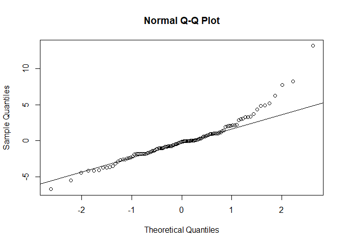<!-- -->

```
##                                  2.5 %       97.5 %
## .sig01                     0.004391222  0.011580680
## .sigma                     0.010579878  0.013746425
## (Intercept)                0.039621781  0.048490529
## Treatment1                 0.001175239  0.005398136
## Population1               -0.016723355 -0.007856030
## Treatment1:Population1    -0.001509924  0.002713352
## TreatmentCurrent:Chamber1 -0.004769008  0.001177901
## TreatmentFuture:Chamber1  -0.003867158  0.002137839
```

``` r
BG_anov_22 <- do_anov2(BG_lm_22)
```

```
## Type III Analysis of Variance Table with Satterthwaite's method
##                         Sum Sq   Mean Sq NumDF   DenDF F value    Pr(>F)    
## Treatment            0.0004992 0.0004992     1 109.501  3.3447   0.07014 .  
## Population           0.0043246 0.0043246     1  14.385 28.9749 8.793e-05 ***
## Treatment:Population 0.0000447 0.0000447     1 109.203  0.2993   0.58543    
## Treatment:Chamber    0.0002509 0.0001255     2 109.245  0.8406   0.43422    
## ---
## Signif. codes:  0 '***' 0.001 '**' 0.01 '*' 0.05 '.' 0.1 ' ' 1
```

``` r
BG_anov_22$trait <- "Below Ground Biomass"
BG_emmeans_22 <- get_table(BG_lm_22)
```

```
## NOTE: A nesting structure was detected in the fitted model:
##     Chamber %in% Treatment
```

``` r
BG_means_22 <- as.data.frame(BG_emmeans_22)
BG_pairs_22 <- as.data.frame(pairs(BG_emmeans_22))
BG_pairs_22$trait <- "Below Ground Biomass"
### also has SQR transformation; non significance changes
#BG_lm_22SQR <- do_lmer2(Dat_2022$SQR_BG_DryBiomass)
#BG_anov_22SQR <- do_anov2(BG_lm_22SQR)
#BG_anov_22SQR$trait <- "SQR_Below Ground Biomass"
```

Root to shoot ration (below ground / above ground)

``` r
# Root to Shoot ratio
RS_lm_22 <- do_lmer2(Dat_2022$l10_Root_to_Shoot)
```

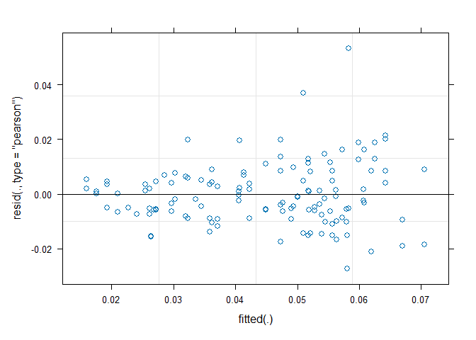<!-- -->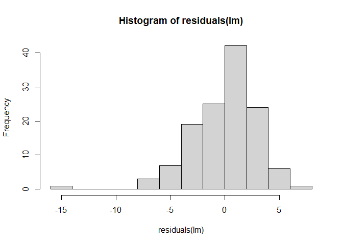<!-- --><!-- -->

```
## [1] "the number of complete cases is 127"
```

```
## Linear mixed model fit by REML. t-tests use Satterthwaite's method [
## lmerModLmerTest]
## Formula: 
## trait ~ Treatment * Population + Treatment/Chamber + (1 | Population:Line)
##    Data: data
## 
## REML criterion at convergence: -308.8
## 
## Scaled residuals: 
##      Min       1Q   Median       3Q      Max 
## -2.62345 -0.56122  0.05564  0.59296  2.60167 
## 
## Random effects:
##  Groups          Name        Variance Std.Dev.
##  Population:Line (Intercept) 0.002330 0.04827 
##  Residual                    0.002909 0.05393 
## Number of obs: 127, groups:  Population:Line, 16
## 
## Fixed effects:
##                             Estimate Std. Error         df t value Pr(>|t|)    
## (Intercept)                -0.875248   0.013212  13.543103 -66.245  < 2e-16 ***
## Treatment1                 -0.002563   0.004809 107.833220  -0.533  0.59526    
## Population1                 0.052948   0.013211  13.540354   4.008  0.00138 ** 
## Treatment1:Population1     -0.015004   0.004810 107.870814  -3.119  0.00232 ** 
## TreatmentCurrent:Chamber1  -0.006003   0.006770 107.517251  -0.887  0.37727    
## TreatmentFuture:Chamber1   -0.008126   0.006842 108.292219  -1.188  0.23757    
## ---
## Signif. codes:  0 '***' 0.001 '**' 0.01 '*' 0.05 '.' 0.1 ' ' 1
## 
## Correlation of Fixed Effects:
##             (Intr) Trtmn1 Ppltn1 Tr1:P1 TrC:C1
## Treatment1   0.012                            
## Population1  0.033  0.018                     
## Trtmnt1:Pp1  0.019  0.000  0.012              
## TrtmntCr:C1 -0.005  0.000 -0.005  0.000       
## TrtmntFt:C1 -0.019  0.007 -0.010 -0.018  0.002
```

```
## Computing profile confidence intervals ...
```

<!-- -->

```
##                                 2.5 %       97.5 %
## .sig01                     0.02967421  0.070092456
## .sigma                     0.04669147  0.060763485
## (Intercept)               -0.90070215 -0.849129278
## Treatment1                -0.01195666  0.006723307
## Population1                0.02749790  0.079064403
## Treatment1:Population1    -0.02439909 -0.005716967
## TreatmentCurrent:Chamber1 -0.01914064  0.007144826
## TreatmentFuture:Chamber1  -0.02134209  0.005225668
```

``` r
RS_anov_22 <- do_anov2(RS_lm_22)
```

```
## Type III Analysis of Variance Table with Satterthwaite's method
##                        Sum Sq  Mean Sq NumDF  DenDF F value   Pr(>F)   
## Treatment            0.000142 0.000142     1 108.25  0.0490 0.825297   
## Population           0.046725 0.046725     1  13.54 16.0642 0.001379 **
## Treatment:Population 0.028303 0.028303     1 107.87  9.7305 0.002325 **
## Treatment:Chamber    0.006380 0.003190     2 107.90  1.0967 0.337676   
## ---
## Signif. codes:  0 '***' 0.001 '**' 0.01 '*' 0.05 '.' 0.1 ' ' 1
```

``` r
RS_anov_22$trait <- "l10_Root to Shoot Ratio"
RS_emmeans_22 <- get_table_bt(RS_lm_22)
```

```
## NOTE: A nesting structure was detected in the fitted model:
##     Chamber %in% Treatment
```

``` r
RS_means_22 <- as.data.frame(RS_emmeans_22)
RS_pairs_22 <- as.data.frame(pairs(RS_emmeans_22))
RS_pairs_22$trait <- "l10_Root to Shoot Ratio"
```


### Stomatal Density

``` r
# stomatal density - imaged on harvest day
sto_den_lm_22 <- do_lmer2(Dat_2022$l10_Stomata_density)
```

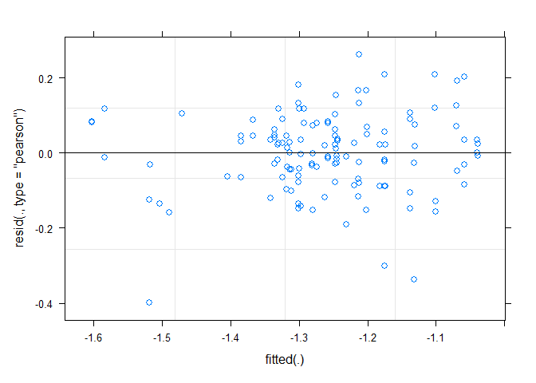<!-- -->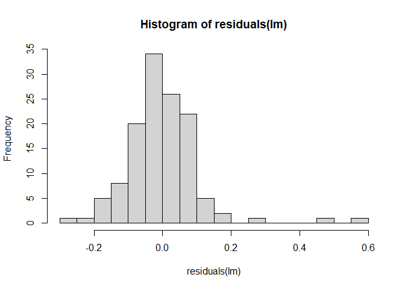<!-- --><!-- -->

```
## [1] "the number of complete cases is 127"
```

```
## Linear mixed model fit by REML. t-tests use Satterthwaite's method [
## lmerModLmerTest]
## Formula: 
## trait ~ Treatment * Population + Treatment/Chamber + (1 | Population:Line)
##    Data: data
## 
## REML criterion at convergence: -299.6
## 
## Scaled residuals: 
##     Min      1Q  Median      3Q     Max 
## -2.3586 -0.6030 -0.0011  0.5991  3.6672 
## 
## Random effects:
##  Groups          Name        Variance Std.Dev.
##  Population:Line (Intercept) 0.001170 0.03421 
##  Residual                    0.003383 0.05816 
## Number of obs: 127, groups:  Population:Line, 16
## 
## Fixed effects:
##                             Estimate Std. Error         df t value Pr(>|t|)    
## (Intercept)                 2.765004   0.010214  13.393049 270.720  < 2e-16 ***
## Treatment1                 -0.020502   0.005180 108.428073  -3.958 0.000135 ***
## Population1                -0.030335   0.010212  13.393007  -2.971 0.010542 *  
## Treatment1:Population1      0.003031   0.005180 108.463193   0.585 0.559669    
## TreatmentCurrent:Chamber1   0.005461   0.007295 108.212670   0.749 0.455691    
## TreatmentFuture:Chamber1    0.001724   0.007364 108.815721   0.234 0.815344    
## ---
## Signif. codes:  0 '***' 0.001 '**' 0.01 '*' 0.05 '.' 0.1 ' ' 1
## 
## Correlation of Fixed Effects:
##             (Intr) Trtmn1 Ppltn1 Tr1:P1 TrC:C1
## Treatment1   0.009                            
## Population1  0.041  0.018                     
## Trtmnt1:Pp1  0.019 -0.003  0.010              
## TrtmntCr:C1 -0.005  0.000 -0.005  0.000       
## TrtmntFt:C1 -0.018  0.009 -0.006 -0.016  0.001
```

```
## Computing profile confidence intervals ...
```

<!-- -->

```
##                                  2.5 %      97.5 %
## .sig01                     0.017716412  0.05195990
## .sigma                     0.050364286  0.06551283
## (Intercept)                2.745101417  2.78487629
## Treatment1                -0.030538747 -0.01043163
## Population1               -0.050248565 -0.01047892
## Treatment1:Population1    -0.007021201  0.01308637
## TreatmentCurrent:Chamber1 -0.008611128  0.01972901
## TreatmentFuture:Chamber1  -0.012633925  0.01595629
```

``` r
sto_den_anov_22 <- do_anov2(sto_den_lm_22)
```

```
## Type III Analysis of Variance Table with Satterthwaite's method
##                         Sum Sq   Mean Sq NumDF   DenDF F value  Pr(>F)  
## Treatment            0.0220343 0.0220343     1 108.759  6.5139 0.01209 *
## Population           0.0298484 0.0298484     1  13.393  8.8239 0.01054 *
## Treatment:Population 0.0011582 0.0011582     1 108.463  0.3424 0.55967  
## Treatment:Chamber    0.0020797 0.0010399     2 108.513  0.3074 0.73599  
## ---
## Signif. codes:  0 '***' 0.001 '**' 0.01 '*' 0.05 '.' 0.1 ' ' 1
```

``` r
sto_den_anov_22$trait <- "l10_Stomatal Density"
sto_den_emmeans_22 <- get_table_bt(sto_den_lm_22)
```

```
## NOTE: A nesting structure was detected in the fitted model:
##     Chamber %in% Treatment
```

``` r
sto_den_means_22 <- as.data.frame(sto_den_emmeans_22)
sto_den_pairs_22 <- as.data.frame(pairs(sto_den_emmeans_22))
sto_den_pairs_22$trait <- "l10_Stomatal Density"

# check results don't change if using stomatal average
do_anov2(do_lmer2(Dat_2022$l10_Stomata_avg))
```

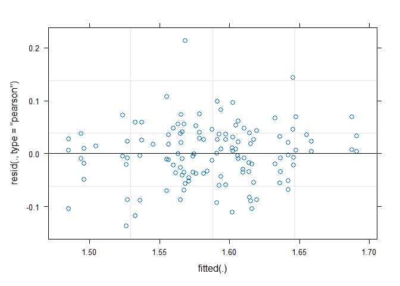<!-- --><!-- --><!-- -->

```
## [1] "the number of complete cases is 127"
```

```
## Linear mixed model fit by REML. t-tests use Satterthwaite's method [
## lmerModLmerTest]
## Formula: 
## trait ~ Treatment * Population + Treatment/Chamber + (1 | Population:Line)
##    Data: data
## 
## REML criterion at convergence: -299.6
## 
## Scaled residuals: 
##     Min      1Q  Median      3Q     Max 
## -2.3586 -0.6030 -0.0011  0.5991  3.6672 
## 
## Random effects:
##  Groups          Name        Variance Std.Dev.
##  Population:Line (Intercept) 0.001170 0.03421 
##  Residual                    0.003383 0.05816 
## Number of obs: 127, groups:  Population:Line, 16
## 
## Fixed effects:
##                             Estimate Std. Error         df t value Pr(>|t|)    
## (Intercept)                 1.585336   0.010214  13.393049 155.219  < 2e-16 ***
## Treatment1                 -0.020502   0.005180 108.428073  -3.958 0.000135 ***
## Population1                -0.030335   0.010212  13.393007  -2.971 0.010542 *  
## Treatment1:Population1      0.003031   0.005180 108.463193   0.585 0.559669    
## TreatmentCurrent:Chamber1   0.005461   0.007295 108.212670   0.749 0.455691    
## TreatmentFuture:Chamber1    0.001724   0.007364 108.815721   0.234 0.815344    
## ---
## Signif. codes:  0 '***' 0.001 '**' 0.01 '*' 0.05 '.' 0.1 ' ' 1
## 
## Correlation of Fixed Effects:
##             (Intr) Trtmn1 Ppltn1 Tr1:P1 TrC:C1
## Treatment1   0.009                            
## Population1  0.041  0.018                     
## Trtmnt1:Pp1  0.019 -0.003  0.010              
## TrtmntCr:C1 -0.005  0.000 -0.005  0.000       
## TrtmntFt:C1 -0.018  0.009 -0.006 -0.016  0.001
```

```
## Computing profile confidence intervals ...
```

<!-- -->

```
##                                  2.5 %      97.5 %
## .sig01                     0.017716412  0.05195990
## .sigma                     0.050364286  0.06551283
## (Intercept)                1.565434262  1.60520914
## Treatment1                -0.030538747 -0.01043163
## Population1               -0.050248565 -0.01047892
## Treatment1:Population1    -0.007021201  0.01308637
## TreatmentCurrent:Chamber1 -0.008611128  0.01972901
## TreatmentFuture:Chamber1  -0.012633925  0.01595629
## Type III Analysis of Variance Table with Satterthwaite's method
##                         Sum Sq   Mean Sq NumDF   DenDF F value  Pr(>F)  
## Treatment            0.0220343 0.0220343     1 108.759  6.5139 0.01209 *
## Population           0.0298484 0.0298484     1  13.393  8.8239 0.01054 *
## Treatment:Population 0.0011582 0.0011582     1 108.463  0.3424 0.55967  
## Treatment:Chamber    0.0020797 0.0010399     2 108.513  0.3074 0.73599  
## ---
## Signif. codes:  0 '***' 0.001 '**' 0.01 '*' 0.05 '.' 0.1 ' ' 1
```

```
##                           Sum Sq     Mean Sq NumDF     DenDF   F value
## Treatment            0.022034327 0.022034327     1 108.75907 6.5138865
## Population           0.029848386 0.029848386     1  13.39301 8.8239135
## Treatment:Population 0.001158188 0.001158188     1 108.46319 0.3423887
## Treatment:Chamber    0.002079714 0.001039857     2 108.51306 0.3074072
##                          Pr(>F)  exp
## Treatment            0.01209153 2022
## Population           0.01054210 2022
## Treatment:Population 0.55966904 2022
## Treatment:Chamber    0.73598935 2022
```

### Outputs

1) results table


``` r
AnovaResults_2022 <- rbind(emergence_anov_22, bolting_anov_22, fresh_anov_22, hyd_anov_22, dry_anov_22, area_anov_22, per_anov_22, sla_anov_22, ldmc_anov_22, rwc_anov_22, LN_PreVern_anov_22, LN_Jun6_anov_22, LN_Jun13_anov_22, LN_bolt_anov_22, AG_anov_22, BG_anov_22, RS_anov_22, sto_den_anov_22 )

write.csv(AnovaResults_2022, file = "data/AnovaResults_2022.csv", row.names = TRUE)
```

2) All the tables to read in to the figures code


``` r
# change column names
dfs3 <- c("bolting_means_22", "dry_means_22", "area_means_22", "per_means_22", "rwc_means_22", "LN_PreVern_means_22", "LN_Jun6_means_22", "LN_Jun13_means_22", "BG_means_22", "emergence_means_22", "fresh_means_22", "hyd_means_22", "sla_means_22", "ldmc_means_22", "LN_bolt_means_22", "AG_means_22", "RS_means_22", "sto_den_means_22")

for (i in dfs3) {
  x=get(i)
  colnames(x) <- c("Treatment", "Population", "Mean", "SE", "Df", "LL_95", "UL_95")
  assign(i,x)
}


# create list of data frames
Means_2022 <- list(emergence_means_22, bolting_means_22, fresh_means_22, hyd_means_22, dry_means_22, area_means_22, per_means_22, sla_means_22, ldmc_means_22, rwc_means_22, LN_PreVern_means_22, LN_Jun6_means_22, LN_Jun13_means_22, LN_bolt_means_22, AG_means_22, BG_means_22, RS_means_22, sto_den_means_22)

# name that list
names(Means_2022) <- c("emergence_means_22", "bolting_means_22", "fresh_means_22", "hyd_means_22", "dry_means_22", "area_means_22", "per_means_22", "sla_means_22", "ldmc_means_22", "rwc_means_22", "LN_PreVern_means_22", "LN_Jun6_means_22", "LN_Jun13_means_22", "LN_bolt_means_22", "AG_means_22", "BG_means_22", "RS_means_22", "sto_den_means_22")

# save named list
save(Means_2022, file = "data/ModelMeans_2022.robj")
```

3) Post hoc test results

``` r
PostHoc_2022 <- rbind(bolting_pairs_22, fresh_pairs_22, hyd_pairs_22, dry_pairs_22, area_pairs_22, per_pairs_22, sla_pairs_22, ldmc_pairs_22, rwc_pairs_22, LN_bolt_pairs_22, AG_pairs_22, BG_pairs_22, RS_pairs_22, sto_den_pairs_22 )

write.csv(PostHoc_2022, file = "data/PostHoc_2022.csv", row.names = TRUE)
```

## Sample size information

The goal here is to know how many lines and how many replicates per line for this experiment.


``` r
# sample size of 2022 total
Dat_2022 %>% count(Treatment)
```

```
##   Treatment  n
## 1   Current 64
## 2    Future 64
```

``` r
# 64 plants in both
Dat_2022 %>% count(Treatment, Population)
```

```
##   Treatment Population  n
## 1   Current          B 32
## 2   Current          R 32
## 3    Future          B 32
## 4    Future          R 32
```

``` r
# 32 in each group

# from models know that there are 16 unique lines. 8 IT, 8 SW. ( but 1 line fully died in IT cur)

n_2022 <- Dat_2022 %>%
  group_by(Treatment) %>%
  group_by(Population, .add = TRUE) %>%
  group_by(Line, .add = TRUE) %>%
  count

n_2022 %>% 
  group_by(Treatment) %>%
  summarize(min = min(n), mean = mean(n), median = median(n), max = max(n))
```

```
## # A tibble: 2 × 5
##   Treatment   min  mean median   max
##   <fct>     <int> <dbl>  <dbl> <int>
## 1 Current       1  4.27      4     6
## 2 Future        1  4         4     6
```

``` r
n_2022 %>% 
  group_by(Treatment) %>%
  group_by(Population, .add = TRUE) %>%
  summarize(min = min(n), mean = mean(n), median = median(n), max = max(n))
```

```
## `summarise()` has grouped output by 'Treatment'. You can override using the
## `.groups` argument.
```

```
## # A tibble: 4 × 6
## # Groups:   Treatment [2]
##   Treatment Population   min  mean median   max
##   <fct>     <fct>      <int> <dbl>  <dbl> <int>
## 1 Current   B              1  4.57    5       6
## 2 Current   R              4  4       4       4
## 3 Future    B              1  4       4.5     6
## 4 Future    R              4  4       4       4
```

# Notes
The AnovaResults_YEAR files that were output have been copied over to the data/ModelResults.xlsx on 8/2/2024 to make formatting changes and color code for easier comparison and analysis. This was repeated on 7/22/2025 to update with the emmeans package outputs.

The spreadsheet is color coded so p values below 0.05 are green, between 0.1 and 0.05 are orange, and others are left white. The model terms are red if there is disagreement in significance between experiments for traits that were measured in both experiments. There is a post hoc results spreadsheet as well which is included in the tables for the manuscript.


# Results Tables
These tables were not ultimately used

## Main Text Tables - auto formatted options

``` r
sjPlot::tab_model(eTof_lm_21, RWC_lm_21, rwc_lm_22, sto_den_lm_22, SLA_lm_21, sla_lm_22, RS_lm_22 ,  fitness_lm_21, 
                   collapse.ci = TRUE, 
                  dv.labels = c("Emergence To Flower 21", "RWC 21", "RWC 22", "Stomatal Density 22","SLA 21", "SLA 22",  "Root-to-Shoot 22", "Fitness 21"), 
                 pred.labels = c("(Intercept)", "Treatment", "Population", "Trt x Pop Interaction", "Current Trt x Chamber", "Future Trt x Chamber")
                 
        )
```

<table style="border-collapse:collapse; border:none;">
<tr>
<th style="border-top: double; text-align:center; font-style:normal; font-weight:bold; padding:0.2cm;  text-align:left; ">&nbsp;</th>
<th colspan="2" style="border-top: double; text-align:center; font-style:normal; font-weight:bold; padding:0.2cm; ">Emergence To Flower 21</th>
<th colspan="2" style="border-top: double; text-align:center; font-style:normal; font-weight:bold; padding:0.2cm; ">RWC 21</th>
<th colspan="2" style="border-top: double; text-align:center; font-style:normal; font-weight:bold; padding:0.2cm; ">RWC 22</th>
<th colspan="2" style="border-top: double; text-align:center; font-style:normal; font-weight:bold; padding:0.2cm; ">Stomatal Density 22</th>
<th colspan="2" style="border-top: double; text-align:center; font-style:normal; font-weight:bold; padding:0.2cm; ">SLA 21</th>
<th colspan="2" style="border-top: double; text-align:center; font-style:normal; font-weight:bold; padding:0.2cm; ">SLA 22</th>
<th colspan="2" style="border-top: double; text-align:center; font-style:normal; font-weight:bold; padding:0.2cm; ">Root-to-Shoot 22</th>
<th colspan="2" style="border-top: double; text-align:center; font-style:normal; font-weight:bold; padding:0.2cm; ">Fitness 21</th>
</tr>
<tr>
<td style=" text-align:center; border-bottom:1px solid; font-style:italic; font-weight:normal;  text-align:left; ">Predictors</td>
<td style=" text-align:center; border-bottom:1px solid; font-style:italic; font-weight:normal;  ">Estimates</td>
<td style=" text-align:center; border-bottom:1px solid; font-style:italic; font-weight:normal;  ">p</td>
<td style=" text-align:center; border-bottom:1px solid; font-style:italic; font-weight:normal;  ">Estimates</td>
<td style=" text-align:center; border-bottom:1px solid; font-style:italic; font-weight:normal;  ">p</td>
<td style=" text-align:center; border-bottom:1px solid; font-style:italic; font-weight:normal;  ">Estimates</td>
<td style=" text-align:center; border-bottom:1px solid; font-style:italic; font-weight:normal;  col7">p</td>
<td style=" text-align:center; border-bottom:1px solid; font-style:italic; font-weight:normal;  col8">Estimates</td>
<td style=" text-align:center; border-bottom:1px solid; font-style:italic; font-weight:normal;  col9">p</td>
<td style=" text-align:center; border-bottom:1px solid; font-style:italic; font-weight:normal;  0">Estimates</td>
<td style=" text-align:center; border-bottom:1px solid; font-style:italic; font-weight:normal;  1">p</td>
<td style=" text-align:center; border-bottom:1px solid; font-style:italic; font-weight:normal;  2">Estimates</td>
<td style=" text-align:center; border-bottom:1px solid; font-style:italic; font-weight:normal;  3">p</td>
<td style=" text-align:center; border-bottom:1px solid; font-style:italic; font-weight:normal;  4">Estimates</td>
<td style=" text-align:center; border-bottom:1px solid; font-style:italic; font-weight:normal;  5">p</td>
<td style=" text-align:center; border-bottom:1px solid; font-style:italic; font-weight:normal;  6">Estimates</td>
<td style=" text-align:center; border-bottom:1px solid; font-style:italic; font-weight:normal;  7">p</td>
</tr>
<tr>
<td style=" padding:0.2cm; text-align:left; vertical-align:top; text-align:left; ">(Intercept)</td>
<td style=" padding:0.2cm; text-align:left; vertical-align:top; text-align:center;  ">107.22<br>(104.69&nbsp;&ndash;&nbsp;109.76)</td>
<td style=" padding:0.2cm; text-align:left; vertical-align:top; text-align:center;  "><strong>&lt;0.001</strong></td>
<td style=" padding:0.2cm; text-align:left; vertical-align:top; text-align:center;  ">0.85<br>(0.84&nbsp;&ndash;&nbsp;0.86)</td>
<td style=" padding:0.2cm; text-align:left; vertical-align:top; text-align:center;  "><strong>&lt;0.001</strong></td>
<td style=" padding:0.2cm; text-align:left; vertical-align:top; text-align:center;  ">0.80<br>(0.79&nbsp;&ndash;&nbsp;0.81)</td>
<td style=" padding:0.2cm; text-align:left; vertical-align:top; text-align:center;  col7"><strong>&lt;0.001</strong></td>
<td style=" padding:0.2cm; text-align:left; vertical-align:top; text-align:center;  col8">2.77<br>(2.74&nbsp;&ndash;&nbsp;2.79)</td>
<td style=" padding:0.2cm; text-align:left; vertical-align:top; text-align:center;  col9"><strong>&lt;0.001</strong></td>
<td style=" padding:0.2cm; text-align:left; vertical-align:top; text-align:center;  0">2.67<br>(2.64&nbsp;&ndash;&nbsp;2.69)</td>
<td style=" padding:0.2cm; text-align:left; vertical-align:top; text-align:center;  1"><strong>&lt;0.001</strong></td>
<td style=" padding:0.2cm; text-align:left; vertical-align:top; text-align:center;  2">2.45<br>(2.43&nbsp;&ndash;&nbsp;2.47)</td>
<td style=" padding:0.2cm; text-align:left; vertical-align:top; text-align:center;  3"><strong>&lt;0.001</strong></td>
<td style=" padding:0.2cm; text-align:left; vertical-align:top; text-align:center;  4">&#45;0.88<br>(-0.90&nbsp;&ndash;&nbsp;-0.85)</td>
<td style=" padding:0.2cm; text-align:left; vertical-align:top; text-align:center;  5"><strong>&lt;0.001</strong></td>
<td style=" padding:0.2cm; text-align:left; vertical-align:top; text-align:center; modelcolumn8 6">20873.25<br>(17064.43&nbsp;&ndash;&nbsp;24682.07)</td>
<td style=" padding:0.2cm; text-align:left; vertical-align:top; text-align:center; modelcolumn8 7"><strong>&lt;0.001</strong></td>
</tr>
<tr>
<td style=" padding:0.2cm; text-align:left; vertical-align:top; text-align:left; ">Treatment</td>
<td style=" padding:0.2cm; text-align:left; vertical-align:top; text-align:center;  ">&#45;0.79<br>(-1.65&nbsp;&ndash;&nbsp;0.07)</td>
<td style=" padding:0.2cm; text-align:left; vertical-align:top; text-align:center;  ">0.072</td>
<td style=" padding:0.2cm; text-align:left; vertical-align:top; text-align:center;  ">0.03<br>(0.02&nbsp;&ndash;&nbsp;0.04)</td>
<td style=" padding:0.2cm; text-align:left; vertical-align:top; text-align:center;  "><strong>&lt;0.001</strong></td>
<td style=" padding:0.2cm; text-align:left; vertical-align:top; text-align:center;  ">0.04<br>(0.04&nbsp;&ndash;&nbsp;0.05)</td>
<td style=" padding:0.2cm; text-align:left; vertical-align:top; text-align:center;  col7"><strong>&lt;0.001</strong></td>
<td style=" padding:0.2cm; text-align:left; vertical-align:top; text-align:center;  col8">&#45;0.02<br>(-0.03&nbsp;&ndash;&nbsp;-0.01)</td>
<td style=" padding:0.2cm; text-align:left; vertical-align:top; text-align:center;  col9"><strong>&lt;0.001</strong></td>
<td style=" padding:0.2cm; text-align:left; vertical-align:top; text-align:center;  0">0.07<br>(0.06&nbsp;&ndash;&nbsp;0.09)</td>
<td style=" padding:0.2cm; text-align:left; vertical-align:top; text-align:center;  1"><strong>&lt;0.001</strong></td>
<td style=" padding:0.2cm; text-align:left; vertical-align:top; text-align:center;  2">0.04<br>(0.03&nbsp;&ndash;&nbsp;0.06)</td>
<td style=" padding:0.2cm; text-align:left; vertical-align:top; text-align:center;  3"><strong>&lt;0.001</strong></td>
<td style=" padding:0.2cm; text-align:left; vertical-align:top; text-align:center;  4">&#45;0.00<br>(-0.01&nbsp;&ndash;&nbsp;0.01)</td>
<td style=" padding:0.2cm; text-align:left; vertical-align:top; text-align:center;  5">0.595</td>
<td style=" padding:0.2cm; text-align:left; vertical-align:top; text-align:center; modelcolumn8 6">15482.40<br>(12975.11&nbsp;&ndash;&nbsp;17989.68)</td>
<td style=" padding:0.2cm; text-align:left; vertical-align:top; text-align:center; modelcolumn8 7"><strong>&lt;0.001</strong></td>
</tr>
<tr>
<td style=" padding:0.2cm; text-align:left; vertical-align:top; text-align:left; ">Population</td>
<td style=" padding:0.2cm; text-align:left; vertical-align:top; text-align:center;  ">&#45;11.33<br>(-13.86&nbsp;&ndash;&nbsp;-8.80)</td>
<td style=" padding:0.2cm; text-align:left; vertical-align:top; text-align:center;  "><strong>&lt;0.001</strong></td>
<td style=" padding:0.2cm; text-align:left; vertical-align:top; text-align:center;  ">&#45;0.00<br>(-0.01&nbsp;&ndash;&nbsp;0.01)</td>
<td style=" padding:0.2cm; text-align:left; vertical-align:top; text-align:center;  ">0.677</td>
<td style=" padding:0.2cm; text-align:left; vertical-align:top; text-align:center;  ">&#45;0.02<br>(-0.02&nbsp;&ndash;&nbsp;-0.01)</td>
<td style=" padding:0.2cm; text-align:left; vertical-align:top; text-align:center;  col7"><strong>&lt;0.001</strong></td>
<td style=" padding:0.2cm; text-align:left; vertical-align:top; text-align:center;  col8">&#45;0.03<br>(-0.05&nbsp;&ndash;&nbsp;-0.01)</td>
<td style=" padding:0.2cm; text-align:left; vertical-align:top; text-align:center;  col9"><strong>0.004</strong></td>
<td style=" padding:0.2cm; text-align:left; vertical-align:top; text-align:center;  0">0.08<br>(0.05&nbsp;&ndash;&nbsp;0.10)</td>
<td style=" padding:0.2cm; text-align:left; vertical-align:top; text-align:center;  1"><strong>&lt;0.001</strong></td>
<td style=" padding:0.2cm; text-align:left; vertical-align:top; text-align:center;  2">0.11<br>(0.09&nbsp;&ndash;&nbsp;0.13)</td>
<td style=" padding:0.2cm; text-align:left; vertical-align:top; text-align:center;  3"><strong>&lt;0.001</strong></td>
<td style=" padding:0.2cm; text-align:left; vertical-align:top; text-align:center;  4">0.05<br>(0.03&nbsp;&ndash;&nbsp;0.08)</td>
<td style=" padding:0.2cm; text-align:left; vertical-align:top; text-align:center;  5"><strong>&lt;0.001</strong></td>
<td style=" padding:0.2cm; text-align:left; vertical-align:top; text-align:center; modelcolumn8 6">&#45;540.91<br>(-4349.73&nbsp;&ndash;&nbsp;3267.92)</td>
<td style=" padding:0.2cm; text-align:left; vertical-align:top; text-align:center; modelcolumn8 7">0.778</td>
</tr>
<tr>
<td style=" padding:0.2cm; text-align:left; vertical-align:top; text-align:left; ">Trt x Pop Interaction</td>
<td style=" padding:0.2cm; text-align:left; vertical-align:top; text-align:center;  ">&#45;0.05<br>(-0.92&nbsp;&ndash;&nbsp;0.81)</td>
<td style=" padding:0.2cm; text-align:left; vertical-align:top; text-align:center;  ">0.901</td>
<td style=" padding:0.2cm; text-align:left; vertical-align:top; text-align:center;  ">0.01<br>(&#45;0.00&nbsp;&ndash;&nbsp;0.01)</td>
<td style=" padding:0.2cm; text-align:left; vertical-align:top; text-align:center;  ">0.076</td>
<td style=" padding:0.2cm; text-align:left; vertical-align:top; text-align:center;  ">0.01<br>(0.00&nbsp;&ndash;&nbsp;0.01)</td>
<td style=" padding:0.2cm; text-align:left; vertical-align:top; text-align:center;  col7"><strong>0.006</strong></td>
<td style=" padding:0.2cm; text-align:left; vertical-align:top; text-align:center;  col8">0.00<br>(&#45;0.01&nbsp;&ndash;&nbsp;0.01)</td>
<td style=" padding:0.2cm; text-align:left; vertical-align:top; text-align:center;  col9">0.560</td>
<td style=" padding:0.2cm; text-align:left; vertical-align:top; text-align:center;  0">0.03<br>(0.02&nbsp;&ndash;&nbsp;0.05)</td>
<td style=" padding:0.2cm; text-align:left; vertical-align:top; text-align:center;  1"><strong>&lt;0.001</strong></td>
<td style=" padding:0.2cm; text-align:left; vertical-align:top; text-align:center;  2">&#45;0.01<br>(-0.02&nbsp;&ndash;&nbsp;0.00)</td>
<td style=" padding:0.2cm; text-align:left; vertical-align:top; text-align:center;  3">0.107</td>
<td style=" padding:0.2cm; text-align:left; vertical-align:top; text-align:center;  4">&#45;0.02<br>(-0.02&nbsp;&ndash;&nbsp;-0.01)</td>
<td style=" padding:0.2cm; text-align:left; vertical-align:top; text-align:center;  5"><strong>0.002</strong></td>
<td style=" padding:0.2cm; text-align:left; vertical-align:top; text-align:center; modelcolumn8 6">&#45;2006.15<br>(-4513.44&nbsp;&ndash;&nbsp;501.13)</td>
<td style=" padding:0.2cm; text-align:left; vertical-align:top; text-align:center; modelcolumn8 7">0.115</td>
</tr>
<tr>
<td style=" padding:0.2cm; text-align:left; vertical-align:top; text-align:left; ">Current Trt x Chamber</td>
<td style=" padding:0.2cm; text-align:left; vertical-align:top; text-align:center;  "></td>
<td style=" padding:0.2cm; text-align:left; vertical-align:top; text-align:center;  "></td>
<td style=" padding:0.2cm; text-align:left; vertical-align:top; text-align:center;  "></td>
<td style=" padding:0.2cm; text-align:left; vertical-align:top; text-align:center;  "></td>
<td style=" padding:0.2cm; text-align:left; vertical-align:top; text-align:center;  ">&#45;0.01<br>(-0.02&nbsp;&ndash;&nbsp;0.00)</td>
<td style=" padding:0.2cm; text-align:left; vertical-align:top; text-align:center;  col7">0.106</td>
<td style=" padding:0.2cm; text-align:left; vertical-align:top; text-align:center;  col8">0.01<br>(&#45;0.01&nbsp;&ndash;&nbsp;0.02)</td>
<td style=" padding:0.2cm; text-align:left; vertical-align:top; text-align:center;  col9">0.456</td>
<td style=" padding:0.2cm; text-align:left; vertical-align:top; text-align:center;  0"></td>
<td style=" padding:0.2cm; text-align:left; vertical-align:top; text-align:center;  1"></td>
<td style=" padding:0.2cm; text-align:left; vertical-align:top; text-align:center;  2">0.02<br>(&#45;0.00&nbsp;&ndash;&nbsp;0.04)</td>
<td style=" padding:0.2cm; text-align:left; vertical-align:top; text-align:center;  3">0.085</td>
<td style=" padding:0.2cm; text-align:left; vertical-align:top; text-align:center;  4">&#45;0.01<br>(-0.02&nbsp;&ndash;&nbsp;0.01)</td>
<td style=" padding:0.2cm; text-align:left; vertical-align:top; text-align:center;  5">0.377</td>
<td style=" padding:0.2cm; text-align:left; vertical-align:top; text-align:center; modelcolumn8 6"></td>
<td style=" padding:0.2cm; text-align:left; vertical-align:top; text-align:center; modelcolumn8 7"></td>
</tr>
<tr>
<td style=" padding:0.2cm; text-align:left; vertical-align:top; text-align:left; ">Future Trt x Chamber</td>
<td style=" padding:0.2cm; text-align:left; vertical-align:top; text-align:center;  "></td>
<td style=" padding:0.2cm; text-align:left; vertical-align:top; text-align:center;  "></td>
<td style=" padding:0.2cm; text-align:left; vertical-align:top; text-align:center;  "></td>
<td style=" padding:0.2cm; text-align:left; vertical-align:top; text-align:center;  "></td>
<td style=" padding:0.2cm; text-align:left; vertical-align:top; text-align:center;  ">0.00<br>(&#45;0.01&nbsp;&ndash;&nbsp;0.01)</td>
<td style=" padding:0.2cm; text-align:left; vertical-align:top; text-align:center;  col7">0.601</td>
<td style=" padding:0.2cm; text-align:left; vertical-align:top; text-align:center;  col8">0.00<br>(&#45;0.01&nbsp;&ndash;&nbsp;0.02)</td>
<td style=" padding:0.2cm; text-align:left; vertical-align:top; text-align:center;  col9">0.815</td>
<td style=" padding:0.2cm; text-align:left; vertical-align:top; text-align:center;  0"></td>
<td style=" padding:0.2cm; text-align:left; vertical-align:top; text-align:center;  1"></td>
<td style=" padding:0.2cm; text-align:left; vertical-align:top; text-align:center;  2">&#45;0.02<br>(-0.04&nbsp;&ndash;&nbsp;-0.00)</td>
<td style=" padding:0.2cm; text-align:left; vertical-align:top; text-align:center;  3"><strong>0.025</strong></td>
<td style=" padding:0.2cm; text-align:left; vertical-align:top; text-align:center;  4">&#45;0.01<br>(-0.02&nbsp;&ndash;&nbsp;0.01)</td>
<td style=" padding:0.2cm; text-align:left; vertical-align:top; text-align:center;  5">0.237</td>
<td style=" padding:0.2cm; text-align:left; vertical-align:top; text-align:center; modelcolumn8 6"></td>
<td style=" padding:0.2cm; text-align:left; vertical-align:top; text-align:center; modelcolumn8 7"></td>
</tr>
<tr>
<td colspan="17" style="font-weight:bold; text-align:left; padding-top:.8em;">Random Effects</td>
</tr>

<tr>
<td style=" padding:0.2cm; text-align:left; vertical-align:top; text-align:left; padding-top:0.1cm; padding-bottom:0.1cm;">&sigma;<sup>2</sup></td>
<td style=" padding:0.2cm; text-align:left; vertical-align:top; padding-top:0.1cm; padding-bottom:0.1cm; text-align:left;" colspan="2">14.16</td>
<td style=" padding:0.2cm; text-align:left; vertical-align:top; padding-top:0.1cm; padding-bottom:0.1cm; text-align:left;" colspan="2">0.00</td>
<td style=" padding:0.2cm; text-align:left; vertical-align:top; padding-top:0.1cm; padding-bottom:0.1cm; text-align:left;" colspan="2">0.00</td>
<td style=" padding:0.2cm; text-align:left; vertical-align:top; padding-top:0.1cm; padding-bottom:0.1cm; text-align:left;" colspan="2">0.00</td>
<td style=" padding:0.2cm; text-align:left; vertical-align:top; padding-top:0.1cm; padding-bottom:0.1cm; text-align:left;" colspan="2">0.00</td>
<td style=" padding:0.2cm; text-align:left; vertical-align:top; padding-top:0.1cm; padding-bottom:0.1cm; text-align:left;" colspan="2">0.01</td>
<td style=" padding:0.2cm; text-align:left; vertical-align:top; padding-top:0.1cm; padding-bottom:0.1cm; text-align:left;" colspan="2">0.00</td>
<td style=" padding:0.2cm; text-align:left; vertical-align:top; padding-top:0.1cm; padding-bottom:0.1cm; text-align:left;" colspan="2">144910415.71</td>
</tr>

<tr>
<td style=" padding:0.2cm; text-align:left; vertical-align:top; text-align:left; padding-top:0.1cm; padding-bottom:0.1cm;">&tau;<sub>00</sub></td>
<td style=" padding:0.2cm; text-align:left; vertical-align:top; padding-top:0.1cm; padding-bottom:0.1cm; text-align:left;" colspan="2">27.08 <sub>Population:Line</sub></td>
<td style=" padding:0.2cm; text-align:left; vertical-align:top; padding-top:0.1cm; padding-bottom:0.1cm; text-align:left;" colspan="2">0.00 <sub>Population:Line</sub></td>
<td style=" padding:0.2cm; text-align:left; vertical-align:top; padding-top:0.1cm; padding-bottom:0.1cm; text-align:left;" colspan="2">0.00 <sub>Population:Line</sub></td>
<td style=" padding:0.2cm; text-align:left; vertical-align:top; padding-top:0.1cm; padding-bottom:0.1cm; text-align:left;" colspan="2">0.00 <sub>Population:Line</sub></td>
<td style=" padding:0.2cm; text-align:left; vertical-align:top; padding-top:0.1cm; padding-bottom:0.1cm; text-align:left;" colspan="2">0.00 <sub>Population:Line</sub></td>
<td style=" padding:0.2cm; text-align:left; vertical-align:top; padding-top:0.1cm; padding-bottom:0.1cm; text-align:left;" colspan="2">0.00 <sub>Population:Line</sub></td>
<td style=" padding:0.2cm; text-align:left; vertical-align:top; padding-top:0.1cm; padding-bottom:0.1cm; text-align:left;" colspan="2">0.00 <sub>Population:Line</sub></td>
<td style=" padding:0.2cm; text-align:left; vertical-align:top; padding-top:0.1cm; padding-bottom:0.1cm; text-align:left;" colspan="2">37372492.94 <sub>Population:Line</sub></td>

<tr>
<td style=" padding:0.2cm; text-align:left; vertical-align:top; text-align:left; padding-top:0.1cm; padding-bottom:0.1cm;">ICC</td>
<td style=" padding:0.2cm; text-align:left; vertical-align:top; padding-top:0.1cm; padding-bottom:0.1cm; text-align:left;" colspan="2">0.66</td>
<td style=" padding:0.2cm; text-align:left; vertical-align:top; padding-top:0.1cm; padding-bottom:0.1cm; text-align:left;" colspan="2">0.15</td>
<td style=" padding:0.2cm; text-align:left; vertical-align:top; padding-top:0.1cm; padding-bottom:0.1cm; text-align:left;" colspan="2">0.11</td>
<td style=" padding:0.2cm; text-align:left; vertical-align:top; padding-top:0.1cm; padding-bottom:0.1cm; text-align:left;" colspan="2">0.26</td>
<td style=" padding:0.2cm; text-align:left; vertical-align:top; padding-top:0.1cm; padding-bottom:0.1cm; text-align:left;" colspan="2">0.22</td>
<td style=" padding:0.2cm; text-align:left; vertical-align:top; padding-top:0.1cm; padding-bottom:0.1cm; text-align:left;" colspan="2">0.12</td>
<td style=" padding:0.2cm; text-align:left; vertical-align:top; padding-top:0.1cm; padding-bottom:0.1cm; text-align:left;" colspan="2">0.44</td>
<td style=" padding:0.2cm; text-align:left; vertical-align:top; padding-top:0.1cm; padding-bottom:0.1cm; text-align:left;" colspan="2">0.21</td>

<tr>
<td style=" padding:0.2cm; text-align:left; vertical-align:top; text-align:left; padding-top:0.1cm; padding-bottom:0.1cm;">N</td>
<td style=" padding:0.2cm; text-align:left; vertical-align:top; padding-top:0.1cm; padding-bottom:0.1cm; text-align:left;" colspan="2">2 <sub>Population</sub></td>
<td style=" padding:0.2cm; text-align:left; vertical-align:top; padding-top:0.1cm; padding-bottom:0.1cm; text-align:left;" colspan="2">2 <sub>Population</sub></td>
<td style=" padding:0.2cm; text-align:left; vertical-align:top; padding-top:0.1cm; padding-bottom:0.1cm; text-align:left;" colspan="2">2 <sub>Population</sub></td>
<td style=" padding:0.2cm; text-align:left; vertical-align:top; padding-top:0.1cm; padding-bottom:0.1cm; text-align:left;" colspan="2">2 <sub>Population</sub></td>
<td style=" padding:0.2cm; text-align:left; vertical-align:top; padding-top:0.1cm; padding-bottom:0.1cm; text-align:left;" colspan="2">2 <sub>Population</sub></td>
<td style=" padding:0.2cm; text-align:left; vertical-align:top; padding-top:0.1cm; padding-bottom:0.1cm; text-align:left;" colspan="2">2 <sub>Population</sub></td>
<td style=" padding:0.2cm; text-align:left; vertical-align:top; padding-top:0.1cm; padding-bottom:0.1cm; text-align:left;" colspan="2">2 <sub>Population</sub></td>
<td style=" padding:0.2cm; text-align:left; vertical-align:top; padding-top:0.1cm; padding-bottom:0.1cm; text-align:left;" colspan="2">2 <sub>Population</sub></td>

<tr>
<td style=" padding:0.2cm; text-align:left; vertical-align:top; text-align:left; padding-top:0.1cm; padding-bottom:0.1cm;"></td>
<td style=" padding:0.2cm; text-align:left; vertical-align:top; padding-top:0.1cm; padding-bottom:0.1cm; text-align:left;" colspan="2">18 <sub>Line</sub></td>
<td style=" padding:0.2cm; text-align:left; vertical-align:top; padding-top:0.1cm; padding-bottom:0.1cm; text-align:left;" colspan="2">18 <sub>Line</sub></td>
<td style=" padding:0.2cm; text-align:left; vertical-align:top; padding-top:0.1cm; padding-bottom:0.1cm; text-align:left;" colspan="2">14 <sub>Line</sub></td>
<td style=" padding:0.2cm; text-align:left; vertical-align:top; padding-top:0.1cm; padding-bottom:0.1cm; text-align:left;" colspan="2">14 <sub>Line</sub></td>
<td style=" padding:0.2cm; text-align:left; vertical-align:top; padding-top:0.1cm; padding-bottom:0.1cm; text-align:left;" colspan="2">18 <sub>Line</sub></td>
<td style=" padding:0.2cm; text-align:left; vertical-align:top; padding-top:0.1cm; padding-bottom:0.1cm; text-align:left;" colspan="2">14 <sub>Line</sub></td>
<td style=" padding:0.2cm; text-align:left; vertical-align:top; padding-top:0.1cm; padding-bottom:0.1cm; text-align:left;" colspan="2">14 <sub>Line</sub></td>
<td style=" padding:0.2cm; text-align:left; vertical-align:top; padding-top:0.1cm; padding-bottom:0.1cm; text-align:left;" colspan="2">18 <sub>Line</sub></td>
<tr>
<td style=" padding:0.2cm; text-align:left; vertical-align:top; text-align:left; padding-top:0.1cm; padding-bottom:0.1cm; border-top:1px solid;">Observations</td>
<td style=" padding:0.2cm; text-align:left; vertical-align:top; padding-top:0.1cm; padding-bottom:0.1cm; text-align:left; border-top:1px solid;" colspan="2">85</td>
<td style=" padding:0.2cm; text-align:left; vertical-align:top; padding-top:0.1cm; padding-bottom:0.1cm; text-align:left; border-top:1px solid;" colspan="2">85</td>
<td style=" padding:0.2cm; text-align:left; vertical-align:top; padding-top:0.1cm; padding-bottom:0.1cm; text-align:left; border-top:1px solid;" colspan="2">126</td>
<td style=" padding:0.2cm; text-align:left; vertical-align:top; padding-top:0.1cm; padding-bottom:0.1cm; text-align:left; border-top:1px solid;" colspan="2">127</td>
<td style=" padding:0.2cm; text-align:left; vertical-align:top; padding-top:0.1cm; padding-bottom:0.1cm; text-align:left; border-top:1px solid;" colspan="2">83</td>
<td style=" padding:0.2cm; text-align:left; vertical-align:top; padding-top:0.1cm; padding-bottom:0.1cm; text-align:left; border-top:1px solid;" colspan="2">127</td>
<td style=" padding:0.2cm; text-align:left; vertical-align:top; padding-top:0.1cm; padding-bottom:0.1cm; text-align:left; border-top:1px solid;" colspan="2">127</td>
<td style=" padding:0.2cm; text-align:left; vertical-align:top; padding-top:0.1cm; padding-bottom:0.1cm; text-align:left; border-top:1px solid;" colspan="2">93</td>
</tr>
<tr>
<td style=" padding:0.2cm; text-align:left; vertical-align:top; text-align:left; padding-top:0.1cm; padding-bottom:0.1cm;">Marginal R<sup>2</sup> / Conditional R<sup>2</sup></td>
<td style=" padding:0.2cm; text-align:left; vertical-align:top; padding-top:0.1cm; padding-bottom:0.1cm; text-align:left;" colspan="2">0.751 / 0.915</td>
<td style=" padding:0.2cm; text-align:left; vertical-align:top; padding-top:0.1cm; padding-bottom:0.1cm; text-align:left;" colspan="2">0.372 / 0.464</td>
<td style=" padding:0.2cm; text-align:left; vertical-align:top; padding-top:0.1cm; padding-bottom:0.1cm; text-align:left;" colspan="2">0.635 / 0.674</td>
<td style=" padding:0.2cm; text-align:left; vertical-align:top; padding-top:0.1cm; padding-bottom:0.1cm; text-align:left;" colspan="2">0.231 / 0.429</td>
<td style=" padding:0.2cm; text-align:left; vertical-align:top; padding-top:0.1cm; padding-bottom:0.1cm; text-align:left;" colspan="2">0.656 / 0.733</td>
<td style=" padding:0.2cm; text-align:left; vertical-align:top; padding-top:0.1cm; padding-bottom:0.1cm; text-align:left;" colspan="2">0.686 / 0.722</td>
<td style=" padding:0.2cm; text-align:left; vertical-align:top; padding-top:0.1cm; padding-bottom:0.1cm; text-align:left;" colspan="2">0.372 / 0.652</td>
<td style=" padding:0.2cm; text-align:left; vertical-align:top; padding-top:0.1cm; padding-bottom:0.1cm; text-align:left;" colspan="2">0.584 / 0.669</td>
</tr>

</table>

``` r
#show.reflvl = TRUE 
#p.style = "stars" or "scientific"
#digits.p=
# I think I can use css code from this tutorial to remove the intercept row if I want?? https://strengejacke.github.io/sjPlot/articles/table_css.html
```

## Supplemental Tables

``` r
drought_extra <- sjPlot::tab_model(fresh_lm_21, fresh_lm_22, sat_lm_21, hyd_lm_22, dry_lm_21, dry_lm_22, area_lm_21, area_lm_22, per_lm_21, per_lm_22, LDMC_lm_21, ldmc_lm_22,
                                   collapse.ci = TRUE, 
                                   dv.labels = c("Fresh 21", "Fresh 22", "Sat 21", "Sat 22", "Dry 21", "Dry 22", "area 21", "area 22", "perimeter 21", "perimeter 22", "LDMC 21", "LDMC 22")
                                   )
growth_extra <- sjPlot::tab_model(emergence_lm_21, emergence_lm_22, bolting_lm_21, bolting_lm_22, Ros_lm_21, AG_lm_22, RR_lm_21, Repro_lm_21, AG_lm_21, LN_Vern_lm_21, LN_PreVern_lm_21, LN_PreVern_lm_22, LN_PostVern_lm_21, LN_Jun6_lm_22, LN_Jun13_lm_22, LN_harv_lm_21, LN_bolt_lm_22, BG_lm_22, AvSeedWt_lm_21,
                                  collapse.ci = TRUE, 
                                  dv.labels = c("Emergence 21", "Emergence 22", "Bolting 21", "Bolting 22", "Ros Biomass 21", "Ros Biomass 22", "Ros:Repro 21", "Repro 21", "AG 21", "LN Vern 21", "LN Prevern 21", "Ln Prevern 22", "LN Postvern 21", "LN June 6 22", "LN June 13 22", "LN harvest 21", "Ln bolt 22", "BG 22", "Avg. Seed Wt 21"))
fitness_extra <- sjPlot::tab_model(seeds_lm_21, PrimStalks_lm_21, LatBranch_lm_21, height_lm_21, fruit_lm_21,
                                   collapse.ci = TRUE,
                                   dv.labels = c("SeedsPerFruit", "Primary Stalks", "Lateral Branches", "Height", "Fruit Number"))

#flowering_lm_21 vs eTof_lm_21??
```

# Problem Solve
## SLA and LDMC correlation
Choosing to only include SLA and move LDMC to the supplemental so I want correlation information for the two traits.

``` r
# 2021
# overall
cor.test(Dat_2021_TwoTrt$SLA, Dat_2021_TwoTrt$LDMC)
```

```
## 
## 	Pearson's product-moment correlation
## 
## data:  Dat_2021_TwoTrt$SLA and Dat_2021_TwoTrt$LDMC
## t = -8.8506, df = 81, p-value = 1.569e-13
## alternative hypothesis: true correlation is not equal to 0
## 95 percent confidence interval:
##  -0.7964101 -0.5719779
## sample estimates:
##        cor 
## -0.7011649
```

``` r
plot(Dat_2021_TwoTrt$SLA, Dat_2021_TwoTrt$LDMC)
```

<!-- -->

``` r
# just in SW
cor.test(Dat_2021_TwoTrt[Dat_2021_TwoTrt$Population == "RODA", ]$SLA, Dat_2021_TwoTrt[Dat_2021_TwoTrt$Population == "RODA", ]$LDMC)
```

```
## 
## 	Pearson's product-moment correlation
## 
## data:  Dat_2021_TwoTrt[Dat_2021_TwoTrt$Population == "RODA", ]$SLA and Dat_2021_TwoTrt[Dat_2021_TwoTrt$Population == "RODA", ]$LDMC
## t = -8.6182, df = 49, p-value = 2.201e-11
## alternative hypothesis: true correlation is not equal to 0
## 95 percent confidence interval:
##  -0.8664543 -0.6368659
## sample estimates:
##       cor 
## -0.776216
```

``` r
plot(Dat_2021_TwoTrt[Dat_2021_TwoTrt$Population == "RODA", ]$SLA, Dat_2021_TwoTrt[Dat_2021_TwoTrt$Population == "RODA", ]$LDMC)
```

<!-- -->

``` r
# just in IT
cor.test(Dat_2021_TwoTrt[Dat_2021_TwoTrt$Population == "BELM", ]$SLA, Dat_2021_TwoTrt[Dat_2021_TwoTrt$Population == "BELM", ]$LDMC)
```

```
## 
## 	Pearson's product-moment correlation
## 
## data:  Dat_2021_TwoTrt[Dat_2021_TwoTrt$Population == "BELM", ]$SLA and Dat_2021_TwoTrt[Dat_2021_TwoTrt$Population == "BELM", ]$LDMC
## t = -9.4942, df = 30, p-value = 1.511e-10
## alternative hypothesis: true correlation is not equal to 0
## 95 percent confidence interval:
##  -0.9330670 -0.7414415
## sample estimates:
##        cor 
## -0.8661932
```

``` r
plot(Dat_2021_TwoTrt[Dat_2021_TwoTrt$Population == "BELM", ]$SLA, Dat_2021_TwoTrt[Dat_2021_TwoTrt$Population == "BELM", ]$LDMC)
```

<!-- -->

``` r
# just cur?
cor.test(Dat_2021_TwoTrt[Dat_2021_TwoTrt$Treatment == "Current", ]$SLA, Dat_2021_TwoTrt[Dat_2021_TwoTrt$Treatment == "Current", ]$LDMC)
```

```
## 
## 	Pearson's product-moment correlation
## 
## data:  Dat_2021_TwoTrt[Dat_2021_TwoTrt$Treatment == "Current", ]$SLA and Dat_2021_TwoTrt[Dat_2021_TwoTrt$Treatment == "Current", ]$LDMC
## t = -9.3786, df = 41, p-value = 9.316e-12
## alternative hypothesis: true correlation is not equal to 0
## 95 percent confidence interval:
##  -0.9023852 -0.6988875
## sample estimates:
##        cor 
## -0.8258748
```

``` r
plot(Dat_2021_TwoTrt[Dat_2021_TwoTrt$Treatment == "Current", ]$SLA, Dat_2021_TwoTrt[Dat_2021_TwoTrt$Treatment == "Current", ]$LDMC)
```

<!-- -->

``` r
# just fut?
cor.test(Dat_2021_TwoTrt[Dat_2021_TwoTrt$Treatment == "Future", ]$SLA, Dat_2021_TwoTrt[Dat_2021_TwoTrt$Treatment == "Future", ]$LDMC)
```

```
## 
## 	Pearson's product-moment correlation
## 
## data:  Dat_2021_TwoTrt[Dat_2021_TwoTrt$Treatment == "Future", ]$SLA and Dat_2021_TwoTrt[Dat_2021_TwoTrt$Treatment == "Future", ]$LDMC
## t = -5.7815, df = 38, p-value = 1.135e-06
## alternative hypothesis: true correlation is not equal to 0
## 95 percent confidence interval:
##  -0.8207052 -0.4734764
## sample estimates:
##       cor 
## -0.684088
```

``` r
plot(Dat_2021_TwoTrt[Dat_2021_TwoTrt$Treatment == "Future", ]$SLA, Dat_2021_TwoTrt[Dat_2021_TwoTrt$Treatment == "Future", ]$LDMC)
```

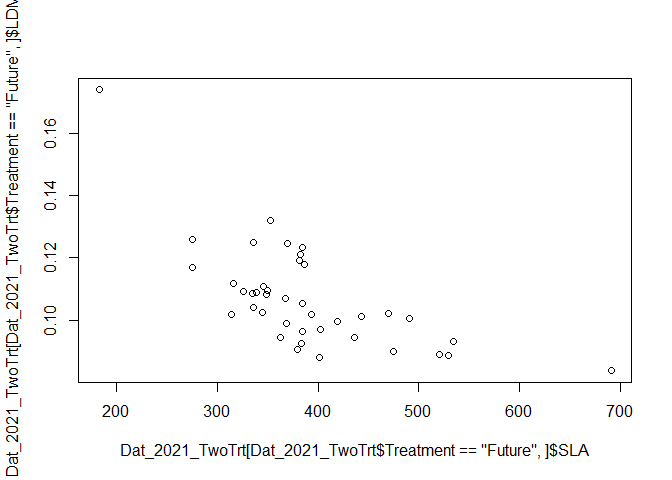<!-- -->

``` r
# 2022
# overall
cor.test(Dat_2022$SLA, Dat_2022$LDMC)
```

```
## 
## 	Pearson's product-moment correlation
## 
## data:  Dat_2022$SLA and Dat_2022$LDMC
## t = -12.482, df = 124, p-value < 2.2e-16
## alternative hypothesis: true correlation is not equal to 0
## 95 percent confidence interval:
##  -0.8147757 -0.6570626
## sample estimates:
##        cor 
## -0.7462113
```

``` r
plot(Dat_2022$SLA, Dat_2022$LDMC)
```

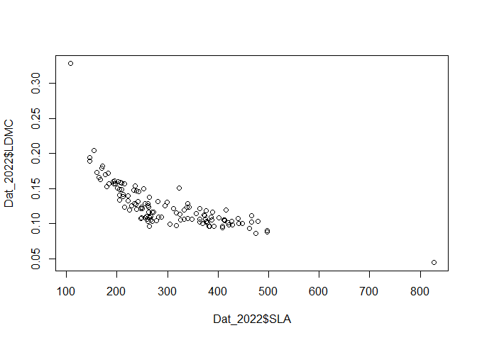<!-- -->

``` r
# just in SW
cor.test(Dat_2022[Dat_2022$Population == "R", ]$SLA, Dat_2022[Dat_2022$Population == "R", ]$LDMC)
```

```
## 
## 	Pearson's product-moment correlation
## 
## data:  Dat_2022[Dat_2022$Population == "R", ]$SLA and Dat_2022[Dat_2022$Population == "R", ]$LDMC
## t = -14.604, df = 60, p-value < 2.2e-16
## alternative hypothesis: true correlation is not equal to 0
## 95 percent confidence interval:
##  -0.9283496 -0.8130558
## sample estimates:
##        cor 
## -0.8834225
```

``` r
plot(Dat_2022[Dat_2022$Population == "R", ]$SLA, Dat_2022[Dat_2022$Population == "R", ]$LDMC)
```

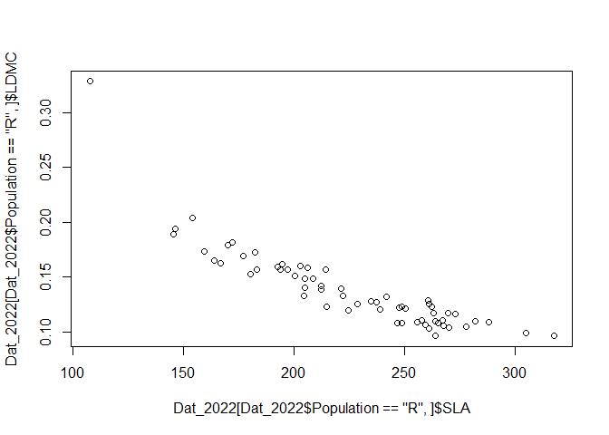<!-- -->

``` r
# just in IT
cor.test(Dat_2022[Dat_2022$Population == "B", ]$SLA, Dat_2022[Dat_2022$Population == "B", ]$LDMC)
```

```
## 
## 	Pearson's product-moment correlation
## 
## data:  Dat_2022[Dat_2022$Population == "B", ]$SLA and Dat_2022[Dat_2022$Population == "B", ]$LDMC
## t = -14.044, df = 62, p-value < 2.2e-16
## alternative hypothesis: true correlation is not equal to 0
## 95 percent confidence interval:
##  -0.9206661 -0.7974196
## sample estimates:
##        cor 
## -0.8722554
```

``` r
plot(Dat_2022[Dat_2022$Population == "B", ]$SLA, Dat_2022[Dat_2022$Population == "B", ]$LDMC)
```

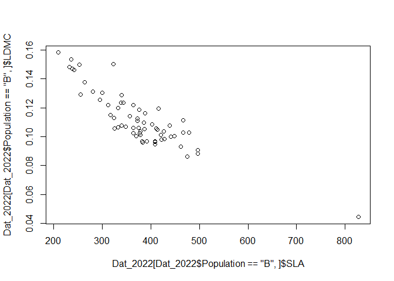<!-- -->

``` r
# just cur?
cor.test(Dat_2022[Dat_2022$Treatment == "Current", ]$SLA, Dat_2022[Dat_2022$Treatment == "Current", ]$LDMC)
```

```
## 
## 	Pearson's product-moment correlation
## 
## data:  Dat_2022[Dat_2022$Treatment == "Current", ]$SLA and Dat_2022[Dat_2022$Treatment == "Current", ]$LDMC
## t = -5.7691, df = 62, p-value = 2.724e-07
## alternative hypothesis: true correlation is not equal to 0
## 95 percent confidence interval:
##  -0.7306769 -0.4038851
## sample estimates:
##        cor 
## -0.5910188
```

``` r
plot(Dat_2022[Dat_2022$Treatment == "Current", ]$SLA, Dat_2022[Dat_2022$Treatment == "Current", ]$LDMC)
```

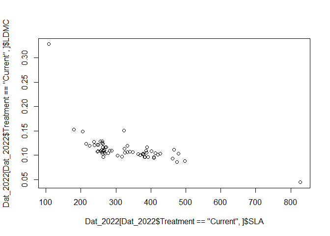<!-- -->

``` r
# just fut?
cor.test(Dat_2022[Dat_2022$Treatment == "Current", ]$SLA, Dat_2022[Dat_2022$Treatment == "Future", ]$LDMC)
```

```
## 
## 	Pearson's product-moment correlation
## 
## data:  Dat_2022[Dat_2022$Treatment == "Current", ]$SLA and Dat_2022[Dat_2022$Treatment == "Future", ]$LDMC
## t = -3.4315, df = 60, p-value = 0.001093
## alternative hypothesis: true correlation is not equal to 0
## 95 percent confidence interval:
##  -0.5946490 -0.1727469
## sample estimates:
##       cor 
## -0.405039
```

``` r
plot(Dat_2022[Dat_2022$Treatment == "Future", ]$SLA, Dat_2022[Dat_2022$Treatment == "Current", ]$LDMC)
```

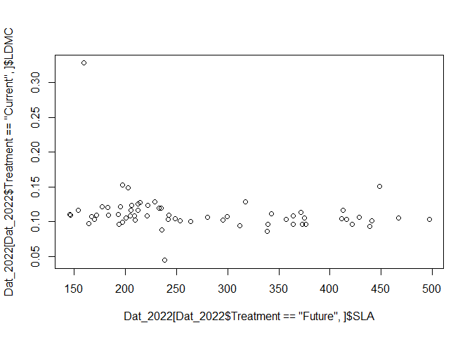<!-- -->
## Dry weight difference in signficance
For dry weight, there is a huge difference in significance between 2021 (p value below 0.001) and 2022 (p value above 0.95). Quickly looking at the spreadsheets I can not tell a difference and the values are of similar magnitudes. I then did untransformed models and square root transformed models because those were reported as having the most normal residuals in the previous code. None of the models had differences in p values due to transformation that changed the interpretation of the results. I also excluded the "days between bolting and harvest" random effect for the 2022 data but did not find a major difference in the models but the denominator degrees of freedom for treatment did change a lot. As a final check for if there is a potential mistake, I am going to look at some data distributions.


``` r
ggplot(dat = Dat_2021_TwoTrt)+
  geom_histogram(aes(x = DriedWt_g, fill = Population), alpha = 0.5, position = "identity")+
  theme_classic()
```

```
## `stat_bin()` using `bins = 30`. Pick better value with `binwidth`.
```

```
## Warning: Removed 15 rows containing non-finite outside the scale range
## (`stat_bin()`).
```

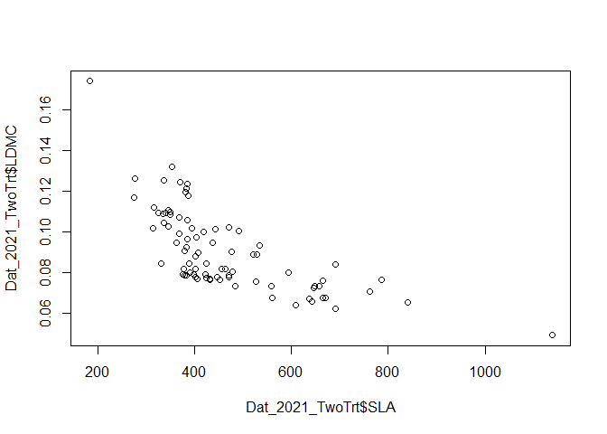<!-- -->

``` r
ggplot(dat = Dat_2021_TwoTrt)+
  geom_histogram(aes(x = DriedWt_g, fill = Treatment), alpha = 0.5, position = "identity")+
  theme_classic()
```

```
## `stat_bin()` using `bins = 30`. Pick better value with `binwidth`.
```

```
## Warning: Removed 15 rows containing non-finite outside the scale range
## (`stat_bin()`).
```

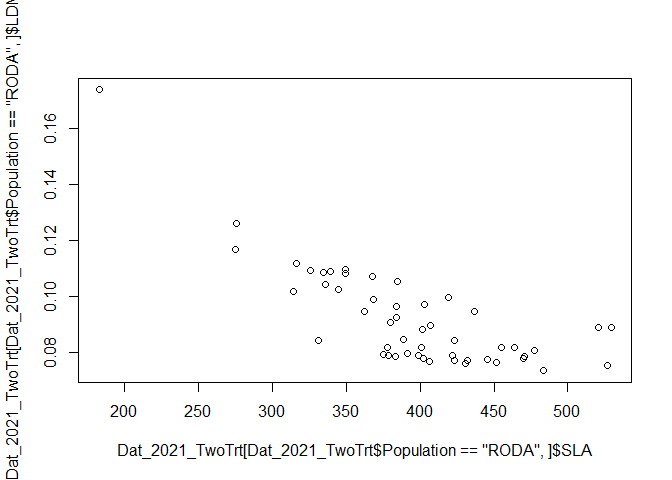<!-- -->

``` r
ggplot(dat = Dat_2022)+
  geom_histogram(aes(x = SL_DryWt, fill = Population), alpha = 0.5, position = "identity")+
  theme_classic()
```

```
## `stat_bin()` using `bins = 30`. Pick better value with `binwidth`.
```

```
## Warning: Removed 1 row containing non-finite outside the scale range
## (`stat_bin()`).
```

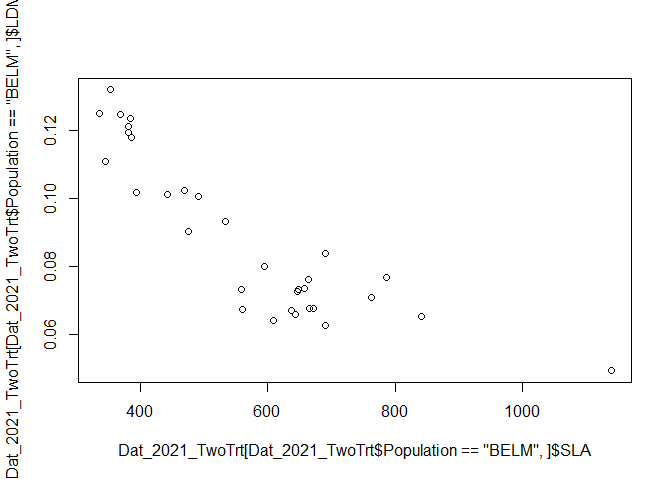<!-- -->

``` r
ggplot(dat = Dat_2022)+
  geom_histogram(aes(x = SL_DryWt, fill = Treatment), alpha = 0.5, position = "identity")+
  theme_classic()
```

```
## `stat_bin()` using `bins = 30`. Pick better value with `binwidth`.
```

```
## Warning: Removed 1 row containing non-finite outside the scale range
## (`stat_bin()`).
```

<!-- -->

Visually looking at the histograms it does seems like 2021 has a treatment difference and 2022 has a population difference. Scales of both are comparable. 

## 2021 Avg Seed per fruit
Concerned that line does not explain any variance. Is it true that all the variation is within lines and not between lines? to check this: 1) make histogram of all the values (not line means) - done in CleanData but repeat here


``` r
hist(Dat_2021_TwoTrt$AvgSeedNum)
```

<!-- -->

``` r
hist(Dat_2021_TwoTrt$l10_AvgSeedNum)
```

<!-- -->
2) look within lines for difference in avg seeds/fruit - maybe do subtraction and histogram the differences? but won't work if more than two values


``` r
# start with copy of code from 03_Figures that makes the by line plot
Dat_2021_TwoTrt$Line.ID <- as.factor(paste0(Dat_2021_TwoTrt$Population, Dat_2021_TwoTrt$Line))
Dat_2021_TwoTrt$Line.ID.T <- as.factor(paste0(Dat_2021_TwoTrt$Line.ID, Dat_2021_TwoTrt$Treatment))
df_seed_line <- Dat_2021_TwoTrt %>%
  dplyr::group_by(Line.ID.T, .add = TRUE) %>%
  summarize(across(.col = c(AvgSeedNum, l10_AvgSeedNum), .fns = list(mean = ~mean(.x, na.rm = TRUE, .group = "keep"), ci_95 = ~conf_int(.x), n = ~sum(!is.na(.)))))
```

```
## Warning: There were 4 warnings in `summarize()`.
## The first warning was:
## ℹ In argument: `across(...)`.
## ℹ In group 7: `Line.ID.T = BELM1Current`.
## Caused by warning in `qt()`:
## ! NaNs produced
## ℹ Run `dplyr::last_dplyr_warnings()` to see the 3 remaining warnings.
```

``` r
df_seed_line$Population <- substr(df_seed_line$Line.ID.T, start = 1, stop = 4)

hist(df_seed_line$AvgSeedNum_n)
```

<!-- -->

``` r
# some lines only have 1 pot per treatment -- 10 instances, 7 in Cur
# some lines only have pots in one treatment 4 - all in Fut are the dead ones so only a rep in cur
# 3 and 4 are Roda parent. 6 and 7 are Belm parent.

# get list of Line.ID with 2 replicates
two_reps <- df_seed_line[df_seed_line$AvgSeedNum_n == 2, "Line.ID.T"]$Line.ID.T
# pull those out of the main dataframe
two_reps_seeds <- Dat_2021_TwoTrt[Dat_2021_TwoTrt$Line.ID.T %in% two_reps, c("Treatment", "Population", "Line", "Replicate", "Line.ID", "Line.ID.T", "AvgSeedNum", "l10_AvgSeedNum")]

# find the difference in values
two_reps_diff <-  two_reps_seeds %>% 
  group_by(Line.ID.T) %>% 
  summarize(across(.col = c(AvgSeedNum, l10_AvgSeedNum), .fns = ~diff(.x)))


# table of just RIL parent seed numbers
ril_pars_seed <- Dat_2021_TwoTrt[Dat_2021_TwoTrt$Line.ID %in% c("BELM12", "RODA47"), c("Treatment", "Population", "Line", "Replicate", "Line.ID", "Line.ID.T", "AvgSeedNum", "l10_AvgSeedNum")]
ril_pars_seed[order(ril_pars_seed$Line.ID.T), ]
```

```
##    Treatment Population Line Replicate Line.ID     Line.ID.T AvgSeedNum
## 1    Current       BELM   12        11  BELM12 BELM12Current   50.40000
## 3    Current       BELM   12        12  BELM12 BELM12Current   52.30000
## 5    Current       BELM   12        13  BELM12 BELM12Current   37.80000
## 7    Current       BELM   12        14  BELM12 BELM12Current   53.10000
## 9    Current       BELM   12        15  BELM12 BELM12Current   52.40000
## 13   Current       BELM   12         1  BELM12 BELM12Current   27.10000
## 15   Current       BELM   12         2  BELM12 BELM12Current   49.60000
## 2     Future       BELM   12        11  BELM12  BELM12Future   53.80000
## 4     Future       BELM   12        12  BELM12  BELM12Future   42.00000
## 6     Future       BELM   12        13  BELM12  BELM12Future   43.20000
## 8     Future       BELM   12        14  BELM12  BELM12Future   36.30000
## 10    Future       BELM   12        15  BELM12  BELM12Future   53.80000
## 14    Future       BELM   12         1  BELM12  BELM12Future         NA
## 16    Future       BELM   12         2  BELM12  BELM12Future   54.88889
## 77   Current       RODA   47         1  RODA47 RODA47Current   69.70000
## 79   Current       RODA   47         2  RODA47 RODA47Current   55.40000
## 81   Current       RODA   47         3  RODA47 RODA47Current   70.70000
## 83   Current       RODA   47         4  RODA47 RODA47Current         NA
## 85   Current       RODA   47         5  RODA47 RODA47Current         NA
## 87   Current       RODA   47         6  RODA47 RODA47Current   72.50000
## 78    Future       RODA   47         1  RODA47  RODA47Future   40.80000
## 80    Future       RODA   47         2  RODA47  RODA47Future   50.00000
## 82    Future       RODA   47         3  RODA47  RODA47Future         NA
## 84    Future       RODA   47         4  RODA47  RODA47Future         NA
## 86    Future       RODA   47         5  RODA47  RODA47Future   42.50000
## 88    Future       RODA   47         6  RODA47  RODA47Future         NA
##    l10_AvgSeedNum
## 1        1.702431
## 3        1.718502
## 5        1.577492
## 7        1.725095
## 9        1.719331
## 13       1.432969
## 15       1.695482
## 2        1.730782
## 4        1.623249
## 6        1.635484
## 8        1.559907
## 10       1.730782
## 14             NA
## 16       1.739484
## 77       1.843233
## 79       1.743510
## 81       1.849419
## 83             NA
## 85             NA
## 87       1.860338
## 78       1.610660
## 80       1.698970
## 82             NA
## 84             NA
## 86       1.628389
## 88             NA
```


3) figure out which genotypes are the outliers on the residuals plot.The low outlier on the residuals plot is B12. Note for interpretation that the residuals are scaled (so not log scale but divided by the mean)

``` r
tmp_seed <- lmer(l10_AvgSeedNum ~ Treatment * Population + (1|Population:Line) , data = Dat_2021_TwoTrt, contrasts = list(Treatment=contr.sum, Population = contr.sum))
```

```
## boundary (singular) fit: see help('isSingular')
```

``` r
df_seed <- data.frame(fitted = fitted(tmp_seed),
                      resid = residuals(tmp_seed, type = "pearson", scaled = TRUE),
                      pop = Dat_2021_TwoTrt$Population[complete.cases(Dat_2021_TwoTrt$l10_AvgSeedNum)],
                      trt = Dat_2021_TwoTrt$Treatment[complete.cases(Dat_2021_TwoTrt$l10_AvgSeedNum)],
                      line = Dat_2021_TwoTrt$Line[complete.cases(Dat_2021_TwoTrt$l10_AvgSeedNum)],
                      pot.id = Dat_2021_TwoTrt$Pot.ID[complete.cases(Dat_2021_TwoTrt$l10_AvgSeedNum)])

plot_seed <-  ggplot(df_seed) +
  geom_point(aes(x=fitted, y=resid,
       col = pop, shape = trt, text=pot.id))+
  scale_color_manual(values = c("red", "blue"))+
  theme_classic()
```

```
## Warning in geom_point(aes(x = fitted, y = resid, col = pop, shape = trt, :
## Ignoring unknown aesthetics: text
```

``` r
ggplotly(plot_seed)
```

```{=html}
<div class="plotly html-widget html-fill-item" id="htmlwidget-f47c3ecf2200992fe5ce" style="width:672px;height:480px;"></div>
<script type="application/json" data-for="htmlwidget-f47c3ecf2200992fe5ce">{"x":{"data":[{"x":[1.6846369645818056,1.6846369645818056,1.6846369645818056,1.6846369645818056,1.6846369645818056,1.6846369645818056,1.6846369645818056,1.6846369645818056,1.6846369645818056,1.6846369645818056,1.6846369645818056,1.6846369645818056,1.6846369645818056,1.6846369645818056,1.6846369645818056,1.6846369645818056,1.6846369645818056,1.6846369645818056],"y":[0.2674669162420692,0.50904300965489879,-1.6105696497567332,0.60814421963896215,0.52151324618914841,-0.93832041281694523,-3.7829828164833939,0.16301401842680832,-0.13315980453078638,-0.95391938521042907,0.60814421963896215,-0.11940180820462973,1.3729522074178417,0.34472423022904275,1.3947855616842038,0.2284926700882528,0.76604246385705199,0.75403111393582589],"text":["fitted: 1.684637<br />resid:  0.267466916<br />pop: BELM<br />trt: Current<br />B12-11-C","fitted: 1.684637<br />resid:  0.509043010<br />pop: BELM<br />trt: Current<br />B12-12-C","fitted: 1.684637<br />resid: -1.610569650<br />pop: BELM<br />trt: Current<br />B12-13-C","fitted: 1.684637<br />resid:  0.608144220<br />pop: BELM<br />trt: Current<br />B12-14-C","fitted: 1.684637<br />resid:  0.521513246<br />pop: BELM<br />trt: Current<br />B12-15-C","fitted: 1.684637<br />resid: -0.938320413<br />pop: BELM<br />trt: Current<br />B1-6-C","fitted: 1.684637<br />resid: -3.782982816<br />pop: BELM<br />trt: Current<br />B12-1-C","fitted: 1.684637<br />resid:  0.163014018<br />pop: BELM<br />trt: Current<br />B12-2-C","fitted: 1.684637<br />resid: -0.133159805<br />pop: BELM<br />trt: Current<br />B13-1-C","fitted: 1.684637<br />resid: -0.953919385<br />pop: BELM<br />trt: Current<br />B13-2-C","fitted: 1.684637<br />resid:  0.608144220<br />pop: BELM<br />trt: Current<br />B15-1-C","fitted: 1.684637<br />resid: -0.119401808<br />pop: BELM<br />trt: Current<br />B15-2-C","fitted: 1.684637<br />resid:  1.372952207<br />pop: BELM<br />trt: Current<br />B2-1-C","fitted: 1.684637<br />resid:  0.344724230<br />pop: BELM<br />trt: Current<br />B3-1-C","fitted: 1.684637<br />resid:  1.394785562<br />pop: BELM<br />trt: Current<br />B3-2-C","fitted: 1.684637<br />resid:  0.228492670<br />pop: BELM<br />trt: Current<br />B4-2-C","fitted: 1.684637<br />resid:  0.766042464<br />pop: BELM<br />trt: Current<br />B8-1-C","fitted: 1.684637<br />resid:  0.754031114<br />pop: BELM<br />trt: Current<br />B8-2-C"],"type":"scatter","mode":"markers","marker":{"autocolorscale":false,"color":"rgba(255,0,0,1)","opacity":1,"size":5.6692913385826778,"symbol":"circle","line":{"width":1.8897637795275593,"color":"rgba(255,0,0,1)"}},"hoveron":"points","name":"(BELM,Current)","legendgroup":"(BELM,Current)","showlegend":true,"xaxis":"x","yaxis":"y","hoverinfo":"text","frame":null},{"x":[1.6573891185101599,1.6573891185101599,1.6573891185101599,1.6573891185101599,1.6573891185101599,1.6573891185101599,1.6573891185101599,1.6573891185101599,1.6573891185101599,1.6573891185101599,1.6573891185101599,1.6573891185101599,1.6573891185101599,1.6573891185101599,1.6573891185101599],"y":[1.1032209591299795,-0.51317827674814775,-0.32927409186512946,-1.465323663892748,1.1032209591299795,0.34492239843450484,1.2340289238737077,-1.6415249961527645,0.06491307539388981,-0.12757753348639503,-0.46671425967083219,-1.2530068422517888,1.58142221857721,-0.52874006442835919,0.89361119395706057],"text":["fitted: 1.657389<br />resid:  1.103220959<br />pop: BELM<br />trt: Future<br />B12-11-F","fitted: 1.657389<br />resid: -0.513178277<br />pop: BELM<br />trt: Future<br />B12-12-F","fitted: 1.657389<br />resid: -0.329274092<br />pop: BELM<br />trt: Future<br />B12-13-F","fitted: 1.657389<br />resid: -1.465323664<br />pop: BELM<br />trt: Future<br />B12-14-F","fitted: 1.657389<br />resid:  1.103220959<br />pop: BELM<br />trt: Future<br />B12-15-F","fitted: 1.657389<br />resid:  0.344922398<br />pop: BELM<br />trt: Future<br />B1-6-F","fitted: 1.657389<br />resid:  1.234028924<br />pop: BELM<br />trt: Future<br />B12-2-F","fitted: 1.657389<br />resid: -1.641524996<br />pop: BELM<br />trt: Future<br />B15-1-F","fitted: 1.657389<br />resid:  0.064913075<br />pop: BELM<br />trt: Future<br />B15-2-F","fitted: 1.657389<br />resid: -0.127577533<br />pop: BELM<br />trt: Future<br />B2-1-F","fitted: 1.657389<br />resid: -0.466714260<br />pop: BELM<br />trt: Future<br />B2-2-F","fitted: 1.657389<br />resid: -1.253006842<br />pop: BELM<br />trt: Future<br />B3-1-F","fitted: 1.657389<br />resid:  1.581422219<br />pop: BELM<br />trt: Future<br />B3-2-F","fitted: 1.657389<br />resid: -0.528740064<br />pop: BELM<br />trt: Future<br />B8-1-F","fitted: 1.657389<br />resid:  0.893611194<br />pop: BELM<br />trt: Future<br />B8-2-F"],"type":"scatter","mode":"markers","marker":{"autocolorscale":false,"color":"rgba(255,0,0,1)","opacity":1,"size":5.6692913385826778,"symbol":"triangle-up","line":{"width":1.8897637795275593,"color":"rgba(255,0,0,1)"}},"hoveron":"points","name":"(BELM,Future)","legendgroup":"(BELM,Future)","showlegend":true,"xaxis":"x","yaxis":"y","hoverinfo":"text","frame":null},{"x":[1.8244362514521935,1.8244362514521935,1.8244362514521935,1.8244362514521935,1.8244362514521935,1.8244362514521935,1.8244362514521935,1.8244362514521935,1.8244362514521935,1.8244362514521935,1.8244362514521935,1.8244362514521935,1.8244362514521935,1.8244362514521935,1.8244362514521935,1.8244362514521935,1.8244362514521935,1.8244362514521935,1.8244362514521935,1.8244362514521935,1.8244362514521935,1.8244362514521935,1.8244362514521935,1.8244362514521935],"y":[-0.093351985339069174,0.014879333557095789,-0.35653853830621535,-0.84986952501221291,0.76967637412565504,0.6556826530604678,0.66452241993670469,0.47632612899565707,-2.3038033971827234,-0.18325930015027947,-1.1694939735967862,-0.39798735590111789,0.17869432945910024,0.41236876944442147,0.43985582832909204,0.28254299117243636,-1.2164594052325948,0.37553839338668527,0.53966296384139478,-0.0046660907456852023,0.51259381583553698,0.55764690590509425,0.37553839338668527,0.31990027103060731],"text":["fitted: 1.824436<br />resid: -0.093351985<br />pop: RODA<br />trt: Current<br />R11-1-C","fitted: 1.824436<br />resid:  0.014879334<br />pop: RODA<br />trt: Current<br />R11-2-C","fitted: 1.824436<br />resid: -0.356538538<br />pop: RODA<br />trt: Current<br />R15-1-C","fitted: 1.824436<br />resid: -0.849869525<br />pop: RODA<br />trt: Current<br />R15-2-C","fitted: 1.824436<br />resid:  0.769676374<br />pop: RODA<br />trt: Current<br />R2-1-C","fitted: 1.824436<br />resid:  0.655682653<br />pop: RODA<br />trt: Current<br />R2-2-C","fitted: 1.824436<br />resid:  0.664522420<br />pop: RODA<br />trt: Current<br />R21-1-C","fitted: 1.824436<br />resid:  0.476326129<br />pop: RODA<br />trt: Current<br />R21-2-C","fitted: 1.824436<br />resid: -2.303803397<br />pop: RODA<br />trt: Current<br />R26-1-C","fitted: 1.824436<br />resid: -0.183259300<br />pop: RODA<br />trt: Current<br />R29-1-C","fitted: 1.824436<br />resid: -1.169493974<br />pop: RODA<br />trt: Current<br />R29-2-C","fitted: 1.824436<br />resid: -0.397987356<br />pop: RODA<br />trt: Current<br />R33-2-C","fitted: 1.824436<br />resid:  0.178694329<br />pop: RODA<br />trt: Current<br />R35-1-C","fitted: 1.824436<br />resid:  0.412368769<br />pop: RODA<br />trt: Current<br />R40-1-C","fitted: 1.824436<br />resid:  0.439855828<br />pop: RODA<br />trt: Current<br />R40-2-C","fitted: 1.824436<br />resid:  0.282542991<br />pop: RODA<br />trt: Current<br />R47-1-C","fitted: 1.824436<br />resid: -1.216459405<br />pop: RODA<br />trt: Current<br />R47-2-C","fitted: 1.824436<br />resid:  0.375538393<br />pop: RODA<br />trt: Current<br />R47-3-C","fitted: 1.824436<br />resid:  0.539662964<br />pop: RODA<br />trt: Current<br />R47-6-C","fitted: 1.824436<br />resid: -0.004666091<br />pop: RODA<br />trt: Current<br />R5-1-C","fitted: 1.824436<br />resid:  0.512593816<br />pop: RODA<br />trt: Current<br />R8-1-C","fitted: 1.824436<br />resid:  0.557646906<br />pop: RODA<br />trt: Current<br />R8-2-C","fitted: 1.824436<br />resid:  0.375538393<br />pop: RODA<br />trt: Current<br />R9-1-C","fitted: 1.824436<br />resid:  0.319900271<br />pop: RODA<br />trt: Current<br />R9-2-C"],"type":"scatter","mode":"markers","marker":{"autocolorscale":false,"color":"rgba(0,0,255,1)","opacity":1,"size":5.6692913385826778,"symbol":"circle","line":{"width":1.8897637795275593,"color":"rgba(0,0,255,1)"}},"hoveron":"points","name":"(RODA,Current)","legendgroup":"(RODA,Current)","showlegend":true,"xaxis":"x","yaxis":"y","hoverinfo":"text","frame":null},{"x":[1.6710151051975177,1.6710151051975177,1.6710151051975177,1.6710151051975177,1.6710151051975177,1.6710151051975177,1.6710151051975177,1.6710151051975177,1.6710151051975177,1.6710151051975177,1.6710151051975177,1.6710151051975177,1.6710151051975177,1.6710151051975177,1.6710151051975177,1.6710151051975177,1.6710151051975177,1.6710151051975177,1.6710151051975177,1.6710151051975177,1.6710151051975177],"y":[0.0023710566782874799,0.82518591138579434,-1.9082250124286038,0.77591649381805705,1.1949160746636953,0.77591649381805705,-1.2860242570637637,0.87408626618145535,1.4563049288487979,0.42020852944520692,0.48516594937326524,-0.29668123742194163,0.56227117849399566,0.72627240027592799,-2.3491126394401269,-0.90723494805496741,0.42020852944520692,-0.64074215706297744,-1.2690899626378249,-0.1099442615025865,0.24823066318501499],"text":["fitted: 1.671015<br />resid:  0.002371057<br />pop: RODA<br />trt: Future<br />R11-1-F","fitted: 1.671015<br />resid:  0.825185911<br />pop: RODA<br />trt: Future<br />R11-2-F","fitted: 1.671015<br />resid: -1.908225012<br />pop: RODA<br />trt: Future<br />R15-1-F","fitted: 1.671015<br />resid:  0.775916494<br />pop: RODA<br />trt: Future<br />R15-2-F","fitted: 1.671015<br />resid:  1.194916075<br />pop: RODA<br />trt: Future<br />R2-1-F","fitted: 1.671015<br />resid:  0.775916494<br />pop: RODA<br />trt: Future<br />R2-2-F","fitted: 1.671015<br />resid: -1.286024257<br />pop: RODA<br />trt: Future<br />R21-2-F","fitted: 1.671015<br />resid:  0.874086266<br />pop: RODA<br />trt: Future<br />R29-1-F","fitted: 1.671015<br />resid:  1.456304929<br />pop: RODA<br />trt: Future<br />R29-2-F","fitted: 1.671015<br />resid:  0.420208529<br />pop: RODA<br />trt: Future<br />R33-1-F","fitted: 1.671015<br />resid:  0.485165949<br />pop: RODA<br />trt: Future<br />R33-2-F","fitted: 1.671015<br />resid: -0.296681237<br />pop: RODA<br />trt: Future<br />R35-1-F","fitted: 1.671015<br />resid:  0.562271178<br />pop: RODA<br />trt: Future<br />R35-2-F","fitted: 1.671015<br />resid:  0.726272400<br />pop: RODA<br />trt: Future<br />R40-1-F","fitted: 1.671015<br />resid: -2.349112639<br />pop: RODA<br />trt: Future<br />R40-2-F","fitted: 1.671015<br />resid: -0.907234948<br />pop: RODA<br />trt: Future<br />R47-1-F","fitted: 1.671015<br />resid:  0.420208529<br />pop: RODA<br />trt: Future<br />R47-2-F","fitted: 1.671015<br />resid: -0.640742157<br />pop: RODA<br />trt: Future<br />R47-5-F","fitted: 1.671015<br />resid: -1.269089963<br />pop: RODA<br />trt: Future<br />R8-1-F","fitted: 1.671015<br />resid: -0.109944262<br />pop: RODA<br />trt: Future<br />R8-2-F","fitted: 1.671015<br />resid:  0.248230663<br />pop: RODA<br />trt: Future<br />R9-2-F"],"type":"scatter","mode":"markers","marker":{"autocolorscale":false,"color":"rgba(0,0,255,1)","opacity":1,"size":5.6692913385826778,"symbol":"triangle-up","line":{"width":1.8897637795275593,"color":"rgba(0,0,255,1)"}},"hoveron":"points","name":"(RODA,Future)","legendgroup":"(RODA,Future)","showlegend":true,"xaxis":"x","yaxis":"y","hoverinfo":"text","frame":null}],"layout":{"margin":{"t":26.228310502283104,"r":7.3059360730593621,"b":40.182648401826491,"l":37.260273972602747},"plot_bgcolor":"rgba(255,255,255,1)","paper_bgcolor":"rgba(255,255,255,1)","font":{"color":"rgba(0,0,0,1)","family":"","size":14.611872146118724},"xaxis":{"domain":[0,1],"automargin":true,"type":"linear","autorange":false,"range":[1.6490367618630581,1.8327886080992952],"tickmode":"array","ticktext":["1.65","1.70","1.75","1.80"],"tickvals":[1.6500000000000001,1.7000000000000002,1.7500000000000002,1.8000000000000003],"categoryorder":"array","categoryarray":["1.65","1.70","1.75","1.80"],"nticks":null,"ticks":"outside","tickcolor":"rgba(51,51,51,1)","ticklen":3.6529680365296811,"tickwidth":0.66417600664176002,"showticklabels":true,"tickfont":{"color":"rgba(77,77,77,1)","family":"","size":11.68949771689498},"tickangle":-0,"showline":true,"linecolor":"rgba(0,0,0,1)","linewidth":0.66417600664176002,"showgrid":false,"gridcolor":null,"gridwidth":0,"zeroline":false,"anchor":"y","title":{"text":"fitted","font":{"color":"rgba(0,0,0,1)","family":"","size":14.611872146118724}},"hoverformat":".2f"},"yaxis":{"domain":[0,1],"automargin":true,"type":"linear","autorange":false,"range":[-4.0512030682364237,1.8496424703302403],"tickmode":"array","ticktext":["-4","-3","-2","-1","0","1"],"tickvals":[-4,-3,-2,-0.99999999999999956,0,1],"categoryorder":"array","categoryarray":["-4","-3","-2","-1","0","1"],"nticks":null,"ticks":"outside","tickcolor":"rgba(51,51,51,1)","ticklen":3.6529680365296811,"tickwidth":0.66417600664176002,"showticklabels":true,"tickfont":{"color":"rgba(77,77,77,1)","family":"","size":11.68949771689498},"tickangle":-0,"showline":true,"linecolor":"rgba(0,0,0,1)","linewidth":0.66417600664176002,"showgrid":false,"gridcolor":null,"gridwidth":0,"zeroline":false,"anchor":"x","title":{"text":"resid","font":{"color":"rgba(0,0,0,1)","family":"","size":14.611872146118724}},"hoverformat":".2f"},"shapes":[{"type":"rect","fillcolor":null,"line":{"color":null,"width":0,"linetype":[]},"yref":"paper","xref":"paper","x0":0,"x1":1,"y0":0,"y1":1}],"showlegend":true,"legend":{"bgcolor":"rgba(255,255,255,1)","bordercolor":"transparent","borderwidth":1.8897637795275593,"font":{"color":"rgba(0,0,0,1)","family":"","size":11.68949771689498},"title":{"text":"trt<br />pop","font":{"color":"rgba(0,0,0,1)","family":"","size":14.611872146118724}}},"hovermode":"closest","barmode":"relative"},"config":{"doubleClick":"reset","modeBarButtonsToAdd":["hoverclosest","hovercompare"],"showSendToCloud":false},"source":"A","attrs":{"4dbc1167009":{"x":{},"y":{},"colour":{},"shape":{},"text":{},"type":"scatter"}},"cur_data":"4dbc1167009","visdat":{"4dbc1167009":["function (y) ","x"]},"highlight":{"on":"plotly_click","persistent":false,"dynamic":false,"selectize":false,"opacityDim":0.20000000000000001,"selected":{"opacity":1},"debounce":0},"shinyEvents":["plotly_hover","plotly_click","plotly_selected","plotly_relayout","plotly_brushed","plotly_brushing","plotly_clickannotation","plotly_doubleclick","plotly_deselect","plotly_afterplot","plotly_sunburstclick"],"base_url":"https://plot.ly"},"evals":[],"jsHooks":[]}</script>
```

make a plot with genotype on the x axis and seed count per fruit on the y axis. color by pop and treatment.


```
## Warning in geom_point(aes(x = Line.ID.T, y = AvgSeedNum, col = Population, :
## Ignoring unknown aesthetics: text
```

```{=html}
<div class="plotly html-widget html-fill-item" id="htmlwidget-d3eb7af824181f7d48c4" style="width:672px;height:480px;"></div>
<script type="application/json" data-for="htmlwidget-d3eb7af824181f7d48c4">{"x":{"data":[{"x":[1,1,1,1,1,7,1,1,3,3,5,5,9,9,11,11,13,13,15,15],"y":[50.399999999999999,52.299999999999997,37.799999999999997,53.100000000000001,52.399999999999999,41.899999999999999,27.100000000000001,49.600000000000001,47.399999999999999,41.799999999999997,53.100000000000001,47.5,59.700000000000003,null,51,59.899999999999999,null,50.100000000000001,54.399999999999999,54.299999999999997],"text":["Line.ID.T: BELM12Current<br />AvgSeedNum: 50.40000<br />Population: BELM<br />Treatment: Current<br />B12-11-C","Line.ID.T: BELM12Current<br />AvgSeedNum: 52.30000<br />Population: BELM<br />Treatment: Current<br />B12-12-C","Line.ID.T: BELM12Current<br />AvgSeedNum: 37.80000<br />Population: BELM<br />Treatment: Current<br />B12-13-C","Line.ID.T: BELM12Current<br />AvgSeedNum: 53.10000<br />Population: BELM<br />Treatment: Current<br />B12-14-C","Line.ID.T: BELM12Current<br />AvgSeedNum: 52.40000<br />Population: BELM<br />Treatment: Current<br />B12-15-C","Line.ID.T: BELM1Current<br />AvgSeedNum: 41.90000<br />Population: BELM<br />Treatment: Current<br />B1-6-C","Line.ID.T: BELM12Current<br />AvgSeedNum: 27.10000<br />Population: BELM<br />Treatment: Current<br />B12-1-C","Line.ID.T: BELM12Current<br />AvgSeedNum: 49.60000<br />Population: BELM<br />Treatment: Current<br />B12-2-C","Line.ID.T: BELM13Current<br />AvgSeedNum: 47.40000<br />Population: BELM<br />Treatment: Current<br />B13-1-C","Line.ID.T: BELM13Current<br />AvgSeedNum: 41.80000<br />Population: BELM<br />Treatment: Current<br />B13-2-C","Line.ID.T: BELM15Current<br />AvgSeedNum: 53.10000<br />Population: BELM<br />Treatment: Current<br />B15-1-C","Line.ID.T: BELM15Current<br />AvgSeedNum: 47.50000<br />Population: BELM<br />Treatment: Current<br />B15-2-C","Line.ID.T: BELM2Current<br />AvgSeedNum: 59.70000<br />Population: BELM<br />Treatment: Current<br />B2-1-C","Line.ID.T: BELM2Current<br />AvgSeedNum:       NA<br />Population: BELM<br />Treatment: Current<br />B2-2-C","Line.ID.T: BELM3Current<br />AvgSeedNum: 51.00000<br />Population: BELM<br />Treatment: Current<br />B3-1-C","Line.ID.T: BELM3Current<br />AvgSeedNum: 59.90000<br />Population: BELM<br />Treatment: Current<br />B3-2-C","Line.ID.T: BELM4Current<br />AvgSeedNum:       NA<br />Population: BELM<br />Treatment: Current<br />B4-1-C","Line.ID.T: BELM4Current<br />AvgSeedNum: 50.10000<br />Population: BELM<br />Treatment: Current<br />B4-2-C","Line.ID.T: BELM8Current<br />AvgSeedNum: 54.40000<br />Population: BELM<br />Treatment: Current<br />B8-1-C","Line.ID.T: BELM8Current<br />AvgSeedNum: 54.30000<br />Population: BELM<br />Treatment: Current<br />B8-2-C"],"type":"scatter","mode":"markers","marker":{"autocolorscale":false,"color":"rgba(255,0,0,1)","opacity":1,"size":5.6692913385826778,"symbol":"circle","line":{"width":1.8897637795275593,"color":"rgba(255,0,0,1)"}},"hoveron":"points","name":"(BELM,Current)","legendgroup":"(BELM,Current)","showlegend":true,"xaxis":"x","yaxis":"y","hoverinfo":"text","frame":null},{"x":[2,2,2,2,2,8,2,2,4,4,6,6,10,10,12,12,14,14,16,16],"y":[53.799999999999997,42,43.200000000000003,36.299999999999997,53.799999999999997,47.899999999999999,null,54.8888888888889,null,null,35.3333333333333,45.8888888888889,44.5555555555556,42.299999999999997,37.5,57.8888888888889,null,null,41.899999999999999,52.100000000000001],"text":["Line.ID.T: BELM12Future<br />AvgSeedNum: 53.80000<br />Population: BELM<br />Treatment: Future<br />B12-11-F","Line.ID.T: BELM12Future<br />AvgSeedNum: 42.00000<br />Population: BELM<br />Treatment: Future<br />B12-12-F","Line.ID.T: BELM12Future<br />AvgSeedNum: 43.20000<br />Population: BELM<br />Treatment: Future<br />B12-13-F","Line.ID.T: BELM12Future<br />AvgSeedNum: 36.30000<br />Population: BELM<br />Treatment: Future<br />B12-14-F","Line.ID.T: BELM12Future<br />AvgSeedNum: 53.80000<br />Population: BELM<br />Treatment: Future<br />B12-15-F","Line.ID.T: BELM1Future<br />AvgSeedNum: 47.90000<br />Population: BELM<br />Treatment: Future<br />B1-6-F","Line.ID.T: BELM12Future<br />AvgSeedNum:       NA<br />Population: BELM<br />Treatment: Future<br />B12-1-F","Line.ID.T: BELM12Future<br />AvgSeedNum: 54.88889<br />Population: BELM<br />Treatment: Future<br />B12-2-F","Line.ID.T: BELM13Future<br />AvgSeedNum:       NA<br />Population: BELM<br />Treatment: Future<br />B13-1-F","Line.ID.T: BELM13Future<br />AvgSeedNum:       NA<br />Population: BELM<br />Treatment: Future<br />B13-2-F","Line.ID.T: BELM15Future<br />AvgSeedNum: 35.33333<br />Population: BELM<br />Treatment: Future<br />B15-1-F","Line.ID.T: BELM15Future<br />AvgSeedNum: 45.88889<br />Population: BELM<br />Treatment: Future<br />B15-2-F","Line.ID.T: BELM2Future<br />AvgSeedNum: 44.55556<br />Population: BELM<br />Treatment: Future<br />B2-1-F","Line.ID.T: BELM2Future<br />AvgSeedNum: 42.30000<br />Population: BELM<br />Treatment: Future<br />B2-2-F","Line.ID.T: BELM3Future<br />AvgSeedNum: 37.50000<br />Population: BELM<br />Treatment: Future<br />B3-1-F","Line.ID.T: BELM3Future<br />AvgSeedNum: 57.88889<br />Population: BELM<br />Treatment: Future<br />B3-2-F","Line.ID.T: BELM4Future<br />AvgSeedNum:       NA<br />Population: BELM<br />Treatment: Future<br />B4-1-F","Line.ID.T: BELM4Future<br />AvgSeedNum:       NA<br />Population: BELM<br />Treatment: Future<br />B4-2-F","Line.ID.T: BELM8Future<br />AvgSeedNum: 41.90000<br />Population: BELM<br />Treatment: Future<br />B8-1-F","Line.ID.T: BELM8Future<br />AvgSeedNum: 52.10000<br />Population: BELM<br />Treatment: Future<br />B8-2-F"],"type":"scatter","mode":"markers","marker":{"autocolorscale":false,"color":"rgba(255,0,0,1)","opacity":1,"size":5.6692913385826778,"symbol":"triangle-up","line":{"width":1.8897637795275593,"color":"rgba(255,0,0,1)"}},"hoveron":"points","name":"(BELM,Future)","legendgroup":"(BELM,Future)","showlegend":true,"xaxis":"x","yaxis":"y","hoverinfo":"text","frame":null},{"x":[17,17,19,19,27,27,21,21,23,23,25,25,29,29,31,31,33,33,35,35,35,35,35,35,37,37,39,39,41,41],"y":[65.799999999999997,66.900000000000006,63.200000000000003,58.600000000000001,75.099999999999994,73.799999999999997,73.900000000000006,71.799999999999997,46.899999999999999,null,64.900000000000006,55.799999999999997,null,62.799999999999997,68.599999999999994,null,71.099999999999994,71.400000000000006,69.700000000000003,55.399999999999999,70.700000000000003,null,null,72.5,66.700000000000003,null,72.200000000000003,72.700000000000003,70.700000000000003,70.099999999999994],"text":["Line.ID.T: RODA11Current<br />AvgSeedNum: 65.80000<br />Population: RODA<br />Treatment: Current<br />R11-1-C","Line.ID.T: RODA11Current<br />AvgSeedNum: 66.90000<br />Population: RODA<br />Treatment: Current<br />R11-2-C","Line.ID.T: RODA15Current<br />AvgSeedNum: 63.20000<br />Population: RODA<br />Treatment: Current<br />R15-1-C","Line.ID.T: RODA15Current<br />AvgSeedNum: 58.60000<br />Population: RODA<br />Treatment: Current<br />R15-2-C","Line.ID.T: RODA2Current<br />AvgSeedNum: 75.10000<br />Population: RODA<br />Treatment: Current<br />R2-1-C","Line.ID.T: RODA2Current<br />AvgSeedNum: 73.80000<br />Population: RODA<br />Treatment: Current<br />R2-2-C","Line.ID.T: RODA21Current<br />AvgSeedNum: 73.90000<br />Population: RODA<br />Treatment: Current<br />R21-1-C","Line.ID.T: RODA21Current<br />AvgSeedNum: 71.80000<br />Population: RODA<br />Treatment: Current<br />R21-2-C","Line.ID.T: RODA26Current<br />AvgSeedNum: 46.90000<br />Population: RODA<br />Treatment: Current<br />R26-1-C","Line.ID.T: RODA26Current<br />AvgSeedNum:       NA<br />Population: RODA<br />Treatment: Current<br />R26-2-C","Line.ID.T: RODA29Current<br />AvgSeedNum: 64.90000<br />Population: RODA<br />Treatment: Current<br />R29-1-C","Line.ID.T: RODA29Current<br />AvgSeedNum: 55.80000<br />Population: RODA<br />Treatment: Current<br />R29-2-C","Line.ID.T: RODA33Current<br />AvgSeedNum:       NA<br />Population: RODA<br />Treatment: Current<br />R33-1-C","Line.ID.T: RODA33Current<br />AvgSeedNum: 62.80000<br />Population: RODA<br />Treatment: Current<br />R33-2-C","Line.ID.T: RODA35Current<br />AvgSeedNum: 68.60000<br />Population: RODA<br />Treatment: Current<br />R35-1-C","Line.ID.T: RODA35Current<br />AvgSeedNum:       NA<br />Population: RODA<br />Treatment: Current<br />R35-2-C","Line.ID.T: RODA40Current<br />AvgSeedNum: 71.10000<br />Population: RODA<br />Treatment: Current<br />R40-1-C","Line.ID.T: RODA40Current<br />AvgSeedNum: 71.40000<br />Population: RODA<br />Treatment: Current<br />R40-2-C","Line.ID.T: RODA47Current<br />AvgSeedNum: 69.70000<br />Population: RODA<br />Treatment: Current<br />R47-1-C","Line.ID.T: RODA47Current<br />AvgSeedNum: 55.40000<br />Population: RODA<br />Treatment: Current<br />R47-2-C","Line.ID.T: RODA47Current<br />AvgSeedNum: 70.70000<br />Population: RODA<br />Treatment: Current<br />R47-3-C","Line.ID.T: RODA47Current<br />AvgSeedNum:       NA<br />Population: RODA<br />Treatment: Current<br />R47-4-C","Line.ID.T: RODA47Current<br />AvgSeedNum:       NA<br />Population: RODA<br />Treatment: Current<br />R47-5-C","Line.ID.T: RODA47Current<br />AvgSeedNum: 72.50000<br />Population: RODA<br />Treatment: Current<br />R47-6-C","Line.ID.T: RODA5Current<br />AvgSeedNum: 66.70000<br />Population: RODA<br />Treatment: Current<br />R5-1-C","Line.ID.T: RODA5Current<br />AvgSeedNum:       NA<br />Population: RODA<br />Treatment: Current<br />R5-2-C","Line.ID.T: RODA8Current<br />AvgSeedNum: 72.20000<br />Population: RODA<br />Treatment: Current<br />R8-1-C","Line.ID.T: RODA8Current<br />AvgSeedNum: 72.70000<br />Population: RODA<br />Treatment: Current<br />R8-2-C","Line.ID.T: RODA9Current<br />AvgSeedNum: 70.70000<br />Population: RODA<br />Treatment: Current<br />R9-1-C","Line.ID.T: RODA9Current<br />AvgSeedNum: 70.10000<br />Population: RODA<br />Treatment: Current<br />R9-2-C"],"type":"scatter","mode":"markers","marker":{"autocolorscale":false,"color":"rgba(0,0,255,1)","opacity":1,"size":5.6692913385826778,"symbol":"circle","line":{"width":1.8897637795275593,"color":"rgba(0,0,255,1)"}},"hoveron":"points","name":"(RODA,Current)","legendgroup":"(RODA,Current)","showlegend":true,"xaxis":"x","yaxis":"y","hoverinfo":"text","frame":null},{"x":[18,18,20,20,28,28,22,22,24,24,26,26,30,30,32,32,34,34,36,36,36,36,36,36,38,38,40,40,42,42],"y":[46.899999999999999,53.200000000000003,35,52.799999999999997,56.299999999999997,52.799999999999997,null,38.5,null,null,53.600000000000001,58.600000000000001,50,50.5,44.799999999999997,51.100000000000001,52.399999999999999,32.714285714285701,40.799999999999997,50,null,null,42.5,null,null,null,38.600000000000001,46.100000000000001,null,48.700000000000003],"text":["Line.ID.T: RODA11Future<br />AvgSeedNum: 46.90000<br />Population: RODA<br />Treatment: Future<br />R11-1-F","Line.ID.T: RODA11Future<br />AvgSeedNum: 53.20000<br />Population: RODA<br />Treatment: Future<br />R11-2-F","Line.ID.T: RODA15Future<br />AvgSeedNum: 35.00000<br />Population: RODA<br />Treatment: Future<br />R15-1-F","Line.ID.T: RODA15Future<br />AvgSeedNum: 52.80000<br />Population: RODA<br />Treatment: Future<br />R15-2-F","Line.ID.T: RODA2Future<br />AvgSeedNum: 56.30000<br />Population: RODA<br />Treatment: Future<br />R2-1-F","Line.ID.T: RODA2Future<br />AvgSeedNum: 52.80000<br />Population: RODA<br />Treatment: Future<br />R2-2-F","Line.ID.T: RODA21Future<br />AvgSeedNum:       NA<br />Population: RODA<br />Treatment: Future<br />R21-1-F","Line.ID.T: RODA21Future<br />AvgSeedNum: 38.50000<br />Population: RODA<br />Treatment: Future<br />R21-2-F","Line.ID.T: RODA26Future<br />AvgSeedNum:       NA<br />Population: RODA<br />Treatment: Future<br />R26-1-F","Line.ID.T: RODA26Future<br />AvgSeedNum:       NA<br />Population: RODA<br />Treatment: Future<br />R26-2-F","Line.ID.T: RODA29Future<br />AvgSeedNum: 53.60000<br />Population: RODA<br />Treatment: Future<br />R29-1-F","Line.ID.T: RODA29Future<br />AvgSeedNum: 58.60000<br />Population: RODA<br />Treatment: Future<br />R29-2-F","Line.ID.T: RODA33Future<br />AvgSeedNum: 50.00000<br />Population: RODA<br />Treatment: Future<br />R33-1-F","Line.ID.T: RODA33Future<br />AvgSeedNum: 50.50000<br />Population: RODA<br />Treatment: Future<br />R33-2-F","Line.ID.T: RODA35Future<br />AvgSeedNum: 44.80000<br />Population: RODA<br />Treatment: Future<br />R35-1-F","Line.ID.T: RODA35Future<br />AvgSeedNum: 51.10000<br />Population: RODA<br />Treatment: Future<br />R35-2-F","Line.ID.T: RODA40Future<br />AvgSeedNum: 52.40000<br />Population: RODA<br />Treatment: Future<br />R40-1-F","Line.ID.T: RODA40Future<br />AvgSeedNum: 32.71429<br />Population: RODA<br />Treatment: Future<br />R40-2-F","Line.ID.T: RODA47Future<br />AvgSeedNum: 40.80000<br />Population: RODA<br />Treatment: Future<br />R47-1-F","Line.ID.T: RODA47Future<br />AvgSeedNum: 50.00000<br />Population: RODA<br />Treatment: Future<br />R47-2-F","Line.ID.T: RODA47Future<br />AvgSeedNum:       NA<br />Population: RODA<br />Treatment: Future<br />R47-3-F","Line.ID.T: RODA47Future<br />AvgSeedNum:       NA<br />Population: RODA<br />Treatment: Future<br />R47-4-F","Line.ID.T: RODA47Future<br />AvgSeedNum: 42.50000<br />Population: RODA<br />Treatment: Future<br />R47-5-F","Line.ID.T: RODA47Future<br />AvgSeedNum:       NA<br />Population: RODA<br />Treatment: Future<br />R47-6-F","Line.ID.T: RODA5Future<br />AvgSeedNum:       NA<br />Population: RODA<br />Treatment: Future<br />R5-1-F","Line.ID.T: RODA5Future<br />AvgSeedNum:       NA<br />Population: RODA<br />Treatment: Future<br />R5-2-F","Line.ID.T: RODA8Future<br />AvgSeedNum: 38.60000<br />Population: RODA<br />Treatment: Future<br />R8-1-F","Line.ID.T: RODA8Future<br />AvgSeedNum: 46.10000<br />Population: RODA<br />Treatment: Future<br />R8-2-F","Line.ID.T: RODA9Future<br />AvgSeedNum:       NA<br />Population: RODA<br />Treatment: Future<br />R9-1-F","Line.ID.T: RODA9Future<br />AvgSeedNum: 48.70000<br />Population: RODA<br />Treatment: Future<br />R9-2-F"],"type":"scatter","mode":"markers","marker":{"autocolorscale":false,"color":"rgba(0,0,255,1)","opacity":1,"size":5.6692913385826778,"symbol":"triangle-up","line":{"width":1.8897637795275593,"color":"rgba(0,0,255,1)"}},"hoveron":"points","name":"(RODA,Future)","legendgroup":"(RODA,Future)","showlegend":true,"xaxis":"x","yaxis":"y","hoverinfo":"text","frame":null}],"layout":{"margin":{"t":26.228310502283104,"r":7.3059360730593621,"b":104.4748858447489,"l":37.260273972602747},"plot_bgcolor":"rgba(255,255,255,1)","paper_bgcolor":"rgba(255,255,255,1)","font":{"color":"rgba(0,0,0,1)","family":"","size":14.611872146118724},"xaxis":{"domain":[0,1],"automargin":true,"type":"linear","autorange":false,"range":[0.40000000000000002,42.600000000000001],"tickmode":"array","ticktext":["BELM12Current","BELM12Future","BELM13Current","BELM13Future","BELM15Current","BELM15Future","BELM1Current","BELM1Future","BELM2Current","BELM2Future","BELM3Current","BELM3Future","BELM4Current","BELM4Future","BELM8Current","BELM8Future","RODA11Current","RODA11Future","RODA15Current","RODA15Future","RODA21Current","RODA21Future","RODA26Current","RODA26Future","RODA29Current","RODA29Future","RODA2Current","RODA2Future","RODA33Current","RODA33Future","RODA35Current","RODA35Future","RODA40Current","RODA40Future","RODA47Current","RODA47Future","RODA5Current","RODA5Future","RODA8Current","RODA8Future","RODA9Current","RODA9Future"],"tickvals":[1,2.0000000000000004,3,4,5,6,7,8,9,10,11,11.999999999999998,13,14.000000000000002,15,16,17,18,19,20,21,21.999999999999996,23,24,25,26.000000000000004,27,28,29,30,30.999999999999996,32,33,34,35,36,37,38,39,40,41,42],"categoryorder":"array","categoryarray":["BELM12Current","BELM12Future","BELM13Current","BELM13Future","BELM15Current","BELM15Future","BELM1Current","BELM1Future","BELM2Current","BELM2Future","BELM3Current","BELM3Future","BELM4Current","BELM4Future","BELM8Current","BELM8Future","RODA11Current","RODA11Future","RODA15Current","RODA15Future","RODA21Current","RODA21Future","RODA26Current","RODA26Future","RODA29Current","RODA29Future","RODA2Current","RODA2Future","RODA33Current","RODA33Future","RODA35Current","RODA35Future","RODA40Current","RODA40Future","RODA47Current","RODA47Future","RODA5Current","RODA5Future","RODA8Current","RODA8Future","RODA9Current","RODA9Future"],"nticks":null,"ticks":"outside","tickcolor":"rgba(51,51,51,1)","ticklen":3.6529680365296811,"tickwidth":0.66417600664176002,"showticklabels":true,"tickfont":{"color":"rgba(77,77,77,1)","family":"","size":11.68949771689498},"tickangle":-90,"showline":true,"linecolor":"rgba(0,0,0,1)","linewidth":0.66417600664176002,"showgrid":false,"gridcolor":null,"gridwidth":0,"zeroline":false,"anchor":"y","title":{"text":"Line.ID.T","font":{"color":"rgba(0,0,0,1)","family":"","size":14.611872146118724}},"hoverformat":".2f"},"yaxis":{"domain":[0,1],"automargin":true,"type":"linear","autorange":false,"range":[24.700000000000003,77.5],"tickmode":"array","ticktext":["30","40","50","60","70"],"tickvals":[30,40,50,60,70],"categoryorder":"array","categoryarray":["30","40","50","60","70"],"nticks":null,"ticks":"outside","tickcolor":"rgba(51,51,51,1)","ticklen":3.6529680365296811,"tickwidth":0.66417600664176002,"showticklabels":true,"tickfont":{"color":"rgba(77,77,77,1)","family":"","size":11.68949771689498},"tickangle":-0,"showline":true,"linecolor":"rgba(0,0,0,1)","linewidth":0.66417600664176002,"showgrid":false,"gridcolor":null,"gridwidth":0,"zeroline":false,"anchor":"x","title":{"text":"AvgSeedNum","font":{"color":"rgba(0,0,0,1)","family":"","size":14.611872146118724}},"hoverformat":".2f"},"shapes":[{"type":"rect","fillcolor":null,"line":{"color":null,"width":0,"linetype":[]},"yref":"paper","xref":"paper","x0":0,"x1":1,"y0":0,"y1":1}],"showlegend":true,"legend":{"bgcolor":"rgba(255,255,255,1)","bordercolor":"transparent","borderwidth":1.8897637795275593,"font":{"color":"rgba(0,0,0,1)","family":"","size":11.68949771689498},"title":{"text":"Population<br />Treatment","font":{"color":"rgba(0,0,0,1)","family":"","size":14.611872146118724}}},"hovermode":"closest","barmode":"relative"},"config":{"doubleClick":"reset","modeBarButtonsToAdd":["hoverclosest","hovercompare"],"showSendToCloud":false},"source":"A","attrs":{"4dbc6c2e423b":{"x":{},"y":{},"colour":{},"shape":{},"text":{},"type":"scatter"}},"cur_data":"4dbc6c2e423b","visdat":{"4dbc6c2e423b":["function (y) ","x"]},"highlight":{"on":"plotly_click","persistent":false,"dynamic":false,"selectize":false,"opacityDim":0.20000000000000001,"selected":{"opacity":1},"debounce":0},"shinyEvents":["plotly_hover","plotly_click","plotly_selected","plotly_relayout","plotly_brushed","plotly_brushing","plotly_clickannotation","plotly_doubleclick","plotly_deselect","plotly_afterplot","plotly_sunburstclick"],"base_url":"https://plot.ly"},"evals":[],"jsHooks":[]}</script>
```


Compare that to a plot of a trait that does have a genotype effect (just the first plot)

```
## Warning in geom_point(aes(x = Line.ID.T, y = IJ_FruitCount, col = Population, :
## Ignoring unknown aesthetics: text
```

```{=html}
<div class="plotly html-widget html-fill-item" id="htmlwidget-dbd571d06cce346a41fd" style="width:672px;height:480px;"></div>
<script type="application/json" data-for="htmlwidget-dbd571d06cce346a41fd">{"x":{"data":[{"x":[1,1,1,1,1,7,1,1,3,3,5,5,9,9,11,11,13,13,15,15],"y":[797,550,807,853,1007,888,455,345,220,824,948,1069,494,0,1009,1033,0,166,1023,665],"text":["Line.ID.T: BELM12Current<br />IJ_FruitCount:  797<br />Population: BELM<br />Treatment: Current<br />B12-11-C","Line.ID.T: BELM12Current<br />IJ_FruitCount:  550<br />Population: BELM<br />Treatment: Current<br />B12-12-C","Line.ID.T: BELM12Current<br />IJ_FruitCount:  807<br />Population: BELM<br />Treatment: Current<br />B12-13-C","Line.ID.T: BELM12Current<br />IJ_FruitCount:  853<br />Population: BELM<br />Treatment: Current<br />B12-14-C","Line.ID.T: BELM12Current<br />IJ_FruitCount: 1007<br />Population: BELM<br />Treatment: Current<br />B12-15-C","Line.ID.T: BELM1Current<br />IJ_FruitCount:  888<br />Population: BELM<br />Treatment: Current<br />B1-6-C","Line.ID.T: BELM12Current<br />IJ_FruitCount:  455<br />Population: BELM<br />Treatment: Current<br />B12-1-C","Line.ID.T: BELM12Current<br />IJ_FruitCount:  345<br />Population: BELM<br />Treatment: Current<br />B12-2-C","Line.ID.T: BELM13Current<br />IJ_FruitCount:  220<br />Population: BELM<br />Treatment: Current<br />B13-1-C","Line.ID.T: BELM13Current<br />IJ_FruitCount:  824<br />Population: BELM<br />Treatment: Current<br />B13-2-C","Line.ID.T: BELM15Current<br />IJ_FruitCount:  948<br />Population: BELM<br />Treatment: Current<br />B15-1-C","Line.ID.T: BELM15Current<br />IJ_FruitCount: 1069<br />Population: BELM<br />Treatment: Current<br />B15-2-C","Line.ID.T: BELM2Current<br />IJ_FruitCount:  494<br />Population: BELM<br />Treatment: Current<br />B2-1-C","Line.ID.T: BELM2Current<br />IJ_FruitCount:    0<br />Population: BELM<br />Treatment: Current<br />B2-2-C","Line.ID.T: BELM3Current<br />IJ_FruitCount: 1009<br />Population: BELM<br />Treatment: Current<br />B3-1-C","Line.ID.T: BELM3Current<br />IJ_FruitCount: 1033<br />Population: BELM<br />Treatment: Current<br />B3-2-C","Line.ID.T: BELM4Current<br />IJ_FruitCount:    0<br />Population: BELM<br />Treatment: Current<br />B4-1-C","Line.ID.T: BELM4Current<br />IJ_FruitCount:  166<br />Population: BELM<br />Treatment: Current<br />B4-2-C","Line.ID.T: BELM8Current<br />IJ_FruitCount: 1023<br />Population: BELM<br />Treatment: Current<br />B8-1-C","Line.ID.T: BELM8Current<br />IJ_FruitCount:  665<br />Population: BELM<br />Treatment: Current<br />B8-2-C"],"type":"scatter","mode":"markers","marker":{"autocolorscale":false,"color":"rgba(255,0,0,1)","opacity":1,"size":5.6692913385826778,"symbol":"circle","line":{"width":1.8897637795275593,"color":"rgba(255,0,0,1)"}},"hoveron":"points","name":"(BELM,Current)","legendgroup":"(BELM,Current)","showlegend":true,"xaxis":"x","yaxis":"y","hoverinfo":"text","frame":null},{"x":[2,2,2,2,2,8,2,2,4,4,6,6,10,10,12,12,14,14,16,16],"y":[144,209,141,235,166,196,0,161,0,0,212,321,195,165,172,185,0,0,300,104],"text":["Line.ID.T: BELM12Future<br />IJ_FruitCount:  144<br />Population: BELM<br />Treatment: Future<br />B12-11-F","Line.ID.T: BELM12Future<br />IJ_FruitCount:  209<br />Population: BELM<br />Treatment: Future<br />B12-12-F","Line.ID.T: BELM12Future<br />IJ_FruitCount:  141<br />Population: BELM<br />Treatment: Future<br />B12-13-F","Line.ID.T: BELM12Future<br />IJ_FruitCount:  235<br />Population: BELM<br />Treatment: Future<br />B12-14-F","Line.ID.T: BELM12Future<br />IJ_FruitCount:  166<br />Population: BELM<br />Treatment: Future<br />B12-15-F","Line.ID.T: BELM1Future<br />IJ_FruitCount:  196<br />Population: BELM<br />Treatment: Future<br />B1-6-F","Line.ID.T: BELM12Future<br />IJ_FruitCount:    0<br />Population: BELM<br />Treatment: Future<br />B12-1-F","Line.ID.T: BELM12Future<br />IJ_FruitCount:  161<br />Population: BELM<br />Treatment: Future<br />B12-2-F","Line.ID.T: BELM13Future<br />IJ_FruitCount:    0<br />Population: BELM<br />Treatment: Future<br />B13-1-F","Line.ID.T: BELM13Future<br />IJ_FruitCount:    0<br />Population: BELM<br />Treatment: Future<br />B13-2-F","Line.ID.T: BELM15Future<br />IJ_FruitCount:  212<br />Population: BELM<br />Treatment: Future<br />B15-1-F","Line.ID.T: BELM15Future<br />IJ_FruitCount:  321<br />Population: BELM<br />Treatment: Future<br />B15-2-F","Line.ID.T: BELM2Future<br />IJ_FruitCount:  195<br />Population: BELM<br />Treatment: Future<br />B2-1-F","Line.ID.T: BELM2Future<br />IJ_FruitCount:  165<br />Population: BELM<br />Treatment: Future<br />B2-2-F","Line.ID.T: BELM3Future<br />IJ_FruitCount:  172<br />Population: BELM<br />Treatment: Future<br />B3-1-F","Line.ID.T: BELM3Future<br />IJ_FruitCount:  185<br />Population: BELM<br />Treatment: Future<br />B3-2-F","Line.ID.T: BELM4Future<br />IJ_FruitCount:    0<br />Population: BELM<br />Treatment: Future<br />B4-1-F","Line.ID.T: BELM4Future<br />IJ_FruitCount:    0<br />Population: BELM<br />Treatment: Future<br />B4-2-F","Line.ID.T: BELM8Future<br />IJ_FruitCount:  300<br />Population: BELM<br />Treatment: Future<br />B8-1-F","Line.ID.T: BELM8Future<br />IJ_FruitCount:  104<br />Population: BELM<br />Treatment: Future<br />B8-2-F"],"type":"scatter","mode":"markers","marker":{"autocolorscale":false,"color":"rgba(255,0,0,1)","opacity":1,"size":5.6692913385826778,"symbol":"triangle-up","line":{"width":1.8897637795275593,"color":"rgba(255,0,0,1)"}},"hoveron":"points","name":"(BELM,Future)","legendgroup":"(BELM,Future)","showlegend":true,"xaxis":"x","yaxis":"y","hoverinfo":"text","frame":null},{"x":[17,17,19,19,27,27,21,21,23,23,25,25,29,29,31,31,33,33,35,35,35,35,35,35,37,37,39,39,41,41],"y":[1192,748,401,580,574,730,646,485,627,null,504,569,0,567,513,0,474,555,498,425,558,null,null,680,366,0,599,645,514,807],"text":["Line.ID.T: RODA11Current<br />IJ_FruitCount: 1192<br />Population: RODA<br />Treatment: Current<br />R11-1-C","Line.ID.T: RODA11Current<br />IJ_FruitCount:  748<br />Population: RODA<br />Treatment: Current<br />R11-2-C","Line.ID.T: RODA15Current<br />IJ_FruitCount:  401<br />Population: RODA<br />Treatment: Current<br />R15-1-C","Line.ID.T: RODA15Current<br />IJ_FruitCount:  580<br />Population: RODA<br />Treatment: Current<br />R15-2-C","Line.ID.T: RODA2Current<br />IJ_FruitCount:  574<br />Population: RODA<br />Treatment: Current<br />R2-1-C","Line.ID.T: RODA2Current<br />IJ_FruitCount:  730<br />Population: RODA<br />Treatment: Current<br />R2-2-C","Line.ID.T: RODA21Current<br />IJ_FruitCount:  646<br />Population: RODA<br />Treatment: Current<br />R21-1-C","Line.ID.T: RODA21Current<br />IJ_FruitCount:  485<br />Population: RODA<br />Treatment: Current<br />R21-2-C","Line.ID.T: RODA26Current<br />IJ_FruitCount:  627<br />Population: RODA<br />Treatment: Current<br />R26-1-C","Line.ID.T: RODA26Current<br />IJ_FruitCount:   NA<br />Population: RODA<br />Treatment: Current<br />R26-2-C","Line.ID.T: RODA29Current<br />IJ_FruitCount:  504<br />Population: RODA<br />Treatment: Current<br />R29-1-C","Line.ID.T: RODA29Current<br />IJ_FruitCount:  569<br />Population: RODA<br />Treatment: Current<br />R29-2-C","Line.ID.T: RODA33Current<br />IJ_FruitCount:    0<br />Population: RODA<br />Treatment: Current<br />R33-1-C","Line.ID.T: RODA33Current<br />IJ_FruitCount:  567<br />Population: RODA<br />Treatment: Current<br />R33-2-C","Line.ID.T: RODA35Current<br />IJ_FruitCount:  513<br />Population: RODA<br />Treatment: Current<br />R35-1-C","Line.ID.T: RODA35Current<br />IJ_FruitCount:    0<br />Population: RODA<br />Treatment: Current<br />R35-2-C","Line.ID.T: RODA40Current<br />IJ_FruitCount:  474<br />Population: RODA<br />Treatment: Current<br />R40-1-C","Line.ID.T: RODA40Current<br />IJ_FruitCount:  555<br />Population: RODA<br />Treatment: Current<br />R40-2-C","Line.ID.T: RODA47Current<br />IJ_FruitCount:  498<br />Population: RODA<br />Treatment: Current<br />R47-1-C","Line.ID.T: RODA47Current<br />IJ_FruitCount:  425<br />Population: RODA<br />Treatment: Current<br />R47-2-C","Line.ID.T: RODA47Current<br />IJ_FruitCount:  558<br />Population: RODA<br />Treatment: Current<br />R47-3-C","Line.ID.T: RODA47Current<br />IJ_FruitCount:   NA<br />Population: RODA<br />Treatment: Current<br />R47-4-C","Line.ID.T: RODA47Current<br />IJ_FruitCount:   NA<br />Population: RODA<br />Treatment: Current<br />R47-5-C","Line.ID.T: RODA47Current<br />IJ_FruitCount:  680<br />Population: RODA<br />Treatment: Current<br />R47-6-C","Line.ID.T: RODA5Current<br />IJ_FruitCount:  366<br />Population: RODA<br />Treatment: Current<br />R5-1-C","Line.ID.T: RODA5Current<br />IJ_FruitCount:    0<br />Population: RODA<br />Treatment: Current<br />R5-2-C","Line.ID.T: RODA8Current<br />IJ_FruitCount:  599<br />Population: RODA<br />Treatment: Current<br />R8-1-C","Line.ID.T: RODA8Current<br />IJ_FruitCount:  645<br />Population: RODA<br />Treatment: Current<br />R8-2-C","Line.ID.T: RODA9Current<br />IJ_FruitCount:  514<br />Population: RODA<br />Treatment: Current<br />R9-1-C","Line.ID.T: RODA9Current<br />IJ_FruitCount:  807<br />Population: RODA<br />Treatment: Current<br />R9-2-C"],"type":"scatter","mode":"markers","marker":{"autocolorscale":false,"color":"rgba(0,0,255,1)","opacity":1,"size":5.6692913385826778,"symbol":"circle","line":{"width":1.8897637795275593,"color":"rgba(0,0,255,1)"}},"hoveron":"points","name":"(RODA,Current)","legendgroup":"(RODA,Current)","showlegend":true,"xaxis":"x","yaxis":"y","hoverinfo":"text","frame":null},{"x":[18,18,20,20,28,28,22,22,24,24,26,26,30,30,32,32,34,34,36,36,36,36,36,36,38,38,40,40,42,42],"y":[79,109,71,null,92,55,75,254,0,null,62,87,119,84,117,78,73,179,95,81,null,null,77,0,0,0,62,49,0,77],"text":["Line.ID.T: RODA11Future<br />IJ_FruitCount:   79<br />Population: RODA<br />Treatment: Future<br />R11-1-F","Line.ID.T: RODA11Future<br />IJ_FruitCount:  109<br />Population: RODA<br />Treatment: Future<br />R11-2-F","Line.ID.T: RODA15Future<br />IJ_FruitCount:   71<br />Population: RODA<br />Treatment: Future<br />R15-1-F","Line.ID.T: RODA15Future<br />IJ_FruitCount:   NA<br />Population: RODA<br />Treatment: Future<br />R15-2-F","Line.ID.T: RODA2Future<br />IJ_FruitCount:   92<br />Population: RODA<br />Treatment: Future<br />R2-1-F","Line.ID.T: RODA2Future<br />IJ_FruitCount:   55<br />Population: RODA<br />Treatment: Future<br />R2-2-F","Line.ID.T: RODA21Future<br />IJ_FruitCount:   75<br />Population: RODA<br />Treatment: Future<br />R21-1-F","Line.ID.T: RODA21Future<br />IJ_FruitCount:  254<br />Population: RODA<br />Treatment: Future<br />R21-2-F","Line.ID.T: RODA26Future<br />IJ_FruitCount:    0<br />Population: RODA<br />Treatment: Future<br />R26-1-F","Line.ID.T: RODA26Future<br />IJ_FruitCount:   NA<br />Population: RODA<br />Treatment: Future<br />R26-2-F","Line.ID.T: RODA29Future<br />IJ_FruitCount:   62<br />Population: RODA<br />Treatment: Future<br />R29-1-F","Line.ID.T: RODA29Future<br />IJ_FruitCount:   87<br />Population: RODA<br />Treatment: Future<br />R29-2-F","Line.ID.T: RODA33Future<br />IJ_FruitCount:  119<br />Population: RODA<br />Treatment: Future<br />R33-1-F","Line.ID.T: RODA33Future<br />IJ_FruitCount:   84<br />Population: RODA<br />Treatment: Future<br />R33-2-F","Line.ID.T: RODA35Future<br />IJ_FruitCount:  117<br />Population: RODA<br />Treatment: Future<br />R35-1-F","Line.ID.T: RODA35Future<br />IJ_FruitCount:   78<br />Population: RODA<br />Treatment: Future<br />R35-2-F","Line.ID.T: RODA40Future<br />IJ_FruitCount:   73<br />Population: RODA<br />Treatment: Future<br />R40-1-F","Line.ID.T: RODA40Future<br />IJ_FruitCount:  179<br />Population: RODA<br />Treatment: Future<br />R40-2-F","Line.ID.T: RODA47Future<br />IJ_FruitCount:   95<br />Population: RODA<br />Treatment: Future<br />R47-1-F","Line.ID.T: RODA47Future<br />IJ_FruitCount:   81<br />Population: RODA<br />Treatment: Future<br />R47-2-F","Line.ID.T: RODA47Future<br />IJ_FruitCount:   NA<br />Population: RODA<br />Treatment: Future<br />R47-3-F","Line.ID.T: RODA47Future<br />IJ_FruitCount:   NA<br />Population: RODA<br />Treatment: Future<br />R47-4-F","Line.ID.T: RODA47Future<br />IJ_FruitCount:   77<br />Population: RODA<br />Treatment: Future<br />R47-5-F","Line.ID.T: RODA47Future<br />IJ_FruitCount:    0<br />Population: RODA<br />Treatment: Future<br />R47-6-F","Line.ID.T: RODA5Future<br />IJ_FruitCount:    0<br />Population: RODA<br />Treatment: Future<br />R5-1-F","Line.ID.T: RODA5Future<br />IJ_FruitCount:    0<br />Population: RODA<br />Treatment: Future<br />R5-2-F","Line.ID.T: RODA8Future<br />IJ_FruitCount:   62<br />Population: RODA<br />Treatment: Future<br />R8-1-F","Line.ID.T: RODA8Future<br />IJ_FruitCount:   49<br />Population: RODA<br />Treatment: Future<br />R8-2-F","Line.ID.T: RODA9Future<br />IJ_FruitCount:    0<br />Population: RODA<br />Treatment: Future<br />R9-1-F","Line.ID.T: RODA9Future<br />IJ_FruitCount:   77<br />Population: RODA<br />Treatment: Future<br />R9-2-F"],"type":"scatter","mode":"markers","marker":{"autocolorscale":false,"color":"rgba(0,0,255,1)","opacity":1,"size":5.6692913385826778,"symbol":"triangle-up","line":{"width":1.8897637795275593,"color":"rgba(0,0,255,1)"}},"hoveron":"points","name":"(RODA,Future)","legendgroup":"(RODA,Future)","showlegend":true,"xaxis":"x","yaxis":"y","hoverinfo":"text","frame":null}],"layout":{"margin":{"t":26.228310502283104,"r":7.3059360730593621,"b":104.4748858447489,"l":48.949771689497723},"plot_bgcolor":"rgba(255,255,255,1)","paper_bgcolor":"rgba(255,255,255,1)","font":{"color":"rgba(0,0,0,1)","family":"","size":14.611872146118724},"xaxis":{"domain":[0,1],"automargin":true,"type":"linear","autorange":false,"range":[0.40000000000000002,42.600000000000001],"tickmode":"array","ticktext":["BELM12Current","BELM12Future","BELM13Current","BELM13Future","BELM15Current","BELM15Future","BELM1Current","BELM1Future","BELM2Current","BELM2Future","BELM3Current","BELM3Future","BELM4Current","BELM4Future","BELM8Current","BELM8Future","RODA11Current","RODA11Future","RODA15Current","RODA15Future","RODA21Current","RODA21Future","RODA26Current","RODA26Future","RODA29Current","RODA29Future","RODA2Current","RODA2Future","RODA33Current","RODA33Future","RODA35Current","RODA35Future","RODA40Current","RODA40Future","RODA47Current","RODA47Future","RODA5Current","RODA5Future","RODA8Current","RODA8Future","RODA9Current","RODA9Future"],"tickvals":[1,2.0000000000000004,3,4,5,6,7,8,9,10,11,11.999999999999998,13,14.000000000000002,15,16,17,18,19,20,21,21.999999999999996,23,24,25,26.000000000000004,27,28,29,30,30.999999999999996,32,33,34,35,36,37,38,39,40,41,42],"categoryorder":"array","categoryarray":["BELM12Current","BELM12Future","BELM13Current","BELM13Future","BELM15Current","BELM15Future","BELM1Current","BELM1Future","BELM2Current","BELM2Future","BELM3Current","BELM3Future","BELM4Current","BELM4Future","BELM8Current","BELM8Future","RODA11Current","RODA11Future","RODA15Current","RODA15Future","RODA21Current","RODA21Future","RODA26Current","RODA26Future","RODA29Current","RODA29Future","RODA2Current","RODA2Future","RODA33Current","RODA33Future","RODA35Current","RODA35Future","RODA40Current","RODA40Future","RODA47Current","RODA47Future","RODA5Current","RODA5Future","RODA8Current","RODA8Future","RODA9Current","RODA9Future"],"nticks":null,"ticks":"outside","tickcolor":"rgba(51,51,51,1)","ticklen":3.6529680365296811,"tickwidth":0.66417600664176002,"showticklabels":true,"tickfont":{"color":"rgba(77,77,77,1)","family":"","size":11.68949771689498},"tickangle":-90,"showline":true,"linecolor":"rgba(0,0,0,1)","linewidth":0.66417600664176002,"showgrid":false,"gridcolor":null,"gridwidth":0,"zeroline":false,"anchor":"y","title":{"text":"Line.ID.T","font":{"color":"rgba(0,0,0,1)","family":"","size":14.611872146118724}},"hoverformat":".2f"},"yaxis":{"domain":[0,1],"automargin":true,"type":"linear","autorange":false,"range":[-59.600000000000001,1251.5999999999999],"tickmode":"array","ticktext":["0","250","500","750","1000","1250"],"tickvals":[0,250.00000000000003,500,750,999.99999999999989,1250],"categoryorder":"array","categoryarray":["0","250","500","750","1000","1250"],"nticks":null,"ticks":"outside","tickcolor":"rgba(51,51,51,1)","ticklen":3.6529680365296811,"tickwidth":0.66417600664176002,"showticklabels":true,"tickfont":{"color":"rgba(77,77,77,1)","family":"","size":11.68949771689498},"tickangle":-0,"showline":true,"linecolor":"rgba(0,0,0,1)","linewidth":0.66417600664176002,"showgrid":false,"gridcolor":null,"gridwidth":0,"zeroline":false,"anchor":"x","title":{"text":"IJ_FruitCount","font":{"color":"rgba(0,0,0,1)","family":"","size":14.611872146118724}},"hoverformat":".2f"},"shapes":[{"type":"rect","fillcolor":null,"line":{"color":null,"width":0,"linetype":[]},"yref":"paper","xref":"paper","x0":0,"x1":1,"y0":0,"y1":1}],"showlegend":true,"legend":{"bgcolor":"rgba(255,255,255,1)","bordercolor":"transparent","borderwidth":1.8897637795275593,"font":{"color":"rgba(0,0,0,1)","family":"","size":11.68949771689498},"title":{"text":"Population<br />Treatment","font":{"color":"rgba(0,0,0,1)","family":"","size":14.611872146118724}}},"hovermode":"closest","barmode":"relative"},"config":{"doubleClick":"reset","modeBarButtonsToAdd":["hoverclosest","hovercompare"],"showSendToCloud":false},"source":"A","attrs":{"4dbc790c795f":{"x":{},"y":{},"colour":{},"shape":{},"text":{},"type":"scatter"}},"cur_data":"4dbc790c795f","visdat":{"4dbc790c795f":["function (y) ","x"]},"highlight":{"on":"plotly_click","persistent":false,"dynamic":false,"selectize":false,"opacityDim":0.20000000000000001,"selected":{"opacity":1},"debounce":0},"shinyEvents":["plotly_hover","plotly_click","plotly_selected","plotly_relayout","plotly_brushed","plotly_brushing","plotly_clickannotation","plotly_doubleclick","plotly_deselect","plotly_afterplot","plotly_sunburstclick"],"base_url":"https://plot.ly"},"evals":[],"jsHooks":[]}</script>
```

```
## Warning in geom_point(aes(x = Line.ID.T, y = DayToBolt, col = Population, :
## Ignoring unknown aesthetics: text
```

```{=html}
<div class="plotly html-widget html-fill-item" id="htmlwidget-5049c85cbcb94f8e02db" style="width:672px;height:480px;"></div>
<script type="application/json" data-for="htmlwidget-5049c85cbcb94f8e02db">{"x":{"data":[{"x":[1,1,1,1,1,7,1,1,3,3,5,5,9,9,11,11,13,13,15,15],"y":[79,72,80,81,79,80,73,75,73,85,81,81,79,null,82,82,null,54,80,90],"text":["Line.ID.T: BELM12Current<br />DayToBolt:  79<br />Population: BELM<br />Treatment: Current<br />B12-11-C","Line.ID.T: BELM12Current<br />DayToBolt:  72<br />Population: BELM<br />Treatment: Current<br />B12-12-C","Line.ID.T: BELM12Current<br />DayToBolt:  80<br />Population: BELM<br />Treatment: Current<br />B12-13-C","Line.ID.T: BELM12Current<br />DayToBolt:  81<br />Population: BELM<br />Treatment: Current<br />B12-14-C","Line.ID.T: BELM12Current<br />DayToBolt:  79<br />Population: BELM<br />Treatment: Current<br />B12-15-C","Line.ID.T: BELM1Current<br />DayToBolt:  80<br />Population: BELM<br />Treatment: Current<br />B1-6-C","Line.ID.T: BELM12Current<br />DayToBolt:  73<br />Population: BELM<br />Treatment: Current<br />B12-1-C","Line.ID.T: BELM12Current<br />DayToBolt:  75<br />Population: BELM<br />Treatment: Current<br />B12-2-C","Line.ID.T: BELM13Current<br />DayToBolt:  73<br />Population: BELM<br />Treatment: Current<br />B13-1-C","Line.ID.T: BELM13Current<br />DayToBolt:  85<br />Population: BELM<br />Treatment: Current<br />B13-2-C","Line.ID.T: BELM15Current<br />DayToBolt:  81<br />Population: BELM<br />Treatment: Current<br />B15-1-C","Line.ID.T: BELM15Current<br />DayToBolt:  81<br />Population: BELM<br />Treatment: Current<br />B15-2-C","Line.ID.T: BELM2Current<br />DayToBolt:  79<br />Population: BELM<br />Treatment: Current<br />B2-1-C","Line.ID.T: BELM2Current<br />DayToBolt:  NA<br />Population: BELM<br />Treatment: Current<br />B2-2-C","Line.ID.T: BELM3Current<br />DayToBolt:  82<br />Population: BELM<br />Treatment: Current<br />B3-1-C","Line.ID.T: BELM3Current<br />DayToBolt:  82<br />Population: BELM<br />Treatment: Current<br />B3-2-C","Line.ID.T: BELM4Current<br />DayToBolt:  NA<br />Population: BELM<br />Treatment: Current<br />B4-1-C","Line.ID.T: BELM4Current<br />DayToBolt:  54<br />Population: BELM<br />Treatment: Current<br />B4-2-C","Line.ID.T: BELM8Current<br />DayToBolt:  80<br />Population: BELM<br />Treatment: Current<br />B8-1-C","Line.ID.T: BELM8Current<br />DayToBolt:  90<br />Population: BELM<br />Treatment: Current<br />B8-2-C"],"type":"scatter","mode":"markers","marker":{"autocolorscale":false,"color":"rgba(255,0,0,1)","opacity":1,"size":5.6692913385826778,"symbol":"circle","line":{"width":1.8897637795275593,"color":"rgba(255,0,0,1)"}},"hoveron":"points","name":"(BELM,Current)","legendgroup":"(BELM,Current)","showlegend":true,"xaxis":"x","yaxis":"y","hoverinfo":"text","frame":null},{"x":[2,2,2,2,2,8,2,2,4,4,6,6,10,10,12,12,14,14,16,16],"y":[79,80,78,78,78,100,null,76,null,null,84,81,86,88,86,84,null,null,90,101],"text":["Line.ID.T: BELM12Future<br />DayToBolt:  79<br />Population: BELM<br />Treatment: Future<br />B12-11-F","Line.ID.T: BELM12Future<br />DayToBolt:  80<br />Population: BELM<br />Treatment: Future<br />B12-12-F","Line.ID.T: BELM12Future<br />DayToBolt:  78<br />Population: BELM<br />Treatment: Future<br />B12-13-F","Line.ID.T: BELM12Future<br />DayToBolt:  78<br />Population: BELM<br />Treatment: Future<br />B12-14-F","Line.ID.T: BELM12Future<br />DayToBolt:  78<br />Population: BELM<br />Treatment: Future<br />B12-15-F","Line.ID.T: BELM1Future<br />DayToBolt: 100<br />Population: BELM<br />Treatment: Future<br />B1-6-F","Line.ID.T: BELM12Future<br />DayToBolt:  NA<br />Population: BELM<br />Treatment: Future<br />B12-1-F","Line.ID.T: BELM12Future<br />DayToBolt:  76<br />Population: BELM<br />Treatment: Future<br />B12-2-F","Line.ID.T: BELM13Future<br />DayToBolt:  NA<br />Population: BELM<br />Treatment: Future<br />B13-1-F","Line.ID.T: BELM13Future<br />DayToBolt:  NA<br />Population: BELM<br />Treatment: Future<br />B13-2-F","Line.ID.T: BELM15Future<br />DayToBolt:  84<br />Population: BELM<br />Treatment: Future<br />B15-1-F","Line.ID.T: BELM15Future<br />DayToBolt:  81<br />Population: BELM<br />Treatment: Future<br />B15-2-F","Line.ID.T: BELM2Future<br />DayToBolt:  86<br />Population: BELM<br />Treatment: Future<br />B2-1-F","Line.ID.T: BELM2Future<br />DayToBolt:  88<br />Population: BELM<br />Treatment: Future<br />B2-2-F","Line.ID.T: BELM3Future<br />DayToBolt:  86<br />Population: BELM<br />Treatment: Future<br />B3-1-F","Line.ID.T: BELM3Future<br />DayToBolt:  84<br />Population: BELM<br />Treatment: Future<br />B3-2-F","Line.ID.T: BELM4Future<br />DayToBolt:  NA<br />Population: BELM<br />Treatment: Future<br />B4-1-F","Line.ID.T: BELM4Future<br />DayToBolt:  NA<br />Population: BELM<br />Treatment: Future<br />B4-2-F","Line.ID.T: BELM8Future<br />DayToBolt:  90<br />Population: BELM<br />Treatment: Future<br />B8-1-F","Line.ID.T: BELM8Future<br />DayToBolt: 101<br />Population: BELM<br />Treatment: Future<br />B8-2-F"],"type":"scatter","mode":"markers","marker":{"autocolorscale":false,"color":"rgba(255,0,0,1)","opacity":1,"size":5.6692913385826778,"symbol":"triangle-up","line":{"width":1.8897637795275593,"color":"rgba(255,0,0,1)"}},"hoveron":"points","name":"(BELM,Future)","legendgroup":"(BELM,Future)","showlegend":true,"xaxis":"x","yaxis":"y","hoverinfo":"text","frame":null},{"x":[17,17,19,19,27,27,21,21,23,23,25,25,29,29,31,31,33,33,35,35,35,35,35,35,37,37,39,39,41,41],"y":[110,111,112,107,98,105,103,105,105,105,103,104,null,97,105,107,106,105,104,106,105,105,107,106,102,null,106,107,106,98],"text":["Line.ID.T: RODA11Current<br />DayToBolt: 110<br />Population: RODA<br />Treatment: Current<br />R11-1-C","Line.ID.T: RODA11Current<br />DayToBolt: 111<br />Population: RODA<br />Treatment: Current<br />R11-2-C","Line.ID.T: RODA15Current<br />DayToBolt: 112<br />Population: RODA<br />Treatment: Current<br />R15-1-C","Line.ID.T: RODA15Current<br />DayToBolt: 107<br />Population: RODA<br />Treatment: Current<br />R15-2-C","Line.ID.T: RODA2Current<br />DayToBolt:  98<br />Population: RODA<br />Treatment: Current<br />R2-1-C","Line.ID.T: RODA2Current<br />DayToBolt: 105<br />Population: RODA<br />Treatment: Current<br />R2-2-C","Line.ID.T: RODA21Current<br />DayToBolt: 103<br />Population: RODA<br />Treatment: Current<br />R21-1-C","Line.ID.T: RODA21Current<br />DayToBolt: 105<br />Population: RODA<br />Treatment: Current<br />R21-2-C","Line.ID.T: RODA26Current<br />DayToBolt: 105<br />Population: RODA<br />Treatment: Current<br />R26-1-C","Line.ID.T: RODA26Current<br />DayToBolt: 105<br />Population: RODA<br />Treatment: Current<br />R26-2-C","Line.ID.T: RODA29Current<br />DayToBolt: 103<br />Population: RODA<br />Treatment: Current<br />R29-1-C","Line.ID.T: RODA29Current<br />DayToBolt: 104<br />Population: RODA<br />Treatment: Current<br />R29-2-C","Line.ID.T: RODA33Current<br />DayToBolt:  NA<br />Population: RODA<br />Treatment: Current<br />R33-1-C","Line.ID.T: RODA33Current<br />DayToBolt:  97<br />Population: RODA<br />Treatment: Current<br />R33-2-C","Line.ID.T: RODA35Current<br />DayToBolt: 105<br />Population: RODA<br />Treatment: Current<br />R35-1-C","Line.ID.T: RODA35Current<br />DayToBolt: 107<br />Population: RODA<br />Treatment: Current<br />R35-2-C","Line.ID.T: RODA40Current<br />DayToBolt: 106<br />Population: RODA<br />Treatment: Current<br />R40-1-C","Line.ID.T: RODA40Current<br />DayToBolt: 105<br />Population: RODA<br />Treatment: Current<br />R40-2-C","Line.ID.T: RODA47Current<br />DayToBolt: 104<br />Population: RODA<br />Treatment: Current<br />R47-1-C","Line.ID.T: RODA47Current<br />DayToBolt: 106<br />Population: RODA<br />Treatment: Current<br />R47-2-C","Line.ID.T: RODA47Current<br />DayToBolt: 105<br />Population: RODA<br />Treatment: Current<br />R47-3-C","Line.ID.T: RODA47Current<br />DayToBolt: 105<br />Population: RODA<br />Treatment: Current<br />R47-4-C","Line.ID.T: RODA47Current<br />DayToBolt: 107<br />Population: RODA<br />Treatment: Current<br />R47-5-C","Line.ID.T: RODA47Current<br />DayToBolt: 106<br />Population: RODA<br />Treatment: Current<br />R47-6-C","Line.ID.T: RODA5Current<br />DayToBolt: 102<br />Population: RODA<br />Treatment: Current<br />R5-1-C","Line.ID.T: RODA5Current<br />DayToBolt:  NA<br />Population: RODA<br />Treatment: Current<br />R5-2-C","Line.ID.T: RODA8Current<br />DayToBolt: 106<br />Population: RODA<br />Treatment: Current<br />R8-1-C","Line.ID.T: RODA8Current<br />DayToBolt: 107<br />Population: RODA<br />Treatment: Current<br />R8-2-C","Line.ID.T: RODA9Current<br />DayToBolt: 106<br />Population: RODA<br />Treatment: Current<br />R9-1-C","Line.ID.T: RODA9Current<br />DayToBolt:  98<br />Population: RODA<br />Treatment: Current<br />R9-2-C"],"type":"scatter","mode":"markers","marker":{"autocolorscale":false,"color":"rgba(0,0,255,1)","opacity":1,"size":5.6692913385826778,"symbol":"circle","line":{"width":1.8897637795275593,"color":"rgba(0,0,255,1)"}},"hoveron":"points","name":"(RODA,Current)","legendgroup":"(RODA,Current)","showlegend":true,"xaxis":"x","yaxis":"y","hoverinfo":"text","frame":null},{"x":[18,18,20,20,28,28,22,22,24,24,26,26,30,30,32,32,34,34,36,36,36,36,36,36,38,38,40,40,42,42],"y":[113,112,113,112,110,107,104,106,null,103,106,104,108,104,105,106,107,106,102,105,106,106,108,null,null,null,136,116,null,107],"text":["Line.ID.T: RODA11Future<br />DayToBolt: 113<br />Population: RODA<br />Treatment: Future<br />R11-1-F","Line.ID.T: RODA11Future<br />DayToBolt: 112<br />Population: RODA<br />Treatment: Future<br />R11-2-F","Line.ID.T: RODA15Future<br />DayToBolt: 113<br />Population: RODA<br />Treatment: Future<br />R15-1-F","Line.ID.T: RODA15Future<br />DayToBolt: 112<br />Population: RODA<br />Treatment: Future<br />R15-2-F","Line.ID.T: RODA2Future<br />DayToBolt: 110<br />Population: RODA<br />Treatment: Future<br />R2-1-F","Line.ID.T: RODA2Future<br />DayToBolt: 107<br />Population: RODA<br />Treatment: Future<br />R2-2-F","Line.ID.T: RODA21Future<br />DayToBolt: 104<br />Population: RODA<br />Treatment: Future<br />R21-1-F","Line.ID.T: RODA21Future<br />DayToBolt: 106<br />Population: RODA<br />Treatment: Future<br />R21-2-F","Line.ID.T: RODA26Future<br />DayToBolt:  NA<br />Population: RODA<br />Treatment: Future<br />R26-1-F","Line.ID.T: RODA26Future<br />DayToBolt: 103<br />Population: RODA<br />Treatment: Future<br />R26-2-F","Line.ID.T: RODA29Future<br />DayToBolt: 106<br />Population: RODA<br />Treatment: Future<br />R29-1-F","Line.ID.T: RODA29Future<br />DayToBolt: 104<br />Population: RODA<br />Treatment: Future<br />R29-2-F","Line.ID.T: RODA33Future<br />DayToBolt: 108<br />Population: RODA<br />Treatment: Future<br />R33-1-F","Line.ID.T: RODA33Future<br />DayToBolt: 104<br />Population: RODA<br />Treatment: Future<br />R33-2-F","Line.ID.T: RODA35Future<br />DayToBolt: 105<br />Population: RODA<br />Treatment: Future<br />R35-1-F","Line.ID.T: RODA35Future<br />DayToBolt: 106<br />Population: RODA<br />Treatment: Future<br />R35-2-F","Line.ID.T: RODA40Future<br />DayToBolt: 107<br />Population: RODA<br />Treatment: Future<br />R40-1-F","Line.ID.T: RODA40Future<br />DayToBolt: 106<br />Population: RODA<br />Treatment: Future<br />R40-2-F","Line.ID.T: RODA47Future<br />DayToBolt: 102<br />Population: RODA<br />Treatment: Future<br />R47-1-F","Line.ID.T: RODA47Future<br />DayToBolt: 105<br />Population: RODA<br />Treatment: Future<br />R47-2-F","Line.ID.T: RODA47Future<br />DayToBolt: 106<br />Population: RODA<br />Treatment: Future<br />R47-3-F","Line.ID.T: RODA47Future<br />DayToBolt: 106<br />Population: RODA<br />Treatment: Future<br />R47-4-F","Line.ID.T: RODA47Future<br />DayToBolt: 108<br />Population: RODA<br />Treatment: Future<br />R47-5-F","Line.ID.T: RODA47Future<br />DayToBolt:  NA<br />Population: RODA<br />Treatment: Future<br />R47-6-F","Line.ID.T: RODA5Future<br />DayToBolt:  NA<br />Population: RODA<br />Treatment: Future<br />R5-1-F","Line.ID.T: RODA5Future<br />DayToBolt:  NA<br />Population: RODA<br />Treatment: Future<br />R5-2-F","Line.ID.T: RODA8Future<br />DayToBolt: 136<br />Population: RODA<br />Treatment: Future<br />R8-1-F","Line.ID.T: RODA8Future<br />DayToBolt: 116<br />Population: RODA<br />Treatment: Future<br />R8-2-F","Line.ID.T: RODA9Future<br />DayToBolt:  NA<br />Population: RODA<br />Treatment: Future<br />R9-1-F","Line.ID.T: RODA9Future<br />DayToBolt: 107<br />Population: RODA<br />Treatment: Future<br />R9-2-F"],"type":"scatter","mode":"markers","marker":{"autocolorscale":false,"color":"rgba(0,0,255,1)","opacity":1,"size":5.6692913385826778,"symbol":"triangle-up","line":{"width":1.8897637795275593,"color":"rgba(0,0,255,1)"}},"hoveron":"points","name":"(RODA,Future)","legendgroup":"(RODA,Future)","showlegend":true,"xaxis":"x","yaxis":"y","hoverinfo":"text","frame":null}],"layout":{"margin":{"t":26.228310502283104,"r":7.3059360730593621,"b":104.4748858447489,"l":43.105022831050235},"plot_bgcolor":"rgba(255,255,255,1)","paper_bgcolor":"rgba(255,255,255,1)","font":{"color":"rgba(0,0,0,1)","family":"","size":14.611872146118724},"xaxis":{"domain":[0,1],"automargin":true,"type":"linear","autorange":false,"range":[0.40000000000000002,42.600000000000001],"tickmode":"array","ticktext":["BELM12Current","BELM12Future","BELM13Current","BELM13Future","BELM15Current","BELM15Future","BELM1Current","BELM1Future","BELM2Current","BELM2Future","BELM3Current","BELM3Future","BELM4Current","BELM4Future","BELM8Current","BELM8Future","RODA11Current","RODA11Future","RODA15Current","RODA15Future","RODA21Current","RODA21Future","RODA26Current","RODA26Future","RODA29Current","RODA29Future","RODA2Current","RODA2Future","RODA33Current","RODA33Future","RODA35Current","RODA35Future","RODA40Current","RODA40Future","RODA47Current","RODA47Future","RODA5Current","RODA5Future","RODA8Current","RODA8Future","RODA9Current","RODA9Future"],"tickvals":[1,2.0000000000000004,3,4,5,6,7,8,9,10,11,11.999999999999998,13,14.000000000000002,15,16,17,18,19,20,21,21.999999999999996,23,24,25,26.000000000000004,27,28,29,30,30.999999999999996,32,33,34,35,36,37,38,39,40,41,42],"categoryorder":"array","categoryarray":["BELM12Current","BELM12Future","BELM13Current","BELM13Future","BELM15Current","BELM15Future","BELM1Current","BELM1Future","BELM2Current","BELM2Future","BELM3Current","BELM3Future","BELM4Current","BELM4Future","BELM8Current","BELM8Future","RODA11Current","RODA11Future","RODA15Current","RODA15Future","RODA21Current","RODA21Future","RODA26Current","RODA26Future","RODA29Current","RODA29Future","RODA2Current","RODA2Future","RODA33Current","RODA33Future","RODA35Current","RODA35Future","RODA40Current","RODA40Future","RODA47Current","RODA47Future","RODA5Current","RODA5Future","RODA8Current","RODA8Future","RODA9Current","RODA9Future"],"nticks":null,"ticks":"outside","tickcolor":"rgba(51,51,51,1)","ticklen":3.6529680365296811,"tickwidth":0.66417600664176002,"showticklabels":true,"tickfont":{"color":"rgba(77,77,77,1)","family":"","size":11.68949771689498},"tickangle":-90,"showline":true,"linecolor":"rgba(0,0,0,1)","linewidth":0.66417600664176002,"showgrid":false,"gridcolor":null,"gridwidth":0,"zeroline":false,"anchor":"y","title":{"text":"Line.ID.T","font":{"color":"rgba(0,0,0,1)","family":"","size":14.611872146118724}},"hoverformat":".2f"},"yaxis":{"domain":[0,1],"automargin":true,"type":"linear","autorange":false,"range":[49.899999999999999,140.09999999999999],"tickmode":"array","ticktext":["50","75","100","125"],"tickvals":[50,75,100,125],"categoryorder":"array","categoryarray":["50","75","100","125"],"nticks":null,"ticks":"outside","tickcolor":"rgba(51,51,51,1)","ticklen":3.6529680365296811,"tickwidth":0.66417600664176002,"showticklabels":true,"tickfont":{"color":"rgba(77,77,77,1)","family":"","size":11.68949771689498},"tickangle":-0,"showline":true,"linecolor":"rgba(0,0,0,1)","linewidth":0.66417600664176002,"showgrid":false,"gridcolor":null,"gridwidth":0,"zeroline":false,"anchor":"x","title":{"text":"DayToBolt","font":{"color":"rgba(0,0,0,1)","family":"","size":14.611872146118724}},"hoverformat":".2f"},"shapes":[{"type":"rect","fillcolor":null,"line":{"color":null,"width":0,"linetype":[]},"yref":"paper","xref":"paper","x0":0,"x1":1,"y0":0,"y1":1}],"showlegend":true,"legend":{"bgcolor":"rgba(255,255,255,1)","bordercolor":"transparent","borderwidth":1.8897637795275593,"font":{"color":"rgba(0,0,0,1)","family":"","size":11.68949771689498},"title":{"text":"Population<br />Treatment","font":{"color":"rgba(0,0,0,1)","family":"","size":14.611872146118724}}},"hovermode":"closest","barmode":"relative"},"config":{"doubleClick":"reset","modeBarButtonsToAdd":["hoverclosest","hovercompare"],"showSendToCloud":false},"source":"A","attrs":{"4dbc56161d0e":{"x":{},"y":{},"colour":{},"shape":{},"text":{},"type":"scatter"}},"cur_data":"4dbc56161d0e","visdat":{"4dbc56161d0e":["function (y) ","x"]},"highlight":{"on":"plotly_click","persistent":false,"dynamic":false,"selectize":false,"opacityDim":0.20000000000000001,"selected":{"opacity":1},"debounce":0},"shinyEvents":["plotly_hover","plotly_click","plotly_selected","plotly_relayout","plotly_brushed","plotly_brushing","plotly_clickannotation","plotly_doubleclick","plotly_deselect","plotly_afterplot","plotly_sunburstclick"],"base_url":"https://plot.ly"},"evals":[],"jsHooks":[]}</script>
```

```
## Warning in geom_point(aes(x = Line.ID.T, y = LeafPerimeter, col = Population, :
## Ignoring unknown aesthetics: text
```

```{=html}
<div class="plotly html-widget html-fill-item" id="htmlwidget-f49575abc9feaf2fbff8" style="width:672px;height:480px;"></div>
<script type="application/json" data-for="htmlwidget-f49575abc9feaf2fbff8">{"x":{"data":[{"x":[1,1,1,1,1,7,1,1,3,3,5,5,9,9,11,11,13,13,15,15],"y":[16.013000000000002,12.272,16.811,14.349,18.686,null,12.099,11.942,15.178000000000001,17.477,18.239000000000001,23.754999999999999,14.443,null,20,18.588999999999999,null,7.2889999999999997,21.105,25.126000000000001],"text":["Line.ID.T: BELM12Current<br />LeafPerimeter: 16.013<br />Population: BELM<br />Treatment: Current<br />B12-11-C","Line.ID.T: BELM12Current<br />LeafPerimeter: 12.272<br />Population: BELM<br />Treatment: Current<br />B12-12-C","Line.ID.T: BELM12Current<br />LeafPerimeter: 16.811<br />Population: BELM<br />Treatment: Current<br />B12-13-C","Line.ID.T: BELM12Current<br />LeafPerimeter: 14.349<br />Population: BELM<br />Treatment: Current<br />B12-14-C","Line.ID.T: BELM12Current<br />LeafPerimeter: 18.686<br />Population: BELM<br />Treatment: Current<br />B12-15-C","Line.ID.T: BELM1Current<br />LeafPerimeter:     NA<br />Population: BELM<br />Treatment: Current<br />B1-6-C","Line.ID.T: BELM12Current<br />LeafPerimeter: 12.099<br />Population: BELM<br />Treatment: Current<br />B12-1-C","Line.ID.T: BELM12Current<br />LeafPerimeter: 11.942<br />Population: BELM<br />Treatment: Current<br />B12-2-C","Line.ID.T: BELM13Current<br />LeafPerimeter: 15.178<br />Population: BELM<br />Treatment: Current<br />B13-1-C","Line.ID.T: BELM13Current<br />LeafPerimeter: 17.477<br />Population: BELM<br />Treatment: Current<br />B13-2-C","Line.ID.T: BELM15Current<br />LeafPerimeter: 18.239<br />Population: BELM<br />Treatment: Current<br />B15-1-C","Line.ID.T: BELM15Current<br />LeafPerimeter: 23.755<br />Population: BELM<br />Treatment: Current<br />B15-2-C","Line.ID.T: BELM2Current<br />LeafPerimeter: 14.443<br />Population: BELM<br />Treatment: Current<br />B2-1-C","Line.ID.T: BELM2Current<br />LeafPerimeter:     NA<br />Population: BELM<br />Treatment: Current<br />B2-2-C","Line.ID.T: BELM3Current<br />LeafPerimeter: 20.000<br />Population: BELM<br />Treatment: Current<br />B3-1-C","Line.ID.T: BELM3Current<br />LeafPerimeter: 18.589<br />Population: BELM<br />Treatment: Current<br />B3-2-C","Line.ID.T: BELM4Current<br />LeafPerimeter:     NA<br />Population: BELM<br />Treatment: Current<br />B4-1-C","Line.ID.T: BELM4Current<br />LeafPerimeter:  7.289<br />Population: BELM<br />Treatment: Current<br />B4-2-C","Line.ID.T: BELM8Current<br />LeafPerimeter: 21.105<br />Population: BELM<br />Treatment: Current<br />B8-1-C","Line.ID.T: BELM8Current<br />LeafPerimeter: 25.126<br />Population: BELM<br />Treatment: Current<br />B8-2-C"],"type":"scatter","mode":"markers","marker":{"autocolorscale":false,"color":"rgba(255,0,0,1)","opacity":1,"size":5.6692913385826778,"symbol":"circle","line":{"width":1.8897637795275593,"color":"rgba(255,0,0,1)"}},"hoveron":"points","name":"(BELM,Current)","legendgroup":"(BELM,Current)","showlegend":true,"xaxis":"x","yaxis":"y","hoverinfo":"text","frame":null},{"x":[2,2,2,2,2,8,2,2,4,4,6,6,10,10,12,12,14,14,16,16],"y":[7.194,7.0250000000000004,6.5469999999999997,6.8479999999999999,7.3150000000000004,11.064,null,6.8399999999999999,null,null,6.7160000000000002,11.012,8.1080000000000005,6.0780000000000003,7.3520000000000003,9.2599999999999998,null,null,11.657,7.4980000000000002],"text":["Line.ID.T: BELM12Future<br />LeafPerimeter:  7.194<br />Population: BELM<br />Treatment: Future<br />B12-11-F","Line.ID.T: BELM12Future<br />LeafPerimeter:  7.025<br />Population: BELM<br />Treatment: Future<br />B12-12-F","Line.ID.T: BELM12Future<br />LeafPerimeter:  6.547<br />Population: BELM<br />Treatment: Future<br />B12-13-F","Line.ID.T: BELM12Future<br />LeafPerimeter:  6.848<br />Population: BELM<br />Treatment: Future<br />B12-14-F","Line.ID.T: BELM12Future<br />LeafPerimeter:  7.315<br />Population: BELM<br />Treatment: Future<br />B12-15-F","Line.ID.T: BELM1Future<br />LeafPerimeter: 11.064<br />Population: BELM<br />Treatment: Future<br />B1-6-F","Line.ID.T: BELM12Future<br />LeafPerimeter:     NA<br />Population: BELM<br />Treatment: Future<br />B12-1-F","Line.ID.T: BELM12Future<br />LeafPerimeter:  6.840<br />Population: BELM<br />Treatment: Future<br />B12-2-F","Line.ID.T: BELM13Future<br />LeafPerimeter:     NA<br />Population: BELM<br />Treatment: Future<br />B13-1-F","Line.ID.T: BELM13Future<br />LeafPerimeter:     NA<br />Population: BELM<br />Treatment: Future<br />B13-2-F","Line.ID.T: BELM15Future<br />LeafPerimeter:  6.716<br />Population: BELM<br />Treatment: Future<br />B15-1-F","Line.ID.T: BELM15Future<br />LeafPerimeter: 11.012<br />Population: BELM<br />Treatment: Future<br />B15-2-F","Line.ID.T: BELM2Future<br />LeafPerimeter:  8.108<br />Population: BELM<br />Treatment: Future<br />B2-1-F","Line.ID.T: BELM2Future<br />LeafPerimeter:  6.078<br />Population: BELM<br />Treatment: Future<br />B2-2-F","Line.ID.T: BELM3Future<br />LeafPerimeter:  7.352<br />Population: BELM<br />Treatment: Future<br />B3-1-F","Line.ID.T: BELM3Future<br />LeafPerimeter:  9.260<br />Population: BELM<br />Treatment: Future<br />B3-2-F","Line.ID.T: BELM4Future<br />LeafPerimeter:     NA<br />Population: BELM<br />Treatment: Future<br />B4-1-F","Line.ID.T: BELM4Future<br />LeafPerimeter:     NA<br />Population: BELM<br />Treatment: Future<br />B4-2-F","Line.ID.T: BELM8Future<br />LeafPerimeter: 11.657<br />Population: BELM<br />Treatment: Future<br />B8-1-F","Line.ID.T: BELM8Future<br />LeafPerimeter:  7.498<br />Population: BELM<br />Treatment: Future<br />B8-2-F"],"type":"scatter","mode":"markers","marker":{"autocolorscale":false,"color":"rgba(255,0,0,1)","opacity":1,"size":5.6692913385826778,"symbol":"triangle-up","line":{"width":1.8897637795275593,"color":"rgba(255,0,0,1)"}},"hoveron":"points","name":"(BELM,Future)","legendgroup":"(BELM,Future)","showlegend":true,"xaxis":"x","yaxis":"y","hoverinfo":"text","frame":null},{"x":[17,17,19,19,27,27,21,21,23,23,25,25,29,29,31,31,33,33,35,35,35,35,35,35,37,37,39,39,41,41],"y":[null,14.202999999999999,17.085999999999999,13.912000000000001,17.698,18.053000000000001,14.894,15.468,14.359,16.241,15.683,14.801,null,18.341999999999999,13.741,null,16.067,17.704999999999998,16.776,12.728999999999999,15.829000000000001,16.754000000000001,12.869999999999999,14.558,15.449,null,13.856999999999999,15.775,15.555,16.155999999999999],"text":["Line.ID.T: RODA11Current<br />LeafPerimeter:     NA<br />Population: RODA<br />Treatment: Current<br />R11-1-C","Line.ID.T: RODA11Current<br />LeafPerimeter: 14.203<br />Population: RODA<br />Treatment: Current<br />R11-2-C","Line.ID.T: RODA15Current<br />LeafPerimeter: 17.086<br />Population: RODA<br />Treatment: Current<br />R15-1-C","Line.ID.T: RODA15Current<br />LeafPerimeter: 13.912<br />Population: RODA<br />Treatment: Current<br />R15-2-C","Line.ID.T: RODA2Current<br />LeafPerimeter: 17.698<br />Population: RODA<br />Treatment: Current<br />R2-1-C","Line.ID.T: RODA2Current<br />LeafPerimeter: 18.053<br />Population: RODA<br />Treatment: Current<br />R2-2-C","Line.ID.T: RODA21Current<br />LeafPerimeter: 14.894<br />Population: RODA<br />Treatment: Current<br />R21-1-C","Line.ID.T: RODA21Current<br />LeafPerimeter: 15.468<br />Population: RODA<br />Treatment: Current<br />R21-2-C","Line.ID.T: RODA26Current<br />LeafPerimeter: 14.359<br />Population: RODA<br />Treatment: Current<br />R26-1-C","Line.ID.T: RODA26Current<br />LeafPerimeter: 16.241<br />Population: RODA<br />Treatment: Current<br />R26-2-C","Line.ID.T: RODA29Current<br />LeafPerimeter: 15.683<br />Population: RODA<br />Treatment: Current<br />R29-1-C","Line.ID.T: RODA29Current<br />LeafPerimeter: 14.801<br />Population: RODA<br />Treatment: Current<br />R29-2-C","Line.ID.T: RODA33Current<br />LeafPerimeter:     NA<br />Population: RODA<br />Treatment: Current<br />R33-1-C","Line.ID.T: RODA33Current<br />LeafPerimeter: 18.342<br />Population: RODA<br />Treatment: Current<br />R33-2-C","Line.ID.T: RODA35Current<br />LeafPerimeter: 13.741<br />Population: RODA<br />Treatment: Current<br />R35-1-C","Line.ID.T: RODA35Current<br />LeafPerimeter:     NA<br />Population: RODA<br />Treatment: Current<br />R35-2-C","Line.ID.T: RODA40Current<br />LeafPerimeter: 16.067<br />Population: RODA<br />Treatment: Current<br />R40-1-C","Line.ID.T: RODA40Current<br />LeafPerimeter: 17.705<br />Population: RODA<br />Treatment: Current<br />R40-2-C","Line.ID.T: RODA47Current<br />LeafPerimeter: 16.776<br />Population: RODA<br />Treatment: Current<br />R47-1-C","Line.ID.T: RODA47Current<br />LeafPerimeter: 12.729<br />Population: RODA<br />Treatment: Current<br />R47-2-C","Line.ID.T: RODA47Current<br />LeafPerimeter: 15.829<br />Population: RODA<br />Treatment: Current<br />R47-3-C","Line.ID.T: RODA47Current<br />LeafPerimeter: 16.754<br />Population: RODA<br />Treatment: Current<br />R47-4-C","Line.ID.T: RODA47Current<br />LeafPerimeter: 12.870<br />Population: RODA<br />Treatment: Current<br />R47-5-C","Line.ID.T: RODA47Current<br />LeafPerimeter: 14.558<br />Population: RODA<br />Treatment: Current<br />R47-6-C","Line.ID.T: RODA5Current<br />LeafPerimeter: 15.449<br />Population: RODA<br />Treatment: Current<br />R5-1-C","Line.ID.T: RODA5Current<br />LeafPerimeter:     NA<br />Population: RODA<br />Treatment: Current<br />R5-2-C","Line.ID.T: RODA8Current<br />LeafPerimeter: 13.857<br />Population: RODA<br />Treatment: Current<br />R8-1-C","Line.ID.T: RODA8Current<br />LeafPerimeter: 15.775<br />Population: RODA<br />Treatment: Current<br />R8-2-C","Line.ID.T: RODA9Current<br />LeafPerimeter: 15.555<br />Population: RODA<br />Treatment: Current<br />R9-1-C","Line.ID.T: RODA9Current<br />LeafPerimeter: 16.156<br />Population: RODA<br />Treatment: Current<br />R9-2-C"],"type":"scatter","mode":"markers","marker":{"autocolorscale":false,"color":"rgba(0,0,255,1)","opacity":1,"size":5.6692913385826778,"symbol":"circle","line":{"width":1.8897637795275593,"color":"rgba(0,0,255,1)"}},"hoveron":"points","name":"(RODA,Current)","legendgroup":"(RODA,Current)","showlegend":true,"xaxis":"x","yaxis":"y","hoverinfo":"text","frame":null},{"x":[18,18,20,20,28,28,22,22,24,24,26,26,30,30,32,32,34,34,36,36,36,36,36,36,38,38,40,40,42,42],"y":[10.522,12.506,10.141999999999999,10.315,10.836,9.1120000000000001,8.6869999999999994,11.856,null,9.25,10.948,9.4640000000000004,8.7789999999999999,7.758,9.3249999999999993,9.9730000000000008,8.7059999999999995,7.5650000000000004,8.952,9.6649999999999991,9.8019999999999996,8.7490000000000006,9.9489999999999998,null,null,null,5.5049999999999999,8.0899999999999999,null,10.351000000000001],"text":["Line.ID.T: RODA11Future<br />LeafPerimeter: 10.522<br />Population: RODA<br />Treatment: Future<br />R11-1-F","Line.ID.T: RODA11Future<br />LeafPerimeter: 12.506<br />Population: RODA<br />Treatment: Future<br />R11-2-F","Line.ID.T: RODA15Future<br />LeafPerimeter: 10.142<br />Population: RODA<br />Treatment: Future<br />R15-1-F","Line.ID.T: RODA15Future<br />LeafPerimeter: 10.315<br />Population: RODA<br />Treatment: Future<br />R15-2-F","Line.ID.T: RODA2Future<br />LeafPerimeter: 10.836<br />Population: RODA<br />Treatment: Future<br />R2-1-F","Line.ID.T: RODA2Future<br />LeafPerimeter:  9.112<br />Population: RODA<br />Treatment: Future<br />R2-2-F","Line.ID.T: RODA21Future<br />LeafPerimeter:  8.687<br />Population: RODA<br />Treatment: Future<br />R21-1-F","Line.ID.T: RODA21Future<br />LeafPerimeter: 11.856<br />Population: RODA<br />Treatment: Future<br />R21-2-F","Line.ID.T: RODA26Future<br />LeafPerimeter:     NA<br />Population: RODA<br />Treatment: Future<br />R26-1-F","Line.ID.T: RODA26Future<br />LeafPerimeter:  9.250<br />Population: RODA<br />Treatment: Future<br />R26-2-F","Line.ID.T: RODA29Future<br />LeafPerimeter: 10.948<br />Population: RODA<br />Treatment: Future<br />R29-1-F","Line.ID.T: RODA29Future<br />LeafPerimeter:  9.464<br />Population: RODA<br />Treatment: Future<br />R29-2-F","Line.ID.T: RODA33Future<br />LeafPerimeter:  8.779<br />Population: RODA<br />Treatment: Future<br />R33-1-F","Line.ID.T: RODA33Future<br />LeafPerimeter:  7.758<br />Population: RODA<br />Treatment: Future<br />R33-2-F","Line.ID.T: RODA35Future<br />LeafPerimeter:  9.325<br />Population: RODA<br />Treatment: Future<br />R35-1-F","Line.ID.T: RODA35Future<br />LeafPerimeter:  9.973<br />Population: RODA<br />Treatment: Future<br />R35-2-F","Line.ID.T: RODA40Future<br />LeafPerimeter:  8.706<br />Population: RODA<br />Treatment: Future<br />R40-1-F","Line.ID.T: RODA40Future<br />LeafPerimeter:  7.565<br />Population: RODA<br />Treatment: Future<br />R40-2-F","Line.ID.T: RODA47Future<br />LeafPerimeter:  8.952<br />Population: RODA<br />Treatment: Future<br />R47-1-F","Line.ID.T: RODA47Future<br />LeafPerimeter:  9.665<br />Population: RODA<br />Treatment: Future<br />R47-2-F","Line.ID.T: RODA47Future<br />LeafPerimeter:  9.802<br />Population: RODA<br />Treatment: Future<br />R47-3-F","Line.ID.T: RODA47Future<br />LeafPerimeter:  8.749<br />Population: RODA<br />Treatment: Future<br />R47-4-F","Line.ID.T: RODA47Future<br />LeafPerimeter:  9.949<br />Population: RODA<br />Treatment: Future<br />R47-5-F","Line.ID.T: RODA47Future<br />LeafPerimeter:     NA<br />Population: RODA<br />Treatment: Future<br />R47-6-F","Line.ID.T: RODA5Future<br />LeafPerimeter:     NA<br />Population: RODA<br />Treatment: Future<br />R5-1-F","Line.ID.T: RODA5Future<br />LeafPerimeter:     NA<br />Population: RODA<br />Treatment: Future<br />R5-2-F","Line.ID.T: RODA8Future<br />LeafPerimeter:  5.505<br />Population: RODA<br />Treatment: Future<br />R8-1-F","Line.ID.T: RODA8Future<br />LeafPerimeter:  8.090<br />Population: RODA<br />Treatment: Future<br />R8-2-F","Line.ID.T: RODA9Future<br />LeafPerimeter:     NA<br />Population: RODA<br />Treatment: Future<br />R9-1-F","Line.ID.T: RODA9Future<br />LeafPerimeter: 10.351<br />Population: RODA<br />Treatment: Future<br />R9-2-F"],"type":"scatter","mode":"markers","marker":{"autocolorscale":false,"color":"rgba(0,0,255,1)","opacity":1,"size":5.6692913385826778,"symbol":"triangle-up","line":{"width":1.8897637795275593,"color":"rgba(0,0,255,1)"}},"hoveron":"points","name":"(RODA,Future)","legendgroup":"(RODA,Future)","showlegend":true,"xaxis":"x","yaxis":"y","hoverinfo":"text","frame":null}],"layout":{"margin":{"t":26.228310502283104,"r":7.3059360730593621,"b":104.4748858447489,"l":37.260273972602747},"plot_bgcolor":"rgba(255,255,255,1)","paper_bgcolor":"rgba(255,255,255,1)","font":{"color":"rgba(0,0,0,1)","family":"","size":14.611872146118724},"xaxis":{"domain":[0,1],"automargin":true,"type":"linear","autorange":false,"range":[0.40000000000000002,42.600000000000001],"tickmode":"array","ticktext":["BELM12Current","BELM12Future","BELM13Current","BELM13Future","BELM15Current","BELM15Future","BELM1Current","BELM1Future","BELM2Current","BELM2Future","BELM3Current","BELM3Future","BELM4Current","BELM4Future","BELM8Current","BELM8Future","RODA11Current","RODA11Future","RODA15Current","RODA15Future","RODA21Current","RODA21Future","RODA26Current","RODA26Future","RODA29Current","RODA29Future","RODA2Current","RODA2Future","RODA33Current","RODA33Future","RODA35Current","RODA35Future","RODA40Current","RODA40Future","RODA47Current","RODA47Future","RODA5Current","RODA5Future","RODA8Current","RODA8Future","RODA9Current","RODA9Future"],"tickvals":[1,2.0000000000000004,3,4,5,6,7,8,9,10,11,11.999999999999998,13,14.000000000000002,15,16,17,18,19,20,21,21.999999999999996,23,24,25,26.000000000000004,27,28,29,30,30.999999999999996,32,33,34,35,36,37,38,39,40,41,42],"categoryorder":"array","categoryarray":["BELM12Current","BELM12Future","BELM13Current","BELM13Future","BELM15Current","BELM15Future","BELM1Current","BELM1Future","BELM2Current","BELM2Future","BELM3Current","BELM3Future","BELM4Current","BELM4Future","BELM8Current","BELM8Future","RODA11Current","RODA11Future","RODA15Current","RODA15Future","RODA21Current","RODA21Future","RODA26Current","RODA26Future","RODA29Current","RODA29Future","RODA2Current","RODA2Future","RODA33Current","RODA33Future","RODA35Current","RODA35Future","RODA40Current","RODA40Future","RODA47Current","RODA47Future","RODA5Current","RODA5Future","RODA8Current","RODA8Future","RODA9Current","RODA9Future"],"nticks":null,"ticks":"outside","tickcolor":"rgba(51,51,51,1)","ticklen":3.6529680365296811,"tickwidth":0.66417600664176002,"showticklabels":true,"tickfont":{"color":"rgba(77,77,77,1)","family":"","size":11.68949771689498},"tickangle":-90,"showline":true,"linecolor":"rgba(0,0,0,1)","linewidth":0.66417600664176002,"showgrid":false,"gridcolor":null,"gridwidth":0,"zeroline":false,"anchor":"y","title":{"text":"Line.ID.T","font":{"color":"rgba(0,0,0,1)","family":"","size":14.611872146118724}},"hoverformat":".2f"},"yaxis":{"domain":[0,1],"automargin":true,"type":"linear","autorange":false,"range":[4.5239499999999992,26.107050000000001],"tickmode":"array","ticktext":["5","10","15","20","25"],"tickvals":[5,10,15,20,25],"categoryorder":"array","categoryarray":["5","10","15","20","25"],"nticks":null,"ticks":"outside","tickcolor":"rgba(51,51,51,1)","ticklen":3.6529680365296811,"tickwidth":0.66417600664176002,"showticklabels":true,"tickfont":{"color":"rgba(77,77,77,1)","family":"","size":11.68949771689498},"tickangle":-0,"showline":true,"linecolor":"rgba(0,0,0,1)","linewidth":0.66417600664176002,"showgrid":false,"gridcolor":null,"gridwidth":0,"zeroline":false,"anchor":"x","title":{"text":"LeafPerimeter","font":{"color":"rgba(0,0,0,1)","family":"","size":14.611872146118724}},"hoverformat":".2f"},"shapes":[{"type":"rect","fillcolor":null,"line":{"color":null,"width":0,"linetype":[]},"yref":"paper","xref":"paper","x0":0,"x1":1,"y0":0,"y1":1}],"showlegend":true,"legend":{"bgcolor":"rgba(255,255,255,1)","bordercolor":"transparent","borderwidth":1.8897637795275593,"font":{"color":"rgba(0,0,0,1)","family":"","size":11.68949771689498},"title":{"text":"Population<br />Treatment","font":{"color":"rgba(0,0,0,1)","family":"","size":14.611872146118724}}},"hovermode":"closest","barmode":"relative"},"config":{"doubleClick":"reset","modeBarButtonsToAdd":["hoverclosest","hovercompare"],"showSendToCloud":false},"source":"A","attrs":{"4dbc1f3c59c5":{"x":{},"y":{},"colour":{},"shape":{},"text":{},"type":"scatter"}},"cur_data":"4dbc1f3c59c5","visdat":{"4dbc1f3c59c5":["function (y) ","x"]},"highlight":{"on":"plotly_click","persistent":false,"dynamic":false,"selectize":false,"opacityDim":0.20000000000000001,"selected":{"opacity":1},"debounce":0},"shinyEvents":["plotly_hover","plotly_click","plotly_selected","plotly_relayout","plotly_brushed","plotly_brushing","plotly_clickannotation","plotly_doubleclick","plotly_deselect","plotly_afterplot","plotly_sunburstclick"],"base_url":"https://plot.ly"},"evals":[],"jsHooks":[]}</script>
```


# test selection gradient

``` r
# create subset for each pop x trt combination (4 subsets) - only keeping traits related to avoidance/escape that are not too highly correlated and keeps the number of predictors decently low

# sweden - cur has 27 plants, fut has 25
sw_cur <- Dat_2021_TwoTrt[Dat_2021_TwoTrt$Population == "RODA" & Dat_2021_TwoTrt$Treatment == "Current", c("Pot.ID", "Population", "Line", "Replicate", "Treatment", "RWC", "SLA", "EmergeToFlwr", "fitness")]

sw_fut <- Dat_2021_TwoTrt[Dat_2021_TwoTrt$Population == "RODA" & Dat_2021_TwoTrt$Treatment == "Future", c("Pot.ID", "Population", "Line", "Replicate", "Treatment", "RWC", "SLA", "EmergeToFlwr", "fitness")]

# italy - cur has 18 plants, fut has 15 plants
it_cur <- Dat_2021_TwoTrt[Dat_2021_TwoTrt$Population == "BELM" & Dat_2021_TwoTrt$Treatment == "Current", c("Pot.ID", "Population", "Line", "Replicate", "Treatment", "RWC", "SLA", "EmergeToFlwr", "fitness")]

it_fut <- Dat_2021_TwoTrt[Dat_2021_TwoTrt$Population == "BELM" & Dat_2021_TwoTrt$Treatment == "Future", c("Pot.ID", "Population", "Line", "Replicate", "Treatment", "RWC", "SLA", "EmergeToFlwr", "fitness")]

# need to calculate relative fitness and scale the variables
sw_cur <- sw_cur %>%
  mutate(rel.fit = fitness / max(fitness, na.rm = T),
         RWC = c(scale(RWC, center = T, scale = T)),
         SLA = c(scale(SLA, center = T, scale = T)),
         EmergeToFlwr = c(scale(EmergeToFlwr, center = T, scale = T))
  )

sw_fut <- sw_fut %>%
  mutate(rel.fit = fitness / max(fitness, na.rm = T),
         RWC = c(scale(RWC, center = T, scale = T)),
         SLA = c(scale(SLA, center = T, scale = T)),
         EmergeToFlwr = c(scale(EmergeToFlwr, center = T, scale = T))
  )

it_cur <- it_cur %>%
  mutate(rel.fit = fitness / max(fitness, na.rm = T),
         RWC = c(scale(RWC, center = T, scale = T)),
         SLA = c(scale(SLA, center = T, scale = T)),
         EmergeToFlwr = c(scale(EmergeToFlwr, center = T, scale = T))
  )

it_fut <- it_fut %>%
  mutate(rel.fit = fitness / max(fitness, na.rm = T),
         RWC = c(scale(RWC, center = T, scale = T)),
         SLA = c(scale(SLA, center = T, scale = T)),
         EmergeToFlwr = c(scale(EmergeToFlwr, center = T, scale = T))
  )

# run the selection gradients
sg_sw_cur <- lmer(rel.fit ~ RWC + SLA + EmergeToFlwr + (1|Line), data = sw_cur)
summary(sg_sw_cur) # nothing significant
```

```
## Linear mixed model fit by REML. t-tests use Satterthwaite's method [
## lmerModLmerTest]
## Formula: rel.fit ~ RWC + SLA + EmergeToFlwr + (1 | Line)
##    Data: sw_cur
## 
## REML criterion at convergence: -16.2
## 
## Scaled residuals: 
##     Min      1Q  Median      3Q     Max 
## -1.1635 -0.3935 -0.1775  0.5126  1.7596 
## 
## Random effects:
##  Groups   Name        Variance Std.Dev.
##  Line     (Intercept) 0.007382 0.08592 
##  Residual             0.007953 0.08918 
## Number of obs: 23, groups:  Line, 13
## 
## Fixed effects:
##              Estimate Std. Error       df t value Pr(>|t|)    
## (Intercept)   0.54395    0.03135 10.74593  17.353 3.34e-09 ***
## RWC          -0.02468    0.02750 15.57312  -0.897    0.383    
## SLA          -0.01881    0.02791 15.85440  -0.674    0.510    
## EmergeToFlwr  0.03050    0.02746 18.98911   1.111    0.281    
## ---
## Signif. codes:  0 '***' 0.001 '**' 0.01 '*' 0.05 '.' 0.1 ' ' 1
## 
## Correlation of Fixed Effects:
##             (Intr) RWC    SLA   
## RWC         -0.129              
## SLA         -0.021 -0.386       
## EmergeTFlwr  0.059 -0.128  0.447
```

``` r
sg_sw_fut <- lmer(rel.fit ~ RWC + SLA + EmergeToFlwr + (1|Line), data = sw_fut)
```

```
## boundary (singular) fit: see help('isSingular')
```

``` r
summary(sg_sw_fut) # actually does show selection for earlier flowering
```

```
## Linear mixed model fit by REML. t-tests use Satterthwaite's method [
## lmerModLmerTest]
## Formula: rel.fit ~ RWC + SLA + EmergeToFlwr + (1 | Line)
##    Data: sw_fut
## 
## REML criterion at convergence: 1.2
## 
## Scaled residuals: 
##      Min       1Q   Median       3Q      Max 
## -1.45321 -0.81204 -0.04485  0.41802  2.18831 
## 
## Random effects:
##  Groups   Name        Variance Std.Dev.
##  Line     (Intercept) 0.00000  0.000   
##  Residual             0.03205  0.179   
## Number of obs: 21, groups:  Line, 11
## 
## Fixed effects:
##               Estimate Std. Error        df t value Pr(>|t|)    
## (Intercept)   0.558259   0.039327 17.000000  14.195  7.4e-11 ***
## RWC           0.004586   0.050380 17.000000   0.091   0.9285    
## SLA           0.038730   0.057150 17.000000   0.678   0.5071    
## EmergeToFlwr -0.099460   0.045318 17.000000  -2.195   0.0424 *  
## ---
## Signif. codes:  0 '***' 0.001 '**' 0.01 '*' 0.05 '.' 0.1 ' ' 1
## 
## Correlation of Fixed Effects:
##             (Intr) RWC    SLA   
## RWC          0.062              
## SLA         -0.051 -0.603       
## EmergeTFlwr -0.072 -0.029 -0.423
## optimizer (nloptwrap) convergence code: 0 (OK)
## boundary (singular) fit: see help('isSingular')
```

``` r
sg_it_cur <- lmer(rel.fit ~ RWC + SLA + EmergeToFlwr + (1|Line), data = it_cur)
```

```
## boundary (singular) fit: see help('isSingular')
```

``` r
summary(sg_it_cur) # nothing significant
```

```
## Linear mixed model fit by REML. t-tests use Satterthwaite's method [
## lmerModLmerTest]
## Formula: rel.fit ~ RWC + SLA + EmergeToFlwr + (1 | Line)
##    Data: it_cur
## 
## REML criterion at convergence: 5
## 
## Scaled residuals: 
##     Min      1Q  Median      3Q     Max 
## -1.6481 -0.7091 -0.1490  0.9647  1.2171 
## 
## Random effects:
##  Groups   Name        Variance Std.Dev.
##  Line     (Intercept) 0.00000  0.0000  
##  Residual             0.04064  0.2016  
## Number of obs: 17, groups:  Line, 7
## 
## Fixed effects:
##              Estimate Std. Error       df t value Pr(>|t|)    
## (Intercept)   0.60924    0.04944 13.00000  12.323 1.52e-08 ***
## RWC           0.03602    0.05433 13.00000   0.663    0.519    
## SLA          -0.05953    0.09544 13.00000  -0.624    0.544    
## EmergeToFlwr  0.10325    0.09563 13.00000   1.080    0.300    
## ---
## Signif. codes:  0 '***' 0.001 '**' 0.01 '*' 0.05 '.' 0.1 ' ' 1
## 
## Correlation of Fixed Effects:
##             (Intr) RWC    SLA   
## RWC          0.024              
## SLA          0.125  0.211       
## EmergeTFlwr  0.145 -0.042  0.813
## optimizer (nloptwrap) convergence code: 0 (OK)
## boundary (singular) fit: see help('isSingular')
```

``` r
sg_it_fut <- lmer(rel.fit ~ RWC + SLA + EmergeToFlwr + (1|Line), data = it_fut)
```

```
## boundary (singular) fit: see help('isSingular')
```

``` r
summary(sg_it_fut) # nothing significant
```

```
## Linear mixed model fit by REML. t-tests use Satterthwaite's method [
## lmerModLmerTest]
## Formula: rel.fit ~ RWC + SLA + EmergeToFlwr + (1 | Line)
##    Data: it_fut
## 
## REML criterion at convergence: 1.4
## 
## Scaled residuals: 
##     Min      1Q  Median      3Q     Max 
## -1.4155 -0.5370 -0.1157  0.6822  1.5859 
## 
## Random effects:
##  Groups   Name        Variance Std.Dev.
##  Line     (Intercept) 0.00000  0.0000  
##  Residual             0.02711  0.1647  
## Number of obs: 15, groups:  Line, 6
## 
## Fixed effects:
##              Estimate Std. Error       df t value Pr(>|t|)    
## (Intercept)   0.62480    0.04252 11.00000  14.695 1.41e-08 ***
## RWC           0.09458    0.06322 11.00000   1.496    0.163    
## SLA          -0.02049    0.06013 11.00000  -0.341    0.740    
## EmergeToFlwr -0.07309    0.04738 11.00000  -1.542    0.151    
## ---
## Signif. codes:  0 '***' 0.001 '**' 0.01 '*' 0.05 '.' 0.1 ' ' 1
## 
## Correlation of Fixed Effects:
##             (Intr) RWC    SLA   
## RWC          0.000              
## SLA          0.000 -0.664       
## EmergeTFlwr  0.000 -0.314  0.061
## optimizer (nloptwrap) convergence code: 0 (OK)
## boundary (singular) fit: see help('isSingular')
```

        
