# description

This code creates figures from both experiments. First, there are figures specific to each experiment showing phenology trends throughout the growing period. Then, there are reaction norms for the traits only collected in one experiment. Finally, there are reaction norms for the traits that were measured in both experiments with lines from both on the same graph. Below is the coloring guide to be consistent between all experiments and be color-blind accessible. If a trait was transformed, it is back transformed for the figures. I would need to go back to the analysis code and export the log10 scale values to make figures not on the back-transformed scale.


Sweden: #009E73 - a green color \
Italy: #CC79A7 - light pink \
Current: x axis, if needed #56B4E9 - a light blue or a solid line \
Future: x axis, if needed #D55E00 - a dark orange or a dashed line \
2021: solid lines \
2022: dashed lines \

# Prep code

load packages


``` r
library(dplyr)
```

```
## 
## Attaching package: 'dplyr'
```

```
## The following objects are masked from 'package:stats':
## 
##     filter, lag
```

```
## The following objects are masked from 'package:base':
## 
##     intersect, setdiff, setequal, union
```

``` r
library(ggplot2)
library(tidyr)
library(ggpubr)

# would like to phase these out but still used for the growth curves
# let's make some functions
std_mean <- function(x){
  sd(x, na.rm = TRUE)/sqrt(length(x))
}

# Confidence interval multiplier for standard error
    # Calculate t-statistic for confidence interval: 
    # e.g., if conf.interval is .95, use .975 (above/below), and use df=N-1

conf_int <- function(x, conf.interval = 0.95){
  ciMult <- qt((1+conf.interval)/2, length(x)-1)
  ci <- std_mean(x) * ciMult
  return(ci)
}
```

Set theme for plots

``` r
theme_set(theme_classic())
theme_update(legend.title = element_text(family = "serif", color = "black", size = 14),
    legend.text = element_text(family = "serif", color = "black", size = 14),
    axis.title = element_text(family = "serif", color = "black", size = 14),
    axis.text = element_text(family = "serif", color = "black", size = 14),
    axis.line = element_line(colour = 'black', linewidth = 1),
    axis.ticks = element_line(color = 'black', linewidth = 1),
    axis.ticks.length=unit(.15, "cm"),
    legend.spacing.y = unit(0.03, "cm"),
    panel.border = element_blank(),
    panel.grid.major.x = element_blank(),
    panel.grid.minor.x = element_blank(),
    plot.margin = margin(t=1, r=0.075, b=0.075, l=0.05, unit = "in")
    )

# If I want to add back in that the y axis should always start at 0:
#  expand_limits(y=0)

# what font is serif??
windowsFonts()$serif
```

```
## [1] "TT Times New Roman"
```


# read in data

Read in the data needed for all plotting.

``` r
# 2021
Dat_2021 <- read.csv("data/CleanData_2021.csv")
# set factors
Dat_2021 <- Dat_2021 %>% dplyr::mutate(
  Population = as.factor(Population),
  Line = as.factor(Line),
  Treatment = as.factor(Treatment),
  Soil.Mix.Batch.Number.x = as.factor(Soil.Mix.Batch.Number.x),
  BranchStructure = as.factor(BranchStructure),
  DoneFlwr = as.factor(DoneFlwr)
)

# for plotting - this file was made with only two treatments
load("data/ModelMeans_2021.robj")
load("data/SampleSizes_2021.robj")


# 2022
Dat_2022 <- read.csv("data/CleanData_2022.csv")
# make some things factors
Dat_2022$Treatment <- as.factor(Dat_2022$Treatment)
Dat_2022$Population <- as.factor(Dat_2022$Population)
Dat_2022$PotID <- as.factor(Dat_2022$PotID)
Dat_2022$Flat <- as.factor(Dat_2022$Flat)
Dat_2022$Chamber <- as.factor(Dat_2022$Chamber)
Dat_2022$Transplanted <- as.factor(Dat_2022$Transplanted)

load("data/ModelMeans_2022.robj")
load("data/SampleSizes_2022.robj")
```

# phenology
Graphs showing general phenology trends. The goal of these is a quick comparison, likely will not be in the manuscript.

2021

```
## Warning: Using `size` aesthetic for lines was deprecated in ggplot2 3.4.0.
## ℹ Please use `linewidth` instead.
## This warning is displayed once every 8 hours.
## Call `lifecycle::last_lifecycle_warnings()` to see where this warning was
## generated.
```

```
## Warning: Removed 6 rows containing non-finite outside the scale range
## (`stat_density()`).
```

```
## Warning: Removed 14 rows containing non-finite outside the scale range
## (`stat_density()`).
```

```
## Warning: Removed 15 rows containing non-finite outside the scale range
## (`stat_density()`).
```

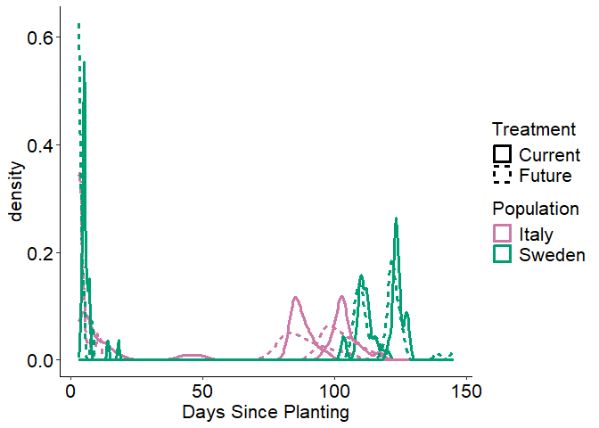<!-- -->

2022 - note: plants that died or were transplanted are not shown here because they may have an emergence date and no bolting date (if died) or a bolting date and no emergence date (if transplanted)

```
## Warning: Removed 14 rows containing non-finite outside the scale range
## (`stat_density()`).
```

```
## Warning: Removed 15 rows containing non-finite outside the scale range
## (`stat_density()`).
```

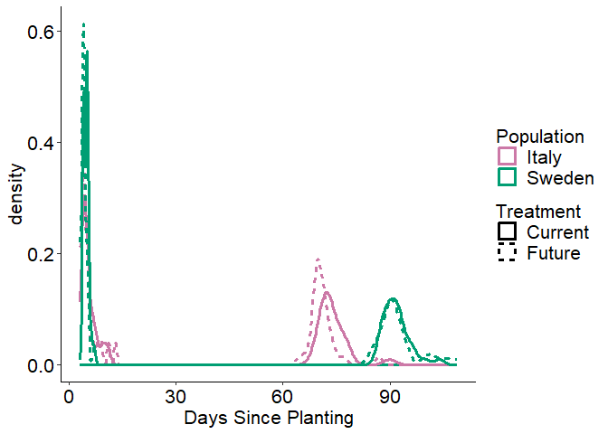<!-- -->


Takeaways: phenology is quicker for both populations in the 2022 experiment. In 2022, Italy bolts around 70 days post planting but it is closer to 85 days in 2021. Similarly, in 2021 Sweden takes over 100 days to bolt but it bolted at about 90 days in 2022. There were some experimental differences (like light and the chambers used and the conditions through vernalization) that could contribute to this difference. 

# 2021 only

Reaction norms to make here: \
- DaysToBolting(b/c exp differences) \
- DaysBoltingToFlwr \
- LeafNum_duringvern (if included) \
- LeafNum_Oct4 (if included) \
- RosetteLeafNum_harvest \
- RosetteDry_harvest \
- DryReproG \
- Repro_to_Ros \
- LatBranches \
- PrimaryStalks \
- Height_cm \
- IJ_FruitCount (alsokept other fruit count in the forplot table just cause) \
- AG_biomass (Ros+Repro) \
- fitness \
- AvgSeedWt \
- AvgSeedNum \
- NumFlwrLeft (no model as of 7/31/2024, not included here, not measured for everything) \


## Phenology

Days Emergence to bolting

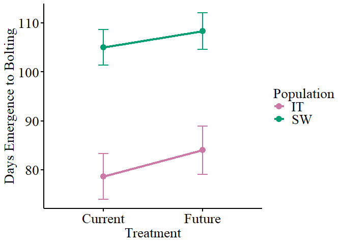<!-- -->


DaysBoltingToFlwr


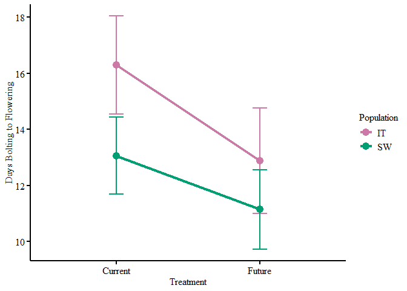<!-- -->


Days Emergence to Flower
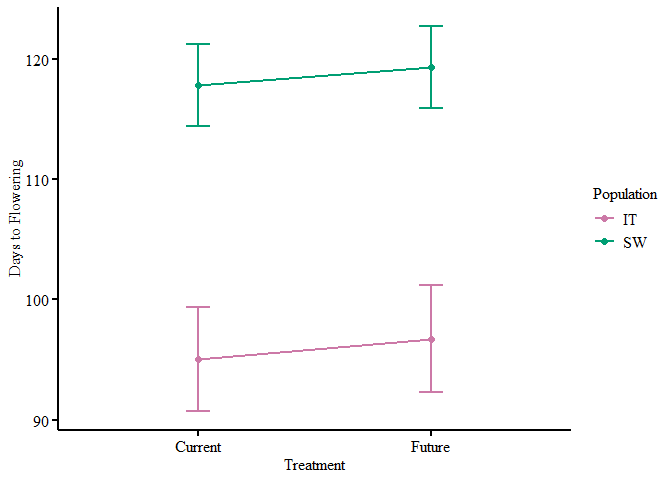<!-- -->

## Leaf Number
LeafNum_duringvern (if included)

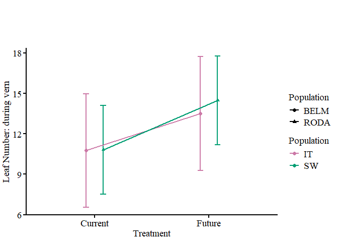<!-- -->

LeafNum_Oct4 (if included)

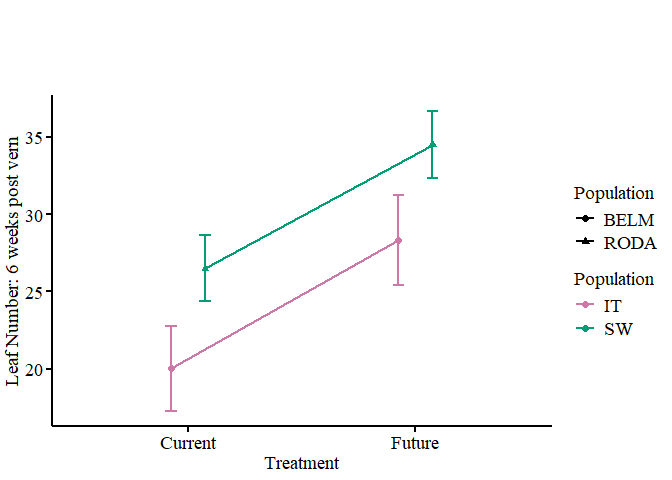<!-- -->

RosetteLeafNum_harvest

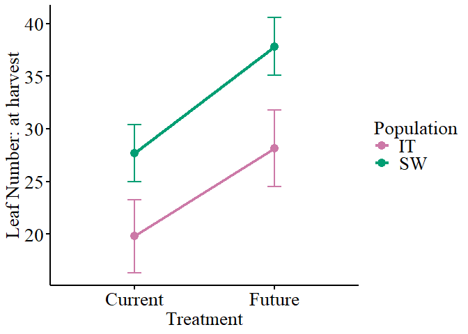<!-- -->

Create an extra figure to look at growth curves during this time. I want one line per population and 4 x axis values with the y axis being leaf number.


``` r
# format a dataframe
tmp_mean_21 <- Dat_2021 %>%
  dplyr::group_by(Population) %>%
  dplyr::group_by(Treatment, .add = TRUE) %>%
  summarize(across(.col = c(LeafNum_.07222021, LeafNum_08262021, RosetteLeafNum_10042021, RosetteLeafNum), .fns = list(mean = ~mean(.x, na.rm = TRUE, .group = "keep"))))
```

```
## `summarise()` has grouped output by 'Population'. You can override using the
## `.groups` argument.
```

``` r
# pivot
tmp_mean_21 <- pivot_longer(tmp_mean_21, cols = !(c(Population, Treatment)), names_to = "Time", values_to = "mean")
tmp_mean_21$Time <- factor(rep(c("Week5", "Week10", "Week14", "Harvest"), times = 4), levels = c("Week5", "Week10", "Week14", "Harvest"))

tmp_ci_21 <- Dat_2021 %>%
  dplyr::group_by(Population) %>%
  dplyr::group_by(Treatment, .add = TRUE) %>%
  summarize(across(.col = c(LeafNum_.07222021, LeafNum_08262021, RosetteLeafNum_10042021, RosetteLeafNum), .fns = list(ci_95 = ~conf_int(.x))))
```

```
## `summarise()` has grouped output by 'Population'. You can override using the
## `.groups` argument.
```

``` r
# pivot
tmp_ci_21 <- pivot_longer(tmp_ci_21, cols = !(c(Population, Treatment)), names_to = "Time", values_to = "ci")
tmp_ci_21$Time <- factor(rep(c("Week5", "Week10", "Week14", "Harvest"), times = 4), levels = c("Week5", "Week10", "Week14", "Harvest"))

forplot3_2021 <- merge(tmp_mean_21, tmp_ci_21)

# plot
ggplot(data = forplot3_2021, aes(x = Time, y = mean)) +
  geom_point(aes(col=Population, shape = Population), size = 2, show.legend = TRUE) +
  #geom_errorbar(aes(ymin=mean-ci, ymax = mean + ci, col = Population), width = 0.1, size = 0.8, show.legend = TRUE)+
  geom_line(aes(group = Treatment:Population, col = Population, linetype = Treatment), size = 1)+ 
  labs(y="Leaf Number", 
      x="Treatment")+
  scale_color_manual(name = "Population",
                     labels = c("IT", "SW"),
                     values = c("#CC79A7", "#009E73"))+
  scale_x_discrete(expand = c(0.2,0))
```

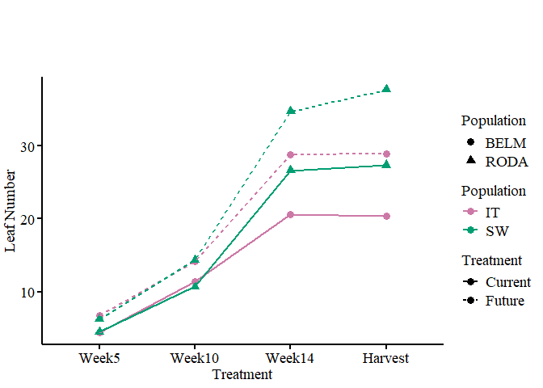<!-- -->

## Plant Structure
RosetteDry_harvest

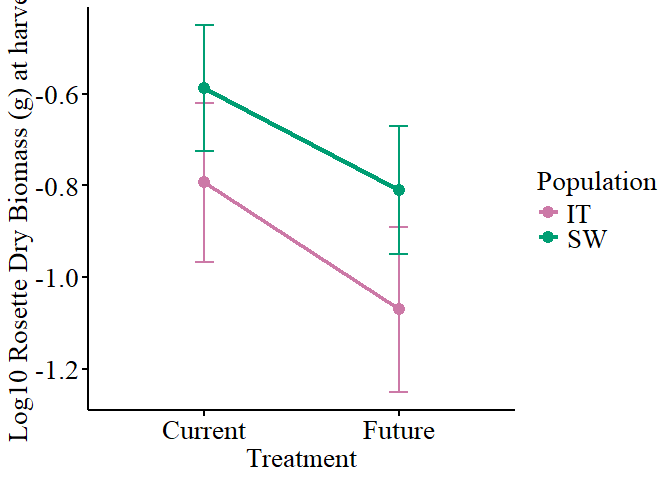<!-- -->

DryReproG

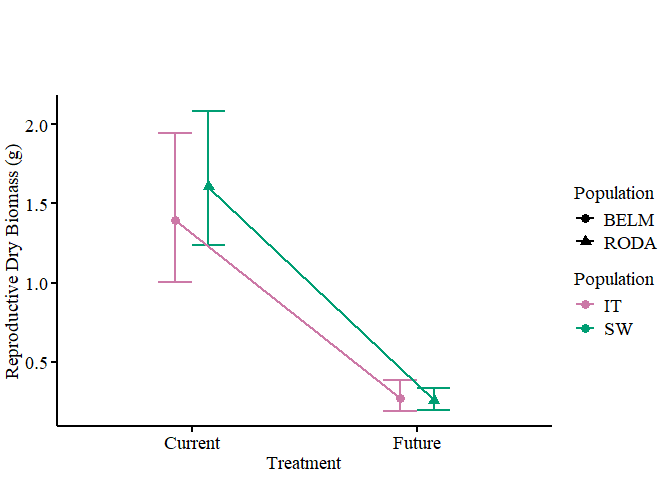<!-- -->

AG_biomass (Ros+Repro)

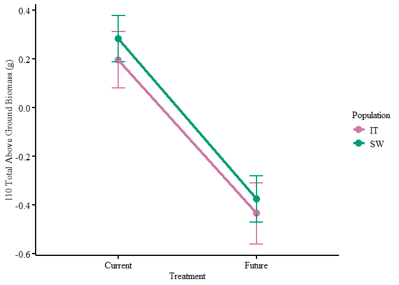<!-- -->

Repro_to_Ros

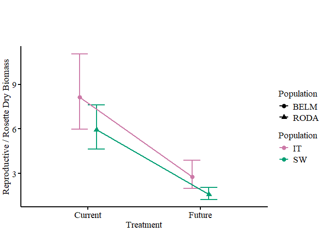<!-- -->

LatBranches

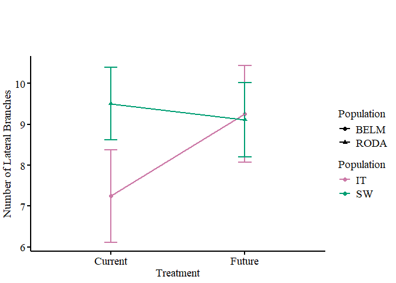<!-- -->

PrimaryStalks - how many stalks are coming out of the top of the rosette?

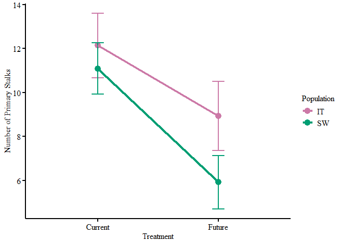<!-- -->

Height_cm (of main stalk)

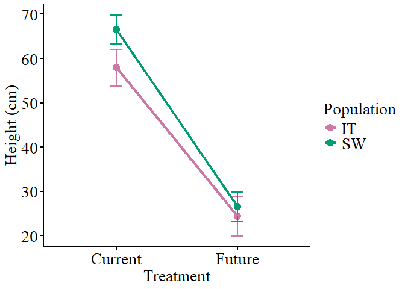<!-- -->

## fitness + fitness related

FruitCount - Basia

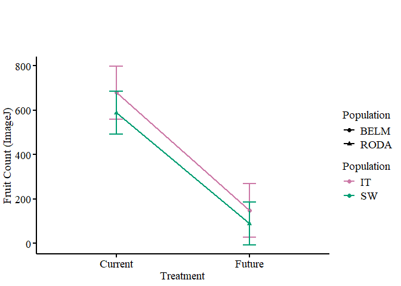<!-- -->

AvgSeedWt

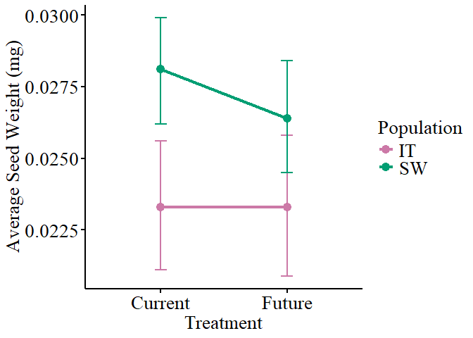<!-- -->

AvgSeedNum

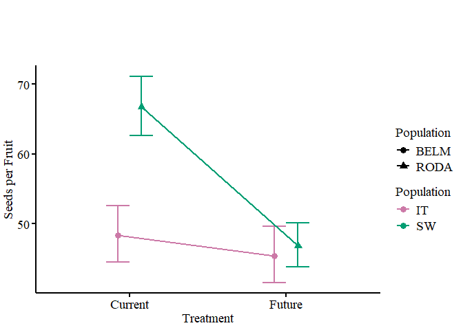<!-- -->

fitness - avg seed num/fruit * fruit num

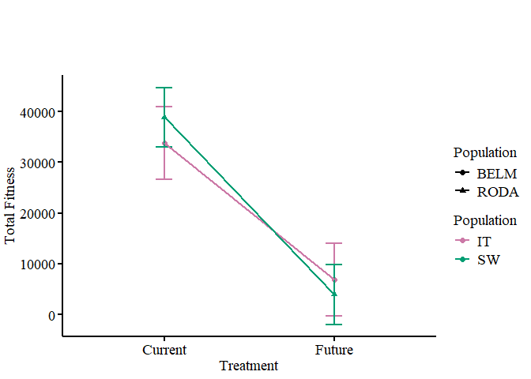<!-- -->


## graphs by line - include?

Let's look at some things by line instead of Population.

For now, only making a graph by line for seeds per fruit because I want to see if there truly is little variation between lines within a population.The confidence intervals are decently small guess. 


``` r
Dat_2021$Line.ID <- as.factor(paste0(Dat_2021$Population, Dat_2021$Line))

forplot2_2021 <- Dat_2021 %>%
  dplyr::group_by(Treatment) %>%
  dplyr::group_by(Line.ID, .add = TRUE) %>%
  summarize(across(.col = c(Emergence:LeafNum_08262021, RosetteLeafNum_10042021, RosetteLeafNum:DryReproG, Repro_to_Ros, LatBranches:IJ_FruitCount, AG_biomass, AvgSeedWt, AvgSeedNum, fitness), .fns = list(mean = ~mean(.x, na.rm = TRUE, .group = "keep"), ci_95 = ~conf_int(.x))))
```

```
## Warning: There were 56 warnings in `summarize()`.
## The first warning was:
## ℹ In argument: `across(...)`.
## ℹ In group 1: `Treatment = Current` and `Line.ID = BELM1`.
## Caused by warning in `qt()`:
## ! NaNs produced
## ℹ Run `dplyr::last_dplyr_warnings()` to see the 55 remaining warnings.
```

```
## `summarise()` has grouped output by 'Treatment'. You can override using the
## `.groups` argument.
```

``` r
# some lines only have 1 pot per treatment
# some lines only have pots in one treatment (3)
forplot2_2021$Population <- substr(forplot2_2021$Line.ID, start = 1, stop = 4)

# Avg Seeds per fruit
ggplot(data = forplot2_2021, aes(x = Treatment, y = AvgSeedNum_mean)) +
  geom_point(aes(col=Population, shape = Population), size = 2, alpha = 0.7, show.legend = TRUE) +
  #geom_errorbar(aes(group = Line.ID, ymin=AvgSeedNum_mean-AvgSeedNum_ci_95, ymax = AvgSeedNum_mean + AvgSeedNum_ci_95, col = Population), width = 0.1, size = 0.8, alpha = 0.7, show.legend = TRUE)+
  geom_line(aes(group = Line.ID, col = Population), size = 0.7, alpha = 0.7)+
  #geom_line(data = forplot_2021, aes(group = Population, col = Population), size= 1.5)+
  #geom_point(data = forplot_2021, aes(col = Population), size = 2, show.legend = TRUE)+
  labs(y="Average Seeds/Fruit", 
      x="Treatment")+
  scale_color_manual(name = "Population",
                     labels = c("IT", "SW"),
                     values = c("#CC79A7", "#009E73"))+
  scale_x_discrete(expand = c(0.6,0))
```

```
## Warning: Removed 4 rows containing missing values or values outside the scale range
## (`geom_point()`).
```

```
## Warning: Removed 4 rows containing missing values or values outside the scale range
## (`geom_line()`).
```

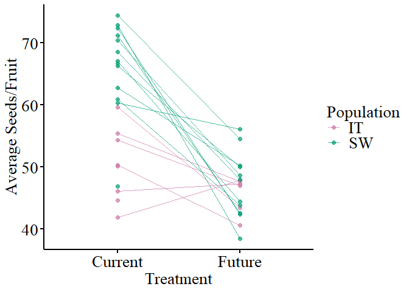<!-- -->

This truly shows little variation in line means within each population and treatment. huh. The error bars are very large and maybe skewing the scale so now plotting without error bars and looking at a histogram of means just to see it a different way.


``` r
ggplot(dat = forplot2_2021)+
  geom_histogram(aes(x = AvgSeedNum_mean, fill = Population), binwidth = 3, alpha = 0.5, position = "identity")+
  scale_fill_manual(name = "Population",
                     labels = c("IT", "SW"),
                     values = c("#CC79A7", "#009E73"))
```

```
## Warning: Removed 4 rows containing non-finite outside the scale range
## (`stat_bin()`).
```

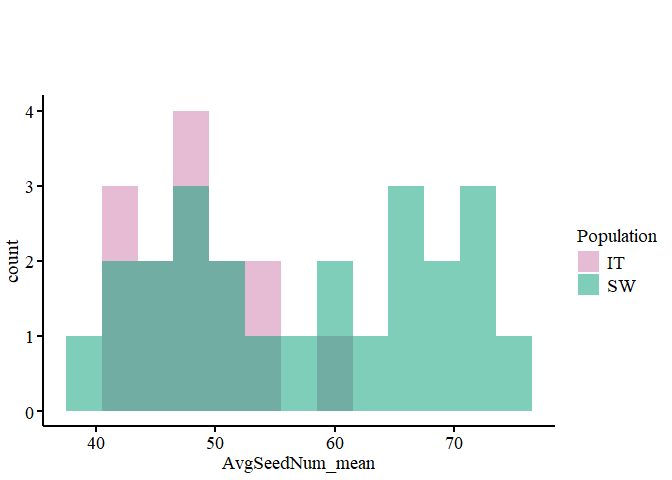<!-- -->

``` r
ggplot(dat = forplot2_2021)+
  geom_histogram(aes(x = AvgSeedNum_mean, fill = Treatment), binwidth = 3, alpha = 0.5, position = "identity")+
  scale_fill_manual(name = "Treatment",
                     labels = c("Current", "Future"),
                     values = c("#56B4E9", "#D55E00"))
```

```
## Warning: Removed 4 rows containing non-finite outside the scale range
## (`stat_bin()`).
```

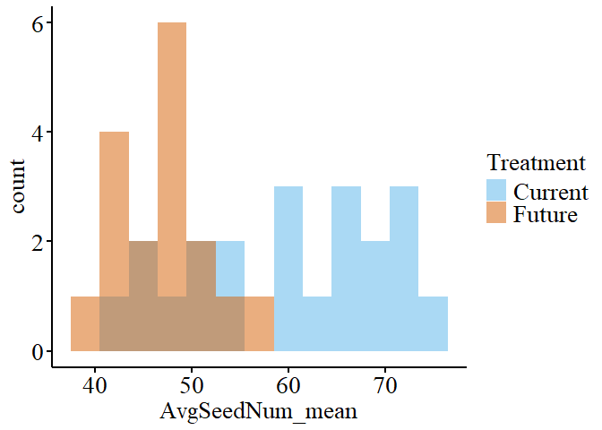<!-- -->


# 2022 only

Graphs to make here: \
- LeafNum_Jun6 (if included) \
- LeafNum_Jun13 (if included) \
- LeafNum_bolt \
- AG_Dry_bolt \
- BG_Dry_bolt \
- Root_to_Shoot \
- Stomata_density \

Note: skipping days from emergence to bolting because most of that time is the same treatment. Might want it later but no visualization of that for 2022 at all in this code as of 8/22/2024

## Leaf Number
LeafNum_Jun6 (if included)

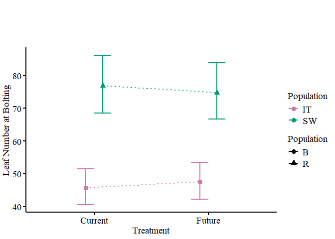<!-- -->

LeafNum_Jun13 (if included)

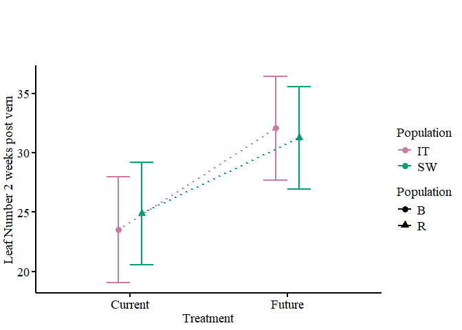<!-- -->

LeafNum_bolt

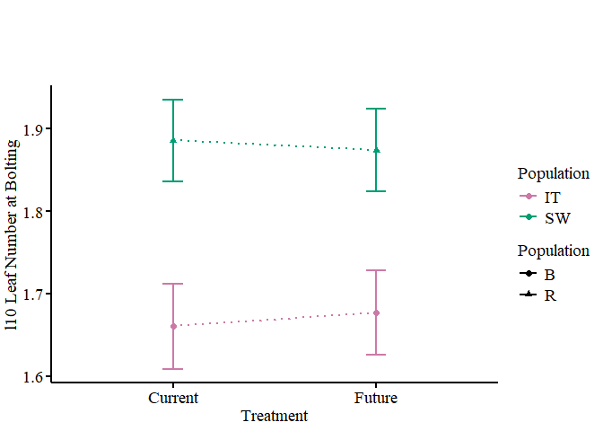<!-- -->

Create an extra figure to look at growth curves during this time. I want one line per population and 4 x axis values (4 weeks, post vern, 2 weeks post vern) with the y axis being leaf number.


``` r
# format a dataframe
tmp_mean <- Dat_2022 %>%
  dplyr::group_by(Population) %>%
  dplyr::group_by(Treatment, .add = TRUE) %>%
  summarize(across(.col = c(LeafNumber_PreVern:LeafNumber_Jun13, LeafNumber_Total), .fns = list(mean = ~mean(.x, na.rm = TRUE, .group = "keep"))))
```

```
## `summarise()` has grouped output by 'Population'. You can override using the
## `.groups` argument.
```

``` r
# pivot
tmp_mean <- pivot_longer(tmp_mean, cols = !(c(Population, Treatment)), names_to = "Time", values_to = "mean")
tmp_mean$Time <- factor(rep(c("Week5", "Week9", "Week10", "Bolting"), times = 4), levels = c("Week5", "Week9", "Week10", "Bolting"))

tmp_ci <- Dat_2022 %>%
  dplyr::group_by(Population) %>%
  dplyr::group_by(Treatment, .add = TRUE) %>%
  summarize(across(.col = c(LeafNumber_PreVern:LeafNumber_Jun13, LeafNumber_Total), .fns = list(ci_95 = ~conf_int(.x))))
```

```
## `summarise()` has grouped output by 'Population'. You can override using the
## `.groups` argument.
```

``` r
# pivot
tmp_ci <- pivot_longer(tmp_ci, cols = !(c(Population, Treatment)), names_to = "Time", values_to = "ci")
tmp_ci$Time <- factor(rep(c("Week5", "Week9", "Week10", "Bolting"), times = 4), levels = c("Week5", "Week9", "Week10", "Bolting"))

forplot3_2022 <- merge(tmp_mean, tmp_ci)

# plot
ggplot(data = forplot3_2022, aes(x = Time, y = mean)) +
  geom_point(aes(col=Population, shape = Population), size = 2, show.legend = TRUE) +
  #geom_errorbar(aes(ymin=mean-ci, ymax = mean + ci, col = Population), width = 0.1, size = 0.8, show.legend = TRUE)+
  geom_line(aes(group = Treatment:Population, col = Population, linetype = Treatment), size = 1)+ 
  labs(y="Leaf Number", 
      x="Treatment")+
  scale_color_manual(name = "Population",
                     labels = c("IT", "SW"),
                     values = c("#CC79A7", "#009E73"))+
  scale_x_discrete(expand = c(0.2,0))
```

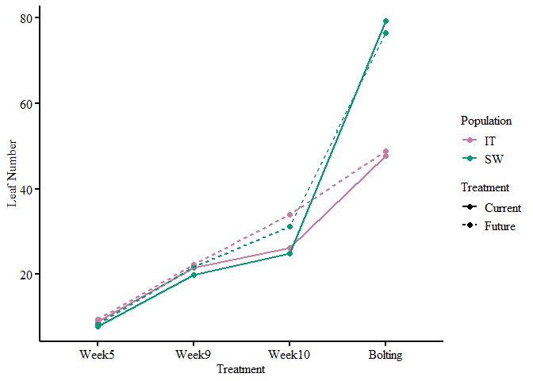<!-- -->


## Biomass
AG_Dry_bolt

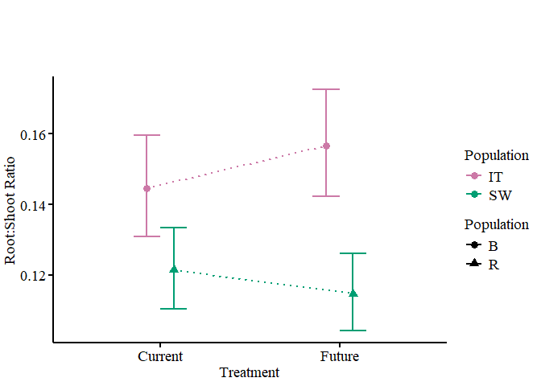<!-- -->

```
## [1] -0.2225461
```

```
## [1] -0.02154174
```

BG_Dry_bolt

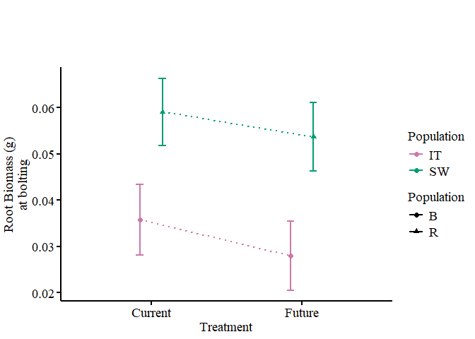<!-- -->

```
## [1] -0.2170143
```

```
## [1] -0.09097503
```

Root_to_Shoot

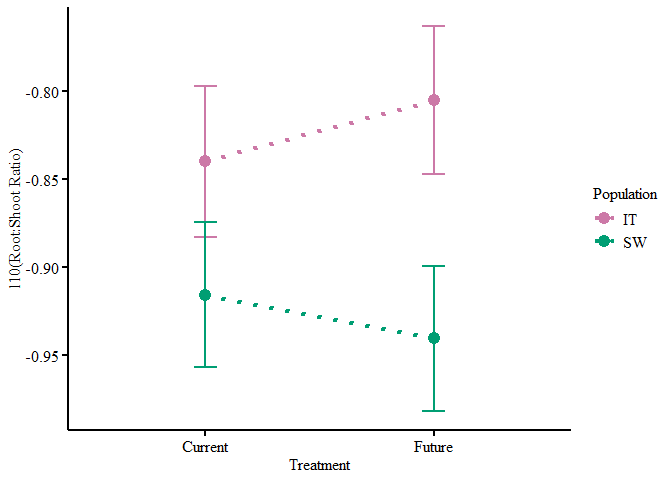<!-- -->

## Stomata
Stomata Density

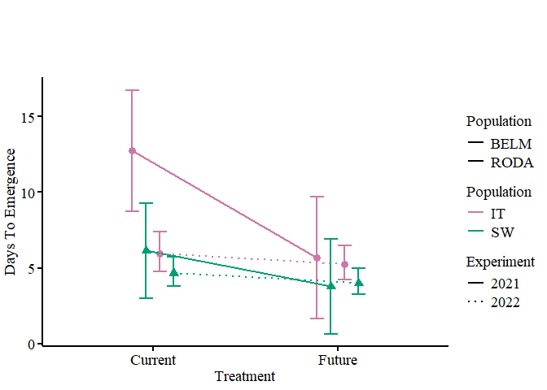<!-- -->

# both
Steps to be completed here.
Subset 2021 dataset. add 2021 column. Subset 2022 dataset. add 2022 column. merge - rbind for each trait. format. plot.

Reaction Norms to create here: \
- Emergence \
- EmergenceToBolting \
- FreshWt \
- HydWt \
- DryWt \
- LeafArea \
- LeafPerimeter \
- SLA \
- LDMC \
- RWC \
- LeafNum_4weeks \


``` r
# subset 2021 dataset
both_exp <- c("emergence_means_21", "bolting_means_21", "fresh_means_21", "sat_means_21", "dry_means_21", "area_means_21", "per_means_21", "SLA_means_21", "LDMC_means_21", "RWC_means_21", "LN_PreVern_means_21")
both_2021 <- Means_2021[both_exp]
both_2021 <- lapply(both_2021, cbind, Exp = as.factor(c("2021")))

# subset 2022 dataset
both_exp2 <- c("emergence_means_22", "bolting_means_22", "fresh_means_22", "hyd_means_22", "dry_means_22", "area_means_22", "per_means_22", "sla_means_22", "ldmc_means_22", "rwc_means_22", "LN_PreVern_means_22")
both_2022 <- Means_2022[both_exp2]
# change B and R to Belm and Roda
for (i in 1:length(both_2022)){
  both_2022[[i]]$Population <- as.character(both_2022[[i]]$Population)
  both_2022[[i]][both_2022[[i]]$Population == "B", "Population"] <- "BELM"
  both_2022[[i]][both_2022[[i]]$Population == "R", "Population"] <- "RODA"
  both_2022[[i]]$Population <- as.factor(both_2022[[i]]$Population)
}
both_2022 <- lapply(both_2022, cbind, Exp = as.factor(c("2022")))


# merge - do this within a loop
mylist.names <- c("emergence", "bolting", "fresh", "hyd", "dry", "area", "per", "sla", "ldmc", "rwc", "LN")
both_dfs <-  vector("list", length(mylist.names))
names(both_dfs) <- mylist.names

for (i in 1:length(both_dfs)){
  both_dfs[[i]] <- bind_rows(both_2021[[i]], both_2022[[i]])
}
```


## Phenology

Emergence. days to emergence is shown for both but should be interpreted with caution. In the 2022 experiment, all plants were put in the same conditions so there may be genetic differences but treatment differences would be due to chamber placement not due to temperature or water availability.

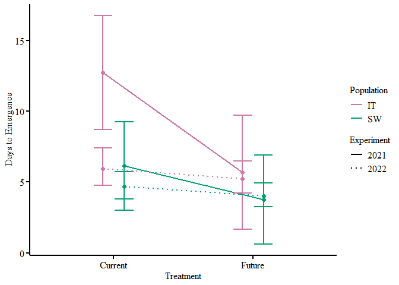<!-- -->


EmergenceToBolting. While this was measured in both experiments, it is not comparable becuase in 2022 the conditions were the same for all plants for the first 9 weeks, which is more of the time until the plants start to bolt. Emergence to bolting was moved to an only 2021 trait for the manuscript.

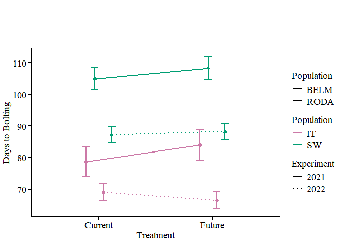<!-- -->


## Single Leaf Individual Traits
FreshWt


HydWt


DryWt


LeafArea


LeafPerimeter


## Single Leaf Calculated Traits
Specific Leaf Area

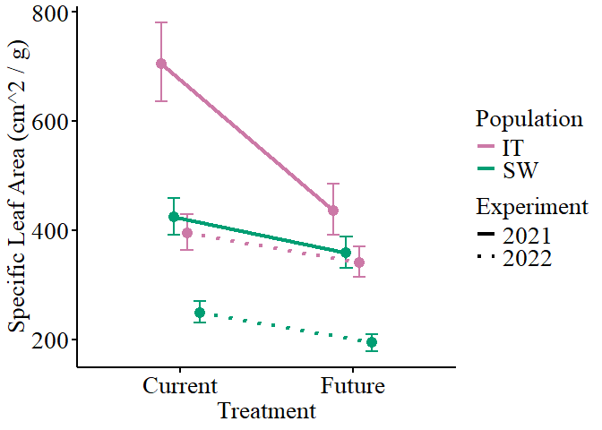<!-- -->

```
## Saving 7 x 5 in image
```


Leaf Dry Matter Content

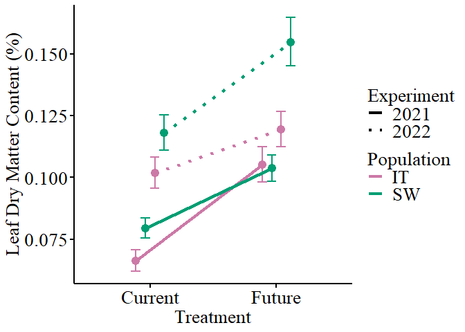<!-- -->


Relative Water Content

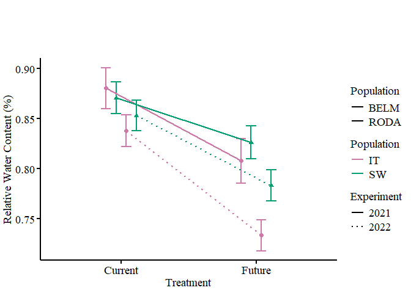<!-- -->

## Leaf Number
LeafNum_4weeks

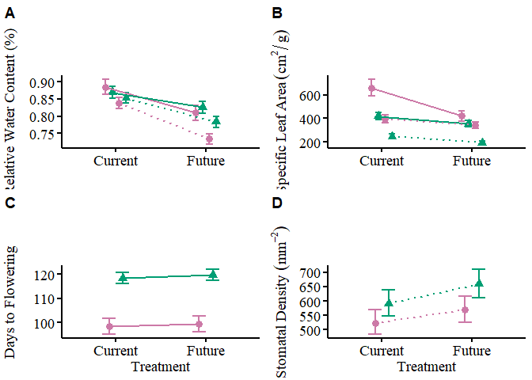<!-- -->

# Manuscript Figures
creating multipanel figures for the manuscript. Updated 4/17/2025 with ideas for cutting down/restructuring results to focus on avoidance/escape. Updated 5/28/2025 with different figure order. Updated 7/1/2025 with a single figure for all main results.

Draft 2 figures updated 7/3/2025 \
Draft 3 figures updated 7/30/2025 \


``` r
fig1 <- ggarrange(rwc+rremove("xlab"), sla+rremove("xlab"), detf, stoden,
                  labels = c("A", "B", "C", "D"),
                  ncol = 2, nrow = 2,
                  common.legend = TRUE, # goes based on the first plot
                  legend = "top",
                  align = "hv"
)
#label.x = c(0, -0.1, -0.1, -0.1, -0.1, 0)
#vjust = 00
fig1
```

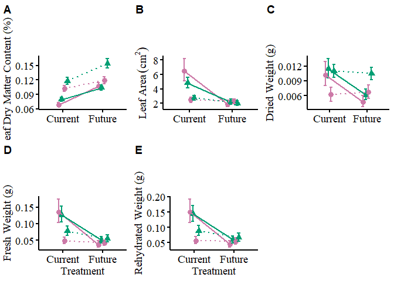<!-- -->

``` r
fig2 <- ggarrange(rs, ros_2022, bg,
                  labels = c("A", "B", "C"),
                  ncol = 3, nrow = 1,
                  common.legend = TRUE,
                  legend = "top",
                  align = "hv")
fig2
```

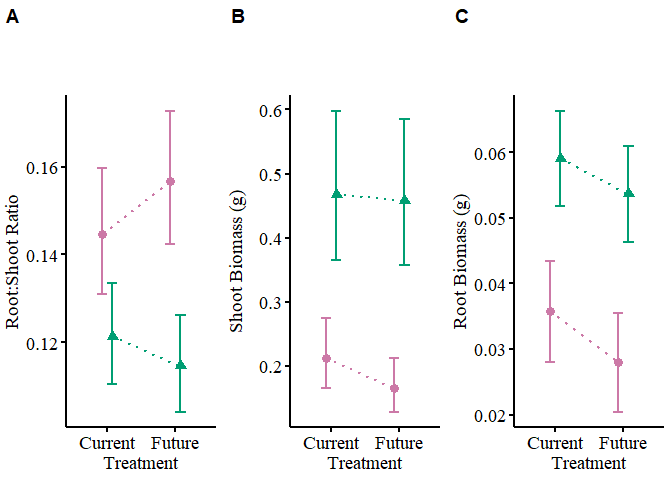<!-- -->

``` r
fitness_fig <- ggarrange(fruits, seed_per_fruit, fitness,
                  labels = c("A", "B", "C"),
                  ncol = 3, nrow = 1,
                  common.legend = TRUE,
                  legend = "top",
                  align = "h"
)
fitness_fig
```

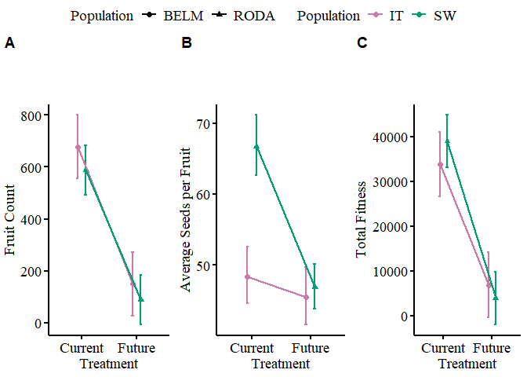<!-- -->


Old for label.x adjustment reminder if I need it again\


# supplemental figures

Figure s1 - single leaf traits \

``` r
figs1 <- ggarrange(freshwt+rremove("xlab"), hydwt+rremove("xlab"), drywt, area, perim, ldmc,
                  labels = c("A", "B", "C", "D", "E", "F"),
                  ncol = 3, nrow = 2,
                  common.legend = TRUE,
                  legend = "top",
                  align = "h"
                  )
figs1
```

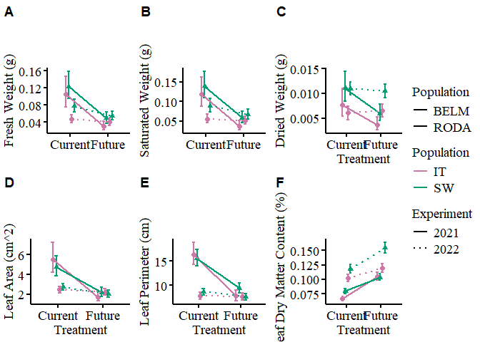<!-- -->

Figure s2 - biomass + fitness \

``` r
figs2 <- ggarrange(ros_2021+rremove("xlab"), repro+rremove("xlab"), ln_harv+rremove("xlab"),  ln_bolt, rr, seed_wt,
                  labels = c("A", "B", "C", "D", "E", "F"),
                  ncol = 3, nrow = 2,
                  common.legend = TRUE,
                  legend = "top",
                  align = "h"
                  )
figs2
```

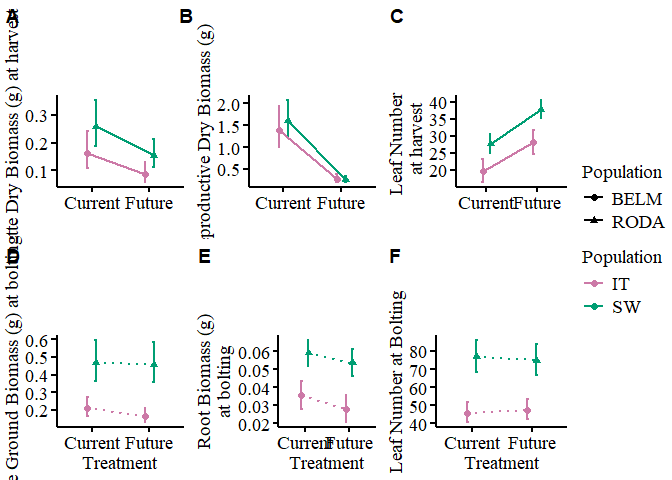<!-- -->


Create Legend for main figures

For the traits figure, I need the colors with the shaped points and I need the line types with the years of the experiment

``` r
legend_points <- data.frame(xvals = c(1.1, 1.1), yvals = c(4, 3), text = c("Italy", "Sweden"), Pop = as.factor(c("IT", "SW")))
#legend_lines <- c(xvals = c(1, 1), yvals = c(2, 1), text = c("2021", "2022"))

# legend to take up space of a plot
ggplot()+
  geom_point(data = legend_points, aes(x = xvals, y = yvals, col = Pop, shape = Pop), size = 4, show.legend = FALSE)+
  geom_segment(aes(x = 1.09, y = 2, xend = 1.11, yend = 2), linetype = "solid", linewidth = 1.25)+
  geom_segment(aes(x = 1.09, y = 1, xend = 1.11, yend = 1), linetype = "dotted", linewidth = 1.25)+
  geom_text(aes(x = c(1.11, 1.11, 1.115, 1.115), y = c(4, 3, 2, 1), label = c("Italy", "Sweden", "2021", "2022")))+
  scale_color_manual(name = "Population",
                     labels = c("IT", "SW"),
                     values = c("#CC79A7", "#009E73"))+
  xlim(c(1.087, 1.12))+
  theme_void()
```

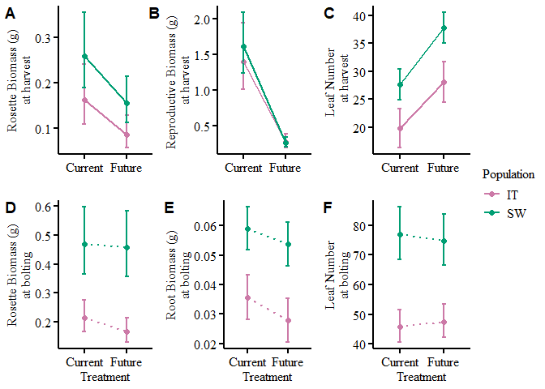<!-- -->

``` r
  #theme(plot.margin = margin(t = 0, r = 0.5, b = 0.075, l=0, unit = "in"))

# top legend
legend_points2 <- data.frame(xvals = c(1, 1.5), yvals = c(1, 1), text = c("Italy", "Sweden"), Pop = as.factor(c("IT", "SW")))
legend_fig <- ggplot()+
  geom_point(data = legend_points2, aes(x = xvals, y = yvals, col = Pop, shape = Pop), size = 4, show.legend = FALSE)+
  geom_segment(aes(x = 2.2, y = 1, xend = 2.7, yend = 1), linetype = "solid", linewidth = 1.25)+
  geom_segment(aes(x = 3.2, y = 1, xend = 3.7, yend = 1), linetype = "dotted", linewidth = 1.25)+
  geom_text(aes(x = c(1.2, 1.8, 2.9, 3.9), y = c(1, 1, 1, 1), label = c("Italy", "Sweden", "2021", "2022")))+
  scale_color_manual(name = "Population",
                     labels = c("IT", "SW"),
                     values = c("#CC79A7", "#009E73"))+
  xlim(c(0.087, 4.12))+
  theme_void()
legend_fig
```

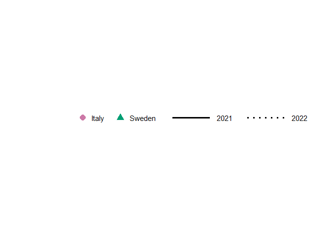<!-- -->


##Save figures

``` r
# trait figs
ggsave(fig1, filename = "figures/fig1.jpg", width = 6, height = 8, units = "in", dpi = 300)
ggsave(fig2, filename = "figures/fig2.jpg", width = 9, height = 4, units = "in", dpi = 300)

# fitness fig
ggsave(fitness_fig, filename = "figures/fig3.jpg", width = 9, height = 4, units = "in", dpi = 300)

# legend_fig
ggsave(legend_fig, filename = "figures/legend_fig.jpg", width = 6, height = 0.5, units = "in", dpi = 300)

#fig1
#ggsave(fig1, filename = "figures/fig1.jpg", width = 5, height = 4, units = "in", dpi = 300)


#figs1
ggsave(figs1, filename = "figures/figs1.jpg", width = 7, height = 8, units = "in", dpi = 300)

#figs2
ggsave(figs2, filename = "figures/figs2.jpg", width = 7, height = 8, units = "in", dpi = 300)
```

